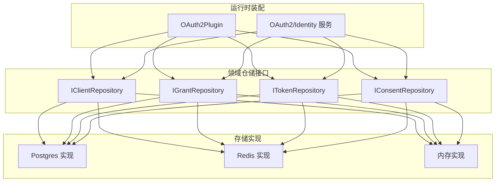
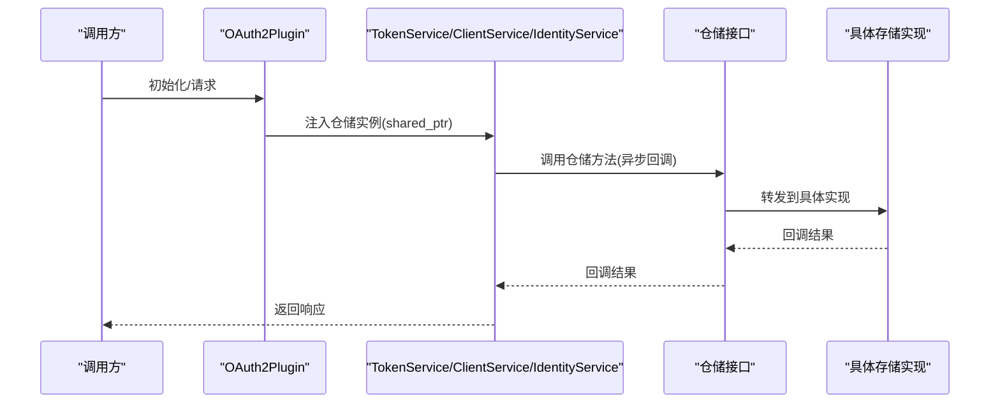
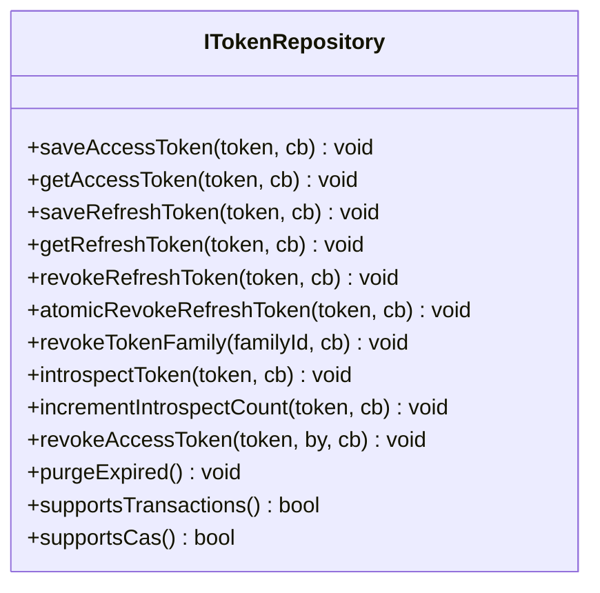
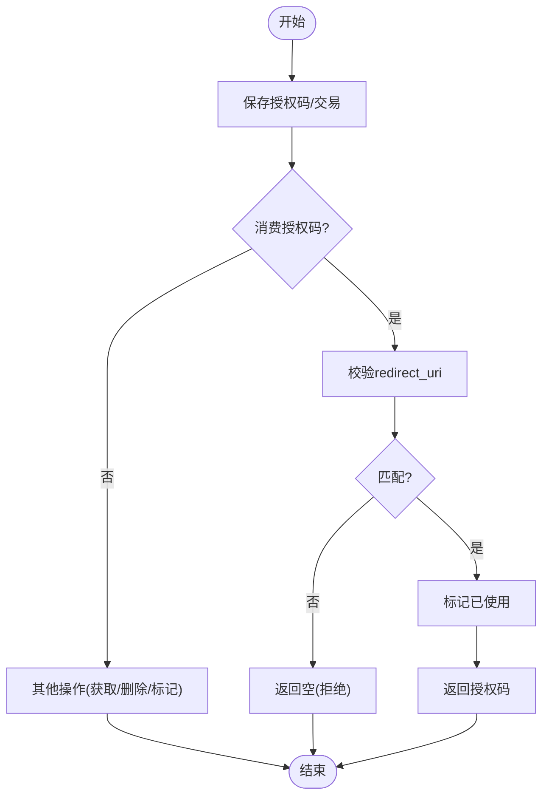
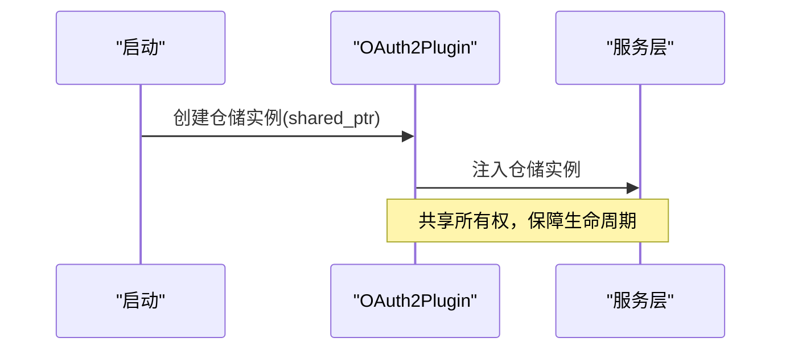
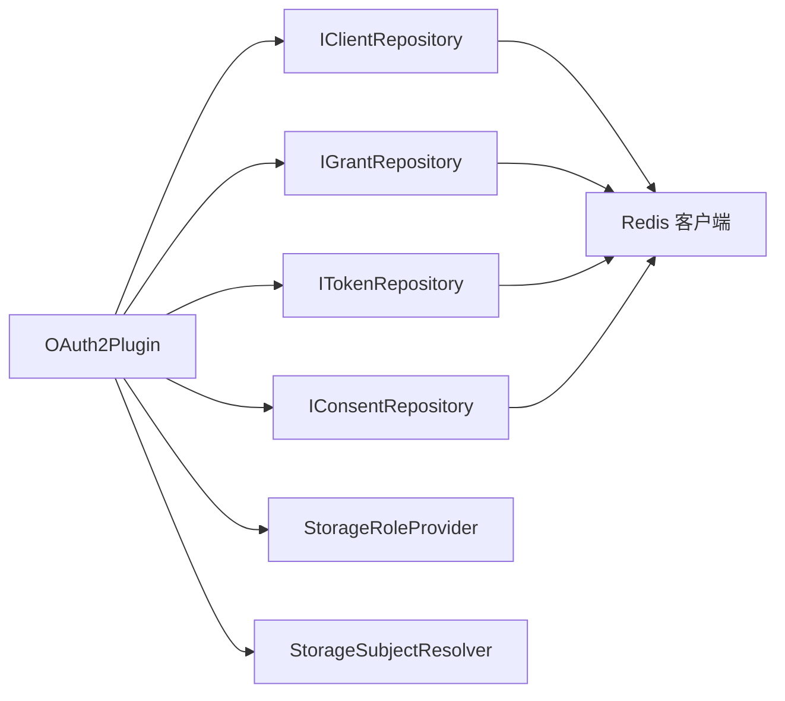

# 存储适配器接口规范

<cite>
**本文引用的文件**
- [ITokenRepository.h](file://libs/oauth2/include/authforge/oauth2/repository/ITokenRepository.h)
- [IClientRepository.h](file://libs/oauth2/include/authforge/oauth2/repository/IClientRepository.h)
- [IGrantRepository.h](file://libs/oauth2/include/authforge/oauth2/repository/IGrantRepository.h)
- [IConsentRepository.h](file://libs/oauth2/include/authforge/oauth2/repository/IConsentRepository.h)
- [OAuth2Plugin.cc](file://libs/drogon/src/plugin/OAuth2Plugin.cc)
- [StorageRoleProvider.h](file://libs/drogon/include/authforge/drogon/adapters/StorageRoleProvider.h)
- [StorageSubjectResolver.h](file://libs/drogon/include/authforge/drogon/adapters/StorageSubjectResolver.h)
- [CachedClientRepository.h](file://libs/storage-redis/include/authforge/storage/redis/CachedClientRepository.h)
- [CMakeLists.txt (storage-redis)](file://libs/storage-redis/CMakeLists.txt)
- [TokenRepositoryContractTest.cc](file://tests/contract/TokenRepositoryContractTest.cc)
- [ClientRepositoryContractTest.cc](file://tests/contract/ClientRepositoryContractTest.cc)
</cite>

## 目录
1. [简介](#简介)
2. [项目结构](#项目结构)
3. [核心组件](#核心组件)
4. [架构总览](#架构总览)
5. [详细组件分析](#详细组件分析)
6. [依赖关系分析](#依赖关系分析)
7. [性能考量](#性能考量)
8. [故障排查指南](#故障排查指南)
9. [结论](#结论)
10. [附录](#附录)

## 简介
本规范定义 AuthForge 的存储抽象层与存储适配器接口，目标是解耦业务服务与具体持久化实现，提供统一的仓储（Repository）契约，使上层 OAuth2/身份认证流程可透明切换 Postgres、Redis、内存等后端。文档重点说明 IStorageRepository 的设计思想（以聚合为中心的仓储拆分）、各仓储接口的职责边界、事务与 CAS 能力声明、异步回调模型、生命周期管理与依赖注入方式，并给出自定义存储适配器的实现要求、错误处理模式、性能优化建议以及注册配置示例路径。

## 项目结构
存储抽象位于 libs/oauth2/include/authforge/oauth2/repository，按领域聚合拆分为多个仓储接口：客户端、授权码/交易、令牌、同意记录。具体实现位于 storage-postgres、storage-redis、storage-memory 等模块；Drogon 插件负责装配仓储实例并注入到服务层。

图表来源
- [OAuth2Plugin.cc:161-191](file://libs/drogon/src/plugin/OAuth2Plugin.cc#L161-L191)
- [ITokenRepository.h:1-177](file://libs/oauth2/include/authforge/oauth2/repository/ITokenRepository.h#L1-L177)
- [IClientRepository.h:1-65](file://libs/oauth2/include/authforge/oauth2/repository/IClientRepository.h#L1-L65)
- [IGrantRepository.h:1-115](file://libs/oauth2/include/authforge/oauth2/repository/IGrantRepository.h#L1-L115)
- [IConsentRepository.h:1-78](file://libs/oauth2/include/authforge/oauth2/repository/IConsentRepository.h#L1-L78)

章节来源
- [OAuth2Plugin.cc:161-191](file://libs/drogon/src/plugin/OAuth2Plugin.cc#L161-L191)
- [ITokenRepository.h:1-177](file://libs/oauth2/include/authforge/oauth2/repository/ITokenRepository.h#L1-L177)
- [IClientRepository.h:1-65](file://libs/oauth2/include/authforge/oauth2/repository/IClientRepository.h#L1-L65)
- [IGrantRepository.h:1-115](file://libs/oauth2/include/authforge/oauth2/repository/IGrantRepository.h#L1-L115)
- [IConsentRepository.h:1-78](file://libs/oauth2/include/authforge/oauth2/repository/IConsentRepository.h#L1-L78)

## 核心组件
- IClientRepository：客户端注册与凭据校验（读为主）。
- IGrantRepository：授权码与授权交易的保存、消费、标记与清理。
- ITokenRepository：访问令牌、刷新令牌及其生命周期（查询、撤销、家族撤销、内省、计数、过期清理），并提供 saveTokenPair 默认顺序实现与 supportsTransactions()/supportsCas() 能力标志。
- IConsentRepository：用户同意记录的查询、保存与撤销。

这些接口统一采用异步回调风格，避免阻塞线程；通过能力标志区分不同后端对事务与 CAS 的支持程度，便于测试套件与服务层做降级或增强策略。

章节来源
- [IClientRepository.h:29-62](file://libs/oauth2/include/authforge/oauth2/repository/IClientRepository.h#L29-L62)
- [IGrantRepository.h:27-112](file://libs/oauth2/include/authforge/oauth2/repository/IGrantRepository.h#L27-L112)
- [ITokenRepository.h:21-173](file://libs/oauth2/include/authforge/oauth2/repository/ITokenRepository.h#L21-L173)
- [IConsentRepository.h:18-75](file://libs/oauth2/include/authforge/oauth2/repository/IConsentRepository.h#L18-L75)

## 架构总览
存储抽象层将“聚合”作为第一公民，每个聚合对应一个仓储接口。服务层仅依赖接口，不感知具体存储。Drogon 插件在启动时创建并持有仓储实例，将其注入到 TokenService、ClientService、IdentityService 等，并通过 shared_ptr 保证生命周期覆盖所有服务调用。

图表来源
- [OAuth2Plugin.cc:161-191](file://libs/drogon/src/plugin/OAuth2Plugin.cc#L161-L191)
- [ITokenRepository.h:66-96](file://libs/oauth2/include/authforge/oauth2/repository/ITokenRepository.h#L66-L96)

章节来源
- [OAuth2Plugin.cc:161-191](file://libs/drogon/src/plugin/OAuth2Plugin.cc#L161-L191)

## 详细组件分析

### ITokenRepository 令牌仓储
- 职责：访问令牌、刷新令牌的存取、撤销、家族撤销、内省、计数、过期清理；提供原子保存令牌对的默认顺序实现。
- 关键方法：saveAccessToken/getAccessToken/saveRefreshToken/getRefreshToken/atomicRevokeRefreshToken/revokeTokenFamily/introspectToken/incrementIntrospectCount/revokeAccessToken/purgeExpired。
- 事务与 CAS：supportsTransactions() 声明是否对多写操作提供真正的事务原子性；supportsCas() 声明 atomicRevokeRefreshToken 是否具备真正的 CAS 语义。
- 默认行为：saveTokenPair 默认顺序执行两次写入（非事务），Postgres 实现应重写为事务包裹以保证原子性。

图表来源
- [ITokenRepository.h:36-173](file://libs/oauth2/include/authforge/oauth2/repository/ITokenRepository.h#L36-L173)

章节来源
- [ITokenRepository.h:21-173](file://libs/oauth2/include/authforge/oauth2/repository/ITokenRepository.h#L21-L173)

### IGrantRepository 授权码与交易仓储
- 职责：授权码的保存、获取、使用标记、原子消费（含 redirect_uri 校验）；授权交易的保存、获取、删除、消费标记；过期清理。
- 关键约束：consumeAuthCode 必须遵循 RFC 6749 的 redirect_uri 一致性校验，失败返回空。

图表来源
- [IGrantRepository.h:46-111](file://libs/oauth2/include/authforge/oauth2/repository/IGrantRepository.h#L46-L111)

章节来源
- [IGrantRepository.h:27-112](file://libs/oauth2/include/authforge/oauth2/repository/IGrantRepository.h#L27-L112)

### IClientRepository 客户端仓储
- 职责：按 ID 获取客户端信息、校验客户端凭据。
- 设计决策：不提供 purgeExpired()，因为当前模型中客户端注册无过期语义。

章节来源
- [IClientRepository.h:29-62](file://libs/oauth2/include/authforge/oauth2/repository/IClientRepository.h#L29-L62)

### IConsentRepository 同意记录仓储
- 职责：按用户+客户端+作用域检查/保存/撤销同意。
- 设计决策：不提供 purgeExpired()，同意记录无 TTL 字段且历史未清理。

章节来源
- [IConsentRepository.h:18-75](file://libs/oauth2/include/authforge/oauth2/repository/IConsentRepository.h#L18-L75)

### 生命周期管理与依赖注入
- 插件持有仓储实例并通过 shared_ptr 注入服务，确保存储生命周期覆盖所有服务调用，避免悬垂引用。
- 仓储实例由插件在启动阶段创建，服务层仅依赖接口，便于替换实现与测试。

图表来源
- [OAuth2Plugin.cc:161-191](file://libs/drogon/src/plugin/OAuth2Plugin.cc#L161-L191)

章节来源
- [OAuth2Plugin.cc:161-191](file://libs/drogon/src/plugin/OAuth2Plugin.cc#L161-L191)

### 缓存装饰器与分层存储
- Redis 仓储提供 CachedClientRepository 等缓存装饰器，对读多写少的聚合进行缓存，降低后端压力。
- 设计强调对单个仓储进行缓存装饰，而非对整个“上帝接口”包装，以降低失效复杂度。

章节来源
- [CachedClientRepository.h:1-200](file://libs/storage-redis/include/authforge/storage/redis/CachedClientRepository.h#L1-L200)
- [CMakeLists.txt (storage-redis):23-58](file://libs/storage-redis/CMakeLists.txt#L23-L58)

## 依赖关系分析
- 仓储接口位于 libs/oauth2，不依赖 OAuth2Plugin，方向单向：插件/服务依赖仓储接口，仓储实现依赖具体存储驱动。
- Redis 仓储实现依赖 Drogon nosql 客户端与 jsoncpp，用于序列化与缓存。
- 角色与主体解析通过 Drogon 适配器桥接到存储层。

图表来源
- [CMakeLists.txt (storage-redis):23-58](file://libs/storage-redis/CMakeLists.txt#L23-L58)
- [StorageRoleProvider.h:1-200](file://libs/drogon/include/authforge/drogon/adapters/StorageRoleProvider.h#L1-L200)
- [StorageSubjectResolver.h:1-200](file://libs/drogon/include/authforge/drogon/adapters/StorageSubjectResolver.h#L1-L200)

章节来源
- [CMakeLists.txt (storage-redis):23-58](file://libs/storage-redis/CMakeLists.txt#L23-L58)
- [StorageRoleProvider.h:1-200](file://libs/drogon/include/authforge/drogon/adapters/StorageRoleProvider.h#L1-L200)
- [StorageSubjectResolver.h:1-200](file://libs/drogon/include/authforge/drogon/adapters/StorageSubjectResolver.h#L1-L200)

## 性能考量
- 优先使用 supportsTransactions()/supportsCas() 能力标志选择强一致路径，避免在不支持的后端上误用事务/CAS。
- 对读多写少聚合（如客户端信息）启用缓存装饰器，减少后端压力。
- 批量与清理：利用 purgeExpired() 定期清理过期数据，控制存储膨胀。
- 异步回调：仓储方法均为异步回调，避免阻塞工作线程，提升吞吐。

[本节为通用指导，不直接分析具体文件]

## 故障排查指南
- 令牌对保存失败：当 saveTokenPair 回调 ok == false 时，表示至少有一项未持久化，应视为“未成功发放令牌”，向上层返回错误，避免静默成功导致后续内省/刷新失败。
- 并发冲突：测试用例验证了主键冲突场景下，saveTokenPair 正确报告失败，不会悬挂或误报成功。
- 客户端凭据校验：Redis 客户端仓库需正确计算并比对哈希值，否则 validateClient 会失败。

章节来源
- [TokenRepositoryContractTest.cc:598-629](file://tests/contract/TokenRepositoryContractTest.cc#L598-L629)
- [ClientRepositoryContractTest.cc:250-286](file://tests/contract/ClientRepositoryContractTest.cc#L250-L286)

## 结论
AuthForge 通过按聚合拆分的仓储接口实现了存储抽象，清晰界定职责边界，并以能力标志和异步回调支撑高可用与可扩展性。插件层的依赖注入与共享所有权管理确保了存储生命周期安全。基于该规范，开发者可快速实现自定义存储适配器，并在不同部署环境中灵活切换后端。

[本节为总结，不直接分析具体文件]

## 附录

### 自定义存储适配器开发指南
- 接口实现要求
  - 实现 IClientRepository/IGrantRepository/ITokenRepository/IConsentRepository 中全部纯虚方法。
  - 若实现支持事务原子性与 CAS，请如实返回 supportsTransactions()/supportsCas() 为 true，并确保语义正确。
  - 所有方法必须通过回调返回结果，不得阻塞调用线程。
- 错误处理模式
  - 对失败路径必须调用回调并传递明确的失败信号（例如布尔 false 或空可选类型），禁止静默成功。
  - 对于需要原子性的操作（如 saveTokenPair、consumeAuthCode），应在失败时回滚或保持一致状态。
- 性能优化建议
  - 对读多写少的聚合使用缓存装饰器（如 CachedClientRepository）。
  - 合理使用 purgeExpired() 定期清理过期数据。
  - 在高并发场景下，结合连接池与批处理减少往返开销。
- 注册与配置示例
  - 在插件中创建仓储实例并通过 shared_ptr 注入服务，参考 OAuth2Plugin 的装配方式。
  - Redis 仓储模块通过 CMake 构建并暴露接口，可按需引入。

章节来源
- [OAuth2Plugin.cc:161-191](file://libs/drogon/src/plugin/OAuth2Plugin.cc#L161-L191)
- [CMakeLists.txt (storage-redis):23-58](file://libs/storage-redis/CMakeLists.txt#L23-L58)