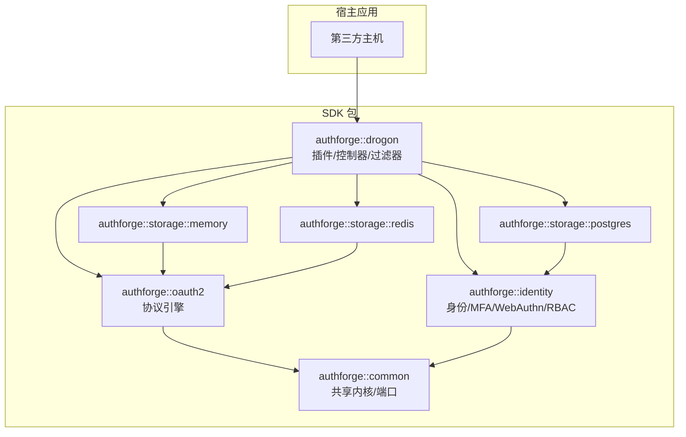
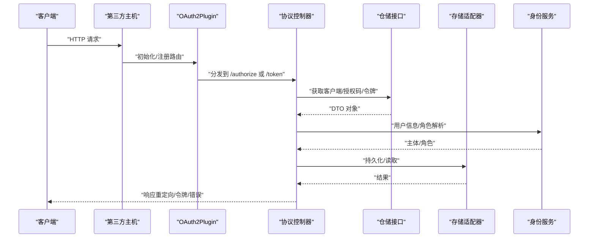
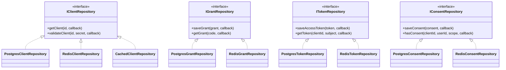
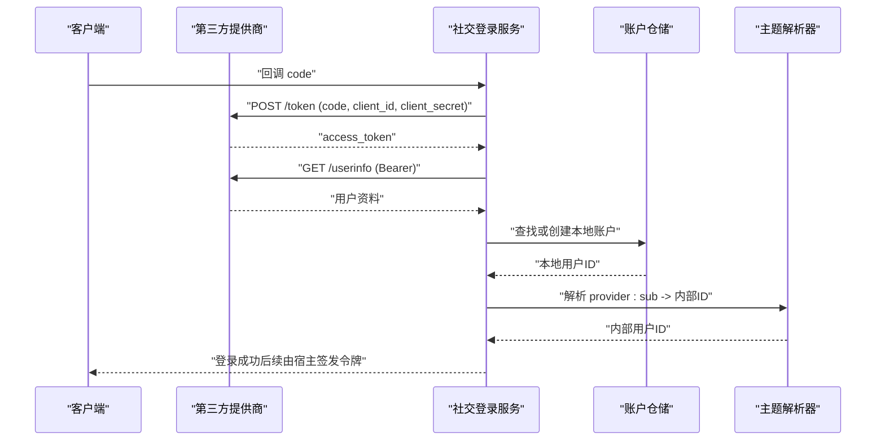
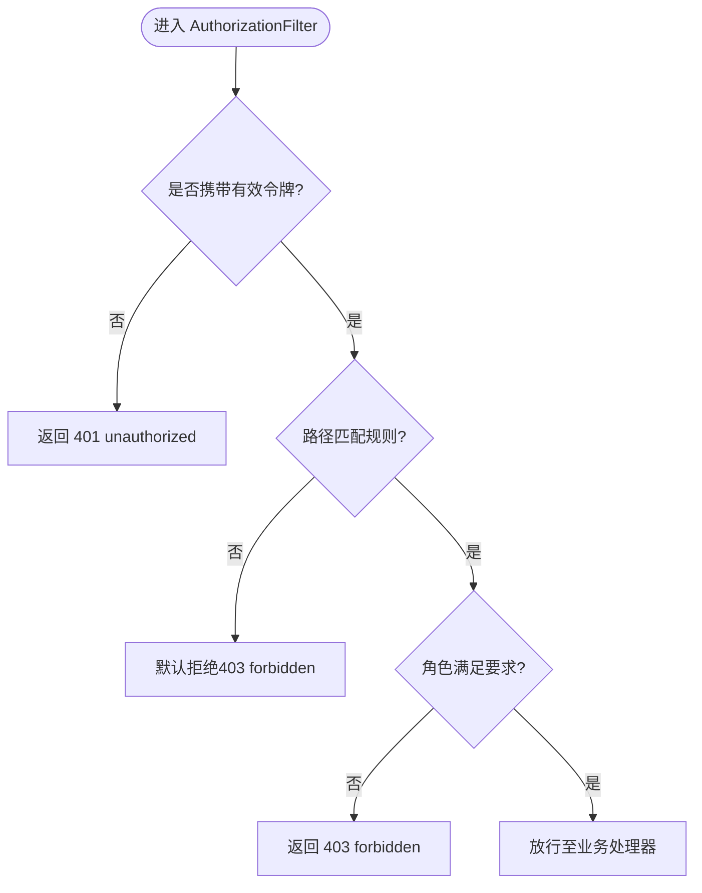
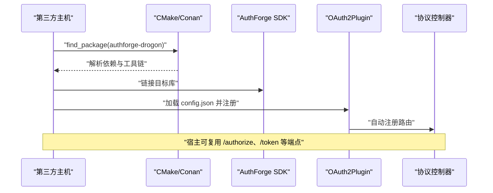
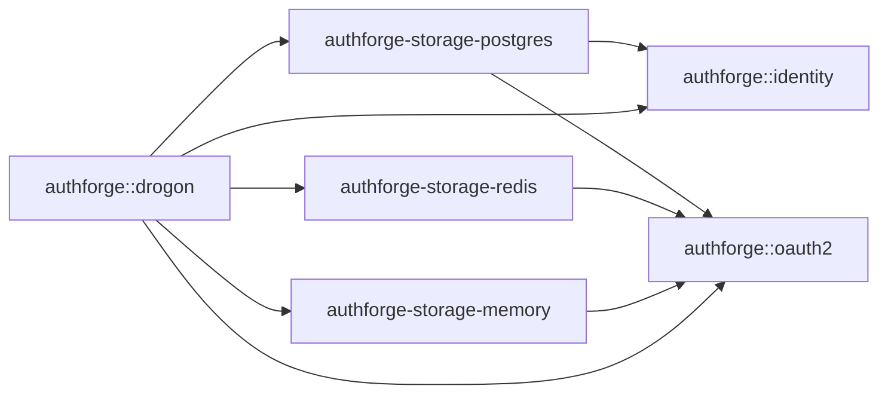

# 扩展开发

<cite>
**本文引用的文件**
- [README.md](file://README.md)
- [插件集成指南](file://docs/backend/plugin-integration.md)
- [SDK 集成指南](file://docs/backend/sdk-integration-guide.md)
- [OAuth2Plugin 头文件](file://libs/drogon/include/authforge/drogon/plugin/OAuth2Plugin.h)
- [TokenEndpointController](file://libs/drogon/src/controllers/TokenEndpointController.cc)
- [存储主题解析器（Drogon 适配器）](file://libs/drogon/include/authforge/drogon/adapters/StorageSubjectResolver.h)
- [存储主题解析器实现](file://libs/drogon/src/adapters/StorageSubjectResolver.cc)
- [PostgreSQL 存储包构建配置](file://libs/storage-postgres/CMakeLists.txt)
- [PostgreSQL 仓储基类](file://libs/storage-postgres/include/authforge/storage/postgres/PostgresRepositoryBase.h)
- [Redis 存储包构建配置](file://libs/storage-redis/CMakeLists.txt)
- [Redis 仓储基类](file://libs/storage-redis/include/authforge/storage/redis/RedisRepositoryBase.h)
- [Redis 客户端缓存装饰器](file://libs/storage-redis/include/authforge/storage/redis/CachedClientRepository.h)
- [GitHub 社交登录服务](file://libs/identity/src/social/GitHubAuthService.cc)
- [Google 社交登录服务](file://libs/identity/src/social/GoogleAuthService.cc)
- [社交 HTTP 端口接口](file://libs/identity/include/authforge/identity/IOAuthHttpClient.h)
- [第三方主机示例说明](file://examples/third-party-host/README.md)
- [CMake 包配置模板](file://cmake/AuthForgePackageConfig.cmake.in)
- [根 CMake 列表（SDK 冒烟测试）](file://CMakeLists.txt)
</cite>

## 目录
1. [简介](#简介)
2. [项目结构](#项目结构)
3. [核心组件](#核心组件)
4. [架构总览](#架构总览)
5. [详细组件分析](#详细组件分析)
6. [依赖关系分析](#依赖关系分析)
7. [性能考虑](#性能考虑)
8. [故障排查指南](#故障排查指南)
9. [结论](#结论)
10. [附录](#附录)

## 简介
本指南面向需要在现有应用中嵌入或扩展 AuthForge 的开发者，聚焦以下目标：
- 如何以插件方式扩展系统能力：存储插件、认证提供商插件、自定义权限验证器。
- 如何通过 C++ SDK 集成到宿主应用：find_package 配置、依赖管理与最小可运行示例。
- 如何将 AuthForge 嵌入第三方主机：HTTP 宿主与纯引擎消费两种路径。
- 如何实现存储适配器：基于 PostgreSQL、Redis 等后端的自定义实现方法。
- 如何扩展认证提供商：社交登录（如 Google、GitHub）的集成方法与最佳实践。
- 扩展开发的最佳实践、性能优化建议、测试与部署指导。

## 项目结构
AuthForge 采用分层与模块化设计，核心 SDK 被拆分为多个 CMake 包，按“领域层不依赖框架”的原则组织依赖方向。对外暴露的 SDK 包包括 common、oauth2、identity、storage-* 以及 drogon 插件层；示例工程展示了 SDK 的消费方式。

图表来源
- [README.md:31-49](file://README.md#L31-L49)

章节来源
- [README.md:16-51](file://README.md#L16-L51)

## 核心组件
- OAuth2 插件（OAuth2Plugin）：负责 Drogon 插件生命周期、路由注册、存储后端装配与协议端点转发。
- 存储适配层：PostgreSQL、Redis、内存三种实现，均通过 Domain 层仓储接口解耦。
- 身份与社交认证：提供 Google、GitHub 等社交登录服务，使用 IOAuthHttpClient 抽象外部 HTTP 调用。
- 权限与过滤：AuthorizationFilter 用于保护业务 API，结合 RBAC 策略进行访问控制。
- SDK 集成：通过 find_package 引入 authforge-drogon 或仅 oauth2 + storage-* 的最小引擎组合。

章节来源
- [插件集成指南:5-16](file://docs/backend/plugin-integration.md#L5-L16)
- [OAuth2Plugin 头文件:109-133](file://libs/drogon/include/authforge/drogon/plugin/OAuth2Plugin.h#L109-L133)
- [存储主题解析器（Drogon 适配器）:23-47](file://libs/drogon/include/authforge/drogon/adapters/StorageSubjectResolver.h#L23-L47)
- [存储主题解析器实现:1-25](file://libs/drogon/src/adapters/StorageSubjectResolver.cc#L1-L25)
- [GitHub 社交登录服务:1-44](file://libs/identity/src/social/GitHubAuthService.cc#L1-L44)
- [Google 社交登录服务:1-47](file://libs/identity/src/social/GoogleAuthService.cc#L1-L47)
- [社交 HTTP 端口接口:1-26](file://libs/identity/include/authforge/identity/IOAuthHttpClient.h#L1-L26)

## 架构总览
下图展示从宿主到 SDK 各层的调用关系与数据流向，突出插件、存储、身份与权限校验的关键路径。

图表来源
- [插件集成指南:17-87](file://docs/backend/plugin-integration.md#L17-L87)
- [TokenEndpointController:819-846](file://libs/drogon/src/controllers/TokenEndpointController.cc#L819-L846)
- [OAuth2Plugin 头文件:407-429](file://libs/drogon/include/authforge/drogon/plugin/OAuth2Plugin.h#L407-L429)

## 详细组件分析

### 存储插件扩展（PostgreSQL、Redis、内存）
存储插件通过实现 Domain 层仓储接口来接入不同后端。PostgreSQL 与 Redis 分别提供仓储基类与具体实现，内存存储则提供轻量级实现。

- PostgreSQL 存储包
  - 职责：ORM 模型与 Postgres 仓储实现，包含 RepositoryBase、Client/Grant/Token/Consent 仓储及 Bundle。
  - 关键接口：继承 PostgresRepositoryBase，实现 IClientRepository/IGrantRepository/ITokenRepository/IConsentRepository。
  - 依赖方向：Adapter 层实现 Domain 接口，Domain 无反向依赖。

- Redis 存储包
  - 职责：Redis 仓储实现与客户端缓存装饰器（CachedClientRepository），对读多写少的仓储进行缓存。
  - 关键接口：继承 RedisRepositoryBase，实现相同仓储接口；CachedClientRepository 包装 IClientRepository。
  - 并发安全：保留 enable_shared_from_this 与 self 捕获模式，避免异步链中的悬垂指针。

- 内存存储包
  - 职责：在进程内维护数据，便于测试与快速原型。
  - 适用场景：无需外部依赖的本地运行与单元测试。

图表来源
- [PostgreSQL 存储包构建配置:80-116](file://libs/storage-postgres/CMakeLists.txt#L80-L116)
- [Redis 存储包构建配置:23-63](file://libs/storage-redis/CMakeLists.txt#L23-L63)
- [Redis 客户端缓存装饰器:1-27](file://libs/storage-redis/include/authforge/storage/redis/CachedClientRepository.h#L1-L27)

章节来源
- [PostgreSQL 存储包构建配置:1-138](file://libs/storage-postgres/CMakeLists.txt#L1-L138)
- [PostgreSQL 仓储基类:29-54](file://libs/storage-postgres/include/authforge/storage/postgres/PostgresRepositoryBase.h#L29-L54)
- [Redis 存储包构建配置:1-85](file://libs/storage-redis/CMakeLists.txt#L1-L85)
- [Redis 仓储基类:28-55](file://libs/storage-redis/include/authforge/storage/redis/RedisRepositoryBase.h#L28-L55)
- [Redis 客户端缓存装饰器:1-27](file://libs/storage-redis/include/authforge/storage/redis/CachedClientRepository.h#L1-L27)

### 认证提供商插件扩展（社交登录）
社交登录通过注入 IOAuthHttpClient 与 ISocialAccountRepository 完成授权码交换与用户资料拉取，并实现本地账户查找或创建。

- GitHub 与 Google 服务
  - 流程：接收回调 code → 调用第三方 token 端点换取 access_token → 拉取用户资料 → 映射到本地账户。
  - 可扩展性：新增提供商时，实现对应 login(code, callback) 并复用 IOAuthHttpClient。

- 主题解析与账户绑定
  - StorageSubjectResolver 将 provider:localId 形式的 Subject 解析为内部用户 ID，支持跨提供商的用户关联。

图表来源
- [GitHub 社交登录服务:1-44](file://libs/identity/src/social/GitHubAuthService.cc#L1-L44)
- [Google 社交登录服务:1-47](file://libs/identity/src/social/GoogleAuthService.cc#L1-L47)
- [存储主题解析器实现:1-25](file://libs/drogon/src/adapters/StorageSubjectResolver.cc#L1-L25)

章节来源
- [GitHub 社交登录服务:1-44](file://libs/identity/src/social/GitHubAuthService.cc#L1-L44)
- [Google 社交登录服务:1-47](file://libs/identity/src/social/GoogleAuthService.cc#L1-L47)
- [社交 HTTP 端口接口:1-26](file://libs/identity/include/authforge/identity/IOAuthHttpClient.h#L1-L26)
- [存储主题解析器（Drogon 适配器）:23-47](file://libs/drogon/include/authforge/drogon/adapters/StorageSubjectResolver.h#L23-L47)
- [存储主题解析器实现:1-25](file://libs/drogon/src/adapters/StorageSubjectResolver.cc#L1-L25)

### 自定义权限验证器（AuthorizationFilter 与 RBAC）
- 挂载方式：在业务 Controller 中为方法添加 AuthorizationFilter，自动校验 Bearer Token 与 RBAC 规则。
- 决策语义：未携带令牌返回 401；无效令牌返回 401；匹配路径规则但角色不足返回 403；否则放行。
- 规则匹配：支持 URL 前缀与角色集合（如 /api/admin/* 需要 admin 角色）。

图表来源
- [插件集成指南:64-87](file://docs/backend/plugin-integration.md#L64-L87)
- [Property4_RbacDecisionBaselineTest:17-220](file://tests/integration/concurrency/Property4_RbacDecisionBaselineTest.cc#L17-L220)

章节来源
- [插件集成指南:64-87](file://docs/backend/plugin-integration.md#L64-L87)
- [Property4_RbacDecisionBaselineTest:17-220](file://tests/integration/concurrency/Property4_RbacDecisionBaselineTest.cc#L17-L220)

### SDK 集成与第三方主机嵌入
- 全栈宿主：通过 find_package(authforge-drogon) 引入完整插件、控制器与视图，适合直接复用产品 HTTP 能力。
- 最小引擎：仅链接 authforge::oauth2 与 storage-memory，适合无 HTTP 层的程序化调用。
- 插件注册：config.json 中声明 plugins[].name = "OAuth2Plugin"，并通过 registerAllControllers() 显式注册控制器。
- 参考示例：third-party-host 证明 SDK 独立可消费；full-stack-host 演示完整 HTTP 宿主。

图表来源
- [SDK 集成指南:35-89](file://docs/backend/sdk-integration-guide.md#L35-L89)
- [插件集成指南:17-87](file://docs/backend/plugin-integration.md#L17-L87)
- [第三方主机示例说明:1-47](file://examples/third-party-host/README.md#L1-L47)

章节来源
- [SDK 集成指南:1-133](file://docs/backend/sdk-integration-guide.md#L1-L133)
- [插件集成指南:17-87](file://docs/backend/plugin-integration.md#L17-L87)
- [第三方主机示例说明:1-47](file://examples/third-party-host/README.md#L1-L47)
- [根 CMake 列表（SDK 冒烟测试）:140-165](file://CMakeLists.txt#L140-L165)

## 依赖关系分析
- 包导出与 find_dependency：每个 SDK 包通过 AuthForgePackage 生成 Config.cmake，自动携带依赖闭包，确保外部消费者正确解析 Drogon、jsoncpp 等第三方依赖。
- 版本兼容：SameMajorVersion 策略允许 major 锁定（如 1.0）。
- 依赖方向：Adapter 层（storage-*）实现 Domain 层接口，Domain 层不反向依赖 Adapter，保证解耦与可替换性。

图表来源
- [CMake 包配置模板:1-14](file://cmake/AuthForgePackageConfig.cmake.in#L1-L14)
- [PostgreSQL 存储包构建配置:80-116](file://libs/storage-postgres/CMakeLists.txt#L80-L116)
- [Redis 存储包构建配置:23-63](file://libs/storage-redis/CMakeLists.txt#L23-L63)

章节来源
- [CMake 包配置模板:1-14](file://cmake/AuthForgePackageConfig.cmake.in#L1-L14)
- [PostgreSQL 存储包构建配置:1-138](file://libs/storage-postgres/CMakeLists.txt#L1-L138)
- [Redis 存储包构建配置:1-85](file://libs/storage-redis/CMakeLists.txt#L1-L85)

## 性能考虑
- 缓存策略：对读多写少且可安全缓存的仓储（如 IClientRepository）使用 CachedClientRepository，TTL 约定与原始 CachedOAuth2Storage 一致。
- 连接管理：PostgreSQL 与 Redis 仓储基类封装连接获取与超时设置，保持每调用惰性重建逻辑，避免连接失效导致的异常。
- 异步安全：保留 enable_shared_from_this 与 self 捕获模式，防止异步链中的悬垂指针与 UAF。
- 资源裁剪：通过 Conan/CMake 选项关闭非必需功能区域（如 identity、social、webauthn），减少依赖面与编译产物体积。

章节来源
- [Redis 客户端缓存装饰器:1-27](file://libs/storage-redis/include/authforge/storage/redis/CachedClientRepository.h#L1-L27)
- [PostgreSQL 仓储基类:29-54](file://libs/storage-postgres/include/authforge/storage/postgres/PostgresRepositoryBase.h#L29-L54)
- [Redis 仓储基类:28-55](file://libs/storage-redis/include/authforge/storage/redis/RedisRepositoryBase.h#L28-L55)
- [README.md:31-51](file://README.md#L31-L51)

## 故障排查指南
- 插件未生效：确认 config.json 已声明 OAuth2Plugin，并确保最终二进制链接了 authforge::drogon；控制器需通过 registerAllControllers() 显式注册。
- 数据库迁移：使用 PostgreSQL 存储时需执行 migrations 脚本或启用 OAUTH2_AUTO_MIGRATE=true。
- 权限拦截误拒：检查 AuthorizationFilter 的路径规则与角色配置；未携带令牌或令牌无效会返回 401，角色不匹配返回 403。
- 社交登录失败：确认 IOAuthHttpClient 可用、client_id/client_secret/redirect_uri 配置正确；检查第三方 token 端点与 userinfo 端点可达性。

章节来源
- [插件集成指南:40-87](file://docs/backend/plugin-integration.md#L40-L87)
- [Property4_RbacDecisionBaselineTest:17-220](file://tests/integration/concurrency/Property4_RbacDecisionBaselineTest.cc#L17-L220)
- [Google 社交登录服务:1-47](file://libs/identity/src/social/GoogleAuthService.cc#L1-L47)
- [GitHub 社交登录服务:1-44](file://libs/identity/src/social/GitHubAuthService.cc#L1-L44)

## 结论
AuthForge 提供了清晰的扩展边界与稳定的 SDK 契约：通过仓储接口实现存储适配，通过社交服务接口扩展认证提供商，通过 Drogon 插件与过滤器集成权限控制。借助 find_package 与包配置模板，宿主可以灵活选择全栈或最小引擎集成路径，并以缓存、连接管理与异步安全等手段保障性能与稳定性。建议在扩展过程中遵循依赖方向约束、保留并发安全模式，并结合测试与部署流水线进行持续验证。

## 附录
- 推荐阅读：
  - SDK 集成与发布产物：[SDK 集成指南](file://docs/backend/sdk-integration-guide.md)
  - 插件集成步骤与注意事项：[插件集成指南](file://docs/backend/plugin-integration.md)
  - 第三方主机最小示例：[第三方主机示例说明](file://examples/third-party-host/README.md)
- 参考实现：
  - 存储适配器：PostgreSQL、Redis、内存
  - 认证提供商：Google、GitHub
  - 权限验证：AuthorizationFilter 与 RBAC 规则