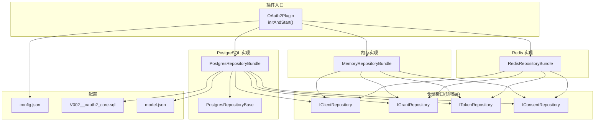
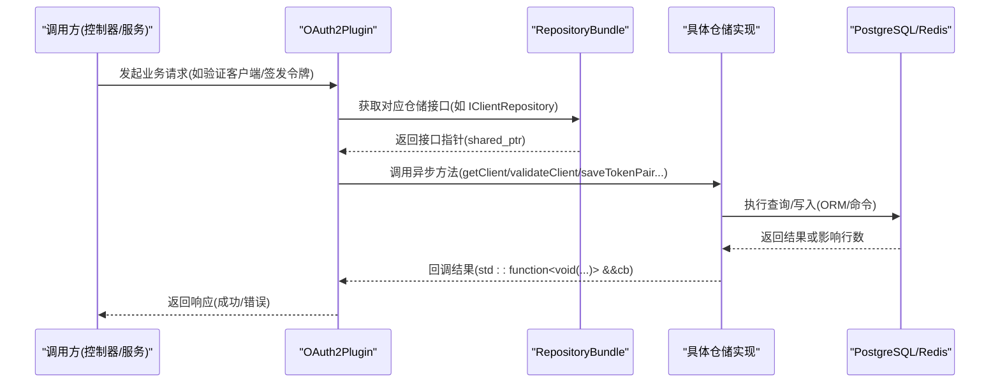
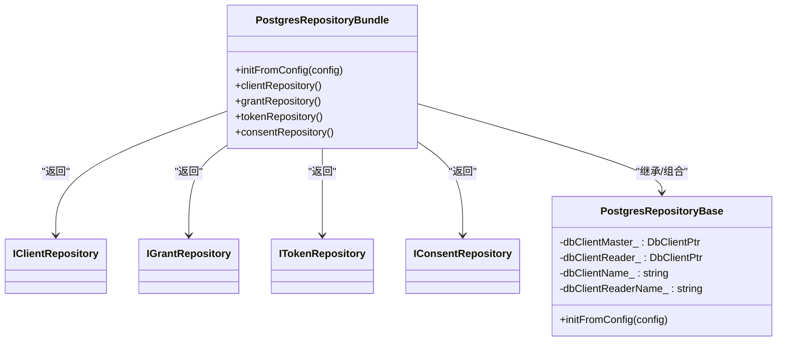
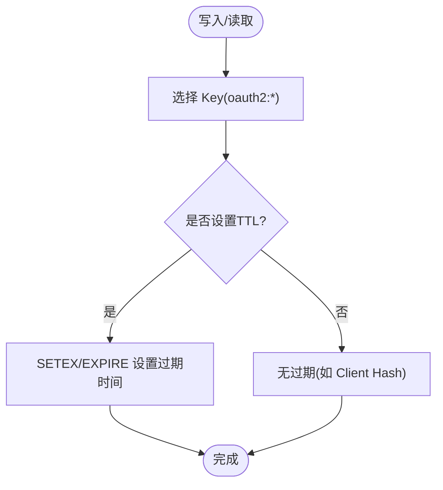
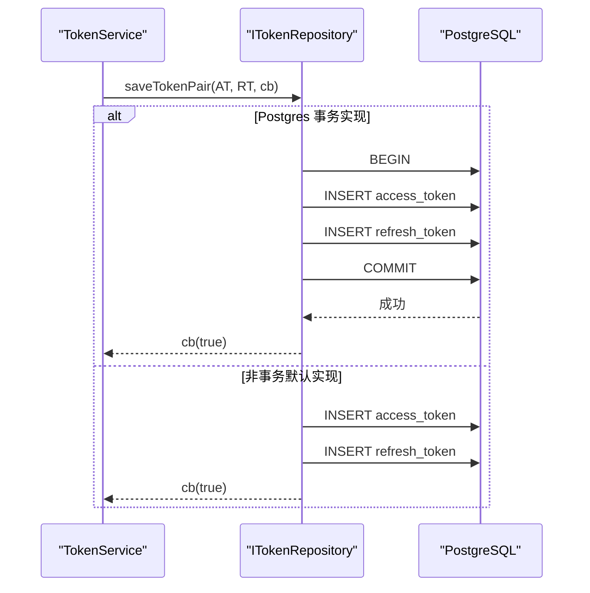
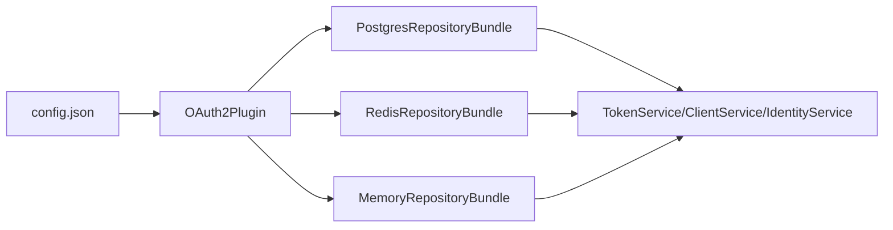

# 存储插件开发

<cite>
**本文引用的文件**
- [OAuth2Plugin.h](file://libs/drogon/include/authforge/drogon/plugin/OAuth2Plugin.h)
- [OAuth2Plugin.cc](file://libs/drogon/src/plugin/OAuth2Plugin.cc)
- [data-persistence.md](file://docs/backend/data-persistence.md)
- [config.json](file://apps/server/config/config.json)
- [PostgresRepositoryBundle.h](file://libs/storage-postgres/include/authforge/storage/postgres/PostgresRepositoryBundle.h)
- [PostgresRepositoryBase.h](file://libs/storage-postgres/include/authforge/storage/postgres/PostgresRepositoryBase.h)
- [RedisRepositoryBundle.h](file://libs/storage-redis/include/authforge/storage/redis/RedisRepositoryBundle.h)
- [MemoryRepositoryBundle.h](file://libs/storage-memory/include/authforge/storage/memory/MemoryRepositoryBundle.h)
- [IClientRepository.h](file://libs/oauth2/include/authforge/oauth2/repository/IClientRepository.h)
- [IGrantRepository.h](file://libs/oauth2/include/authforge/oauth2/repository/IGrantRepository.h)
- [ITokenRepository.h](file://libs/oauth2/include/authforge/oauth2/repository/ITokenRepository.h)
- [Dto.h](file://libs/oauth2/include/authforge/oauth2/model/Dto.h)
- [model.json](file://libs/storage-postgres/src/models/model.json)
- [V002__oauth2_core.sql](file://apps/server/migrations/V002__oauth2_core.sql)
</cite>

## 目录
1. [简介](#简介)
2. [项目结构](#项目结构)
3. [核心组件](#核心组件)
4. [架构总览](#架构总览)
5. [详细组件分析](#详细组件分析)
6. [依赖关系分析](#依赖关系分析)
7. [性能考虑](#性能考虑)
8. [故障排查指南](#故障排查指南)
9. [结论](#结论)
10. [附录](#附录)

## 简介
本指南面向希望在 AuthForge 中开发“存储插件”的工程师，围绕接口规范、实现模式与三种后端（PostgreSQL、Redis、内存）展开。重点包括：
- 仓储接口设计（DAO）：按聚合拆分 Client、Grant、Token、Consent 四个仓库接口，统一异步回调风格。
- 连接池管理：基于 Drogon ORM 的 DbClient 配置与复用；Redis 客户端名称选择。
- 事务处理：Token 成对写入的事务性契约与能力标志（supportsTransactions/supportsCas）。
- PostgreSQL 插件：ORM 映射、查询优化、连接配置与迁移脚本。
- Redis 缓存插件：键空间设计、TTL 过期、JSON 序列化与清理策略。
- 内存存储插件：用于开发与测试的快速装配。
- 完整示例：实体映射、CRUD 操作、批量处理与清理服务编排。
- 性能优化建议与常见问题排查。

## 项目结构
存储插件以“仓储包 + 仓储 Bundle”的方式组织：
- libs/oauth2/include/.../repository：领域层仓储接口（IClientRepository、IGrantRepository、ITokenRepository、IConsentRepository）。
- libs/storage-{postgres|redis|memory}：各后端的仓储实现与 Bundle 装配器。
- libs/drogon/src/plugin/OAuth2Plugin.cc：插件初始化，根据 storage_type 选择并组装对应 Bundle，注入服务与清理任务。
- apps/server/config/config.json：数据库与 Redis 连接池、插件配置（storage_type、clients、tokens、cleanup_interval_seconds 等）。
- docs/backend/data-persistence.md：持久化方案说明（Schema、Key Pattern、安全加固、生命周期管理）。
- apps/server/migrations：PostgreSQL 迁移脚本（如 V002__oauth2_core.sql）。
- libs/storage-postgres/src/models/model.json：ORM 模型生成配置（表清单与关系）。

图表来源
- [OAuth2Plugin.cc:161-191](file://libs/drogon/src/plugin/OAuth2Plugin.cc#L161-L191)
- [PostgresRepositoryBundle.h:1-96](file://libs/storage-postgres/include/authforge/storage/postgres/PostgresRepositoryBundle.h#L1-L96)
- [RedisRepositoryBundle.h:1-87](file://libs/storage-redis/include/authforge/storage/redis/RedisRepositoryBundle.h#L1-L87)
- [MemoryRepositoryBundle.h:1-80](file://libs/storage-memory/include/authforge/storage/memory/MemoryRepositoryBundle.h#L1-L80)
- [PostgresRepositoryBase.h:48-72](file://libs/storage-postgres/include/authforge/storage/postgres/PostgresRepositoryBase.h#L48-L72)
- [config.json:9-40](file://apps/server/config/config.json#L9-L40)
- [V002__oauth2_core.sql](file://apps/server/migrations/V002__oauth2_core.sql)
- [model.json:1-45](file://libs/storage-postgres/src/models/model.json#L1-L45)

章节来源
- [OAuth2Plugin.cc:161-191](file://libs/drogon/src/plugin/OAuth2Plugin.cc#L161-L191)
- [config.json:9-40](file://apps/server/config/config.json#L9-L40)
- [data-persistence.md:14-189](file://docs/backend/data-persistence.md#L14-L189)

## 核心组件
- 仓储接口（DAO）
  - IClientRepository：客户端注册信息查询与凭据校验（异步回调）。
  - IGrantRepository：授权码与授权交易的生命周期（保存、消费、标记已用、清理）。
  - ITokenRepository：访问令牌与刷新令牌的 CRUD、家族撤销、鉴权探查、清理与能力标志。
  - IConsentRepository：用户同意记录（由 Bundle 暴露，具体方法见实现）。
- 仓储 Bundle
  - PostgresRepositoryBundle：聚合四个 Postgres 仓储，提供 initFromConfig 与接口访问器。
  - RedisRepositoryBundle：聚合四个 Redis 仓储，构造即初始化（传入 redis client name）。
  - MemoryRepositoryBundle：聚合四个内存仓储，从 clients 配置块初始化。
- 插件装配
  - OAuth2Plugin::initStorage：根据 storage_type 选择并构建对应 Bundle，注入 TokenService、ClientService、IdentityService，并启动清理服务。

章节来源
- [IClientRepository.h:29-62](file://libs/oauth2/include/authforge/oauth2/repository/IClientRepository.h#L29-L62)
- [IGrantRepository.h:27-112](file://libs/oauth2/include/authforge/oauth2/repository/IGrantRepository.h#L27-L112)
- [ITokenRepository.h:21-173](file://libs/oauth2/include/authforge/oauth2/repository/ITokenRepository.h#L21-L173)
- [PostgresRepositoryBundle.h:29-93](file://libs/storage-postgres/include/authforge/storage/postgres/PostgresRepositoryBundle.h#L29-L93)
- [RedisRepositoryBundle.h:29-84](file://libs/storage-redis/include/authforge/storage/redis/RedisRepositoryBundle.h#L29-L84)
- [MemoryRepositoryBundle.h:32-77](file://libs/storage-memory/include/authforge/storage/memory/MemoryRepositoryBundle.h#L32-L77)
- [OAuth2Plugin.cc:161-191](file://libs/drogon/src/plugin/OAuth2Plugin.cc#L161-L191)

## 架构总览
存储插件采用“接口抽象 + 多后端实现 + 插件装配”的分层架构：
- 领域层（libs/oauth2/.../repository）定义稳定的异步接口，屏蔽底层差异。
- 存储层（libs/storage-*）提供具体实现，并通过 Bundle 统一装配。
- 插件层（OAuth2Plugin）负责根据配置选择后端、创建服务与调度清理任务。
- 配置层（config.json）集中声明 db_clients、redis_clients、plugins 等。

图表来源
- [OAuth2Plugin.h:118-137](file://libs/drogon/include/authforge/drogon/plugin/OAuth2Plugin.h#L118-L137)
- [PostgresRepositoryBundle.h:54-93](file://libs/storage-postgres/include/authforge/storage/postgres/PostgresRepositoryBundle.h#L54-L93)
- [RedisRepositoryBundle.h:54-84](file://libs/storage-redis/include/authforge/storage/redis/RedisRepositoryBundle.h#L54-L84)
- [MemoryRepositoryBundle.h:40-77](file://libs/storage-memory/include/authforge/storage/memory/MemoryRepositoryBundle.h#L40-L77)

## 详细组件分析

### PostgreSQL 存储插件
- 连接与 ORM
  - 通过 PostgresRepositoryBase 维护主库与读库 DbClientPtr，initFromConfig 从配置读取 db_client_name/db_client_reader。
  - model.json 声明了所有表及关系，供 ORM 代码生成使用。
  - 迁移脚本 V002__oauth2_core.sql 创建 oauth2_clients、oauth2_codes、oauth2_access_tokens、oauth2_refresh_tokens 等核心表。
- 数据模型与映射
  - Dto.h 定义了 OAuth2Client、OAuth2AuthCode、OAuth2AccessToken、OAuth2RefreshToken 等领域 DTO，仓储接口以这些 DTO 为输入输出。
  - 仓储实现将 DTO 映射到 SQL 表字段，支持索引与约束（如外键、唯一键）。
- 查询优化
  - 读写分离：dbClientMaster_ 用于写，dbClientReader_ 用于读，降低写放大对读的影响。
  - 批量与自动批处理：配置 auto_batch=true 可合并小写操作。
  - 语句超时：connect_options.statement_timeout 控制长查询保护。
- 事务与原子性
  - ITokenRepository::saveTokenPair 默认顺序执行 AT+RT 写入；Postgres 实现应覆盖为事务包裹以保证原子性。
  - supportsTransactions()/supportsCas() 标识能力，供测试套件选择运行层级。
- 连接配置
  - config.json 的 db_clients 数组定义连接名、主机、端口、用户名、密码、连接数、超时、auto_batch、statement_timeout 等。

图表来源
- [PostgresRepositoryBase.h:48-72](file://libs/storage-postgres/include/authforge/storage/postgres/PostgresRepositoryBase.h#L48-L72)
- [PostgresRepositoryBundle.h:54-93](file://libs/storage-postgres/include/authforge/storage/postgres/PostgresRepositoryBundle.h#L54-L93)
- [IClientRepository.h:29-62](file://libs/oauth2/include/authforge/oauth2/repository/IClientRepository.h#L29-L62)
- [IGrantRepository.h:27-112](file://libs/oauth2/include/authforge/oauth2/repository/IGrantRepository.h#L27-L112)
- [ITokenRepository.h:21-173](file://libs/oauth2/include/authforge/oauth2/repository/ITokenRepository.h#L21-L173)

章节来源
- [PostgresRepositoryBase.h:48-72](file://libs/storage-postgres/include/authforge/storage/postgres/PostgresRepositoryBase.h#L48-L72)
- [PostgresRepositoryBundle.h:1-96](file://libs/storage-postgres/include/authforge/storage/postgres/PostgresRepositoryBundle.h#L1-L96)
- [model.json:1-45](file://libs/storage-postgres/src/models/model.json#L1-L45)
- [data-persistence.md:14-92](file://docs/backend/data-persistence.md#L14-L92)
- [config.json:9-27](file://apps/server/config/config.json#L9-L27)

### Redis 缓存插件
- Key 设计与 TTL
  - 前缀 oauth2:，分别用于 client、code、token、refresh token。
  - 利用 Redis 原生 TTL 机制自动过期，无需应用层定时清理。
- 数据序列化
  - 使用 JSON 序列化对象作为 String Value（如 code/token/refresh），Hash 结构存储 Client 信息。
- 清理策略
  - 依赖 TTL 自动清理；若需额外逻辑，可在仓储层扩展。
- 连接与装配
  - RedisRepositoryBundle 构造时接收 redis client name，内部创建四个仓储实例并暴露接口访问器。

图表来源
- [data-persistence.md:94-128](file://docs/backend/data-persistence.md#L94-L128)
- [RedisRepositoryBundle.h:29-84](file://libs/storage-redis/include/authforge/storage/redis/RedisRepositoryBundle.h#L29-L84)

章节来源
- [data-persistence.md:94-189](file://docs/backend/data-persistence.md#L94-L189)
- [RedisRepositoryBundle.h:1-87](file://libs/storage-redis/include/authforge/storage/redis/RedisRepositoryBundle.h#L1-L87)

### 内存存储插件
- 适用场景
  - 开发与测试环境快速启动，无需外部依赖。
- 初始化
  - MemoryRepositoryBundle::initFromConfig 从 clients 配置块加载初始客户端数据。
- 行为特征
  - 进程内内存数据结构，无网络开销；适合单元测试与集成测试。

章节来源
- [MemoryRepositoryBundle.h:32-77](file://libs/storage-memory/include/authforge/storage/memory/MemoryRepositoryBundle.h#L32-L77)

### DAO 设计与事务处理
- 接口风格
  - 全部方法采用异步回调 std::function<void(result)> &&callback，避免阻塞线程。
- 事务契约
  - ITokenRepository::saveTokenPair 默认顺序执行，Postgres 实现应覆盖为事务包裹。
  - supportsTransactions()/supportsCas() 明确能力边界，便于分层测试。
- 清理编排
  - 清理不再集中在单一 god interface，而是拆分为 IGrantRepository::purgeExpired 与 ITokenRepository::purgeExpired，由清理服务统一调度。

图表来源
- [ITokenRepository.h:66-96](file://libs/oauth2/include/authforge/oauth2/repository/ITokenRepository.h#L66-L96)
- [ITokenRepository.h:156-173](file://libs/oauth2/include/authforge/oauth2/repository/ITokenRepository.h#L156-L173)

章节来源
- [ITokenRepository.h:21-173](file://libs/oauth2/include/authforge/oauth2/repository/ITokenRepository.h#L21-L173)
- [data-persistence.md:162-189](file://docs/backend/data-persistence.md#L162-L189)

## 依赖关系分析
- 插件与配置
  - OAuth2Plugin 读取 config.json 中的 plugins[].config.storage_type 决定后端类型。
  - db_clients 与 redis_clients 提供连接池与连接参数。
- 插件与服务
  - OAuth2Plugin 在 initAndStart 中创建 RepositoryBundle，并注入 TokenService、ClientService、IdentityService。
  - 清理服务通过弱引用与定时器周期性触发各仓储 purgeExpired。

图表来源
- [config.json:133-170](file://apps/server/config/config.json#L133-L170)
- [OAuth2Plugin.cc:161-191](file://libs/drogon/src/plugin/OAuth2Plugin.cc#L161-L191)

章节来源
- [config.json:133-170](file://apps/server/config/config.json#L133-L170)
- [OAuth2Plugin.cc:161-191](file://libs/drogon/src/plugin/OAuth2Plugin.cc#L161-L191)

## 性能考虑
- PostgreSQL
  - 读写分离：使用 dbClientReader_ 承担读负载，减轻主库压力。
  - 连接池：number_of_connections 合理设置，避免过多连接导致上下文切换开销。
  - 自动批处理：auto_batch=true 合并多次小写操作，减少往返次数。
  - 语句超时：statement_timeout 防止长查询拖垮连接。
  - 索引与查询计划：确保高频查询列有合适索引（参考迁移脚本与模型关系）。
- Redis
  - TTL 自动过期：减少人工清理成本，降低数据膨胀风险。
  - 序列化开销：JSON 序列化在大数据量下可能成为瓶颈，必要时考虑二进制格式或分片。
  - 连接池：number_of_connections 与 timeout 调优，避免连接耗尽。
- 内存
  - 极低延迟：适合测试与本地调试，但不具备持久性与水平扩展能力。
- 通用
  - 异步回调：避免阻塞事件循环，提升吞吐。
  - 能力标志：通过 supportsTransactions()/supportsCas() 选择合适实现，保障一致性需求。

[本节为通用指导，不直接分析具体文件]

## 故障排查指南
- 连接失败
  - 检查 config.json 中 db_clients/redis_clients 的连接信息与认证参数。
  - 确认服务容器/主机可达，端口开放且防火墙放行。
- 权限与迁移
  - 使用 setup_database 脚本创建数据库与角色，确保迁移脚本 V002__oauth2_core.sql 已执行。
  - 核对 model.json 中表清单与实际数据库一致。
- 事务与原子性
  - 若并发刷新令牌出现竞态，确认 Postgres 实现的 saveTokenPair 是否使用事务，以及 supportsTransactions()/supportsCas() 返回值正确。
- 清理未生效
  - 检查 cleanup_interval_seconds 配置与清理服务是否启动。
  - 确认 IGrantRepository::purgeExpired 与 ITokenRepository::purgeExpired 已实现并正确删除过期数据。
- 性能问题
  - 观察慢查询日志与 statement_timeout，调整索引与查询。
  - 评估 Redis 序列化与 Key 大小，必要时拆分或压缩。

章节来源
- [data-persistence.md:132-189](file://docs/backend/data-persistence.md#L132-L189)
- [config.json:9-40](file://apps/server/config/config.json#L9-L40)
- [ITokenRepository.h:147-173](file://libs/oauth2/include/authforge/oauth2/repository/ITokenRepository.h#L147-L173)
- [IGrantRepository.h:104-112](file://libs/oauth2/include/authforge/oauth2/repository/IGrantRepository.h#L104-L112)

## 结论
AuthForge 的存储插件体系通过清晰的接口抽象与多后端实现，实现了高内聚、低耦合的可插拔存储架构。PostgreSQL 提供强一致与复杂查询能力，Redis 提供高性能与自动过期，内存存储满足开发与测试需求。结合配置驱动、异步回调与能力标志，系统在不同场景下均能取得良好平衡。建议在生产环境中优先使用 PostgreSQL，并结合 Redis 做热点数据缓存；同时完善监控与告警，持续优化连接池、索引与查询计划。

[本节为总结性内容，不直接分析具体文件]

## 附录
- 关键配置项速查
  - storage_type：选择 postgres/redis/memory。
  - db_clients：PostgreSQL 连接池与超时、自动批处理等。
  - redis_clients：Redis 连接池与超时。
  - tokens.auth_code_ttl/access_token_ttl/refresh_token_ttl：令牌有效期。
  - cleanup_interval_seconds：清理任务间隔。
- 参考路径
  - 插件入口：OAuth2Plugin.h/cc
  - 仓储接口：libs/oauth2/.../repository/*.h
  - 后端 Bundle：libs/storage-{postgres|redis|memory}/include/.../*Bundle.h
  - 配置：apps/server/config/config.json
  - 文档：docs/backend/data-persistence.md
  - 迁移：apps/server/migrations/V002__oauth2_core.sql
  - ORM 模型：libs/storage-postgres/src/models/model.json

[本节为补充信息，不直接分析具体文件]