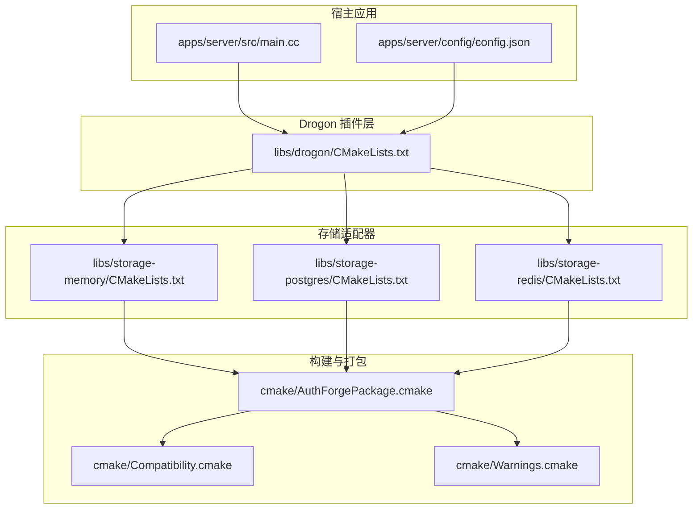
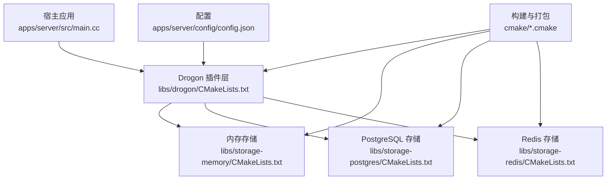
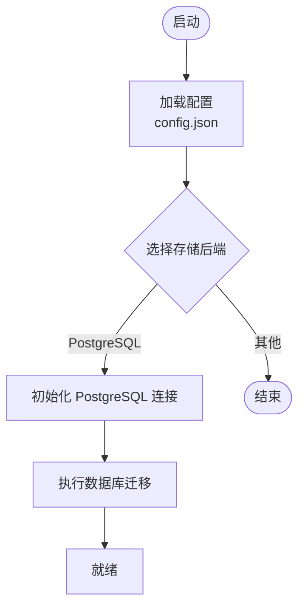
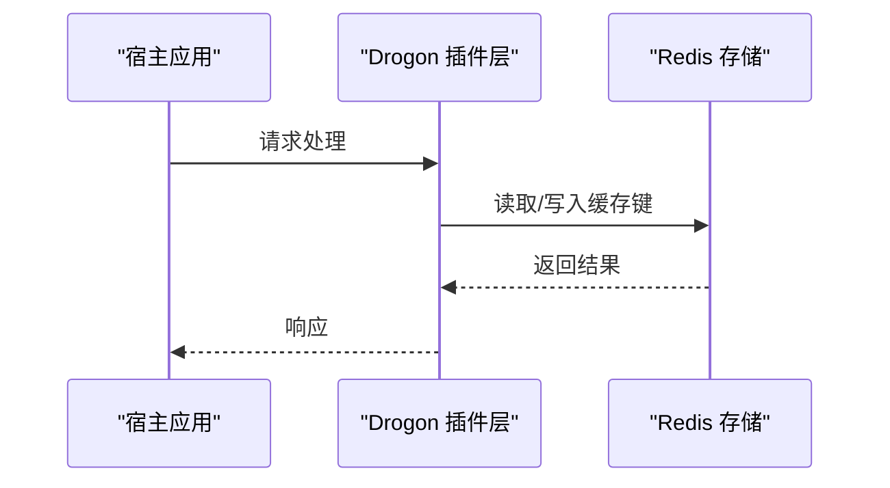
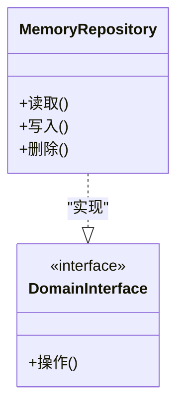
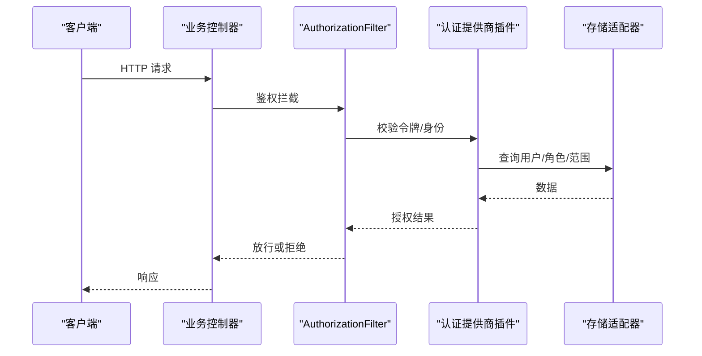
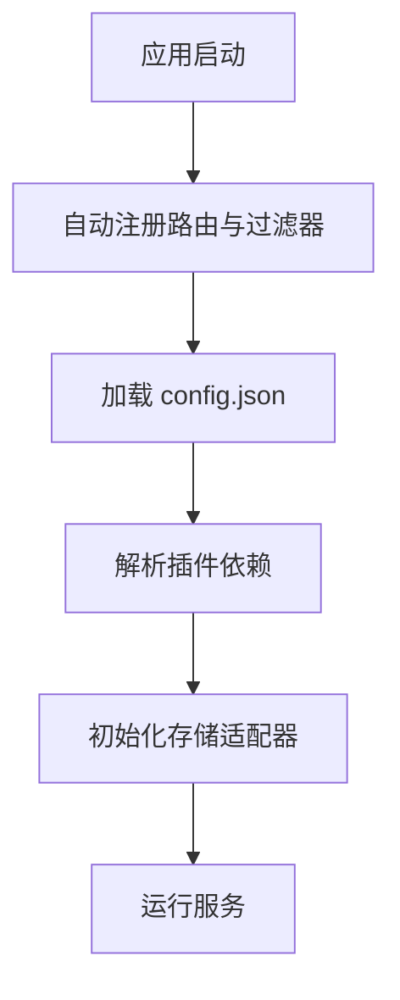
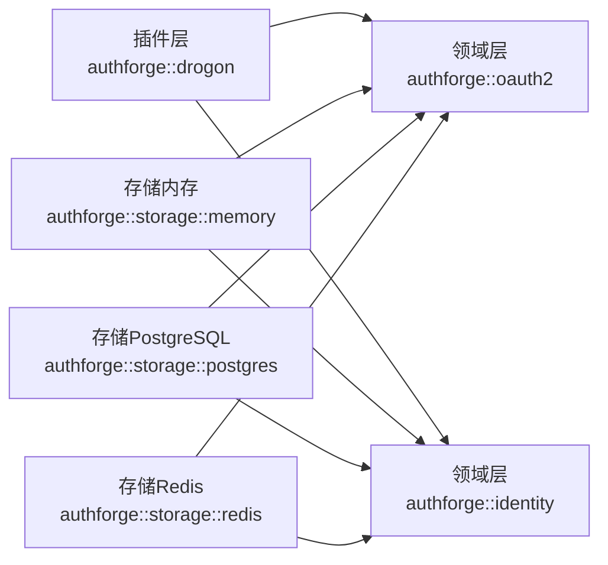
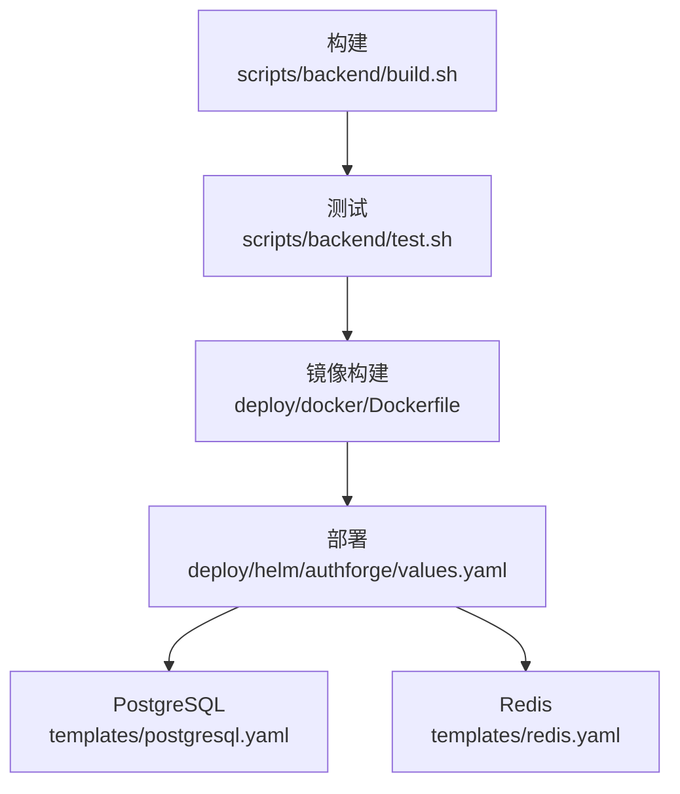

# 插件开发

<cite>
**本文引用的文件**
- [libs/drogon/CMakeLists.txt](file://libs/drogon/CMakeLists.txt)
- [libs/storage-memory/CMakeLists.txt](file://libs/storage-memory/CMakeLists.txt)
- [libs/storage-postgres/CMakeLists.txt](file://libs/storage-postgres/CMakeLists.txt)
- [libs/storage-redis/CMakeLists.txt](file://libs/storage-redis/CMakeLists.txt)
- [apps/server/src/main.cc](file://apps/server/src/main.cc)
- [apps/server/config/config.json](file://apps/server/config/config.json)
- [apps/server/migrations/V001__schema_migrations.sql](file://apps/server/migrations/V001__schema_migrations.sql)
- [apps/server/migrations/V005__rbac_schema.sql](file://apps/server/migrations/V005__rbac_schema.sql)
- [apps/server/migrations/V017__multi_tenant.sql](file://apps/server/migrations/V017__multi_tenant.sql)
- [cmake/AuthForgePackage.cmake](file://cmake/AuthForgePackage.cmake)
- [cmake/Compatibility.cmake](file://cmake/Compatibility.cmake)
- [cmake/Warnings.cmake](file://cmake/Warnings.cmake)
- [scripts/backend/build.sh](file://scripts/backend/build.sh)
- [scripts/backend/test.sh](file://scripts/backend/test.sh)
- [deploy/docker/Dockerfile](file://deploy/docker/Dockerfile)
- [deploy/helm/authforge/values.yaml](file://deploy/helm/authforge/values.yaml)
- [deploy/helm/authforge/templates/postgresql.yaml](file://deploy/helm/authforge/templates/postgresql.yaml)
- [deploy/helm/authforge/templates/redis.yaml](file://deploy/helm/authforge/templates/redis.yaml)
- [docs/backend/plugin-integration.md](file://docs/backend/plugin-integration.md)
- [tests/integration/plugin/PluginTest.cc](file://tests/integration/plugin/PluginTest.cc)
- [tests/unit/plugin/ScopeValidationTest.cc](file://tests/unit/plugin/ScopeValidationTest.cc)
</cite>

## 目录
1. [简介](#简介)
2. [项目结构](#项目结构)
3. [核心组件](#核心组件)
4. [架构总览](#架构总览)
5. [详细组件分析](#详细组件分析)
6. [依赖关系分析](#依赖关系分析)
7. [性能考虑](#性能考虑)
8. [故障排查指南](#故障排查指南)
9. [结论](#结论)
10. [附录](#附录)

## 简介
本指南面向希望为 AuthForge 开发插件的工程师，覆盖存储插件、认证提供商插件与自定义权限验证器的设计与实现方法。文档基于仓库现有代码与文档，重点说明：
- 插件架构与接口契约
- 生命周期管理与配置加载
- 依赖注入与包组织方式
- 完整示例：PostgreSQL 存储插件、Redis 缓存插件
- 编译、打包与部署流程
- 测试策略与性能优化建议
- 最佳实践与常见问题解决方案

## 项目结构
AuthForge 采用分层与模块化设计，插件以独立 CMake 包形式提供，宿主通过 find_package 链接并自动注册路由与过滤器。关键目录与职责如下：
- libs/drogon：Drogon 插件层，负责协议端点、安全过滤器与生命周期管理
- libs/storage-*：存储适配器（内存、PostgreSQL、Redis），实现领域层的存储接口
- apps/server：服务端应用，包含迁移脚本、配置与启动入口
- cmake：构建与打包工具链，统一版本、兼容性与安装导出
- scripts/backend：构建、测试与数据库初始化脚本
- deploy：容器化与 Helm 部署资源

**图表来源**
- [libs/drogon/CMakeLists.txt](file://libs/drogon/CMakeLists.txt)
- [libs/storage-memory/CMakeLists.txt](file://libs/storage-memory/CMakeLists.txt)
- [libs/storage-postgres/CMakeLists.txt](file://libs/storage-postgres/CMakeLists.txt)
- [libs/storage-redis/CMakeLists.txt](file://libs/storage-redis/CMakeLists.txt)
- [cmake/AuthForgePackage.cmake](file://cmake/AuthForgePackage.cmake)
- [cmake/Compatibility.cmake](file://cmake/Compatibility.cmake)
- [cmake/Warnings.cmake](file://cmake/Warnings.cmake)

**章节来源**
- [docs/backend/plugin-integration.md:1-87](file://docs/backend/plugin-integration.md#L1-L87)
- [apps/server/src/main.cc](file://apps/server/src/main.cc)
- [apps/server/config/config.json](file://apps/server/config/config.json)

## 核心组件
- Drogon 插件层：提供 OAuth2 协议端点与安全过滤器，遵循 Drogon 自动注册机制，无需在宿主中手动调用初始化宏
- 存储适配器：实现领域层存储接口，支持内存、PostgreSQL、Redis 等后端
- 构建与打包：通过 CMake 模块统一版本、警告、兼容性检查与安装包导出
- 配置与迁移：通过 config.json 启用插件与选择存储后端；通过 SQL 迁移脚本初始化数据库结构

**章节来源**
- [docs/backend/plugin-integration.md:1-87](file://docs/backend/plugin-integration.md#L1-L87)
- [libs/storage-memory/CMakeLists.txt:1-75](file://libs/storage-memory/CMakeLists.txt#L1-L75)
- [cmake/AuthForgePackage.cmake](file://cmake/AuthForgePackage.cmake)

## 架构总览
下图展示了宿主应用、Drogon 插件层与存储适配器的交互关系，以及构建与打包模块的作用。

**图表来源**
- [apps/server/src/main.cc](file://apps/server/src/main.cc)
- [apps/server/config/config.json](file://apps/server/config/config.json)
- [libs/drogon/CMakeLists.txt](file://libs/drogon/CMakeLists.txt)
- [libs/storage-memory/CMakeLists.txt](file://libs/storage-memory/CMakeLists.txt)
- [libs/storage-postgres/CMakeLists.txt](file://libs/storage-postgres/CMakeLists.txt)
- [libs/storage-redis/CMakeLists.txt](file://libs/storage-redis/CMakeLists.txt)
- [cmake/AuthForgePackage.cmake](file://cmake/AuthForgePackage.cmake)

## 详细组件分析

### 存储插件：PostgreSQL
- 目标定位：实现领域层存储接口，提供持久化能力
- 依赖关系：依赖 Drogon 日志与 JSON 库，同时依赖领域层库（oauth2、identity）
- 构建与导出：使用 AuthForgePackage 模块进行安装与导出，暴露 authforge::storage::postgres 目标
- 配置与迁移：通过 config.json 指定 storage_type 与 postgres 客户端名称；启动前执行迁移脚本

**图表来源**
- [apps/server/config/config.json](file://apps/server/config/config.json)
- [apps/server/migrations/V001__schema_migrations.sql](file://apps/server/migrations/V001__schema_migrations.sql)
- [apps/server/migrations/V005__rbac_schema.sql](file://apps/server/migrations/V005__rbac_schema.sql)
- [apps/server/migrations/V017__multi_tenant.sql](file://apps/server/migrations/V017__multi_tenant.sql)
- [libs/storage-postgres/CMakeLists.txt](file://libs/storage-postgres/CMakeLists.txt)

**章节来源**
- [libs/storage-postgres/CMakeLists.txt](file://libs/storage-postgres/CMakeLists.txt)
- [apps/server/migrations/V001__schema_migrations.sql](file://apps/server/migrations/V001__schema_migrations.sql)
- [apps/server/migrations/V005__rbac_schema.sql](file://apps/server/migrations/V005__rbac_schema.sql)
- [apps/server/migrations/V017__multi_tenant.sql](file://apps/server/migrations/V017__multi_tenant.sql)

### 存储插件：Redis 缓存
- 目标定位：作为高性能缓存层，用于令牌、会话或临时数据缓存
- 依赖关系：依赖 Drogon 日志与 JSON 库，同时依赖领域层库
- 构建与导出：通过 AuthForgePackage 模块导出目标，供上层按需链接
- 配置：在 config.json 中指定 redis 客户端名称与连接参数

**图表来源**
- [libs/storage-redis/CMakeLists.txt](file://libs/storage-redis/CMakeLists.txt)
- [apps/server/config/config.json](file://apps/server/config/config.json)

**章节来源**
- [libs/storage-redis/CMakeLists.txt](file://libs/storage-redis/CMakeLists.txt)
- [apps/server/config/config.json](file://apps/server/config/config.json)

### 存储插件：内存
- 目标定位：轻量级无状态存储，适用于开发与测试环境
- 依赖关系：依赖 Drogon 日志与 JSON 库，实现领域层存储接口
- 构建与导出：通过 AuthForgePackage 模块导出目标，便于快速集成

**图表来源**
- [libs/storage-memory/CMakeLists.txt:1-75](file://libs/storage-memory/CMakeLists.txt#L1-L75)

**章节来源**
- [libs/storage-memory/CMakeLists.txt:1-75](file://libs/storage-memory/CMakeLists.txt#L1-L75)

### 认证提供商插件与自定义权限验证器
- 认证提供商插件：通过 Drogon 插件层扩展 OAuth2/OIDC 协议端点，复用存储与缓存能力
- 自定义权限验证器：通过过滤器或中间件实现细粒度授权逻辑，结合 RBAC 与多租户上下文
- 集成方式：在宿主应用中挂载过滤器，并在配置中声明插件与依赖

**图表来源**
- [docs/backend/plugin-integration.md:1-87](file://docs/backend/plugin-integration.md#L1-L87)
- [libs/drogon/CMakeLists.txt](file://libs/drogon/CMakeLists.txt)

**章节来源**
- [docs/backend/plugin-integration.md:1-87](file://docs/backend/plugin-integration.md#L1-L87)

### 插件生命周期管理与依赖注入
- 生命周期：Drogon 插件在应用启动时自动注册路由与过滤器；宿主无需手动调用初始化宏
- 依赖注入：通过 CMake 目标与 find_package 传递依赖；存储适配器以独立包形式注入到插件层
- 配置加载：从 config.json 解析插件名、依赖与存储后端配置；根据配置选择具体实现

**图表来源**
- [docs/backend/plugin-integration.md:1-87](file://docs/backend/plugin-integration.md#L1-L87)
- [apps/server/config/config.json](file://apps/server/config/config.json)

**章节来源**
- [docs/backend/plugin-integration.md:1-87](file://docs/backend/plugin-integration.md#L1-L87)
- [apps/server/config/config.json](file://apps/server/config/config.json)

## 依赖关系分析
- 插件层依赖领域层与存储适配器，存储适配器仅依赖领域层，避免循环依赖
- 构建系统通过 CMake 模块统一管理版本、警告与兼容性，确保跨平台一致性
- 宿主应用通过 find_package 引入插件包，CMake 自动处理 include 路径与链接依赖

**图表来源**
- [libs/storage-memory/CMakeLists.txt:1-75](file://libs/storage-memory/CMakeLists.txt#L1-L75)
- [libs/storage-postgres/CMakeLists.txt](file://libs/storage-postgres/CMakeLists.txt)
- [libs/storage-redis/CMakeLists.txt](file://libs/storage-redis/CMakeLists.txt)
- [libs/drogon/CMakeLists.txt](file://libs/drogon/CMakeLists.txt)

**章节来源**
- [libs/storage-memory/CMakeLists.txt:1-75](file://libs/storage-memory/CMakeLists.txt#L1-L75)
- [libs/storage-postgres/CMakeLists.txt](file://libs/storage-postgres/CMakeLists.txt)
- [libs/storage-redis/CMakeLists.txt](file://libs/storage-redis/CMakeLists.txt)
- [libs/drogon/CMakeLists.txt](file://libs/drogon/CMakeLists.txt)

## 性能考虑
- 存储选择：高频读场景优先使用 Redis 缓存；强一致性与复杂查询使用 PostgreSQL
- 连接池与超时：合理配置数据库与 Redis 连接池大小与超时时间，避免资源耗尽
- 缓存策略：对令牌、会话与用户信息实施合理的 TTL 与失效策略
- 并发与锁：在高并发下注意令牌刷新与账户锁定等竞态条件，必要时引入分布式锁
- 监控与指标：接入可观测性方案，记录延迟、错误率与资源使用

[本节为通用指导，不直接分析具体文件]

## 故障排查指南
- 启动失败：检查 config.json 中插件名、依赖与存储后端配置是否正确
- 数据库问题：确认已执行迁移脚本；检查连接字符串与权限
- 缓存异常：验证 Redis 连接与网络可达性；检查键空间与过期策略
- 鉴权失败：确认过滤器挂载正确；检查令牌签名与范围匹配
- 构建与打包：确保 CMake 模块与依赖版本一致；使用提供的脚本进行构建与测试

**章节来源**
- [apps/server/config/config.json](file://apps/server/config/config.json)
- [apps/server/migrations/V001__schema_migrations.sql](file://apps/server/migrations/V001__schema_migrations.sql)
- [deploy/helm/authforge/templates/postgresql.yaml](file://deploy/helm/authforge/templates/postgresql.yaml)
- [deploy/helm/authforge/templates/redis.yaml](file://deploy/helm/authforge/templates/redis.yaml)

## 结论
AuthForge 的插件体系通过分层与模块化设计，提供了可扩展的存储、认证与权限验证能力。开发者可基于领域接口实现自定义存储与认证提供商，并通过 CMake 与配置文件完成集成。遵循本文的最佳实践与排错建议，能够高效构建稳定、高性能的插件生态。

[本节为总结，不直接分析具体文件]

## 附录

### 编译、打包与部署流程
- 构建：使用脚本 backend/build.sh 进行构建
- 测试：使用脚本 backend/test.sh 执行单元测试与集成测试
- 容器化：使用 deploy/docker/Dockerfile 构建镜像
- 部署：使用 Helm Chart 与 values.yaml 配置 PostgreSQL 与 Redis 资源

**图表来源**
- [scripts/backend/build.sh](file://scripts/backend/build.sh)
- [scripts/backend/test.sh](file://scripts/backend/test.sh)
- [deploy/docker/Dockerfile](file://deploy/docker/Dockerfile)
- [deploy/helm/authforge/values.yaml](file://deploy/helm/authforge/values.yaml)
- [deploy/helm/authforge/templates/postgresql.yaml](file://deploy/helm/authforge/templates/postgresql.yaml)
- [deploy/helm/authforge/templates/redis.yaml](file://deploy/helm/authforge/templates/redis.yaml)

**章节来源**
- [scripts/backend/build.sh](file://scripts/backend/build.sh)
- [scripts/backend/test.sh](file://scripts/backend/test.sh)
- [deploy/docker/Dockerfile](file://deploy/docker/Dockerfile)
- [deploy/helm/authforge/values.yaml](file://deploy/helm/authforge/values.yaml)
- [deploy/helm/authforge/templates/postgresql.yaml](file://deploy/helm/authforge/templates/postgresql.yaml)
- [deploy/helm/authforge/templates/redis.yaml](file://deploy/helm/authforge/templates/redis.yaml)

### 插件测试策略
- 单元测试：针对权限验证与范围校验编写单测，覆盖边界条件与异常路径
- 集成测试：模拟真实存储与缓存，验证端到端流程
- 回归测试：保持 API 契约与行为一致性，防止破坏性变更

**章节来源**
- [tests/unit/plugin/ScopeValidationTest.cc](file://tests/unit/plugin/ScopeValidationTest.cc)
- [tests/integration/plugin/PluginTest.cc](file://tests/integration/plugin/PluginTest.cc)

### 最佳实践与常见问题
- 最佳实践
  - 明确插件职责边界，遵循领域接口抽象
  - 使用配置驱动存储与缓存后端，便于环境切换
  - 通过过滤器集中处理鉴权与授权逻辑
  - 利用构建模块统一版本与警告规则
- 常见问题
  - 插件未生效：确认已链接对应 CMake 目标且未被裁剪
  - 存储连接失败：检查配置与网络；验证迁移是否执行
  - 缓存不一致：设置合理 TTL；必要时引入版本号或事件同步

[本节为通用指导，不直接分析具体文件]