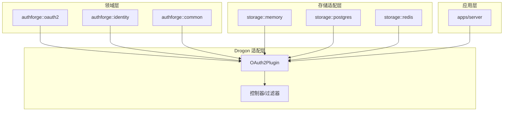
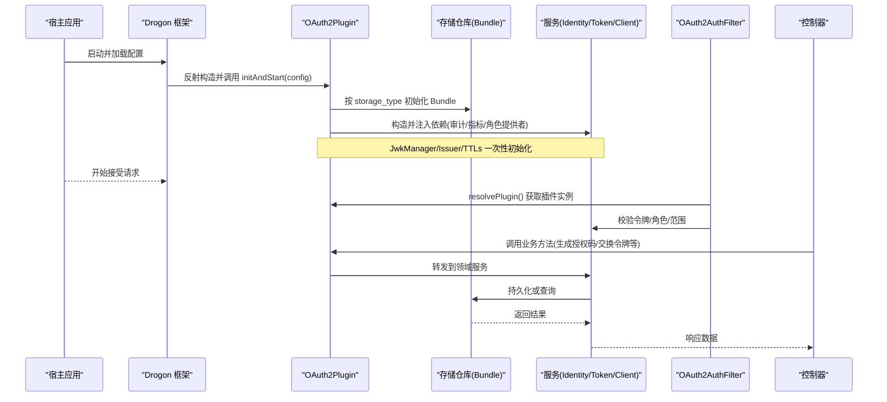
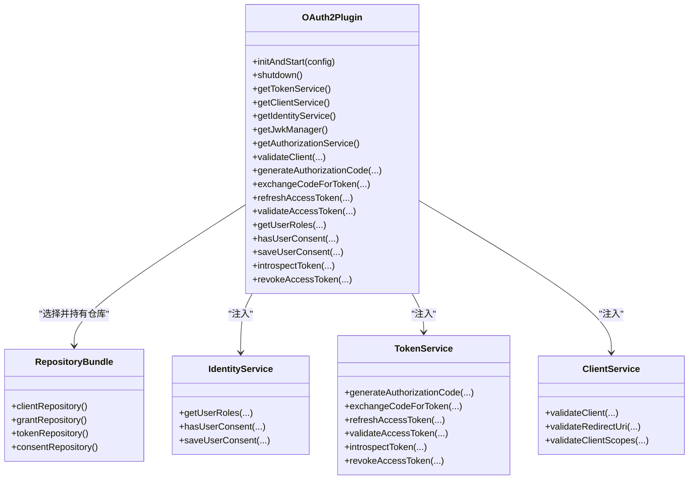
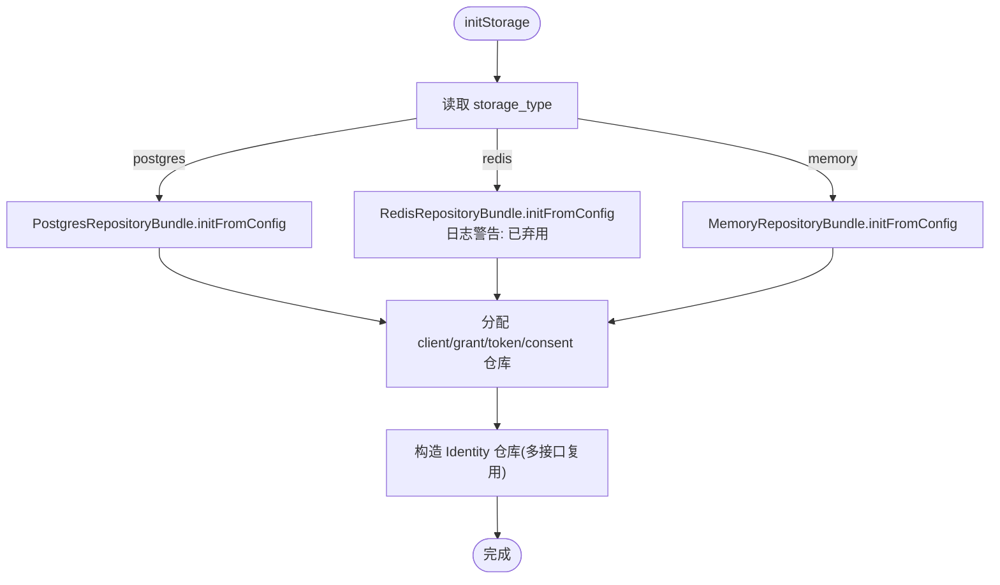
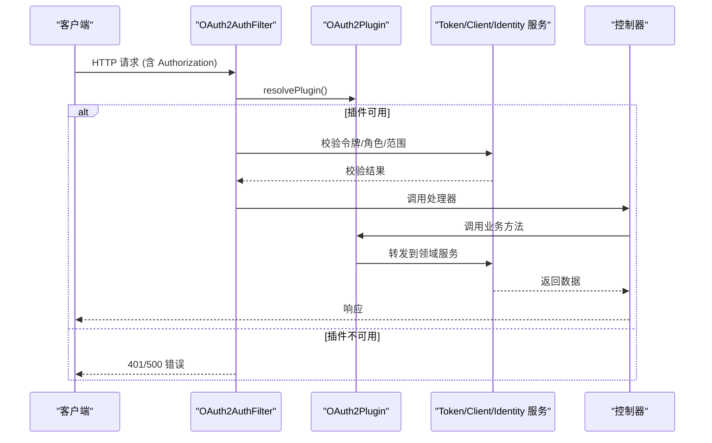
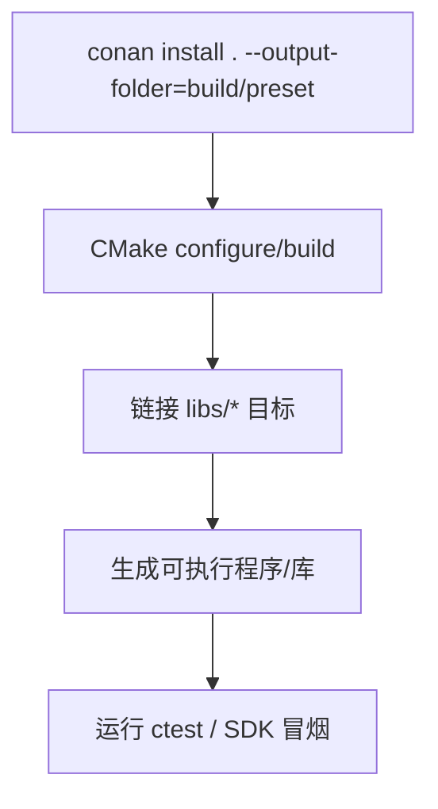
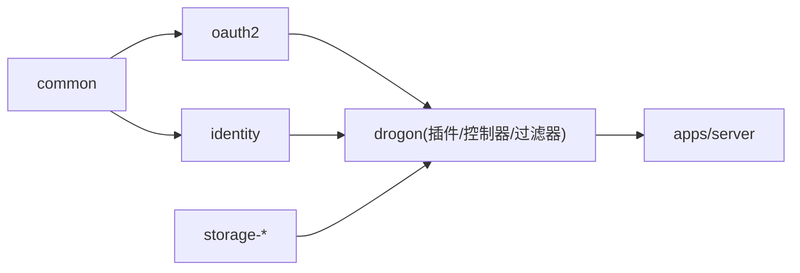

# 插件架构设计

<cite>
**本文引用的文件**
- [OAuth2Plugin.h](file://libs/drogon/include/authforge/drogon/plugin/OAuth2Plugin.h)
- [OAuth2Plugin.cc](file://libs/drogon/src/plugin/OAuth2Plugin.cc)
- [OAuth2AuthFilter.cc](file://libs/drogon/src/filters/OAuth2AuthFilter.cc)
- [SessionController.h](file://libs/drogon/include/authforge/drogon/controllers/SessionController.h)
- [MemoryRepositoryBundle.h](file://libs/storage-memory/include/authforge/storage/memory/MemoryRepositoryBundle.h)
- [PostgresGrantRepository.h](file://libs/storage-postgres/include/authforge/storage/postgres/PostgresGrantRepository.h)
- [PostgresConsentRepository.h](file://libs/storage-postgres/include/authforge/storage/postgres/PostgresConsentRepository.h)
- [RedisConsentRepository.h](file://libs/storage-redis/include/authforge/storage/redis/RedisConsentRepository.h)
- [MemoryClientRepository.h](file://libs/storage-memory/include/authforge/storage/memory/MemoryClientRepository.h)
- [MemoryTokenRepository.h](file://libs/storage-memory/include/authforge/storage/memory/MemoryTokenRepository.h)
- [PostgresClientRepository.h](file://libs/storage-postgres/include/authforge/storage/postgres/PostgresClientRepository.h)
- [IdentityService.h](file://libs/drogon/include/authforge/drogon/services/IdentityService.h)
- [RoleProvider.h](file://libs/identity/include/authforge/identity/RoleProvider.h)
- [AuthorizationEndpointController.cc](file://libs/drogon/src/controllers/AuthorizationEndpointController.cc)
- [DiscoveryController.cc](file://libs/drogon/src/controllers/DiscoveryController.cc)
- [CMakeLists.txt](file://CMakeLists.txt)
- [conanfile.py](file://conanfile.py)
- [release.yml](file://.github/workflows/release.yml)
- [_sdk-smoke.yml](file://.github/workflows/_sdk-smoke.yml)
- [plugin-integration.md](file://docs/backend/plugin-integration.md)
- [sdk-runtime-contract.md](file://docs/backend/sdk-runtime-contract.md)
</cite>

## 目录
1. [简介](#简介)
2. [项目结构](#项目结构)
3. [核心组件](#核心组件)
4. [架构总览](#架构总览)
5. [详细组件分析](#详细组件分析)
6. [依赖关系分析](#依赖关系分析)
7. [性能考虑](#性能考虑)
8. [故障排查指南](#故障排查指南)
9. [结论](#结论)
10. [附录](#附录)

## 简介
本文件面向希望理解与扩展 AuthForge 插件系统的工程师，系统性说明插件生命周期、依赖注入、配置加载、插件发现机制，以及 OAuth2Plugin 在 Drogon 框架中的集成方式（自动注册、控制器与过滤器）。同时覆盖编译打包流程（CMake + Conan）与 SDK 发布要点，并给出存储、认证提供商、权限验证等接口抽象的规范与最佳实践。

## 项目结构
AuthForge 采用分层与模块化组织：
- Domain 层：oauth2、identity、common（端口定义、DTO、算法）
- Storage 适配层：memory/postgres/redis 的具体仓库实现
- Adapter/Drogon 层：OAuth2Plugin、控制器、过滤器、视图
- 应用层：apps/server 提供宿主入口与迁移、OpenAPI 等
- 构建与发布：根 CMakeLists、Conan 描述、CI/CD 工作流

图表来源
- [CMakeLists.txt:72-118](file://CMakeLists.txt#L72-L118)

章节来源
- [CMakeLists.txt:1-171](file://CMakeLists.txt#L1-L171)

## 核心组件
- OAuth2Plugin：插件入口，负责初始化存储、服务、JWK、清理任务，暴露统一 API 给控制器与过滤器使用。
- 存储仓库聚合：Memory/Postgres/Redis RepositoryBundle 按 storage_type 选择后端，解耦具体存储。
- 身份与服务：IdentityService、RoleProvider、AuthorizationService 等组合成授权与鉴权能力。
- 过滤器：OAuth2AuthFilter 对请求进行 Bearer Token 校验，通过 resolvePlugin 获取插件实例。
- 控制器：SessionController、DiscoveryController 等通过插件提供的服务完成业务逻辑。

章节来源
- [OAuth2Plugin.h:50-115](file://libs/drogon/include/authforge/drogon/plugin/OAuth2Plugin.h#L50-L115)
- [OAuth2Plugin.cc:30-200](file://libs/drogon/src/plugin/OAuth2Plugin.cc#L30-L200)
- [OAuth2AuthFilter.cc:7-41](file://libs/drogon/src/filters/OAuth2AuthFilter.cc#L7-L41)
- [SessionController.h:66-100](file://libs/drogon/include/authforge/drogon/controllers/SessionController.h#L66-L100)

## 架构总览
插件系统围绕“配置驱动 + 服务装配 + 接口解耦”展开：
- 配置加载：initAndStart 读取 config.json 中 plugins[].config，解析 storage_type、tokens TTL、oidc issuer 等。
- 插件发现：Drogon 根据 plugins[].name 反射构造 OAuth2Plugin；控制器/过滤器通过 ADD_METHOD_TO 字符串引用被动注册。
- 依赖注入：插件在 init 阶段组装各 RepositoryBundle、Service、Adapter（审计、指标、角色提供者），以 shared_ptr 共享所有权。
- 生命周期：initAndStart -> 运行期请求处理 -> shutdown 有序释放资源。

图表来源
- [OAuth2Plugin.cc:30-200](file://libs/drogon/src/plugin/OAuth2Plugin.cc#L30-L200)
- [OAuth2AuthFilter.cc:7-41](file://libs/drogon/src/filters/OAuth2AuthFilter.cc#L7-L41)
- [SessionController.h:66-100](file://libs/drogon/include/authforge/drogon/controllers/SessionController.h#L66-L100)

## 详细组件分析

### OAuth2Plugin 生命周期与依赖注入
- 初始化顺序：
  - 解析 storage_type，选择 Memory/Postgres/Redis Bundle，提取四个 OAuth2 仓库与三个 Identity 仓库。
  - 初始化 JwkManager（只读发布）、读取 metadata.issuer 并规范化尾部斜杠。
  - 构造 TokenService/ClientService/IdentityService，注入审计、指标、角色提供者与主题解析器。
  - 启动清理服务（基于 grant/token 仓库）。
- 生命周期管理：
  - shutdown 中先停止清理任务，再依次释放服务与仓库句柄，确保异步回调完成后销毁底层存储。
- 对外暴露：
  - 统一的异步 API（validateClient、generateAuthorizationCode、exchangeCodeForToken、refreshAccessToken、validateAccessToken、getUserRoles、hasUserConsent/saveUserConsent、introspectToken/revokeAccessToken 等）。
  - 可观测性端口（IAuditSink/IMetrics）与授权引擎（AuthorizationService）。

图表来源
- [OAuth2Plugin.h:50-115](file://libs/drogon/include/authforge/drogon/plugin/OAuth2Plugin.h#L50-L115)
- [OAuth2Plugin.cc:118-199](file://libs/drogon/src/plugin/OAuth2Plugin.cc#L118-L199)

章节来源
- [OAuth2Plugin.cc:30-200](file://libs/drogon/src/plugin/OAuth2Plugin.cc#L30-L200)
- [OAuth2Plugin.cc:202-322](file://libs/drogon/src/plugin/OAuth2Plugin.cc#L202-L322)
- [OAuth2Plugin.cc:324-361](file://libs/drogon/src/plugin/OAuth2Plugin.cc#L324-L361)

### 存储后端与仓库聚合
- 存储类型选择：
  - postgres：使用 PostgresRepositoryBundle，并从同一 DbClient 构造 PostgresIdentityRepository 作为三个 Identity 仓库的共享实现。
  - redis：已弃用独立模式，仅保留兼容；刷新令牌流程拒绝 unsupported_grant_type。
  - memory：默认开发模式，从 clients/admin_users 配置初始化。
- 仓库职责：
  - IClientRepository：客户端信息、重定向 URI、客户端作用域校验。
  - IGrantRepository：授权码与授权事务。
  - ITokenRepository：访问令牌、刷新令牌、令牌元数据。
  - IConsentRepository：用户同意记录。

图表来源
- [OAuth2Plugin.cc:202-322](file://libs/drogon/src/plugin/OAuth2Plugin.cc#L202-L322)
- [MemoryRepositoryBundle.h:40-72](file://libs/storage-memory/include/authforge/storage/memory/MemoryRepositoryBundle.h#L40-L72)

章节来源
- [PostgresGrantRepository.h:1-31](file://libs/storage-postgres/include/authforge/storage/postgres/PostgresGrantRepository.h#L1-L31)
- [PostgresConsentRepository.h:1-28](file://libs/storage-postgres/include/authforge/storage/postgres/PostgresConsentRepository.h#L1-L28)
- [RedisConsentRepository.h:1-28](file://libs/storage-redis/include/authforge/storage/redis/RedisConsentRepository.h#L1-L28)
- [MemoryClientRepository.h:49-79](file://libs/storage-memory/include/authforge/storage/memory/MemoryClientRepository.h#L49-L79)
- [MemoryTokenRepository.h:29-53](file://libs/storage-memory/include/authforge/storage/memory/MemoryTokenRepository.h#L29-L53)
- [PostgresClientRepository.h:1-28](file://libs/storage-postgres/include/authforge/storage/postgres/PostgresClientRepository.h#L1-L28)

### 过滤器与控制器集成
- 过滤器：
  - OAuth2AuthFilter 在 doFilter 中通过 resolvePlugin 获取插件实例，若不可用则返回内部错误；OPTIONS 请求直接放行；否则校验 Authorization 头并继续链式处理。
- 控制器：
  - SessionController 挂载 OAuth2AuthFilter 保护登录/同意/注销等路由；内部通过插件方法调用领域服务。
  - DiscoveryController 在 JWKS 端点中通过插件获取 JwkManager，保证无缓存空键的安全行为。

图表来源
- [OAuth2AuthFilter.cc:7-41](file://libs/drogon/src/filters/OAuth2AuthFilter.cc#L7-L41)
- [SessionController.h:66-100](file://libs/drogon/include/authforge/drogon/controllers/SessionController.h#L66-L100)
- [DiscoveryController.cc:232-259](file://libs/drogon/src/controllers/DiscoveryController.cc#L232-L259)

章节来源
- [AuthorizationEndpointController.cc:36-64](file://libs/drogon/src/controllers/AuthorizationEndpointController.cc#L36-L64)

### 插件发现与自动注册
- 插件发现：Drogon 根据 config.json 中 plugins[].name 反射构造 OAuth2Plugin；类名契约保持稳定。
- 自动注册：
  - 控制器与过滤器通过 ADD_METHOD_TO 字符串引用被动注册；过滤器保持 AutoCreation=true，由框架动态查找实例。
  - 插件本身不适用 AutoCreation 模板参数，需依赖反射机制。

章节来源
- [plugin-integration.md:40-87](file://docs/backend/plugin-integration.md#L40-L87)
- [sdk-runtime-contract.md:60-74](file://docs/backend/sdk-runtime-contract.md#L60-L74)

### 配置加载系统
- tokens 块：设置 auth_code_ttl、access_token_ttl、refresh_token_ttl。
- oidc 块：初始化 JwkManager（支持空配置生成临时密钥）。
- metadata.issuer：标准化后用于令牌签发与发现文档一致性。
- storage_type 与对应后端配置块（postgres/redis/clients/admin_users）。

章节来源
- [OAuth2Plugin.cc:47-117](file://libs/drogon/src/plugin/OAuth2Plugin.cc#L47-L117)

### 插件接口规范（抽象定义）
- 存储插件接口（按仓库划分）：
  - IClientRepository：客户端信息查询与校验。
  - IGrantRepository：授权码与授权事务 CRUD。
  - ITokenRepository：令牌存取与元数据更新。
  - IConsentRepository：用户同意记录管理。
- 认证提供商接口（身份侧）：
  - RoleProvider：基于 IRoleRepository 的角色查询。
  - UserInfoProvider：基于 IUserRepository 的用户信息与角色集合。
- 权限验证器接口（领域侧）：
  - AuthorizationService：评估作用域、管理员角色要求、用户同意与客户端白名单。

章节来源
- [RoleProvider.h:1-42](file://libs/identity/include/authforge/identity/RoleProvider.h#L1-L42)
- [IdentityService.h:29-57](file://libs/drogon/include/authforge/drogon/services/IdentityService.h#L29-L57)
- [AuthorizationService.cc:45-83](file://libs/oauth2/src/protocol/AuthorizationService.cc#L45-L83)

### 编译打包流程（CMake + Conan + SDK 发布）
- CMake 顶层：
  - 启用 C++17、测试、可选功能开关（WITH_IDENTITY/WITH_SOCIAL/WITH_WEBAUTHN）。
  - 子目录顺序体现依赖：common -> oauth2 -> identity -> storage-* -> drogon -> server -> tests -> examples。
- Conan 依赖：
  - 声明 drogon、openssl、jsoncpp、hiredis、libcurl、brotli、zlib 等版本。
  - 将 with_* 选项映射为 CMake 变量，控制条件编译。
- CI/SDK 冒烟：
  - release.yml 与 _sdk-smoke.yml 使用 conan install 生成工具链，添加 drogon_ctl 到 PATH，执行构建与冒烟测试。

图表来源
- [CMakeLists.txt:33-171](file://CMakeLists.txt#L33-L171)
- [conanfile.py:27-83](file://conanfile.py#L27-L83)
- [release.yml:97-124](file://.github/workflows/release.yml#L97-L124)
- [_sdk-smoke.yml:43-74](file://.github/workflows/_sdk-smoke.yml#L43-L74)

章节来源
- [CMakeLists.txt:1-171](file://CMakeLists.txt#L1-L171)
- [conanfile.py:1-83](file://conanfile.py#L1-L83)
- [release.yml:97-124](file://.github/workflows/release.yml#L97-L124)
- [_sdk-smoke.yml:43-74](file://.github/workflows/_sdk-smoke.yml#L43-L74)

## 依赖关系分析
- 耦合与内聚：
  - OAuth2Plugin 高内聚地封装了存储、服务、适配器装配；对外暴露稳定接口，降低控制器与过滤器的耦合。
  - 存储层通过 RepositoryBundle 聚合，单一入口初始化，提升内聚性。
- 外部依赖：
  - Drogon（框架）、OpenSSL（加密）、JSON（配置）、PostgreSQL/Redis（存储）。
- 循环依赖规避：
  - Domain 层不依赖 Drogon；Adapter 层依赖 Domain；插件位于 Adapter 层，避免反向依赖。

图表来源
- [CMakeLists.txt:57-118](file://CMakeLists.txt#L57-L118)

章节来源
- [CMakeLists.txt:57-118](file://CMakeLists.txt#L57-L118)

## 性能考虑
- 令牌与授权码 TTL：
  - 通过 tokens 配置集中管理，避免硬编码，减少过期策略不一致带来的重试开销。
- 并发安全：
  - JwkManager 在 initAndStart 中一次性初始化并发布为 const shared_ptr，后续只读访问无需锁。
  - 清理服务按间隔调度，避免频繁扫描。
- 存储后端特性：
  - Memory 仓库使用递归互斥同步回调，保证内存态一致性；Postgres/Redis 实现遵循各自并发模型。
- 弃用路径：
  - Redis 独立模式不支持刷新令牌旋转，显式拒绝以避免无效重试。

章节来源
- [OAuth2Plugin.cc:58-85](file://libs/drogon/src/plugin/OAuth2Plugin.cc#L58-L85)
- [OAuth2Plugin.cc:191-199](file://libs/drogon/src/plugin/OAuth2Plugin.cc#L191-L199)
- [MemoryTokenRepository.h:29-53](file://libs/storage-memory/include/authforge/storage/memory/MemoryTokenRepository.h#L29-L53)
- [OAuth2Plugin.cc:420-444](file://libs/drogon/src/plugin/OAuth2Plugin.cc#L420-L444)

## 故障排查指南
- 插件不可用：
  - 现象：过滤器返回内部错误，提示插件不可用。
  - 排查：确认 config.json 中 plugins[].name 为 "OAuth2Plugin"；检查 Drogon 反射是否成功；查看 initAndStart 日志。
- 刷新令牌失败：
  - 现象：unsupported_grant_type。
  - 原因：storage_type="redis" 模式下刷新令牌不被支持。
  - 解决：切换到 storage_type="postgres"。
- JWKS 缓存问题：
  - 现象：JWKS 为空导致下游验证失败。
  - 处理：当前实现不缓存空响应，避免长期失效；检查插件初始化是否完成。

章节来源
- [OAuth2AuthFilter.cc:7-41](file://libs/drogon/src/filters/OAuth2AuthFilter.cc#L7-L41)
- [OAuth2Plugin.cc:420-444](file://libs/drogon/src/plugin/OAuth2Plugin.cc#L420-L444)
- [DiscoveryController.cc:232-259](file://libs/drogon/src/controllers/DiscoveryController.cc#L232-L259)

## 结论
AuthForge 插件架构以 OAuth2Plugin 为核心，通过配置驱动与依赖注入将存储、服务、适配器有机组合，提供稳定的异步 API。控制器与过滤器通过 Drogon 的自动注册机制接入，形成清晰的请求处理链路。存储层通过 RepositoryBundle 解耦后端差异，便于扩展与维护。构建与发布流程借助 CMake 与 Conan 实现跨平台一致性与可复现性。遵循接口规范与最佳实践，可在保障安全与性能的前提下快速扩展新的存储、认证与权限能力。

## 附录
- 插件集成步骤参考：
  - 在宿主应用的 config.json 中配置 OAuth2Plugin 及其存储与 Redis 客户端名称。
  - 在业务控制器中使用 AuthorizationFilter 保护 API。
- SDK 运行时契约：
  - 插件类名与配置契约保持稳定；当前以 OBJECT 库形态链接，无需 whole-archive；未来静态库分发时需引入强制链接方案。

章节来源
- [plugin-integration.md:40-87](file://docs/backend/plugin-integration.md#L40-L87)
- [sdk-runtime-contract.md:60-74](file://docs/backend/sdk-runtime-contract.md#L60-L74)