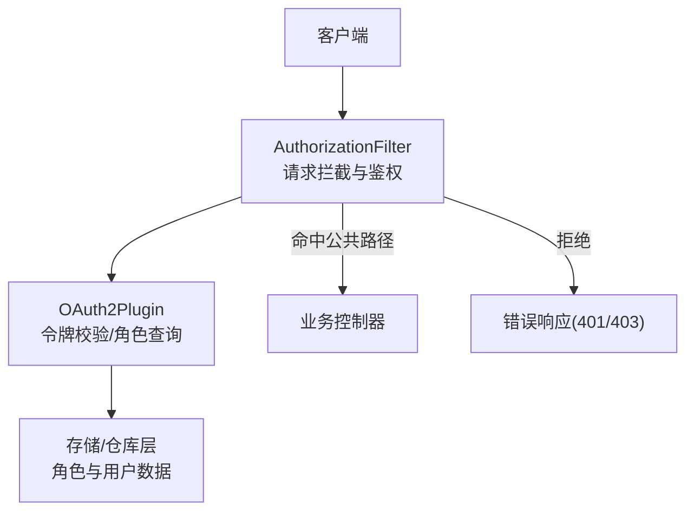
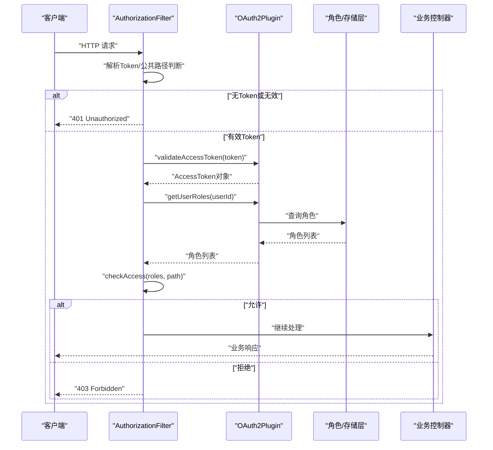
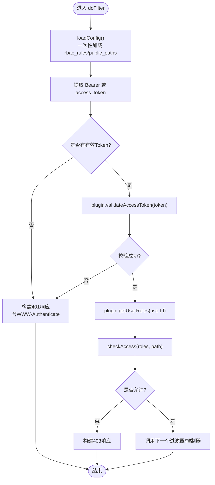
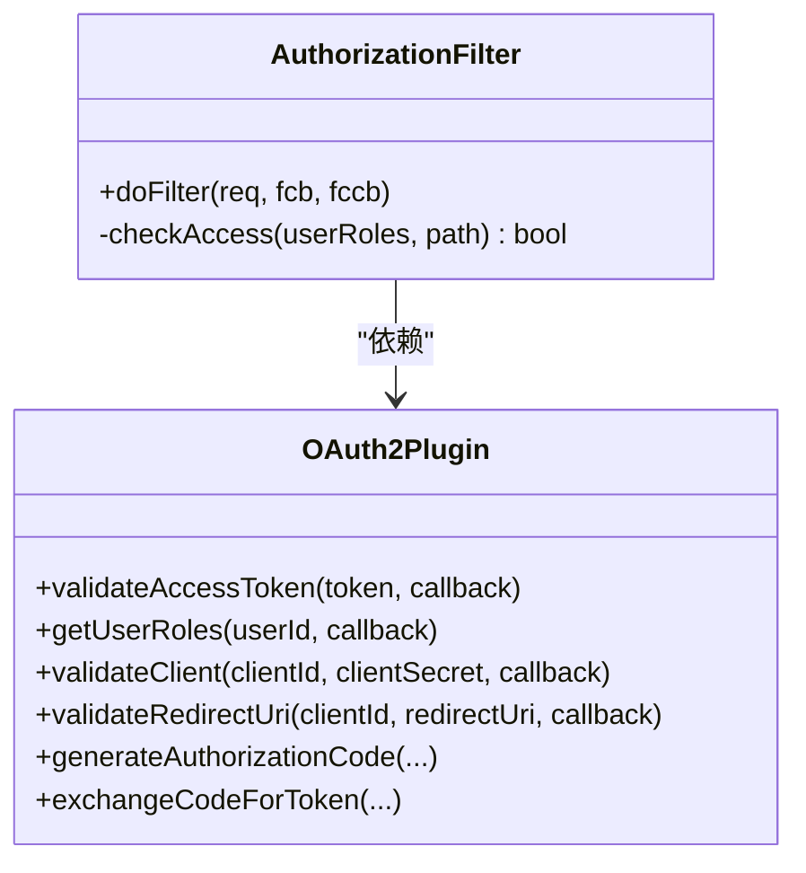
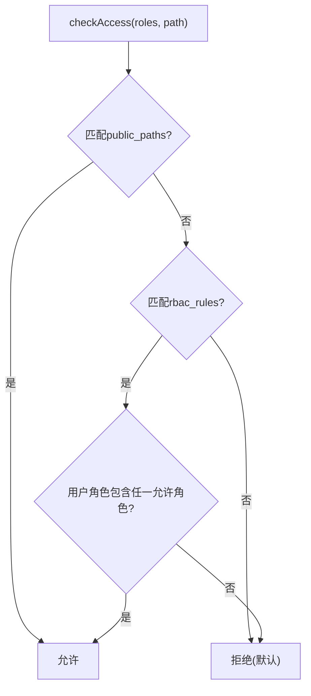
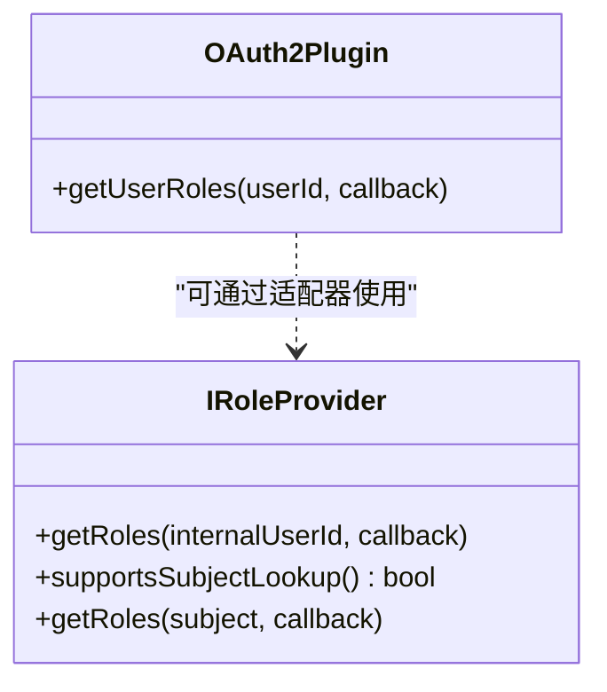
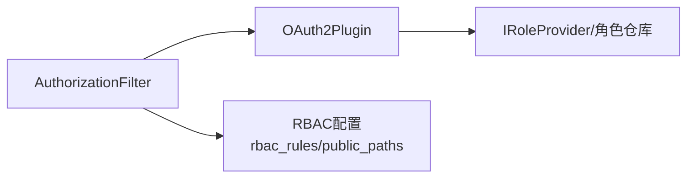

# 权限验证插件开发

<cite>
**本文引用的文件**
- [AuthorizationFilter.h](file://libs/drogon/include/authforge/drogon/filters/AuthorizationFilter.h)
- [AuthorizationFilter.cc](file://libs/drogon/src/filters/AuthorizationFilter.cc)
- [OAuth2Plugin.h](file://libs/drogon/include/authforge/drogon/plugin/OAuth2Plugin.h)
- [IRoleProvider.h](file://libs/common/include/authforge/common/ports/IRoleProvider.h)
- [rbac-guide.md](file://docs/backend/rbac-guide.md)
- [config.json](file://apps/server/config/config.json)
- [Property4_RbacDecisionBaselineTest.cc](file://tests/integration/concurrency/Property4_RbacDecisionBaselineTest.cc)
</cite>

## 目录
1. [简介](#简介)
2. [项目结构](#项目结构)
3. [核心组件](#核心组件)
4. [架构总览](#架构总览)
5. [详细组件分析](#详细组件分析)
6. [依赖关系分析](#依赖关系分析)
7. [性能与缓存优化](#性能与缓存优化)
8. [故障排查指南](#故障排查指南)
9. [结论](#结论)
10. [附录](#附录)

## 简介
本指南面向需要在 AuthForge 中扩展或定制权限验证插件的开发者，围绕 RBAC（基于角色的访问控制）接口规范、扩展机制以及复杂权限规则实现展开。内容涵盖：
- 角色定义、权限范围与访问控制策略
- 自定义权限验证器的实现思路（ABAC 属性访问控制、基于上下文的权限检查）
- 复杂权限规则：时间限制、IP 白名单、资源级权限控制
- 企业级权限模型与动态权限分配示例
- 权限验证的性能优化与缓存策略

## 项目结构
本项目在 Drogon 框架之上通过 HTTP Filter 拦截请求，结合 OAuth2Plugin 提供的令牌校验与角色查询能力，实现统一的鉴权与授权流程。RBAC 规则通过配置加载，并在过滤器中匹配 URL 路径与用户角色。

图表来源
- [AuthorizationFilter.cc:82-193](file://libs/drogon/src/filters/AuthorizationFilter.cc#L82-L193)
- [OAuth2Plugin.h:225-236](file://libs/drogon/include/authforge/drogon/plugin/OAuth2Plugin.h#L225-L236)

章节来源
- [AuthorizationFilter.h:17-67](file://libs/drogon/include/authforge/drogon/filters/AuthorizationFilter.h#L17-L67)
- [AuthorizationFilter.cc:22-80](file://libs/drogon/src/filters/AuthorizationFilter.cc#L22-L80)
- [config.json:172-185](file://apps/server/config/config.json#L172-L185)

## 核心组件
- AuthorizationFilter：HTTP 过滤器，负责提取 Token、校验、获取用户角色并执行 RBAC 决策。
- OAuth2Plugin：提供令牌校验、角色查询、客户端与重定向 URI 校验等能力。
- IRoleProvider：角色提供者端口，用于解耦身份系统与协议层的耦合。
- RBAC 配置：通过 custom_config.rbac_rules 定义 URL 正则与所需角色集合。

章节来源
- [AuthorizationFilter.h:17-67](file://libs/drogon/include/authforge/drogon/filters/AuthorizationFilter.h#L17-L67)
- [AuthorizationFilter.cc:82-193](file://libs/drogon/src/filters/AuthorizationFilter.cc#L82-L193)
- [OAuth2Plugin.h:225-236](file://libs/drogon/include/authforge/drogon/plugin/OAuth2Plugin.h#L225-L236)
- [IRoleProvider.h:41-73](file://libs/common/include/authforge/common/ports/IRoleProvider.h#L41-L73)
- [rbac-guide.md:41-69](file://docs/backend/rbac-guide.md#L41-L69)
- [config.json:172-185](file://apps/server/config/config.json#L172-L185)

## 架构总览
下图展示了从请求进入、过滤器处理、令牌校验、角色查询到最终授权决策的完整链路。

图表来源
- [AuthorizationFilter.cc:82-193](file://libs/drogon/src/filters/AuthorizationFilter.cc#L82-L193)
- [OAuth2Plugin.h:225-236](file://libs/drogon/include/authforge/drogon/plugin/OAuth2Plugin.h#L225-L236)

## 详细组件分析

### AuthorizationFilter 组件分析
AuthorizationFilter 是权限验证的核心入口，承担以下职责：
- 加载 RBAC 规则与公共路径配置（线程安全、一次性初始化）
- 提取并校验 Access Token
- 获取用户角色并执行 RBAC 决策
- 返回标准错误响应（401/403），遵循 RFC 6750 的 WWW-Authenticate 挑战

图表来源
- [AuthorizationFilter.cc:22-80](file://libs/drogon/src/filters/AuthorizationFilter.cc#L22-L80)
- [AuthorizationFilter.cc:82-193](file://libs/drogon/src/filters/AuthorizationFilter.cc#L82-L193)
- [AuthorizationFilter.cc:195-228](file://libs/drogon/src/filters/AuthorizationFilter.cc#L195-L228)

章节来源
- [AuthorizationFilter.h:17-67](file://libs/drogon/include/authforge/drogon/filters/AuthorizationFilter.h#L17-L67)
- [AuthorizationFilter.cc:82-193](file://libs/drogon/src/filters/AuthorizationFilter.cc#L82-L193)
- [AuthorizationFilter.cc:195-228](file://libs/drogon/src/filters/AuthorizationFilter.cc#L195-L228)

### OAuth2Plugin 角色与令牌能力
OAuth2Plugin 暴露了令牌校验与角色查询的关键方法，供过滤器和业务逻辑使用：
- validateAccessToken：校验 Access Token 并返回 AccessToken 对象
- getUserRoles：根据 userId 异步获取角色列表
- 其他相关能力：validateClient、validateRedirectUri、generateAuthorizationCode、exchangeCodeForToken 等

图表来源
- [OAuth2Plugin.h:225-236](file://libs/drogon/include/authforge/drogon/plugin/OAuth2Plugin.h#L225-L236)
- [AuthorizationFilter.cc:142-193](file://libs/drogon/src/filters/AuthorizationFilter.cc#L142-L193)

章节来源
- [OAuth2Plugin.h:225-236](file://libs/drogon/include/authforge/drogon/plugin/OAuth2Plugin.h#L225-L236)
- [AuthorizationFilter.cc:142-193](file://libs/drogon/src/filters/AuthorizationFilter.cc#L142-L193)

### RBAC 决策与测试基线
RBAC 决策由 checkAccess 实现，支持：
- 公共路径放行（public_paths）
- 正则匹配 URL 路径，要求具备指定角色之一
- 默认拒绝（未匹配任何规则且非公共路径）

集成测试通过“生产镜像”决策模型与独立期望模型交叉验证，确保行为一致性与稳定性。

图表来源
- [AuthorizationFilter.cc:195-228](file://libs/drogon/src/filters/AuthorizationFilter.cc#L195-L228)
- [Property4_RbacDecisionBaselineTest.cc:97-177](file://tests/integration/concurrency/Property4_RbacDecisionBaselineTest.cc#L97-L177)

章节来源
- [AuthorizationFilter.cc:195-228](file://libs/drogon/src/filters/AuthorizationFilter.cc#L195-L228)
- [Property4_RbacDecisionBaselineTest.cc:97-177](file://tests/integration/concurrency/Property4_RbacDecisionBaselineTest.cc#L97-L177)

### 扩展点与接口契约
- IRoleProvider：以内部用户 ID 或 subject 字符串查询角色，便于将身份系统解耦为可替换实现
- OAuth2Plugin 的角色查询方法：作为 Drogon 层对 IRoleProvider 的封装与转发

图表来源
- [IRoleProvider.h:41-73](file://libs/common/include/authforge/common/ports/IRoleProvider.h#L41-L73)
- [OAuth2Plugin.h:225-236](file://libs/drogon/include/authforge/drogon/plugin/OAuth2Plugin.h#L225-L236)

章节来源
- [IRoleProvider.h:41-73](file://libs/common/include/authforge/common/ports/IRoleProvider.h#L41-L73)
- [OAuth2Plugin.h:225-236](file://libs/drogon/include/authforge/drogon/plugin/OAuth2Plugin.h#L225-L236)

## 依赖关系分析
- AuthorizationFilter 依赖 OAuth2Plugin 进行令牌与角色操作
- OAuth2Plugin 依赖存储/仓库层（角色、用户、客户端、同意记录等）
- RBAC 规则来源于配置（custom_config.rbac_rules），公共路径来自 public_paths

图表来源
- [AuthorizationFilter.cc:82-193](file://libs/drogon/src/filters/AuthorizationFilter.cc#L82-L193)
- [OAuth2Plugin.h:225-236](file://libs/drogon/include/authforge/drogon/plugin/OAuth2Plugin.h#L225-L236)
- [config.json:172-185](file://apps/server/config/config.json#L172-L185)

章节来源
- [AuthorizationFilter.cc:82-193](file://libs/drogon/src/filters/AuthorizationFilter.cc#L82-L193)
- [OAuth2Plugin.h:225-236](file://libs/drogon/include/authforge/drogon/plugin/OAuth2Plugin.h#L225-L236)
- [config.json:172-185](file://apps/server/config/config.json#L172-L185)

## 性能与缓存优化
- 规则加载一次性初始化：使用 std::call_once 保证线程安全与仅一次加载，避免重复编译正则与内存抖动
- 原子提交：在本地容器构建完成后交换成员变量，防止异常导致部分填充状态
- 令牌与角色缓存建议：
  - 对 getUserRoles 的结果按 userId 做短期缓存（如 LRU），减少数据库压力
  - 对 validateAccessToken 的结果按 token 做短期缓存，注意失效策略（撤销、过期）
- 批量写入：对于多 scope 同意记录等场景，采用批量插入降低 IO 次数
- 限流与白名单：结合 Hodor 等速率限制插件，保护高敏感端点；利用 trust_ips 白名单提升开发/内网体验

章节来源
- [AuthorizationFilter.cc:22-80](file://libs/drogon/src/filters/AuthorizationFilter.cc#L22-L80)
- [docs/history/design/superpowers/specs/2026-04-13-hodor-rate-limiter-migration-design.md:196-238](file://docs/history/design/superpowers/specs/2026-04-13-hodor-rate-limiter-migration-design.md#L196-L238)
- [docs/history/design/superpowers/plans/2026-05-06-oauth2-security-compliance-implementation-v5.1.md:1581-1619](file://docs/history/design/superpowers/plans/2026-05-06-oauth2-security-compliance-implementation-v5.1.md#L1581-L1619)

## 故障排查指南
- 401 Unauthorized：
  - 缺少 Token 或 Token 无效/过期
  - 检查 Authorization 头或 access_token 参数
  - 确认 WWW-Authenticate 头是否正确设置
- 403 Forbidden：
  - 用户角色不满足 RBAC 规则
  - 检查 rbac_rules 配置与用户角色映射
- 公共路径未生效：
  - 检查 public_paths 配置与正则表达式
- 性能问题：
  - 观察角色查询与令牌校验延迟
  - 启用缓存并监控命中率
  - 使用基准测试工具评估吞吐与延迟

章节来源
- [AuthorizationFilter.cc:109-166](file://libs/drogon/src/filters/AuthorizationFilter.cc#L109-L166)
- [AuthorizationFilter.cc:179-188](file://libs/drogon/src/filters/AuthorizationFilter.cc#L179-L188)
- [rbac-guide.md:55-69](file://docs/backend/rbac-guide.md#L55-L69)

## 结论
AuthorizationFilter 与 OAuth2Plugin 共同构成了 AuthForge 的权限验证基础。通过 RBAC 配置与角色查询接口，可实现灵活的访问控制策略。借助 IRoleProvider 的端口化设计，可以平滑替换身份系统实现。在生产环境中，建议结合缓存、限流与白名单策略，保障性能与安全。

## 附录

### 企业级权限模型与动态权限分配示例
- 角色分层：基础角色（user）、管理角色（admin）、超级管理员（superadmin）
- 资源级权限：将资源标识（如租户ID、项目ID）纳入上下文，结合 ABAC 策略进行细粒度控制
- 动态分配：通过管理接口或事件驱动更新用户角色，实时刷新缓存

### ABAC 与上下文权限检查
- 属性维度：用户属性（部门、职级）、资源属性（敏感度、归属）、环境属性（时间、IP、设备）
- 策略引擎：在 checkAccess 基础上扩展上下文参数，实现更复杂的条件判断
- 审计与度量：记录决策结果与关键属性，便于审计与告警

### 复杂权限规则实现要点
- 时间限制：在 checkAccess 中加入时间窗口判断（如工作日、工作时间）
- IP 白名单：结合 Hodor 的 trust_ips 与应用层 IP 校验，双重防护
- 资源级别控制：将资源 ID 与策略绑定，结合租户隔离实现多租户权限

章节来源
- [AuthorizationFilter.cc:195-228](file://libs/drogon/src/filters/AuthorizationFilter.cc#L195-L228)
- [docs/history/design/superpowers/specs/2026-04-13-hodor-rate-limiter-migration-design.md:196-238](file://docs/history/design/superpowers/specs/2026-04-13-hodor-rate-limiter-migration-design.md#L196-L238)