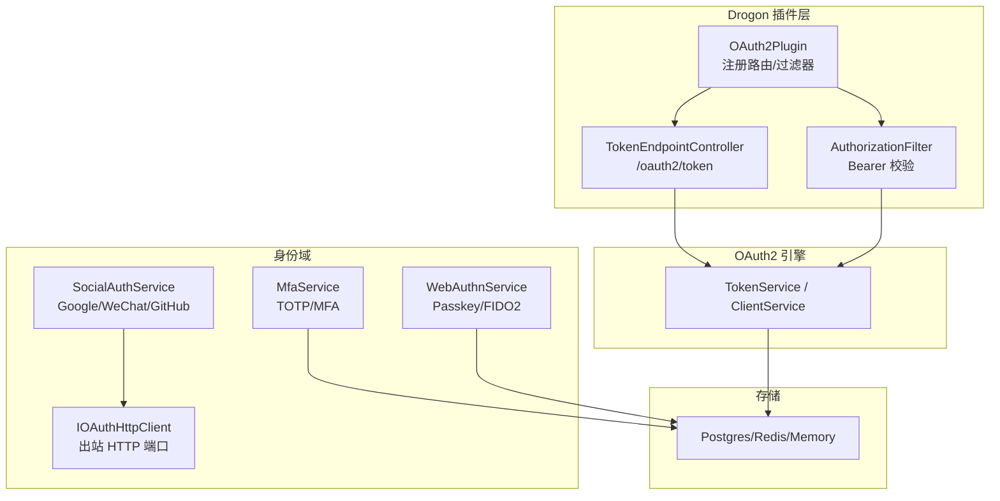
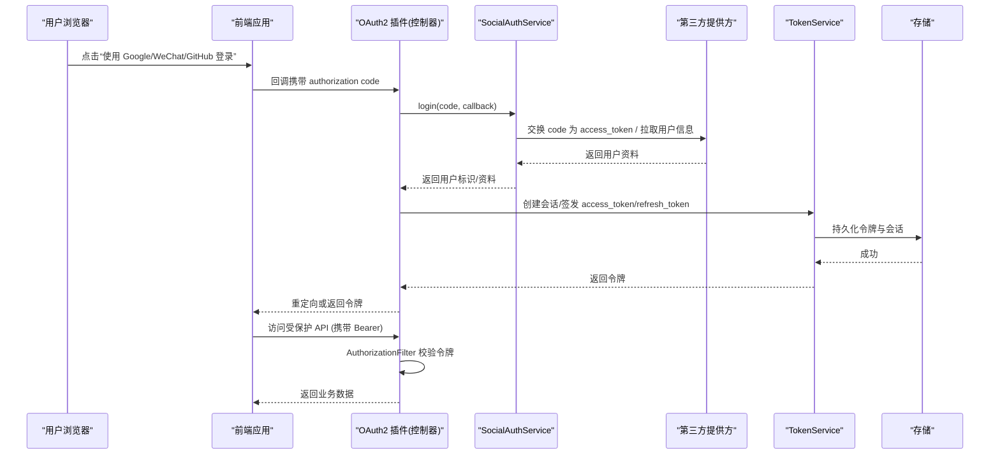
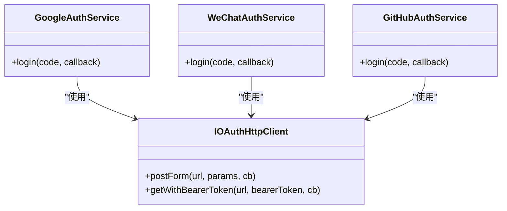
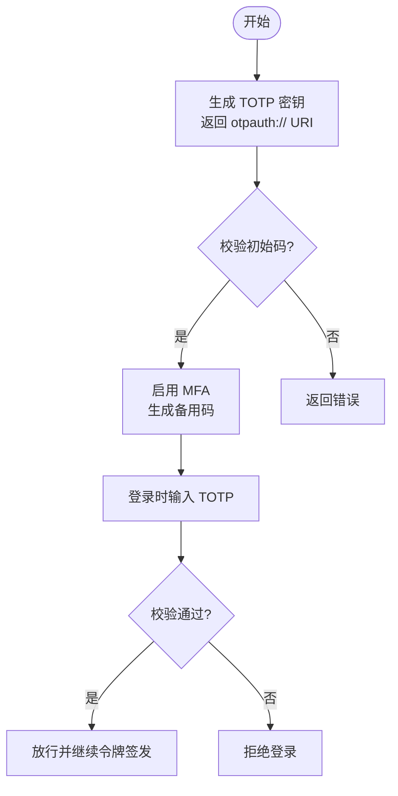
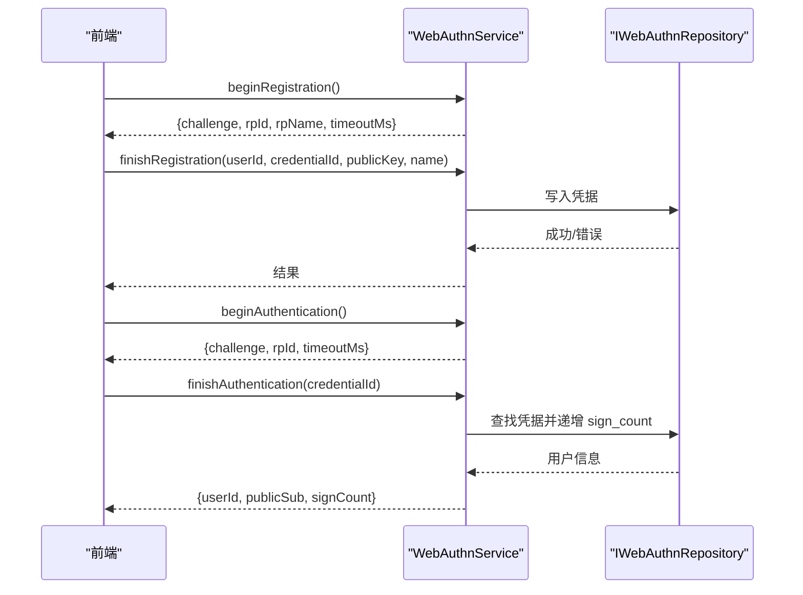
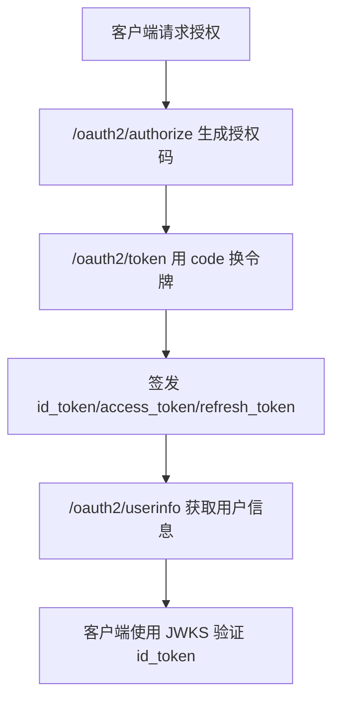
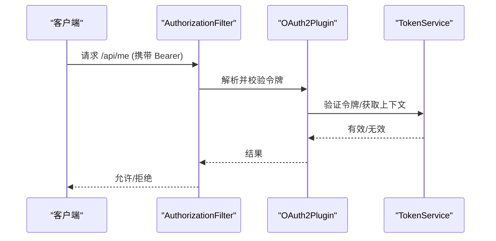
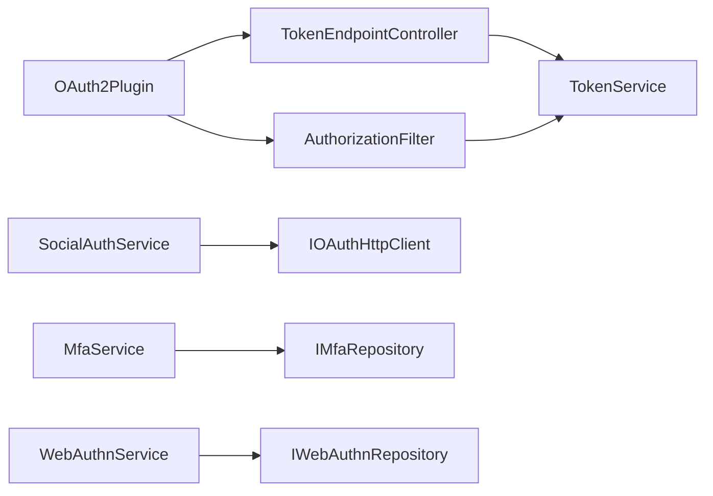

# 认证插件开发

<cite>
**本文引用的文件**
- [README.md](file://README.md)
- [plugin-integration.md](file://docs/backend/plugin-integration.md)
- [oidc-guide.md](file://docs/backend/oidc-guide.md)
- [google-guide.md](file://docs/backend/google-guide.md)
- [wechat-guide.md](file://docs/backend/wechat-guide.md)
- [OAuth2Plugin.h](file://libs/drogon/include/authforge/drogon/plugin/OAuth2Plugin.h)
- [OAuth2AuthFilter.cc](file://libs/drogon/src/filters/OAuth2AuthFilter.cc)
- [TokenEndpointController.cc](file://libs/drogon/src/controllers/TokenEndpointController.cc)
- [SocialAuthService.h](file://libs/identity/include/authforge/identity/SocialAuthService.h)
- [IOAuthHttpClient.h](file://libs/identity/include/authforge/identity/IOAuthHttpClient.h)
- [MfaService.h](file://libs/identity/include/authforge/identity/MfaService.h)
- [WebAuthnService.h](file://libs/identity/include/authforge/identity/WebAuthnService.h)
- [IdentityAssembly.h](file://apps/server/src/bootstrap/IdentityAssembly.h)
</cite>

## 目录
1. [简介](#简介)
2. [项目结构](#项目结构)
3. [核心组件](#核心组件)
4. [架构总览](#架构总览)
5. [详细组件分析](#详细组件分析)
6. [依赖关系分析](#依赖关系分析)
7. [性能考虑](#性能考虑)
8. [故障排查指南](#故障排查指南)
9. [结论](#结论)
10. [附录](#附录)

## 简介
本指南面向希望在 AuthForge 中开发“认证插件”的工程师，覆盖以下主题：
- 认证提供商接口规范与实现模式（用户信息获取、令牌验证、会话管理）
- 社交登录插件（Google、WeChat、GitHub）集成方法
- MFA 认证插件（TOTP、短信验证码、邮箱验证）
- WebAuthn/FIDO2 生物识别认证插件
- OAuth2/OIDC 协议集成与用户信息映射
- 安全考虑与最佳实践

本项目提供可嵌入的 C++ SDK 与基于 Drogon 的后端服务，支持 OAuth2/OIDC 全量协议、RBAC、审计日志、多存储后端等能力。

**章节来源**
- [README.md:16-51](file://README.md#L16-L51)

## 项目结构
从插件视角看，关键位置如下：
- libs/drogon：Drogon 插件、控制器、过滤器、视图；对外暴露 authforge::drogon 包
- libs/identity：身份域服务（认证、MFA、WebAuthn、RBAC），通过端口抽象外部依赖
- libs/oauth2：OAuth2/OIDC 引擎
- apps/server：服务端应用，装配并启动插件与服务
- docs/backend：插件集成、OIDC、Google/WeChat 接入指南

**图表来源**
- [OAuth2Plugin.h:50-82](file://libs/drogon/include/authforge/drogon/plugin/OAuth2Plugin.h#L50-L82)
- [OAuth2AuthFilter.cc:12-41](file://libs/drogon/src/filters/OAuth2AuthFilter.cc#L12-L41)
- [TokenEndpointController.cc:287-311](file://libs/drogon/src/controllers/TokenEndpointController.cc#L287-L311)
- [SocialAuthService.h:5-45](file://libs/identity/include/authforge/identity/SocialAuthService.h#L5-L45)
- [IOAuthHttpClient.h:5-41](file://libs/identity/include/authforge/identity/IOAuthHttpClient.h#L5-L41)

**章节来源**
- [README.md:31-51](file://README.md#L31-L51)
- [plugin-integration.md:5-15](file://docs/backend/plugin-integration.md#L5-L15)

## 核心组件
- OAuth2 插件与过滤器
  - OAuth2Plugin：加载配置、注册路由与过滤器，暴露 TokenService/ClientService/IdentityService
  - AuthorizationFilter：校验 Bearer 令牌，拦截未授权请求
- 令牌端点
  - TokenEndpointController：处理 token 交换、客户端认证、参数校验、指标上报
- 身份域服务
  - SocialAuthService：Google/WeChat/GitHub 三方登录流程封装
  - IOAuthHttpClient：出站 HTTP 端口，统一 postForm/getWithBearerToken
  - MfaService：TOTP 设置、启用、禁用、登录时校验、待绑定记录
  - WebAuthnService：Passkey 注册/认证挑战、凭据列表
- 装配
  - IdentityAssembly：在应用启动阶段装配身份服务并注入到控制器

**章节来源**
- [OAuth2Plugin.h:50-82](file://libs/drogon/include/authforge/drogon/plugin/OAuth2Plugin.h#L50-L82)
- [OAuth2AuthFilter.cc:12-41](file://libs/drogon/src/filters/OAuth2AuthFilter.cc#L12-L41)
- [TokenEndpointController.cc:287-311](file://libs/drogon/src/controllers/TokenEndpointController.cc#L287-L311)
- [SocialAuthService.h:5-45](file://libs/identity/include/authforge/identity/SocialAuthService.h#L5-L45)
- [IOAuthHttpClient.h:5-41](file://libs/identity/include/authforge/identity/IOAuthHttpClient.h#L5-L41)
- [MfaService.h:3-31](file://libs/identity/include/authforge/identity/MfaService.h#L3-L31)
- [WebAuthnService.h:3-65](file://libs/identity/include/authforge/identity/WebAuthnService.h#L3-L65)
- [IdentityAssembly.h:1-41](file://apps/server/src/bootstrap/IdentityAssembly.h#L1-L41)

## 架构总览
下图展示一次典型的“社交登录 + 签发令牌”调用链：前端发起第三方登录，后端通过 SocialAuthService 换取用户信息，再交由 OAuth2 引擎签发令牌，最终由过滤器保护后续 API。

**图表来源**
- [SocialAuthService.h:5-45](file://libs/identity/include/authforge/identity/SocialAuthService.h#L5-L45)
- [OAuth2Plugin.h:62-82](file://libs/drogon/include/authforge/drogon/plugin/OAuth2Plugin.h#L62-L82)
- [OAuth2AuthFilter.cc:12-41](file://libs/drogon/src/filters/OAuth2AuthFilter.cc#L12-L41)
- [TokenEndpointController.cc:287-311](file://libs/drogon/src/controllers/TokenEndpointController.cc#L287-L311)

## 详细组件分析

### 社交登录插件（Google / WeChat / GitHub）
- 接口与职责
  - GoogleAuthService：code 换令牌 + 拉取用户信息，仅返回过滤后的用户资料
  - WeChatAuthService：code 换令牌 + 拉取用户信息（GET+查询串方式）
  - GitHubAuthService：code 换令牌 + 拉取用户信息 + 本地账户查找/创建（不签发 OAuth2 令牌）
- 出站 HTTP 抽象
  - IOAuthHttpClient：postForm（表单提交）、getWithBearerToken（带或不带 Bearer 的 GET）
- 配置要点
  - Google：external_auth.google.client_id/client_secret
  - WeChat：external_auth.wechat.appid/secret
  - GitHub：通过控制器/服务注入 client_id/client_secret

**图表来源**
- [IOAuthHttpClient.h:52-111](file://libs/identity/include/authforge/identity/IOAuthHttpClient.h#L52-L111)
- [SocialAuthService.h:57-129](file://libs/identity/include/authforge/identity/SocialAuthService.h#L57-L129)
- [SocialAuthService.h:131-200](file://libs/identity/include/authforge/identity/SocialAuthService.h#L131-L200)
- [SocialAuthService.h:202-266](file://libs/identity/include/authforge/identity/SocialAuthService.h#L202-L266)

**章节来源**
- [google-guide.md:15-40](file://docs/backend/google-guide.md#L15-L40)
- [wechat-guide.md:16-46](file://docs/backend/wechat-guide.md#L16-L46)
- [SocialAuthService.h:5-45](file://libs/identity/include/authforge/identity/SocialAuthService.h#L5-L45)
- [IOAuthHttpClient.h:5-41](file://libs/identity/include/authforge/identity/IOAuthHttpClient.h#L5-L41)

### MFA 认证插件（TOTP、短信验证码、邮箱验证）
- TOTP（已实现）
  - setupSecret：生成密钥与 otpauth:// URI
  - verifyAndEnable：校验初始码并启用 MFA，生成备用码
  - disable：关闭 MFA
  - verifyLoginCode：登录时校验 TOTP
  - pending binding：记录登录时的 client_id/redirect_uri，用于二次校验
- 短信验证码/邮箱验证（扩展建议）
  - 复用 MfaService 的异步回调风格与错误码约定
  - 新增 ISmsProvider/IEmailProvider 端口，保持 Domain 层无框架依赖
  - 在 verifyLoginCode 分支中根据策略选择 TOTP/短信/邮箱

**图表来源**
- [MfaService.h:47-155](file://libs/identity/include/authforge/identity/MfaService.h#L47-L155)

**章节来源**
- [MfaService.h:3-31](file://libs/identity/include/authforge/identity/MfaService.h#L3-L31)
- [MfaService.h:47-155](file://libs/identity/include/authforge/identity/MfaService.h#L47-L155)

### WebAuthn/FIDO2 生物识别认证插件
- 能力
  - beginRegistration/beginAuthentication：生成 challenge、rpId/rpName
  - finishRegistration/finishAuthentication：凭据注册/认证（当前简化版不执行完整 attestation/assertion 签名校验）
  - listCredentials：列出用户凭据
- 注意
  - 挑战值由调用方（如 Drogon Session）负责存取
  - 领域边界：仅维护凭据状态，不驱动“认证后签发令牌”编排

**图表来源**
- [WebAuthnService.h:79-223](file://libs/identity/include/authforge/identity/WebAuthnService.h#L79-L223)

**章节来源**
- [WebAuthnService.h:3-65](file://libs/identity/include/authforge/identity/WebAuthnService.h#L3-L65)
- [WebAuthnService.h:79-223](file://libs/identity/include/authforge/identity/WebAuthnService.h#L79-L223)

### OAuth2/OIDC 协议集成与用户信息映射
- Discovery/JWKS/UserInfo
  - /.well-known/openid-configuration、/.well-known/jwks.json、/oauth2/userinfo
- id_token 验证
  - 解码 Header、获取公钥、验签、校验 iss/aud/exp/nonce
- Scope 与 Claims
  - openid/profile/email 对应不同 claims 集
- 令牌端点
  - /oauth2/token 支持多种 grant_type，含客户端认证、参数校验、指标上报

**图表来源**
- [oidc-guide.md:5-98](file://docs/backend/oidc-guide.md#L5-L98)
- [TokenEndpointController.cc:287-311](file://libs/drogon/src/controllers/TokenEndpointController.cc#L287-L311)

**章节来源**
- [oidc-guide.md:5-98](file://docs/backend/oidc-guide.md#L5-L98)
- [TokenEndpointController.cc:287-311](file://libs/drogon/src/controllers/TokenEndpointController.cc#L287-L311)

### 会话管理与令牌验证
- 会话装配
  - IdentityAssembly 在应用启动阶段装配身份服务并注入到控制器
- 令牌验证
  - AuthorizationFilter 解析 Authorization: Bearer，校验令牌有效性
  - TokenEndpointController 负责客户端认证、参数校验、指标上报

**图表来源**
- [IdentityAssembly.h:19-38](file://apps/server/src/bootstrap/IdentityAssembly.h#L19-L38)
- [OAuth2AuthFilter.cc:12-41](file://libs/drogon/src/filters/OAuth2AuthFilter.cc#L12-L41)
- [OAuth2Plugin.h:62-82](file://libs/drogon/include/authforge/drogon/plugin/OAuth2Plugin.h#L62-L82)

**章节来源**
- [IdentityAssembly.h:1-41](file://apps/server/src/bootstrap/IdentityAssembly.h#L1-L41)
- [OAuth2AuthFilter.cc:12-41](file://libs/drogon/src/filters/OAuth2AuthFilter.cc#L12-L41)

## 依赖关系分析
- 插件与控制器
  - OAuth2Plugin 暴露 TokenService/ClientService/IdentityService，供控制器与过滤器使用
- 身份域与存储
  - MfaService/WebAuthnService 通过仓库接口与存储交互，屏蔽具体数据库实现
- 社交登录与出站 HTTP
  - SocialAuthService 通过 IOAuthHttpClient 与第三方提供方通信，避免直接耦合网络库

**图表来源**
- [OAuth2Plugin.h:50-82](file://libs/drogon/include/authforge/drogon/plugin/OAuth2Plugin.h#L50-L82)
- [OAuth2AuthFilter.cc:12-41](file://libs/drogon/src/filters/OAuth2AuthFilter.cc#L12-L41)
- [TokenEndpointController.cc:287-311](file://libs/drogon/src/controllers/TokenEndpointController.cc#L287-L311)
- [SocialAuthService.h:5-45](file://libs/identity/include/authforge/identity/SocialAuthService.h#L5-L45)
- [IOAuthHttpClient.h:52-111](file://libs/identity/include/authforge/identity/IOAuthHttpClient.h#L52-L111)

**章节来源**
- [OAuth2Plugin.h:50-82](file://libs/drogon/include/authforge/drogon/plugin/OAuth2Plugin.h#L50-L82)
- [SocialAuthService.h:5-45](file://libs/identity/include/authforge/identity/SocialAuthService.h#L5-L45)
- [IOAuthHttpClient.h:52-111](file://libs/identity/include/authforge/identity/IOAuthHttpClient.h#L52-L111)

## 性能考虑
- 缓存与连接池
  - 对第三方 userinfo 与 JWKS 进行合理缓存，降低外部依赖延迟
  - 数据库连接池与 Redis 缓存按容量规划
- 并发与超时
  - 对出站 HTTP 设置超时与重试上限，避免雪崩
  - 令牌校验路径尽量走内存/缓存，减少磁盘 I/O
- 指标与观测
  - 利用内置指标（如 oauth2_requests_total）监控热点端点与错误率

[本节为通用指导，无需特定文件引用]

## 故障排查指南
- 常见错误
  - 令牌缺失或格式错误：检查 Authorization 头是否为 Bearer
  - 插件不可用：确认 OAuth2Plugin 已加载且配置正确
  - 第三方网络异常：检查网络连通性与超时配置
  - 参数校验失败：核对 scope/response_type/grant_type 等参数
- 定位步骤
  - 查看过滤器日志与错误响应体
  - 检查 TokenEndpointController 的参数校验与客户端认证逻辑
  - 核对 SocialAuthService 的出站 HTTP 调用与错误码映射

**章节来源**
- [OAuth2AuthFilter.cc:12-41](file://libs/drogon/src/filters/OAuth2AuthFilter.cc#L12-L41)
- [TokenEndpointController.cc:287-311](file://libs/drogon/src/controllers/TokenEndpointController.cc#L287-L311)

## 结论
AuthForge 提供了清晰的插件化架构与完善的身份域服务，便于快速集成 OAuth2/OIDC、社交登录、MFA 与 WebAuthn。通过端口抽象与分层设计，可在不侵入业务代码的前提下扩展新的认证方式。建议在生产环境中严格遵循 OIDC 验证流程、最小权限原则与安全配置，并结合指标与审计提升可观测性。

[本节为总结，无需特定文件引用]

## 附录
- 插件集成步骤
  - find_package(authforge-drogon)
  - 链接目标库
  - 配置 config.json（storage_type、postgres/redis 等）
  - 使用 AuthorizationFilter 保护 API
- 社交登录配置
  - Google：external_auth.google.client_id/client_secret
  - WeChat：external_auth.wechat.appid/secret
- OIDC 集成
  - Discovery、JWKS、id_token 验证、UserInfo、Scope 与 Claims

**章节来源**
- [plugin-integration.md:17-87](file://docs/backend/plugin-integration.md#L17-L87)
- [google-guide.md:15-40](file://docs/backend/google-guide.md#L15-L40)
- [wechat-guide.md:16-46](file://docs/backend/wechat-guide.md#L16-L46)
- [oidc-guide.md:5-98](file://docs/backend/oidc-guide.md#L5-L98)