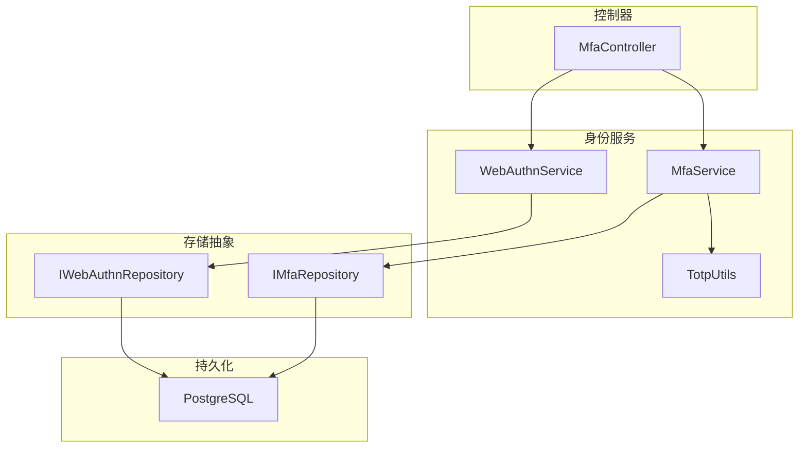
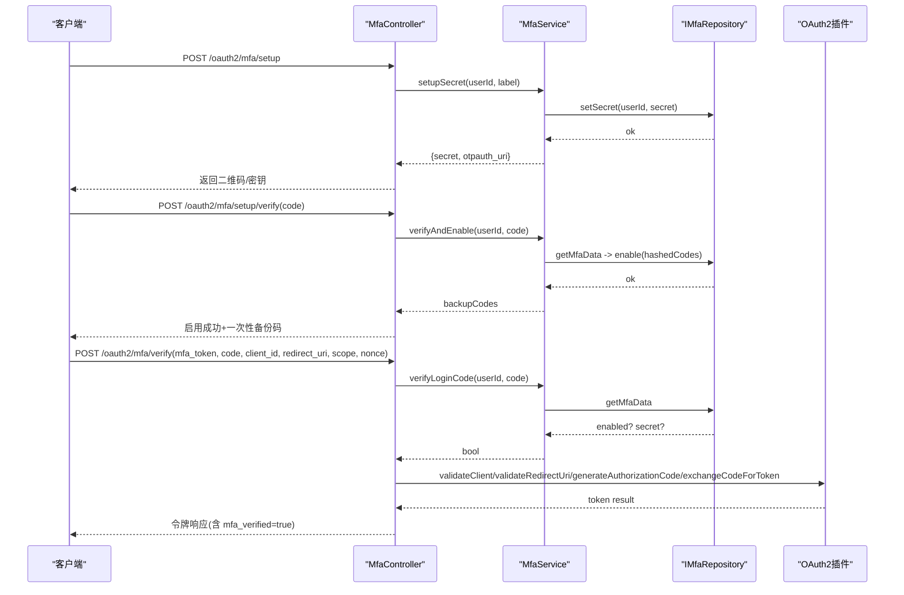
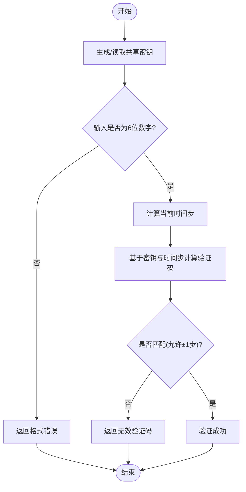
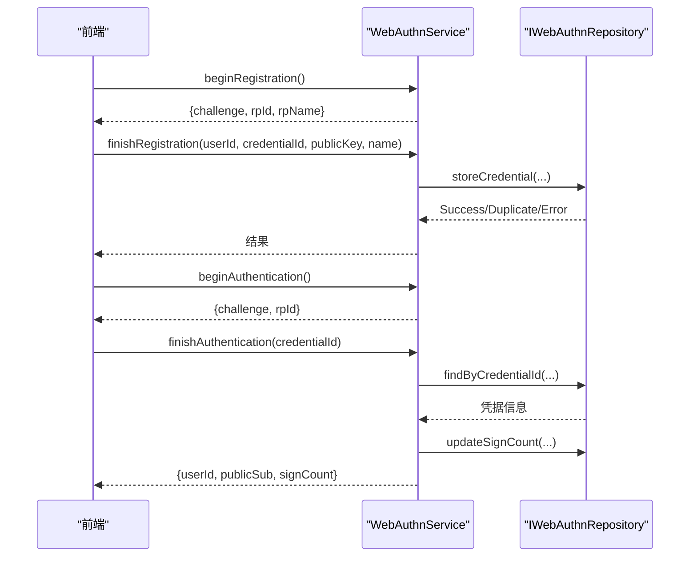
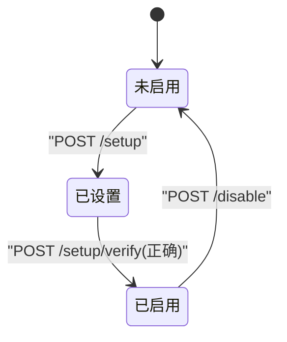
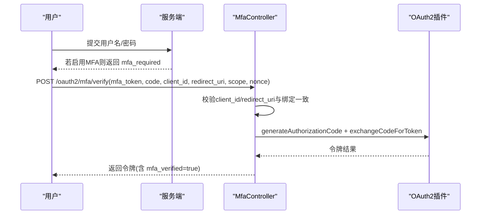
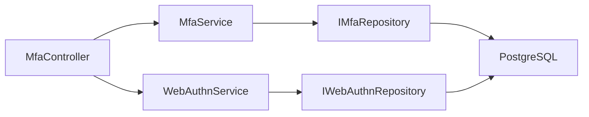

# 多因素认证扩展

<cite>
**本文引用的文件**
- [MfaService.h](file://libs/identity/include/authforge/identity/MfaService.h)
- [MfaService.cc](file://libs/identity/src/mfa/MfaService.cc)
- [TotpUtils.cc](file://libs/identity/src/mfa/TotpUtils.cc)
- [IMfaRepository.h](file://libs/identity/include/authforge/identity/IMfaRepository.h)
- [MfaController.cc](file://libs/drogon/src/controllers/MfaController.cc)
- [WebAuthnService.h](file://libs/identity/include/authforge/identity/WebAuthnService.h)
- [WebAuthnService.cc](file://libs/identity/src/webauthn/WebAuthnService.cc)
- [IWebAuthnRepository.h](file://libs/identity/include/authforge/identity/IWebAuthnRepository.h)
- [PostgresWebAuthnRepository.h](file://libs/storage-postgres/include/authforge/storage/postgres/PostgresWebAuthnRepository.h)
- [V011__mfa_support.sql](file://apps/server/migrations/V011__mfa_support.sql)
- [V018__webauthn.sql](file://apps/server/migrations/V018__webauthn.sql)
- [V022__mfa_pending_client_binding.sql](file://apps/server/migrations/V022__mfa_pending_client_binding.sql)
- [IdentityAssembly.cc](file://apps/server/src/bootstrap/IdentityAssembly.cc)
- [config.json](file://apps/server/config/config.json)
- [openapi.yaml](file://apps/server/openapi.yaml)
- [MfaEndpointHttpTest.cc](file://tests/integration/controllers/MfaEndpointHttpTest.cc)
</cite>

## 目录
1. [简介](#简介)
2. [项目结构](#项目结构)
3. [核心组件](#核心组件)
4. [架构总览](#架构总览)
5. [详细组件分析](#详细组件分析)
6. [依赖关系分析](#依赖关系分析)
7. [性能与安全考量](#性能与安全考量)
8. [故障排查指南](#故障排查指南)
9. [结论](#结论)
10. [附录：开发示例与测试用例](#附录开发示例与测试用例)

## 简介
本文件面向希望在 AuthForge 中扩展多因素认证（MFA）的开发者，系统性说明 MFA 框架设计、TOTP 实现与定制方法、WebAuthn/FIDO2 集成、设备注册/管理/撤销流程、自定义 MFA 方法接入、与现有登录和敏感操作确认流程的集成方式，以及安全最佳实践与性能优化建议。文档同时提供端到端流程图与代码级图示，帮助快速理解并落地扩展。

## 项目结构
- 身份层服务
  - MfaService：封装 TOTP 设置、启用、禁用、登录时校验、以及登录会话绑定（client_id/redirect_uri）等核心业务逻辑。
  - TotpUtils：实现 TOTP 密钥生成、验证码计算与校验、备份码生成、otpauth URI 构造。
  - WebAuthnService：封装 Passkey/WebAuthn 挑战生成、凭据注册/认证、凭据列表等能力。
- 存储抽象
  - IMfaRepository：定义 MFA 数据读写接口（获取状态、设置 secret、启用/禁用、待处理绑定等）。
  - IWebAuthnRepository：定义 WebAuthn 凭据持久化接口（存储、查询、更新 sign_count、列出凭据）。
- 控制器与装配
  - MfaController：HTTP 路由入口，负责鉴权、参数校验、调用 MfaService，并与 OAuth2 插件协作完成授权码发放与令牌交换。
  - IdentityAssembly：启动期装配 WebAuthn 服务与控制器依赖，注入 RP id/name 等配置。
- 数据库迁移
  - V011：为 users 表增加 mfa_enabled、mfa_secret、mfa_backup_codes。
  - V018：新增 webauthn_credentials 表及索引。
  - V022：为 users 表增加 mfa_pending_client_id、mfa_pending_redirect_uri，用于跨客户端防混淆。
- 配置与 API
  - config.json：OAuth2Plugin、数据库、Redis 等运行配置。
  - openapi.yaml：MFA 相关端点声明（setup、verify、disable、login verify）。

图表来源
- [MfaService.h:72-161](file://libs/identity/include/authforge/identity/MfaService.h#L72-L161)
- [MfaService.cc:21-183](file://libs/identity/src/mfa/MfaService.cc#L21-L183)
- [TotpUtils.cc:108-180](file://libs/identity/src/mfa/TotpUtils.cc#L108-L180)
- [WebAuthnService.h:127-223](file://libs/identity/include/authforge/identity/WebAuthnService.h#L127-L223)
- [WebAuthnService.cc:28-174](file://libs/identity/src/webauthn/WebAuthnService.cc#L28-L174)
- [IMfaRepository.h:46-75](file://libs/identity/include/authforge/identity/IMfaRepository.h#L46-L75)
- [IWebAuthnRepository.h](file://libs/identity/include/authforge/identity/IWebAuthnRepository.h)

章节来源
- [MfaService.h:72-161](file://libs/identity/include/authforge/identity/MfaService.h#L72-L161)
- [MfaService.cc:21-183](file://libs/identity/src/mfa/MfaService.cc#L21-L183)
- [TotpUtils.cc:108-180](file://libs/identity/src/mfa/TotpUtils.cc#L108-L180)
- [WebAuthnService.h:127-223](file://libs/identity/include/authforge/identity/WebAuthnService.h#L127-L223)
- [WebAuthnService.cc:28-174](file://libs/identity/src/webauthn/WebAuthnService.cc#L28-L174)
- [IMfaRepository.h:46-75](file://libs/identity/include/authforge/identity/IMfaRepository.h#L46-L75)
- [IWebAuthnRepository.h](file://libs/identity/include/authforge/identity/IWebAuthnRepository.h)

## 核心组件
- MfaService
  - 职责：TOTP 密钥生成与存储、设置验证与启用（含备份码）、禁用、登录时 TOTP 校验、登录会话绑定（client_id/redirect_uri）读取与清理。
  - 关键方法：setupSecret、verifyAndEnable、disable、verifyLoginCode、setPendingBinding/getPendingBinding/clearPendingBinding。
  - 依赖：IMfaRepository、ICryptoProvider、IClock、issuerName。
- TotpUtils
  - 职责：Base32 编解码、HMAC-SHA1 计算、时间步长对齐、6 位验证码生成与校验（允许 ±1 时间步容差）、otpauth URI 构造、备份码生成。
  - 特性：使用安全随机数源生成密钥与备份码；支持时钟漂移容忍。
- WebAuthnService
  - 职责：Passkey 注册/认证挑战生成、凭据存储与查找、sign_count 维护、凭据列表。
  - 依赖：IWebAuthnRepository、ICryptoProvider、rpId/rpName。
- IMfaRepository / IWebAuthnRepository
  - 职责：解耦具体存储实现，便于替换或扩展（如 Redis、其他 RDBMS）。
- MfaController
  - 职责：HTTP 路由、鉴权、参数校验、调用 MfaService，并在登录二次验证后与 OAuth2 插件协作颁发授权码与令牌。

章节来源
- [MfaService.h:72-161](file://libs/identity/include/authforge/identity/MfaService.h#L72-L161)
- [MfaService.cc:21-183](file://libs/identity/src/mfa/MfaService.cc#L21-L183)
- [TotpUtils.cc:108-180](file://libs/identity/src/mfa/TotpUtils.cc#L108-L180)
- [WebAuthnService.h:127-223](file://libs/identity/include/authforge/identity/WebAuthnService.h#L127-L223)
- [WebAuthnService.cc:28-174](file://libs/identity/src/webauthn/WebAuthnService.cc#L28-L174)
- [IMfaRepository.h:46-75](file://libs/identity/include/authforge/identity/IMfaRepository.h#L46-L75)
- [IWebAuthnRepository.h](file://libs/identity/include/authforge/identity/IWebAuthnRepository.h)
- [MfaController.cc:92-800](file://libs/drogon/src/controllers/MfaController.cc#L92-L800)

## 架构总览
MFA 采用“控制器 + 领域服务 + 存储抽象”的分层设计：
- 控制器仅负责 HTTP 协议细节与编排，不直接访问数据库。
- 领域服务（MfaService/WebAuthnService）承载业务规则，通过端口（ICryptoProvider/IClock）与存储抽象（IMfaRepository/IWebAuthnRepository）交互。
- 数据库迁移集中管理 schema 演进，确保 MFA/WebAuthn 字段与表结构一致。

图表来源
- [MfaController.cc:92-800](file://libs/drogon/src/controllers/MfaController.cc#L92-L800)
- [MfaService.cc:21-183](file://libs/identity/src/mfa/MfaService.cc#L21-L183)
- [IMfaRepository.h:46-75](file://libs/identity/include/authforge/identity/IMfaRepository.h#L46-L75)

章节来源
- [MfaController.cc:92-800](file://libs/drogon/src/controllers/MfaController.cc#L92-L800)
- [MfaService.cc:21-183](file://libs/identity/src/mfa/MfaService.cc#L21-L183)
- [IMfaRepository.h:46-75](file://libs/identity/include/authforge/identity/IMfaRepository.h#L46-L75)

## 详细组件分析

### TOTP 认证与定制
- 密钥生成与存储
  - 使用安全随机源生成 Base32 编码的共享密钥，并通过 IMfaRepository.setSecret 写入用户记录。
- 设置验证与启用
  - 校验用户提交的 TOTP 码（考虑 ±1 时间步），通过后生成 10 个一次性备份码（哈希存储），并启用 MFA。
- 登录时校验
  - 从用户记录读取已启用的 secret，按当前时间步计算并比对。
- 定制要点
  - 修改时间步长、位数、算法需调整 TotpUtils 中的时间步计算与 HMAC 实现。
  - 更换随机源或哈希算法可通过注入 ICryptoProvider 实现。
  - 如需引入短信/邮箱验证码，可在 MfaService 之上新增策略类，复用 IMfaRepository 的扩展字段或独立表。

图表来源
- [TotpUtils.cc:115-144](file://libs/identity/src/mfa/TotpUtils.cc#L115-L144)

章节来源
- [TotpUtils.cc:108-180](file://libs/identity/src/mfa/TotpUtils.cc#L108-L180)
- [MfaService.cc:49-138](file://libs/identity/src/mfa/MfaService.cc#L49-L138)

### WebAuthn/FIDO2 生物识别集成
- 注册流程
  - beginRegistration：生成 challenge、rpId/rpName。
  - finishRegistration：接收前端返回的 credentialId/publicKey，存储到 webauthn_credentials 表。
- 认证流程
  - beginAuthentication：生成 challenge 与 rpId。
  - finishAuthentication：根据 credentialId 查找凭据，递增 sign_count，返回用户信息。
- 配置
  - 通过 IdentityAssembly 注入 rpId/rpName，默认值与控制器保持一致。
- 数据库
  - webauthn_credentials 表包含 user_id、credential_id、public_key、sign_count、transports、name、时间戳等字段，并建立索引。

图表来源
- [WebAuthnService.h:127-223](file://libs/identity/include/authforge/identity/WebAuthnService.h#L127-L223)
- [WebAuthnService.cc:41-174](file://libs/identity/src/webauthn/WebAuthnService.cc#L41-L174)
- [V018__webauthn.sql:1-16](file://apps/server/migrations/V018__webauthn.sql#L1-L16)

章节来源
- [WebAuthnService.h:127-223](file://libs/identity/include/authforge/identity/WebAuthnService.h#L127-L223)
- [WebAuthnService.cc:41-174](file://libs/identity/src/webauthn/WebAuthnService.cc#L41-L174)
- [V018__webauthn.sql:1-16](file://apps/server/migrations/V018__webauthn.sql#L1-L16)
- [IdentityAssembly.cc:103-140](file://apps/server/src/bootstrap/IdentityAssembly.cc#L103-L140)

### MFA 设备注册、管理与撤销
- 注册
  - 调用 /oauth2/mfa/setup 生成 secret 与 otpauth URI，用户扫码录入 authenticator。
- 启用
  - 调用 /oauth2/mfa/setup/verify 提交 TOTP 码，成功后返回一次性备份码并启用 MFA。
- 管理
  - 查看用户 MFA 状态（users.mfa_enabled），必要时可重置 secret（通过管理员工具或扩展接口）。
- 撤销
  - 调用 /oauth2/mfa/disable 清除 secret 与备份码，关闭 MFA。

图表来源
- [MfaController.cc:92-458](file://libs/drogon/src/controllers/MfaController.cc#L92-L458)
- [V011__mfa_support.sql:1-6](file://apps/server/migrations/V011__mfa_support.sql#L1-L6)

章节来源
- [MfaController.cc:92-458](file://libs/drogon/src/controllers/MfaController.cc#L92-L458)
- [V011__mfa_support.sql:1-6](file://apps/server/migrations/V011__mfa_support.sql#L1-L6)

### 自定义 MFA 方法（短信/邮箱验证码）
- 扩展点
  - 在 MfaService 之上新增策略接口（例如 ISmsCodeProvider/IEmailCodeProvider），通过依赖注入接入。
  - 在 IMfaRepository 中扩展字段或新建表，保存验证码、过期时间、发送次数等。
- 流程
  - 登录时若检测到需要第二因素，选择短信/邮箱通道发送验证码。
  - 校验验证码后，继续授权码发放与令牌交换。
- 注意事项
  - 严格限制频率与重试次数，防止暴力破解。
  - 验证码最小熵与有效期需满足安全要求。
  - 审计日志记录发送与校验结果。

[本节为概念性指导，不直接引用具体文件]

### 与现有认证流程的集成
- 登录二次验证
  - 首次密码验证通过后，若用户启用 MFA，则进入 /oauth2/mfa/verify 流程。
  - 控制器在 TOTP 校验成功后，校验 client_id/redirect_uri 与登录会话绑定一致，再调用 OAuth2 插件颁发授权码并交换令牌。
- 敏感操作确认
  - 对高风险操作（如修改密码、删除账户）可复用 MFA 校验路径，要求用户提供 TOTP 或 Passkey。

图表来源
- [MfaController.cc:460-800](file://libs/drogon/src/controllers/MfaController.cc#L460-L800)

章节来源
- [MfaController.cc:460-800](file://libs/drogon/src/controllers/MfaController.cc#L460-L800)

## 依赖关系分析
- 控制器与服务
  - MfaController 依赖 MfaService 与 WebAuthnService，避免直接访问数据库。
- 服务与存储
  - MfaService 通过 IMfaRepository 访问用户 MFA 状态与绑定信息。
  - WebAuthnService 通过 IWebAuthnRepository 管理凭据。
- 启动装配
  - IdentityAssembly 将 WebAuthnService 注入到控制器，并设置 rpId/rpName。
- 配置
  - config.json 定义 OAuth2Plugin、数据库连接、Redis 等运行时参数。

图表来源
- [IdentityAssembly.cc:103-140](file://apps/server/src/bootstrap/IdentityAssembly.cc#L103-L140)
- [config.json:133-170](file://apps/server/config/config.json#L133-L170)

章节来源
- [IdentityAssembly.cc:103-140](file://apps/server/src/bootstrap/IdentityAssembly.cc#L103-L140)
- [config.json:133-170](file://apps/server/config/config.json#L133-L170)

## 性能与安全考量
- 性能
  - TOTP 校验为轻量计算，注意避免重复解密与冗余 IO。
  - WebAuthn 凭据查询应利用索引（user_id、credential_id）。
  - 合理设置数据库连接池与超时，避免阻塞。
- 安全
  - 所有密钥与随机数必须来自安全随机源。
  - 备份码仅展示一次，并以哈希形式存储。
  - 登录二次验证需校验 client_id/redirect_uri 与登录会话绑定一致，防止跨客户端混淆。
  - 对验证码与备份码进行速率限制与失败计数。
  - 审计日志记录 MFA 启用、禁用、登录验证等关键事件。

[本节为通用指导，不直接引用具体文件]

## 故障排查指南
- 常见问题
  - 未携带 Bearer Token：/api/me/mfa/* 会返回 401。
  - 无效或过期的 MFA 会话：verifyLogin 返回认证失败。
  - TOTP 码不正确：返回认证失败，检查时间同步与密钥。
  - 凭据重复注册：WebAuthn 注册返回重复错误。
- 定位步骤
  - 检查请求头与参数完整性。
  - 核对数据库记录（users.mfa_enabled、webauthn_credentials）。
  - 查看审计日志与错误码。

章节来源
- [MfaEndpointHttpTest.cc:58-143](file://tests/integration/controllers/MfaEndpointHttpTest.cc#L58-L143)
- [openapi.yaml:1469-1517](file://apps/server/openapi.yaml#L1469-L1517)

## 结论
AuthForge 的 MFA 扩展以清晰的分层与可插拔的存储抽象为基础，提供了成熟的 TOTP 与 WebAuthn 能力，并通过控制器与 OAuth2 插件的协作实现了完整的登录二次验证流程。开发者可在此基础上便捷地扩展短信/邮箱验证码等自定义方法，同时遵循安全与性能最佳实践，保障系统的安全性与可扩展性。

## 附录：开发示例与测试用例
- 示例流程
  - 用户启用 TOTP：调用 /oauth2/mfa/setup 获取密钥与 QR，随后 /oauth2/mfa/setup/verify 完成启用。
  - 登录二次验证：首次认证后调用 /oauth2/mfa/verify，传入 mfa_token、code、client_id、redirect_uri、scope、nonce，获得令牌。
  - Passkey 注册/认证：调用 WebAuthnService 的 begin/finish 系列接口完成凭据生命周期管理。
- 测试用例
  - 集成测试覆盖 MFA 端点的鉴权、成功与失败分支，包括无 Token、无效 Token、启用后禁用等场景。
  - 参考测试文件组织与断言风格，为新功能补充单元测试与集成测试。

章节来源
- [MfaEndpointHttpTest.cc:58-143](file://tests/integration/controllers/MfaEndpointHttpTest.cc#L58-L143)
- [openapi.yaml:1469-1517](file://apps/server/openapi.yaml#L1469-L1517)