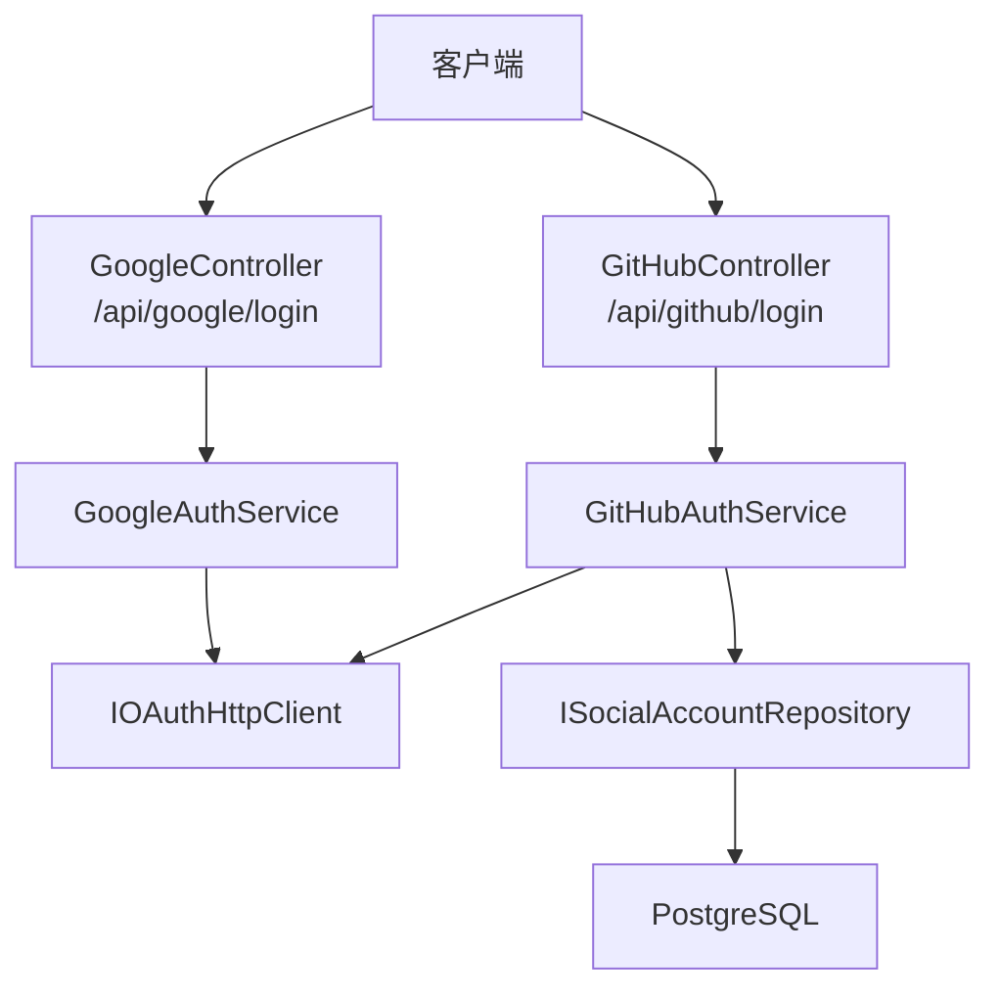
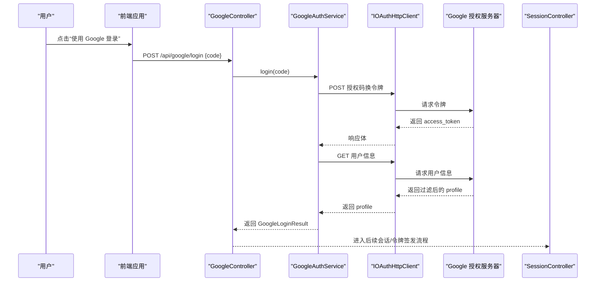
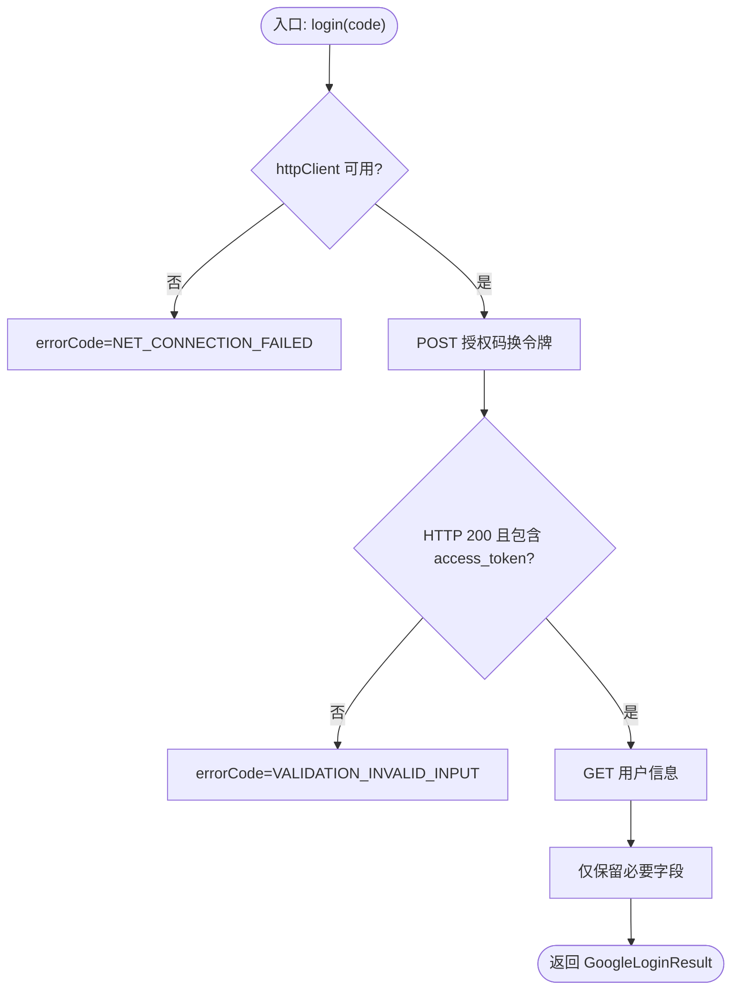
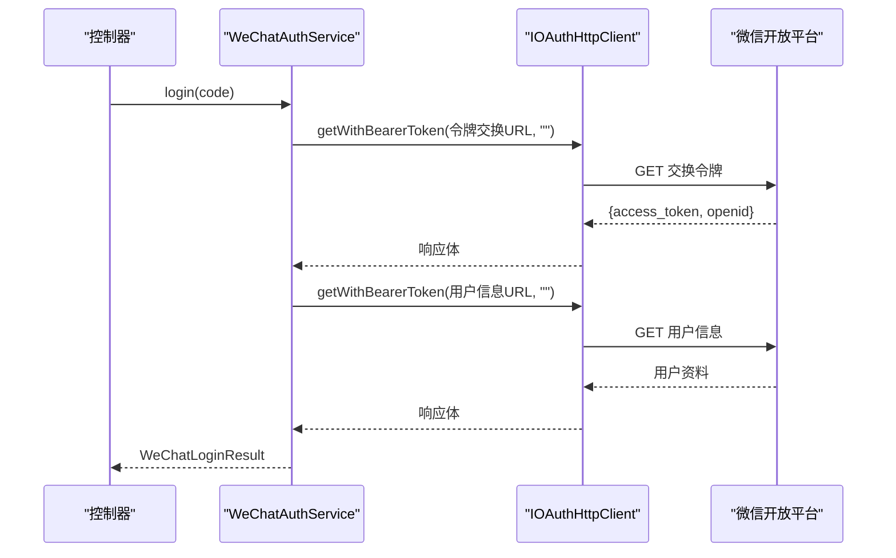
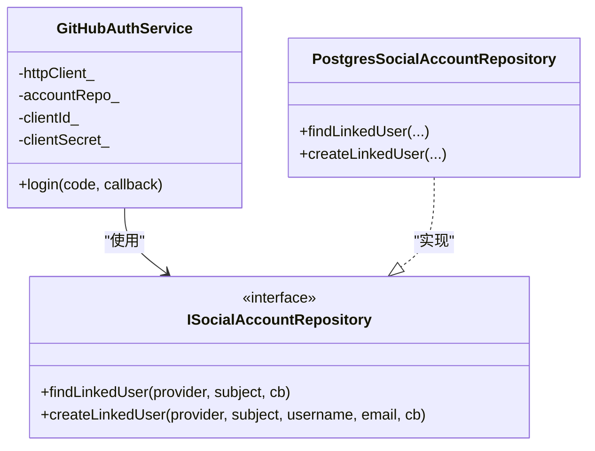
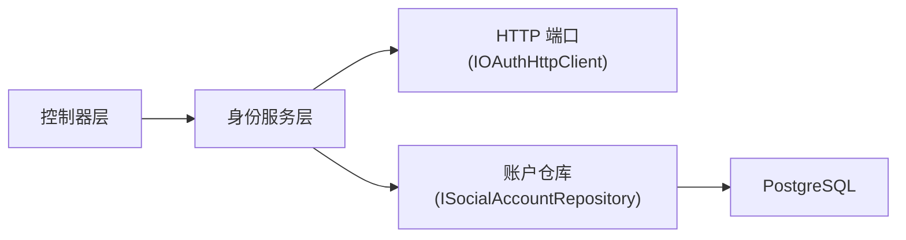

# 社交登录提供商

<cite>
**本文引用的文件**
- [SocialAuthService.h](file://libs/identity/include/authforge/identity/SocialAuthService.h)
- [GoogleAuthService.cc](file://libs/identity/src/social/GoogleAuthService.cc)
- [WeChatAuthService.cc](file://libs/identity/src/social/WeChatAuthService.cc)
- [GitHubAuthService.cc](file://libs/identity/src/social/GitHubAuthService.cc)
- [ISocialAccountRepository.h](file://libs/identity/include/authforge/identity/ISocialAccountRepository.h)
- [PostgresSocialAccountRepository.h](file://libs/storage-postgres/include/authforge/storage/postgres/PostgresSocialAccountRepository.h)
- [DrogonOAuthHttpClient.h](file://libs/drogon/include/authforge/drogon/adapters/DrogonOAuthHttpClient.h)
- [GoogleController.h](file://libs/drogon/include/authforge/drogon/controllers/GoogleController.h)
- [GitHubController.h](file://libs/drogon/include/authforge/drogon/controllers/GitHubController.h)
- [config.json](file://apps/server/config/config.json)
- [config.prod.json](file://apps/server/config/config.prod.json)
- [AuthorizationEndpointController.cc](file://libs/drogon/src/controllers/AuthorizationEndpointController.cc)
- [SessionController.cc](file://libs/drogon/src/controllers/SessionController.cc)
- [OAuth2Plugin.cc](file://libs/drogon/src/plugin/OAuth2Plugin.cc)
- [openapi.yaml](file://apps/server/openapi.yaml)
- [oauth2-redirect.html](file://docs/backend/api/swagger-ui/oauth2-redirect.html)
</cite>

## 目录
1. [简介](#简介)
2. [项目结构](#项目结构)
3. [核心组件](#核心组件)
4. [架构总览](#架构总览)
5. [详细组件分析](#详细组件分析)
6. [依赖关系分析](#依赖关系分析)
7. [性能考虑](#性能考虑)
8. [故障排查指南](#故障排查指南)
9. [结论](#结论)
10. [附录](#附录)

## 简介
本文件面向希望在 AuthForge 中扩展“社交登录提供商”的开发者，系统化说明 OAuth2/OIDC 社交登录的接口规范与实现模式，覆盖 Google、微信、GitHub 等主流平台的集成方式；阐述账号绑定/解绑机制、用户关联与权限同步；给出配置管理（客户端 ID、密钥、回调 URL）的最佳实践；提供完整的插件开发示例（授权流程、用户信息获取、错误处理）；并总结安全要点（状态校验、CSRF 防护、令牌安全存储）。

## 项目结构
本项目将社交登录能力拆分为三层：
- 控制器层（Drogon 控制器）：负责路由、参数校验、调用身份服务、签发本地会话或令牌。
- 身份服务层（identity 包）：框架无关的业务逻辑，封装各社交平台的授权码交换与用户信息拉取、账户查找/创建。
- 适配与存储层：HTTP 适配器（IOAuthHttpClient）、账户仓库（ISocialAccountRepository）及数据库实现。

图表来源
- [GoogleController.h:22-49](file://libs/drogon/include/authforge/drogon/controllers/GoogleController.h#L22-L49)
- [GitHubController.h:41-70](file://libs/drogon/include/authforge/drogon/controllers/GitHubController.h#L41-L70)
- [SocialAuthService.h:96-129](file://libs/identity/include/authforge/identity/SocialAuthService.h#L96-L129)
- [SocialAuthService.h:235-266](file://libs/identity/include/authforge/identity/SocialAuthService.h#L235-L266)
- [ISocialAccountRepository.h:87-133](file://libs/identity/include/authforge/identity/ISocialAccountRepository.h#L87-L133)

章节来源
- [GoogleController.h:22-49](file://libs/drogon/include/authforge/drogon/controllers/GoogleController.h#L22-L49)
- [GitHubController.h:41-70](file://libs/drogon/include/authforge/drogon/controllers/GitHubController.h#L41-L70)
- [SocialAuthService.h:96-129](file://libs/identity/include/authforge/identity/SocialAuthService.h#L96-L129)
- [SocialAuthService.h:235-266](file://libs/identity/include/authforge/identity/SocialAuthService.h#L235-L266)
- [ISocialAccountRepository.h:87-133](file://libs/identity/include/authforge/identity/ISocialAccountRepository.h#L87-L133)

## 核心组件
- 身份服务接口与结果模型
  - Google/WeChat/GitHub 三种服务的 login(code, callback) 统一异步接口，返回结构化结果（成功时 profile 或 userId/username，失败时 errorCode）。
- HTTP 适配器
  - IOAuthHttpClient 抽象了对外 HTTP 调用，支持表单 POST 与带 Bearer 的 GET，屏蔽底层 Drogon::HttpClient 细节。
- 账户仓库
  - ISocialAccountRepository 定义 provider+subject -> 本地用户的查找与创建（含默认角色分配），Postgres 实现封装多表事务。
- 控制器注入
  - GoogleController/GitHubController 通过 setter 注入 identity 服务，未注入时回退到旧路径，保证平滑演进。

章节来源
- [SocialAuthService.h:57-129](file://libs/identity/include/authforge/identity/SocialAuthService.h#L57-L129)
- [SocialAuthService.h:135-200](file://libs/identity/include/authforge/identity/SocialAuthService.h#L135-L200)
- [SocialAuthService.h:206-266](file://libs/identity/include/authforge/identity/SocialAuthService.h#L206-L266)
- [DrogonOAuthHttpClient.h:16-30](file://libs/drogon/include/authforge/drogon/adapters/DrogonOAuthHttpClient.h#L16-L30)
- [ISocialAccountRepository.h:62-133](file://libs/identity/include/authforge/identity/ISocialAccountRepository.h#L62-L133)

## 架构总览
社交登录整体时序如下：前端引导用户至第三方授权页，携带 state；回调后服务端用 code 换取 access_token，再拉取用户信息；对 GitHub 场景进一步完成本地账户查找/创建与角色分配；最终由控制器签发本地会话或令牌。

图表来源
- [GoogleController.h:22-49](file://libs/drogon/include/authforge/drogon/controllers/GoogleController.h#L22-L49)
- [SocialAuthService.h:96-129](file://libs/identity/include/authforge/identity/SocialAuthService.h#L96-L129)
- [GoogleAuthService.cc:24-47](file://libs/identity/src/social/GoogleAuthService.cc#L24-L47)
- [DrogonOAuthHttpClient.h:16-30](file://libs/drogon/include/authforge/drogon/adapters/DrogonOAuthHttpClient.h#L16-L30)
- [SessionController.cc:872-905](file://libs/drogon/src/controllers/SessionController.cc#L872-L905)

## 详细组件分析

### Google 社交登录
- 职责边界
  - 仅负责“授权码换令牌 + 拉取用户信息”，不触碰本地用户表与令牌签发。
- 关键数据
  - 输入：code
  - 输出：GoogleUserInfo（sub/name/email/picture）或 errorCode
- 错误处理
  - 网络不可达/非 200：NET_CONNECTION_FAILED
  - 令牌响应缺失关键字段：VALIDATION_INVALID_INPUT

图表来源
- [SocialAuthService.h:96-129](file://libs/identity/include/authforge/identity/SocialAuthService.h#L96-L129)
- [GoogleAuthService.cc:24-47](file://libs/identity/src/social/GoogleAuthService.cc#L24-L47)

章节来源
- [SocialAuthService.h:57-129](file://libs/identity/include/authforge/identity/SocialAuthService.h#L57-L129)
- [GoogleAuthService.cc:24-47](file://libs/identity/src/social/GoogleAuthService.cc#L24-L47)

### WeChat 社交登录
- 特点
  - 令牌交换与用户信息均为 GET 查询参数形式，无 Bearer 头；需通过 getWithBearerToken(url, "", cb) 调用。
- 关键数据
  - 输入：code
  - 输出：WeChatUserInfo（openid/nickname/headimgurl/sex/city/province/country）或 errorCode
- 错误处理
  - 网络异常：NET_CONNECTION_FAILED
  - 平台 errcode != 0：VALIDATION_INVALID_INPUT

图表来源
- [SocialAuthService.h:135-200](file://libs/identity/include/authforge/identity/SocialAuthService.h#L135-L200)
- [WeChatAuthService.cc:20-93](file://libs/identity/src/social/WeChatAuthService.cc#L20-L93)
- [DrogonOAuthHttpClient.h:16-30](file://libs/drogon/include/authforge/drogon/adapters/DrogonOAuthHttpClient.h#L16-L30)

章节来源
- [SocialAuthService.h:135-200](file://libs/identity/include/authforge/identity/SocialAuthService.h#L135-L200)
- [WeChatAuthService.cc:20-93](file://libs/identity/src/social/WeChatAuthService.cc#L20-L93)

### GitHub 社交登录（含账户绑定）
- 职责边界
  - 在 Google/WeChat 基础上，额外完成“本地账户查找/创建 + 默认角色分配”。不签发 OAuth2 令牌（由控制器层负责）。
- 关键数据
  - 输入：code
  - 输出：GitHubLoginResult（userId/username/isNewUser）或 errorCode
- 账户绑定流程
  - 先查 oauth2_subject_mappings 是否已存在映射；不存在则创建 users 记录、建立映射、赋予默认 user 角色。

图表来源
- [SocialAuthService.h:206-266](file://libs/identity/include/authforge/identity/SocialAuthService.h#L206-L266)
- [ISocialAccountRepository.h:87-133](file://libs/identity/include/authforge/identity/ISocialAccountRepository.h#L87-L133)
- [PostgresSocialAccountRepository.h:24-50](file://libs/storage-postgres/include/authforge/storage/postgres/PostgresSocialAccountRepository.h#L24-L50)

章节来源
- [SocialAuthService.h:206-266](file://libs/identity/include/authforge/identity/SocialAuthService.h#L206-L266)
- [ISocialAccountRepository.h:87-133](file://libs/identity/include/authforge/identity/ISocialAccountRepository.h#L87-L133)
- [PostgresSocialAccountRepository.h:24-50](file://libs/storage-postgres/include/authforge/storage/postgres/PostgresSocialAccountRepository.h#L24-L50)

### 控制器与装配
- GoogleController/GitHubController 暴露 /api/google/login 与 /api/github/login，优先使用注入的 identity 服务，未注入时回退到旧实现。
- SessionController 负责授权码生成与回调重定向，包含 state 传递与 CSRF 保护。

章节来源
- [GoogleController.h:22-49](file://libs/drogon/include/authforge/drogon/controllers/GoogleController.h#L22-L49)
- [GitHubController.h:41-70](file://libs/drogon/include/authforge/drogon/controllers/GitHubController.h#L41-L70)
- [SessionController.cc:872-905](file://libs/drogon/src/controllers/SessionController.cc#L872-L905)

## 依赖关系分析
- 松耦合设计
  - 身份服务仅依赖 IOAuthHttpClient 与 ISocialAccountRepository 两个端口，避免直接耦合 Drogon/DB。
  - 控制器通过 setter 注入服务，便于测试与回退。
- 外部依赖
  - 第三方授权服务器（Google/微信/GitHub）
  - PostgreSQL（账户绑定）
  - Redis（可选，用于缓存/令牌存储，见 OAuth2 插件配置）

图表来源
- [SocialAuthService.h:96-129](file://libs/identity/include/authforge/identity/SocialAuthService.h#L96-L129)
- [SocialAuthService.h:235-266](file://libs/identity/include/authforge/identity/SocialAuthService.h#L235-L266)
- [ISocialAccountRepository.h:87-133](file://libs/identity/include/authforge/identity/ISocialAccountRepository.h#L87-L133)

章节来源
- [SocialAuthService.h:96-129](file://libs/identity/include/authforge/identity/SocialAuthService.h#L96-L129)
- [SocialAuthService.h:235-266](file://libs/identity/include/authforge/identity/SocialAuthService.h#L235-L266)
- [ISocialAccountRepository.h:87-133](file://libs/identity/include/authforge/identity/ISocialAccountRepository.h#L87-L133)

## 性能考虑
- 异步 I/O：所有第三方 HTTP 调用与数据库操作均通过回调/异步 API，避免阻塞事件循环。
- 最小化数据面：对用户信息做严格白名单过滤，减少不必要的数据传输与存储。
- 连接复用：通过共享的 IOAuthHttpClient 实例复用底层连接池。
- 数据库访问：账户绑定走单一仓库接口，内部可合并 SQL 以减少往返。

[本节为通用指导，不直接分析具体文件]

## 故障排查指南
- 常见错误码
  - NET_CONNECTION_FAILED：网络不可达或第三方返回非 200。
  - VALIDATION_INVALID_INPUT：缺少必需字段或第三方业务错误码非零。
  - INTERNAL_ERROR：内部依赖为空或服务初始化失败。
  - DB_QUERY_ERROR：仓库层数据库异常。
- 排查步骤
  - 检查第三方回调 URL 与 state 是否正确传递与校验。
  - 确认客户端 ID/密钥与 redirect_uri 已在配置中正确设置。
  - 查看日志中的错误码与堆栈，定位是网络、协议还是存储问题。
  - 对 GitHub 绑定失败，检查 oauth2_subject_mappings/users/user_roles 相关约束与索引。

章节来源
- [SocialAuthService.h:76-89](file://libs/identity/include/authforge/identity/SocialAuthService.h#L76-L89)
- [SocialAuthService.h:151-164](file://libs/identity/include/authforge/identity/SocialAuthService.h#L151-L164)
- [SocialAuthService.h:206-225](file://libs/identity/include/authforge/identity/SocialAuthService.h#L206-L225)

## 结论
AuthForge 的社交登录采用“控制器 + 身份服务 + 端口/仓库”的分层架构，清晰隔离了协议细节与业务逻辑，便于扩展新的社交平台。通过统一的 login 接口、严格的错误码与最小化数据面策略，既保证了安全性，也提升了可维护性与可测试性。结合完善的配置管理与 CSRF/state 保护，可在生产环境中稳定运行。

[本节为总结性内容，不直接分析具体文件]

## 附录

### 配置管理（客户端 ID、密钥、回调 URL）
- 配置文件位置
  - 开发/测试：apps/server/config/config.json
  - 生产：apps/server/config/config.prod.json
- 关键配置项
  - external_auth.google.client_id / client_secret / redirect_uri
  - external_auth.wechat.appid / secret
  - external_auth.github.client_id / client_secret
- 注意事项
  - redirect_uri 必须与第三方平台注册的一致。
  - 生产环境建议通过环境变量或密钥管理服务注入敏感值。

章节来源
- [config.json:195-209](file://apps/server/config/config.json#L195-L209)
- [config.prod.json:250-260](file://apps/server/config/config.prod.json#L250-L260)

### 授权流程与安全要点
- 状态验证与 CSRF 防护
  - 授权端点要求 state 参数，并在回调中校验，防止跨站请求伪造。
  - 前端重定向页面会校验 state 一致性。
- 令牌安全
  - 令牌交换与用户信息获取通过受控的 HTTP 适配器进行。
  - 本地令牌签发由 SessionController/OAuth2Plugin 统一管理。
- 回调 URL 校验
  - OAuth2 插件提供回调 URL 校验能力，确保只允许预注册的地址。

章节来源
- [AuthorizationEndpointController.cc:116-133](file://libs/drogon/src/controllers/AuthorizationEndpointController.cc#L116-L133)
- [oauth2-redirect.html:1-40](file://docs/backend/api/swagger-ui/oauth2-redirect.html#L1-L40)
- [OAuth2Plugin.cc:372-422](file://libs/drogon/src/plugin/OAuth2Plugin.cc#L372-L422)
- [openapi.yaml:1255-1303](file://apps/server/openapi.yaml#L1255-L1303)

### 账号绑定与解绑机制
- 绑定
  - GitHub 流程通过 ISocialAccountRepository 完成“查找/创建本地用户 + 建立映射 + 默认角色分配”。
- 解绑
  - 当前代码库主要体现绑定流程；解绑通常由管理员或用户自助流程触发，删除 oauth2_subject_mappings 对应记录并清理相关权限（如需要）。
- 权限同步
  - 新账户创建时自动赋予默认 user 角色；后续可通过 RBAC 体系调整。

章节来源
- [ISocialAccountRepository.h:87-133](file://libs/identity/include/authforge/identity/ISocialAccountRepository.h#L87-L133)
- [PostgresSocialAccountRepository.h:24-50](file://libs/storage-postgres/include/authforge/storage/postgres/PostgresSocialAccountRepository.h#L24-L50)

### 插件开发示例（以新增一个社交平台为例）
- 步骤概览
  1) 在 identity 包新增 AuthService，实现 login(code, callback)，通过 IOAuthHttpClient 调用第三方接口，返回统一结果结构。
  2) 如需账户绑定，注入 ISocialAccountRepository，完成 find/create 流程。
  3) 在 drogon 包新增 Controller，暴露 /api/{provider}/login，注入 AuthService。
  4) 在 config.json 中添加 external_auth.{provider} 配置。
  5) 编写单元测试与集成测试，覆盖成功与失败分支。
- 参考实现
  - 可对照 GoogleAuthService/WeChatAuthService/GitHubAuthService 的实现模式。

章节来源
- [SocialAuthService.h:96-129](file://libs/identity/include/authforge/identity/SocialAuthService.h#L96-L129)
- [SocialAuthService.h:135-200](file://libs/identity/include/authforge/identity/SocialAuthService.h#L135-L200)
- [SocialAuthService.h:235-266](file://libs/identity/include/authforge/identity/SocialAuthService.h#L235-L266)
- [config.json:195-209](file://apps/server/config/config.json#L195-L209)