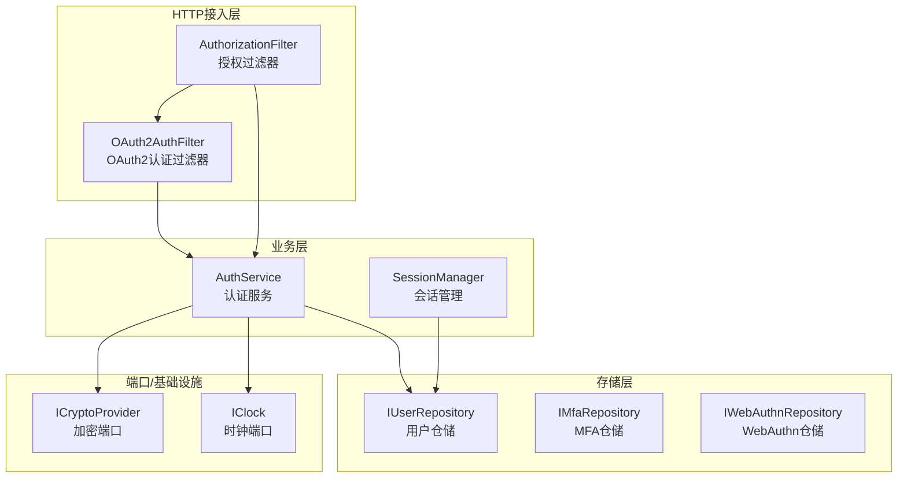
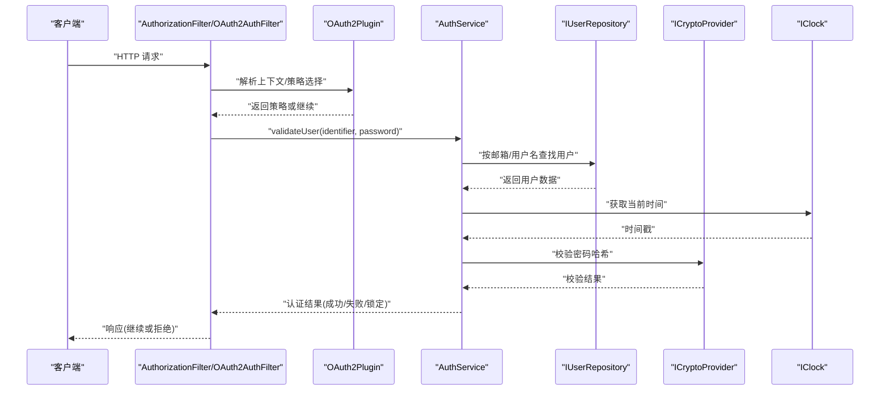
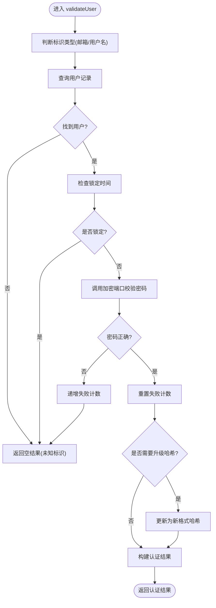
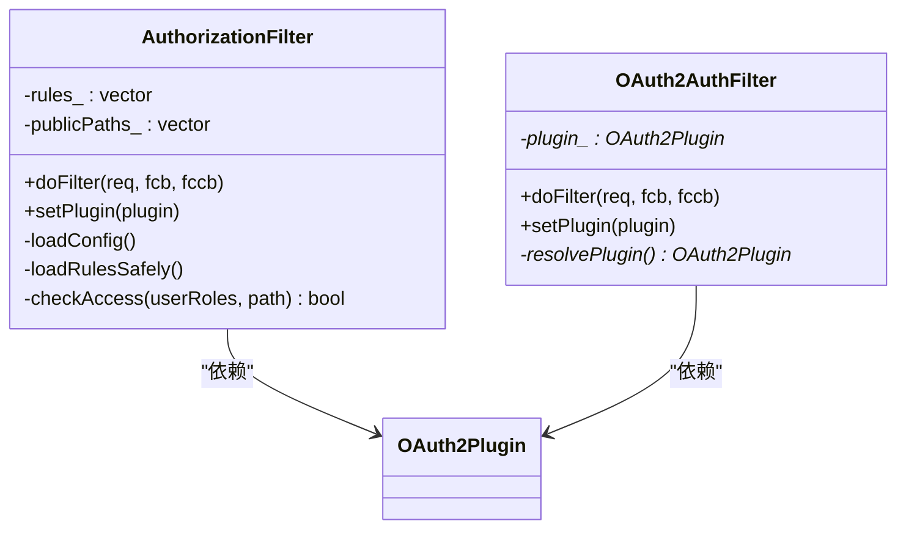
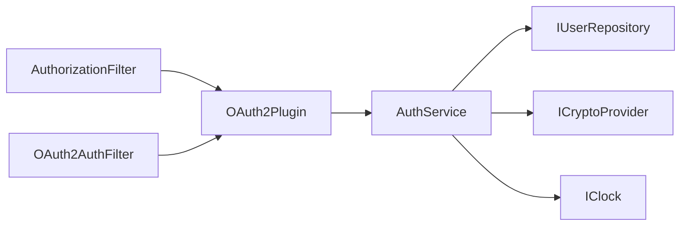
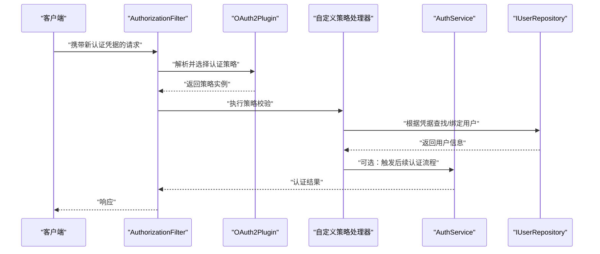

# 自定义认证方法

<cite>
**本文引用的文件**
- [AuthService.h](file://libs/identity/include/authforge/identity/AuthService.h)
- [AuthService.cc](file://libs/identity/src/AuthService.cc)
- [AuthorizationFilter.h](file://libs/drogon/include/authforge/drogon/filters/AuthorizationFilter.h)
- [OAuth2AuthFilter.h](file://libs/drogon/include/authforge/drogon/filters/OAuth2AuthFilter.h)
- [IdentityAssembly.cc](file://apps/server/src/bootstrap/IdentityAssembly.cc)
- [IUserRepository.h](file://libs/identity/include/authforge/identity/IUserRepository.h)
- [ICryptoProvider.h](file://libs/common/include/authforge/common/ports/ICryptoProvider.h)
- [IClock.h](file://libs/common/include/authforge/common/ports/IClock.h)
- [OAuth2Plugin.h](file://libs/drogon/include/authforge/drogon/plugin/OAuth2Plugin.h)
</cite>

## 目录
1. [简介](#简介)
2. [项目结构](#项目结构)
3. [核心组件](#核心组件)
4. [架构总览](#架构总览)
5. [详细组件分析](#详细组件分析)
6. [依赖关系分析](#依赖关系分析)
7. [性能考虑](#性能考虑)
8. [故障排查指南](#故障排查指南)
9. [结论](#结论)
10. [附录：完整开发示例与集成步骤](#附录完整开发示例与集成步骤)

## 简介
本指南面向需要在现有认证系统中扩展“自定义认证方法”的开发者。内容涵盖：
- 认证接口的抽象设计与扩展点
- 如何实现用户名/密码、API Key、证书等认证策略
- 认证中间件的编写与注册方式
- 认证钩子（前置验证、后置处理、错误拦截）的使用
- 从接口实现到配置注册的完整流程
- 与现有系统的集成方式
- 测试方法与调试技巧
- 性能优化与安全加固建议

## 项目结构
本项目采用分层与插件化设计：
- 身份层（identity）：提供框架无关的认证业务逻辑，通过端口（ports）和仓储（repositories）解耦基础设施
- 传输层（drogon）：基于 Drogon 的 HTTP 过滤器、控制器与插件，负责请求接入、鉴权与路由
- 存储层（storage-*）：用户、会话、MFA、WebAuthn、社交账号等持久化实现
- 应用装配（bootstrap）：启动时组装服务、注入依赖、将服务注入控制器与过滤器

图表来源
- [AuthorizationFilter.h:17-67](file://libs/drogon/include/authforge/drogon/filters/AuthorizationFilter.h#L17-L67)
- [OAuth2AuthFilter.h:11-34](file://libs/drogon/include/authforge/drogon/filters/OAuth2AuthFilter.h#L11-L34)
- [AuthService.h:52-110](file://libs/identity/include/authforge/identity/AuthService.h#L52-L110)
- [IUserRepository.h](file://libs/identity/include/authforge/identity/IUserRepository.h)
- [ICryptoProvider.h](file://libs/common/include/authforge/common/ports/ICryptoProvider.h)
- [IClock.h](file://libs/common/include/authforge/common/ports/IClock.h)

章节来源
- [IdentityAssembly.cc:61-213](file://apps/server/src/bootstrap/IdentityAssembly.cc#L61-L213)

## 核心组件
- AuthService：框架无关的核心认证服务，负责用户校验、注册、用户信息查询；通过 IUserRepository、ICryptoProvider、IClock 进行解耦
- AuthorizationFilter / OAuth2AuthFilter：Drogon 过滤器，用于在请求进入控制器前执行鉴权与访问控制
- 仓储接口（如 IUserRepository）：定义用户数据的读取、写入与查询契约，屏蔽具体存储实现
- 端口（如 ICryptoProvider、IClock）：定义加密与时钟能力，便于替换与测试

章节来源
- [AuthService.h:34-110](file://libs/identity/include/authforge/identity/AuthService.h#L34-L110)
- [AuthorizationFilter.h:17-67](file://libs/drogon/include/authforge/drogon/filters/AuthorizationFilter.h#L17-L67)
- [OAuth2AuthFilter.h:11-34](file://libs/drogon/include/authforge/drogon/filters/OAuth2AuthFilter.h#L11-L34)

## 架构总览
下图展示了认证请求从进入过滤器到完成用户校验的关键路径，以及各组件之间的交互关系。

图表来源
- [AuthorizationFilter.h:17-67](file://libs/drogon/include/authforge/drogon/filters/AuthorizationFilter.h#L17-L67)
- [OAuth2AuthFilter.h:11-34](file://libs/drogon/include/authforge/drogon/filters/OAuth2AuthFilter.h#L11-L34)
- [AuthService.h:67-79](file://libs/identity/include/authforge/identity/AuthService.h#L67-L79)
- [AuthService.cc:159-237](file://libs/identity/src/AuthService.cc#L159-L237)
- [ICryptoProvider.h](file://libs/common/include/authforge/common/ports/ICryptoProvider.h)
- [IClock.h](file://libs/common/include/authforge/common/ports/IClock.h)

## 详细组件分析

### 认证服务（AuthService）
- 职责：对用户凭证进行校验、注册新用户、获取用户信息；内部包含登录标识路由（邮箱/用户名）、账户锁定检查、失败计数递增与重置、旧哈希升级等逻辑
- 关键方法：
  - validateUser：异步校验用户凭证，返回可选的认证结果
  - registerUser：注册新用户，密码通过加密端口生成安全哈希
  - getUserInfo：根据用户ID获取用户信息与角色
- 复杂度与性能：
  - 哈希计算为 CPU 密集型，迭代次数固定，注意并发下的线程安全与资源占用
  - 数据库查询为 I/O 密集，使用异步回调避免阻塞
- 错误处理：
  - 未知标识、密码错误、账户锁定均返回空结果
  - 哈希升级失败不影响登录成功

图表来源
- [AuthService.cc:159-237](file://libs/identity/src/AuthService.cc#L159-L237)

章节来源
- [AuthService.h:67-104](file://libs/identity/include/authforge/identity/AuthService.h#L67-L104)
- [AuthService.cc:159-237](file://libs/identity/src/AuthService.cc#L159-L237)

### 过滤器（AuthorizationFilter / OAuth2AuthFilter）
- AuthorizationFilter：
  - 负责加载 RBAC 规则与公开路径白名单
  - 在 doFilter 中根据用户角色与路径模式决定是否放行
  - 支持 setPlugin 注入 OAuth2Plugin，避免每次请求全局查找
- OAuth2AuthFilter：
  - 更贴近 OAuth2 协议的认证过滤，可结合插件进行令牌校验与上下文设置
  - 同样支持 setPlugin 注入

图表来源
- [AuthorizationFilter.h:17-67](file://libs/drogon/include/authforge/drogon/filters/AuthorizationFilter.h#L17-L67)
- [OAuth2AuthFilter.h:11-34](file://libs/drogon/include/authforge/drogon/filters/OAuth2AuthFilter.h#L11-L34)
- [OAuth2Plugin.h](file://libs/drogon/include/authforge/drogon/plugin/OAuth2Plugin.h)

章节来源
- [AuthorizationFilter.h:17-67](file://libs/drogon/include/authforge/drogon/filters/AuthorizationFilter.h#L17-L67)
- [OAuth2AuthFilter.h:11-34](file://libs/drogon/include/authforge/drogon/filters/OAuth2AuthFilter.h#L11-L34)

### 启动装配（IdentityAssembly）
- 作用：在进程启动时创建并注入身份相关服务（AuthService、SessionManager、MfaService、WebAuthnService、Social 服务等），并将它们注入到对应的控制器
- 关键点：
  - 检测存储类型与数据库连接可用性，内存存储下走兼容路径
  - 一次性构造并持有服务实例，控制器以非拥有指针形式引用
  - 读取 custom_config 中的 WebAuthn 与外部社交认证配置

章节来源
- [IdentityAssembly.cc:61-213](file://apps/server/src/bootstrap/IdentityAssembly.cc#L61-L213)

## 依赖关系分析
- 松耦合设计：
  - AuthService 仅依赖 IUserRepository、ICryptoProvider、IClock，不直接依赖 Drogon 或具体存储
  - 过滤器通过 setPlugin 注入 OAuth2Plugin，避免运行时全局查找
- 可能的循环依赖：
  - 过滤器与插件之间通过指针注入，生命周期由启动装配管理，避免循环引用
- 外部依赖：
  - 存储实现（Postgres/Memory）通过仓储接口隔离
  - 加密与时钟通过端口抽象，便于替换与测试

图表来源
- [AuthorizationFilter.h:17-67](file://libs/drogon/include/authforge/drogon/filters/AuthorizationFilter.h#L17-L67)
- [OAuth2AuthFilter.h:11-34](file://libs/drogon/include/authforge/drogon/filters/OAuth2AuthFilter.h#L11-L34)
- [AuthService.h:52-110](file://libs/identity/include/authforge/identity/AuthService.h#L52-L110)

章节来源
- [IdentityAssembly.cc:61-213](file://apps/server/src/bootstrap/IdentityAssembly.cc#L61-L213)

## 性能考虑
- 哈希计算：
  - PBKDF2 迭代次数固定，CPU 开销较大；在高并发场景下需评估线程池大小与队列长度
- 数据库访问：
  - 使用异步回调避免阻塞；批量操作尽量合并以减少往返
- 缓存策略：
  - 对频繁读取的用户信息或角色可进行短期缓存，注意失效策略与一致性
- 锁与竞态：
  - 失败计数与锁定时间更新需保证原子性，避免并发导致的重复计数或状态不一致
- 日志与监控：
  - 关键路径添加审计事件与指标采集，便于定位瓶颈

[本节为通用指导，无需特定文件来源]

## 故障排查指南
- 常见问题：
  - 未找到用户：检查标识路由（邮箱/用户名）与仓储查询条件
  - 密码错误：确认哈希算法与参数一致，检查旧哈希升级逻辑
  - 账户锁定：核对锁定时间与失败计数更新逻辑
- 调试技巧：
  - 在过滤器与认证服务入口添加日志，记录请求上下文与关键变量
  - 使用模拟时钟与加密端口进行单元测试，覆盖边界条件
  - 针对高并发场景，启用线程工具与性能剖析器定位热点

章节来源
- [AuthService.cc:159-237](file://libs/identity/src/AuthService.cc#L159-L237)

## 结论
通过抽象接口与端口解耦，系统提供了清晰的扩展点以实现自定义认证方法。结合过滤器与启动装配机制，可以在不侵入核心业务的前提下，灵活接入新的认证策略，并通过仓储与端口替换实现测试与部署环境的差异化配置。

[本节为总结性内容，无需特定文件来源]

## 附录：完整开发示例与集成步骤

### 目标
实现一种新的认证策略（例如 API Key 或证书认证），并将其集成到现有认证流程中。

### 步骤概览
1. 定义策略接口与上下文
   - 在过滤器或插件中定义策略选择与上下文传递机制
   - 复用现有过滤器（AuthorizationFilter/OAuth2AuthFilter）作为统一入口
2. 实现策略处理器
   - 新增策略类，实现密钥解析、签名校验、证书验证等逻辑
   - 通过仓储接口获取用户信息，必要时与现有用户体系关联
3. 注入与装配
   - 在启动装配中注册新策略，并注入到过滤器或插件
   - 确保生命周期与依赖注入顺序正确
4. 配置与路由
   - 在配置文件中声明策略开关、参数与适用路径
   - 在过滤器中根据路径或请求头选择策略
5. 钩子函数
   - 前置验证：在认证前进行参数合法性检查、速率限制等
   - 后置处理：认证成功后记录审计事件、更新统计指标
   - 错误拦截：统一错误码与响应格式，便于前端处理
6. 测试与调试
   - 单元测试：使用模拟仓储与端口，覆盖正常与异常路径
   - 集成测试：端到端验证认证流程与副作用
   - 性能测试：压测哈希计算与数据库访问路径
7. 安全加固
   - 密钥轮换与过期策略
   - 防重放与签名校验
   - 最小权限原则与敏感信息脱敏

### 流程图：新增认证策略的集成路径

图表来源
- [AuthorizationFilter.h:17-67](file://libs/drogon/include/authforge/drogon/filters/AuthorizationFilter.h#L17-L67)
- [OAuth2AuthFilter.h:11-34](file://libs/drogon/include/authforge/drogon/filters/OAuth2AuthFilter.h#L11-L34)
- [AuthService.h:67-79](file://libs/identity/include/authforge/identity/AuthService.h#L67-L79)
- [IUserRepository.h](file://libs/identity/include/authforge/identity/IUserRepository.h)

### 代码片段路径参考
- 认证服务核心逻辑：[AuthService.cc:159-237](file://libs/identity/src/AuthService.cc#L159-L237)
- 过滤器定义与注入点：[AuthorizationFilter.h:17-67](file://libs/drogon/include/authforge/drogon/filters/AuthorizationFilter.h#L17-L67)、[OAuth2AuthFilter.h:11-34](file://libs/drogon/include/authforge/drogon/filters/OAuth2AuthFilter.h#L11-L34)
- 启动装配与服务注入：[IdentityAssembly.cc:61-213](file://apps/server/src/bootstrap/IdentityAssembly.cc#L61-L213)
- 用户仓储接口：[IUserRepository.h](file://libs/identity/include/authforge/identity/IUserRepository.h)
- 加密与时钟端口：[ICryptoProvider.h](file://libs/common/include/authforge/common/ports/ICryptoProvider.h)、[IClock.h](file://libs/common/include/authforge/common/ports/IClock.h)

[本节为示例与指引，不包含具体代码内容]