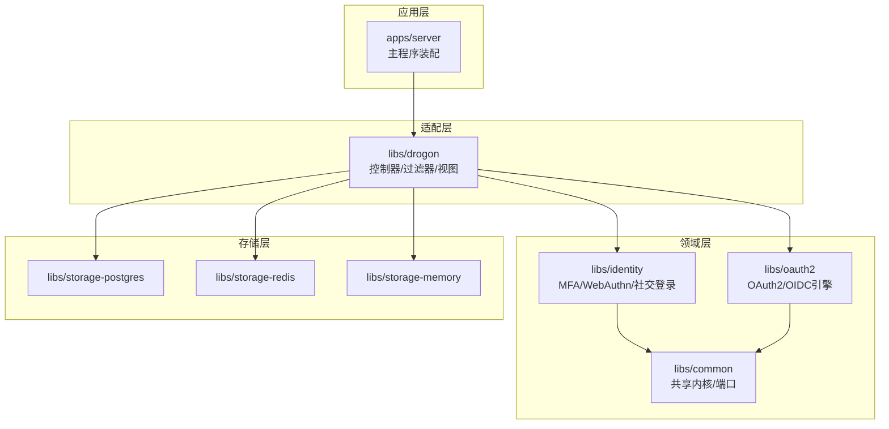
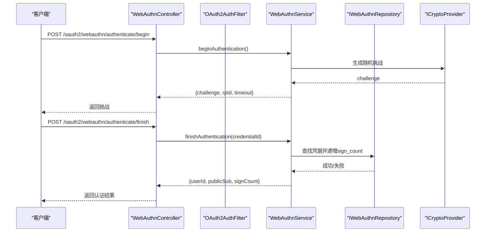
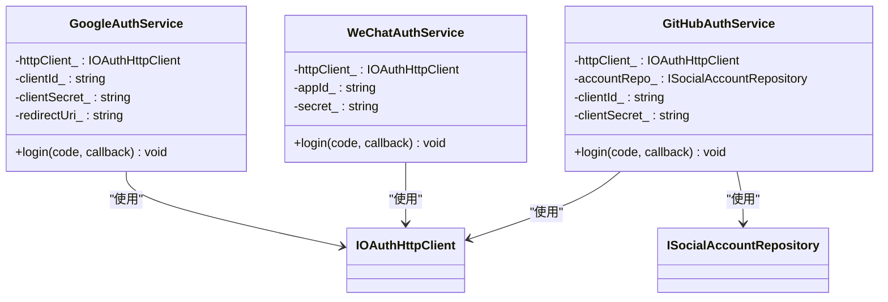
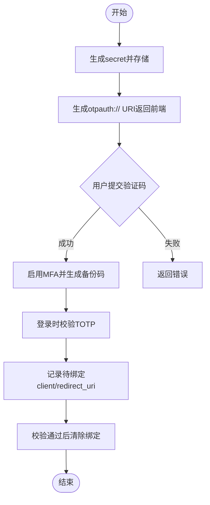
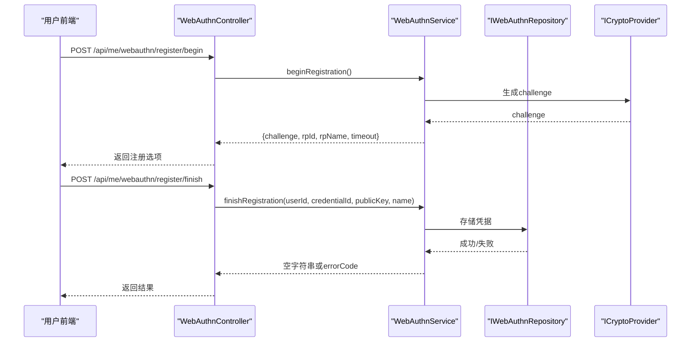
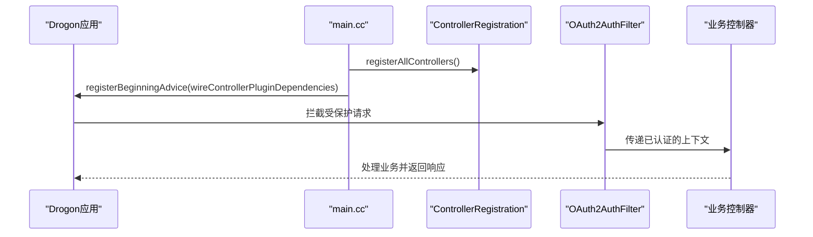
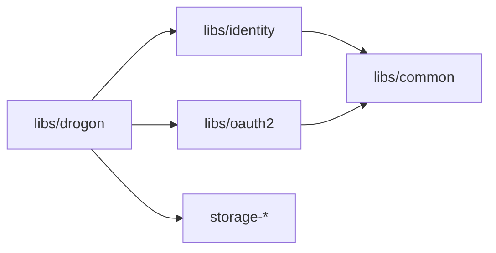

# 认证扩展

<cite>
**本文引用的文件**
- [apps/server/src/main.cc](file://apps/server/src/main.cc)
- [libs/identity/include/authforge/identity/SocialAuthService.h](file://libs/identity/include/authforge/identity/SocialAuthService.h)
- [libs/identity/src/social/GoogleAuthService.cc](file://libs/identity/src/social/GoogleAuthService.cc)
- [libs/identity/src/social/GitHubAuthService.cc](file://libs/identity/src/social/GitHubAuthService.cc)
- [libs/identity/include/authforge/identity/MfaService.h](file://libs/identity/include/authforge/identity/MfaService.h)
- [libs/identity/src/mfa/MfaService.cc](file://libs/identity/src/mfa/MfaService.cc)
- [libs/identity/include/authforge/identity/WebAuthnService.h](file://libs/identity/include/authforge/identity/WebAuthnService.h)
- [libs/drogon/include/authforge/drogon/controllers/WebAuthnController.h](file://libs/drogon/include/authforge/drogon/controllers/WebAuthnController.h)
- [apps/server/config/config.dev.json](file://apps/server/config/config.dev.json)
- [apps/server/migrations/V011__mfa_support.sql](file://apps/server/migrations/V011__mfa_support.sql)
- [apps/server/docs/api/openapi.json](file://apps/server/docs/api/openapi.json)
- [frontends/user/src/pages/account/SecurityPage.vue](file://frontends/user/src/pages/account/SecurityPage.vue)
</cite>

## 目录
1. [简介](#简介)
2. [项目结构](#项目结构)
3. [核心组件](#核心组件)
4. [架构总览](#架构总览)
5. [详细组件分析](#详细组件分析)
6. [依赖关系分析](#依赖关系分析)
7. [性能与可扩展性](#性能与可扩展性)
8. [故障排查指南](#故障排查指南)
9. [结论](#结论)
10. [附录：配置与管理、安全最佳实践、示例与测试](#附录：配置与管理安全最佳实践示例与测试)

## 简介
本指南面向需要在 AuthForge 中扩展认证能力的开发者，聚焦以下目标：
- 明确认证提供商接口规范与扩展点设计
- 深入介绍如何自定义认证方法（社交登录：Google、WeChat、GitHub）
- 说明 MFA（多因素认证）扩展开发（TOTP、WebAuthn）
- 介绍认证流程的钩子函数与中间件（过滤器）开发
- 提供认证扩展的配置与管理方法
- 总结安全考虑与最佳实践
- 给出完整的扩展开发与测试方法

## 项目结构
AuthForge 采用分层 SDK 架构，后端基于 Drogon（C++17），通过 libs/* 拆分为 oauth2、identity、drogon、storage-* 等包。认证扩展主要涉及：
- libs/identity：身份域服务（MFA、WebAuthn、社交登录、用户会话等）
- libs/drogon：Drogon 适配器层（控制器、过滤器、视图装配）
- apps/server：产品装配入口（main 仅做装配与启动）
- 配置与迁移：config.*.json、migrations/*.sql、OpenAPI 文档

图表来源
- [apps/server/src/main.cc:97-238](file://apps/server/src/main.cc#L97-L238)

章节来源
- [apps/server/src/main.cc:97-238](file://apps/server/src/main.cc#L97-L238)

## 核心组件
- 社交登录服务：GoogleAuthService、WeChatAuthService、GitHubAuthService
- MFA 服务：MfaService（TOTP 设置、验证、备份码、登录时校验）
- WebAuthn 服务：WebAuthnService（Passkey 注册/认证、凭据列表）
- 控制器与过滤器：WebAuthnController、OAuth2AuthFilter（鉴权）、RequestValidationFilter（参数校验）
- 配置与迁移：config.dev.json（插件与客户端配置）、V011__mfa_support.sql（MFA 字段）

章节来源
- [libs/identity/include/authforge/identity/SocialAuthService.h:57-266](file://libs/identity/include/authforge/identity/SocialAuthService.h#L57-L266)
- [libs/identity/include/authforge/identity/MfaService.h:47-161](file://libs/identity/include/authforge/identity/MfaService.h#L47-L161)
- [libs/identity/include/authforge/identity/WebAuthnService.h:79-223](file://libs/identity/include/authforge/identity/WebAuthnService.h#L79-L223)
- [libs/drogon/include/authforge/drogon/controllers/WebAuthnController.h:50-76](file://libs/drogon/include/authforge/drogon/controllers/WebAuthnController.h#L50-L76)
- [apps/server/config/config.dev.json:133-173](file://apps/server/config/config.dev.json#L133-L173)
- [apps/server/migrations/V011__mfa_support.sql:1-6](file://apps/server/migrations/V011__mfa_support.sql#L1-L6)

## 架构总览
认证扩展遵循“领域服务 + 适配器”的分层模式：
- 领域服务（identity）不依赖框架（无 Drogon/DB 类型），通过注入仓储和端口实现可测试性与可替换性
- 适配器层（drogon）负责 HTTP 路由、请求解析、响应封装、过滤器链
- 产品装配（apps/server）在启动时组装各组件并注入依赖

图表来源
- [libs/drogon/include/authforge/drogon/controllers/WebAuthnController.h:64-74](file://libs/drogon/include/authforge/drogon/controllers/WebAuthnController.h#L64-L74)
- [libs/identity/include/authforge/identity/WebAuthnService.h:181-203](file://libs/identity/include/authforge/identity/WebAuthnService.h#L181-L203)

章节来源
- [libs/drogon/include/authforge/drogon/controllers/WebAuthnController.h:50-76](file://libs/drogon/include/authforge/drogon/controllers/WebAuthnController.h#L50-L76)
- [libs/identity/include/authforge/identity/WebAuthnService.h:127-223](file://libs/identity/include/authforge/identity/WebAuthnService.h#L127-L223)

## 详细组件分析

### 社交登录扩展（Google、WeChat、GitHub）
- 统一接口：每个提供商提供 login(code, callback) 异步接口，回调返回结构化结果（成功携带过滤后的用户信息或 errorCode）
- 依赖注入：通过 IOAuthHttpClient 进行出站 HTTP 调用；GitHub 额外通过 ISocialAccountRepository 完成本地账户查找/创建与角色分配
- 边界约束：社交登录服务只负责“第三方授权码交换 + 用户信息获取 + 本地账户关联”，不包含 OAuth2 Token 颁发逻辑（由上层编排）

图表来源
- [libs/identity/include/authforge/identity/SocialAuthService.h:96-129](file://libs/identity/include/authforge/identity/SocialAuthService.h#L96-L129)
- [libs/identity/include/authforge/identity/SocialAuthService.h:174-200](file://libs/identity/include/authforge/identity/SocialAuthService.h#L174-L200)
- [libs/identity/include/authforge/identity/SocialAuthService.h:235-266](file://libs/identity/include/authforge/identity/SocialAuthService.h#L235-L266)

章节来源
- [libs/identity/include/authforge/identity/SocialAuthService.h:57-266](file://libs/identity/include/authforge/identity/SocialAuthService.h#L57-L266)
- [libs/identity/src/social/GoogleAuthService.cc:1-47](file://libs/identity/src/social/GoogleAuthService.cc#L1-L47)
- [libs/identity/src/social/GitHubAuthService.cc:1-44](file://libs/identity/src/social/GitHubAuthService.cc#L1-L44)

### MFA 扩展（TOTP）
- 能力范围：生成 TOTP secret、生成 otpauth:// URI、启用 MFA（含一次性备份码）、禁用 MFA、登录时校验 TOTP、记录待绑定客户端/重定向 URI
- 依赖注入：IMfaRepository（持久化）、ICryptoProvider（加密/随机数）、IClock（时间）
- 边界约束：MFA 服务不直接颁发 OAuth2 Token，登录时的“校验后颁发 Token”由上层编排

图表来源
- [libs/identity/src/mfa/MfaService.cc:21-47](file://libs/identity/src/mfa/MfaService.cc#L21-L47)
- [libs/identity/include/authforge/identity/MfaService.h:82-154](file://libs/identity/include/authforge/identity/MfaService.h#L82-L154)

章节来源
- [libs/identity/include/authforge/identity/MfaService.h:47-161](file://libs/identity/include/authforge/identity/MfaService.h#L47-L161)
- [libs/identity/src/mfa/MfaService.cc:1-51](file://libs/identity/src/mfa/MfaService.cc#L1-L51)
- [apps/server/migrations/V011__mfa_support.sql:1-6](file://apps/server/migrations/V011__mfa_support.sql#L1-L6)

### WebAuthn（Passkey/FIDO2）扩展
- 能力范围：注册开始（生成挑战）、注册完成（保存凭据）、认证开始（生成挑战）、认证完成（查找凭据并递增 sign_count）、列出凭据
- 依赖注入：IWebAuthnRepository（凭据持久化）、ICryptoProvider（随机数/编码）
- 控制器暴露端点：/api/me/webauthn/register/*、/oauth2/webauthn/authenticate/*
- 前端交互：前端页面发起 Passkey 注册/认证，并将结果发送至服务端

图表来源
- [libs/drogon/include/authforge/drogon/controllers/WebAuthnController.h:50-63](file://libs/drogon/include/authforge/drogon/controllers/WebAuthnController.h#L50-L63)
- [libs/identity/include/authforge/identity/WebAuthnService.h:147-179](file://libs/identity/include/authforge/identity/WebAuthnService.h#L147-L179)
- [frontends/user/src/pages/account/SecurityPage.vue:111-136](file://frontends/user/src/pages/account/SecurityPage.vue#L111-L136)

章节来源
- [libs/drogon/include/authforge/drogon/controllers/WebAuthnController.h:50-76](file://libs/drogon/include/authforge/drogon/controllers/WebAuthnController.h#L50-L76)
- [libs/identity/include/authforge/identity/WebAuthnService.h:127-223](file://libs/identity/include/authforge/identity/WebAuthnService.h#L127-L223)
- [frontends/user/src/pages/account/SecurityPage.vue:111-136](file://frontends/user/src/pages/account/SecurityPage.vue#L111-L136)

### 认证流程钩子与中间件（过滤器）
- 过滤器链：OAuth2AuthFilter 负责 Bearer Token 校验与上下文注入（如 userId/clientId）
- 参数校验：RequestValidationFilter 对请求参数进行规则校验
- 装配时机：main.cc 在 registerBeginningAdvice 中完成控制器/过滤器依赖注入（去单例化后的 setter 注入）

图表来源
- [apps/server/src/main.cc:151-188](file://apps/server/src/main.cc#L151-L188)

章节来源
- [apps/server/src/main.cc:151-188](file://apps/server/src/main.cc#L151-L188)

## 依赖关系分析
- 领域服务（identity）与协议引擎（oauth2）互不依赖，通过端口（ports）解耦
- 适配器层（drogon）负责将 HTTP 请求映射到领域服务调用
- 存储实现（postgres/redis/memory）通过仓储接口被领域服务使用
- 配置驱动插件实例化：config.dev.json 中的 plugins 块定义 OAuth2Plugin 及其业务配置

图表来源
- [apps/server/config/config.dev.json:133-173](file://apps/server/config/config.dev.json#L133-L173)

章节来源
- [apps/server/config/config.dev.json:133-173](file://apps/server/config/config.dev.json#L133-L173)

## 性能与可扩展性
- 异步回调模型：所有领域服务方法均采用 std::function<void(...)> && 回调，便于非阻塞 I/O 与测试
- 依赖注入：通过构造注入仓储与端口，避免全局单例耦合，提升可测试性与可替换性
- 过滤器链：将通用横切关注点（鉴权、校验）抽离为过滤器，减少控制器复杂度
- 存储抽象：通过仓储接口屏蔽底层存储差异，支持内存/Redis/PostgreSQL 切换

[本节为通用指导，无需特定文件引用]

## 故障排查指南
- 启动阶段
  - 检查 config 加载与验证是否成功（main.cc 中 loadConfiguration）
  - 确认插件装配与控制器依赖注入是否执行（registerBeginningAdvice 日志）
- 认证失败
  - 检查 Authorization 头格式与 Token 有效性（过滤器日志）
  - 社交登录：核对 clientId/clientSecret/redirectUri 与第三方平台配置一致
- MFA 问题
  - 确认 users 表 mfa_enabled/mfa_secret/mfa_backup_codes 字段存在（V011__mfa_support.sql）
  - 校验 TOTP 代码与时间步长匹配（MfaService.verifyLoginCode）
- WebAuthn 问题
  - 检查 RP id/name 配置与浏览器环境一致性
  - 确认凭据已正确注册并存在于存储（IWebAuthnRepository）

章节来源
- [apps/server/src/main.cc:75-95](file://apps/server/src/main.cc#L75-L95)
- [apps/server/src/main.cc:151-188](file://apps/server/src/main.cc#L151-L188)
- [apps/server/migrations/V011__mfa_support.sql:1-6](file://apps/server/migrations/V011__mfa_support.sql#L1-L6)
- [libs/identity/include/authforge/identity/MfaService.h:117-129](file://libs/identity/include/authforge/identity/MfaService.h#L117-L129)

## 结论
AuthForge 的认证扩展以清晰的领域服务与适配器分层为基础，通过依赖注入与端口抽象实现了高内聚、低耦合的可扩展架构。社交登录、MFA（TOTP）、WebAuthn 等能力均以服务形式提供，配合过滤器链与配置驱动装配，既满足生产级稳定性，又便于二次开发与集成。

[本节为总结性内容，无需特定文件引用]

## 附录：配置与管理、安全最佳实践、示例与测试

### 配置与管理
- 插件与客户端配置：在 config.dev.json 的 plugins 块中声明 OAuth2Plugin 及业务配置（storage_type、clients、admin_users 等）
- 迁移脚本：确保数据库迁移（如 V011__mfa_support.sql）在启动前执行
- OpenAPI 文档：通过控制器静态初始化与 OpenApiSetup 生成 API 文档（包含 MFA 相关端点）

章节来源
- [apps/server/config/config.dev.json:133-173](file://apps/server/config/config.dev.json#L133-L173)
- [apps/server/migrations/V011__mfa_support.sql:1-6](file://apps/server/migrations/V011__mfa_support.sql#L1-L6)
- [apps/server/docs/api/openapi.json:1761-1824](file://apps/server/docs/api/openapi.json#L1761-L1824)

### 安全最佳实践
- 最小权限原则：社交登录仅返回必要字段（如 GoogleUserInfo 的 sub/name/email/picture）
- 输入校验：使用 RequestValidationFilter 对请求参数进行严格校验
- 令牌管理：通过 OAuth2AuthFilter 校验 Bearer Token，避免未授权访问
- MFA 与 WebAuthn：启用多因素认证与无密码登录，降低凭证泄露风险
- 审计与监控：结合 Prometheus 指标与审计日志，追踪认证事件

[本节为通用指导，无需特定文件引用]

### 示例与测试
- 社交登录示例：参考 GoogleAuthService.cc、GitHubAuthService.cc 的 login 流程
- MFA 示例：参考 MfaService.cc 的 setupSecret、verifyAndEnable、verifyLoginCode
- WebAuthn 示例：参考 WebAuthnController.h 的端点注册与 WebAuthnService.h 的业务逻辑
- 前端集成：参考 SecurityPage.vue 的 Passkey 注册/认证流程
- 测试方法：
  - 单元测试：针对领域服务（MfaService、WebAuthnService）编写 Mock 仓储与端口的测试
  - 集成测试：通过 ctest 与后端测试套件验证端到端流程
  - E2E 测试：使用 Playwright 模拟用户操作（登录、MFA、WebAuthn）

章节来源
- [libs/identity/src/social/GoogleAuthService.cc:1-47](file://libs/identity/src/social/GoogleAuthService.cc#L1-L47)
- [libs/identity/src/social/GitHubAuthService.cc:1-44](file://libs/identity/src/social/GitHubAuthService.cc#L1-L44)
- [libs/identity/src/mfa/MfaService.cc:1-51](file://libs/identity/src/mfa/MfaService.cc#L1-L51)
- [libs/drogon/include/authforge/drogon/controllers/WebAuthnController.h:50-76](file://libs/drogon/include/authforge/drogon/controllers/WebAuthnController.h#L50-L76)
- [libs/identity/include/authforge/identity/WebAuthnService.h:127-223](file://libs/identity/include/authforge/identity/WebAuthnService.h#L127-L223)
- [frontends/user/src/pages/account/SecurityPage.vue:111-136](file://frontends/user/src/pages/account/SecurityPage.vue#L111-L136)