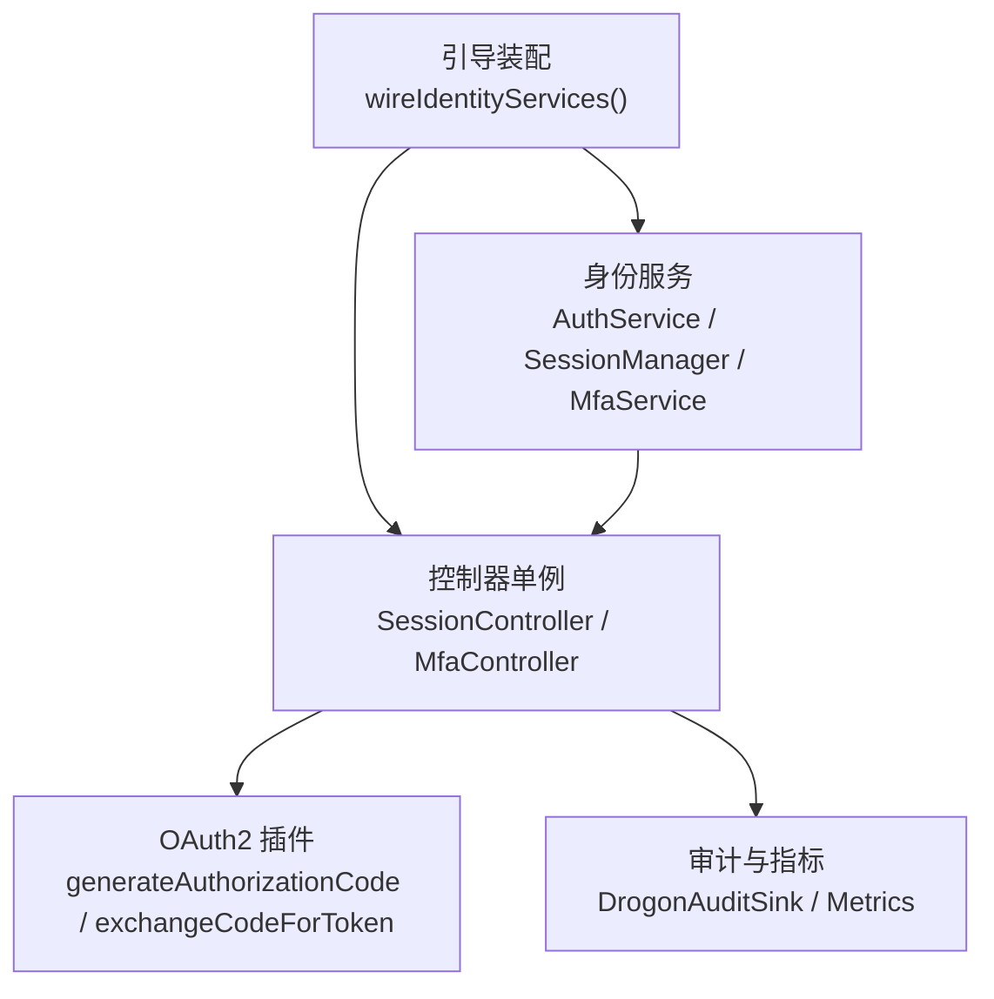
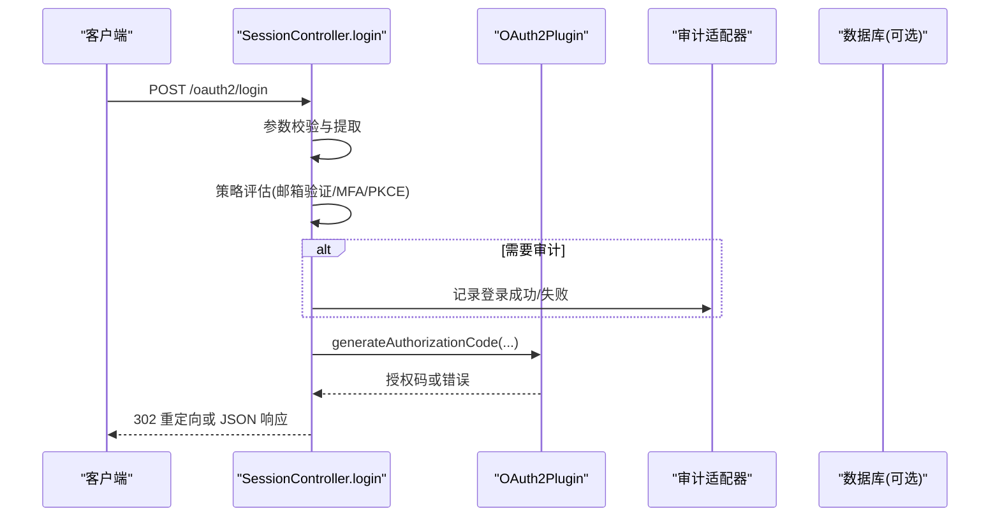
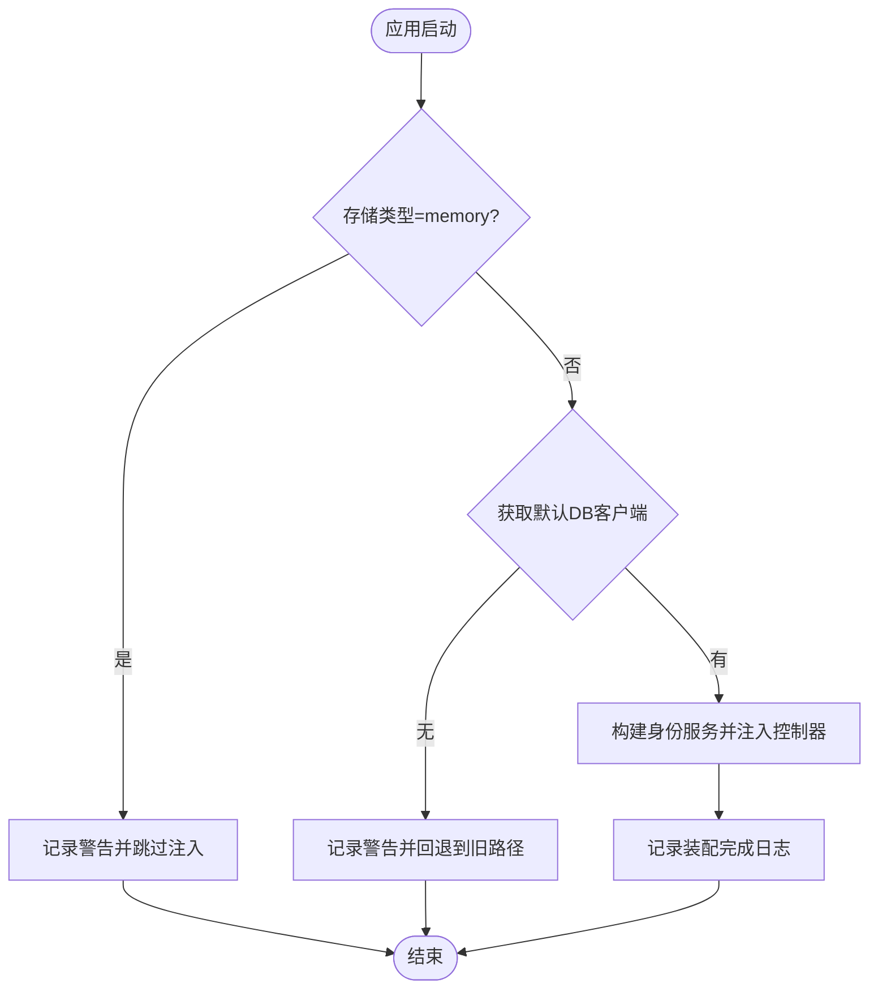
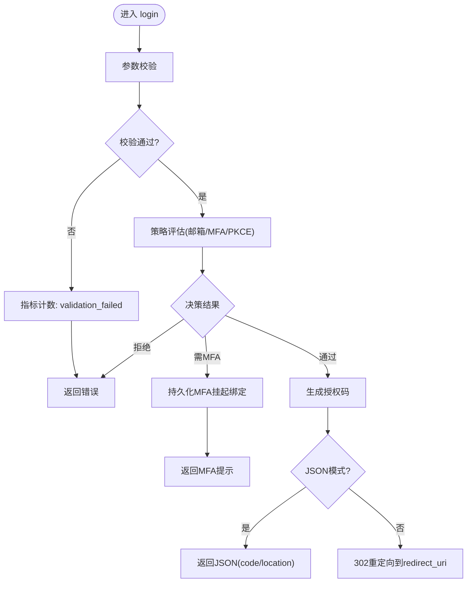
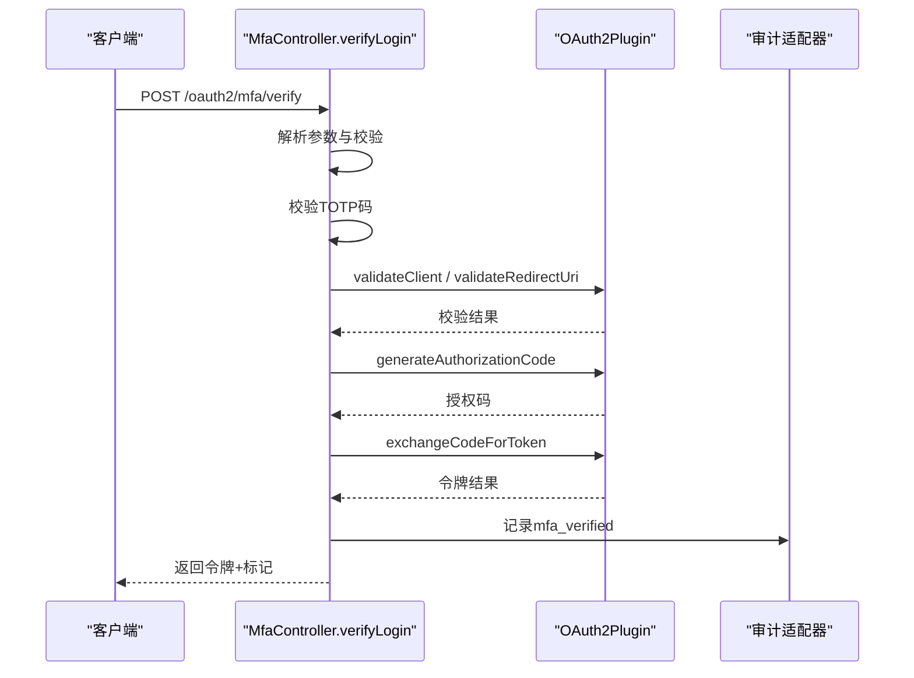
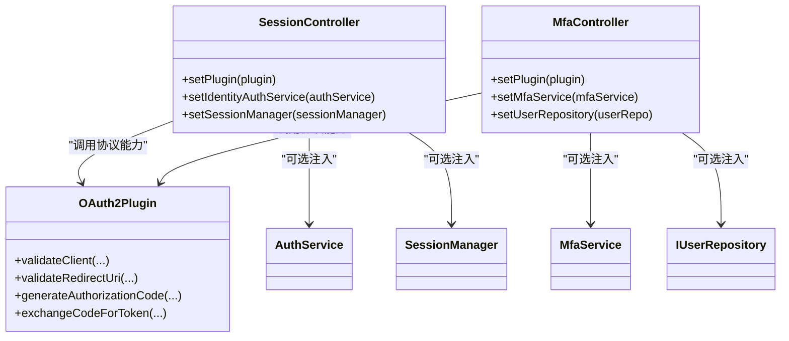

# 认证流程钩子

<cite>
**本文引用的文件**
- [IdentityAssembly.h](file://apps/server/src/bootstrap/IdentityAssembly.h)
- [IdentityAssembly.cc](file://apps/server/src/bootstrap/IdentityAssembly.cc)
- [SessionController.h](file://libs/drogon/include/authforge/drogon/controllers/SessionController.h)
- [SessionController.cc](file://libs/drogon/src/controllers/SessionController.cc)
- [MfaController.h](file://libs/drogon/include/authforge/drogon/controllers/MfaController.h)
- [MfaController.cc](file://libs/drogon/src/controllers/MfaController.cc)
</cite>

## 目录
1. [简介](#简介)
2. [项目结构](#项目结构)
3. [核心组件](#核心组件)
4. [架构总览](#架构总览)
5. [详细组件分析](#详细组件分析)
6. [依赖关系分析](#依赖关系分析)
7. [性能考虑](#性能考虑)
8. [故障排查指南](#故障排查指南)
9. [结论](#结论)
10. [附录](#附录)

## 简介
本文件面向需要在认证流程中插入自定义逻辑的开发者，聚焦“钩子”与“中间件”的开发实践。结合代码库中的控制器与服务装配，说明如何在登录、同意授权、多因素认证等关键阶段扩展行为（如用户预检查、权限验证、审计日志），并给出事件驱动思路、执行顺序与依赖管理建议、调试与监控方法。

## 项目结构
- 启动期服务装配：通过引导模块在应用启动时构造身份层服务（认证、会话、MFA、WebAuthn、社交登录）并注入到控制器单例，形成可插拔的服务依赖。
- 控制器层：SessionController 负责登录、同意、登出等；MfaController 负责 MFA 设置、校验与登录流程中的二次验证。
- 插件与过滤器：OAuth2Plugin 提供协议能力（授权码生成、令牌交换、重定向校验等）；控制器方法可通过过滤器进行请求级鉴权与过滤。

图表来源
- [IdentityAssembly.cc:61-213](file://apps/server/src/bootstrap/IdentityAssembly.cc#L61-L213)
- [SessionController.h:32-69](file://libs/drogon/include/authforge/drogon/controllers/SessionController.h#L32-L69)
- [MfaController.h:23-72](file://libs/drogon/include/authforge/drogon/controllers/MfaController.h#L23-L72)

章节来源
- [IdentityAssembly.h:16-40](file://apps/server/src/bootstrap/IdentityAssembly.h#L16-L40)
- [IdentityAssembly.cc:61-213](file://apps/server/src/bootstrap/IdentityAssembly.cc#L61-L213)
- [SessionController.h:32-69](file://libs/drogon/include/authforge/drogon/controllers/SessionController.h#L32-L69)
- [MfaController.h:23-72](file://libs/drogon/include/authforge/drogon/controllers/MfaController.h#L23-L72)

## 核心组件
- 引导装配 wireIdentityServices：在 Drogon 应用启动早期（registerBeginningAdvice 回调）创建身份层服务实例，并通过 setter 注入到控制器单例。支持内存存储模式下的安全降级。
- SessionController：处理登录、同意、登出等入口，集成策略评估（邮箱验证、MFA）、PKCE 强制、审计记录、授权码生成与返回。
- MfaController：提供 MFA 设置、启用、禁用以及登录时的 MFA 校验，并在通过后继续完成授权码生成与令牌交换。
- OAuth2Plugin：封装协议相关能力（客户端校验、重定向 URI 校验、授权码生成、令牌交换）。
- 审计与指标：统一通过适配器写入审计日志，并通过插件暴露的指标接口计数失败等事件。

章节来源
- [IdentityAssembly.cc:61-213](file://apps/server/src/bootstrap/IdentityAssembly.cc#L61-L213)
- [SessionController.cc:385-763](file://libs/drogon/src/controllers/SessionController.cc#L385-L763)
- [MfaController.cc:92-800](file://libs/drogon/src/controllers/MfaController.cc#L92-L800)

## 架构总览
下图展示一次典型登录流程中的“钩子点”与扩展位置：参数校验、策略评估、审计、协议能力调用、响应构建。

图表来源
- [SessionController.cc:385-763](file://libs/drogon/src/controllers/SessionController.cc#L385-L763)

章节来源
- [SessionController.cc:385-763](file://libs/drogon/src/controllers/SessionController.cc#L385-L763)

## 详细组件分析

### 引导装配与生命周期钩子
- 启动时机：必须在 Drogon 应用 run() 处理 db_clients 配置之后、控制器可用之前执行，确保数据库客户端可用。
- 注入方式：通过控制器的 setter 注入非拥有型指针，控制器内部保留原始指针用于后续调用。
- 降级策略：当存储类型为 memory 或未配置默认数据库客户端时，跳过注入，控制器回退到旧路径，保证兼容性与稳定性。
- 可观察性：在装配完成后输出信息日志，便于确认服务是否成功注入。

图表来源
- [IdentityAssembly.cc:61-213](file://apps/server/src/bootstrap/IdentityAssembly.cc#L61-L213)

章节来源
- [IdentityAssembly.h:16-40](file://apps/server/src/bootstrap/IdentityAssembly.h#L16-L40)
- [IdentityAssembly.cc:61-213](file://apps/server/src/bootstrap/IdentityAssembly.cc#L61-L213)

### 登录流程钩子与扩展点
- 参数校验钩子：使用规则集对登录请求进行校验，失败时直接返回错误并计数。
- 策略评估钩子：根据配置决定是否要求邮箱验证、MFA、PKCE 等，决定后续分支。
- 审计钩子：登录成功/失败均记录审计事件，便于追踪与合规。
- 协议能力钩子：通过插件生成授权码，支持浏览器重定向或 JSON 返回。
- 异常处理钩子：统一通过错误响应器返回标准化错误信封。

图表来源
- [SessionController.cc:385-763](file://libs/drogon/src/controllers/SessionController.cc#L385-L763)

章节来源
- [SessionController.cc:385-763](file://libs/drogon/src/controllers/SessionController.cc#L385-L763)

### MFA 流程钩子与扩展点
- 设置与启用：生成密钥、返回 OTP URI；校验后启用并返回备用码，同时记录审计。
- 登录校验：校验 TOTP 码，校验客户端与重定向 URI，生成授权码并交换令牌，最后清理挂起绑定并记录审计。
- 注入与回退：优先使用注入的 MfaService 与用户仓库，未注入时回退到旧实现。

图表来源
- [MfaController.cc:460-800](file://libs/drogon/src/controllers/MfaController.cc#L460-L800)

章节来源
- [MfaController.cc:92-800](file://libs/drogon/src/controllers/MfaController.cc#L92-L800)

### 中间件与过滤器规范
- 请求过滤：可在控制器方法上声明过滤器（例如 OAuth2AuthFilter），用于前置鉴权、限流、访问控制等。
- 响应修改：在处理器内统一通过响应器构建标准响应体，避免散落的格式差异。
- 异常处理：捕获异常并使用统一错误响应器返回错误信封，保持对外一致。
- 审计与指标：所有关键路径应记录审计事件，并对失败场景计数以便观测。

章节来源
- [SessionController.h:58-69](file://libs/drogon/include/authforge/drogon/controllers/SessionController.h#L58-L69)
- [MfaController.h:52-72](file://libs/drogon/include/authforge/drogon/controllers/MfaController.h#L52-L72)
- [SessionController.cc:48-80](file://libs/drogon/src/controllers/SessionController.cc#L48-L80)

### 事件驱动架构在认证中的应用
- 以回调链组织异步流程：登录、MFA 校验、授权码生成、令牌交换均以回调形式串联，便于在每个阶段插入审计、指标、重试或拦截逻辑。
- 策略函数作为“事件处理器”：将策略评估抽取为纯函数，按配置触发不同分支，便于测试与替换。
- 审计作为横切关注点：通过适配器在关键节点记录事件，不影响主流程。

章节来源
- [SessionController.cc:453-763](file://libs/drogon/src/controllers/SessionController.cc#L453-L763)
- [MfaController.cc:534-681](file://libs/drogon/src/controllers/MfaController.cc#L534-L681)

### 钩子函数的执行顺序与依赖管理
- 启动期：引导装配先于控制器可用，确保依赖已注入。
- 请求期：参数校验 → 策略评估 → 审计 → 协议能力 → 响应构建。
- 依赖管理：控制器持有非拥有型指针，由引导装配负责生命周期；插件通过全局应用获取，保证唯一实例。

章节来源
- [IdentityAssembly.cc:125-213](file://apps/server/src/bootstrap/IdentityAssembly.cc#L125-L213)
- [SessionController.h:92-99](file://libs/drogon/include/authforge/drogon/controllers/SessionController.h#L92-L99)
- [MfaController.h:91-99](file://libs/drogon/include/authforge/drogon/controllers/MfaController.h#L91-L99)

### 常见场景示例（以路径引用代替代码片段）
- 登录前验证（用户预检查）：在参数校验后、策略评估前插入业务规则检查（如账户状态、黑名单）。
  - 参考路径：[SessionController.cc:385-509](file://libs/drogon/src/controllers/SessionController.cc#L385-L509)
- 授权后处理（同意授权）：在用户同意后生成授权码并重定向。
  - 参考路径：[SessionController.cc:765-800](file://libs/drogon/src/controllers/SessionController.cc#L765-L800)
- MFA 登录校验：校验 TOTP 码后继续授权码生成与令牌交换。
  - 参考路径：[MfaController.cc:460-800](file://libs/drogon/src/controllers/MfaController.cc#L460-L800)

章节来源
- [SessionController.cc:385-800](file://libs/drogon/src/controllers/SessionController.cc#L385-L800)
- [MfaController.cc:460-800](file://libs/drogon/src/controllers/MfaController.cc#L460-L800)

## 依赖关系分析
- 控制器依赖：
  - SessionController 依赖 OAuth2Plugin（协议能力）、审计适配器、策略评估函数。
  - MfaController 依赖 MfaService、IUserRepository（注入时）、OAuth2Plugin。
- 引导装配依赖：
  - 数据库客户端、加密提供者、时钟适配器、各存储仓库。
- 外部集成：
  - 通过插件抽象协议细节，控制器仅关注流程编排与扩展点。

图表来源
- [SessionController.h:32-99](file://libs/drogon/include/authforge/drogon/controllers/SessionController.h#L32-L99)
- [MfaController.h:23-99](file://libs/drogon/include/authforge/drogon/controllers/MfaController.h#L23-L99)

章节来源
- [SessionController.h:32-99](file://libs/drogon/include/authforge/drogon/controllers/SessionController.h#L32-L99)
- [MfaController.h:23-99](file://libs/drogon/include/authforge/drogon/controllers/MfaController.h#L23-L99)

## 性能考虑
- 启动期一次性构建服务：加密、时钟、仓库等对象在引导阶段创建并复用，避免请求期重复分配。
- 最小化同步阻塞：数据库操作通过 ORM 与回调链异步处理，减少线程占用。
- 条件注入与降级：内存存储或未配置数据库时快速回退，避免不必要的初始化开销。
- 指标与审计：仅在关键路径记录审计与指标，避免高频写盘影响吞吐。

章节来源
- [IdentityAssembly.cc:125-213](file://apps/server/src/bootstrap/IdentityAssembly.cc#L125-L213)
- [SessionController.cc:385-763](file://libs/drogon/src/controllers/SessionController.cc#L385-L763)
- [MfaController.cc:92-800](file://libs/drogon/src/controllers/MfaController.cc#L92-L800)

## 故障排查指南
- 常见问题定位：
  - 登录失败：检查参数校验失败计数、审计日志中的失败事件、策略评估分支。
    - 参考路径：[SessionController.cc:385-509](file://libs/drogon/src/controllers/SessionController.cc#L385-L509)
  - MFA 校验失败：检查 TOTP 码校验、客户端与重定向 URI 校验、授权码生成与令牌交换的错误。
    - 参考路径：[MfaController.cc:460-800](file://libs/drogon/src/controllers/MfaController.cc#L460-L800)
  - 服务未注入：确认引导装配是否执行、存储类型是否为 memory、数据库客户端是否可用。
    - 参考路径：[IdentityAssembly.cc:61-213](file://apps/server/src/bootstrap/IdentityAssembly.cc#L61-L213)
- 调试建议：
  - 开启调试日志，关注装配与关键流程的日志输出。
  - 使用指标计数器统计失败原因，辅助定位瓶颈。
  - 对策略评估函数进行单元测试，确保分支覆盖。

章节来源
- [IdentityAssembly.cc:61-213](file://apps/server/src/bootstrap/IdentityAssembly.cc#L61-L213)
- [SessionController.cc:385-763](file://libs/drogon/src/controllers/SessionController.cc#L385-L763)
- [MfaController.cc:460-800](file://libs/drogon/src/controllers/MfaController.cc#L460-L800)

## 结论
本项目通过引导装配与控制器注入实现了认证流程的可插拔扩展。登录、同意、MFA 等关键阶段提供了清晰的钩子点，配合策略评估、审计与指标，形成了稳定且可扩展的认证中间件体系。建议在新增钩子时遵循统一的错误响应、审计记录与指标计数规范，确保可观测性与一致性。

## 附录
- 最佳实践
  - 在参数校验后立即进行业务预检查，尽早失败。
  - 将策略评估抽离为纯函数，便于测试与替换。
  - 所有关键路径记录审计事件，失败路径计数指标。
  - 使用过滤器进行横切关注点（鉴权、限流）的统一处理。
- 调试与监控
  - 利用审计日志与指标计数器进行问题定位。
  - 在引导装配阶段输出装配结果日志，便于部署验证。
  - 对复杂回调链增加断点与日志，逐步缩小问题范围。