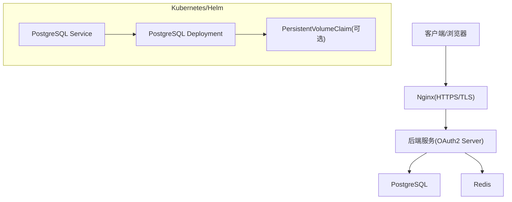
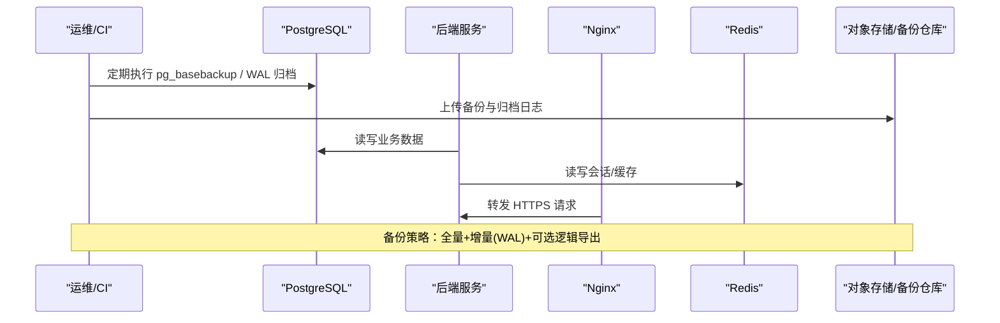
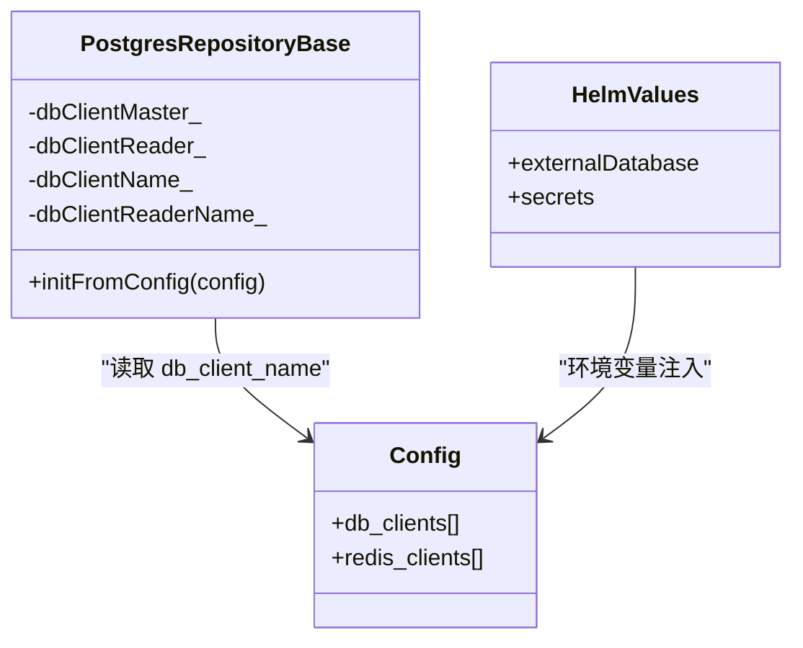

# 备份与恢复

<cite>
**本文引用的文件**
- [values.yaml](file://deploy/helm/authforge/values.yaml)
- [postgresql.yaml](file://deploy/helm/authforge/templates/postgresql.yaml)
- [docker-compose.prod.yml](file://deploy/docker/docker-compose.prod.yml)
- [docker.env.example](file://deploy/env/docker.env.example)
- [config.json](file://apps/server/config/config.json)
- [PostgresRepositoryBase.h](file://libs/storage-postgres/include/authforge/storage/postgres/PostgresRepositoryBase.h)
- [PostgresRepositoryBase.cc](file://libs/storage-postgres/src/PostgresRepositoryBase.cc)
- [V001__schema_migrations.sql](file://apps/server/migrations/V001__schema_migrations.sql)
- [setup-database.sh](file://scripts/backend/setup-database.sh)
- [setup_database.bat](file://scripts/backend/setup_database.bat)
- [docker-postgres-start.sh](file://scripts/backend/docker-postgres-start.sh)
- [reset-admin-password.ps1](file://scripts/backend/reset-admin-password.ps1)
- [reset-account-lockout.ps1](file://scripts/backend/reset-account-lockout.ps1)
- [nginx.conf](file://deploy/nginx/nginx.conf)
- [generate-certs.sh](file://scripts/generate-certs.sh)
- [data-persistence.md](file://docs/backend/data-persistence.md)
</cite>

## 目录
1. [简介](#简介)
2. [项目结构](#项目结构)
3. [核心组件](#核心组件)
4. [架构总览](#架构总览)
5. [详细组件分析](#详细组件分析)
6. [依赖关系分析](#依赖关系分析)
7. [性能考虑](#性能考虑)
8. [故障排查指南](#故障排查指南)
9. [结论](#结论)
10. [附录](#附录)

## 简介
本文件为 AuthForge 项目的数据库备份与恢复策略提供综合指导。内容覆盖全量备份、增量（基于 WAL）备份与实时备份方案；工具选型与配置（pg_dump、pg_basebackup、WAL 归档等）；恢复流程与灾难恢复预案；自动化脚本与定时任务建议；备份数据验证与完整性检查；多环境数据同步与迁移策略；以及存储与安全（加密传输、访问控制、密钥管理）。

## 项目结构
本项目使用 PostgreSQL 作为持久化存储，Redis 用于缓存与会话，Nginx 作为反向代理与 TLS 终止。部署形态支持 Docker Compose 与 Kubernetes Helm。数据库连接通过应用配置与环境变量注入，Helm 模板中内置了 PostgreSQL 的 Deployment、Service 与可选的持久卷声明。

图表来源
- [docker-compose.prod.yml:171-188](file://deploy/docker/docker-compose.prod.yml#L171-L188)
- [postgresql.yaml:28-64](file://deploy/helm/authforge/templates/postgresql.yaml#L28-L64)
- [postgresql.yaml:66-82](file://deploy/helm/authforge/templates/postgresql.yaml#L66-L82)

章节来源
- [docker-compose.prod.yml:1-221](file://deploy/docker/docker-compose.prod.yml#L1-L221)
- [values.yaml:97-119](file://deploy/helm/authforge/values.yaml#L97-L119)
- [postgresql.yaml:1-103](file://deploy/helm/authforge/templates/postgresql.yaml#L1-L103)

## 核心组件
- 数据库：PostgreSQL（容器或托管实例），默认端口 5432，数据库名 oauth2_db，用户 oauth2_user。
- 缓存：Redis（容器或托管实例），默认端口 6379。
- 应用：后端服务通过环境变量或配置文件连接数据库与 Redis。
- 迁移：通过 SQL 迁移脚本（migrations）与一次性迁移 Job（Helm）或 Compose 中的 migrate profile 执行。
- 安全：TLS 在 Nginx 层终止，内部通信可通过网络策略与最小权限原则保护。

章节来源
- [docker.env.example:25-41](file://deploy/env/docker.env.example#L25-L41)
- [config.json:9-27](file://apps/server/config/config.json#L9-L27)
- [PostgresRepositoryBase.cc:7-29](file://libs/storage-postgres/src/PostgresRepositoryBase.cc#L7-L29)
- [PostgresRepositoryBase.h:54-70](file://libs/storage-postgres/include/authforge/storage/postgres/PostgresRepositoryBase.h#L54-L70)
- [V001__schema_migrations.sql:1-10](file://apps/server/migrations/V001__schema_migrations.sql#L1-L10)

## 架构总览
下图展示了生产环境中各组件的关系及数据流向，包括备份相关的外部集成点（如对象存储、WAL 归档目标）。

图表来源
- [docker-compose.prod.yml:171-188](file://deploy/docker/docker-compose.prod.yml#L171-L188)
- [docker-compose.prod.yml:141-169](file://deploy/docker/docker-compose.prod.yml#L141-L169)
- [nginx.conf:48-55](file://deploy/nginx/nginx.conf#L48-L55)

## 详细组件分析

### 备份策略设计
- 全量备份
  - 使用 pg_basebackup 对物理数据进行一致性快照，适合快速恢复整个集群或节点。
  - 适用于本地磁盘、NAS、对象存储（配合压缩与加密）。
  - 频率：每日一次或根据 RPO 要求调整。
- 增量备份（基于 WAL）
  - 启用 archive_mode 与 archive_command，将 WAL 段持续归档到对象存储或专用备份服务器。
  - 结合 pg_basebackup 的全量基线，可实现任意时间点恢复（PITR）。
  - 频率：按 WAL 滚动周期自动完成。
- 实时备份（逻辑复制/流复制）
  - 使用 PostgreSQL 流复制建立只读副本，用于读扩展与就近恢复；或使用逻辑复制至其他库进行热备。
  - 注意：流复制需网络可达与认证配置；逻辑复制需订阅发布配置。
- 逻辑备份（pg_dump/pg_dumpall）
  - 用于跨版本迁移、跨平台迁移或按需导出特定 schema/表。
  - 可配合并发参数提升导出速度，但需注意锁与一致性。

章节来源
- [docker-compose.prod.yml:171-188](file://deploy/docker/docker-compose.prod.yml#L171-L188)
- [docker.env.example:25-41](file://deploy/env/docker.env.example#L25-L41)

### 备份工具选择与配置要点
- pg_basebackup
  - 用于获取一致性的物理备份；建议在低峰期执行，并配合压缩与校验。
  - 输出格式可选择 tar 或目录；推荐 tar 便于传输与存储。
- pg_dump / pg_dumpall
  - 用于逻辑备份；可按库、按 schema、按表粒度导出；适合迁移与测试数据构造。
- WAL 归档
  - 配置 archive_mode=on 与 archive_command，将 WAL 片段复制到可靠存储。
  - 确保归档路径具备足够的容量与冗余。
- 流复制/逻辑复制
  - 流复制：主从复制，提供高可用与只读副本。
  - 逻辑复制：按表级别复制，适合跨版本/跨引擎场景。

章节来源
- [docker-compose.prod.yml:171-188](file://deploy/docker/docker-compose.prod.yml#L171-L188)
- [docker.env.example:25-41](file://deploy/env/docker.env.example#L25-L41)

### 恢复流程与灾难恢复预案
- 数据丢失恢复（单表/单库）
  - 使用 pg_restore 或 psql 导入逻辑备份；先回滚事务再导入，确保一致性。
  - 对于关键表，建议先导出当前状态作为临时快照，再进行恢复操作。
- 系统故障恢复（整库/PITR）
  - 使用 pg_basebackup 基线 + WAL 归档恢复到指定时间点。
  - 步骤：准备数据目录 -> 恢复基线 -> 配置 recovery.signal/restore_command -> 启动实例 -> 验证数据。
- 业务连续性保障
  - 启用只读副本分流读流量，降低主库压力。
  - 制定演练计划，定期执行恢复演练，验证 RTO/RPO 达标。

章节来源
- [docker-compose.prod.yml:171-188](file://deploy/docker/docker-compose.prod.yml#L171-L188)
- [docker.env.example:25-41](file://deploy/env/docker.env.example#L25-L41)

### 备份自动化脚本与定时任务
- 本地/开发环境
  - 使用 scripts/backend/setup-database.sh 初始化数据库与迁移；可用于重建测试环境。
  - 使用 docker-postgres-start.sh 启动 PostgreSQL 容器并等待就绪。
- 生产环境
  - 建议使用 Cron 或系统调度器执行 pg_basebackup 与 WAL 归档脚本。
  - 将备份结果上传至对象存储，并记录元数据（时间戳、校验和、大小）。
  - 定期清理过期备份，保留策略与合规要求对齐。

章节来源
- [setup-database.sh:1-66](file://scripts/backend/setup-database.sh#L1-L66)
- [docker-postgres-start.sh:1-44](file://scripts/backend/docker-postgres-start.sh#L1-L44)
- [setup_database.bat:1-36](file://scripts/backend/setup_database.bat#L1-L36)

### 备份数据验证与完整性检查
- 校验和验证
  - 对备份文件计算哈希（如 SHA-256），并与预期值比对。
  - 使用 pg_verifybackup 验证物理备份一致性（若适用）。
- 恢复演练
  - 在隔离环境执行完整恢复流程，验证数据可用性与业务功能。
- 逻辑一致性
  - 对关键表执行计数、抽样比对；对索引与约束进行检查。

章节来源
- [docker-compose.prod.yml:171-188](file://deploy/docker/docker-compose.prod.yml#L171-L188)
- [docker.env.example:25-41](file://deploy/env/docker.env.example#L25-L41)

### 多环境数据同步与迁移策略
- 环境划分
  - 开发/测试/预发/生产；每个环境独立数据库实例。
- 迁移方式
  - 使用 migrations 目录下的 SQL 脚本进行版本化管理；通过一次性迁移 Job（Helm）或 Compose 的 migrate profile 执行。
  - 逻辑备份（pg_dump）用于跨环境数据同步（脱敏后）。
- 注意事项
  - 迁移前备份；迁移后验证；回滚预案准备。
  - 避免在生产高峰执行大迁移；必要时采用灰度发布。

章节来源
- [docker-compose.prod.yml:141-169](file://deploy/docker/docker-compose.prod.yml#L141-L169)
- [V001__schema_migrations.sql:1-10](file://apps/server/migrations/V001__schema_migrations.sql#L1-L10)
- [docker.env.example:56-60](file://deploy/env/docker.env.example#L56-L60)

### 备份存储方案与安全考虑
- 存储位置
  - 本地磁盘、NAS、对象存储（S3/OSS/COS）；建议多地域冗余。
- 加密传输
  - 使用 HTTPS/TLS 传输备份数据；Nginx 已配置 TLS 协议与密码套件。
  - 数据库连接可使用 SSL（需在数据库与客户端配置证书）。
- 访问控制
  - 最小权限原则：备份账号仅具备必要权限。
  - 使用密钥管理服务（KMS/Secrets）管理敏感信息（数据库密码、JWT 私钥等）。
- 合规与审计
  - 记录备份与恢复操作日志；定期审计访问与变更。

章节来源
- [nginx.conf:48-55](file://deploy/nginx/nginx.conf#L48-L55)
- [docker.env.example:15-23](file://deploy/env/docker.env.example#L15-L23)
- [values.yaml:83-95](file://deploy/helm/authforge/values.yaml#L83-L95)

## 依赖关系分析
- 应用与数据库
  - 后端通过 Drogon ORM 的 DbClient 连接 PostgreSQL；支持主从读取分离（dbClientMaster/dbClientReader）。
- 部署与配置
  - Helm values 控制是否启用内置 PostgreSQL 或外部数据库；环境变量注入敏感配置。
  - Docker Compose 定义服务依赖与健康检查，确保启动顺序与可用性。

图表来源
- [PostgresRepositoryBase.h:54-70](file://libs/storage-postgres/include/authforge/storage/postgres/PostgresRepositoryBase.h#L54-L70)
- [PostgresRepositoryBase.cc:7-29](file://libs/storage-postgres/src/PostgresRepositoryBase.cc#L7-L29)
- [config.json:9-27](file://apps/server/config/config.json#L9-L27)
- [values.yaml:83-119](file://deploy/helm/authforge/values.yaml#L83-L119)

章节来源
- [PostgresRepositoryBase.h:54-70](file://libs/storage-postgres/include/authforge/storage/postgres/PostgresRepositoryBase.h#L54-L70)
- [PostgresRepositoryBase.cc:7-29](file://libs/storage-postgres/src/PostgresRepositoryBase.cc#L7-L29)
- [config.json:9-27](file://apps/server/config/config.json#L9-L27)
- [values.yaml:83-119](file://deploy/helm/authforge/values.yaml#L83-L119)

## 性能考虑
- 备份窗口
  - 选择低峰期执行全量备份；增量备份由 WAL 自动触发，影响较小。
- I/O 与 CPU
  - 使用并行导出（pg_dump 并发）与压缩传输；监控 I/O 与 CPU 占用。
- 网络带宽
  - 对象存储上传使用分块与断点续传；限制并发以避免拥塞。
- 资源隔离
  - 在容器/K8s 中限制备份任务的资源配额，避免影响主业务。

[本节为通用指导，不直接分析具体文件]

## 故障排查指南
- 数据库不可用
  - 检查健康检查与连接参数；确认角色与密码正确。
  - 参考脚本中的错误提示与退出码定位问题。
- 迁移失败
  - 检查迁移脚本顺序与依赖；查看 schema_migrations 记录。
- 备份失败
  - 检查存储空间与权限；验证 WAL 归档路径可达。
- 恢复失败
  - 校验备份完整性；确认恢复目标版本兼容；逐步回退到上一稳定版本。

章节来源
- [setup-database.sh:16-39](file://scripts/backend/setup-database.sh#L16-L39)
- [docker-postgres-start.sh:19-33](file://scripts/backend/docker-postgres-start.sh#L19-L33)
- [reset-admin-password.ps1:71-84](file://scripts/backend/reset-admin-password.ps1#L71-L84)
- [reset-account-lockout.ps1:26-45](file://scripts/backend/reset-account-lockout.ps1#L26-L45)

## 结论
通过组合 pg_basebackup、WAL 归档与逻辑备份（pg_dump），AuthForge 可在不同场景下实现可靠的备份与恢复策略。结合 Helm/Docker Compose 的部署能力与环境变量管理，能够灵活适配本地、测试与生产环境。建议定期演练恢复流程，确保 RTO/RPO 满足业务要求，并在传输与存储层面落实加密与访问控制，保障数据安全与合规。

[本节为总结性内容，不直接分析具体文件]

## 附录
- 关键环境变量与配置
  - 数据库连接：OAUTH2_DB_HOST/PORT/NAME/USER/PASSWORD
  - Redis 连接：OAUTH2_REDIS_HOST/PORT/PASSWORD
  - JWT 私钥路径：OAUTH2_JWT_KEY_PATH
  - 运行模式：OAUTH2_ENV（production 启用严格校验）
- 迁移与种子数据
  - 迁移脚本位于 apps/server/migrations；种子数据位于 apps/server/seed。
- 安全加固
  - Nginx 启用 TLS 与 HSTS；生成自签名证书用于开发测试。

章节来源
- [docker.env.example:8-23](file://deploy/env/docker.env.example#L8-L23)
- [docker.env.example:25-41](file://deploy/env/docker.env.example#L25-L41)
- [V001__schema_migrations.sql:1-10](file://apps/server/migrations/V001__schema_migrations.sql#L1-L10)
- [generate-certs.sh:1-24](file://scripts/generate-certs.sh#L1-L24)
- [data-persistence.md:162-172](file://docs/backend/data-persistence.md#L162-L172)