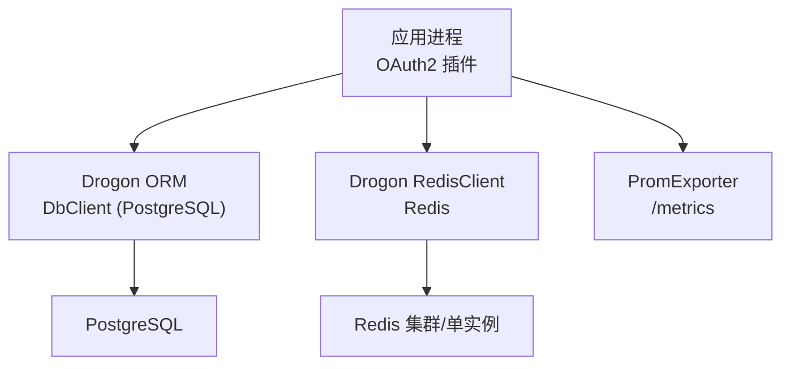
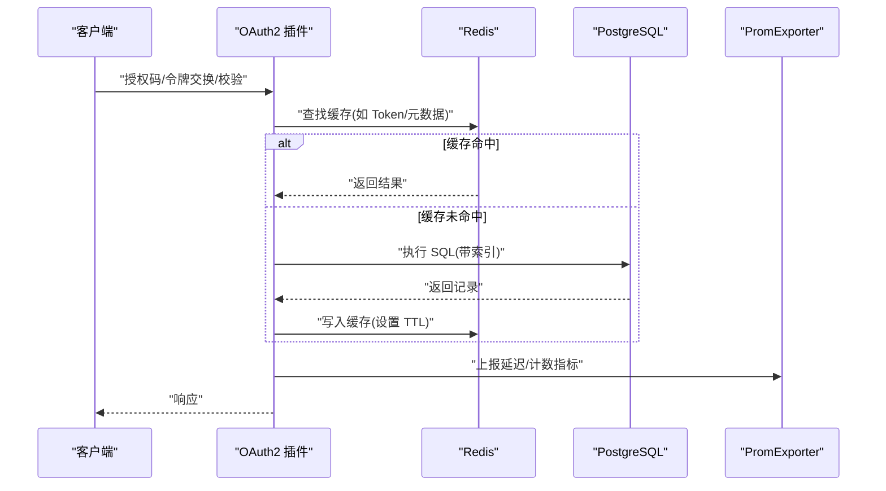
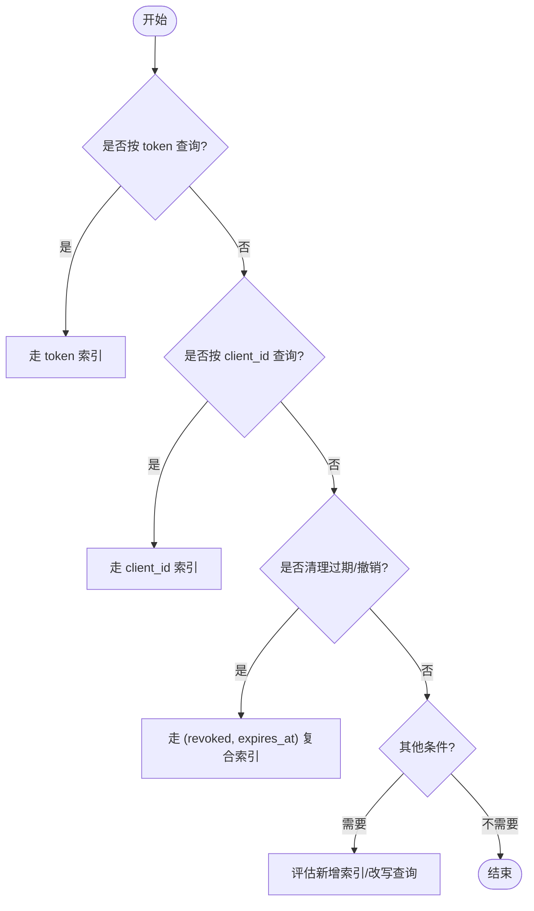
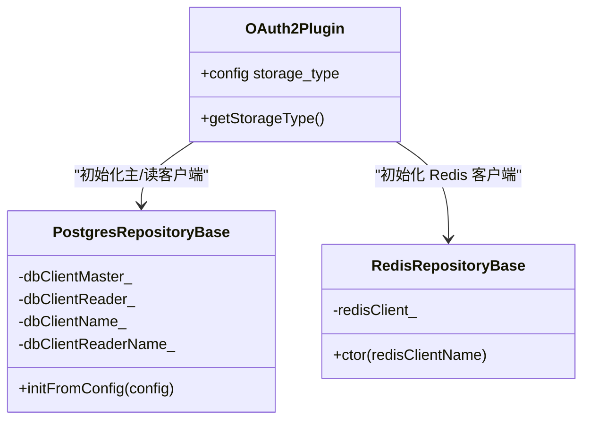

# 性能优化

<cite>
**本文引用的文件**
- [apps/server/migrations/V002__oauth2_core.sql](file://apps/server/migrations/V002__oauth2_core.sql)
- [apps/server/migrations/V003__oauth2_core_indexes.sql](file://apps/server/migrations/V003__oauth2_core_indexes.sql)
- [apps/server/config/config.json](file://apps/server/config/config.json)
- [apps/server/config/config.prod.json](file://apps/server/config/config.prod.json)
- [libs/storage-postgres/include/authforge/storage/postgres/PostgresRepositoryBase.h](file://libs/storage-postgres/include/authforge/storage/postgres/PostgresRepositoryBase.h)
- [libs/storage-redis/include/authforge/storage/redis/RedisRepositoryBase.h](file://libs/storage-redis/include/authforge/storage/redis/RedisRepositoryBase.h)
- [libs/storage-redis/src/RedisClientRepository.cc](file://libs/storage-redis/src/RedisClientRepository.cc)
- [docs/backend/observability.md](file://docs/backend/observability.md)
- [tests/security/injection/DbLeakVerificationTest.cc](file://tests/security/injection/DbLeakVerificationTest.cc)
- [tests/performance/benchmark/PerformanceBenchmark.cc](file://tests/performance/benchmark/PerformanceBenchmark.cc)
- [docs/history/design/superpowers/specs/2026-05-11-p1-P1_TECHNICAL_DESIGN.md](file://docs/history/design/superpowers/specs/2026-05-11-p1-P1_TECHNICAL_DESIGN.md)
- [docs/backend/data-persistence.md](file://docs/backend/data-persistence.md)
</cite>

## 目录
1. [简介](#简介)
2. [项目结构](#项目结构)
3. [核心组件](#核心组件)
4. [架构总览](#架构总览)
5. [详细组件分析](#详细组件分析)
6. [依赖关系分析](#依赖关系分析)
7. [性能考量](#性能考量)
8. [故障排查指南](#故障排查指南)
9. [结论](#结论)
10. [附录](#附录)

## 简介
本指南聚焦于 OAuth2 认证服务的数据库性能优化，覆盖索引策略、连接池调优、查询性能分析方法、缓存策略、分库分表与读写分离建议、监控指标与基准测试，以及生产环境调优与排障实践。内容基于仓库中的迁移脚本、配置、存储实现与可观测性文档进行系统化梳理，并提供可操作的优化路径。

## 项目结构
- 数据库层：PostgreSQL 通过 Drogon ORM 访问；Redis 用于高性能缓存与令牌生命周期管理。
- 存储抽象：PostgresRepositoryBase 提供主从客户端初始化能力；RedisRepositoryBase 提供 Redis 客户端获取与超时设置。
- 配置：开发/生产环境分别提供 db_clients 与 redis_clients 的连接池参数。
- 可观测性：Prometheus Exporter 暴露请求量、错误率、延迟直方图等指标。

图表来源
- [apps/server/config/config.json:9-40](file://apps/server/config/config.json#L9-L40)
- [apps/server/config/config.prod.json:9-40](file://apps/server/config/config.prod.json#L9-L40)
- [libs/storage-postgres/include/authforge/storage/postgres/PostgresRepositoryBase.h:54-70](file://libs/storage-postgres/include/authforge/storage/postgres/PostgresRepositoryBase.h#L54-L70)
- [libs/storage-redis/include/authforge/storage/redis/RedisRepositoryBase.h:42-53](file://libs/storage-redis/include/authforge/storage/redis/RedisRepositoryBase.h#L42-L53)
- [docs/backend/observability.md:1-22](file://docs/backend/observability.md#L1-L22)

章节来源
- [apps/server/config/config.json:9-40](file://apps/server/config/config.json#L9-L40)
- [apps/server/config/config.prod.json:9-40](file://apps/server/config/config.prod.json#L9-L40)
- [libs/storage-postgres/include/authforge/storage/postgres/PostgresRepositoryBase.h:54-70](file://libs/storage-postgres/include/authforge/storage/postgres/PostgresRepositoryBase.h#L54-L70)
- [libs/storage-redis/include/authforge/storage/redis/RedisRepositoryBase.h:42-53](file://libs/storage-redis/include/authforge/storage/redis/RedisRepositoryBase.h#L42-L53)
- [docs/backend/observability.md:1-22](file://docs/backend/observability.md#L1-L22)

## 核心组件
- 数据库表与索引
  - OAuth2 核心表：clients、codes、access_tokens、refresh_tokens（定义见迁移脚本）。
  - 索引：针对 token、client_id、过期时间、撤销状态等高频查询字段建立复合索引。
- 存储后端
  - PostgreSQL：通过 PostgresRepositoryBase 初始化主/读客户端，支持读写分离扩展点。
  - Redis：通过 RedisRepositoryBase 获取 RedisClient 并设置超时，用于高吞吐 Token 操作。
- 配置与连接池
  - db_clients.number_of_connections、timeout、auto_batch、connect_options.statement_timeout。
  - redis_clients.number_of_connections、timeout。
- 可观测性
  - Prometheus 指标：请求总量、失败数、延迟直方图、活跃 Token 估算等。

章节来源
- [apps/server/migrations/V002__oauth2_core.sql:5-56](file://apps/server/migrations/V002__oauth2_core.sql#L5-L56)
- [apps/server/migrations/V003__oauth2_core_indexes.sql:3-8](file://apps/server/migrations/V003__oauth2_core_indexes.sql#L3-L8)
- [libs/storage-postgres/include/authforge/storage/postgres/PostgresRepositoryBase.h:54-70](file://libs/storage-postgres/include/authforge/storage/postgres/PostgresRepositoryBase.h#L54-L70)
- [libs/storage-redis/include/authforge/storage/redis/RedisRepositoryBase.h:42-53](file://libs/storage-redis/include/authforge/storage/redis/RedisRepositoryBase.h#L42-L53)
- [apps/server/config/config.json:9-40](file://apps/server/config/config.json#L9-L40)
- [apps/server/config/config.prod.json:9-40](file://apps/server/config/config.prod.json#L9-L40)
- [docs/backend/observability.md:1-22](file://docs/backend/observability.md#L1-L22)

## 架构总览
下图展示请求在 OAuth2 服务中的关键路径：HTTP 进入后，鉴权流程可能命中 Redis 缓存（Token 校验、元数据），未命中则回源到 PostgreSQL 读取或写入，并通过 PromExporter 上报指标。

图表来源
- [libs/storage-redis/src/RedisClientRepository.cc:1-27](file://libs/storage-redis/src/RedisClientRepository.cc#L1-L27)
- [libs/storage-postgres/include/authforge/storage/postgres/PostgresRepositoryBase.h:54-70](file://libs/storage-postgres/include/authforge/storage/postgres/PostgresRepositoryBase.h#L54-L70)
- [docs/backend/observability.md:1-22](file://docs/backend/observability.md#L1-L22)

## 详细组件分析

### 索引策略与查询优化（OAuth2 核心表）
- 表结构与主键
  - oauth2_access_tokens(token PK)、oauth2_refresh_tokens(token PK)、oauth2_codes(code PK)、oauth2_clients(client_id PK)。
- 索引设计
  - access_tokens: token、client_id、expires_at、(revoked, expires_at) 复合索引。
  - refresh_tokens: token、(revoked, expires_at) 复合索引。
- 典型查询场景与索引匹配
  - 按 token 精确查找：使用 token 索引。
  - 清理过期/已撤销令牌：使用 (revoked, expires_at) 复合索引加速范围扫描。
  - 按 client_id 统计/过滤：使用 client_id 索引。
- 建议
  - 避免对大文本字段（scope、redirect_uris）做前缀索引；如需按 scope 过滤，考虑生成列+表达式索引或规范化拆分。
  - 定期 ANALYZE 更新统计信息，确保优化器选择正确计划。
  - 对高频 UPDATE（如 revoked 标记）关注锁竞争与 WAL 压力。

图表来源
- [apps/server/migrations/V002__oauth2_core.sql:5-56](file://apps/server/migrations/V002__oauth2_core.sql#L5-L56)
- [apps/server/migrations/V003__oauth2_core_indexes.sql:3-8](file://apps/server/migrations/V003__oauth2_core_indexes.sql#L3-L8)

章节来源
- [apps/server/migrations/V002__oauth2_core.sql:5-56](file://apps/server/migrations/V002__oauth2_core.sql#L5-L56)
- [apps/server/migrations/V003__oauth2_core_indexes.sql:3-8](file://apps/server/migrations/V003__oauth2_core_indexes.sql#L3-L8)

### 连接池配置与资源管理
- PostgreSQL 连接池
  - number_of_connections：控制每个 DbClient 的并发连接数。生产环境默认较小，可根据 CPU 核数与负载调整。
  - timeout：连接/语句级超时，防止长事务拖垮池。
  - auto_batch：开启批量提交减少往返。
  - connect_options.statement_timeout：限制单条语句执行时间，避免慢查询占用连接。
- Redis 连接池
  - number_of_connections：控制 Redis 客户端连接数。
  - timeout：网络/命令超时，避免阻塞线程。
- 最佳实践
  - 根据 QPS 与平均延迟估算所需连接数：连接数 ≈ QPS × 平均 RTT / 1000。
  - 为不同用途创建多个 DbClient（写/读分离），降低锁竞争。
  - 结合 Hodor 限流保护后端，避免突发流量打满连接池。

章节来源
- [apps/server/config/config.json:9-40](file://apps/server/config/config.json#L9-L40)
- [apps/server/config/config.prod.json:9-40](file://apps/server/config/config.prod.json#L9-L40)
- [docs/backend/observability.md:1-22](file://docs/backend/observability.md#L1-L22)

### 查询性能分析方法
- 慢查询日志
  - 启用 PostgreSQL 慢查询日志（log_min_duration_statement），采集执行时间超过阈值的 SQL。
  - 结合 statement_timeout 快速定位异常长语句。
- 执行计划分析
  - 使用 EXPLAIN/EXPLAIN ANALYZE 检查索引使用情况、扫描方式与成本。
  - 关注 Seq Scan 出现在大表上的情况，必要时补充索引或改写查询。
- 瓶颈识别
  - 通过 PromExporter 的延迟直方图与业务指标（登录失败、Introspection 错误）定位热点端点。
  - 结合 Redis 命中率与 DB 连接池使用率判断缓存有效性。

章节来源
- [docs/backend/observability.md:1-22](file://docs/backend/observability.md#L1-L22)

### 缓存策略建议（Redis 集成与内存优化）
- Key 设计与 TTL
  - 统一前缀（如 oauth2:*），区分实体类型（client、code、token、refresh）。
  - 合理设置 TTL：授权码短 TTL，访问令牌中等 TTL，刷新令牌较长 TTL。
- 缓存模式
  - 读多写少：先查缓存，未命中再查 DB 并回填。
  - 写扩散：令牌撤销时主动删除相关缓存键，保证一致性。
- 内存优化
  - 使用 Hash 存储结构化对象，减少键数量与序列化开销。
  - 监控 Redis 内存与命中率，必要时拆分 key 空间或引入本地小缓存（注意一致性）。
- 性能目标参考
  - 令牌操作在缓存命中下达到亚毫秒级；未命中时整体仍满足 P95 目标。

章节来源
- [docs/backend/data-persistence.md:94-131](file://docs/backend/data-persistence.md#L94-L131)
- [libs/storage-redis/include/authforge/storage/redis/RedisRepositoryBase.h:42-53](file://libs/storage-redis/include/authforge/storage/redis/RedisRepositoryBase.h#L42-L53)
- [libs/storage-redis/src/RedisClientRepository.cc:1-27](file://libs/storage-redis/src/RedisClientRepository.cc#L1-L27)

### 分库分表策略与读写分离配置
- 读写分离
  - 通过 PostgresRepositoryBase 的主/读客户端分离，将只读查询路由到副本，减轻主库压力。
  - 注意复制延迟对强一致读的影响，必要时降级到主库。
- 分库分表
  - 按租户/组织维度水平分片（如按 client_id 哈希），提升横向扩展能力。
  - 令牌表按时间或哈希分片，降低单表体积与锁竞争。
  - 跨分片查询需在上层聚合，避免分布式事务。
- 迁移与治理
  - 使用迁移脚本逐步切流，灰度验证后再全量切换。
  - 配合监控与告警，观察分片后的均匀性与热点。

章节来源
- [libs/storage-postgres/include/authforge/storage/postgres/PostgresRepositoryBase.h:54-70](file://libs/storage-postgres/include/authforge/storage/postgres/PostgresRepositoryBase.h#L54-L70)

### 性能监控指标与基准测试结果
- 监控指标
  - 请求总量、登录失败次数、Introspection/Revocation 错误、延迟直方图、活跃 Token 估算。
- 基准目标（参考设计文档）
  - 令牌操作：授权码生成 < 10ms，令牌交换 < 50ms，Introspection 缓存命中 < 10ms、未命中 < 30ms。
  - 数据库查询：索引命中 < 5ms，撤销更新 < 10ms。
  - 负载：稳定 1000 req/s（P95 < 50ms），峰值 5000 req/s（P95 < 100ms），突发 10000 req/s（P95 < 200ms）。
  - 缓存：正常负载下命中率 ≥ 95%，Redis 操作 < 2ms。
- 基准测试
  - 项目包含通用性能基准用例，可用于压测主体功能与解析逻辑。

章节来源
- [docs/history/design/superpowers/specs/2026-05-11-p1-P1_TECHNICAL_DESIGN.md:606-660](file://docs/history/design/superpowers/specs/2026-05-11-p1-P1_TECHNICAL_DESIGN.md#L606-L660)
- [tests/performance/benchmark/PerformanceBenchmark.cc:11-78](file://tests/performance/benchmark/PerformanceBenchmark.cc#L11-L78)
- [docs/backend/observability.md:1-22](file://docs/backend/observability.md#L1-L22)

## 依赖关系分析
- 存储层依赖
  - Postgres 存储通过 PostgresRepositoryBase 注入 DbClient 指针，支持主从双客户端。
  - Redis 存储通过 RedisRepositoryBase 注入 RedisClient，并设置超时。
- 配置驱动
  - db_clients/redis_clients 名称与连接参数由配置文件决定，插件通过名称查找对应客户端。
- 可观测性耦合
  - 指标上报集中在 PromExporter，便于统一采集与分析。

图表来源
- [libs/storage-postgres/include/authforge/storage/postgres/PostgresRepositoryBase.h:54-70](file://libs/storage-postgres/include/authforge/storage/postgres/PostgresRepositoryBase.h#L54-L70)
- [libs/storage-redis/include/authforge/storage/redis/RedisRepositoryBase.h:42-53](file://libs/storage-redis/include/authforge/storage/redis/RedisRepositoryBase.h#L42-L53)
- [apps/server/config/config.json:133-170](file://apps/server/config/config.json#L133-L170)
- [apps/server/config/config.prod.json:189-218](file://apps/server/config/config.prod.json#L189-L218)

章节来源
- [libs/storage-postgres/include/authforge/storage/postgres/PostgresRepositoryBase.h:54-70](file://libs/storage-postgres/include/authforge/storage/postgres/PostgresRepositoryBase.h#L54-L70)
- [libs/storage-redis/include/authforge/storage/redis/RedisRepositoryBase.h:42-53](file://libs/storage-redis/include/authforge/storage/redis/RedisRepositoryBase.h#L42-L53)
- [apps/server/config/config.json:133-170](file://apps/server/config/config.json#L133-L170)
- [apps/server/config/config.prod.json:189-218](file://apps/server/config/config.prod.json#L189-L218)

## 性能考量
- 索引与查询
  - 优先利用现有复合索引；对复杂过滤条件评估表达式索引或物化视图。
  - 避免 SELECT *，仅拉取必要字段以减少 IO 与序列化开销。
- 连接池与超时
  - 根据负载曲线动态调整 number_of_connections；设置合理的 timeout 与 statement_timeout。
  - 使用 auto_batch 合并写操作，降低网络往返。
- 缓存与一致性
  - 采用“先删缓存再更新 DB”或“延迟双删”策略，避免脏读。
  - 对热点 Key 设置较短 TTL，降低内存占用与失效风暴风险。
- 监控与告警
  - 基于 PromExporter 指标建立告警：QPS 突增、错误率上升、P99 延迟超标、连接池耗尽。
  - 结合慢查询日志与执行计划持续优化。

[本节为通用指导，不直接分析具体文件]

## 故障排查指南
- 连接池耗尽
  - 现象：出现连接耗尽错误、数据库连接数飙升。
  - 排查：检查 number_of_connections、timeout、statement_timeout；确认是否存在长事务或未释放连接。
  - 验证：通过连接池行为测试用例观察复用情况。
- 慢查询与锁竞争
  - 现象：P99 延迟升高、CPU/IO 打满。
  - 排查：启用慢查询日志，分析 EXPLAIN 计划；检查索引缺失或失效；评估锁等待。
- 缓存穿透/雪崩
  - 现象：大量请求直达 DB，Redis 命中率骤降。
  - 排查：增加空值缓存、随机 TTL、热点 Key 预热；限制并发穿透。
- 指标异常
  - 现象：PromExporter 指标显示错误率/延迟异常。
  - 排查：结合日志与指标定位热点端点；检查下游依赖（DB/Redis）健康状态。

章节来源
- [tests/security/injection/DbLeakVerificationTest.cc:79-143](file://tests/security/injection/DbLeakVerificationTest.cc#L79-L143)
- [docs/backend/observability.md:1-22](file://docs/backend/observability.md#L1-L22)

## 结论
通过对 OAuth2 核心表的索引设计、连接池参数、缓存策略、读写分离与监控指标的体系化优化，可在保证安全与一致性的前提下显著提升吞吐与稳定性。建议在生产环境以监控驱动的方式持续迭代，结合慢查询与执行计划分析，逐步逼近设计文档中的性能目标。

[本节为总结性内容，不直接分析具体文件]

## 附录
- 关键配置位置
  - 开发/生产环境的 db_clients 与 redis_clients 参数对比，便于调参参考。
- 基准与目标
  - 参考设计文档中的性能目标与基准场景，作为容量规划与回归测试依据。

章节来源
- [apps/server/config/config.json:9-40](file://apps/server/config/config.json#L9-L40)
- [apps/server/config/config.prod.json:9-40](file://apps/server/config/config.prod.json#L9-L40)
- [docs/history/design/superpowers/specs/2026-05-11-p1-P1_TECHNICAL_DESIGN.md:606-660](file://docs/history/design/superpowers/specs/2026-05-11-p1-P1_TECHNICAL_DESIGN.md#L606-L660)