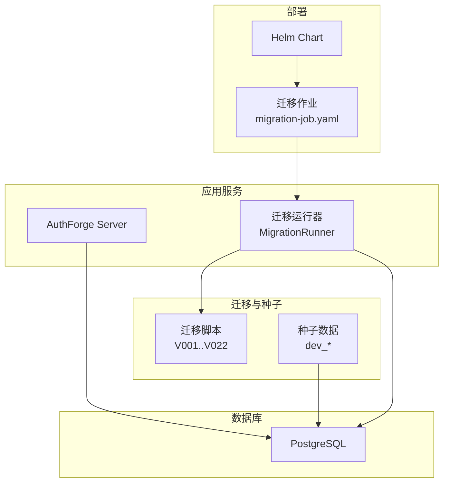
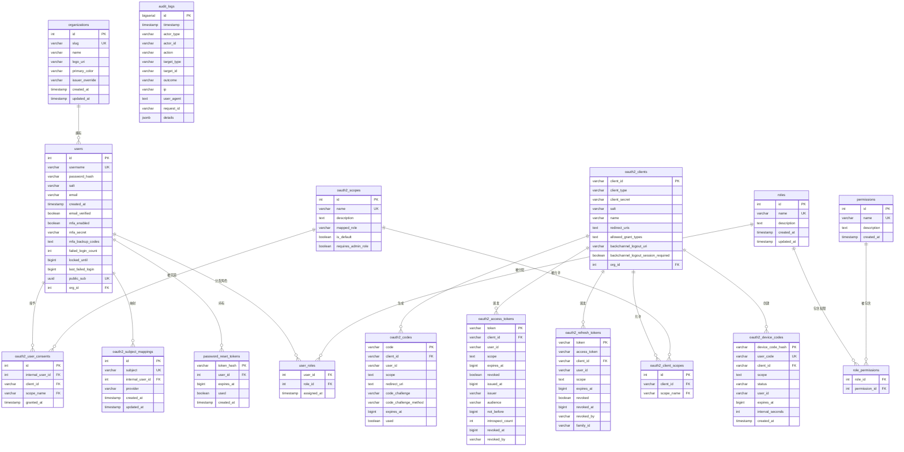
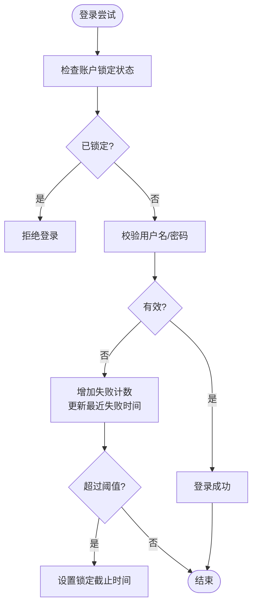
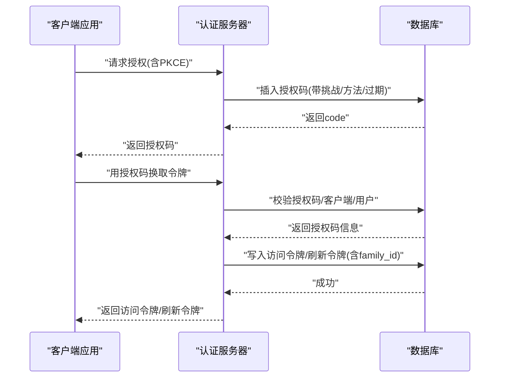
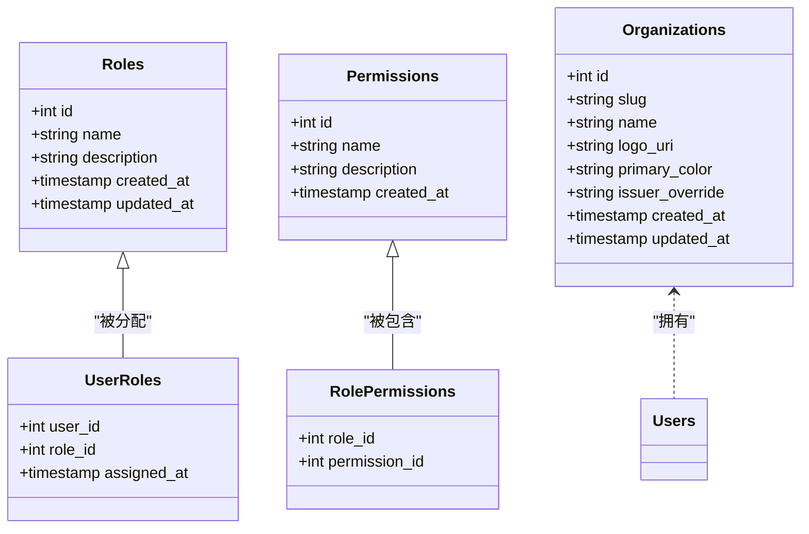
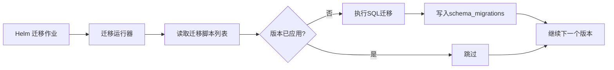

# 数据库设计

<cite>
**本文引用的文件**
- [apps/server/migrations/V001__schema_migrations.sql](file://apps/server/migrations/V001__schema_migrations.sql)
- [apps/server/migrations/V002__oauth2_core.sql](file://apps/server/migrations/V002__oauth2_core.sql)
- [apps/server/migrations/V003__oauth2_core_indexes.sql](file://apps/server/migrations/V003__oauth2_core_indexes.sql)
- [apps/server/migrations/V004__users_table.sql](file://apps/server/migrations/V004__users_table.sql)
- [apps/server/migrations/V005__rbac_schema.sql](file://apps/server/migrations/V005__rbac_schema.sql)
- [apps/server/migrations/V006__oauth2_scopes.sql](file://apps/server/migrations/V006__oauth2_scopes.sql)
- [apps/server/migrations/V007__user_public_sub.sql](file://apps/server/migrations/V007__user_public_sub.sql)
- [apps/server/migrations/V008__refresh_token_family.sql](file://apps/server/migrations/V008__refresh_token_family.sql)
- [apps/server/migrations/V009__password_reset_tokens.sql](file://apps/server/migrations/V009__password_reset_tokens.sql)
- [apps/server/migrations/V010__email_verification.sql](file://apps/server/migrations/V010__email_verification.sql)
- [apps/server/migrations/V011__mfa_support.sql](file://apps/server/migrations/V011__mfa_support.sql)
- [apps/server/migrations/V012__audit_logs.sql](file://apps/server/migrations/V012__audit_logs.sql)
- [apps/server/migrations/V013__account_lockout.sql](file://apps/server/migrations/V013__account_lockout.sql)
- [apps/server/migrations/V014__device_codes.sql](file://apps/server/migrations/V014__device_codes.sql)
- [apps/server/migrations/V015__backchannel_logout.sql](file://apps/server/migrations/V015__backchannel_logout.sql)
- [apps/server/migrations/V017__multi_tenant.sql](file://apps/server/migrations/V017__multi_tenant.sql)
- [apps/server/src/bootstrap/MigrationRunner.cc](file://apps/server/src/bootstrap/MigrationRunner.cc)
- [apps/server/src/bootstrap/MigrationRunner.h](file://apps/server/src/bootstrap/MigrationRunner.h)
- [apps/server/seed/dev_admin_console_client.sql](file://apps/server/seed/dev_admin_console_client.sql)
- [apps/server/seed/dev_admin_user.sql](file://apps/server/seed/dev_admin_user.sql)
- [apps/server/seed/dev_backend_client.sql](file://apps/server/seed/dev_backend_client.sql)
- [apps/server/seed/dev_vue_client.sql](file://apps/server/seed/dev_vue_client.sql)
- [deploy/helm/authforge/migration-job.yaml](file://deploy/helm/authforge/migration-job.yaml)
- [deploy/helm/authforge/postgresql.yaml](file://deploy/helm/authforge/postgresql.yaml)
- [deploy/helm/authforge/configmap.yaml](file://deploy/helm/authforge/configmap.yaml)
- [scripts/setup-database.sh](file://scripts/setup-database.sh)
- [scripts/setup_database.bat](file://scripts/setup_database.bat)
</cite>

## 目录
1. [简介](#简介)
2. [项目结构](#项目结构)
3. [核心组件](#核心组件)
4. [架构总览](#架构总览)
5. [详细组件分析](#详细组件分析)
6. [依赖关系分析](#依赖关系分析)
7. [性能考虑](#性能考虑)
8. [故障排查指南](#故障排查指南)
9. [结论](#结论)
10. [附录](#附录)

## 简介
本文件为 AuthForge 的数据库设计综合文档，聚焦数据模型与持久化策略。内容涵盖：
- 核心表结构与实体关系映射（用户、客户端应用、授权码、访问令牌、刷新令牌、角色权限等）
- 主外键约束、索引优化与数据验证规则
- 数据库迁移管理系统（版本控制、回滚策略、种子数据）
- ORM 映射配置与查询优化策略
- 数据库性能调优建议（连接池、查询优化、缓存）
- 数据备份恢复与灾难恢复方案
- 数据库监控与维护指南

## 项目结构
AuthForge 使用基于 SQL 的版本化迁移脚本管理数据库结构演进，配合 Helm 部署中的迁移任务在启动时执行。种子脚本用于初始化开发环境的基础数据。

图表来源
- [apps/server/src/bootstrap/MigrationRunner.cc:1-200](file://apps/server/src/bootstrap/MigrationRunner.cc#L1-L200)
- [apps/server/src/bootstrap/MigrationRunner.h:1-200](file://apps/server/src/bootstrap/MigrationRunner.h#L1-L200)
- [deploy/helm/authforge/migration-job.yaml:1-200](file://deploy/helm/authforge/migration-job.yaml#L1-L200)
- [apps/server/migrations/V001__schema_migrations.sql:1-10](file://apps/server/migrations/V001__schema_migrations.sql#L1-L10)

章节来源
- [apps/server/migrations/V001__schema_migrations.sql:1-10](file://apps/server/migrations/V001__schema_migrations.sql#L1-L10)
- [deploy/helm/authforge/migration-job.yaml:1-200](file://deploy/helm/authforge/migration-job.yaml#L1-L200)

## 核心组件
本节概述核心数据模型及其职责：
- 用户与身份：用户表、公开主体标识、邮箱验证、MFA、账户锁定
- OAuth2/OIDC：客户端、授权码、访问令牌、刷新令牌、设备码、作用域、用户同意、主题映射
- 权限与多租户：角色、权限、用户-角色、角色-权限、组织
- 审计与安全：审计日志、密码重置令牌

章节来源
- [apps/server/migrations/V004__users_table.sql:1-11](file://apps/server/migrations/V004__users_table.sql#L1-L11)
- [apps/server/migrations/V007__user_public_sub.sql:1-15](file://apps/server/migrations/V007__user_public_sub.sql#L1-L15)
- [apps/server/migrations/V010__email_verification.sql:1-16](file://apps/server/migrations/V010__email_verification.sql#L1-L16)
- [apps/server/migrations/V011__mfa_support.sql:1-7](file://apps/server/migrations/V011__mfa_support.sql#L1-L7)
- [apps/server/migrations/V013__account_lockout.sql:1-7](file://apps/server/migrations/V013__account_lockout.sql#L1-L7)
- [apps/server/migrations/V002__oauth2_core.sql:1-57](file://apps/server/migrations/V002__oauth2_core.sql#L1-L57)
- [apps/server/migrations/V006__oauth2_scopes.sql:1-55](file://apps/server/migrations/V006__oauth2_scopes.sql#L1-L55)
- [apps/server/migrations/V014__device_codes.sql:1-14](file://apps/server/migrations/V014__device_codes.sql#L1-L14)
- [apps/server/migrations/V005__rbac_schema.sql:1-59](file://apps/server/migrations/V005__rbac_schema.sql#L1-L59)
- [apps/server/migrations/V017__multi_tenant.sql:1-23](file://apps/server/migrations/V017__multi_tenant.sql#L1-L23)
- [apps/server/migrations/V012__audit_logs.sql:1-23](file://apps/server/migrations/V012__audit_logs.sql#L1-L23)
- [apps/server/migrations/V009__password_reset_tokens.sql:1-14](file://apps/server/migrations/V009__password_reset_tokens.sql#L1-L14)

## 架构总览
下图展示核心实体之间的关系，包括用户、OAuth2 资源、RBAC 与多租户组织。

图表来源
- [apps/server/migrations/V002__oauth2_core.sql:1-57](file://apps/server/migrations/V002__oauth2_core.sql#L1-L57)
- [apps/server/migrations/V004__users_table.sql:1-11](file://apps/server/migrations/V004__users_table.sql#L1-L11)
- [apps/server/migrations/V005__rbac_schema.sql:1-59](file://apps/server/migrations/V005__rbac_schema.sql#L1-L59)
- [apps/server/migrations/V006__oauth2_scopes.sql:1-55](file://apps/server/migrations/V006__oauth2_scopes.sql#L1-L55)
- [apps/server/migrations/V007__user_public_sub.sql:1-15](file://apps/server/migrations/V007__user_public_sub.sql#L1-L15)
- [apps/server/migrations/V008__refresh_token_family.sql:1-8](file://apps/server/migrations/V008__refresh_token_family.sql#L1-L8)
- [apps/server/migrations/V009__password_reset_tokens.sql:1-14](file://apps/server/migrations/V009__password_reset_tokens.sql#L1-L14)
- [apps/server/migrations/V010__email_verification.sql:1-16](file://apps/server/migrations/V010__email_verification.sql#L1-L16)
- [apps/server/migrations/V011__mfa_support.sql:1-7](file://apps/server/migrations/V011__mfa_support.sql#L1-L7)
- [apps/server/migrations/V012__audit_logs.sql:1-23](file://apps/server/migrations/V012__audit_logs.sql#L1-L23)
- [apps/server/migrations/V013__account_lockout.sql:1-7](file://apps/server/migrations/V013__account_lockout.sql#L1-L7)
- [apps/server/migrations/V014__device_codes.sql:1-14](file://apps/server/migrations/V014__device_codes.sql#L1-L14)
- [apps/server/migrations/V015__backchannel_logout.sql:1-3](file://apps/server/migrations/V015__backchannel_logout.sql#L1-L3)
- [apps/server/migrations/V017__multi_tenant.sql:1-23](file://apps/server/migrations/V017__multi_tenant.sql#L1-L23)

## 详细组件分析

### 用户与身份模块
- 用户表：包含用户名、密码哈希、盐、邮箱、创建时间；扩展字段支持邮箱验证、MFA、失败登录计数、锁定时间与最近失败时间；新增公开主体标识 UUID 用于 OIDC 声明。
- 邮箱验证：独立的验证令牌表，记录哈希、用户、邮箱、过期时间，并建立用户与过期索引。
- MFA：用户表增加是否启用、TOTP 密钥、备份代码（JSON 数组）。
- 账户锁定：通过失败次数与锁定截止时间实现渐进式退避。

图表来源
- [apps/server/migrations/V013__account_lockout.sql:1-7](file://apps/server/migrations/V013__account_lockout.sql#L1-L7)
- [apps/server/migrations/V011__mfa_support.sql:1-7](file://apps/server/migrations/V011__mfa_support.sql#L1-L7)
- [apps/server/migrations/V010__email_verification.sql:1-16](file://apps/server/migrations/V010__email_verification.sql#L1-L16)
- [apps/server/migrations/V004__users_table.sql:1-11](file://apps/server/migrations/V004__users_table.sql#L1-L11)
- [apps/server/migrations/V007__user_public_sub.sql:1-15](file://apps/server/migrations/V007__user_public_sub.sql#L1-L15)

章节来源
- [apps/server/migrations/V004__users_table.sql:1-11](file://apps/server/migrations/V004__users_table.sql#L1-L11)
- [apps/server/migrations/V007__user_public_sub.sql:1-15](file://apps/server/migrations/V007__user_public_sub.sql#L1-L15)
- [apps/server/migrations/V010__email_verification.sql:1-16](file://apps/server/migrations/V010__email_verification.sql#L1-L16)
- [apps/server/migrations/V011__mfa_support.sql:1-7](file://apps/server/migrations/V011__mfa_support.sql#L1-L7)
- [apps/server/migrations/V013__account_lockout.sql:1-7](file://apps/server/migrations/V013__account_lockout.sql#L1-L7)

### OAuth2/OIDC 核心模块
- 客户端表：存储客户端 ID、类型、密钥、重定向 URI、授权类型、反向注销 URI 等。
- 授权码表：记录授权码、客户端、用户、作用域、PKCE 挑战与方法、过期时间、是否使用。
- 访问令牌表：记录令牌、客户端、用户、作用域、过期、撤销信息、签发者、受众、NBF、内省计数等。
- 刷新令牌表：记录令牌、关联访问令牌、客户端、用户、作用域、过期、撤销、家族 ID（用于批量撤销）。
- 设备码表：支持设备授权流程，记录设备码哈希、用户码、状态、轮询间隔等。
- 作用域与同意：作用域定义、客户端-作用域绑定、用户同意记录、主题映射。

图表来源
- [apps/server/migrations/V002__oauth2_core.sql:1-57](file://apps/server/migrations/V002__oauth2_core.sql#L1-L57)
- [apps/server/migrations/V006__oauth2_scopes.sql:1-55](file://apps/server/migrations/V006__oauth2_scopes.sql#L1-L55)
- [apps/server/migrations/V008__refresh_token_family.sql:1-8](file://apps/server/migrations/V008__refresh_token_family.sql#L1-L8)
- [apps/server/migrations/V014__device_codes.sql:1-14](file://apps/server/migrations/V014__device_codes.sql#L1-L14)

章节来源
- [apps/server/migrations/V002__oauth2_core.sql:1-57](file://apps/server/migrations/V002__oauth2_core.sql#L1-L57)
- [apps/server/migrations/V006__oauth2_scopes.sql:1-55](file://apps/server/migrations/V006__oauth2_scopes.sql#L1-L55)
- [apps/server/migrations/V008__refresh_token_family.sql:1-8](file://apps/server/migrations/V008__refresh_token_family.sql#L1-L8)
- [apps/server/migrations/V014__device_codes.sql:1-14](file://apps/server/migrations/V014__device_codes.sql#L1-L14)

### RBAC 与多租户模块
- 角色与权限：角色表、权限表、用户-角色、角色-权限关联表，提供默认角色与权限。
- 多租户：组织表，用户与客户端可归属组织，便于隔离与自定义发行者覆盖。

图表来源
- [apps/server/migrations/V005__rbac_schema.sql:1-59](file://apps/server/migrations/V005__rbac_schema.sql#L1-L59)
- [apps/server/migrations/V017__multi_tenant.sql:1-23](file://apps/server/migrations/V017__multi_tenant.sql#L1-L23)

章节来源
- [apps/server/migrations/V005__rbac_schema.sql:1-59](file://apps/server/migrations/V005__rbac_schema.sql#L1-L59)
- [apps/server/migrations/V017__multi_tenant.sql:1-23](file://apps/server/migrations/V017__multi_tenant.sql#L1-L23)

### 安全与审计模块
- 审计日志：结构化记录操作主体、动作、目标、结果、IP、UA、请求 ID、详情 JSONB，并提供多维度索引。
- 密码重置令牌：一次性哈希令牌，绑定用户与过期时间。

章节来源
- [apps/server/migrations/V012__audit_logs.sql:1-23](file://apps/server/migrations/V012__audit_logs.sql#L1-L23)
- [apps/server/migrations/V009__password_reset_tokens.sql:1-14](file://apps/server/migrations/V009__password_reset_tokens.sql#L1-L14)

## 依赖关系分析
- 迁移系统依赖 schema_migrations 表记录已应用的版本、文件名与校验和，确保幂等与一致性。
- 迁移运行器负责按顺序执行迁移脚本，并在 Helm 迁移作业中作为独立任务运行，保障部署前完成结构变更。
- 种子数据在开发环境中初始化管理员用户与客户端，便于快速联调。

图表来源
- [apps/server/migrations/V001__schema_migrations.sql:1-10](file://apps/server/migrations/V001__schema_migrations.sql#L1-L10)
- [apps/server/src/bootstrap/MigrationRunner.cc:1-200](file://apps/server/src/bootstrap/MigrationRunner.cc#L1-L200)
- [apps/server/src/bootstrap/MigrationRunner.h:1-200](file://apps/server/src/bootstrap/MigrationRunner.h#L1-L200)
- [deploy/helm/authforge/migration-job.yaml:1-200](file://deploy/helm/authforge/migration-job.yaml#L1-L200)

章节来源
- [apps/server/migrations/V001__schema_migrations.sql:1-10](file://apps/server/migrations/V001__schema_migrations.sql#L1-L10)
- [apps/server/src/bootstrap/MigrationRunner.cc:1-200](file://apps/server/src/bootstrap/MigrationRunner.cc#L1-L200)
- [apps/server/src/bootstrap/MigrationRunner.h:1-200](file://apps/server/src/bootstrap/MigrationRunner.h#L1-L200)
- [deploy/helm/authforge/migration-job.yaml:1-200](file://deploy/helm/authforge/migration-job.yaml#L1-L200)

## 性能考虑
- 连接池配置
  - 根据并发量与事务粒度调整连接池大小，避免过多连接导致上下文切换开销。
  - 对长事务与短查询分别评估，必要时拆分读写路径。
- 查询优化
  - 充分利用现有索引：用户、客户端、令牌、审计日志的多维索引。
  - 避免全表扫描：使用精确匹配与范围条件，结合 EXPLAIN 分析执行计划。
  - 分页与投影：仅选择必要列，限制返回行数。
- 缓存策略
  - 将高频只读数据（如角色-权限、作用域配置）缓存至内存或 Redis，降低数据库压力。
  - 对令牌校验热点路径引入短期缓存，注意失效与一致性。
- 令牌与日志清理
  - 定期清理过期令牌与审计日志归档，避免大表影响查询性能。
  - 使用分区或归档策略处理审计日志的高吞吐写入。

[本节为通用指导，不直接分析具体文件]

## 故障排查指南
- 迁移失败
  - 检查 schema_migrations 表中是否存在冲突版本或校验和不一致。
  - 确认迁移脚本幂等性（IF NOT EXISTS、ON CONFLICT DO NOTHING）。
  - 查看迁移运行器日志定位具体失败的 SQL。
- 连接问题
  - 核对数据库连接参数与网络可达性。
  - 检查连接池耗尽与超时配置。
- 锁表与死锁
  - 分析长时间事务与高竞争表（如审计日志、令牌表）。
  - 调整事务边界与批处理大小。
- 性能退化
  - 使用 EXPLAIN ANALYZE 分析慢查询。
  - 检查索引缺失或失效，重建或优化统计信息。

章节来源
- [apps/server/migrations/V001__schema_migrations.sql:1-10](file://apps/server/migrations/V001__schema_migrations.sql#L1-L10)
- [apps/server/src/bootstrap/MigrationRunner.cc:1-200](file://apps/server/src/bootstrap/MigrationRunner.cc#L1-L200)
- [apps/server/src/bootstrap/MigrationRunner.h:1-200](file://apps/server/src/bootstrap/MigrationRunner.h#L1-L200)

## 结论
AuthForge 采用版本化 SQL 迁移与 Helm 作业驱动的执行方式，确保数据库结构的一致性与可追溯性。核心数据模型围绕 OAuth2/OIDC、RBAC 与多租户构建，并通过丰富的索引与约束保证数据完整性与查询效率。建议在部署与运维中重视连接池、查询优化、缓存与日志治理，以支撑高并发与合规审计需求。

[本节为总结，不直接分析具体文件]

## 附录

### 数据模型与约束要点
- 主键与唯一约束
  - 用户：username 唯一；public_sub 唯一 UUID。
  - 客户端：client_id 主键。
  - 令牌与授权码：各自主键；设备码 user_code 唯一。
  - 角色与权限：name 唯一。
  - 组织：slug 唯一。
- 外键关系
  - 授权码、访问令牌、刷新令牌、设备码均引用客户端。
  - 用户同意、主题映射、密码重置令牌引用用户。
  - 用户-角色、角色-权限形成 RBAC 关联。
  - 用户与客户端可归属组织。
- 索引优化
  - 用户、客户端、令牌、审计日志等多维度索引提升查询性能。
  - 刷新令牌家族索引支持批量撤销。
- 数据验证
  - 用户名非空且长度限制。
  - 令牌与授权码过期时间 BIGINT。
  - 审计日志 JSONB 灵活存储细节。

章节来源
- [apps/server/migrations/V002__oauth2_core.sql:1-57](file://apps/server/migrations/V002__oauth2_core.sql#L1-L57)
- [apps/server/migrations/V004__users_table.sql:1-11](file://apps/server/migrations/V004__users_table.sql#L1-L11)
- [apps/server/migrations/V005__rbac_schema.sql:1-59](file://apps/server/migrations/V005__rbac_schema.sql#L1-L59)
- [apps/server/migrations/V006__oauth2_scopes.sql:1-55](file://apps/server/migrations/V006__oauth2_scopes.sql#L1-L55)
- [apps/server/migrations/V007__user_public_sub.sql:1-15](file://apps/server/migrations/V007__user_public_sub.sql#L1-L15)
- [apps/server/migrations/V008__refresh_token_family.sql:1-8](file://apps/server/migrations/V008__refresh_token_family.sql#L1-L8)
- [apps/server/migrations/V009__password_reset_tokens.sql:1-14](file://apps/server/migrations/V009__password_reset_tokens.sql#L1-L14)
- [apps/server/migrations/V010__email_verification.sql:1-16](file://apps/server/migrations/V010__email_verification.sql#L1-L16)
- [apps/server/migrations/V011__mfa_support.sql:1-7](file://apps/server/migrations/V011__mfa_support.sql#L1-L7)
- [apps/server/migrations/V012__audit_logs.sql:1-23](file://apps/server/migrations/V012__audit_logs.sql#L1-L23)
- [apps/server/migrations/V013__account_lockout.sql:1-7](file://apps/server/migrations/V013__account_lockout.sql#L1-L7)
- [apps/server/migrations/V014__device_codes.sql:1-14](file://apps/server/migrations/V014__device_codes.sql#L1-L14)
- [apps/server/migrations/V015__backchannel_logout.sql:1-3](file://apps/server/migrations/V015__backchannel_logout.sql#L1-L3)
- [apps/server/migrations/V017__multi_tenant.sql:1-23](file://apps/server/migrations/V017__multi_tenant.sql#L1-L23)

### 迁移管理与回滚策略
- 版本控制
  - 使用 schema_migrations 表记录版本、文件名与校验和，确保幂等执行。
  - 迁移脚本命名规范 VNNN__描述.sql，便于排序与识别。
- 回滚策略
  - 优先编写可逆迁移；不可逆变更需准备回滚脚本与数据修复方案。
  - 在生产环境执行前进行预演与备份。
- 执行方式
  - 本地通过脚本工具执行迁移与种子数据。
  - 生产通过 Helm 迁移作业在 Pod 启动前执行。

章节来源
- [apps/server/migrations/V001__schema_migrations.sql:1-10](file://apps/server/migrations/V001__schema_migrations.sql#L1-L10)
- [scripts/setup-database.sh:1-200](file://scripts/setup-database.sh#L1-L200)
- [scripts/setup_database.bat:1-200](file://scripts/setup_database.bat#L1-L200)
- [deploy/helm/authforge/migration-job.yaml:1-200](file://deploy/helm/authforge/migration-job.yaml#L1-L200)

### 种子数据与环境初始化
- 开发种子
  - 管理员用户、后端客户端、Vue 客户端、控制台客户端等基础数据。
- 用途
  - 快速搭建可运行的开发环境，减少手动配置成本。

章节来源
- [apps/server/seed/dev_admin_user.sql:1-200](file://apps/server/seed/dev_admin_user.sql#L1-L200)
- [apps/server/seed/dev_backend_client.sql:1-200](file://apps/server/seed/dev_backend_client.sql#L1-L200)
- [apps/server/seed/dev_vue_client.sql:1-200](file://apps/server/seed/dev_vue_client.sql#L1-L200)
- [apps/server/seed/dev_admin_console_client.sql:1-200](file://apps/server/seed/dev_admin_console_client.sql#L1-L200)

### ORM 映射与查询优化建议
- ORM 映射
  - 将核心实体映射到领域模型，保持与数据库结构同步。
  - 使用只读视图或物化视图简化复杂查询。
- 查询优化
  - 合理使用 JOIN 与子查询，避免 N+1 问题。
  - 对高频查询建立覆盖索引。
  - 使用分页与延迟加载减少数据传输。

[本节为通用指导，不直接分析具体文件]

### 备份恢复与灾难恢复
- 备份策略
  - 定期全量备份与增量 WAL 归档，保留足够历史窗口。
  - 异地容灾与加密存储。
- 恢复演练
  - 定期演练恢复流程，验证 RTO/RPO 目标。
  - 针对误删与损坏场景制定专项预案。

[本节为通用指导，不直接分析具体文件]

### 监控与维护
- 监控指标
  - 连接数、慢查询、锁等待、磁盘使用率、WAL 增长。
- 维护任务
  - 定期 VACUUM/ANALYZE，重建索引碎片。
  - 审计日志归档与清理。
  - 证书与密钥轮换。

章节来源
- [apps/server/migrations/V012__audit_logs.sql:1-23](file://apps/server/migrations/V012__audit_logs.sql#L1-L23)
- [deploy/helm/authforge/postgresql.yaml:1-200](file://deploy/helm/authforge/postgresql.yaml#L1-L200)
- [deploy/helm/authforge/configmap.yaml:1-200](file://deploy/helm/authforge/configmap.yaml#L1-L200)