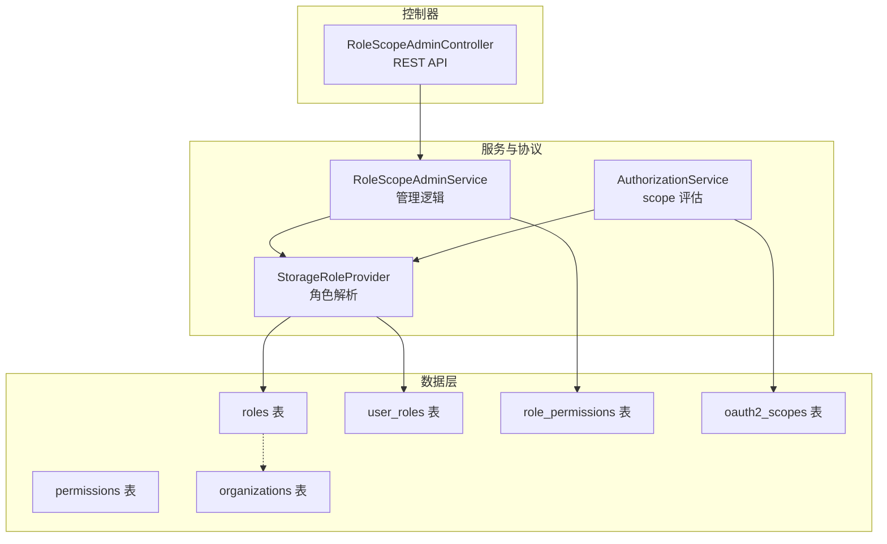
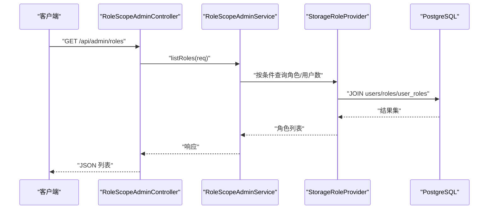
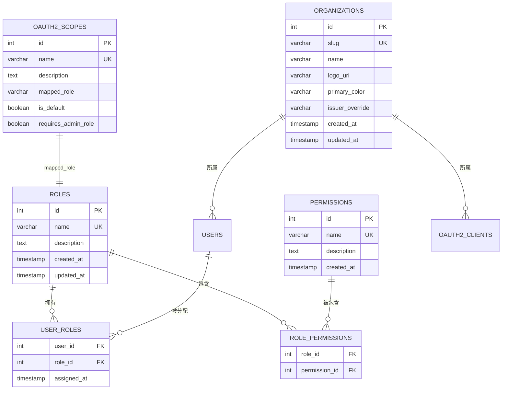
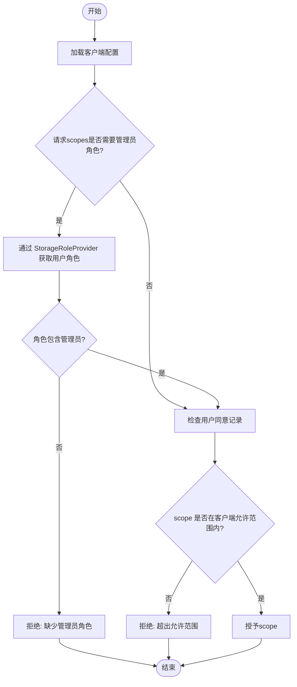
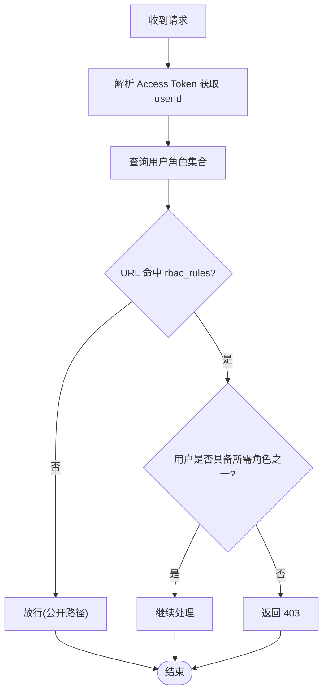
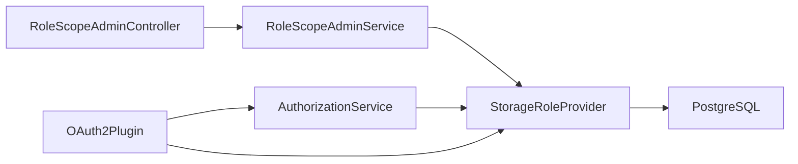
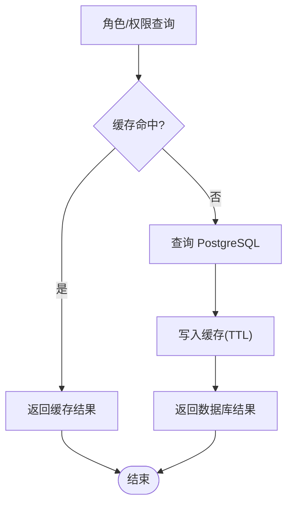

# RBAC权限表

<cite>
**本文引用的文件**
- [V005__rbac_schema.sql](file://apps/server/migrations/V005__rbac_schema.sql)
- [V006__oauth2_scopes.sql](file://apps/server/migrations/V006__oauth2_scopes.sql)
- [V017__multi_tenant.sql](file://apps/server/migrations/V017__multi_tenant.sql)
- [rbac-guide.md](file://docs/backend/rbac-guide.md)
- [data-persistence.md](file://docs/backend/data-persistence.md)
- [RoleScopeAdminController.cc](file://libs/drogon/src/controllers/RoleScopeAdminController.cc)
- [AuthorizationService.cc](file://libs/oauth2/src/protocol/AuthorizationService.cc)
- [OAuth2Plugin.cc](file://libs/drogon/src/plugin/OAuth2Plugin.cc)
- [Roles.cc](file://libs/storage-postgres/src/models/Roles.cc)
</cite>

## 目录
1. [简介](#简介)
2. [项目结构](#项目结构)
3. [核心组件](#核心组件)
4. [架构总览](#架构总览)
5. [详细组件分析](#详细组件分析)
6. [依赖关系分析](#依赖关系分析)
7. [性能与缓存](#性能与缓存)
8. [故障排查指南](#故障排查指南)
9. [结论](#结论)
10. [附录](#附录)

## 简介
本文件聚焦 AuthForge 的基于角色的访问控制（RBAC）权限系统，围绕角色、权限、用户角色关联、角色权限关联等核心实体展开，说明数据库设计、作用域模型、OAuth2 scopes 与 RBAC 的映射关系，以及授权决策流程、权限继承与冲突解决策略、缓存与性能优化方案。文档同时给出权限决策流程图与权限矩阵表示，便于非技术读者理解并指导工程实践。

## 项目结构
RBAC 相关能力由迁移脚本定义数据模型，服务层通过仓储与适配器接入存储，控制器暴露管理接口，OAuth2 协议层在授权时结合角色进行 scope 校验。

图表来源
- [V005__rbac_schema.sql:1-59](file://apps/server/migrations/V005__rbac_schema.sql#L1-L59)
- [V006__oauth2_scopes.sql:1-55](file://apps/server/migrations/V006__oauth2_scopes.sql#L1-L55)
- [V017__multi_tenant.sql:1-23](file://apps/server/migrations/V017__multi_tenant.sql#L1-L23)
- [AuthorizationService.cc:54-83](file://libs/oauth2/src/protocol/AuthorizationService.cc#L54-L83)
- [OAuth2Plugin.cc:142-162](file://libs/drogon/src/plugin/OAuth2Plugin.cc#L142-L162)
- [RoleScopeAdminController.cc:100-184](file://libs/drogon/src/controllers/RoleScopeAdminController.cc#L100-L184)

章节来源
- [V005__rbac_schema.sql:1-59](file://apps/server/migrations/V005__rbac_schema.sql#L1-L59)
- [V006__oauth2_scopes.sql:1-55](file://apps/server/migrations/V006__oauth2_scopes.sql#L1-L55)
- [V017__multi_tenant.sql:1-23](file://apps/server/migrations/V017__multi_tenant.sql#L1-L23)
- [RoleScopeAdminController.cc:100-184](file://libs/drogon/src/controllers/RoleScopeAdminController.cc#L100-L184)
- [AuthorizationService.cc:54-83](file://libs/oauth2/src/protocol/AuthorizationService.cc#L54-L83)
- [OAuth2Plugin.cc:142-162](file://libs/drogon/src/plugin/OAuth2Plugin.cc#L142-L162)

## 核心组件
- 角色表 roles：定义系统中的角色集合，如 admin、user，支持描述信息与时间戳。
- 权限表 permissions：定义细粒度能力，如 user:read、user:write、admin:access。
- 用户角色关联表 user_roles：将用户与其角色建立多对多关系，支持级联删除与索引优化。
- 角色权限关联表 role_permissions：将角色与权限建立多对多关系，支撑“角色即权限集合”的语义。
- OAuth2 scopes 表 oauth2_scopes：声明 OAuth2 范围，并可映射到角色、标记是否默认或需要管理员角色。
- 组织表 organizations：多租户上下文，用户与客户端可归属组织，为后续组织级权限提供基础。

章节来源
- [V005__rbac_schema.sql:1-59](file://apps/server/migrations/V005__rbac_schema.sql#L1-L59)
- [V006__oauth2_scopes.sql:1-55](file://apps/server/migrations/V006__oauth2_scopes.sql#L1-L55)
- [V017__multi_tenant.sql:1-23](file://apps/server/migrations/V017__multi_tenant.sql#L1-L23)

## 架构总览
RBAC 与 OAuth2 协同工作：
- 登录/鉴权后，系统根据 subject 解析内部用户 ID，并通过 StorageRoleProvider 获取用户角色集合。
- AuthorizationService 在 /authorize 流程中评估请求 scopes，必要时检查是否需要管理员角色，并结合用户同意记录决定最终授予范围。
- 管理端通过 RoleScopeAdminController 暴露 REST API，调用 RoleScopeAdminService 完成角色与 scope 的增删改查。

图表来源
- [RoleScopeAdminController.cc:100-108](file://libs/drogon/src/controllers/RoleScopeAdminController.cc#L100-L108)
- [OAuth2Plugin.cc:142-162](file://libs/drogon/src/plugin/OAuth2Plugin.cc#L142-L162)

章节来源
- [RoleScopeAdminController.cc:100-184](file://libs/drogon/src/controllers/RoleScopeAdminController.cc#L100-L184)
- [OAuth2Plugin.cc:142-162](file://libs/drogon/src/plugin/OAuth2Plugin.cc#L142-L162)

## 详细组件分析

### 数据模型与关系
- roles(id, name, description, created_at, updated_at)
- permissions(id, name, description, created_at)
- user_roles(user_id, role_id, assigned_at)，主键 (user_id, role_id)
- role_permissions(role_id, permission_id)，主键 (role_id, permission_id)
- oauth2_scopes(id, name, description, mapped_role, is_default, requires_admin_role)
- organizations(id, slug, name, logo_uri, primary_color, issuer_override, created_at, updated_at)
- users.org_id、oauth2_clients.org_id 用于多租户隔离

图表来源
- [V005__rbac_schema.sql:1-59](file://apps/server/migrations/V005__rbac_schema.sql#L1-L59)
- [V006__oauth2_scopes.sql:1-55](file://apps/server/migrations/V006__oauth2_scopes.sql#L1-L55)
- [V017__multi_tenant.sql:1-23](file://apps/server/migrations/V017__multi_tenant.sql#L1-L23)

章节来源
- [V005__rbac_schema.sql:1-59](file://apps/server/migrations/V005__rbac_schema.sql#L1-L59)
- [V006__oauth2_scopes.sql:1-55](file://apps/server/migrations/V006__oauth2_scopes.sql#L1-L55)
- [V017__multi_tenant.sql:1-23](file://apps/server/migrations/V017__multi_tenant.sql#L1-L23)

### 三重作用域控制模型（系统级、组织级、资源级）
- 系统级：全局规则与内置角色（如 admin、user），通过 roles 与 role_permissions 统一治理；OAuth2 scopes 中的 requires_admin_role 字段体现系统级保护。
- 组织级：通过 organizations 表与 users.org_id、oauth2_clients.org_id 实现租户隔离；未来可在 role_permissions 或扩展表中加入 org_id 以限定权限作用域。
- 资源级：当前代码库未显式实现资源级 RBAC（如按具体资源实例授权），可通过扩展 role_permissions 增加资源标识与操作类型，或在业务层结合领域模型实现。

建议落地步骤：
- 在 role_permissions 或新增表中加入 org_id 列，限制角色权限的作用组织。
- 在资源访问路径中携带 org_id，并在过滤器或服务层校验资源归属。
- 对敏感资源引入细粒度权限（如 resource:read/write/delete）。

章节来源
- [V017__multi_tenant.sql:1-23](file://apps/server/migrations/V017__multi_tenant.sql#L1-L23)
- [V005__rbac_schema.sql:1-59](file://apps/server/migrations/V005__rbac_schema.sql#L1-L59)

### OAuth2 scopes 与 RBAC 的映射
- oauth2_scopes.mapped_role：将 scope 映射到角色，例如 openid/profile/email 映射到 user，admin scope 映射到 admin。
- oauth2_scopes.requires_admin_role：当请求包含此类 scope 时，需验证当前用户具备管理员角色。
- AuthorizationService.evaluateScopes：在授权流程中读取客户端允许 scope、用户同意记录，并根据 requires_admin_role 与角色提供者返回的角色集合判定有效性。

图表来源
- [V006__oauth2_scopes.sql:1-55](file://apps/server/migrations/V006__oauth2_scopes.sql#L1-L55)
- [AuthorizationService.cc:54-83](file://libs/oauth2/src/protocol/AuthorizationService.cc#L54-L83)
- [OAuth2Plugin.cc:142-162](file://libs/drogon/src/plugin/OAuth2Plugin.cc#L142-L162)

章节来源
- [V006__oauth2_scopes.sql:1-55](file://apps/server/migrations/V006__oauth2_scopes.sql#L1-L55)
- [AuthorizationService.cc:54-83](file://libs/oauth2/src/protocol/AuthorizationService.cc#L54-L83)
- [OAuth2Plugin.cc:142-162](file://libs/drogon/src/plugin/OAuth2Plugin.cc#L142-L162)

### 权限继承、组合与冲突解决
- 继承：通过角色层次（如 admin 继承 user 的能力）可实现继承；当前 schema 未强制层级，但可通过命名约定与默认分配实现（如 admin 自动获得所有权限）。
- 组合：用户可拥有多个角色，权限为各角色权限的并集；role_permissions 的多对多关系天然支持组合。
- 冲突解决：当前未实现显式的 deny 覆盖 allow 机制；若需精细化控制，建议在 role_permissions 中引入优先级或 deny 标记，并在决策引擎中优先处理 deny。

章节来源
- [V005__rbac_schema.sql:1-59](file://apps/server/migrations/V005__rbac_schema.sql#L1-L59)

### 权限决策流程（API 访问）
- 登录/注册后，用户默认获得 user 角色；管理员可通过 SQL 或管理界面授予额外角色。
- 请求进入时，AuthorizationFilter 解析 Token 获取 userId，查询用户角色，匹配 rbac_rules（URL 正则 + 所需角色 OR 逻辑），决定是否放行或返回 403。

图表来源
- [rbac-guide.md:41-69](file://docs/backend/rbac-guide.md#L41-L69)

章节来源
- [rbac-guide.md:41-69](file://docs/backend/rbac-guide.md#L41-L69)

### 权限矩阵表示
以下为简化示例，展示角色与权限的对应关系（实际以数据库为准）：

- admin：user:read、user:write、user:delete、admin:access
- user：user:read

使用场景：
- 前端菜单与按钮可见性控制。
- 后端接口级权限校验。
- 审计日志中记录操作主体与权限来源。

章节来源
- [V005__rbac_schema.sql:35-58](file://apps/server/migrations/V005__rbac_schema.sql#L35-L58)

### 管理接口与职责
- RoleScopeAdminController：提供 /api/admin/roles 与 /api/admin/scopes 的 CRUD 接口，作为薄 HTTP 适配层。
- RoleScopeAdminService：封装角色与 scope 的管理逻辑，负责数据组装与校验。
- 这些接口受认证与角色保护，确保只有授权管理员可操作。

章节来源
- [RoleScopeAdminController.cc:100-184](file://libs/drogon/src/controllers/RoleScopeAdminController.cc#L100-L184)

## 依赖关系分析
- 控制器依赖服务层，服务层依赖角色提供者与存储仓库。
- AuthorizationService 依赖 StorageRoleProvider 获取角色，依赖客户端与同意仓储进行 scope 评估。
- 插件初始化时将仓储与适配器装配到服务中，形成清晰的依赖注入链。

图表来源
- [RoleScopeAdminController.cc:100-184](file://libs/drogon/src/controllers/RoleScopeAdminController.cc#L100-L184)
- [AuthorizationService.cc:54-83](file://libs/oauth2/src/protocol/AuthorizationService.cc#L54-L83)
- [OAuth2Plugin.cc:142-162](file://libs/drogon/src/plugin/OAuth2Plugin.cc#L142-L162)

章节来源
- [RoleScopeAdminController.cc:100-184](file://libs/drogon/src/controllers/RoleScopeAdminController.cc#L100-L184)
- [AuthorizationService.cc:54-83](file://libs/oauth2/src/protocol/AuthorizationService.cc#L54-L83)
- [OAuth2Plugin.cc:142-162](file://libs/drogon/src/plugin/OAuth2Plugin.cc#L142-L162)

## 性能与缓存
- 数据库索引：user_roles、role_permissions 已建立常用索引，提升角色与权限查询效率。
- 缓存策略：
  - Redis 用于 OAuth2 相关实体的缓存（client、token、code、refresh token），TTL 自动过期。
  - 角色与权限查询可考虑在应用层加缓存（如内存 CacheMap），减少数据库压力。
- 清理机制：定期清理过期授权码与令牌，避免数据膨胀。

图表来源
- [data-persistence.md:94-189](file://docs/backend/data-persistence.md#L94-L189)
- [V005__rbac_schema.sql:31-34](file://apps/server/migrations/V005__rbac_schema.sql#L31-L34)

章节来源
- [data-persistence.md:94-189](file://docs/backend/data-persistence.md#L94-L189)
- [V005__rbac_schema.sql:31-34](file://apps/server/migrations/V005__rbac_schema.sql#L31-L34)

## 故障排查指南
- 无法访问管理接口：
  - 确认用户具备所需角色（如 admin）。
  - 检查 rbac_rules 配置与 URL 正则匹配。
- 授权 scope 被拒绝：
  - 检查 oauth2_scopes.requires_admin_role 与用户角色是否包含管理员。
  - 检查用户同意记录是否存在且有效。
- 角色/权限查询缓慢：
  - 确认 user_roles、role_permissions 索引存在。
  - 考虑引入应用层缓存以减少数据库负载。

章节来源
- [rbac-guide.md:41-69](file://docs/backend/rbac-guide.md#L41-L69)
- [V006__oauth2_scopes.sql:1-55](file://apps/server/migrations/V006__oauth2_scopes.sql#L1-L55)
- [V005__rbac_schema.sql:31-34](file://apps/server/migrations/V005__rbac_schema.sql#L31-L34)

## 结论
AuthForge 的 RBAC 系统以 roles、permissions、user_roles、role_permissions 为核心，结合 oauth2_scopes 的映射与 requires_admin_role 标志，实现了从系统级到组织级的权限治理基础。当前版本侧重角色与权限的集合化授权，资源级细粒度授权可通过扩展表结构与决策引擎进一步实现。配合索引与缓存策略，系统在可读性与性能上具备良好平衡。

## 附录
- 角色与权限查询示例（仅示意）：
  - 查询某角色的权限集合：通过 role_permissions JOIN permissions。
  - 查询某用户的角色集合：通过 user_roles JOIN roles。
- 参考实现位置：
  - 角色权限查询：[Roles.cc:1211-1237](file://libs/storage-postgres/src/models/Roles.cc#L1211-L1237)

章节来源
- [Roles.cc:1211-1237](file://libs/storage-postgres/src/models/Roles.cc#L1211-L1237)