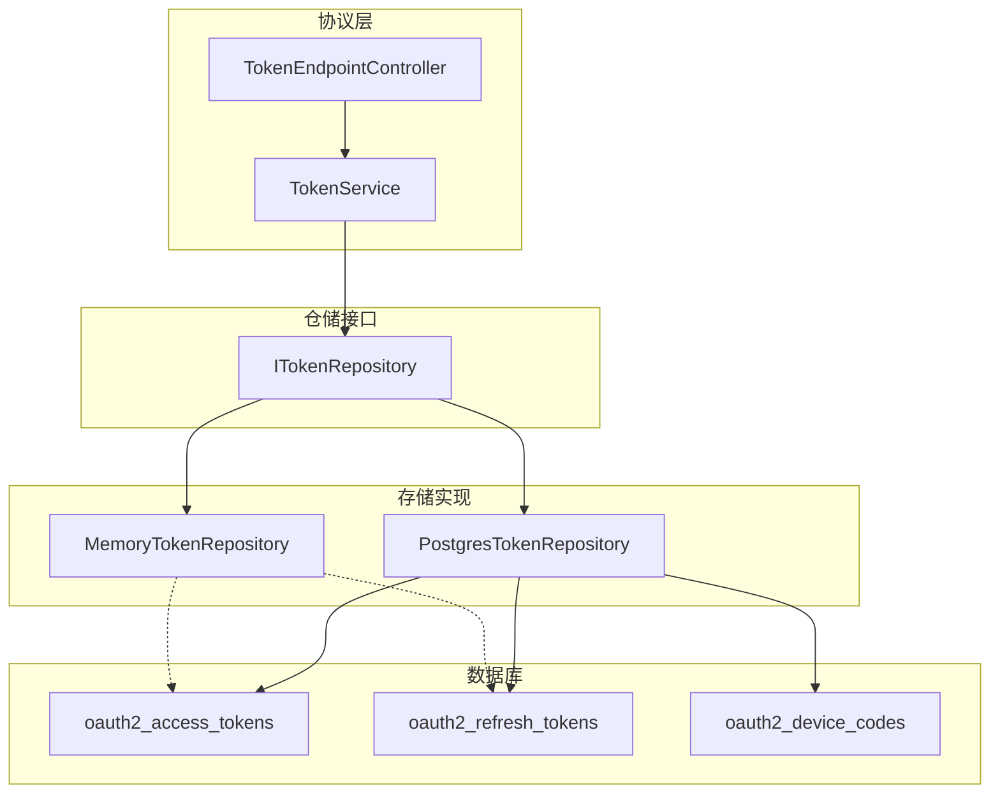
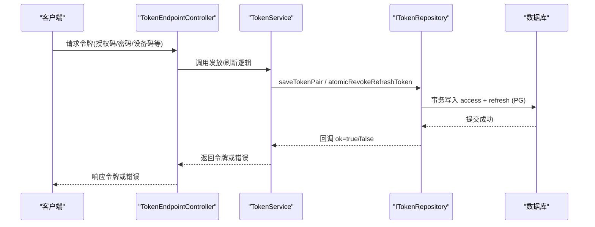
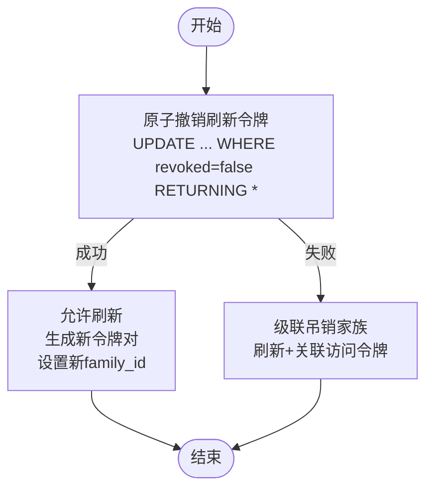
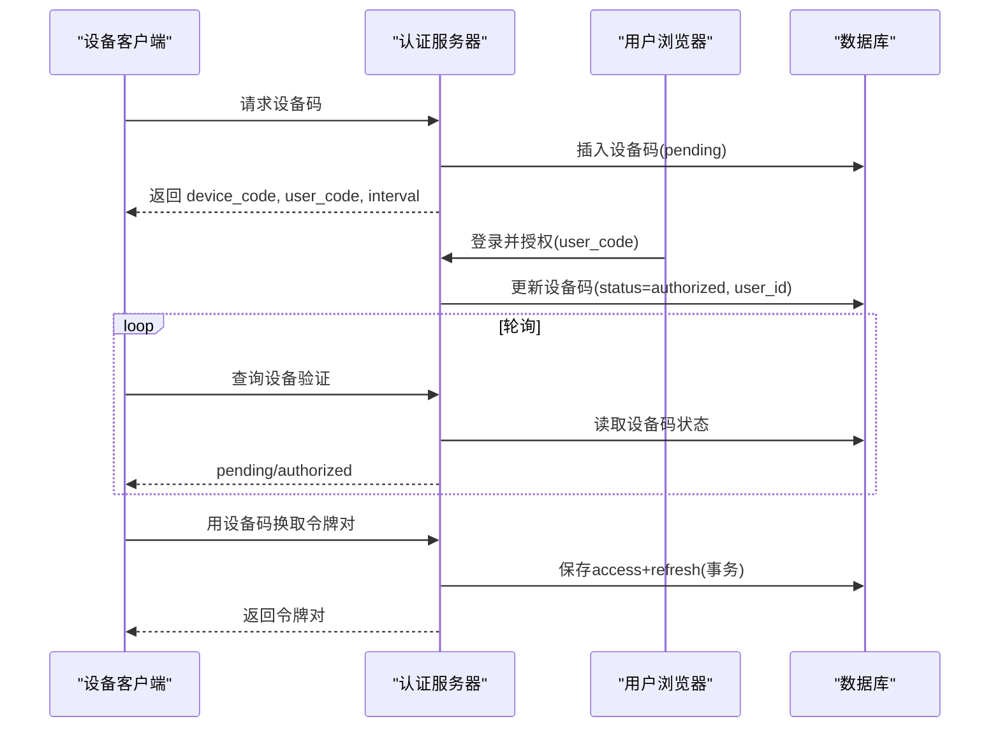
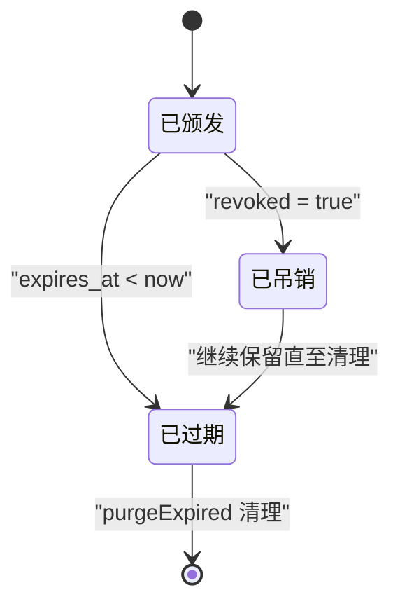
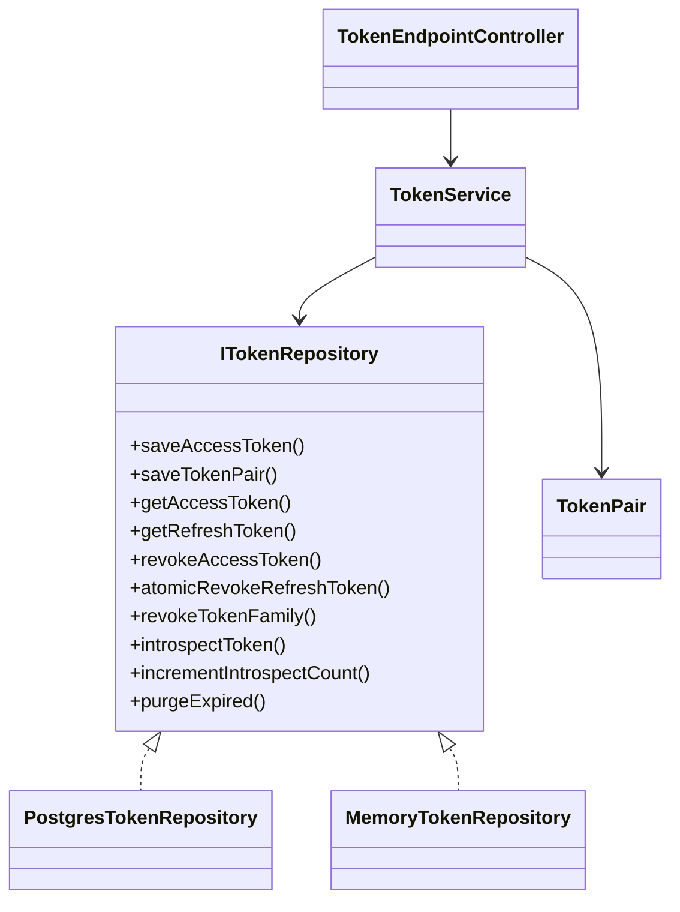
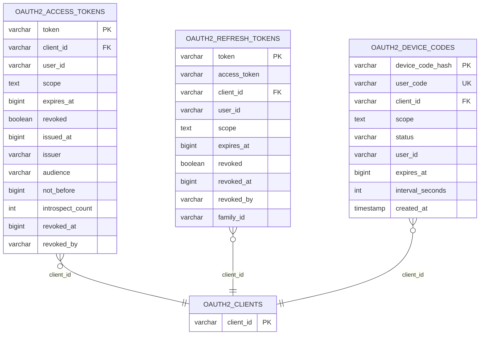

# 令牌管理表

<cite>
**本文引用的文件**
- [V002__oauth2_core.sql](file://apps/server/migrations/V002__oauth2_core.sql)
- [V008__refresh_token_family.sql](file://apps/server/migrations/V008__refresh_token_family.sql)
- [V014__device_codes.sql](file://apps/server/migrations/V014__device_codes.sql)
- [PostgresTokenRepository.cc](file://libs/storage-postgres/src/PostgresTokenRepository.cc)
- [MemoryTokenRepository.cc](file://libs/storage-memory/src/MemoryTokenRepository.cc)
- [ITokenRepository.h](file://libs/oauth2/include/authforge/oauth2/repository/ITokenRepository.h)
- [TokenPair.h](file://libs/oauth2/include/authforge/oauth2/model/TokenPair.h)
- [Oauth2AccessTokens.h](file://libs/storage-postgres/include/authforge/storage/postgres/models/Oauth2AccessTokens.h)
- [TokenEndpointController.cc](file://libs/drogon/src/controllers/TokenEndpointController.cc)
- [TokenService.cc](file://libs/oauth2/src/protocol/TokenService.cc)
</cite>

## 目录
1. [简介](#简介)
2. [项目结构](#项目结构)
3. [核心组件](#核心组件)
4. [架构总览](#架构总览)
5. [详细组件分析](#详细组件分析)
6. [依赖关系分析](#依赖关系分析)
7. [性能考虑](#性能考虑)
8. [故障排查指南](#故障排查指南)
9. [结论](#结论)
10. [附录](#附录)

## 简介
本文件聚焦 AuthForge 的令牌管理相关数据库表与实现，覆盖访问令牌、刷新令牌、设备代码等实体的结构设计、生命周期管理、令牌家族机制、设备授权流程的数据模型，以及撤销、轮换、批量管理的数据库支持。同时提供令牌流转时序图与状态转换图，并给出安全与性能优化建议。

## 项目结构
令牌相关数据持久化由迁移脚本定义表结构，并由存储层（PostgreSQL/内存）实现统一接口 ITokenRepository；协议层通过 TokenService 与 TokenEndpointController 驱动令牌发放、刷新、撤销等流程。

图表来源
- [PostgresTokenRepository.cc:77-227](file://libs/storage-postgres/src/PostgresTokenRepository.cc#L77-L227)
- [MemoryTokenRepository.cc:26-137](file://libs/storage-memory/src/MemoryTokenRepository.cc#L26-L137)
- [ITokenRepository.h:36-62](file://libs/oauth2/include/authforge/oauth2/repository/ITokenRepository.h#L36-L62)
- [TokenEndpointController.cc:1182-1222](file://libs/drogon/src/controllers/TokenEndpointController.cc#L1182-L1222)
- [TokenService.cc:342-365](file://libs/oauth2/src/protocol/TokenService.cc#L342-L365)

章节来源
- [V002__oauth2_core.sql:1-57](file://apps/server/migrations/V002__oauth2_core.sql#L1-L57)
- [V008__refresh_token_family.sql:1-8](file://apps/server/migrations/V008__refresh_token_family.sql#L1-L8)
- [V014__device_codes.sql:1-14](file://apps/server/migrations/V014__device_codes.sql#L1-L14)

## 核心组件
- 访问令牌表 oauth2_access_tokens：承载短期访问凭证，包含客户端绑定、用户标识、作用域、有效期、颁发时间、签发者、受众、不可早于时间、审计计数、吊销标记及审计字段。
- 刷新令牌表 oauth2_refresh_tokens：承载长期刷新凭证，关联对应访问令牌哈希值，支持家族 family_id 用于复用检测与级联吊销。
- 设备代码表 oauth2_device_codes：承载设备授权流程中的临时凭证，含用户码、客户端、作用域、状态、过期时间、轮询间隔等。
- 令牌对聚合 TokenPair：保证 access token 与 refresh token 成对一致性与一致性约束。
- 仓储接口 ITokenRepository：抽象令牌存取、原子撤销、家族级联撤销、令牌检查（introspection）、过期清理等能力。
- 存储实现 PostgresTokenRepository 与 MemoryTokenRepository：分别基于 PostgreSQL 与内存实现上述接口。

章节来源
- [V002__oauth2_core.sql:28-56](file://apps/server/migrations/V002__oauth2_core.sql#L28-L56)
- [V008__refresh_token_family.sql:1-8](file://apps/server/migrations/V008__refresh_token_family.sql#L1-L8)
- [V014__device_codes.sql:1-14](file://apps/server/migrations/V014__device_codes.sql#L1-L14)
- [TokenPair.h:25-91](file://libs/oauth2/include/authforge/oauth2/model/TokenPair.h#L25-L91)
- [ITokenRepository.h:36-62](file://libs/oauth2/include/authforge/oauth2/repository/ITokenRepository.h#L36-L62)
- [PostgresTokenRepository.cc:27-227](file://libs/storage-postgres/src/PostgresTokenRepository.cc#L27-L227)
- [MemoryTokenRepository.cc:26-137](file://libs/storage-memory/src/MemoryTokenRepository.cc#L26-L137)

## 架构总览
令牌从协议层下发到存储层，最终落库至三张核心表。刷新令牌的家族机制在撤销时触发级联吊销，确保并发安全与一致性。设备代码表支撑无交互或受限输入场景的设备授权流程。

图表来源
- [TokenEndpointController.cc:1182-1222](file://libs/drogon/src/controllers/TokenEndpointController.cc#L1182-L1222)
- [TokenService.cc:342-365](file://libs/oauth2/src/protocol/TokenService.cc#L342-L365)
- [PostgresTokenRepository.cc:77-227](file://libs/storage-postgres/src/PostgresTokenRepository.cc#L77-L227)

## 详细组件分析

### 访问令牌表（oauth2_access_tokens）
- 主键：token（已哈希存储）
- 关键字段
  - client_id：客户端绑定
  - user_id：用户绑定
  - scope：作用域集合
  - expires_at：过期时间戳
  - revoked：是否吊销
  - issued_at：颁发时间
  - issuer：签发者（发行时注入）
  - audience：受众
  - not_before：不可早于时间
  - introspect_count：被检查次数
  - revoked_at / revoked_by：吊销审计
- 索引：按 token 主键查询
- 用途：资源访问的短期凭证，支持鉴权与审计

章节来源
- [V002__oauth2_core.sql:28-43](file://apps/server/migrations/V002__oauth2_core.sql#L28-L43)
- [Oauth2AccessTokens.h:43-232](file://libs/storage-postgres/include/authforge/storage/postgres/models/Oauth2AccessTokens.h#L43-L232)
- [PostgresTokenRepository.cc:27-75](file://libs/storage-postgres/src/PostgresTokenRepository.cc#L27-L75)

### 刷新令牌表（oauth2_refresh_tokens）
- 主键：token（已哈希存储）
- 关键字段
  - access_token：指向对应访问令牌的哈希值
  - client_id / user_id / scope：与访问令牌一致
  - expires_at：过期时间
  - revoked：是否吊销
  - revoked_at / revoked_by：吊销审计
  - family_id：令牌家族标识，用于复用检测与级联吊销
- 索引：family_id 索引以支持批量吊销
- 用途：长期刷新凭证，配合原子撤销实现防重放与家族级联吊销

章节来源
- [V002__oauth2_core.sql:45-56](file://apps/server/migrations/V002__oauth2_core.sql#L45-L56)
- [V008__refresh_token_family.sql:1-8](file://apps/server/migrations/V008__refresh_token_family.sql#L1-L8)
- [PostgresTokenRepository.cc:270-361](file://libs/storage-postgres/src/PostgresTokenRepository.cc#L270-L361)
- [PostgresTokenRepository.cc:408-496](file://libs/storage-postgres/src/PostgresTokenRepository.cc#L408-L496)

### 设备代码表（oauth2_device_codes）
- 主键：device_code_hash（设备码哈希）
- 关键字段
  - user_code：用户可见短码（唯一）
  - client_id：客户端绑定
  - scope：作用域
  - status：pending/authorized/expired 等
  - user_id：授权后填充
  - expires_at：过期时间
  - interval_seconds：轮询间隔
  - created_at：创建时间
- 索引：user_code、expires_at
- 用途：设备授权流程（Device Authorization Grant）的中间态存储

章节来源
- [V014__device_codes.sql:1-14](file://apps/server/migrations/V014__device_codes.sql#L1-L14)

### 令牌家族机制与刷新令牌轮换
- 家族生成：每次授权码兑换或刷新时生成新的 family_id，同一授权码派生的多个刷新令牌共享该家族。
- 原子撤销：使用“更新且返回”的 CAS 语义，若失败则判定为重用攻击，触发家族级联吊销。
- 级联吊销：先吊销家族内所有刷新令牌，再吊销与之关联的访问令牌。
- 轮换策略：刷新成功后旧刷新令牌立即失效，新刷新令牌携带新 family_id，避免历史令牌被重用。

图表来源
- [PostgresTokenRepository.cc:408-496](file://libs/storage-postgres/src/PostgresTokenRepository.cc#L408-L496)
- [TokenService.cc:342-365](file://libs/oauth2/src/protocol/TokenService.cc#L342-L365)

章节来源
- [PostgresTokenRepository.cc:408-496](file://libs/storage-postgres/src/PostgresTokenRepository.cc#L408-L496)
- [TokenService.cc:342-365](file://libs/oauth2/src/protocol/TokenService.cc#L342-L365)

### 设备授权流程数据模型与时序
- 数据模型：设备码表记录待授权状态，用户登录后将状态改为已授权并回填 user_id。
- 时序：客户端获取设备码与用户码 -> 用户浏览器登录并授权 -> 客户端轮询设备验证端点 -> 授权通过后换取令牌对。

图表来源
- [V014__device_codes.sql:1-14](file://apps/server/migrations/V014__device_codes.sql#L1-L14)
- [PostgresTokenRepository.cc:77-227](file://libs/storage-postgres/src/PostgresTokenRepository.cc#L77-L227)
- [TokenEndpointController.cc:1182-1222](file://libs/drogon/src/controllers/TokenEndpointController.cc#L1182-L1222)

章节来源
- [V014__device_codes.sql:1-14](file://apps/server/migrations/V014__device_codes.sql#L1-L14)
- [PostgresTokenRepository.cc:77-227](file://libs/storage-postgres/src/PostgresTokenRepository.cc#L77-L227)
- [TokenEndpointController.cc:1182-1222](file://libs/drogon/src/controllers/TokenEndpointController.cc#L1182-L1222)

### 令牌类型、有效期、作用域、客户端绑定
- 令牌类型：访问令牌（短期）、刷新令牌（长期）、设备码（临时）。
- 有效期：expires_at 控制过期；issued_at、not_before 控制生效窗口。
- 作用域：scope 限制访问范围。
- 客户端绑定：client_id 绑定应用，防止跨客户端滥用。

章节来源
- [V002__oauth2_core.sql:28-56](file://apps/server/migrations/V002__oauth2_core.sql#L28-L56)
- [Oauth2AccessTokens.h:43-232](file://libs/storage-postgres/include/authforge/storage/postgres/models/Oauth2AccessTokens.h#L43-L232)

### 令牌撤销、轮换、批量管理
- 撤销
  - 访问令牌撤销：标记 revoked，并记录 revoked_at/revoked_by。
  - 刷新令牌撤销：原子 CAS 撤销，失败即视为重用。
  - 家族级联撤销：按 family_id 批量吊销刷新令牌及其关联访问令牌。
- 轮换
  - 刷新成功后旧刷新令牌立即失效，新刷新令牌携带新 family_id。
- 批量管理
  - purgeExpired：定时清理过期令牌。
  - revokeTokenFamily：按家族批量吊销。

章节来源
- [PostgresTokenRepository.cc:627-724](file://libs/storage-postgres/src/PostgresTokenRepository.cc#L627-L724)
- [PostgresTokenRepository.cc:728-792](file://libs/storage-postgres/src/PostgresTokenRepository.cc#L728-L792)
- [PostgresTokenRepository.cc:408-496](file://libs/storage-postgres/src/PostgresTokenRepository.cc#L408-L496)

### 令牌流转状态图

图表来源
- [PostgresTokenRepository.cc:728-792](file://libs/storage-postgres/src/PostgresTokenRepository.cc#L728-L792)

## 依赖关系分析
- 协议层依赖仓储接口，屏蔽底层存储差异。
- 存储实现依赖数据库迁移定义的表结构与索引。
- 令牌对聚合强制校验访问令牌与刷新令牌的一致性，降低不一致风险。

图表来源
- [ITokenRepository.h:36-62](file://libs/oauth2/include/authforge/oauth2/repository/ITokenRepository.h#L36-L62)
- [TokenPair.h:25-91](file://libs/oauth2/include/authforge/oauth2/model/TokenPair.h#L25-L91)
- [PostgresTokenRepository.cc:27-227](file://libs/storage-postgres/src/PostgresTokenRepository.cc#L27-L227)
- [MemoryTokenRepository.cc:26-137](file://libs/storage-memory/src/MemoryTokenRepository.cc#L26-L137)
- [TokenEndpointController.cc:1182-1222](file://libs/drogon/src/controllers/TokenEndpointController.cc#L1182-L1222)
- [TokenService.cc:342-365](file://libs/oauth2/src/protocol/TokenService.cc#L342-L365)

章节来源
- [ITokenRepository.h:36-62](file://libs/oauth2/include/authforge/oauth2/repository/ITokenRepository.h#L36-L62)
- [TokenPair.h:25-91](file://libs/oauth2/include/authforge/oauth2/model/TokenPair.h#L25-L91)

## 性能考虑
- 事务与异步
  - 令牌对保存使用事务并在提交回调中通知调用方，避免 MVCC 下读未提交的竞态。
  - 使用异步事务获取避免事件循环阻塞，防止死锁。
- 索引优化
  - refresh_tokens.family_id 索引加速家族级联吊销。
  - device_codes.user_code 与 expires_at 索引提升查询与清理效率。
- 批量操作
  - 家族级联吊销采用两条 SQL 完成，减少 N+M 往返。
  - 过期清理批量删除，必要时归档旧数据。
- 读写分离
  - 读取走只读连接，写入走主连接，降低热点冲突。

章节来源
- [PostgresTokenRepository.cc:77-227](file://libs/storage-postgres/src/PostgresTokenRepository.cc#L77-L227)
- [PostgresTokenRepository.cc:408-496](file://libs/storage-postgres/src/PostgresTokenRepository.cc#L408-L496)
- [PostgresTokenRepository.cc:728-792](file://libs/storage-postgres/src/PostgresTokenRepository.cc#L728-L792)
- [V008__refresh_token_family.sql:1-8](file://apps/server/migrations/V008__refresh_token_family.sql#L1-L8)
- [V014__device_codes.sql:1-14](file://apps/server/migrations/V014__device_codes.sql#L1-L14)

## 故障排查指南
- 令牌对未持久化却返回成功
  - 检查 saveTokenPair 的事务提交回调是否正确触发，确认 ok 仅在 COMMIT 后返回。
- 刷新令牌重用攻击
  - 观察 atomicRevokeRefreshToken 返回值，为空表示已重用；应触发家族级联吊销。
- 家族吊销未生效
  - 核对 family_id 索引是否存在；检查 revokeTokenFamily 的两条 SQL 执行结果。
- 设备码流程卡住
  - 检查 device_codes.status 与 expires_at；确认用户授权后状态更新与用户 ID 回填。
- 过期清理未执行
  - 确认 purgeExpired 调度任务运行；查看日志输出与归档函数可用性。

章节来源
- [PostgresTokenRepository.cc:77-227](file://libs/storage-postgres/src/PostgresTokenRepository.cc#L77-L227)
- [PostgresTokenRepository.cc:408-496](file://libs/storage-postgres/src/PostgresTokenRepository.cc#L408-L496)
- [PostgresTokenRepository.cc:728-792](file://libs/storage-postgres/src/PostgresTokenRepository.cc#L728-L792)
- [V014__device_codes.sql:1-14](file://apps/server/migrations/V014__device_codes.sql#L1-L14)

## 结论
AuthForge 的令牌管理通过清晰的表结构与统一的仓储接口，实现了安全的令牌发放、刷新、撤销与批量管理能力。令牌家族机制有效防范刷新令牌重用攻击，设备代码表支撑受限输入场景。结合事务、索引与批量操作，系统在安全性与性能之间取得良好平衡。

## 附录

### 数据模型图

图表来源
- [V002__oauth2_core.sql:5-56](file://apps/server/migrations/V002__oauth2_core.sql#L5-L56)
- [V014__device_codes.sql:1-14](file://apps/server/migrations/V014__device_codes.sql#L1-L14)