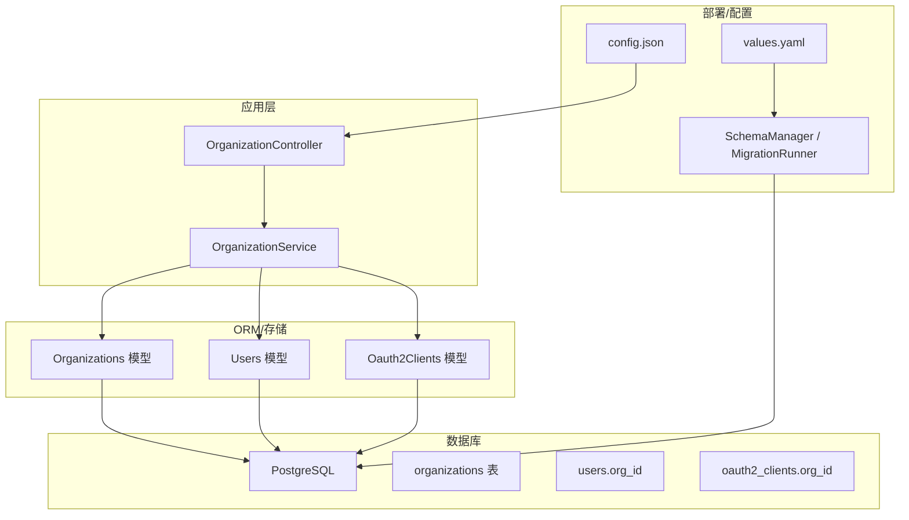
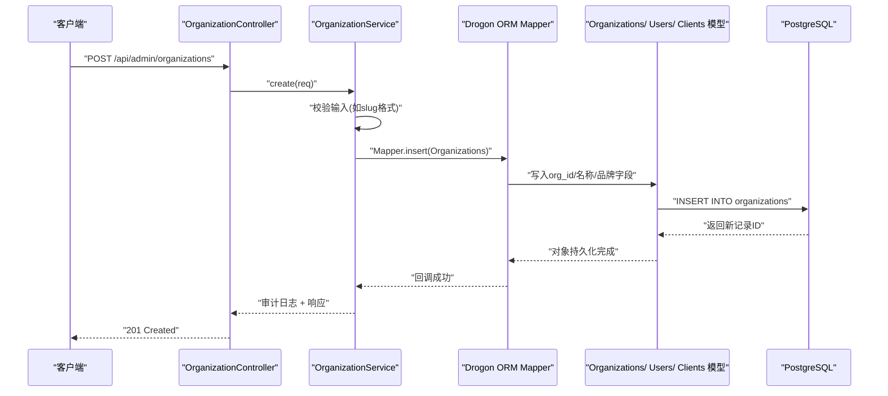
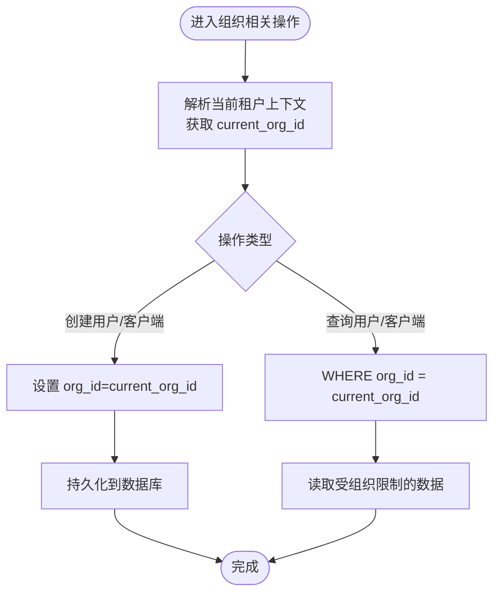
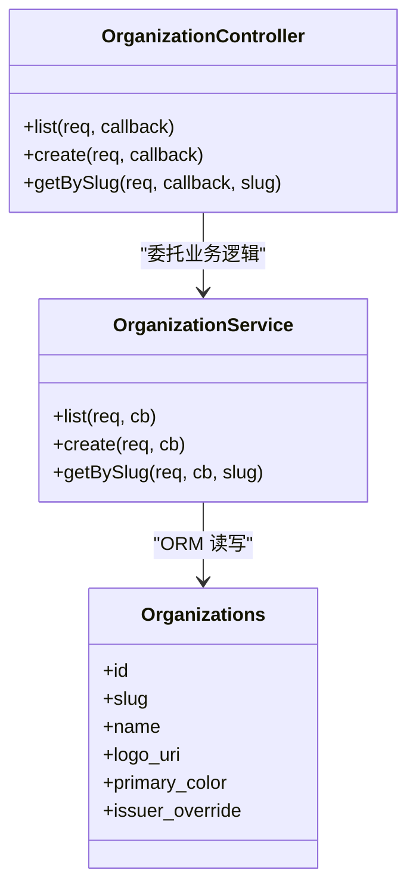
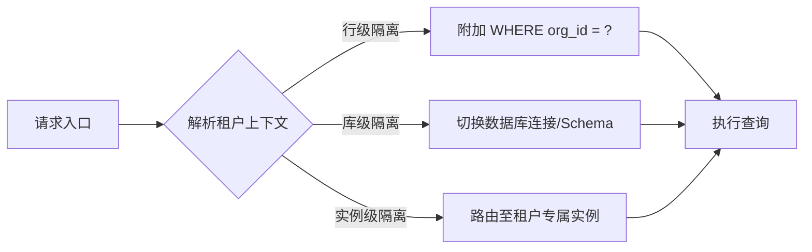
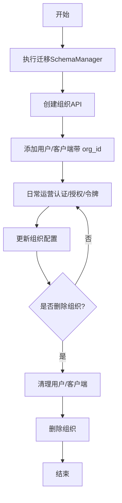
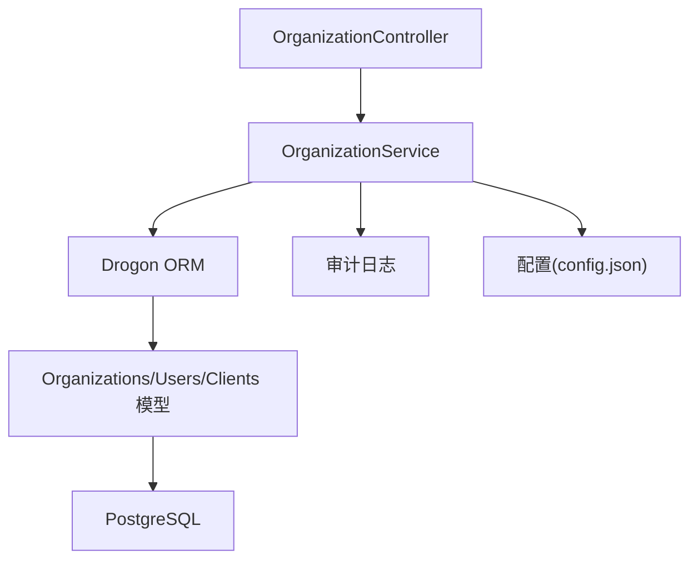
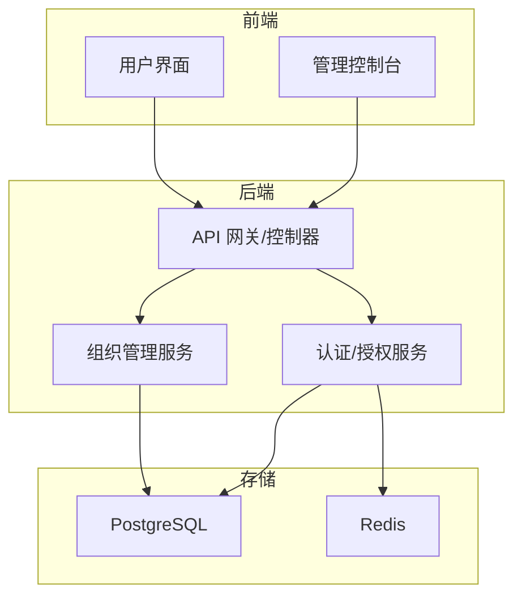

# 多租户组织表

<cite>
**本文引用的文件**
- [V017__multi_tenant.sql](file://apps/server/migrations/V017__multi_tenant.sql)
- [OrganizationController.h](file://apps/server/src/organization/OrganizationController.h)
- [OrganizationController.cc](file://apps/server/src/organization/OrganizationController.cc)
- [OrganizationService.h](file://apps/server/src/organization/OrganizationService.h)
- [OrganizationService.cc](file://apps/server/src/organization/OrganizationService.cc)
- [Organizations.cc](file://libs/storage-postgres/src/models/Organizations.cc)
- [Users.cc](file://libs/storage-postgres/src/models/Users.cc)
- [Oauth2Clients.cc](file://libs/storage-postgres/src/models/Oauth2Clients.cc)
- [TenantId.h](file://libs/common/include/authforge/common/model/TenantId.h)
- [config.json](file://apps/server/config/config.json)
- [values.yaml](file://deploy/helm/authforge/values.yaml)
- [SchemaManager.cc](file://apps/server/src/SchemaManager.cc)
- [MigrationRunner.cc](file://apps/server/src/bootstrap/MigrationRunner.cc)
- [production_hardening_p2_tasks.md](file://docs/history/PRD/production_hardening_p2_tasks.md)
</cite>

## 目录
1. [简介](#简介)
2. [项目结构](#项目结构)
3. [核心组件](#核心组件)
4. [架构总览](#架构总览)
5. [详细组件分析](#详细组件分析)
6. [依赖关系分析](#依赖关系分析)
7. [性能考虑](#性能考虑)
8. [故障排查指南](#故障排查指南)
9. [结论](#结论)
10. [附录](#附录)

## 简介
本文件聚焦 AuthForge 的多租户组织管理能力，围绕 organizations 表、租户隔离机制与数据分片策略进行系统化说明。当前实现以“行级隔离”为核心：通过 organizations 表与关联表的 org_id 外键建立租户边界，并在应用层提供组织 CRUD 能力；同时为未来更严格的隔离（库级、实例级）预留了设计空间。文档还涵盖组织资源配置、权限继承、计费计量所需的数据支撑点，以及跨租户访问控制与资源共享的约束与扩展方向。

## 项目结构
多租户相关代码主要分布在以下位置：
- 数据库迁移：定义 organizations 表及关联字段与索引
- 产品层控制器与服务：暴露组织管理 API，封装业务逻辑与 ORM 调用
- ORM 模型：自动生成 Organizations、Users、Oauth2Clients 等模型类，承载 org_id 字段映射
- 配置与部署：Helm values 与服务器配置用于运行期参数注入
- 迁移执行：启动时自动扫描并执行未应用的迁移脚本

图表来源
- [OrganizationController.h:22-44](file://apps/server/src/organization/OrganizationController.h#L22-L44)
- [OrganizationService.cc:64-93](file://apps/server/src/organization/OrganizationService.cc#L64-L93)
- [V017__multi_tenant.sql:2-22](file://apps/server/migrations/V017__multi_tenant.sql#L2-L22)
- [SchemaManager.cc:164-209](file://apps/server/src/SchemaManager.cc#L164-L209)
- [MigrationRunner.cc:137-167](file://apps/server/src/bootstrap/MigrationRunner.cc#L137-L167)
- [config.json:9-27](file://apps/server/config/config.json#L9-L27)
- [values.yaml:18-32](file://deploy/helm/authforge/values.yaml#L18-L32)

章节来源
- [V017__multi_tenant.sql:2-22](file://apps/server/migrations/V017__multi_tenant.sql#L2-L22)
- [OrganizationController.h:22-44](file://apps/server/src/organization/OrganizationController.h#L22-L44)
- [OrganizationService.cc:64-93](file://apps/server/src/organization/OrganizationService.cc#L64-L93)
- [SchemaManager.cc:164-209](file://apps/server/src/SchemaManager.cc#L164-L209)
- [MigrationRunner.cc:137-167](file://apps/server/src/bootstrap/MigrationRunner.cc#L137-L167)
- [config.json:9-27](file://apps/server/config/config.json#L9-L27)
- [values.yaml:18-32](file://deploy/helm/authforge/values.yaml#L18-L32)

## 核心组件
- 组织表与租户标识
  - organizations 表：id、slug（唯一）、name、logo_uri、primary_color、issuer_override、时间戳字段
  - users 与 oauth2_clients 新增 org_id 外键，指向 organizations.id，形成行级隔离基础
  - 索引：users.org_id、oauth2_clients.org_id、organizations.slug
- 组织管理 API
  - 列表、创建、按 slug 查询的组织管理端点
  - 使用 Drogon ORM Mapper 对 Organizations 模型进行读写
- ORM 模型
  - Organizations、Users、Oauth2Clients 模型包含 org_id 字段映射与序列化支持
- 迁移与部署
  - SchemaManager 负责扫描并执行 V*.sql 迁移
  - MigrationRunner 在迁移模式下独立连接数据库执行迁移
  - Helm values 与 config.json 提供运行期配置

章节来源
- [V017__multi_tenant.sql:2-22](file://apps/server/migrations/V017__multi_tenant.sql#L2-L22)
- [OrganizationController.cc:56-85](file://apps/server/src/organization/OrganizationController.cc#L56-L85)
- [OrganizationService.cc:95-174](file://apps/server/src/organization/OrganizationService.cc#L95-L174)
- [Organizations.cc:638-689](file://libs/storage-postgres/src/models/Organizations.cc#L638-L689)
- [Users.cc:890-900](file://libs/storage-postgres/src/models/Users.cc#L890-L900)
- [Oauth2Clients.cc:95-98](file://libs/storage-postgres/src/models/Oauth2Clients.cc#L95-L98)
- [SchemaManager.cc:164-209](file://apps/server/src/SchemaManager.cc#L164-L209)
- [MigrationRunner.cc:137-167](file://apps/server/src/bootstrap/MigrationRunner.cc#L137-L167)

## 架构总览
下图展示从请求到数据落盘的完整链路，体现多租户上下文如何贯穿服务层与持久化层。

图表来源
- [OrganizationController.h:22-44](file://apps/server/src/organization/OrganizationController.h#L22-L44)
- [OrganizationService.cc:95-174](file://apps/server/src/organization/OrganizationService.cc#L95-L174)
- [V017__multi_tenant.sql:2-22](file://apps/server/migrations/V017__multi_tenant.sql#L2-L22)

## 详细组件分析

### 组织表与租户隔离（行级隔离）
- 表结构与字段
  - organizations：id、slug（唯一）、name、logo_uri、primary_color、issuer_override、created_at、updated_at
  - users.org_id、oauth2_clients.org_id：可空外键，便于向后兼容
  - 索引：idx_users_org、idx_clients_org、idx_organizations_slug
- 隔离策略
  - 当前采用行级隔离：所有涉及用户或客户端的查询需附加 WHERE org_id = $current_org
  - 品牌与发行者隔离：logo_uri、primary_color、issuer_override 支持按租户定制
- 数据流向
  - 创建组织后，后续在该组织下创建的用户与客户端将携带 org_id，确保数据隔离
  - 查询时需基于当前租户上下文过滤结果集

图表来源
- [V017__multi_tenant.sql:2-22](file://apps/server/migrations/V017__multi_tenant.sql#L2-L22)
- [production_hardening_p2_tasks.md:248-259](file://docs/history/PRD/production_hardening_p2_tasks.md#L248-L259)

章节来源
- [V017__multi_tenant.sql:2-22](file://apps/server/migrations/V017__multi_tenant.sql#L2-L22)
- [production_hardening_p2_tasks.md:248-259](file://docs/history/PRD/production_hardening_p2_tasks.md#L248-L259)

### 组织管理 API 与控制流
- 路由与鉴权
  - GET/POST /api/admin/organizations：列出与创建组织
  - GET /api/admin/organizations/{slug}：按 slug 获取组织
  - 均挂载 AuthorizationFilter 进行鉴权
- 服务层职责
  - 参数校验（如 slug 格式、必填字段）
  - 使用 Mapper<Organizations> 进行插入与查询
  - 成功后记录审计日志并返回响应

图表来源
- [OrganizationController.h:22-44](file://apps/server/src/organization/OrganizationController.h#L22-L44)
- [OrganizationService.h:27-40](file://apps/server/src/organization/OrganizationService.h#L27-L40)
- [Organizations.cc:638-689](file://libs/storage-postgres/src/models/Organizations.cc#L638-L689)

章节来源
- [OrganizationController.h:22-44](file://apps/server/src/organization/OrganizationController.h#L22-L44)
- [OrganizationController.cc:56-85](file://apps/server/src/organization/OrganizationController.cc#L56-L85)
- [OrganizationService.cc:64-93](file://apps/server/src/organization/OrganizationService.cc#L64-L93)
- [OrganizationService.cc:95-174](file://apps/server/src/organization/OrganizationService.cc#L95-L174)
- [OrganizationService.cc:176-201](file://apps/server/src/organization/OrganizationService.cc#L176-L201)

### 多租户隔离级别选择与配置
- 行级隔离（当前实现）
  - 通过 org_id 外键与查询条件实现数据隔离
  - 适用于共享数据库实例、单库多租户场景
- 库级隔离（规划/可选）
  - 每个租户独立数据库实例或独立 schema
  - 需要路由层根据租户上下文切换连接串或 schema
- 实例级隔离（规划/可选）
  - 每个租户独立服务实例与数据库实例
  - 适合强合规与高隔离需求，但运维成本更高
- 配置要点
  - 当前配置通过 config.json 指定默认数据库连接
  - Helm values 支持外部数据库与 Redis 接入，便于多环境部署

图表来源
- [production_hardening_p2_tasks.md:248-259](file://docs/history/PRD/production_hardening_p2_tasks.md#L248-L259)
- [config.json:9-27](file://apps/server/config/config.json#L9-L27)
- [values.yaml:114-135](file://deploy/helm/authforge/values.yaml#L114-L135)

章节来源
- [production_hardening_p2_tasks.md:248-259](file://docs/history/PRD/production_hardening_p2_tasks.md#L248-L259)
- [config.json:9-27](file://apps/server/config/config.json#L9-L27)
- [values.yaml:114-135](file://deploy/helm/authforge/values.yaml#L114-L135)

### 组织级资源配置、权限继承与计费计量
- 资源配置
  - logo_uri、primary_color：租户品牌定制
  - issuer_override：租户级发行者标识，影响令牌签发与发现接口
- 权限继承
  - 当前 RBAC 规则位于配置中，未直接绑定 org_id
  - 建议未来在角色/权限表中引入 org_id，实现租户内权限隔离与继承
- 计费计量
  - 可在用户/客户端/会话/令牌等关键实体上增加用量统计字段（如登录次数、令牌签发量）
  - 结合审计日志与指标导出（Prometheus）实现租户级计量

章节来源
- [V017__multi_tenant.sql:2-11](file://apps/server/migrations/V017__multi_tenant.sql#L2-L11)
- [config.json:172-184](file://apps/server/config/config.json#L172-L184)

### 跨租户数据访问控制与资源共享
- 访问控制
  - 所有跨租户访问必须经过租户上下文解析与强制过滤
  - 禁止无 org_id 的越权查询；必要时在网关层拦截
- 资源共享
  - 当前设计强调隔离；如需共享资源（如公共 scope），应在明确边界内实现，并通过 org_id 区分归属
  - 跨租户共享应通过显式授权与审计记录

章节来源
- [production_hardening_p2_tasks.md:248-259](file://docs/history/PRD/production_hardening_p2_tasks.md#L248-L259)

### 租户生命周期管理与迁移策略
- 生命周期
  - 创建：通过 API 创建组织，生成 slug 与品牌信息
  - 更新：修改组织元数据（名称、品牌、发行者覆盖）
  - 删除：需先清理该组织下的用户与客户端，再删除组织（建议在服务层实现级联检查）
- 迁移策略
  - 使用 SchemaManager 自动扫描并执行 V*.sql 迁移
  - MigrationRunner 支持迁移模式独立运行，确保数据库结构一致
  - 多租户迁移（V017）已包含组织表与关联字段、索引

图表来源
- [SchemaManager.cc:164-209](file://apps/server/src/SchemaManager.cc#L164-L209)
- [MigrationRunner.cc:137-167](file://apps/server/src/bootstrap/MigrationRunner.cc#L137-L167)
- [OrganizationService.cc:95-174](file://apps/server/src/organization/OrganizationService.cc#L95-L174)

章节来源
- [SchemaManager.cc:164-209](file://apps/server/src/SchemaManager.cc#L164-L209)
- [MigrationRunner.cc:137-167](file://apps/server/src/bootstrap/MigrationRunner.cc#L137-L167)
- [OrganizationService.cc:95-174](file://apps/server/src/organization/OrganizationService.cc#L95-L174)

## 依赖关系分析
- 组件耦合
  - OrganizationController 仅负责 HTTP 适配，业务逻辑下沉至 OrganizationService
  - OrganizationService 依赖 Drogon ORM 与生成的模型类，避免直接 SQL 拼接
  - 模型类（Organizations、Users、Oauth2Clients）由迁移脚本驱动生成，保证与数据库结构一致
- 外部依赖
  - PostgreSQL：数据存储
  - Redis：缓存与会话（可选）
  - Prometheus：指标导出（可选）
- 潜在循环依赖
  - 当前分层清晰，未发现循环依赖风险

图表来源
- [OrganizationController.h:22-44](file://apps/server/src/organization/OrganizationController.h#L22-L44)
- [OrganizationService.cc:64-93](file://apps/server/src/organization/OrganizationService.cc#L64-L93)
- [config.json:9-27](file://apps/server/config/config.json#L9-L27)

章节来源
- [OrganizationController.h:22-44](file://apps/server/src/organization/OrganizationController.h#L22-L44)
- [OrganizationService.cc:64-93](file://apps/server/src/organization/OrganizationService.cc#L64-L93)
- [config.json:9-27](file://apps/server/config/config.json#L9-L27)

## 性能考虑
- 索引优化
  - 已为 users.org_id、oauth2_clients.org_id、organizations.slug 建立索引，提升按租户查询效率
- 查询隔离
  - 所有租户相关查询需附加 org_id 过滤，避免全表扫描
- 连接池与超时
  - 通过 config.json 配置数据库连接池大小与语句超时，防止慢查询阻塞
- 缓存与分片
  - 当前未实现分片；未来可按租户维度进行水平分片或按时间分区（如令牌表）

章节来源
- [V017__multi_tenant.sql:19-22](file://apps/server/migrations/V017__multi_tenant.sql#L19-L22)
- [config.json:9-27](file://apps/server/config/config.json#L9-L27)

## 故障排查指南
- 数据库连接失败
  - 检查 config.json 中 db_clients 配置是否正确
  - 确认 MigrationRunner 能独立连接数据库并执行迁移
- 迁移失败
  - 查看 SchemaManager 日志，确认迁移文件顺序与内容
  - 使用迁移模式单独执行，定位具体失败语句
- 组织创建冲突
  - slug 唯一性约束导致冲突时，返回资源冲突错误
  - 检查是否存在重复 slug 或数据库异常
- 租户数据越界
  - 确认所有查询是否附加 org_id 过滤
  - 检查上游租户上下文解析逻辑

章节来源
- [MigrationRunner.cc:137-167](file://apps/server/src/bootstrap/MigrationRunner.cc#L137-L167)
- [SchemaManager.cc:164-209](file://apps/server/src/SchemaManager.cc#L164-L209)
- [OrganizationService.cc:95-174](file://apps/server/src/organization/OrganizationService.cc#L95-L174)

## 结论
AuthForge 当前以行级隔离实现多租户组织管理，通过 organizations 表与 org_id 外键构建数据边界，并提供完整的组织 CRUD 能力。未来可扩展至库级与实例级隔离以满足更强合规需求。建议在权限与计量方面逐步引入 org_id 维度，完善租户内权限继承与用量统计。迁移机制与配置体系已就绪，支持平滑演进与多环境部署。

## 附录
- 多租户部署架构图（概念）

[本图为概念示意，不直接映射具体源码文件]