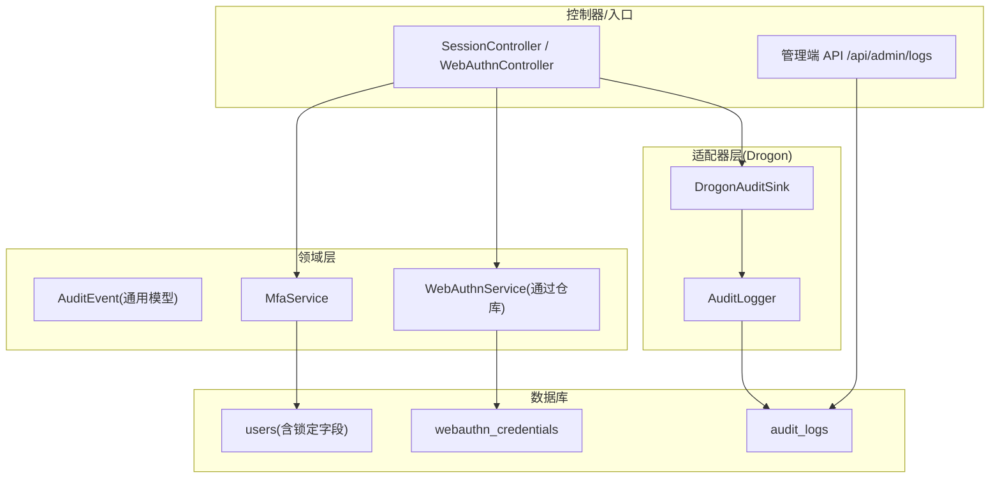
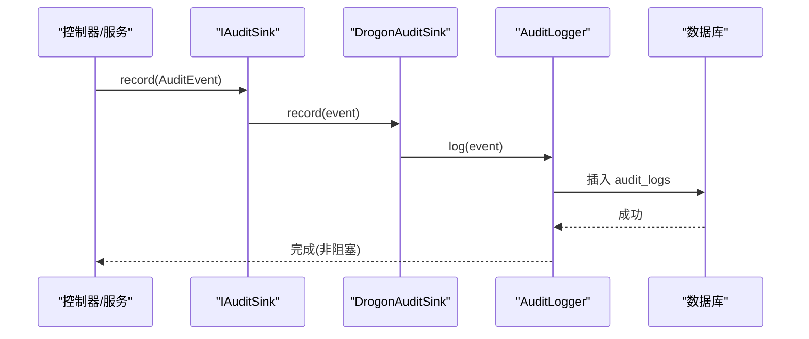
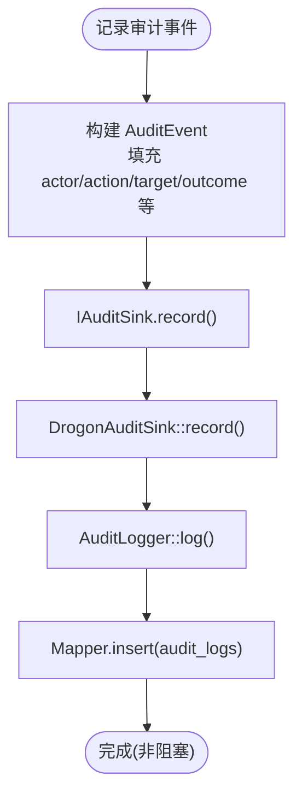
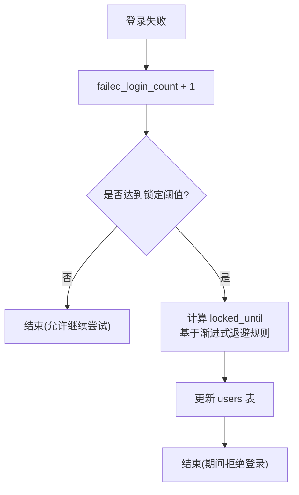
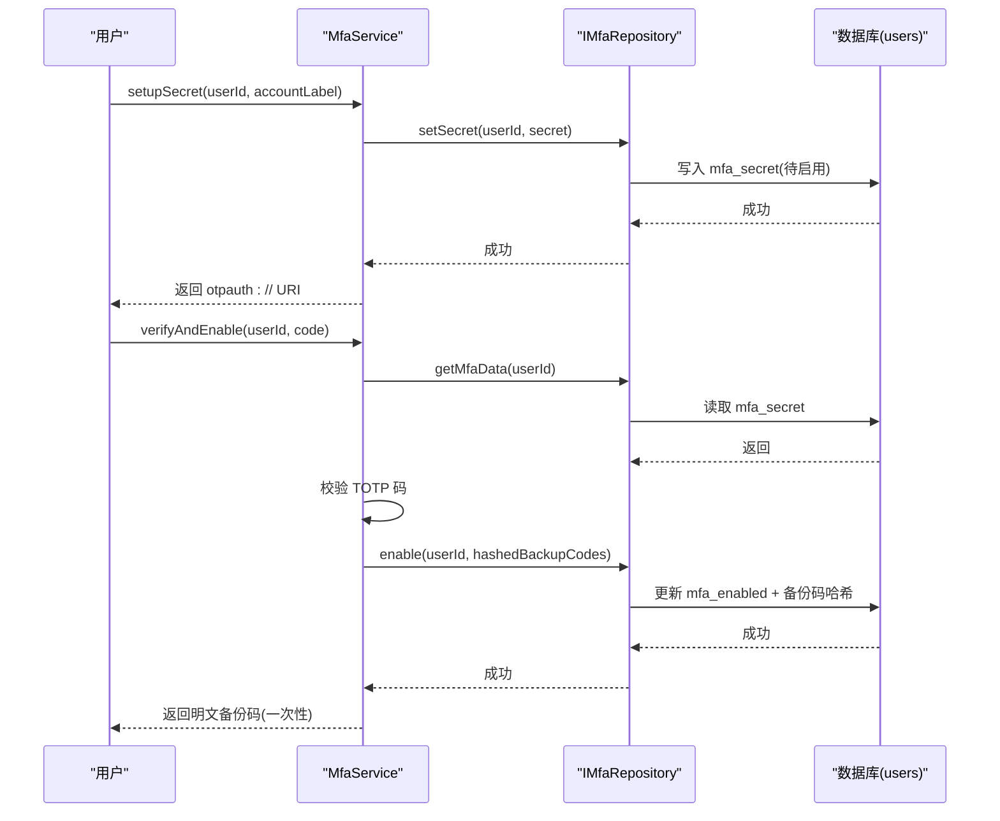
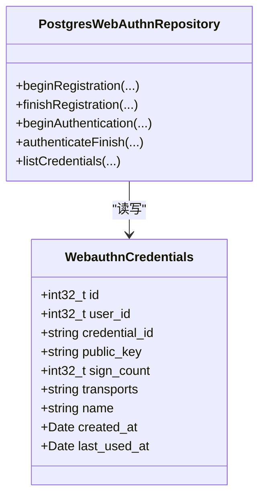
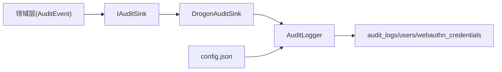

# 审计与安全表

<cite>
**本文引用的文件**
- [V012__audit_logs.sql](file://apps/server/migrations/V012__audit_logs.sql)
- [V013__account_lockout.sql](file://apps/server/migrations/V013__account_lockout.sql)
- [V011__mfa_support.sql](file://apps/server/migrations/V011__mfa_support.sql)
- [V018__webauthn.sql](file://apps/server/migrations/V018__webauthn.sql)
- [AuditEvent.h](file://libs/common/include/authforge/common/observability/AuditEvent.h)
- [IAuditSink.h](file://libs/common/include/authforge/common/ports/IAuditSink.h)
- [DrogonAuditSink.h](file://libs/drogon/include/authforge/drogon/adapters/DrogonAuditSink.h)
- [AuditLogger.h](file://libs/drogon/include/authforge/drogon/observability/AuditLogger.h)
- [AuditLogger.cc](file://libs/drogon/src/observability/AuditLogger.cc)
- [openapi.yaml](file://apps/server/openapi.yaml)
- [openapi.json](file://apps/server/docs/api/openapi.json)
- [AuthService.cc](file://libs/drogon/src/AuthService.cc)
- [MfaService.cc](file://libs/identity/src/mfa/MfaService.cc)
- [WebAuthnController.cc](file://libs/drogon/src/controllers/WebAuthnController.cc)
- [PostgresWebAuthnRepository.cc](file://libs/storage-postgres/src/PostgresWebAuthnRepository.cc)
- [WebauthnCredentials.h](file://libs/storage-postgres/include/authforge/storage/postgres/models/WebauthnCredentials.h)
- [config.json](file://apps/server/config/config.json)
- [account-lockout.md](file://docs/ops/account-lockout.md)
- [AdminAuditApiHttpTest.cc](file://tests/integration/admin/AdminAuditApiHttpTest.cc)
</cite>

## 目录
1. [简介](#简介)
2. [项目结构](#项目结构)
3. [核心组件](#核心组件)
4. [架构总览](#架构总览)
5. [详细组件分析](#详细组件分析)
6. [依赖关系分析](#依赖关系分析)
7. [性能与保留策略](#性能与保留策略)
8. [故障排查指南](#故障排查指南)
9. [结论](#结论)
10. [附录](#附录)

## 简介
本文件聚焦 AuthForge 的安全相关数据模型与实现，覆盖以下主题：
- 审计日志表 audit_logs 的字段设计、记录格式、写入路径与管理端查询接口。
- 账户锁定机制（失败登录计数、渐进式退避、锁定时间）与暴力破解防护。
- 多因素认证 MFA 凭证存储（TOTP 密钥、备份码）、登录校验流程与跨客户端绑定保护。
- WebAuthn/Passkey 注册与认证的数据安全处理（公钥、签名计数、传输方式等）。
- 安全事件分析流程与合规性报告生成建议。
- 数据脱敏与隐私保护措施。

## 项目结构
围绕安全能力的相关代码分布在迁移脚本、领域服务、适配器层与数据库模型中：
- 数据库迁移：定义审计日志、账户锁定、MFA 与 WebAuthn 的表结构。
- 领域层：统一审计事件模型、MFA 业务逻辑、WebAuthn 服务接口。
- 适配器层：将审计事件异步落库，提供 Drogon 请求到审计事件的适配。
- 控制器与服务：登录、MFA、WebAuthn 流程调用领域服务并触发审计。
- 配置：数据库连接、插件与清理间隔等运行参数。

图表来源
- [V012__audit_logs.sql:4-22](file://apps/server/migrations/V012__audit_logs.sql#L4-L22)
- [V013__account_lockout.sql:4-6](file://apps/server/migrations/V013__account_lockout.sql#L4-L6)
- [V018__webauthn.sql:2-15](file://apps/server/migrations/V018__webauthn.sql#L2-L15)
- [AuditEvent.h:31-44](file://libs/common/include/authforge/common/observability/AuditEvent.h#L31-L44)
- [DrogonAuditSink.h:28-34](file://libs/drogon/include/authforge/drogon/adapters/DrogonAuditSink.h#L28-L34)
- [AuditLogger.h:27-34](file://libs/drogon/include/authforge/drogon/observability/AuditLogger.h#L27-L34)
- [openapi.json:328-348](file://apps/server/docs/api/openapi.json#L328-L348)

章节来源
- [V012__audit_logs.sql:1-23](file://apps/server/migrations/V012__audit_logs.sql#L1-L23)
- [V013__account_lockout.sql:1-7](file://apps/server/migrations/V013__account_lockout.sql#L1-L7)
- [V011__mfa_support.sql:1-7](file://apps/server/migrations/V011__mfa_support.sql#L1-L7)
- [V018__webauthn.sql:1-16](file://apps/server/migrations/V018__webauthn.sql#L1-L16)
- [AuditEvent.h:1-47](file://libs/common/include/authforge/common/observability/AuditEvent.h#L1-L47)
- [DrogonAuditSink.h:1-34](file://libs/drogon/include/authforge/drogon/adapters/DrogonAuditSink.h#L1-L34)
- [AuditLogger.h:1-36](file://libs/drogon/include/authforge/drogon/observability/AuditLogger.h#L1-L36)
- [openapi.json:321-385](file://apps/server/docs/api/openapi.json#L321-L385)

## 核心组件
- 审计事件模型 AuditEvent：框架无关的结构化事件，包含执行者、动作、目标、结果、网络上下文与扩展详情。
- 审计写入通道 IAuditSink/DrogonAuditSink/AuditLogger：领域通过端口发出事件，适配器层异步持久化到数据库，不阻塞主流程。
- 账户锁定：在 users 表中维护失败次数、锁定截止时间与最近失败时间，配合渐进式退避策略。
- MFA 凭证：users.mfa_enabled/mfa_secret/mfa_backup_codes 用于 TOTP 启用与登录校验；支持备份码哈希存储。
- WebAuthn 凭据：独立表 webauthn_credentials 存储用户凭据元数据与使用统计。

章节来源
- [AuditEvent.h:31-44](file://libs/common/include/authforge/common/observability/AuditEvent.h#L31-L44)
- [IAuditSink.h:39-48](file://libs/common/include/authforge/common/ports/IAuditSink.h#L39-L48)
- [DrogonAuditSink.h:28-34](file://libs/drogon/include/authforge/drogon/adapters/DrogonAuditSink.h#L28-L34)
- [AuditLogger.cc:70-93](file://libs/drogon/src/observability/AuditLogger.cc#L70-L93)
- [V013__account_lockout.sql:4-6](file://apps/server/migrations/V013__account_lockout.sql#L4-L6)
- [V011__mfa_support.sql:4-6](file://apps/server/migrations/V011__mfa_support.sql#L4-L6)
- [V018__webauthn.sql:2-15](file://apps/server/migrations/V018__webauthn.sql#L2-L15)

## 架构总览
审计日志从控制器或服务侧构造 AuditEvent，经由 IAuditSink 进入适配器层，最终由 AuditLogger 异步写入 audit_logs。账户锁定在登录失败时更新 users 表的计数与锁定时间。MFA 与 WebAuthn 分别通过领域服务与仓库访问对应数据表。

图表来源
- [AuditEvent.h:31-44](file://libs/common/include/authforge/common/observability/AuditEvent.h#L31-L44)
- [IAuditSink.h:39-48](file://libs/common/include/authforge/common/ports/IAuditSink.h#L39-L48)
- [DrogonAuditSink.h:28-34](file://libs/drogon/include/authforge/drogon/adapters/DrogonAuditSink.h#L28-L34)
- [AuditLogger.cc:70-93](file://libs/drogon/src/observability/AuditLogger.cc#L70-L93)
- [V012__audit_logs.sql:4-22](file://apps/server/migrations/V012__audit_logs.sql#L4-L22)

## 详细组件分析

### 审计日志表 audit_logs
- 字段说明
  - id: 自增主键
  - timestamp: 带时区的时间戳，默认当前时间
  - actor_type/actor_id: 执行者类型与标识（如 user/client/system）
  - action/target_type/target_id: 动作与目标对象
  - outcome: 结果（success/failure）
  - ip/user_agent/request_id: 网络与请求上下文
  - details: JSONB 扩展字段，承载额外上下文
- 索引
  - 按 timestamp、actor、action、outcome+timestamp 建立索引，优化常见查询与聚合。
- 写入路径
  - 领域构造 AuditEvent，经 IAuditSink -> DrogonAuditSink -> AuditLogger 异步写入。
- 管理端查询
  - GET /api/admin/logs：分页列出审计日志，需 Bearer Token。
  - 测试用例验证了未授权返回 401 以及分页参数行为。

图表来源
- [AuditEvent.h:31-44](file://libs/common/include/authforge/common/observability/AuditEvent.h#L31-L44)
- [IAuditSink.h:39-48](file://libs/common/include/authforge/common/ports/IAuditSink.h#L39-L48)
- [DrogonAuditSink.h:28-34](file://libs/drogon/include/authforge/drogon/adapters/DrogonAuditSink.h#L28-L34)
- [AuditLogger.cc:70-93](file://libs/drogon/src/observability/AuditLogger.cc#L70-L93)
- [V012__audit_logs.sql:4-22](file://apps/server/migrations/V012__audit_logs.sql#L4-L22)

章节来源
- [V012__audit_logs.sql:1-23](file://apps/server/migrations/V012__audit_logs.sql#L1-L23)
- [AuditEvent.h:1-47](file://libs/common/include/authforge/common/observability/AuditEvent.h#L1-L47)
- [AuditLogger.cc:70-93](file://libs/drogon/src/observability/AuditLogger.cc#L70-L93)
- [openapi.json:328-348](file://apps/server/docs/api/openapi.json#L328-L348)
- [AdminAuditApiHttpTest.cc:94-129](file://tests/integration/admin/AdminAuditApiHttpTest.cc#L94-L129)

### 账户锁定与暴力破解防护
- 数据模型
  - users.failed_login_count：累计失败次数
  - users.locked_until：锁定截止时间（Unix 秒）
  - users.last_failed_login：最近一次失败时间
- 渐进式退避策略
  - 失败次数达到阈值后设置不同锁定时长（例如 5/10/15/20+ 次对应递增时长），避免线性重试攻击。
- 登录失败处理
  - 登录失败时更新失败计数与锁定时间；若处于锁定状态则拒绝登录。
- 重置与运维
  - 提供脚本重置指定或全部用户的锁定状态；生产环境建议监控锁定事件并告警。

图表来源
- [V013__account_lockout.sql:4-6](file://apps/server/migrations/V013__account_lockout.sql#L4-L6)
- [AuthService.cc:148-176](file://libs/drogon/src/AuthService.cc#L148-L176)
- [account-lockout.md:7-16](file://docs/ops/account-lockout.md#L7-L16)

章节来源
- [V013__account_lockout.sql:1-7](file://apps/server/migrations/V013__account_lockout.sql#L1-L7)
- [AuthService.cc:148-176](file://libs/drogon/src/AuthService.cc#L148-L176)
- [account-lockout.md:1-238](file://docs/ops/account-lockout.md#L1-L238)

### 多因素认证(MFA)凭证与流程
- 数据存储
  - users.mfa_enabled：是否启用 MFA
  - users.mfa_secret：TOTP 密钥
  - users.mfa_backup_codes：备份码数组（以哈希形式存储）
- 关键流程
  - 初始化：生成 TOTP 密钥与 otpauth URI，临时存储待验证。
  - 验证启用：校验 TOTP 码成功后启用 MFA，并生成一次性备份码（哈希存储）。
  - 登录校验：登录阶段校验 TOTP 码；支持跨客户端绑定校验，防止 mfa_token 被滥用。
- 安全要点
  - 备份码仅存哈希，不可逆还原。
  - 登录时校验 client_id/redirect_uri 与待验证绑定的匹配性，增强安全性。

图表来源
- [V011__mfa_support.sql:4-6](file://apps/server/migrations/V011__mfa_support.sql#L4-L6)
- [MfaService.cc:21-103](file://libs/identity/src/mfa/MfaService.cc#L21-L103)
- [IMfaRepository.h:46-74](file://libs/identity/include/authforge/identity/IMfaRepository.h#L46-L74)

章节来源
- [V011__mfa_support.sql:1-7](file://apps/server/migrations/V011__mfa_support.sql#L1-L7)
- [MfaService.cc:1-186](file://libs/identity/src/mfa/MfaService.cc#L1-L186)
- [IMfaRepository.h:39-77](file://libs/identity/include/authforge/identity/IMfaRepository.h#L39-L77)
- [openapi.yaml:1474-1517](file://apps/server/openapi.yaml#L1474-L1517)

### WebAuthn/Passkey 凭据存储与安全处理
- 数据模型
  - webauthn_credentials.user_id：关联用户
  - credential_id/public_key：凭据唯一标识与公钥
  - sign_count/transports/name：使用计数、传输方式与名称
  - created_at/last_used_at：创建与最后使用时间
- 安全处理
  - 仅存储公钥与元数据，私钥由硬件安全模块保管。
  - 认证时更新 sign_count 与 last_used_at，便于检测异常使用。
  - 列表接口仅暴露必要字段，避免泄露敏感信息。
- 仓库实现
  - PostgresWebAuthnRepository 负责凭据的查找、更新与列举。

图表来源
- [V018__webauthn.sql:2-15](file://apps/server/migrations/V018__webauthn.sql#L2-L15)
- [WebauthnCredentials.h:43-110](file://libs/storage-postgres/include/authforge/storage/postgres/models/WebauthnCredentials.h#L43-L110)
- [PostgresWebAuthnRepository.cc:114-157](file://libs/storage-postgres/src/PostgresWebAuthnRepository.cc#L114-L157)

章节来源
- [V018__webauthn.sql:1-16](file://apps/server/migrations/V018__webauthn.sql#L1-L16)
- [WebauthnCredentials.h:1-110](file://libs/storage-postgres/include/authforge/storage/postgres/models/WebauthnCredentials.h#L1-L110)
- [PostgresWebAuthnRepository.cc:114-157](file://libs/storage-postgres/src/PostgresWebAuthnRepository.cc#L114-L157)
- [WebAuthnController.cc:1-636](file://libs/drogon/src/controllers/WebAuthnController.cc#L1-L636)

### 管理端审计日志查询接口
- 接口
  - GET /api/admin/logs：分页获取系统审计日志，需要 Bearer Token。
- 行为
  - 未认证访问返回 401。
  - 支持分页参数（page/per_page），返回 logs 数组与页信息。
- 测试覆盖
  - 集成测试验证了鉴权与分页响应结构。

章节来源
- [openapi.json:328-348](file://apps/server/docs/api/openapi.json#L328-L348)
- [AdminAuditApiHttpTest.cc:94-129](file://tests/integration/admin/AdminAuditApiHttpTest.cc#L94-L129)

## 依赖关系分析
- 审计链路依赖
  - 领域层通过 IAuditSink 解耦具体落地；适配器层使用 DrogonAuditSink 与 AuditLogger 进行异步写入。
- 数据库依赖
  - 审计日志写入依赖 audit_logs 表及索引；账户锁定依赖 users 表新增字段；MFA/WebAuthn 依赖各自表结构。
- 配置依赖
  - 数据库连接、Redis、插件配置位于 config.json；清理间隔等影响数据生命周期。

图表来源
- [AuditEvent.h:31-44](file://libs/common/include/authforge/common/observability/AuditEvent.h#L31-L44)
- [IAuditSink.h:39-48](file://libs/common/include/authforge/common/ports/IAuditSink.h#L39-L48)
- [DrogonAuditSink.h:28-34](file://libs/drogon/include/authforge/drogon/adapters/DrogonAuditSink.h#L28-L34)
- [AuditLogger.cc:70-93](file://libs/drogon/src/observability/AuditLogger.cc#L70-L93)
- [config.json:9-26](file://apps/server/config/config.json#L9-L26)

章节来源
- [AuditEvent.h:1-47](file://libs/common/include/authforge/common/observability/AuditEvent.h#L1-L47)
- [IAuditSink.h:24-50](file://libs/common/include/authforge/common/ports/IAuditSink.h#L24-L50)
- [DrogonAuditSink.h:1-34](file://libs/drogon/include/authforge/drogon/adapters/DrogonAuditSink.h#L1-L34)
- [AuditLogger.cc:70-93](file://libs/drogon/src/observability/AuditLogger.cc#L70-L93)
- [config.json:1-212](file://apps/server/config/config.json#L1-L212)

## 性能与保留策略
- 写入性能
  - 审计日志采用“fire-and-forget”异步写入，不阻塞主流程，降低对认证路径的影响。
- 查询性能
  - 针对 timestamp、actor、action、outcome 建立索引，提升分页与过滤效率。
- 数据保留
  - 建议在应用层或外部日志系统中实现滚动归档与过期清理（例如按天/周归档、删除超过阈值的旧日志）。
  - 可结合 cleanup_interval_seconds 等配置项规划定期清理任务。
- 容量规划
  - 根据峰值 QPS 与保留周期估算存储需求，必要时分库分表或冷热分离。

[本节为通用指导，不直接分析具体文件]

## 故障排查指南
- 审计日志未写入
  - 检查数据库连接与权限；确认 AuditLogger 异步写入回调未抛出异常。
  - 核对 audit_logs 表结构与索引是否存在。
- 账户锁定误判
  - 查看 users.failed_login_count 与 locked_until；使用提供的脚本重置锁定状态。
  - 关注登录失败原因（密码错误 vs 锁定）应保持一致，避免枚举。
- MFA 校验失败
  - 确认 TOTP 码与服务器时间同步；检查备份码是否已使用。
  - 校验跨客户端绑定是否正确（client_id/redirect_uri）。
- WebAuthn 注册/认证失败
  - 检查 credential_id 唯一性约束；确认 sign_count 与 last_used_at 更新正常。
  - 列表接口仅返回必要字段，避免泄露敏感信息。

章节来源
- [AuditLogger.cc:70-93](file://libs/drogon/src/observability/AuditLogger.cc#L70-L93)
- [V012__audit_logs.sql:4-22](file://apps/server/migrations/V012__audit_logs.sql#L4-L22)
- [account-lockout.md:185-231](file://docs/ops/account-lockout.md#L185-L231)
- [MfaService.cc:115-138](file://libs/identity/src/mfa/MfaService.cc#L115-L138)
- [PostgresWebAuthnRepository.cc:114-157](file://libs/storage-postgres/src/PostgresWebAuthnRepository.cc#L114-L157)

## 结论
AuthForge 在安全方面提供了完善的审计、账户锁定、MFA 与 WebAuthn 支持：
- 审计日志结构化、可索引、可管理端查询，满足合规与排障需求。
- 账户锁定采用渐进式退避，有效缓解暴力破解。
- MFA 与 WebAuthn 遵循最小暴露原则，敏感数据以哈希或公钥形式存储。
- 通过领域与适配器分层解耦，保证可扩展性与可测试性。
建议在生产环境中完善数据保留策略、集中化日志分析与告警机制，持续强化安全态势感知。

[本节为总结性内容，不直接分析具体文件]

## 附录

### 审计日志记录格式与示例字段
- actor_type：user/client/system
- actor_id：用户或客户端标识
- action：login_success/token_issued 等
- target_type/target_id：token/user/client 等
- outcome：success/failure
- ip/user_agent/request_id：网络与请求上下文
- details：JSONB 扩展字段

章节来源
- [AuditEvent.h:31-44](file://libs/common/include/authforge/common/observability/AuditEvent.h#L31-L44)
- [V012__audit_logs.sql:4-22](file://apps/server/migrations/V012__audit_logs.sql#L4-L22)

### 合规性报告生成方案
- 数据源
  - 从 audit_logs 提取近段时间的安全事件（登录成功/失败、MFA 变更、WebAuthn 注册/认证）。
- 指标
  - 失败率、锁定事件数、MFA 启用率、异常 IP/UA 分布。
- 输出
  - 按日/周生成 PDF/CSV 报告，包含趋势图与异常清单。
- 自动化
  - 定时任务拉取数据，渲染模板，归档至合规存储。

[本节为概念性方案，不直接分析具体文件]

### 数据脱敏与隐私保护
- 脱敏范围
  - 对外展示时隐藏敏感字段（如 email、用户名、IP 等），仅在内部审计视图可见。
- 存储安全
  - 备份码哈希存储；MFA 密钥与 WebAuthn 私钥不在服务端存储。
- 访问控制
  - 管理端审计接口需 Bearer Token 鉴权；限制最小权限。
- 传输安全
  - 建议全站 HTTPS；配置 CORS 白名单，避免跨站风险。

章节来源
- [openapi.json:328-348](file://apps/server/docs/api/openapi.json#L328-L348)
- [MfaService.cc:82-100](file://libs/identity/src/mfa/MfaService.cc#L82-L100)
- [V018__webauthn.sql:2-15](file://apps/server/migrations/V018__webauthn.sql#L2-L15)