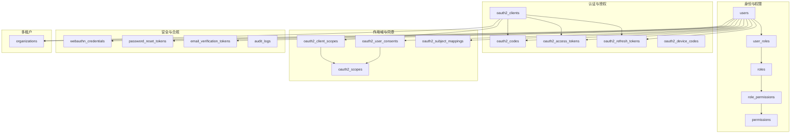
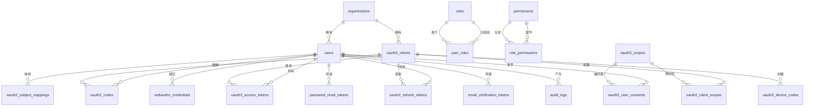
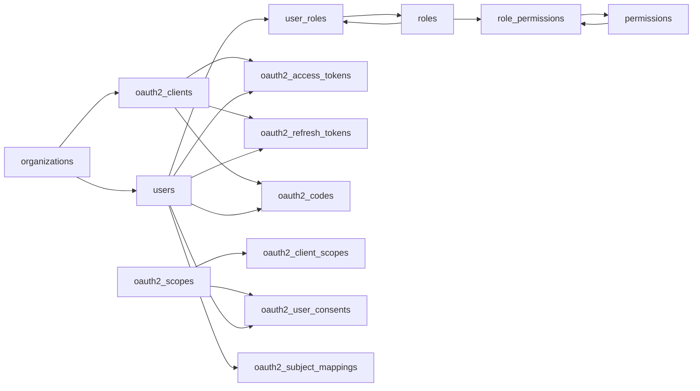
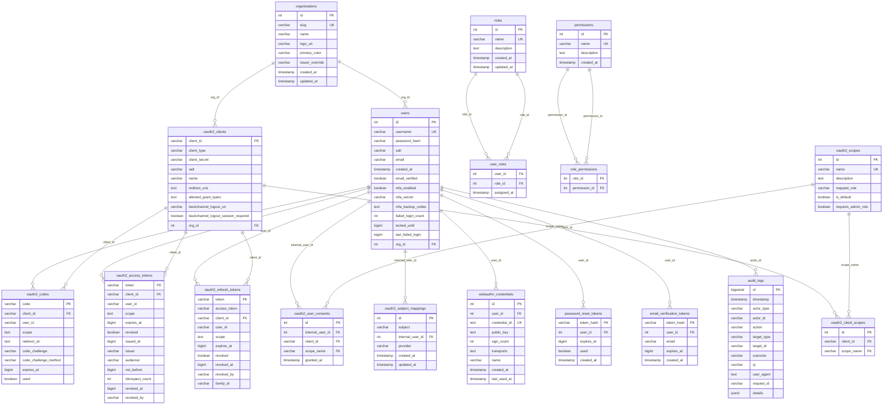

# 数据模型

<cite>
**本文引用的文件**
- [V002__oauth2_core.sql](file://apps/server/migrations/V002__oauth2_core.sql)
- [V004__users_table.sql](file://apps/server/migrations/V004__users_table.sql)
- [V005__rbac_schema.sql](file://apps/server/migrations/V005__rbac_schema.sql)
- [V006__oauth2_scopes.sql](file://apps/server/migrations/V006__oauth2_scopes.sql)
- [V008__refresh_token_family.sql](file://apps/server/migrations/V008__refresh_token_family.sql)
- [V009__password_reset_tokens.sql](file://apps/server/migrations/V009__password_reset_tokens.sql)
- [V010__email_verification.sql](file://apps/server/migrations/V010__email_verification.sql)
- [V011__mfa_support.sql](file://apps/server/migrations/V011__mfa_support.sql)
- [V012__audit_logs.sql](file://apps/server/migrations/V012__audit_logs.sql)
- [V013__account_lockout.sql](file://apps/server/migrations/V013__account_lockout.sql)
- [V014__device_codes.sql](file://apps/server/migrations/V014__device_codes.sql)
- [V015__backchannel_logout.sql](file://apps/server/migrations/V015__backchannel_logout.sql)
- [V017__multi_tenant.sql](file://apps/server/migrations/V017__multi_tenant.sql)
- [V018__webauthn.sql](file://apps/server/migrations/V018__webauthn.sql)
- [dev_admin_user.sql](file://apps/server/seed/dev_admin_user.sql)
- [dev_admin_console_client.sql](file://apps/server/seed/dev_admin_console_client.sql)
- [dev_backend_client.sql](file://apps/server/seed/dev_backend_client.sql)
- [dev_vue_client.sql](file://apps/server/seed/dev_vue_client.sql)
</cite>

## 目录
1. [简介](#简介)
2. [项目结构](#项目结构)
3. [核心组件](#核心组件)
4. [架构总览](#架构总览)
5. [详细组件分析](#详细组件分析)
6. [依赖关系分析](#依赖关系分析)
7. [性能考虑](#性能考虑)
8. [故障排查指南](#故障排查指南)
9. [结论](#结论)
10. [附录](#附录)

## 简介
本文件聚焦 AuthForge 的核心数据模型，围绕用户、客户端应用、授权码、访问令牌、刷新令牌、角色与权限（scopes）等实体进行系统化说明。文档涵盖字段定义、数据类型、约束条件、业务含义、实体间关系映射（一对一、一对多、多对多）、ER 图与示例数据、数据验证规则与完整性约束，以及多租户隔离策略。所有描述均基于数据库迁移脚本与种子数据，确保与实际实现一致。

## 项目结构
AuthForge 的持久化模型以 SQL 迁移脚本为主，按版本顺序演进：
- OAuth2 核心表：客户端、授权码、访问令牌、刷新令牌
- RBAC：角色、权限、用户-角色、角色-权限
- Scopes：OAuth2 作用域、客户端作用域、用户同意、主体映射
- 安全增强：密码重置、邮箱验证、MFA、账户锁定、WebAuthn
- 审计日志：结构化审计记录
- 设备码与回登：设备码流程、后端通道注销
- 多租户：组织与租户隔离字段

图表来源
- [V002__oauth2_core.sql:5-56](file://apps/server/migrations/V002__oauth2_core.sql#L5-L56)
- [V004__users_table.sql:3-10](file://apps/server/migrations/V004__users_table.sql#L3-L10)
- [V005__rbac_schema.sql:3-33](file://apps/server/migrations/V005__rbac_schema.sql#L3-L33)
- [V006__oauth2_scopes.sql:3-44](file://apps/server/migrations/V006__oauth2_scopes.sql#L3-L44)
- [V008__refresh_token_family.sql:5-7](file://apps/server/migrations/V008__refresh_token_family.sql#L5-L7)
- [V009__password_reset_tokens.sql:4-13](file://apps/server/migrations/V009__password_reset_tokens.sql#L4-L13)
- [V010__email_verification.sql:4-15](file://apps/server/migrations/V010__email_verification.sql#L4-L15)
- [V011__mfa_support.sql:4-6](file://apps/server/migrations/V011__mfa_support.sql#L4-L6)
- [V012__audit_logs.sql:4-22](file://apps/server/migrations/V012__audit_logs.sql#L4-L22)
- [V013__account_lockout.sql:4-6](file://apps/server/migrations/V013__account_lockout.sql#L4-L6)
- [V014__device_codes.sql:1-13](file://apps/server/migrations/V014__device_codes.sql#L1-L13)
- [V015__backchannel_logout.sql:1-2](file://apps/server/migrations/V015__backchannel_logout.sql#L1-L2)
- [V017__multi_tenant.sql:2-22](file://apps/server/migrations/V017__multi_tenant.sql#L2-L22)
- [V018__webauthn.sql:2-15](file://apps/server/migrations/V018__webauthn.sql#L2-L15)

章节来源
- [V002__oauth2_core.sql:1-57](file://apps/server/migrations/V002__oauth2_core.sql#L1-L57)
- [V004__users_table.sql:1-11](file://apps/server/migrations/V004__users_table.sql#L1-L11)
- [V005__rbac_schema.sql:1-59](file://apps/server/migrations/V005__rbac_schema.sql#L1-L59)
- [V006__oauth2_scopes.sql:1-55](file://apps/server/migrations/V006__oauth2_scopes.sql#L1-L55)
- [V017__multi_tenant.sql:1-23](file://apps/server/migrations/V017__multi_tenant.sql#L1-L23)

## 核心组件
本节概述各核心表的职责与关键字段：
- 用户表 users：存储本地用户账号、认证凭据与安全相关状态（邮箱验证、MFA、锁定）。
- 客户端应用表 oauth2_clients：注册 OAuth2/OIDC 客户端，包含类型、密钥、重定向 URI、允许授权类型及回登配置。
- 授权码表 oauth2_codes：保存一次性授权码，支持 PKCE 参数与过期控制。
- 访问令牌表 oauth2_access_tokens：承载访问令牌及其元信息（作用域、签发时间、受众、撤销信息等）。
- 刷新令牌表 oauth2_refresh_tokens：管理刷新令牌生命周期与作用域，支持家族化撤销。
- 角色与权限 roles、permissions：RBAC 基础实体，配合 user_roles、role_permissions 建立多对多关系。
- 作用域 oauth2_scopes：定义系统作用域，并支持默认作用域与管理员要求标记。
- 其他辅助表：设备码、密码重置、邮箱验证、审计日志、WebAuthn 凭证、组织等。

章节来源
- [V004__users_table.sql:3-10](file://apps/server/migrations/V004__users_table.sql#L3-L10)
- [V002__oauth2_core.sql:5-56](file://apps/server/migrations/V002__oauth2_core.sql#L5-L56)
- [V005__rbac_schema.sql:3-33](file://apps/server/migrations/V005__rbac_schema.sql#L3-L33)
- [V006__oauth2_scopes.sql:3-44](file://apps/server/migrations/V006__oauth2_scopes.sql#L3-L44)
- [V017__multi_tenant.sql:2-22](file://apps/server/migrations/V017__multi_tenant.sql#L2-L22)

## 架构总览
下图展示核心实体之间的关系，包括一对一、一对多与多对多映射，以及多租户隔离点。

图表来源
- [V002__oauth2_core.sql:5-56](file://apps/server/migrations/V002__oauth2_core.sql#L5-L56)
- [V004__users_table.sql:3-10](file://apps/server/migrations/V004__users_table.sql#L3-L10)
- [V005__rbac_schema.sql:3-33](file://apps/server/migrations/V005__rbac_schema.sql#L3-L33)
- [V006__oauth2_scopes.sql:3-44](file://apps/server/migrations/V006__oauth2_scopes.sql#L3-L44)
- [V008__refresh_token_family.sql:5-7](file://apps/server/migrations/V008__refresh_token_family.sql#L5-L7)
- [V009__password_reset_tokens.sql:4-13](file://apps/server/migrations/V009__password_reset_tokens.sql#L4-L13)
- [V010__email_verification.sql:4-15](file://apps/server/migrations/V010__email_verification.sql#L4-L15)
- [V011__mfa_support.sql:4-6](file://apps/server/migrations/V011__mfa_support.sql#L4-L6)
- [V012__audit_logs.sql:4-22](file://apps/server/migrations/V012__audit_logs.sql#L4-L22)
- [V013__account_lockout.sql:4-6](file://apps/server/migrations/V013__account_lockout.sql#L4-L6)
- [V014__device_codes.sql:1-13](file://apps/server/migrations/V014__device_codes.sql#L1-L13)
- [V015__backchannel_logout.sql:1-2](file://apps/server/migrations/V015__backchannel_logout.sql#L1-L2)
- [V017__multi_tenant.sql:2-22](file://apps/server/migrations/V017__multi_tenant.sql#L2-L22)
- [V018__webauthn.sql:2-15](file://apps/server/migrations/V018__webauthn.sql#L2-L15)

## 详细组件分析

### 用户表 users
- 字段与类型
  - id：自增主键，标识用户唯一性。
  - username：唯一且非空的用户名，用于登录识别。
  - password_hash：密码哈希值，保障凭据安全。
  - salt：盐值，增强哈希安全性。
  - email：可选邮箱地址，用于通知与验证。
  - created_at：创建时间戳。
  - email_verified：邮箱是否已验证。
  - mfa_enabled、mfa_secret、mfa_backup_codes：多因素认证开关、TOTP 密钥与备份码。
  - failed_login_count、locked_until、last_failed_login：失败登录计数、锁定截止时间与最近失败时间。
  - org_id：所属组织，支持多租户隔离。
- 约束与校验
  - 用户名唯一且非空；邮箱可空但需符合业务校验。
  - 安全字段（哈希、盐、MFA 密钥）长度限制与格式校验由应用层保证。
  - 锁定字段通过阈值与时间戳控制账户保护。
- 业务含义
  - 作为认证主体，参与授权码、令牌、同意、设备码、WebAuthn 等流程。
  - 通过 RBAC 获得角色与权限，进而影响作用域与资源访问。
- 示例数据
  - 开发环境提供管理员用户与角色绑定、主体映射。

章节来源
- [V004__users_table.sql:3-10](file://apps/server/migrations/V004__users_table.sql#L3-L10)
- [V010__email_verification.sql:4-4](file://apps/server/migrations/V010__email_verification.sql#L4-L4)
- [V011__mfa_support.sql:4-6](file://apps/server/migrations/V011__mfa_support.sql#L4-L6)
- [V013__account_lockout.sql:4-6](file://apps/server/migrations/V013__account_lockout.sql#L4-L6)
- [V017__multi_tenant.sql:13-14](file://apps/server/migrations/V017__multi_tenant.sql#L13-L14)
- [dev_admin_user.sql:5-20](file://apps/server/seed/dev_admin_user.sql#L5-L20)

### 客户端应用表 oauth2_clients
- 字段与类型
  - client_id：主键，客户端唯一标识。
  - client_type：客户端类型（如机密型或公开型）。
  - client_secret、salt：机密型客户端的密钥与盐。
  - name：客户端名称。
  - redirect_uris：重定向 URI 列表。
  - allowed_grant_types：允许的授权类型。
  - backchannel_logout_uri、backchannel_logout_session_required：回登端点与会话要求。
  - org_id：所属组织，支持多租户隔离。
- 约束与校验
  - 客户端 ID 唯一；重定向 URI 需在应用层严格校验。
  - 密钥与盐需满足安全长度与随机性要求。
- 业务含义
  - 代表第三方应用或服务，参与授权码、设备码、客户端凭证等流程。
  - 通过作用域授权决定可访问的资源范围。
- 示例数据
  - 开发环境提供管理控制台、Vue 前端、后端服务三种客户端样例。

章节来源
- [V002__oauth2_core.sql:5-13](file://apps/server/migrations/V002__oauth2_core.sql#L5-L13)
- [V015__backchannel_logout.sql:1-2](file://apps/server/migrations/V015__backchannel_logout.sql#L1-L2)
- [V017__multi_tenant.sql:16-17](file://apps/server/migrations/V017__multi_tenant.sql#L16-L17)
- [dev_admin_console_client.sql:5-20](file://apps/server/seed/dev_admin_console_client.sql#L5-L20)
- [dev_vue_client.sql:5-21](file://apps/server/seed/dev_vue_client.sql#L5-L21)
- [dev_backend_client.sql:5-22](file://apps/server/seed/dev_backend_client.sql#L5-L22)

### 授权码表 oauth2_codes
- 字段与类型
  - code：主键，一次性授权码。
  - client_id：引用客户端。
  - user_id：关联用户。
  - scope：请求的作用域。
  - redirect_uri：重定向目标。
  - code_challenge、code_challenge_method：PKCE 挑战与方法。
  - expires_at：过期时间戳。
  - used：是否已使用。
- 约束与校验
  - 唯一主键；外键约束保证客户端存在。
  - 过期时间与使用标志用于防止重放攻击。
- 业务含义
  - 在授权码流程中临时承载授权信息，换取访问令牌。
- 示例数据
  - 无直接种子数据，通常由授权流程动态生成。

章节来源
- [V002__oauth2_core.sql:15-26](file://apps/server/migrations/V002__oauth2_core.sql#L15-L26)

### 访问令牌表 oauth2_access_tokens
- 字段与类型
  - token：主键，访问令牌。
  - client_id、user_id：颁发给客户端与用户。
  - scope：令牌作用域。
  - expires_at：过期时间。
  - revoked：是否撤销。
  - issued_at、issuer、audience、not_before：令牌元信息。
  - introspect_count：内省次数统计。
  - revoked_at、revoked_by：撤销时间与操作者。
- 约束与校验
  - 唯一主键；外键约束保证客户端存在。
  - 时间戳与布尔标志用于生命周期与状态管理。
- 业务含义
  - 承载访问资源的凭证，受作用域与过期时间限制。
- 示例数据
  - 无直接种子数据，通常由令牌颁发流程生成。

章节来源
- [V002__oauth2_core.sql:28-43](file://apps/server/migrations/V002__oauth2_core.sql#L28-L43)

### 刷新令牌表 oauth2_refresh_tokens
- 字段与类型
  - token：主键，刷新令牌。
  - access_token：关联的访问令牌。
  - client_id、user_id：颁发上下文。
  - scope：作用域。
  - expires_at：过期时间。
  - revoked、revoked_at、revoked_by：撤销状态与详情。
  - family_id：家族标识，用于批量撤销检测。
- 约束与校验
  - 唯一主键；外键约束保证客户端存在。
  - 家族化支持提升撤销效率与安全性。
- 业务含义
  - 用于续期访问令牌，支持家族化撤销以防止令牌泄露后的持续滥用。
- 示例数据
  - 无直接种子数据，通常由令牌颁发流程生成。

章节来源
- [V002__oauth2_core.sql:45-56](file://apps/server/migrations/V002__oauth2_core.sql#L45-L56)
- [V008__refresh_token_family.sql:5-7](file://apps/server/migrations/V008__refresh_token_family.sql#L5-L7)

### 角色与权限（roles、permissions）
- 字段与类型
  - roles：id、name（唯一）、description、created_at、updated_at。
  - permissions：id、name（唯一）、description、created_at。
  - user_roles：user_id、role_id、assigned_at，复合主键。
  - role_permissions：role_id、permission_id，复合主键。
- 约束与校验
  - 角色与权限名称唯一；关联表使用外键级联删除。
  - 索引优化查询性能。
- 业务含义
  - 通过 RBAC 将权限组合为角色，再分配给用户，形成细粒度访问控制。
- 示例数据
  - 默认角色与权限，以及管理员全量权限、普通用户基本权限的初始化。

章节来源
- [V005__rbac_schema.sql:3-33](file://apps/server/migrations/V005__rbac_schema.sql#L3-L33)
- [V005__rbac_schema.sql:35-58](file://apps/server/migrations/V005__rbac_schema.sql#L35-L58)

### 作用域（oauth2_scopes）与客户端作用域、用户同意、主体映射
- 字段与类型
  - oauth2_scopes：id、name（唯一）、description、mapped_role、is_default、requires_admin_role。
  - oauth2_client_scopes：client_id、scope_name，唯一约束。
  - oauth2_user_consents：internal_user_id、client_id、scope_name，唯一约束。
  - oauth2_subject_mappings：subject、internal_user_id、provider，唯一约束。
- 约束与校验
  - 作用域名称唯一；客户端作用域与用户同意具有唯一性约束。
  - 索引优化查找性能。
- 业务含义
  - 定义系统能力边界；客户端需显式授权作用域；用户同意记录用户授权历史；主体映射支持外部身份源。
- 示例数据
  - 默认作用域（openid、profile、email、admin、read、write）与默认客户端作用域授权。

章节来源
- [V006__oauth2_scopes.sql:3-44](file://apps/server/migrations/V006__oauth2_scopes.sql#L3-L44)
- [V006__oauth2_scopes.sql:46-54](file://apps/server/migrations/V006__oauth2_scopes.sql#L46-L54)
- [dev_admin_console_client.sql:17-20](file://apps/server/seed/dev_admin_console_client.sql#L17-L20)
- [dev_vue_client.sql:16-21](file://apps/server/seed/dev_vue_client.sql#L16-L21)
- [dev_backend_client.sql:17-22](file://apps/server/seed/dev_backend_client.sql#L17-L22)

### 设备码（oauth2_device_codes）
- 字段与类型
  - device_code_hash：主键。
  - user_code：用户可见的唯一短码。
  - client_id、scope、status、user_id、expires_at、interval_seconds、created_at。
- 约束与校验
  - 唯一约束；过期时间控制有效性。
- 业务含义
  - 支持设备受限场景下的授权流程，用户通过浏览器完成授权后设备轮询获取令牌。
- 示例数据
  - 无直接种子数据，由设备码流程动态生成。

章节来源
- [V014__device_codes.sql:1-13](file://apps/server/migrations/V014__device_codes.sql#L1-L13)

### 密码重置与邮箱验证
- 密码重置令牌（password_reset_tokens）
  - 字段：token_hash、user_id、expires_at、used、created_at。
  - 用途：一次性密码重置链接的安全载体。
- 邮箱验证令牌（email_verification_tokens）
  - 字段：token_hash、user_id、email、expires_at、created_at。
  - 用途：邮箱确认流程的安全载体。
- 示例数据
  - 无直接种子数据，由业务流程动态生成。

章节来源
- [V009__password_reset_tokens.sql:4-13](file://apps/server/migrations/V009__password_reset_tokens.sql#L4-L13)
- [V010__email_verification.sql:4-15](file://apps/server/migrations/V010__email_verification.sql#L4-L15)

### 多因素认证（MFA）与 WebAuthn
- MFA
  - 字段：mfa_enabled、mfa_secret、mfa_backup_codes。
  - 用途：启用 TOTP 与备份码，增强登录安全。
- WebAuthn 凭证（webauthn_credentials）
  - 字段：user_id、credential_id、public_key、sign_count、transports、name、created_at、last_used_at。
  - 用途：无密码登录与强认证支持。
- 示例数据
  - 无直接种子数据，由用户自助开启与注册流程生成。

章节来源
- [V011__mfa_support.sql:4-6](file://apps/server/migrations/V011__mfa_support.sql#L4-L6)
- [V018__webauthn.sql:2-15](file://apps/server/migrations/V018__webauthn.sql#L2-L15)

### 审计日志（audit_logs）
- 字段与类型
  - id、timestamp、actor_type、actor_id、action、target_type、target_id、outcome、ip、user_agent、request_id、details(JSONB)。
- 约束与校验
  - 时间戳与索引优化查询；JSONB 灵活记录细节。
- 业务含义
  - 记录安全相关事件，支持合规与调试。
- 示例数据
  - 无直接种子数据，由系统事件驱动写入。

章节来源
- [V012__audit_logs.sql:4-22](file://apps/server/migrations/V012__audit_logs.sql#L4-L22)

### 多租户支持（organizations）
- 字段与类型
  - organizations：id、slug（唯一）、name、logo_uri、primary_color、issuer_override、created_at、updated_at。
  - users.org_id、oauth2_clients.org_id：租户归属字段。
- 约束与校验
  - slug 唯一；组织与用户/客户端通过外键关联。
- 业务含义
  - 实现数据隔离：同一实例下不同组织的数据互不可见，支持独立发行者覆盖等特性。
- 示例数据
  - 无直接种子数据，由租户管理流程创建。

章节来源
- [V017__multi_tenant.sql:2-22](file://apps/server/migrations/V017__multi_tenant.sql#L2-L22)

## 依赖关系分析
- 外键关系
  - oauth2_codes、oauth2_access_tokens、oauth2_refresh_tokens 引用 oauth2_clients。
  - user_roles 引用 users 与 roles；role_permissions 引用 roles 与 permissions。
  - oauth2_client_scopes、oauth2_user_consents、oauth2_subject_mappings 引用 oauth2_scopes。
  - 安全相关表（密码重置、邮箱验证、WebAuthn）引用 users。
- 索引优化
  - 用户角色、角色权限、客户端作用域、用户同意、主体映射、刷新令牌家族等均有索引以提升查询性能。
- 潜在循环依赖
  - 当前模型无循环外键依赖，层级清晰。

图表来源
- [V002__oauth2_core.sql:5-56](file://apps/server/migrations/V002__oauth2_core.sql#L5-L56)
- [V005__rbac_schema.sql:3-33](file://apps/server/migrations/V005__rbac_schema.sql#L3-L33)
- [V006__oauth2_scopes.sql:3-44](file://apps/server/migrations/V006__oauth2_scopes.sql#L3-L44)
- [V017__multi_tenant.sql:2-22](file://apps/server/migrations/V017__multi_tenant.sql#L2-L22)

章节来源
- [V002__oauth2_core.sql:5-56](file://apps/server/migrations/V002__oauth2_core.sql#L5-L56)
- [V005__rbac_schema.sql:3-33](file://apps/server/migrations/V005__rbac_schema.sql#L3-L33)
- [V006__oauth2_scopes.sql:3-44](file://apps/server/migrations/V006__oauth2_scopes.sql#L3-L44)
- [V017__multi_tenant.sql:2-22](file://apps/server/migrations/V017__multi_tenant.sql#L2-L22)

## 性能考虑
- 索引设计
  - 用户角色、角色权限、客户端作用域、用户同意、主体映射、刷新令牌家族、审计日志时间戳与动作等均有索引，优化常见查询路径。
- 时间戳与过期
  - 大量使用 BIGINT 时间戳表示过期时间，便于高效比较与清理。
- JSONB 审计
  - 审计日志使用 JSONB 存储细节，兼顾灵活性与查询性能。
- 建议
  - 定期清理过期令牌与验证码，避免表膨胀。
  - 对高频查询路径补充复合索引（如按租户与用户维度）。

[本节为通用性能指导，不直接分析具体文件]

## 故障排查指南
- 常见问题定位
  - 授权码无效：检查 oauth2_codes 的过期时间与使用标志。
  - 令牌无法刷新：核对 oauth2_refresh_tokens 的家族化撤销与过期时间。
  - 作用域拒绝：确认 oauth2_client_scopes 与 oauth2_scopes 的配置。
  - 用户锁定：查看 users 的失败登录计数与锁定截止时间。
  - 多租户数据不可见：检查 users.org_id 与 oauth2_clients.org_id 是否正确设置。
- 审计与调试
  - 通过 audit_logs 的 action、outcome、timestamp 等字段定位问题事件。
  - 结合 request_id 追踪跨模块调用链。

章节来源
- [V002__oauth2_core.sql:15-56](file://apps/server/migrations/V002__oauth2_core.sql#L15-L56)
- [V008__refresh_token_family.sql:5-7](file://apps/server/migrations/V008__refresh_token_family.sql#L5-L7)
- [V006__oauth2_scopes.sql:3-44](file://apps/server/migrations/V006__oauth2_scopes.sql#L3-L44)
- [V013__account_lockout.sql:4-6](file://apps/server/migrations/V013__account_lockout.sql#L4-L6)
- [V017__multi_tenant.sql:13-22](file://apps/server/migrations/V017__multi_tenant.sql#L13-L22)
- [V012__audit_logs.sql:4-22](file://apps/server/migrations/V012__audit_logs.sql#L4-L22)

## 结论
AuthForge 的数据模型以 OAuth2/OIDC 为核心，结合 RBAC、作用域、多租户与安全增强能力，形成了完整且可扩展的身份与访问管理体系。通过严格的约束与索引设计，保障了数据完整性与查询性能。多租户隔离与审计日志为生产环境的合规与运维提供了坚实基础。建议在部署时遵循最小权限原则，合理配置作用域与客户端授权，并定期维护过期数据以确保系统稳定运行。

[本节为总结性内容，不直接分析具体文件]

## 附录

### ER 图（代码级映射）

图表来源
- [V002__oauth2_core.sql:5-56](file://apps/server/migrations/V002__oauth2_core.sql#L5-L56)
- [V004__users_table.sql:3-10](file://apps/server/migrations/V004__users_table.sql#L3-L10)
- [V005__rbac_schema.sql:3-33](file://apps/server/migrations/V005__rbac_schema.sql#L3-L33)
- [V006__oauth2_scopes.sql:3-44](file://apps/server/migrations/V006__oauth2_scopes.sql#L3-L44)
- [V008__refresh_token_family.sql:5-7](file://apps/server/migrations/V008__refresh_token_family.sql#L5-L7)
- [V009__password_reset_tokens.sql:4-13](file://apps/server/migrations/V009__password_reset_tokens.sql#L4-L13)
- [V010__email_verification.sql:4-15](file://apps/server/migrations/V010__email_verification.sql#L4-L15)
- [V011__mfa_support.sql:4-6](file://apps/server/migrations/V011__mfa_support.sql#L4-L6)
- [V012__audit_logs.sql:4-22](file://apps/server/migrations/V012__audit_logs.sql#L4-L22)
- [V013__account_lockout.sql:4-6](file://apps/server/migrations/V013__account_lockout.sql#L4-L6)
- [V014__device_codes.sql:1-13](file://apps/server/migrations/V014__device_codes.sql#L1-L13)
- [V015__backchannel_logout.sql:1-2](file://apps/server/migrations/V015__backchannel_logout.sql#L1-L2)
- [V017__multi_tenant.sql:2-22](file://apps/server/migrations/V017__multi_tenant.sql#L2-L22)
- [V018__webauthn.sql:2-15](file://apps/server/migrations/V018__webauthn.sql#L2-L15)

### 示例数据（开发环境）
- 管理员用户与角色绑定、主体映射
- 管理控制台客户端（公开型，PKCE）
- Vue 前端客户端（公开型，默认作用域）
- 后端服务客户端（机密型，客户端凭证）

章节来源
- [dev_admin_user.sql:5-20](file://apps/server/seed/dev_admin_user.sql#L5-L20)
- [dev_admin_console_client.sql:5-20](file://apps/server/seed/dev_admin_console_client.sql#L5-L20)
- [dev_vue_client.sql:5-21](file://apps/server/seed/dev_vue_client.sql#L5-L21)
- [dev_backend_client.sql:5-22](file://apps/server/seed/dev_backend_client.sql#L5-L22)