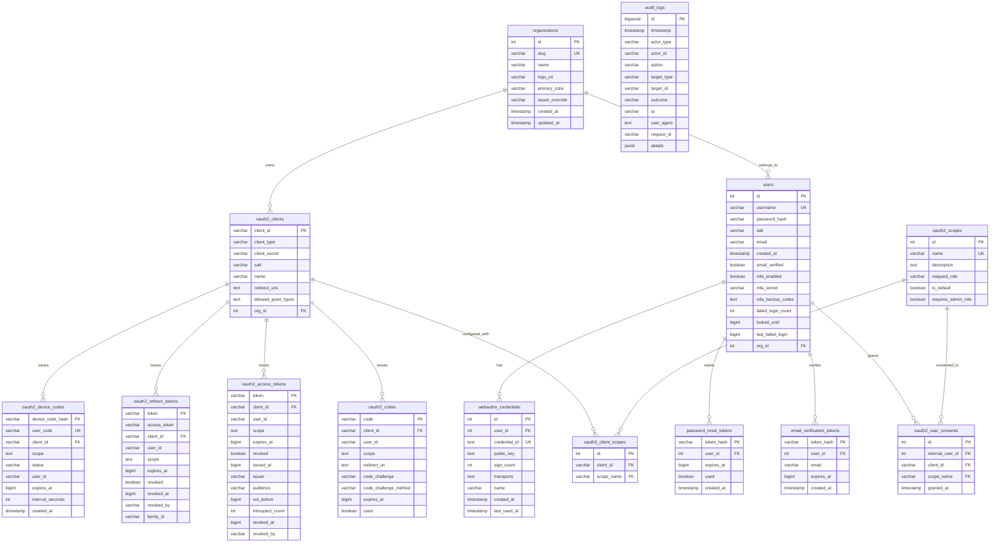
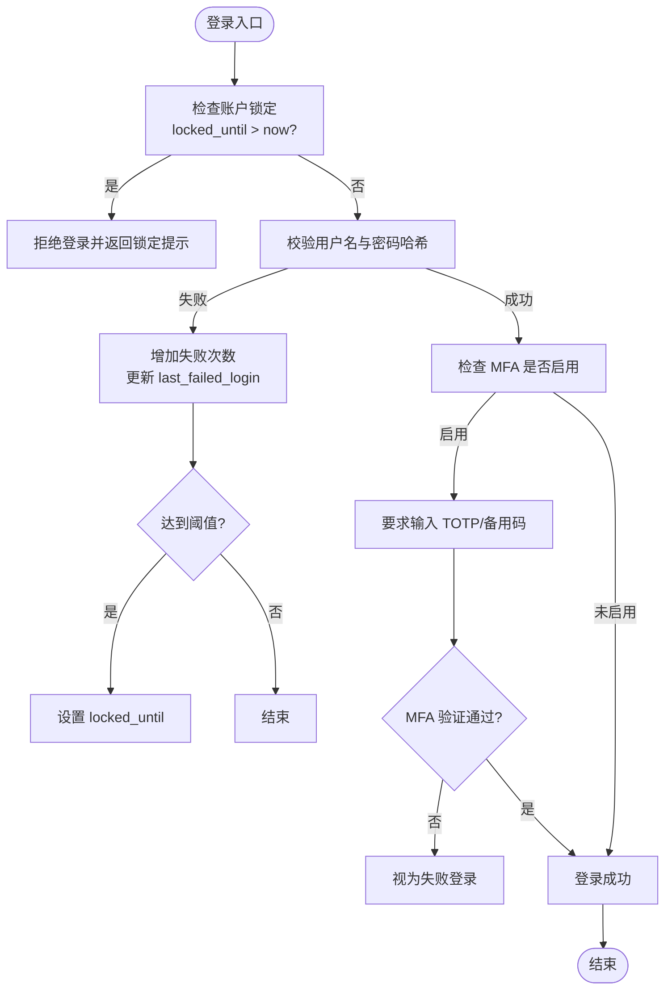
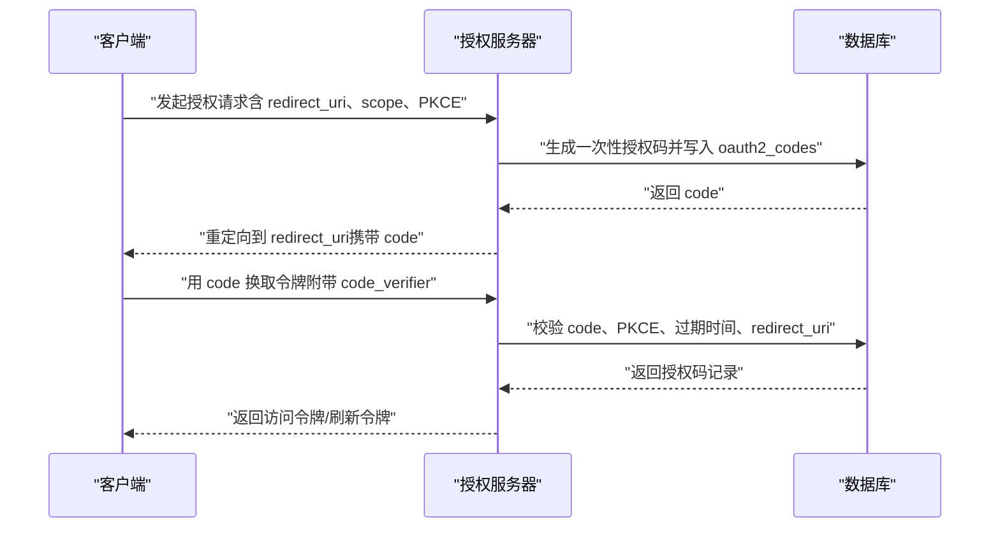
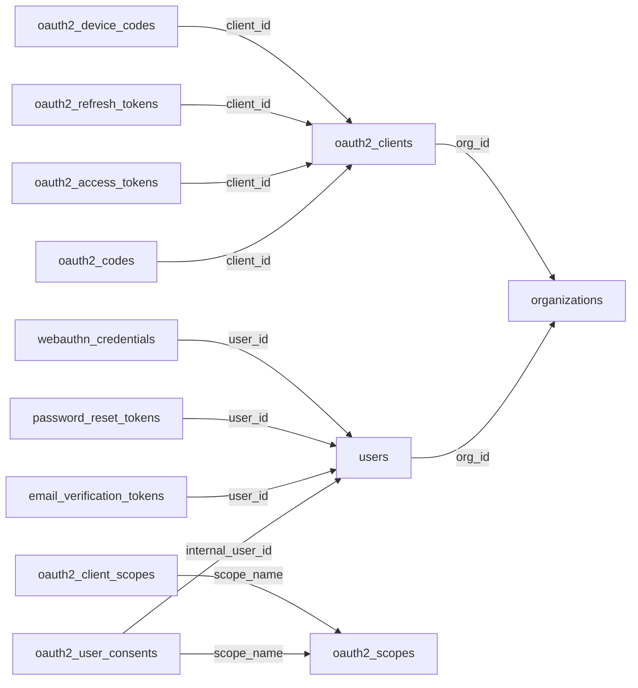

# 核心实体表

<cite>
**本文引用的文件**
- [apps/server/migrations/V002__oauth2_core.sql](file://apps/server/migrations/V002__oauth2_core.sql)
- [apps/server/migrations/V003__oauth2_core_indexes.sql](file://apps/server/migrations/V003__oauth2_core_indexes.sql)
- [apps/server/migrations/V004__users_table.sql](file://apps/server/migrations/V004__users_table.sql)
- [apps/server/migrations/V005__rbac_schema.sql](file://apps/server/migrations/V005__rbac_schema.sql)
- [apps/server/migrations/V006__oauth2_scopes.sql](file://apps/server/migrations/V006__oauth2_scopes.sql)
- [apps/server/migrations/V008__refresh_token_family.sql](file://apps/server/migrations/V008__refresh_token_family.sql)
- [apps/server/migrations/V009__password_reset_tokens.sql](file://apps/server/migrations/V009__password_reset_tokens.sql)
- [apps/server/migrations/V010__email_verification.sql](file://apps/server/migrations/V010__email_verification.sql)
- [apps/server/migrations/V011__mfa_support.sql](file://apps/server/migrations/V011__mfa_support.sql)
- [apps/server/migrations/V012__audit_logs.sql](file://apps/server/migrations/V012__audit_logs.sql)
- [apps/server/migrations/V013__account_lockout.sql](file://apps/server/migrations/V013__account_lockout.sql)
- [apps/server/migrations/V014__device_codes.sql](file://apps/server/migrations/V014__device_codes.sql)
- [apps/server/migrations/V017__multi_tenant.sql](file://apps/server/migrations/V017__multi_tenant.sql)
- [apps/server/migrations/V018__webauthn.sql](file://apps/server/migrations/V018__webauthn.sql)
- [apps/server/seed/dev_admin_user.sql](file://apps/server/seed/dev_admin_user.sql)
</cite>

## 目录
1. [简介](#简介)
2. [项目结构](#项目结构)
3. [核心组件](#核心组件)
4. [架构总览](#架构总览)
5. [详细组件分析](#详细组件分析)
6. [依赖关系分析](#依赖关系分析)
7. [性能考虑](#性能考虑)
8. [故障排查指南](#故障排查指南)
9. [结论](#结论)
10. [附录](#附录)

## 简介
本文件聚焦 AuthForge 的核心实体表，围绕用户认证与 OAuth2/OIDC 能力，系统梳理以下关键表的结构、约束、索引与业务含义：
- 用户表（users）
- 客户端应用表（oauth2_clients）
- 授权码表（oauth2_codes）
- 访问令牌表（oauth2_access_tokens）
- 刷新令牌表（oauth2_refresh_tokens）
- 设备码表（oauth2_device_codes）
- 作用域与同意表（oauth2_scopes、oauth2_client_scopes、oauth2_user_consents）
- 邮箱验证与密码重置相关表（email_verification_tokens、password_reset_tokens）
- 多因素认证与安全增强（MFA、WebAuthn、账户锁定、审计日志）
- 多租户（organizations）

文档同时提供 ER 关系图、数据流时序图、字段校验规则与完整性约束说明，并给出示例记录路径以便快速理解。

## 项目结构
与核心实体表直接相关的数据库迁移脚本位于 apps/server/migrations 目录下，按版本顺序演进；种子数据位于 apps/server/seed。

```mermaid
graph TB
subgraph "迁移脚本"
V002["V002__oauth2_core.sql"]
V003["V003__oauth2_core_indexes.sql"]
V004["V004__users_table.sql"]
V005["V005__rbac_schema.sql"]
V006["V006__oauth2_scopes.sql"]
V008["V008__refresh_token_family.sql"]
V009["V009__password_reset_tokens.sql"]
V010["V010__email_verification.sql"]
V011["V011__mfa_support.sql"]
V012["V012__audit_logs.sql"]
V013["V013__account_lockout.sql"]
V014["V014__device_codes.sql"]
V017["V017__multi_tenant.sql"]
V018["V018__webauthn.sql"]
end
subgraph "种子数据"
SEED["dev_admin_user.sql"]
end
V002 --> V003
V004 --> V010
V004 --> V011
V004 --> V013
V004 --> V017
V002 --> V006
V002 --> V008
V002 --> V014
V004 --> V018
SEED --> V005
```

图表来源
- [apps/server/migrations/V002__oauth2_core.sql:1-57](file://apps/server/migrations/V002__oauth2_core.sql#L1-L57)
- [apps/server/migrations/V003__oauth2_core_indexes.sql:1-9](file://apps/server/migrations/V003__oauth2_core_indexes.sql#L1-L9)
- [apps/server/migrations/V004__users_table.sql:1-11](file://apps/server/migrations/V004__users_table.sql#L1-L11)
- [apps/server/migrations/V005__rbac_schema.sql:1-59](file://apps/server/migrations/V005__rbac_schema.sql#L1-L59)
- [apps/server/migrations/V006__oauth2_scopes.sql:1-55](file://apps/server/migrations/V006__oauth2_scopes.sql#L1-L55)
- [apps/server/migrations/V008__refresh_token_family.sql:1-8](file://apps/server/migrations/V008__refresh_token_family.sql#L1-L8)
- [apps/server/migrations/V009__password_reset_tokens.sql:1-14](file://apps/server/migrations/V009__password_reset_tokens.sql#L1-L14)
- [apps/server/migrations/V010__email_verification.sql:1-16](file://apps/server/migrations/V010__email_verification.sql#L1-L16)
- [apps/server/migrations/V011__mfa_support.sql:1-7](file://apps/server/migrations/V011__mfa_support.sql#L1-L7)
- [apps/server/migrations/V012__audit_logs.sql:1-23](file://apps/server/migrations/V012__audit_logs.sql#L1-L23)
- [apps/server/migrations/V013__account_lockout.sql:1-7](file://apps/server/migrations/V013__account_lockout.sql#L1-L7)
- [apps/server/migrations/V014__device_codes.sql:1-14](file://apps/server/migrations/V014__device_codes.sql#L1-L14)
- [apps/server/migrations/V017__multi_tenant.sql:1-23](file://apps/server/migrations/V017__multi_tenant.sql#L1-L23)
- [apps/server/migrations/V018__webauthn.sql:1-16](file://apps/server/migrations/V018__webauthn.sql#L1-L16)
- [apps/server/seed/dev_admin_user.sql:1-21](file://apps/server/seed/dev_admin_user.sql#L1-L21)

章节来源
- [apps/server/migrations/V002__oauth2_core.sql:1-57](file://apps/server/migrations/V002__oauth2_core.sql#L1-L57)
- [apps/server/migrations/V004__users_table.sql:1-11](file://apps/server/migrations/V004__users_table.sql#L1-L11)

## 核心组件
本节概述与用户认证和 OAuth2 最密切的三张核心表：用户表、客户端应用表、授权码表，并补充访问令牌、刷新令牌、设备码等支撑表。

- 用户表（users）
  - 主键：id（自增整数）
  - 用户名：username（唯一、非空、长度限制、禁止空串）
  - 密码哈希：password_hash（固定长度字符串）
  - 盐值：salt（固定长度字符串）
  - 邮箱：email（可选）
  - 创建时间：created_at（默认当前时间）
  - 扩展字段（后续迁移添加）：
    - email_verified（布尔，默认假）
    - mfa_enabled（布尔，默认假）
    - mfa_secret（固定长度字符串）
    - mfa_backup_codes（文本，JSON 数组形式的已哈希备用码）
    - failed_login_count（整数，默认 0）
    - locked_until（大整数，默认 0）
    - last_failed_login（大整数，默认 0）
    - org_id（外键，指向 organizations，可空以兼容旧数据）
  - 业务含义：存储本地用户身份与认证凭据，支持邮箱验证、MFA、账户锁定、多租户隔离等安全特性。

- 客户端应用表（oauth2_clients）
  - 主键：client_id（字符串）
  - 客户端类型：client_type（枚举风格，默认 CONFIDENTIAL）
  - 客户端密钥：client_secret（固定长度字符串）
  - 盐值：salt（固定长度字符串）
  - 名称：name（可选）
  - 重定向地址：redirect_uris（文本，通常存储多个 URI）
  - 允许的授权类型：allowed_grant_types（文本，通常存储多种 grant type）
  - 扩展字段：org_id（外键，指向 organizations，可空）
  - 业务含义：定义 OAuth2 客户端应用的身份与能力边界（重定向地址、授权类型、作用域等）。

- 授权码表（oauth2_codes）
  - 主键：code（字符串）
  - 客户端：client_id（外键，引用 oauth2_clients）
  - 用户标识：user_id（字符串，用于 OIDC subject 映射场景）
  - 作用域：scope（文本）
  - 重定向地址：redirect_uri（文本）
  - PKCE：code_challenge、code_challenge_method（用于授权码流程的安全增强）
  - 过期时间：expires_at（大整数）
  - 使用标记：used（布尔，默认假）
  - 业务含义：承载一次性授权码，配合 PKCE 实现安全的授权码流转。

- 访问令牌表（oauth2_access_tokens）
  - 主键：token（字符串）
  - 客户端：client_id（外键）
  - 用户标识：user_id（字符串）
  - 作用域：scope（文本）
  - 过期时间：expires_at（大整数）
  - 撤销状态：revoked（布尔，默认假）
  - 签发时间：issued_at（大整数，默认当前时间）
  - 签发者：issuer（字符串，默认空）
  - 受众：audience（字符串）
  - 生效前时间：not_before（大整数，默认当前时间）
  - 探查计数：introspect_count（整数，默认 0）
  - 撤销时间与撤销人：revoked_at、revoked_by
  - 索引：token、client_id、expires_at、(revoked, expires_at)
  - 业务含义：短期访问凭证，携带资源访问权限与作用域信息。

- 刷新令牌表（oauth2_refresh_tokens）
  - 主键：token（字符串）
  - 关联访问令牌：access_token（字符串）
  - 客户端：client_id（外键）
  - 用户标识：user_id（字符串）
  - 作用域：scope（文本）
  - 过期时间：expires_at（大整数）
  - 撤销状态：revoked（布尔，默认假）
  - 撤销时间与撤销人：revoked_at、revoked_by
  - 家族标识：family_id（字符串，用于批量撤销）
  - 索引：token、(revoked, expires_at)、family_id
  - 业务含义：长期刷新凭证，支持家族化撤销与重用检测。

- 设备码表（oauth2_device_codes）
  - 主键：device_code_hash（字符串）
  - 用户可见码：user_code（唯一）
  - 客户端：client_id（外键）
  - 作用域：scope（文本）
  - 状态：status（默认 pending）
  - 用户标识：user_id（字符串）
  - 过期时间：expires_at（大整数）
  - 轮询间隔：interval_seconds（默认 5）
  - 创建时间：created_at（默认当前时间）
  - 索引：user_code、expires_at
  - 业务含义：无头设备授权流程（Device Flow）的一次性授权码。

章节来源
- [apps/server/migrations/V004__users_table.sql:1-11](file://apps/server/migrations/V004__users_table.sql#L1-L11)
- [apps/server/migrations/V010__email_verification.sql:1-16](file://apps/server/migrations/V010__email_verification.sql#L1-L16)
- [apps/server/migrations/V011__mfa_support.sql:1-7](file://apps/server/migrations/V011__mfa_support.sql#L1-L7)
- [apps/server/migrations/V013__account_lockout.sql:1-7](file://apps/server/migrations/V013__account_lockout.sql#L1-L7)
- [apps/server/migrations/V017__multi_tenant.sql:1-23](file://apps/server/migrations/V017__multi_tenant.sql#L1-L23)
- [apps/server/migrations/V002__oauth2_core.sql:1-57](file://apps/server/migrations/V002__oauth2_core.sql#L1-L57)
- [apps/server/migrations/V003__oauth2_core_indexes.sql:1-9](file://apps/server/migrations/V003__oauth2_core_indexes.sql#L1-L9)
- [apps/server/migrations/V008__refresh_token_family.sql:1-8](file://apps/server/migrations/V008__refresh_token_family.sql#L1-L8)
- [apps/server/migrations/V014__device_codes.sql:1-14](file://apps/server/migrations/V014__device_codes.sql#L1-L14)

## 架构总览
下图展示核心实体之间的主要关系与数据流向，包括用户、客户端、授权码、令牌与作用域等。

图表来源
- [apps/server/migrations/V002__oauth2_core.sql:1-57](file://apps/server/migrations/V002__oauth2_core.sql#L1-L57)
- [apps/server/migrations/V003__oauth2_core_indexes.sql:1-9](file://apps/server/migrations/V003__oauth2_core_indexes.sql#L1-L9)
- [apps/server/migrations/V004__users_table.sql:1-11](file://apps/server/migrations/V004__users_table.sql#L1-L11)
- [apps/server/migrations/V005__rbac_schema.sql:1-59](file://apps/server/migrations/V005__rbac_schema.sql#L1-L59)
- [apps/server/migrations/V006__oauth2_scopes.sql:1-55](file://apps/server/migrations/V006__oauth2_scopes.sql#L1-L55)
- [apps/server/migrations/V008__refresh_token_family.sql:1-8](file://apps/server/migrations/V008__refresh_token_family.sql#L1-L8)
- [apps/server/migrations/V009__password_reset_tokens.sql:1-14](file://apps/server/migrations/V009__password_reset_tokens.sql#L1-L14)
- [apps/server/migrations/V010__email_verification.sql:1-16](file://apps/server/migrations/V010__email_verification.sql#L1-L16)
- [apps/server/migrations/V011__mfa_support.sql:1-7](file://apps/server/migrations/V011__mfa_support.sql#L1-L7)
- [apps/server/migrations/V012__audit_logs.sql:1-23](file://apps/server/migrations/V012__audit_logs.sql#L1-L23)
- [apps/server/migrations/V013__account_lockout.sql:1-7](file://apps/server/migrations/V013__account_lockout.sql#L1-L7)
- [apps/server/migrations/V014__device_codes.sql:1-14](file://apps/server/migrations/V014__device_codes.sql#L1-L14)
- [apps/server/migrations/V017__multi_tenant.sql:1-23](file://apps/server/migrations/V017__multi_tenant.sql#L1-L23)
- [apps/server/migrations/V018__webauthn.sql:1-16](file://apps/server/migrations/V018__webauthn.sql#L1-L16)

## 详细组件分析

### 用户表（users）深度解析
- 字段与约束
  - id：主键，自增整数
  - username：唯一、非空、禁止空串
  - password_hash：固定长度字符串，存储密码哈希
  - salt：固定长度字符串，参与密码哈希计算
  - email：可选，用于通知与验证
  - created_at：默认当前时间
  - email_verified：布尔，默认假，表示邮箱是否已验证
  - mfa_enabled：布尔，默认假，启用 MFA
  - mfa_secret：固定长度字符串，TOTP 密钥
  - mfa_backup_codes：文本，JSON 数组形式的已哈希备用码
  - failed_login_count：整数，默认 0，失败登录次数
  - locked_until：大整数，默认 0，锁定截止时间戳
  - last_failed_login：大整数，默认 0，最近失败登录时间戳
  - org_id：外键，指向 organizations，可空
- 索引设计
  - 主键 id
  - 唯一索引 username
  - 组织索引 idx_users_org（由多租户迁移添加）
- 业务含义
  - 本地用户身份与认证凭据中心
  - 支持邮箱验证、MFA、账户锁定策略、多租户隔离
- 数据验证规则
  - 用户名非空且唯一
  - 密码哈希与盐值必须存在
  - 邮箱可选但需符合邮箱格式（在应用层或触发器中校验）
  - MFA 备用码为 JSON 数组且元素为已哈希值
  - 账户锁定通过 locked_until 与 failed_login_count 控制
- 完整性约束
  - 外键 org_id 引用 organizations(id)
  - 唯一约束 username
  - 检查约束 username <> ''

图表来源
- [apps/server/migrations/V011__mfa_support.sql:1-7](file://apps/server/migrations/V011__mfa_support.sql#L1-L7)
- [apps/server/migrations/V013__account_lockout.sql:1-7](file://apps/server/migrations/V013__account_lockout.sql#L1-L7)
- [apps/server/migrations/V004__users_table.sql:1-11](file://apps/server/migrations/V004__users_table.sql#L1-L11)

章节来源
- [apps/server/migrations/V004__users_table.sql:1-11](file://apps/server/migrations/V004__users_table.sql#L1-L11)
- [apps/server/migrations/V010__email_verification.sql:1-16](file://apps/server/migrations/V010__email_verification.sql#L1-L16)
- [apps/server/migrations/V011__mfa_support.sql:1-7](file://apps/server/migrations/V011__mfa_support.sql#L1-L7)
- [apps/server/migrations/V013__account_lockout.sql:1-7](file://apps/server/migrations/V013__account_lockout.sql#L1-L7)
- [apps/server/migrations/V017__multi_tenant.sql:1-23](file://apps/server/migrations/V017__multi_tenant.sql#L1-L23)

### 客户端应用表（oauth2_clients）深度解析
- 字段与约束
  - client_id：主键，唯一标识客户端
  - client_type：客户端类型（如 CONFIDENTIAL）
  - client_secret：客户端密钥（与 salt 共同用于签名/校验）
  - salt：盐值，提升安全性
  - name：客户端名称
  - redirect_uris：重定向地址列表（文本）
  - allowed_grant_types：允许的授权类型（文本）
  - org_id：外键，指向 organizations，可空
- 索引设计
  - 主键 client_id
  - 组织索引 idx_clients_org（由多租户迁移添加）
- 业务含义
  - 定义 OAuth2 客户端的身份与能力边界
  - 控制重定向地址白名单、授权类型、作用域配置
- 数据验证规则
  - client_id 必须唯一
  - redirect_uris 需与请求中的 redirect_uri 严格匹配（应用层校验）
  - allowed_grant_types 需包含实际使用的授权类型
- 完整性约束
  - 外键 org_id 引用 organizations(id)
  - 唯一约束 client_id

章节来源
- [apps/server/migrations/V002__oauth2_core.sql:1-57](file://apps/server/migrations/V002__oauth2_core.sql#L1-L57)
- [apps/server/migrations/V017__multi_tenant.sql:1-23](file://apps/server/migrations/V017__multi_tenant.sql#L1-L23)

### 授权码表（oauth2_codes）深度解析
- 字段与约束
  - code：主键，一次性授权码
  - client_id：外键，引用 oauth2_clients
  - user_id：字符串，用于 OIDC subject 映射
  - scope：作用域集合
  - redirect_uri：重定向地址
  - code_challenge、code_challenge_method：PKCE 参数
  - expires_at：过期时间戳
  - used：是否已使用
- 索引设计
  - 主键 code
- 业务含义
  - 承载一次性授权码，配合 PKCE 防止授权码泄露攻击
- 数据验证规则
  - code 必须在有效期内
  - redirect_uri 必须与客户端配置的 redirect_uris 一致
  - scope 必须在客户端允许范围内
- 完整性约束
  - 外键 client_id 引用 oauth2_clients(client_id)

图表来源
- [apps/server/migrations/V002__oauth2_core.sql:1-57](file://apps/server/migrations/V002__oauth2_core.sql#L1-L57)

章节来源
- [apps/server/migrations/V002__oauth2_core.sql:1-57](file://apps/server/migrations/V002__oauth2_core.sql#L1-L57)

### 访问令牌与刷新令牌（oauth2_access_tokens、oauth2_refresh_tokens）
- 访问令牌
  - 字段：token、client_id、user_id、scope、expires_at、revoked、issued_at、issuer、audience、not_before、introspect_count、revoked_at、revoked_by
  - 索引：token、client_id、expires_at、(revoked, expires_at)
  - 业务：短期访问凭证，携带作用域与受众信息
- 刷新令牌
  - 字段：token、access_token、client_id、user_id、scope、expires_at、revoked、revoked_at、revoked_by、family_id
  - 索引：token、(revoked, expires_at)、family_id
  - 业务：长期刷新凭证，支持家族化撤销与重用检测
- 数据验证规则
  - 令牌必须在有效期内
  - revoked 为真时不可使用
  - family_id 用于批量撤销同一授权链下的所有刷新令牌
- 完整性约束
  - 外键 client_id 引用 oauth2_clients(client_id)

章节来源
- [apps/server/migrations/V002__oauth2_core.sql:1-57](file://apps/server/migrations/V002__oauth2_core.sql#L1-L57)
- [apps/server/migrations/V003__oauth2_core_indexes.sql:1-9](file://apps/server/migrations/V003__oauth2_core_indexes.sql#L1-L9)
- [apps/server/migrations/V008__refresh_token_family.sql:1-8](file://apps/server/migrations/V008__refresh_token_family.sql#L1-L8)

### 设备码（oauth2_device_codes）
- 字段：device_code_hash、user_code（唯一）、client_id、scope、status、user_id、expires_at、interval_seconds、created_at
- 索引：user_code、expires_at
- 业务：无头设备授权流程（Device Flow），用户通过浏览器输入 user_code 完成授权
- 数据验证规则
  - user_code 必须唯一且在有效期内
  - status 从 pending 转为 authorized/expired
- 完整性约束
  - 外键 client_id 引用 oauth2_clients(client_id)

章节来源
- [apps/server/migrations/V014__device_codes.sql:1-14](file://apps/server/migrations/V014__device_codes.sql#L1-L14)

### 作用域与同意（oauth2_scopes、oauth2_client_scopes、oauth2_user_consents）
- 作用域表（oauth2_scopes）
  - 字段：name（唯一）、description、mapped_role、is_default、requires_admin_role
  - 业务：定义系统作用域及其角色映射与管理员要求
- 客户端-作用域（oauth2_client_scopes）
  - 字段：client_id、scope_name（唯一组合）
  - 业务：限定客户端可请求的作用域
- 用户同意（oauth2_user_consents）
  - 字段：internal_user_id、client_id、scope_name（唯一组合）、granted_at
  - 业务：记录用户对特定客户端授予的作用域
- 索引：lookup 与用户/客户端维度索引
- 数据验证规则
  - scope_name 必须在 oauth2_scopes 中存在
  - 用户同意需针对具体客户端与作用域
- 完整性约束
  - 外键引用 oauth2_scopes(name)、oauth2_clients(client_id)、users(id)

章节来源
- [apps/server/migrations/V006__oauth2_scopes.sql:1-55](file://apps/server/migrations/V006__oauth2_scopes.sql#L1-L55)

### 邮箱验证与密码重置（email_verification_tokens、password_reset_tokens）
- 邮箱验证令牌
  - 字段：token_hash、user_id、email、expires_at、created_at
  - 索引：user_id、expires_at
  - 业务：发送邮箱验证链接，用户点击后更新 users.email_verified
- 密码重置令牌
  - 字段：token_hash、user_id、expires_at、used、created_at
  - 索引：user_id、expires_at
  - 业务：发送密码重置链接，使用后标记 used
- 数据验证规则
  - token_hash 必须唯一且在有效期内
  - used 为真后不可再次使用
- 完整性约束
  - 外键 user_id 引用 users(id)

章节来源
- [apps/server/migrations/V010__email_verification.sql:1-16](file://apps/server/migrations/V010__email_verification.sql#L1-L16)
- [apps/server/migrations/V009__password_reset_tokens.sql:1-14](file://apps/server/migrations/V009__password_reset_tokens.sql#L1-L14)

### 多因素认证与安全增强（MFA、WebAuthn、账户锁定、审计日志）
- MFA
  - 字段：mfa_enabled、mfa_secret、mfa_backup_codes
  - 业务：启用 TOTP 与备用码，提高账户安全性
- WebAuthn/Passkey
  - 表：webauthn_credentials
  - 字段：user_id、credential_id（唯一）、public_key、sign_count、transports、name、created_at、last_used_at
  - 索引：user_id、credential_id
  - 业务：无密码登录与强认证
- 账户锁定
  - 字段：failed_login_count、locked_until、last_failed_login
  - 业务：防止暴力破解，达到阈值后锁定账户
- 审计日志
  - 表：audit_logs
  - 字段：timestamp、actor_type、actor_id、action、target_type、target_id、outcome、ip、user_agent、request_id、details(JSONB)
  - 索引：timestamp、actor、action、(outcome, timestamp)
  - 业务：记录安全相关事件，便于合规与调试

章节来源
- [apps/server/migrations/V011__mfa_support.sql:1-7](file://apps/server/migrations/V011__mfa_support.sql#L1-L7)
- [apps/server/migrations/V018__webauthn.sql:1-16](file://apps/server/migrations/V018__webauthn.sql#L1-L16)
- [apps/server/migrations/V013__account_lockout.sql:1-7](file://apps/server/migrations/V013__account_lockout.sql#L1-L7)
- [apps/server/migrations/V012__audit_logs.sql:1-23](file://apps/server/migrations/V012__audit_logs.sql#L1-L23)

### 多租户（organizations）
- 表：organizations
- 字段：id、slug（唯一）、name、logo_uri、primary_color、issuer_override、created_at、updated_at
- 索引：slug
- 业务：组织级隔离，用户与客户端可归属不同组织
- 完整性约束
  - users.org_id、oauth2_clients.org_id 外键引用 organizations(id)

章节来源
- [apps/server/migrations/V017__multi_tenant.sql:1-23](file://apps/server/migrations/V017__multi_tenant.sql#L1-L23)

## 依赖关系分析
- 直接依赖
  - oauth2_codes.client_id -> oauth2_clients.client_id
  - oauth2_access_tokens.client_id -> oauth2_clients.client_id
  - oauth2_refresh_tokens.client_id -> oauth2_clients.client_id
  - oauth2_device_codes.client_id -> oauth2_clients.client_id
  - oauth2_user_consents.internal_user_id -> users.id
  - email_verification_tokens.user_id -> users.id
  - password_reset_tokens.user_id -> users.id
  - webauthn_credentials.user_id -> users.id
  - users.org_id -> organizations.id
  - oauth2_clients.org_id -> organizations.id
- 间接依赖
  - oauth2_client_scopes.scope_name -> oauth2_scopes.name
  - oauth2_user_consents.scope_name -> oauth2_scopes.name
- 潜在循环依赖
  - 无直接循环外键；通过中间表（如 oauth2_client_scopes、oauth2_user_consents）解耦
- 外部集成点
  - 邮件服务（邮箱验证与密码重置）
  - 审计系统（审计日志持久化）
  - 多租户隔离（组织级数据隔离）

图表来源
- [apps/server/migrations/V002__oauth2_core.sql:1-57](file://apps/server/migrations/V002__oauth2_core.sql#L1-L57)
- [apps/server/migrations/V006__oauth2_scopes.sql:1-55](file://apps/server/migrations/V006__oauth2_scopes.sql#L1-L55)
- [apps/server/migrations/V009__password_reset_tokens.sql:1-14](file://apps/server/migrations/V009__password_reset_tokens.sql#L1-L14)
- [apps/server/migrations/V010__email_verification.sql:1-16](file://apps/server/migrations/V010__email_verification.sql#L1-L16)
- [apps/server/migrations/V014__device_codes.sql:1-14](file://apps/server/migrations/V014__device_codes.sql#L1-L14)
- [apps/server/migrations/V017__multi_tenant.sql:1-23](file://apps/server/migrations/V017__multi_tenant.sql#L1-L23)
- [apps/server/migrations/V018__webauthn.sql:1-16](file://apps/server/migrations/V018__webauthn.sql#L1-L16)

章节来源
- [apps/server/migrations/V002__oauth2_core.sql:1-57](file://apps/server/migrations/V002__oauth2_core.sql#L1-L57)
- [apps/server/migrations/V006__oauth2_scopes.sql:1-55](file://apps/server/migrations/V006__oauth2_scopes.sql#L1-L55)
- [apps/server/migrations/V017__multi_tenant.sql:1-23](file://apps/server/migrations/V017__multi_tenant.sql#L1-L23)

## 性能考虑
- 索引优化
  - 访问令牌与刷新令牌的高频查询字段（token、client_id、expires_at、revoked）已建立索引
  - 设备码的 user_code 与 expires_at 索引提升设备授权流程性能
  - 审计日志按时间、动作、结果等维度索引，便于检索与分析
- 数据量增长
  - 令牌表建议定期清理过期与已撤销记录
  - 审计日志建议分区或归档策略
- 并发与一致性
  - 授权码与设备码为一次性凭证，需保证原子写入与读取
  - 刷新令牌家族化撤销需事务保障

[本节为通用性能指导，不直接分析具体文件]

## 故障排查指南
- 常见错误
  - 授权码无效或已过期：检查 oauth2_codes.expires_at 与 used 标志
  - 重定向地址不匹配：核对 oauth2_clients.redirect_uris 与请求中的 redirect_uri
  - 令牌被撤销：检查 oauth2_access_tokens.revoked 与 oauth2_refresh_tokens.revoked
  - 账户锁定：检查 users.locked_until 与 failed_login_count
  - 邮箱验证失败：检查 email_verification_tokens.expires_at 与 used
  - 密码重置失败：检查 password_reset_tokens.expires_at 与 used
- 诊断步骤
  - 查看审计日志（audit_logs）定位操作轨迹
  - 检查作用域与同意（oauth2_scopes、oauth2_client_scopes、oauth2_user_consents）是否配置正确
  - 确认多租户隔离（organizations）下用户与客户端归属是否正确
- 恢复建议
  - 清理过期令牌与授权码
  - 解锁账户并重置失败计数
  - 重新发送邮箱验证或密码重置链接

章节来源
- [apps/server/migrations/V012__audit_logs.sql:1-23](file://apps/server/migrations/V012__audit_logs.sql#L1-L23)
- [apps/server/migrations/V013__account_lockout.sql:1-7](file://apps/server/migrations/V013__account_lockout.sql#L1-L7)
- [apps/server/migrations/V009__password_reset_tokens.sql:1-14](file://apps/server/migrations/V009__password_reset_tokens.sql#L1-L14)
- [apps/server/migrations/V010__email_verification.sql:1-16](file://apps/server/migrations/V010__email_verification.sql#L1-L16)

## 结论
AuthForge 的核心实体表围绕用户认证与 OAuth2/OIDC 能力构建，具备完善的安全性（密码哈希、盐值、PKCE、MFA、WebAuthn、账户锁定）、可扩展性（作用域、同意、多租户）与可观测性（审计日志）。通过合理的索引设计与完整性约束，系统在性能与一致性方面得到保障。建议在部署与运维中关注令牌生命周期管理、审计日志归档与多租户数据隔离策略。

[本节为总结性内容，不直接分析具体文件]

## 附录
- 示例数据记录路径
  - 开发管理员用户种子数据：[apps/server/seed/dev_admin_user.sql](file://apps/server/seed/dev_admin_user.sql)
  - 该文件包含管理员用户的初始插入与角色分配示例，可用于本地开发与测试环境初始化

章节来源
- [apps/server/seed/dev_admin_user.sql:1-21](file://apps/server/seed/dev_admin_user.sql#L1-L21)