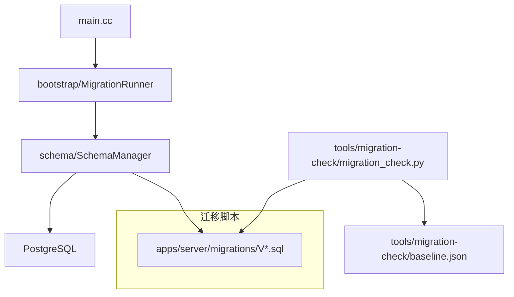
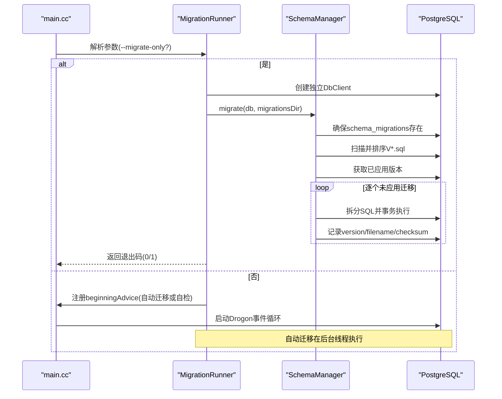
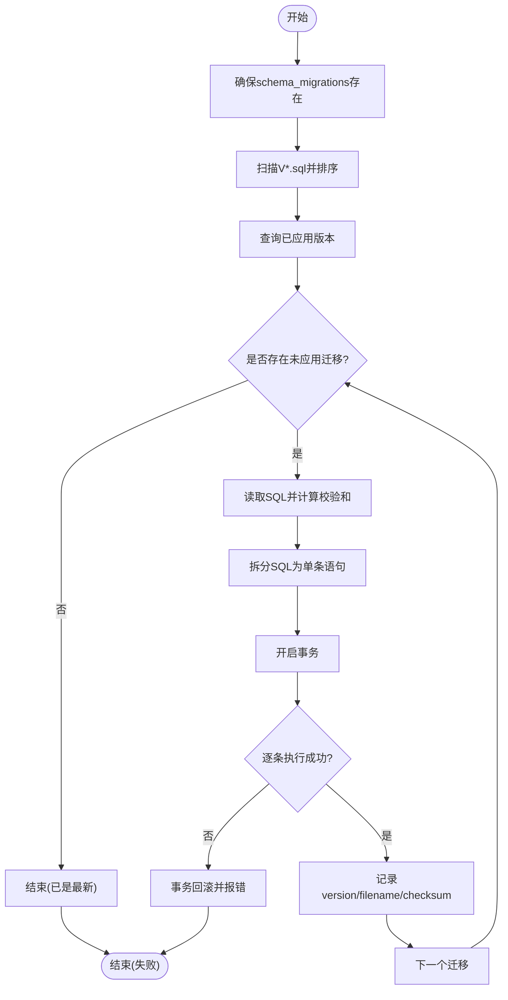
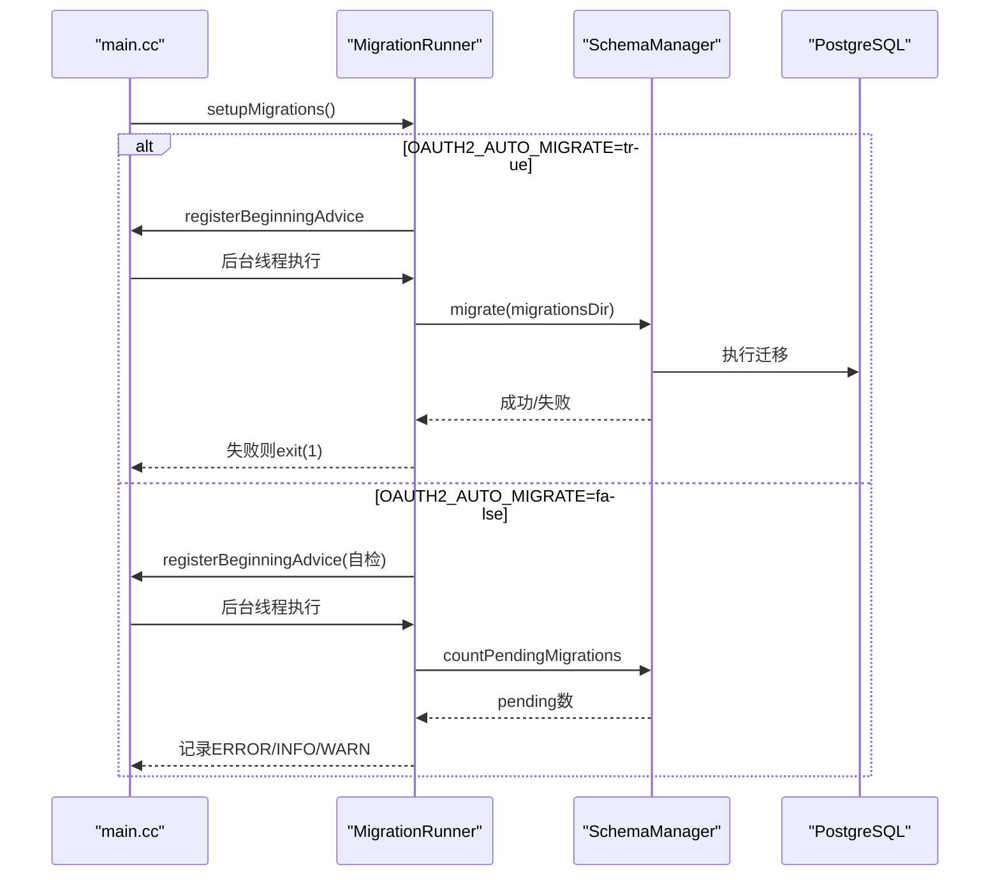
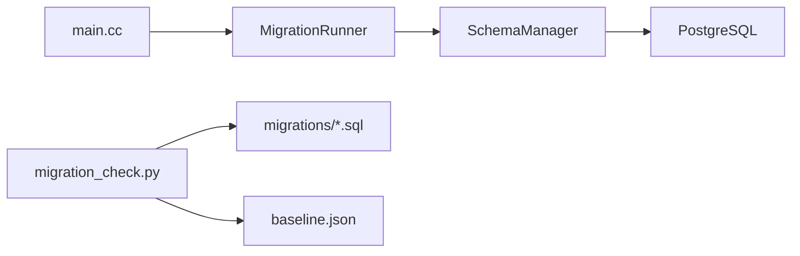

# 迁移管理

<cite>
**本文引用的文件**
- [SchemaManager.h](file://apps/server/src/SchemaManager.h)
- [SchemaManager.cc](file://apps/server/src/SchemaManager.cc)
- [MigrationRunner.h](file://apps/server/src/bootstrap/MigrationRunner.h)
- [MigrationRunner.cc](file://apps/server/src/bootstrap/MigrationRunner.cc)
- [main.cc](file://apps/server/src/main.cc)
- [V001__schema_migrations.sql](file://apps/server/migrations/V001__schema_migrations.sql)
- [V002__oauth2_core.sql](file://apps/server/migrations/V002__oauth2_core.sql)
- [V004__users_table.sql](file://apps/server/migrations/V004__users_table.sql)
- [migration_check.py](file://tools/migration-check/migration_check.py)
- [baseline.json](file://tools/migration-check/baseline.json)
</cite>

## 目录
1. [简介](#简介)
2. [项目结构](#项目结构)
3. [核心组件](#核心组件)
4. [架构总览](#架构总览)
5. [详细组件分析](#详细组件分析)
6. [依赖关系分析](#依赖关系分析)
7. [性能考虑](#性能考虑)
8. [故障排查指南](#故障排查指南)
9. [结论](#结论)
10. [附录](#附录)

## 简介
本文件面向数据库迁移管理系统，系统性说明 SchemaManager 的工作原理与实现机制、迁移文件的命名规范与版本控制策略、迁移执行流程（含依赖解析、事务处理与错误恢复）、回滚策略与数据一致性保证、最佳实践（向后兼容性、备份与测试），以及生产环境的安全与监控方案。同时提供常见迁移场景示例指引与工具链使用建议。

## 项目结构
- 迁移脚本位于 apps/server/migrations，采用 VNNN__描述.sql 的命名约定，按版本号顺序执行。
- 运行时由 bootstrap/MigrationRunner 负责发现迁移目录、根据环境变量决定是否自动迁移或仅做自检；当以 --migrate-only 启动时，独立构建 DbClient 并同步执行迁移后退出。
- 核心迁移逻辑在 schema::SchemaManager，负责建表跟踪、扫描文件、去重排序、拆分 SQL、事务执行与记录校验和。
- CI/CD 通过 tools/migration-check/migration_check.py 对迁移文件进行静态检查与基线校验，确保可重复性与安全性。

图表来源
- [main.cc:97-239](file://apps/server/src/main.cc#L97-L239)
- [MigrationRunner.cc:53-165](file://apps/server/src/bootstrap/MigrationRunner.cc#L53-L165)
- [SchemaManager.cc:175-233](file://apps/server/src/SchemaManager.cc#L175-L233)
- [migration_check.py:237-276](file://tools/migration-check/migration_check.py#L237-L276)

章节来源
- [main.cc:97-239](file://apps/server/src/main.cc#L97-L239)
- [MigrationRunner.cc:53-165](file://apps/server/src/bootstrap/MigrationRunner.cc#L53-L165)
- [SchemaManager.cc:175-233](file://apps/server/src/SchemaManager.cc#L175-L233)
- [migration_check.py:237-276](file://tools/migration-check/migration_check.py#L237-L276)

## 核心组件
- SchemaManager：提供 migrate、countPendingMigrations、splitSqlStatements 等能力；维护 schema_migrations 跟踪表；按版本顺序应用未执行的迁移；为每个已应用迁移记录文件名与 SHA-256 校验和。
- MigrationRunner：定位迁移目录、根据 OAUTH2_AUTO_MIGRATE 决定自动迁移或自检；支持 --migrate-only 模式用于 Helm pre-install/pre-upgrade Hook Job；失败时终止进程以避免半迁移状态服务流量。
- 迁移脚本：遵循幂等与向前兼容原则，避免破坏性语句，确保可重入执行。
- 迁移检查工具：强制命名、序列连续性、幂等性、前向安全、内容不可变（基线）等规则。

章节来源
- [SchemaManager.h:20-96](file://apps/server/src/SchemaManager.h#L20-L96)
- [SchemaManager.cc:14-423](file://apps/server/src/SchemaManager.cc#L14-L423)
- [MigrationRunner.h:20-43](file://apps/server/src/bootstrap/MigrationRunner.h#L20-L43)
- [MigrationRunner.cc:17-165](file://apps/server/src/bootstrap/MigrationRunner.cc#L17-L165)
- [migration_check.py:1-52](file://tools/migration-check/migration_check.py#L1-L52)

## 架构总览
系统启动流程：
- main 加载配置，若检测到 --migrate-only 则调用 runMigrateOnly 直接执行迁移并退出。
- 否则注册控制器、中间件、OpenAPI 等，再调用 setupMigrations。
- setupMigrations 探测迁移目录，若 OAUTH2_AUTO_MIGRATE=true 则在 beginning advice 中异步执行迁移；否则注册自检逻辑，比较磁盘迁移与已应用版本并记录日志。

图表来源
- [main.cc:97-239](file://apps/server/src/main.cc#L97-L239)
- [MigrationRunner.cc:53-165](file://apps/server/src/bootstrap/MigrationRunner.cc#L53-L165)
- [SchemaManager.cc:175-233](file://apps/server/src/SchemaManager.cc#L175-L233)

## 详细组件分析

### SchemaManager 工作原理
- 跟踪表：确保 schema_migrations(version PK, filename, checksum, applied_at) 存在。
- 扫描与排序：匹配 V(\d+)__.+\.sql，提取版本号并按数值升序排列。
- 已应用版本：查询 schema_migrations.version 集合。
- 执行迁移：读取 SQL，计算 SHA-256 校验和，拆分为单条语句（忽略注释、字符串、美元引用块中的分号），在单个事务中逐条执行；成功后插入 version/filename/checksum。
- 计数待迁移：在不进入完整迁移流程的情况下，统计磁盘上未记录的迁移数量，供自检使用。

图表来源
- [SchemaManager.cc:175-233](file://apps/server/src/SchemaManager.cc#L175-L233)
- [SchemaManager.cc:274-351](file://apps/server/src/SchemaManager.cc#L274-L351)
- [SchemaManager.cc:353-411](file://apps/server/src/SchemaManager.cc#L353-L411)
- [SchemaManager.cc:14-162](file://apps/server/src/SchemaManager.cc#L14-L162)

章节来源
- [SchemaManager.h:20-96](file://apps/server/src/SchemaManager.h#L20-L96)
- [SchemaManager.cc:14-423](file://apps/server/src/SchemaManager.cc#L14-L423)

### 迁移执行入口与生命周期
- 自动迁移：OAUTH2_AUTO_MIGRATE=true 时，在 beginning advice 中于后台线程延迟执行迁移；失败则致命日志并退出进程，避免半迁移状态继续服务。
- 自检模式：OAUTH2_AUTO_MIGRATE=false 时，启动后比较磁盘迁移与已应用版本，若有滞后则记录 ERROR 提示运行迁移 Job。
- 仅迁移模式：--migrate-only 模式下，不启动 HTTP 服务，构造独立 DbClient 同步执行迁移并返回退出码，便于 Kubernetes Hook Job 编排。

图表来源
- [MigrationRunner.cc:53-128](file://apps/server/src/bootstrap/MigrationRunner.cc#L53-L128)
- [SchemaManager.cc:235-272](file://apps/server/src/SchemaManager.cc#L235-L272)
- [main.cc:234-238](file://apps/server/src/main.cc#L234-L238)

章节来源
- [MigrationRunner.h:20-43](file://apps/server/src/bootstrap/MigrationRunner.h#L20-L43)
- [MigrationRunner.cc:53-165](file://apps/server/src/bootstrap/MigrationRunner.cc#L53-L165)
- [main.cc:97-239](file://apps/server/src/main.cc#L97-L239)

### 迁移文件命名规范与版本控制策略
- 命名规范：VNNN__snake_case.sql，其中 NNN 为三位零填充数字。
- 版本策略：从 V001 起始连续递增，不允许重复或缺失；CI 通过 glob 按字典序应用，要求固定宽度以保证字典序等于数值序。
- 幂等性：CREATE TABLE/INDEX 需 IF NOT EXISTS；ADD COLUMN 需 IF NOT EXISTS；INSERT 需 ON CONFLICT；函数定义需 CREATE OR REPLACE；新增约束需先 DROP CONSTRAINT IF EXISTS。
- 前向安全：禁止 DROP TABLE/COLUMN/TRUNCATE/DROP SCHEMA/DROP DATABASE 及顶层 DELETE FROM；允许 DROP CONSTRAINT IF EXISTS 与 DROP NOT NULL。
- 不可变性：已应用的迁移内容必须保持不变；新增变更通过新版本号迁移完成；工具通过 baseline.json 校验内容哈希。

章节来源
- [migration_check.py:17-52](file://tools/migration-check/migration_check.py#L17-L52)
- [migration_check.py:64-200](file://tools/migration-check/migration_check.py#L64-L200)
- [baseline.json:1-24](file://tools/migration-check/baseline.json#L1-L24)

### 依赖解析与执行顺序
- 依赖解析：基于文件名中的版本号进行数值排序，确保严格顺序执行。
- 执行顺序：按 V001→V002→... 的顺序逐一应用未记录版本；同一版本不会重复执行。
- 多语句拆分：splitSqlStatements 识别行注释、块注释、单引号字符串、美元引用块，仅在顶级分号处拆分，避免误切分。

章节来源
- [SchemaManager.cc:295-333](file://apps/server/src/SchemaManager.cc#L295-L333)
- [SchemaManager.cc:14-162](file://apps/server/src/SchemaManager.cc#L14-L162)

### 事务处理与错误恢复
- 事务边界：每个迁移文件在一个事务内执行所有语句；任一语句失败将导致整个事务回滚，且该版本不会被记录。
- 错误恢复：失败时记录错误日志并停止后续迁移；自动迁移模式下会终止进程，防止半迁移状态对外提供服务。
- 健壮性：空迁移文件会被跳过；无法打开文件或执行异常均会记录错误并返回失败。

章节来源
- [SchemaManager.cc:353-411](file://apps/server/src/SchemaManager.cc#L353-L411)
- [MigrationRunner.cc:77-93](file://apps/server/src/bootstrap/MigrationRunner.cc#L77-L93)

### 回滚策略与数据一致性保证
- 回滚策略：系统采用“向前演进”的不可变迁移策略，不提供 down-migration；如需回滚，应通过外部手段（如备份恢复、临时补丁迁移）实现。
- 一致性保证：
  - 每步迁移在事务中执行，原子提交。
  - 记录 filename 与 SHA-256 校验和，配合 baseline.json 保障内容不可变。
  - 幂等设计确保多次执行不会产生副作用。
  - 自检模式在滚动升级期间提示滞后，避免旧副本服务不一致。

章节来源
- [SchemaManager.cc:396-402](file://apps/server/src/SchemaManager.cc#L396-L402)
- [migration_check.py:203-234](file://tools/migration-check/migration_check.py#L203-L234)
- [MigrationRunner.cc:95-128](file://apps/server/src/bootstrap/MigrationRunner.cc#L95-L128)

### 最佳实践
- 向后兼容性：
  - 优先采用增量变更（新增列、新增表、新增索引），避免删除或修改已有结构。
  - 对必填字段变更采用“双写”策略：先新增列并写入默认值，再逐步切换代码路径，最后移除旧列。
- 数据备份：
  - 在生产执行前进行全量或快照备份；Helm Hook Job 应在部署前执行并验证结果。
- 测试策略：
  - 本地与 CI 均运行 migration_check.py 确保规则合规。
  - 在集成测试中应用迁移脚本并验证关键结构与查询。
  - 对复杂迁移编写专项测试用例，覆盖边界条件与并发场景。

[本节为通用指导，不直接分析具体文件]

### 常见迁移场景示例
- 表结构变更：新增列或表时使用 IF NOT EXISTS；新增约束前先 DROP CONSTRAINT IF EXISTS。
- 索引优化：新增唯一或非唯一索引时使用 IF NOT EXISTS；必要时结合分区或覆盖索引提升查询性能。
- 数据修复：使用 INSERT ... ON CONFLICT 进行幂等写入；避免顶层 DELETE FROM；如需清理，使用带条件的 UPDATE 或分批处理。
- 多租户扩展：新增 tenant_id 列并在历史表中回填默认值；逐步引入路由与权限判断。

[本节为概念性示例，不直接分析具体文件]

## 依赖关系分析
- main.cc 负责装配与启动，调用 bootstrap 模块完成迁移相关设置。
- MigrationRunner 依赖 SchemaManager 执行迁移；在 --migrate-only 模式下自建 DbClient。
- SchemaManager 依赖 Drogon ORM 的 DbClient 与 PostgreSQL 驱动；使用 OpenSSL 提供的 SHA-256 计算校验和。
- 迁移检查工具独立于运行时，用于 CI 与开发阶段的质量门禁。

图表来源
- [main.cc:97-239](file://apps/server/src/main.cc#L97-L239)
- [MigrationRunner.cc:17-165](file://apps/server/src/bootstrap/MigrationRunner.cc#L17-L165)
- [SchemaManager.cc:175-423](file://apps/server/src/SchemaManager.cc#L175-L423)
- [migration_check.py:237-276](file://tools/migration-check/migration_check.py#L237-L276)

章节来源
- [main.cc:97-239](file://apps/server/src/main.cc#L97-L239)
- [MigrationRunner.cc:17-165](file://apps/server/src/bootstrap/MigrationRunner.cc#L17-L165)
- [SchemaManager.cc:175-423](file://apps/server/src/SchemaManager.cc#L175-L423)
- [migration_check.py:237-276](file://tools/migration-check/migration_check.py#L237-L276)

## 性能考虑
- 事务粒度：每个迁移文件一个事务，减少锁竞争与回滚成本；大迁移建议拆分为多个小版本以提升可观测性与可控性。
- SQL 拆分：splitSqlStatements 避免预处理限制，但过多语句会增加网络往返；建议合理组织 SQL 以减少语句数量。
- 自检开销：countPendingMigrations 仅查询版本列表与扫描目录，开销较低，适合每次启动执行。
- 连接池：--migrate-only 模式使用最小连接池（1），避免阻塞主事件循环；生产自动迁移在后台线程执行，不影响请求处理。

[本节为通用指导，不直接分析具体文件]

## 故障排查指南
- 迁移目录未找到：检查 locateMigrationsDir 的相对路径；确认镜像或部署路径包含 migrations 目录。
- 自动迁移未执行：确认 OAUTH2_AUTO_MIGRATE=true；查看 beginning advice 是否注册成功；检查数据库连接与权限。
- 迁移失败：查看日志中的错误信息；确认 SQL 是否符合幂等与前向安全规则；必要时回滚到上一版本并修复。
- 自检告警：若出现“schema behind binary”，请运行迁移 Job 或启用自动迁移；滚动升级期间旧副本可能观察到滞后属正常现象。
- 基线校验失败：运行 migration_check.py 并更新 baseline.json；确保已应用迁移未被修改或删除。

章节来源
- [MigrationRunner.cc:53-128](file://apps/server/src/bootstrap/MigrationRunner.cc#L53-L128)
- [SchemaManager.cc:175-233](file://apps/server/src/SchemaManager.cc#L175-L233)
- [migration_check.py:237-276](file://tools/migration-check/migration_check.py#L237-L276)

## 结论
本迁移管理系统以 SchemaManager 为核心，结合 MigrationRunner 的灵活入口与严格的迁移检查工具，实现了安全、可追溯、幂等的数据库版本演进。通过事务化执行、校验和记录与基线保护，系统在开发与生产环境中均能提供一致性与可靠性保障。推荐在生产中采用 Helm Hook Job 执行迁移并结合自检模式，确保滚动升级期间的稳定性与可观测性。

[本节为总结性内容，不直接分析具体文件]

## 附录

### 迁移文件示例参考
- V001__schema_migrations.sql：初始化跟踪表，记录已应用迁移的版本、文件名与校验和。
- V002__oauth2_core.sql：创建 OAuth2 核心表（客户端、授权码、访问令牌、刷新令牌），使用 IF NOT EXISTS 保证幂等。
- V004__users_table.sql：创建用户表，包含用户名、密码哈希、盐与邮箱等字段。

章节来源
- [V001__schema_migrations.sql:1-10](file://apps/server/migrations/V001__schema_migrations.sql#L1-L10)
- [V002__oauth2_core.sql:1-57](file://apps/server/migrations/V002__oauth2_core.sql#L1-L57)
- [V004__users_table.sql:1-11](file://apps/server/migrations/V004__users_table.sql#L1-L11)

### 生产环境安全与监控
- 安全考虑：
  - 使用 --migrate-only 模式在隔离环境中执行迁移，避免与业务流量共享连接池。
  - 严格控制数据库账户权限，仅授予必要 DDL/DML 权限。
  - 敏感信息（如密码）不记录到日志；连接字符串由配置管理。
- 监控方案：
  - 记录迁移开始、结束、失败与自检结果日志，便于审计与告警。
  - 在 Helm Hook Job 中设置 activeDeadlineSeconds 限制执行时间，超时即失败。
  - 结合 Prometheus/Grafana 采集应用指标与数据库慢查询，辅助定位性能瓶颈。

[本节为通用指导，不直接分析具体文件]