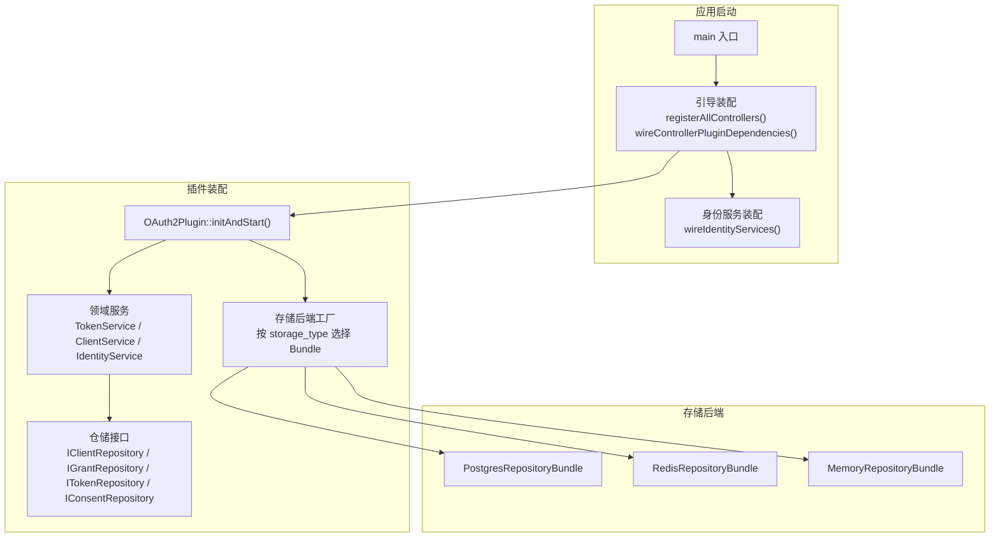
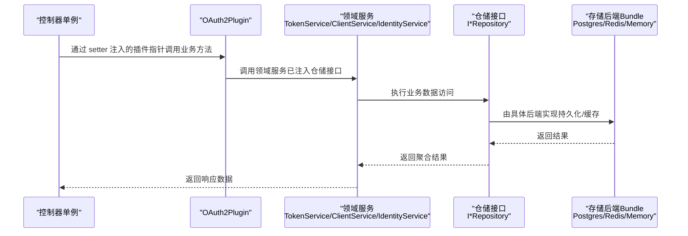
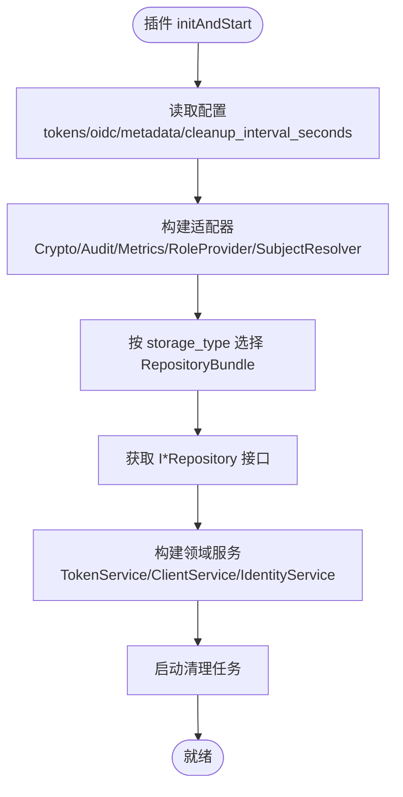
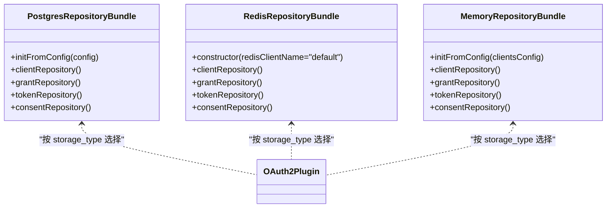
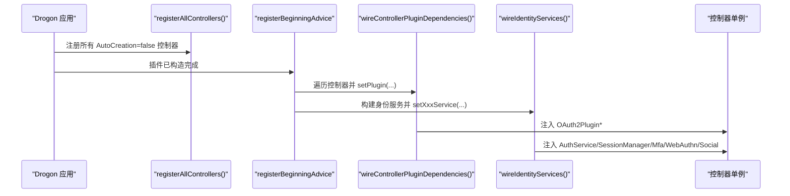
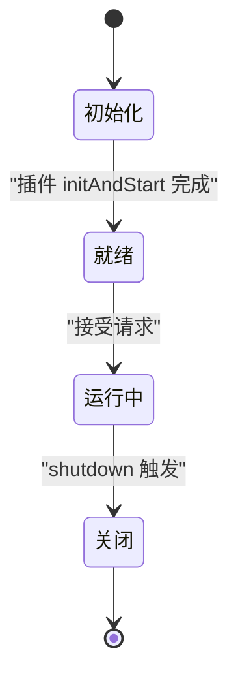
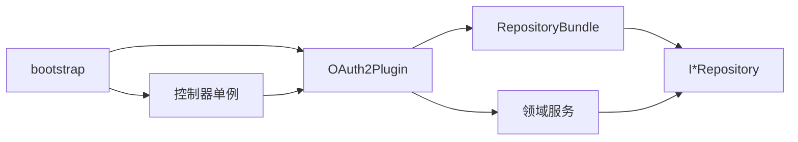

# 依赖注入与工厂模式

<cite>
**本文引用的文件**
- [OAuth2Plugin.cc](file://libs/drogon/src/plugin/OAuth2Plugin.cc)
- [IdentityAssembly.h](file://apps/server/src/bootstrap/IdentityAssembly.h)
- [IdentityAssembly.cc](file://apps/server/src/bootstrap/IdentityAssembly.cc)
- [ControllerRegistration.h](file://apps/server/src/bootstrap/ControllerRegistration.h)
- [PostgresRepositoryBundle.h](file://libs/storage-postgres/include/authforge/storage/postgres/PostgresRepositoryBundle.h)
- [RedisRepositoryBundle.h](file://libs/storage-redis/include/authforge/storage/redis/RedisRepositoryBundle.h)
- [MemoryRepositoryBundle.h](file://libs/storage-memory/include/authforge/storage/memory/MemoryRepositoryBundle.h)
- [configuration-guide.md](file://docs/backend/configuration-guide.md)
- [architecture-overview.md](file://docs/backend/architecture-overview.md)
- [CategoryA_StorageLifetimeContractTest.cc](file://tests/integration/concurrency/CategoryA_StorageLifetimeContractTest.cc)
- [SocialMockFixture.h](file://tests/common/SocialMockFixture.h)
</cite>

## 目录
1. [简介](#简介)
2. [项目结构](#项目结构)
3. [核心组件](#核心组件)
4. [架构总览](#架构总览)
5. [详细组件分析](#详细组件分析)
6. [依赖关系分析](#依赖关系分析)
7. [性能考量](#性能考量)
8. [故障排查指南](#故障排查指南)
9. [结论](#结论)
10. [附录](#附录)

## 简介
本文件系统性阐述 AuthForge 在依赖注入（DI）与工厂模式方面的设计与实现，覆盖：
- 依赖注入容器的设计思路与生命周期管理
- 服务注册与解析机制（基于 Drogon 的控制器单例与装配器）
- 存储后端选择中的工厂模式（按配置装配不同 RepositoryBundle）
- 单例与对象生命周期（启动期一次性构造、进程级共享）
- 通过配置实现松耦合装配（storage_type、custom_config）
- 最佳实践与常见问题（初始化顺序、线程安全、回退路径）
- 测试环境下的依赖模拟与替换策略

## 项目结构
AuthForge 将“协议层”“领域服务”“适配器/基础设施”“存储后端”分层组织。依赖注入主要发生在两个层面：
- 插件层：OAuth2Plugin 作为装配中心，根据配置创建并持有各服务实例，并将仓储接口注入到领域服务中。
- 应用层：bootstrap 模块在 Drogon 启动早期完成控制器单例的依赖注入（setter 注入），以及身份相关服务的装配。

图示来源
- [OAuth2Plugin.cc:30-200](file://libs/drogon/src/plugin/OAuth2Plugin.cc#L30-L200)
- [ControllerRegistration.h:13-34](file://apps/server/src/bootstrap/ControllerRegistration.h#L13-L34)
- [IdentityAssembly.cc:61-213](file://apps/server/src/bootstrap/IdentityAssembly.cc#L61-L213)
- [PostgresRepositoryBundle.h:29-93](file://libs/storage-postgres/include/authforge/storage/postgres/PostgresRepositoryBundle.h#L29-L93)
- [RedisRepositoryBundle.h:29-84](file://libs/storage-redis/include/authforge/storage/redis/RedisRepositoryBundle.h#L29-L84)
- [MemoryRepositoryBundle.h:32-77](file://libs/storage-memory/include/authforge/storage/memory/MemoryRepositoryBundle.h#L32-L77)

章节来源
- [OAuth2Plugin.cc:30-200](file://libs/drogon/src/plugin/OAuth2Plugin.cc#L30-L200)
- [ControllerRegistration.h:13-34](file://apps/server/src/bootstrap/ControllerRegistration.h#L13-L34)
- [IdentityAssembly.h:16-40](file://apps/server/src/bootstrap/IdentityAssembly.h#L16-L40)
- [IdentityAssembly.cc:61-213](file://apps/server/src/bootstrap/IdentityAssembly.cc#L61-L213)

## 核心组件
- OAuth2Plugin：插件即装配器。读取配置后创建 JWK 管理器、角色提供者、审计与指标适配器，并通过存储后端工厂获取仓储接口，再组装 TokenService、ClientService、IdentityService 等。
- 存储后端工厂：通过 storage_type 选择 Postgres/Redis/Memory 的 RepositoryBundle，统一暴露 IClientRepository/IGrantRepository/ITokenRepository/IConsentRepository。
- 引导装配（bootstrap）：在 Drogon 启动早期注册控制器单例，并在 registerBeginningAdvice 回调中将插件指针注入到控制器；随后装配身份服务并注入到对应控制器。
- 身份服务装配：构建 PostgresIdentityRepository、Mfa/WebAuthn/Social 仓储与对应服务，通过 setter 注入到 SessionController/MfaController/WebAuthnController 及社交登录控制器。

章节来源
- [OAuth2Plugin.cc:30-200](file://libs/drogon/src/plugin/OAuth2Plugin.cc#L30-L200)
- [PostgresRepositoryBundle.h:29-93](file://libs/storage-postgres/include/authforge/storage/postgres/PostgresRepositoryBundle.h#L29-L93)
- [RedisRepositoryBundle.h:29-84](file://libs/storage-redis/include/authforge/storage/redis/RedisRepositoryBundle.h#L29-L84)
- [MemoryRepositoryBundle.h:32-77](file://libs/storage-memory/include/authforge/storage/memory/MemoryRepositoryBundle.h#L32-L77)
- [ControllerRegistration.h:13-34](file://apps/server/src/bootstrap/ControllerRegistration.h#L13-L34)
- [IdentityAssembly.cc:61-213](file://apps/server/src/bootstrap/IdentityAssembly.cc#L61-L213)

## 架构总览
下图展示从请求进入控制器到调用领域服务、仓储接口的完整链路，体现 DI 与工厂模式的协作。

图示来源
- [OAuth2Plugin.cc:118-199](file://libs/drogon/src/plugin/OAuth2Plugin.cc#L118-L199)
- [PostgresRepositoryBundle.h:29-93](file://libs/storage-postgres/include/authforge/storage/postgres/PostgresRepositoryBundle.h#L29-L93)
- [RedisRepositoryBundle.h:29-84](file://libs/storage-redis/include/authforge/storage/redis/RedisRepositoryBundle.h#L29-L84)
- [MemoryRepositoryBundle.h:32-77](file://libs/storage-memory/include/authforge/storage/memory/MemoryRepositoryBundle.h#L32-L77)

## 详细组件分析

### 组件一：OAuth2Plugin 装配器与服务生命周期
- 职责
  - 读取配置：TTL、OIDC/JWK、issuer、清理间隔等
  - 创建适配器：加密、审计、指标、角色提供者、主题解析器
  - 通过存储后端工厂获取仓储接口，并注入到领域服务
  - 启动清理任务（定时过期数据清理）
- 生命周期
  - 插件在 Drogon 运行前由配置反射构造，initAndStart 中完成所有一次性初始化
  - 服务与仓储以 shared_ptr 持有，保证生命周期覆盖请求处理周期
  - issuer、JWK 等在启动时构建并发布为只读共享引用，避免并发写风险

图示来源
- [OAuth2Plugin.cc:30-200](file://libs/drogon/src/plugin/OAuth2Plugin.cc#L30-L200)

章节来源
- [OAuth2Plugin.cc:30-200](file://libs/drogon/src/plugin/OAuth2Plugin.cc#L30-L200)

### 组件二：存储后端工厂（按配置选择 Bundle）
- 设计要点
  - 通过 config.storage_type 决定使用 Postgres/Redis/Memory 的 RepositoryBundle
  - 每个 Bundle 提供统一的 I*Repository 接口集合，屏蔽后端差异
  - Postgres/Redis/Memory 分别封装各自的后端连接与初始化逻辑
- 配置驱动
  - storage_type 为 postgres 时为生产推荐
  - redis 已弃用（仅兼容），memory 用于测试
  - custom_config.metadata.issuer 作为签发者 URL 的唯一来源

图示来源
- [PostgresRepositoryBundle.h:29-93](file://libs/storage-postgres/include/authforge/storage/postgres/PostgresRepositoryBundle.h#L29-L93)
- [RedisRepositoryBundle.h:29-84](file://libs/storage-redis/include/authforge/storage/redis/RedisRepositoryBundle.h#L29-L84)
- [MemoryRepositoryBundle.h:32-77](file://libs/storage-memory/include/authforge/storage/memory/MemoryRepositoryBundle.h#L32-L77)
- [configuration-guide.md:59-77](file://docs/backend/configuration-guide.md#L59-L77)

章节来源
- [PostgresRepositoryBundle.h:29-93](file://libs/storage-postgres/include/authforge/storage/postgres/PostgresRepositoryBundle.h#L29-L93)
- [RedisRepositoryBundle.h:29-84](file://libs/storage-redis/include/authforge/storage/redis/RedisRepositoryBundle.h#L29-L84)
- [MemoryRepositoryBundle.h:32-77](file://libs/storage-memory/include/authforge/storage/memory/MemoryRepositoryBundle.h#L32-L77)
- [configuration-guide.md:59-77](file://docs/backend/configuration-guide.md#L59-L77)
- [architecture-overview.md:79-118](file://docs/backend/architecture-overview.md#L79-L118)

### 组件三：控制器单例与 setter 注入（去全局查找）
- 背景
  - 控制器以 AutoCreation=false 方式静态注册，Drogon 在 run() 前完成注册
  - 插件在 run() 后才由配置反射构造，因此无法在控制器构造函数中注入插件
- 方案
  - 在 registerBeginningAdvice 回调中，通过 DrClassMap 获取已注册的控制器单例，调用 setPlugin(OAuth2Plugin*) 完成注入
  - 控制器内部优先使用注入的插件指针，未设置时回退到全局查找，保持向后兼容
- 身份服务装配
  - wireIdentityServices() 在相同时机构建身份服务与仓储，并通过 setter 注入到 SessionController/MfaController/WebAuthnController 及社交登录控制器
  - 对 memory 存储或无默认 DB 客户端的场景，跳过装配并保留旧路径回退

图示来源
- [ControllerRegistration.h:13-34](file://apps/server/src/bootstrap/ControllerRegistration.h#L13-L34)
- [IdentityAssembly.cc:61-213](file://apps/server/src/bootstrap/IdentityAssembly.cc#L61-L213)

章节来源
- [ControllerRegistration.h:13-34](file://apps/server/src/bootstrap/ControllerRegistration.h#L13-L34)
- [IdentityAssembly.cc:61-213](file://apps/server/src/bootstrap/IdentityAssembly.cc#L61-L213)

### 组件四：单例与生命周期管理
- 单例范围
  - 控制器与插件均为 Drogon 管理的单例，进程内唯一
  - 服务与仓储以 shared_ptr 持有，确保跨组件共享且生命周期可控
- 关键约束
  - 初始化顺序：先注册控制器，再在 registerBeginningAdvice 中注入依赖
  - 资源释放：插件 shutdown 中停止清理任务并释放存储，需避免服务仍在使用已释放资源
  - 并发安全：JWK 管理器在启动时初始化并发布为 const 引用，避免运行时并发写

图示来源
- [OAuth2Plugin.cc:30-200](file://libs/drogon/src/plugin/OAuth2Plugin.cc#L30-L200)
- [CategoryA_StorageLifetimeContractTest.cc:1-121](file://tests/integration/concurrency/CategoryA_StorageLifetimeContractTest.cc#L1-L121)

章节来源
- [CategoryA_StorageLifetimeContractTest.cc:1-121](file://tests/integration/concurrency/CategoryA_StorageLifetimeContractTest.cc#L1-L121)

### 组件五：配置驱动的松耦合装配
- storage_type：选择存储后端（postgres/redis/memory）
- custom_config.metadata.issuer：签发者 URL，集中读取一次并标准化
- custom_config.external_auth.*：第三方登录配置（Google/WeChat/GitHub）
- custom_config.webauthn：WebAuthn RP 标识与名称
- 原则
  - 配置在启动时读取并固化到服务构造参数，避免请求期重复读取
  - 通过 Bundle 抽象后端差异，上层仅依赖 I*Repository 接口

章节来源
- [configuration-guide.md:59-77](file://docs/backend/configuration-guide.md#L59-L77)
- [IdentityAssembly.cc:103-184](file://apps/server/src/bootstrap/IdentityAssembly.cc#L103-L184)

## 依赖关系分析
- 低耦合点
  - 领域服务仅依赖 I*Repository 接口，不感知具体后端
  - 控制器通过 setter 注入依赖，便于测试替换
- 直接依赖
  - OAuth2Plugin 依赖各 Bundle 与适配器
  - bootstrap 模块依赖 Drogon 的单例管理与配置系统
- 潜在环依赖规避
  - 将 OpenAPI 生成等逻辑放在 libs/drogon，避免 apps/server 反向依赖 libs/drogon

图示来源
- [OAuth2Plugin.cc:118-199](file://libs/drogon/src/plugin/OAuth2Plugin.cc#L118-L199)
- [ControllerRegistration.h:13-34](file://apps/server/src/bootstrap/ControllerRegistration.h#L13-L34)

章节来源
- [OAuth2Plugin.cc:118-199](file://libs/drogon/src/plugin/OAuth2Plugin.cc#L118-L199)
- [ControllerRegistration.h:13-34](file://apps/server/src/bootstrap/ControllerRegistration.h#L13-L34)

## 性能考量
- 启动期一次性初始化：JWK、issuer、服务与仓储均在启动时构建，减少请求期开销
- 只读发布：JwkManager 发布为 const 引用，避免运行时锁竞争
- 配置集中读取：外部配置在启动时读取并固化到服务构造参数，避免每请求读取 JSON
- 清理任务：后台定时清理过期数据，降低存储膨胀

[本节为通用指导，无需特定文件来源]

## 故障排查指南
- 内存存储模式下身份服务未注入
  - 现象：memory 存储无默认 DB 客户端，身份服务装配跳过，控制器走旧路径
  - 排查：检查 storage_type 与 db_clients 配置；确认 wireIdentityServices 日志
  - 参考
    - [IdentityAssembly.cc:61-89](file://apps/server/src/bootstrap/IdentityAssembly.cc#L61-L89)
- 控制器插件指针为空
  - 现象：控制器未通过 setter 注入插件，回退到全局查找失败
  - 排查：确认 registerBeginningAdvice 中 wireControllerPluginDependencies 是否执行；控制器是否已注册
  - 参考
    - [ControllerRegistration.h:13-34](file://apps/server/src/bootstrap/ControllerRegistration.h#L13-L34)
- 存储后端选择错误
  - 现象：redis 模式拒绝 refresh_token grant；memory 模式不支持生产特性
  - 排查：检查 storage_type 与文档说明；迁移至 postgres
  - 参考
    - [configuration-guide.md:59-77](file://docs/backend/configuration-guide.md#L59-L77)
- 生命周期与并发问题
  - 现象：插件 shutdown 释放存储后服务仍持有原始指针导致悬垂引用
  - 排查：关注 CategoryA 测试用例描述；确保服务与存储生命周期一致
  - 参考
    - [CategoryA_StorageLifetimeContractTest.cc:1-121](file://tests/integration/concurrency/CategoryA_StorageLifetimeContractTest.cc#L1-L121)

章节来源
- [IdentityAssembly.cc:61-89](file://apps/server/src/bootstrap/IdentityAssembly.cc#L61-L89)
- [ControllerRegistration.h:13-34](file://apps/server/src/bootstrap/ControllerRegistration.h#L13-L34)
- [configuration-guide.md:59-77](file://docs/backend/configuration-guide.md#L59-L77)
- [CategoryA_StorageLifetimeContractTest.cc:1-121](file://tests/integration/concurrency/CategoryA_StorageLifetimeContractTest.cc#L1-L121)

## 结论
AuthForge 通过“插件即装配器 + 存储后端工厂 + 引导 setter 注入”的组合，实现了：
- 清晰的依赖边界与可插拔后端
- 稳定的生命周期与并发安全
- 配置驱动的松耦合装配
- 易于测试的依赖替换能力

建议在生产环境中：
- 使用 postgres 作为存储后端
- 在启动时集中读取并固化配置
- 严格遵循初始化顺序与生命周期约束
- 在测试中使用 setter 注入与 mock 替换依赖

[本节为总结性内容，无需特定文件来源]

## 附录

### 依赖注入最佳实践
- 明确单例范围：控制器与插件为进程级单例；服务与仓储以 shared_ptr 共享
- 初始化顺序：先注册控制器，再在 registerBeginningAdvice 中注入依赖
- 只读发布：启动时构建并发布不可变对象（如 JWK）
- 配置集中读取：避免请求期重复读取配置
- 回退路径：在无 DB 或 memory 模式下保留旧路径，保证兼容性

[本节为通用指导，无需特定文件来源]

### 测试环境下的依赖模拟与替换策略
- 使用 setter 注入将 mock 服务注入到控制器单例
- 通过函数局部 static shared_ptr 保存 mock，保证进程生命周期有效
- 注意线程安全：setter 写入与请求读取存在线程间访问，ThreadSanitizer 可能报警，需在合适条件下运行
- 参考
  - [SocialMockFixture.h:21-45](file://tests/common/SocialMockFixture.h#L21-L45)

章节来源
- [SocialMockFixture.h:21-45](file://tests/common/SocialMockFixture.h#L21-L45)