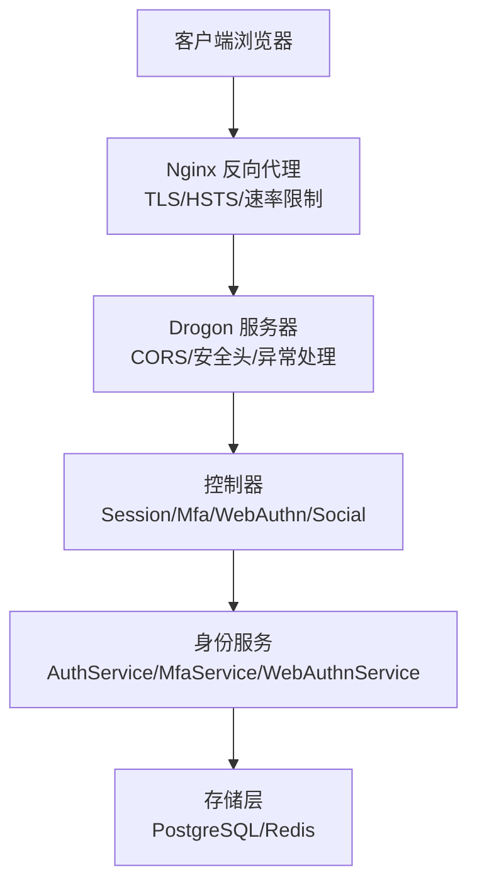
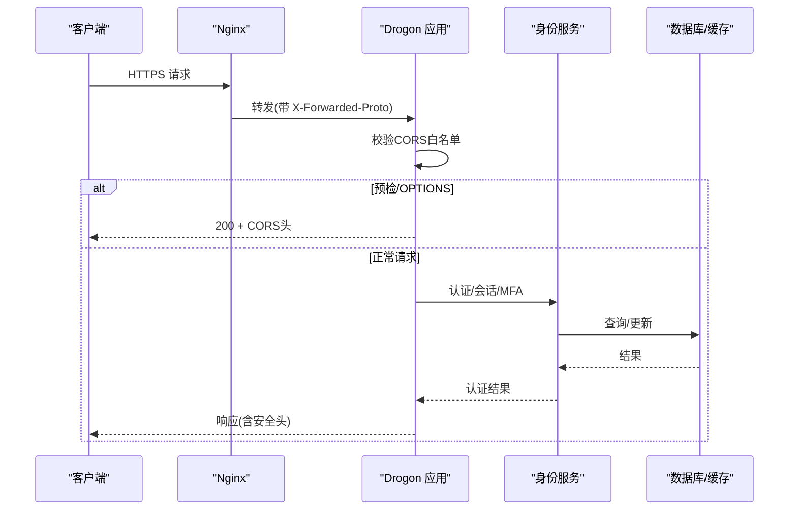
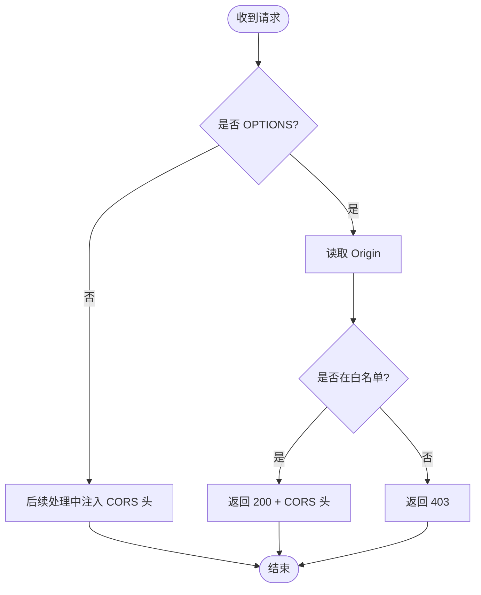
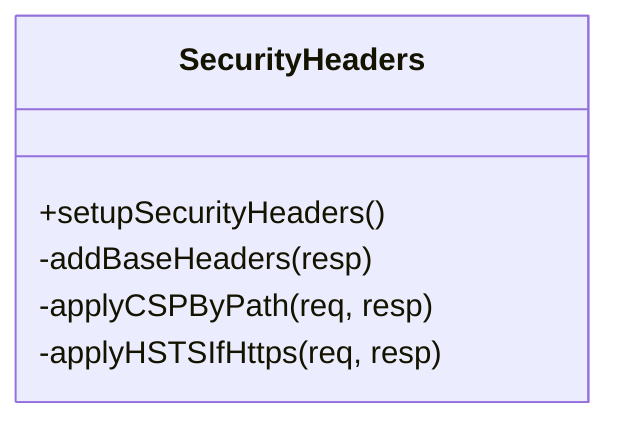
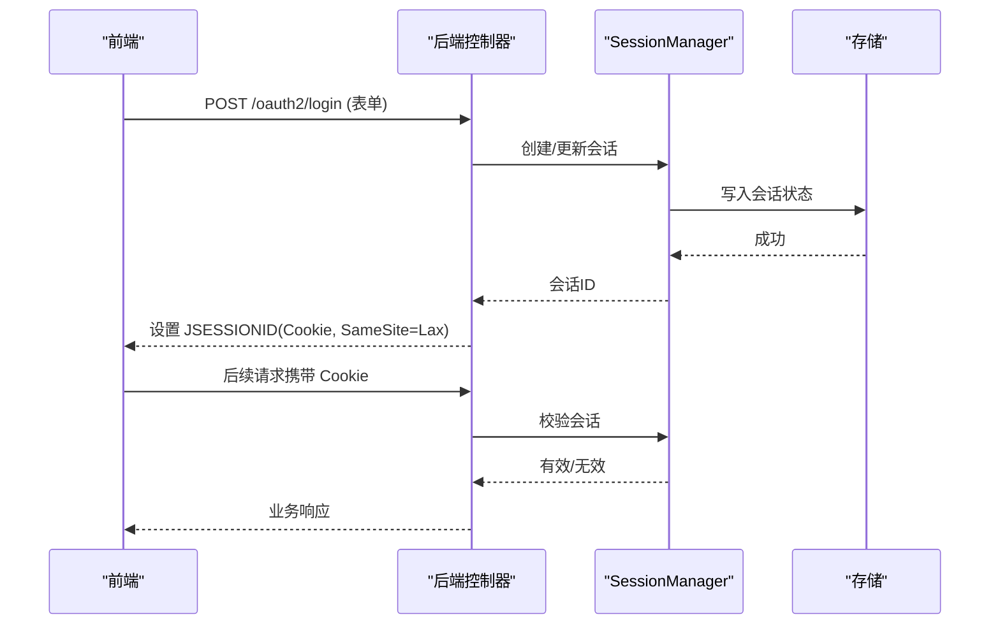
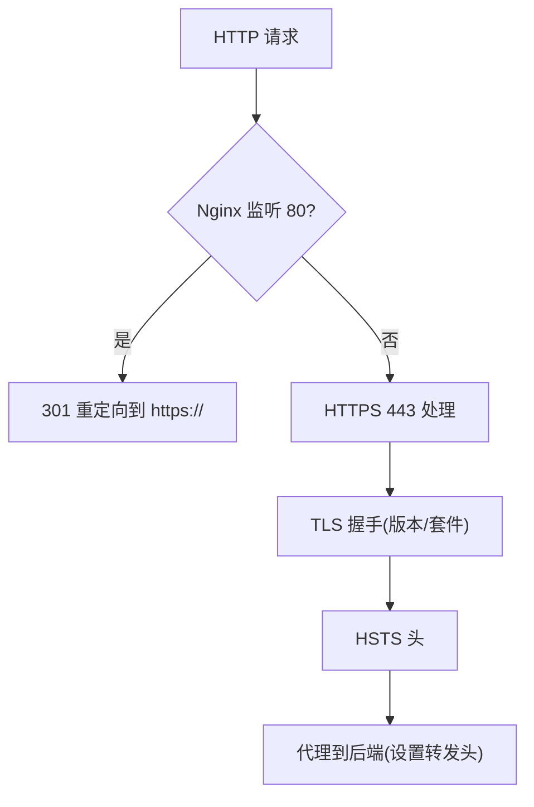
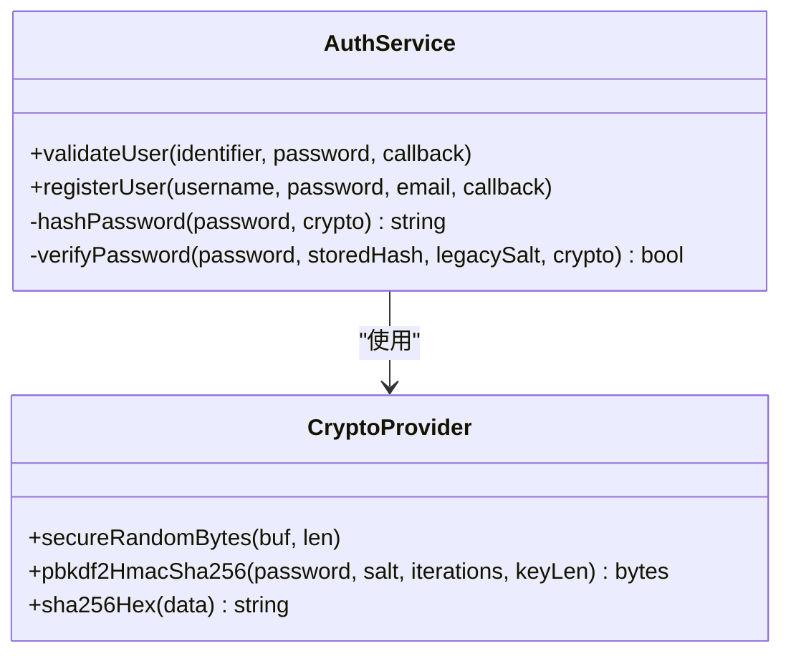
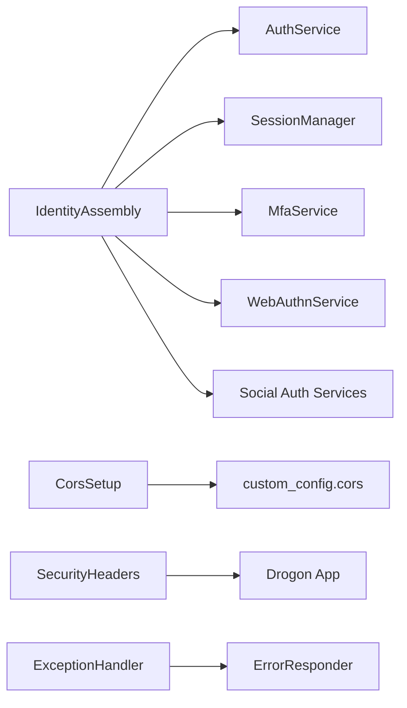

# 安全边界设计

<cite>
**本文引用的文件**
- [apps/server/src/bootstrap/CorsSetup.cc](file://apps/server/src/bootstrap/CorsSetup.cc)
- [apps/server/src/bootstrap/SecurityHeaders.cc](file://apps/server/src/bootstrap/SecurityHeaders.cc)
- [apps/server/src/bootstrap/IdentityAssembly.cc](file://apps/server/src/bootstrap/IdentityAssembly.cc)
- [apps/server/src/bootstrap/ExceptionHandlerSetup.cc](file://apps/server/src/bootstrap/ExceptionHandlerSetup.cc)
- [apps/server/config/config.json](file://apps/server/config/config.json)
- [apps/server/config/config.prod.json](file://apps/server/config/config.prod.json)
- [deploy/nginx/nginx.conf](file://deploy/nginx/nginx.conf)
- [scripts/generate-certs.sh](file://scripts/generate-certs.sh)
- [libs/identity/src/AuthService.cc](file://libs/identity/src/AuthService.cc)
- [docs/backend/security-hardening.md](file://docs/backend/security-hardening.md)
- [tests/security/injection/SecurityTest.cc](file://tests/security/injection/SecurityTest.cc)
- [frontends/admin/tests/e2e/security.spec.ts](file://frontends/admin/tests/e2e/security.spec.ts)
</cite>

## 目录
1. [简介](#简介)
2. [项目结构](#项目结构)
3. [核心组件](#核心组件)
4. [架构总览](#架构总览)
5. [详细组件分析](#详细组件分析)
6. [依赖关系分析](#依赖关系分析)
7. [性能与安全权衡](#性能与安全权衡)
8. [故障排查指南](#故障排查指南)
9. [结论](#结论)
10. [附录](#附录)

## 简介
本文件聚焦 AuthForge 的安全边界设计，围绕以下目标展开：系统安全架构原则与威胁模型、跨域资源共享（CORS）配置与安全考量、安全响应头与防护机制、输入验证与输出编码策略、会话管理与 CSRF 防护、HTTPS/TLS 配置与证书管理、敏感数据的加密存储与传输保护，以及安全配置最佳实践与常见漏洞防护。文档同时提供可视化图示与可操作的排障指引，帮助读者在理解原理的同时落地实施。

## 项目结构
AuthForge 后端基于 Drogon 框架，采用“启动引导 + 插件 + 控制器 + 服务”的分层组织方式。安全相关能力主要分布在：
- 启动引导层：CORS、安全头、异常处理、身份装配
- 配置层：应用配置、插件配置、自定义配置
- 网关层：Nginx 反向代理、TLS、速率限制、HSTS
- 业务层：认证服务、会话管理、MFA、WebAuthn、社交登录
- 前端层：以 Bearer Token 为主的安全实践与测试

**图表来源**
- [deploy/nginx/nginx.conf:33-114](file://deploy/nginx/nginx.conf#L33-L114)
- [apps/server/src/bootstrap/CorsSetup.cc:8-79](file://apps/server/src/bootstrap/CorsSetup.cc#L8-L79)
- [apps/server/src/bootstrap/SecurityHeaders.cc:8-59](file://apps/server/src/bootstrap/SecurityHeaders.cc#L8-L59)
- [apps/server/src/bootstrap/IdentityAssembly.cc:61-213](file://apps/server/src/bootstrap/IdentityAssembly.cc#L61-L213)

**章节来源**
- [deploy/nginx/nginx.conf:1-116](file://deploy/nginx/nginx.conf#L1-L116)
- [apps/server/config/config.json:1-212](file://apps/server/config/config.json#L1-L212)
- [apps/server/config/config.prod.json:1-264](file://apps/server/config/config.prod.json#L1-L264)

## 核心组件
- CORS 设置：严格白名单匹配 Origin，禁止通配符；预检请求与响应均注入必要头；未授权源返回 403。
- 安全响应头：全局注入 X-Content-Type-Options、X-Frame-Options；按路径差异化 CSP；仅在 HTTPS 或经反向代理转发时启用 HSTS。
- 异常处理：统一错误封装；OAuth2 协议端点遵循 RFC 6749 错误格式；非协议端点使用统一 Error Envelope；保证异常分支仍注入 CORS 头。
- 身份装配：启动时装配 AuthService、SessionManager、MfaService、WebAuthnService 及社交登录服务；根据存储类型与数据库可用性选择实现；读取外部认证配置一次化。
- 密码与凭据安全：PBKDF2-SHA256 哈希与迁移兼容；失败登录计数与账户锁定；支持旧哈希格式渐进升级。
- 速率限制：生产环境通过 Hodor 插件对关键接口进行细粒度限流；Nginx 层叠加 IP 级限流。
- TLS 与证书：Nginx 强制 HTTPS、配置 TLS 版本与套件、HSTS；提供自签名证书生成脚本用于开发测试。

**章节来源**
- [apps/server/src/bootstrap/CorsSetup.cc:8-79](file://apps/server/src/bootstrap/CorsSetup.cc#L8-L79)
- [apps/server/src/bootstrap/SecurityHeaders.cc:8-59](file://apps/server/src/bootstrap/SecurityHeaders.cc#L8-L59)
- [apps/server/src/bootstrap/ExceptionHandlerSetup.cc:13-63](file://apps/server/src/bootstrap/ExceptionHandlerSetup.cc#L13-L63)
- [apps/server/src/bootstrap/IdentityAssembly.cc:61-213](file://apps/server/src/bootstrap/IdentityAssembly.cc#L61-L213)
- [libs/identity/src/AuthService.cc:14-146](file://libs/identity/src/AuthService.cc#L14-L146)
- [apps/server/config/config.prod.json:141-187](file://apps/server/config/config.prod.json#L141-L187)
- [deploy/nginx/nginx.conf:33-114](file://deploy/nginx/nginx.conf#L33-L114)
- [scripts/generate-certs.sh:1-24](file://scripts/generate-certs.sh#L1-L24)

## 架构总览
下图展示从客户端到后端的完整安全边界链路：Nginx 负责 TLS、HSTS、IP 级速率限制；Drogon 应用层负责 CORS 白名单校验、安全头注入、异常规范化；身份服务负责密码哈希、会话与 MFA；存储层持久化用户与会话数据。

**图表来源**
- [deploy/nginx/nginx.conf:57-83](file://deploy/nginx/nginx.conf#L57-L83)
- [apps/server/src/bootstrap/CorsSetup.cc:32-79](file://apps/server/src/bootstrap/CorsSetup.cc#L32-L79)
- [apps/server/src/bootstrap/SecurityHeaders.cc:10-59](file://apps/server/src/bootstrap/SecurityHeaders.cc#L10-L59)
- [apps/server/src/bootstrap/IdentityAssembly.cc:91-141](file://apps/server/src/bootstrap/IdentityAssembly.cc#L91-L141)

## 详细组件分析

### 跨域资源共享（CORS）配置与安全考虑
- 白名单策略：仅允许精确匹配的 Origin，禁止通配符，防止任意来源发起跨域请求导致 CSRF 风险。
- 预检处理：拦截 OPTIONS 请求，校验 Origin 后返回必要的 Access-Control-Allow-* 头；未授权直接 403。
- 响应头注入：对所有响应附加允许的 Origin、方法、头部与凭证标志；确保异常分支也携带 CORS 头。
- 配置来源：allow_origins 来自 custom_config.cors.allow_origins，便于不同环境隔离。

**图表来源**
- [apps/server/src/bootstrap/CorsSetup.cc:8-79](file://apps/server/src/bootstrap/CorsSetup.cc#L8-L79)

**章节来源**
- [apps/server/src/bootstrap/CorsSetup.cc:8-79](file://apps/server/src/bootstrap/CorsSetup.cc#L8-L79)
- [apps/server/config/config.json:172-190](file://apps/server/config/config.json#L172-L190)
- [apps/server/config/config.prod.json:220-242](file://apps/server/config/config.prod.json#L220-L242)

### 安全响应头与防护机制
- 基础头：X-Content-Type-Options=nosniff、X-Frame-Options=SAMEORIGIN，防御 MIME 嗅探与点击劫持。
- CSP：主应用严格策略（禁用 unsafe-inline/unsafe-eval、限制 frame-ancestors/base-uri/form-action），/docs/* 为 Swagger UI 放宽策略。
- HSTS：仅在 HTTPS 或通过反向代理的 X-Forwarded-Proto=https 时启用，避免误用。
- 统一注入：通过全局 Post Handling Advice 在所有响应（包括错误页）注入安全头。

**图表来源**
- [apps/server/src/bootstrap/SecurityHeaders.cc:8-59](file://apps/server/src/bootstrap/SecurityHeaders.cc#L8-L59)

**章节来源**
- [apps/server/src/bootstrap/SecurityHeaders.cc:8-59](file://apps/server/src/bootstrap/SecurityHeaders.cc#L8-L59)
- [docs/backend/security-hardening.md:44-87](file://docs/backend/security-hardening.md#L44-L87)

### 输入验证与输出编码策略
- 输入验证：集成测试覆盖 SQL 注入、XSS、命令注入、超长输入等场景，确保登录等关键路径拒绝恶意输入。
- 输出编码：前端 E2E 测试验证用户名中的 XSS 被渲染为文本而非执行；服务端通过 CSP 与严格的资源加载策略降低风险。
- 建议：所有用户输入在进入业务逻辑前进行白名单/长度/格式校验；输出到 HTML 时进行上下文相关的编码；API 响应保持结构化错误信息，避免泄露内部细节。

**章节来源**
- [tests/security/injection/SecurityTest.cc:75-110](file://tests/security/injection/SecurityTest.cc#L75-L110)
- [frontends/admin/tests/e2e/security.spec.ts:4-31](file://frontends/admin/tests/e2e/security.spec.ts#L4-L31)

### 会话管理与 CSRF 防护
- 会话装配：启动时创建 SessionManager 并注入控制器；支持回退路径（无数据库时走 legacy 路径）。
- Cookie 策略：session_same_site=Lax，减少跨站提交风险；session_max_age 控制会话有效期。
- CSRF 防护：前端采用 Bearer Token 模式，不将认证凭据存储在 Cookie 中，从而规避传统 CSRF；后端通过严格 CORS 白名单进一步阻断跨站请求。
- 注销与会话清理：集成测试验证登出流程与会话清除行为。

**图表来源**
- [apps/server/src/bootstrap/IdentityAssembly.cc:132-139](file://apps/server/src/bootstrap/IdentityAssembly.cc#L132-L139)
- [apps/server/config/config.json:41-47](file://apps/server/config/config.json#L41-L47)
- [tests/e2e-backend/oauth2_flows/OAuth2FlowE2ETest.cc:299-319](file://tests/e2e-backend/oauth2_flows/OAuth2FlowE2ETest.cc#L299-L319)

**章节来源**
- [apps/server/src/bootstrap/IdentityAssembly.cc:61-213](file://apps/server/src/bootstrap/IdentityAssembly.cc#L61-L213)
- [apps/server/config/config.json:41-47](file://apps/server/config/config.json#L41-L47)
- [apps/server/config/config.prod.json:41-47](file://apps/server/config/config.prod.json#L41-L47)
- [frontends/admin/tests/e2e/security.spec.ts:120-144](file://frontends/admin/tests/e2e/security.spec.ts#L120-L144)

### HTTPS/TLS 配置与证书管理
- Nginx：强制 HTTP→HTTPS 重定向；配置 TLSv1.2/1.3、高强度套件与服务端优先；开启 HSTS；对关键路径设置速率限制。
- 证书：提供脚本生成自签名证书用于开发测试；生产建议使用受信任 CA（如 Let’s Encrypt）。
- 反向代理头：正确传递 Host、X-Real-IP、X-Forwarded-For、X-Forwarded-Proto，使后端能识别真实来源与协议。

**图表来源**
- [deploy/nginx/nginx.conf:33-83](file://deploy/nginx/nginx.conf#L33-L83)
- [scripts/generate-certs.sh:1-24](file://scripts/generate-certs.sh#L1-L24)

**章节来源**
- [deploy/nginx/nginx.conf:33-114](file://deploy/nginx/nginx.conf#L33-L114)
- [scripts/generate-certs.sh:1-24](file://scripts/generate-certs.sh#L1-L24)

### 敏感数据的加密存储与传输保护
- 密码存储：使用 PBKDF2-SHA256，固定迭代次数与密钥长度；支持旧哈希格式渐进迁移；失败登录计数与账户锁定。
- 传输保护：全链路 HTTPS；Nginx 层 HSTS；后端仅在 HTTPS 或经代理确认时启用 HSTS。
- 密钥与机密：外部认证配置（client_id/secret）通过环境变量或配置中心注入；生产配置示例显示占位符提示由外部注入。

**图表来源**
- [libs/identity/src/AuthService.cc:14-146](file://libs/identity/src/AuthService.cc#L14-L146)

**章节来源**
- [libs/identity/src/AuthService.cc:14-146](file://libs/identity/src/AuthService.cc#L14-L146)
- [apps/server/config/config.prod.json:247-261](file://apps/server/config/config.prod.json#L247-L261)

### 异常处理与错误响应安全
- OAuth2 协议端点：抛出 server_error 并遵循 RFC 6749 §5.2 的错误体格式。
- 应用端点：统一 Error Envelope，包含错误码与请求 ID，避免泄露内部堆栈。
- CORS 兼容：异常分支仍注入 Access-Control-Allow-Origin 与 Credentials，确保跨域错误响应可用。

**章节来源**
- [apps/server/src/bootstrap/ExceptionHandlerSetup.cc:13-63](file://apps/server/src/bootstrap/ExceptionHandlerSetup.cc#L13-L63)

## 依赖关系分析
- 启动装配依赖：IdentityAssembly 依赖数据库客户端、Redis、OpenSSL 加密提供者、时钟适配器；根据存储类型与数据库可用性选择实现。
- 控制器依赖：SessionController、MfaController、WebAuthnController、社交登录控制器依赖对应的服务实例。
- 配置依赖：custom_config.cors.allow_origins 影响 CORS 白名单；plugins.Hodor 配置影响速率限制；app.session_* 控制会话行为。

**图表来源**
- [apps/server/src/bootstrap/IdentityAssembly.cc:91-213](file://apps/server/src/bootstrap/IdentityAssembly.cc#L91-L213)
- [apps/server/src/bootstrap/CorsSetup.cc:8-79](file://apps/server/src/bootstrap/CorsSetup.cc#L8-L79)
- [apps/server/src/bootstrap/SecurityHeaders.cc:8-59](file://apps/server/src/bootstrap/SecurityHeaders.cc#L8-L59)
- [apps/server/src/bootstrap/ExceptionHandlerSetup.cc:13-63](file://apps/server/src/bootstrap/ExceptionHandlerSetup.cc#L13-L63)

**章节来源**
- [apps/server/src/bootstrap/IdentityAssembly.cc:61-213](file://apps/server/src/bootstrap/IdentityAssembly.cc#L61-L213)
- [apps/server/config/config.json:172-212](file://apps/server/config/config.json#L172-L212)
- [apps/server/config/config.prod.json:141-264](file://apps/server/config/config.prod.json#L141-L264)

## 性能与安全权衡
- 速率限制：Nginx 层 IP 级限流与应用层 Hodor 限流结合，既防暴力破解又保护后端资源。
- CSP 与功能：/docs/* 放宽 CSP 以支持 Swagger UI，但主应用严格 CSP，平衡开发与运行体验。
- 会话与安全性：SameSite=Lax 与 Bearer Token 组合，兼顾用户体验与 CSRF 防护。
- TLS 与性能：启用 TLS 会话缓存与压缩，提升握手与传输效率。

[本节为通用指导，无需列出具体文件来源]

## 故障排查指南
- CORS 问题：检查 custom_config.cors.allow_origins 是否包含请求 Origin；确认预检请求返回 200 且携带必要头；未授权源应返回 403。
- 安全头缺失：确认全局 Post Handling Advice 已注册；检查响应内容类型是否为 HTML（CSP 仅对 HTML 生效）；确认反向代理是否正确传递 X-Forwarded-Proto。
- 登录失败与锁定：查看失败登录计数与账户锁定逻辑；确认密码哈希算法一致；检查旧哈希迁移是否成功。
- 速率限制触发：检查 Nginx 与 Hodor 配置；确认 trust_ips 白名单；观察 429 响应与日志。
- TLS 与证书：确认 Nginx 证书路径与权限；开发环境使用脚本生成自签名证书；生产环境使用受信任 CA。

**章节来源**
- [apps/server/src/bootstrap/CorsSetup.cc:8-79](file://apps/server/src/bootstrap/CorsSetup.cc#L8-L79)
- [apps/server/src/bootstrap/SecurityHeaders.cc:8-59](file://apps/server/src/bootstrap/SecurityHeaders.cc#L8-L59)
- [libs/identity/src/AuthService.cc:14-146](file://libs/identity/src/AuthService.cc#L14-L146)
- [apps/server/config/config.prod.json:141-187](file://apps/server/config/config.prod.json#L141-L187)
- [deploy/nginx/nginx.conf:33-114](file://deploy/nginx/nginx.conf#L33-L114)
- [scripts/generate-certs.sh:1-24](file://scripts/generate-certs.sh#L1-L24)

## 结论
AuthForge 的安全边界设计以“最小权限、纵深防御、显式配置”为原则：通过严格 CORS 白名单、全面安全头、统一异常处理、强密码哈希与会话策略、多层速率限制与 TLS 加固，构建端到端的安全体系。建议在部署中遵循生产配置模板与环境变量注入，持续通过自动化测试验证安全属性，并在变更时回归关键安全用例。

[本节为总结性内容，无需列出具体文件来源]

## 附录
- 安全加固文档参考：见后端安全加固指南，涵盖速率限制与安全头的详细说明与验证步骤。
- 前端安全测试：管理员与用户前端 E2E 测试覆盖 CSRF、注入与 XSS 等场景，可作为回归基线。

**章节来源**
- [docs/backend/security-hardening.md:1-87](file://docs/backend/security-hardening.md#L1-L87)
- [frontends/admin/tests/e2e/security.spec.ts:4-31](file://frontends/admin/tests/e2e/security.spec.ts#L4-L31)
- [frontends/admin/tests/e2e/security.spec.ts:120-144](file://frontends/admin/tests/e2e/security.spec.ts#L120-L144)