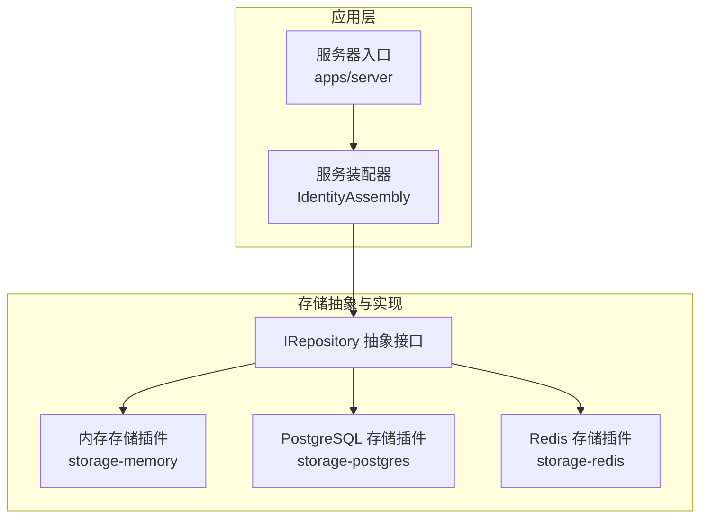
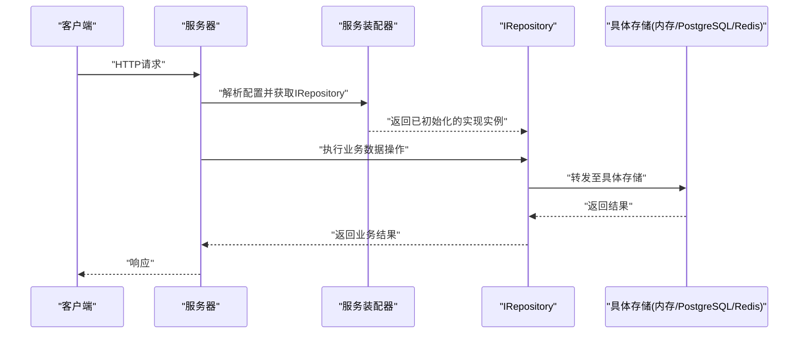
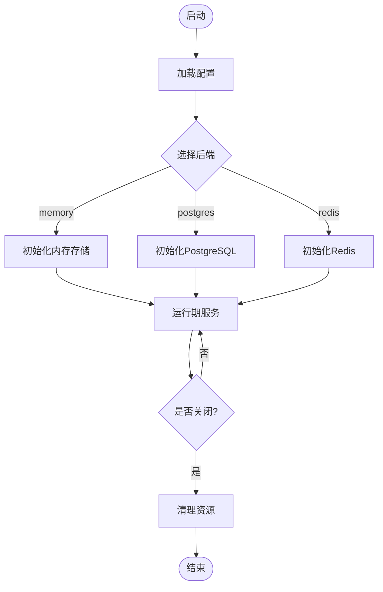
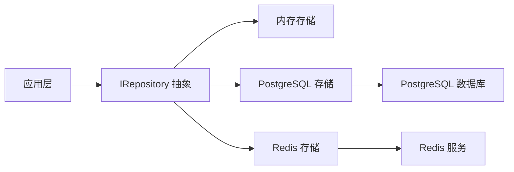

# 插件化架构

<cite>
**本文引用的文件**
- [libs/storage-memory/include/authforge/storage/memory/StorageFactory.h](file://libs/storage-memory/include/authforge/storage/memory/StorageFactory.h)
- [libs/storage-memory/src/StorageFactory.cc](file://libs/storage-memory/src/StorageFactory.cc)
- [libs/storage-postgres/include/authforge/storage/postgres/PostgresRepository.h](file://libs/storage-postgres/include/authforge/storage/postgres/PostgresRepository.h)
- [libs/storage-postgres/src/PostgresRepository.cc](file://libs/storage-postgres/src/PostgresRepository.cc)
- [libs/storage-redis/include/authforge/storage/redis/RedisRepository.h](file://libs/storage-redis/include/authforge/storage/redis/RedisRepository.h)
- [libs/storage-redis/src/RedisRepository.cc](file://libs/storage-redis/src/RedisRepository.cc)
- [apps/server/src/bootstrap/IdentityAssembly.cc](file://apps/server/src/bootstrap/IdentityAssembly.cc)
- [apps/server/config/config.json](file://apps/server/config/config.json)
- [apps/server/config/config.dev.json](file://apps/server/config/config.dev.json)
- [apps/server/config/config.prod.json](file://apps/server/config/config.prod.json)
- [apps/server/CMakeLists.txt](file://apps/server/CMakeLists.txt)
- [CMakeLists.txt](file://CMakeLists.txt)
- [conanfile.py](file://conanfile.py)
- [deploy/helm/authforge/values.yaml](file://deploy/helm/authforge/values.yaml)
- [deploy/env/server.env.example](file://deploy/env/server.env.example)
- [scripts/setup-database.sh](file://scripts/setup-database.sh)
- [tests/integration/plugin/PluginTest.cc](file://tests/integration/plugin/PluginTest.cc)
- [tests/integration/storage/AdvancedStorageTest.cc](file://tests/integration/storage/AdvancedStorageTest.cc)
- [docs/backend/plugin-integration.md](file://docs/backend/plugin-integration.md)
</cite>

## 目录
1. [简介](#简介)
2. [项目结构](#项目结构)
3. [核心组件](#核心组件)
4. [架构总览](#架构总览)
5. [详细组件分析](#详细组件分析)
6. [依赖关系分析](#依赖关系分析)
7. [性能考量](#性能考量)
8. [故障排查指南](#故障排查指南)
9. [结论](#结论)
10. [附录](#附录)

## 简介
本文件面向AuthForge的插件化存储架构，聚焦以下目标：
- 解释存储后端的抽象接口设计（IRepository）与实现规范
- 说明PostgreSQL、Redis、Memory三种存储后端的实现方式与适用场景
- 介绍插件注册机制与生命周期管理
- 说明依赖注入容器与服务装配过程
- 解释如何通过配置文件动态选择存储后端
- 提供自定义存储插件的开发指南与最佳实践
- 给出插件性能对比与迁移策略

## 项目结构
AuthForge将存储能力以插件形式解耦到独立库中，并通过统一的抽象接口进行调用。顶层应用通过配置与依赖注入在启动时选择具体实现。

图表来源
- [apps/server/src/bootstrap/IdentityAssembly.cc:1-200](file://apps/server/src/bootstrap/IdentityAssembly.cc#L1-L200)
- [libs/storage-memory/include/authforge/storage/memory/StorageFactory.h:1-200](file://libs/storage-memory/include/authforge/storage/memory/StorageFactory.h#L1-L200)
- [libs/storage-postgres/include/authforge/storage/postgres/PostgresRepository.h:1-200](file://libs/storage-postgres/include/authforge/storage/postgres/PostgresRepository.h#L1-L200)
- [libs/storage-redis/include/authforge/storage/redis/RedisRepository.h:1-200](file://libs/storage-redis/include/authforge/storage/redis/RedisRepository.h#L1-L200)

章节来源
- [apps/server/CMakeLists.txt:1-200](file://apps/server/CMakeLists.txt#L1-L200)
- [CMakeLists.txt:1-200](file://CMakeLists.txt#L1-L200)
- [conanfile.py:1-200](file://conanfile.py#L1-L200)

## 核心组件
- IRepository 抽象接口：定义跨存储后端的统一数据访问契约，包括实体CRUD、事务边界、连接/会话管理等。所有具体存储实现必须遵循该接口约定，确保上层业务代码与底层存储无关。
- 存储插件：
  - Memory：进程内键值存储，适合测试、演示与轻量场景。
  - PostgreSQL：关系型数据库，适合生产环境持久化、事务与复杂查询。
  - Redis：内存缓存/队列型存储，适合高并发、低延迟与分布式共享状态。
- 服务装配器：根据配置创建并注入具体IRepository实现，管理其生命周期（初始化、运行期、关闭）。
- 配置系统：通过JSON或环境变量指定后端类型及连接参数，驱动运行时装配。

章节来源
- [libs/storage-memory/include/authforge/storage/memory/StorageFactory.h:1-200](file://libs/storage-memory/include/authforge/storage/memory/StorageFactory.h#L1-L200)
- [libs/storage-postgres/include/authforge/storage/postgres/PostgresRepository.h:1-200](file://libs/storage-postgres/include/authforge/storage/postgres/PostgresRepository.h#L1-L200)
- [libs/storage-redis/include/authforge/storage/redis/RedisRepository.h:1-200](file://libs/storage-redis/include/authforge/storage/redis/RedisRepository.h#L1-L200)
- [apps/server/src/bootstrap/IdentityAssembly.cc:1-200](file://apps/server/src/bootstrap/IdentityAssembly.cc#L1-L200)

## 架构总览
下图展示了从请求进入服务器到存储访问的完整流程，以及不同存储后端的切换机制。

图表来源
- [apps/server/src/bootstrap/IdentityAssembly.cc:1-200](file://apps/server/src/bootstrap/IdentityAssembly.cc#L1-L200)
- [libs/storage-memory/src/StorageFactory.cc:1-200](file://libs/storage-memory/src/StorageFactory.cc#L1-L200)
- [libs/storage-postgres/src/PostgresRepository.cc:1-200](file://libs/storage-postgres/src/PostgresRepository.cc#L1-L200)
- [libs/storage-redis/src/RedisRepository.cc:1-200](file://libs/storage-redis/src/RedisRepository.cc#L1-L200)

## 详细组件分析

### IRepository 抽象接口设计与实现规范
- 职责边界
  - 定义统一的CRUD、查询、事务、连接/会话管理方法
  - 明确异常模型与错误码，保证跨后端一致性
  - 暴露必要的元数据与统计信息（如连接池大小、命中率等）
- 实现规范
  - 线程安全：多线程并发访问需保证内部状态一致
  - 资源管理：显式初始化与销毁，避免连接泄漏
  - 可观测性：埋点指标（耗时、失败率、重试次数）
  - 幂等性：对读操作保证幂等；写操作需结合事务与重试策略
- 扩展点
  - 支持插件化注册：通过工厂或装配器按名称加载实现
  - 配置驱动：通过配置对象注入连接参数、超时、重试等

章节来源
- [libs/storage-memory/include/authforge/storage/memory/StorageFactory.h:1-200](file://libs/storage-memory/include/authforge/storage/memory/StorageFactory.h#L1-L200)
- [libs/storage-postgres/include/authforge/storage/postgres/PostgresRepository.h:1-200](file://libs/storage-postgres/include/authforge/storage/postgres/PostgresRepository.h#L1-L200)
- [libs/storage-redis/include/authforge/storage/redis/RedisRepository.h:1-200](file://libs/storage-redis/include/authforge/storage/redis/RedisRepository.h#L1-L200)

### 存储后端实现与适用场景
- Memory（内存）
  - 特点：零外部依赖、极低延迟、无持久化
  - 适用：单元测试、集成测试、开发调试、演示环境
  - 限制：进程重启丢失、无法水平扩展
- PostgreSQL（关系型）
  - 特点：强一致性、事务、复杂查询、索引优化
  - 适用：生产环境、需要ACID与审计的场景
  - 注意：连接池、慢查询、锁竞争、备份恢复
- Redis（缓存/消息）
  - 特点：高吞吐、低延迟、数据结构丰富、易横向扩展
  - 适用：热点数据缓存、会话、限流、分布式锁
  - 注意：数据持久化策略、集群模式、网络分区容错

章节来源
- [libs/storage-memory/src/StorageFactory.cc:1-200](file://libs/storage-memory/src/StorageFactory.cc#L1-L200)
- [libs/storage-postgres/src/PostgresRepository.cc:1-200](file://libs/storage-postgres/src/PostgresRepository.cc#L1-L200)
- [libs/storage-redis/src/RedisRepository.cc:1-200](file://libs/storage-redis/src/RedisRepository.cc#L1-L200)

### 插件注册机制与生命周期管理
- 注册机制
  - 通过工厂或装配器按名称注册实现类
  - 支持多实现共存，运行时依据配置选择
- 生命周期
  - 初始化：建立连接、预热缓存、校验配置
  - 运行期：处理请求、监控指标、健康检查
  - 关闭：释放连接、刷新缓冲、优雅停机
- 错误恢复
  - 连接失败重试、熔断降级、回退到只读模式（视场景）

图表来源
- [apps/server/src/bootstrap/IdentityAssembly.cc:1-200](file://apps/server/src/bootstrap/IdentityAssembly.cc#L1-L200)
- [libs/storage-memory/src/StorageFactory.cc:1-200](file://libs/storage-memory/src/StorageFactory.cc#L1-L200)
- [libs/storage-postgres/src/PostgresRepository.cc:1-200](file://libs/storage-postgres/src/PostgresRepository.cc#L1-L200)
- [libs/storage-redis/src/RedisRepository.cc:1-200](file://libs/storage-redis/src/RedisRepository.cc#L1-L200)

### 依赖注入容器与服务装配
- 装配流程
  - 读取配置（JSON/环境变量）
  - 根据后端类型创建对应IRepository实例
  - 将实例注入到控制器或服务层
- 生命周期管理
  - 单例或作用域对象（请求级/应用级）
  - 自动资源管理与优雅关闭
- 可插拔性
  - 新增后端只需实现IRepository并注册到装配器
  - 无需修改业务代码

章节来源
- [apps/server/src/bootstrap/IdentityAssembly.cc:1-200](file://apps/server/src/bootstrap/IdentityAssembly.cc#L1-L200)
- [apps/server/config/config.json:1-200](file://apps/server/config/config.json#L1-L200)
- [apps/server/config/config.dev.json:1-200](file://apps/server/config/config.dev.json#L1-L200)
- [apps/server/config/config.prod.json:1-200](file://apps/server/config/config.prod.json#L1-L200)

### 通过配置文件动态选择存储后端
- 配置项建议
  - storage.type：后端类型（memory/postgres/redis）
  - storage.options：连接参数（主机、端口、数据库名、凭据、超时等）
  - storage.pool：连接池大小、最大空闲数、超时时间
  - storage.retry：重试策略（次数、退避算法）
- 生效范围
  - 开发/测试/生产分别使用不同配置文件
  - 可通过环境变量覆盖关键参数（如连接串、密钥）

章节来源
- [apps/server/config/config.json:1-200](file://apps/server/config/config.json#L1-L200)
- [apps/server/config/config.dev.json:1-200](file://apps/server/config/config.dev.json#L1-L200)
- [apps/server/config/config.prod.json:1-200](file://apps/server/config/config.prod.json#L1-L200)
- [deploy/helm/authforge/values.yaml:1-200](file://deploy/helm/authforge/values.yaml#L1-L200)
- [deploy/env/server.env.example:1-200](file://deploy/env/server.env.example#L1-L200)

### 自定义存储插件开发指南与最佳实践
- 开发步骤
  - 实现IRepository接口，确保方法语义与异常一致
  - 在装配器中注册新实现（按名称映射）
  - 编写单元测试与集成测试，覆盖正常路径与异常路径
- 最佳实践
  - 连接池与超时：合理设置池大小与超时，避免资源耗尽
  - 重试与幂等：对写操作采用幂等设计，配合重试与补偿
  - 可观测性：记录关键指标与日志，便于排障
  - 安全：敏感配置加密、最小权限原则、传输加密
- 验证与回归
  - 使用合同测试确保接口契约稳定
  - 压测验证性能与稳定性

章节来源
- [libs/storage-memory/include/authforge/storage/memory/StorageFactory.h:1-200](file://libs/storage-memory/include/authforge/storage/memory/StorageFactory.h#L1-L200)
- [libs/storage-postgres/include/authforge/storage/postgres/PostgresRepository.h:1-200](file://libs/storage-postgres/include/authforge/storage/postgres/PostgresRepository.h#L1-L200)
- [libs/storage-redis/include/authforge/storage/redis/RedisRepository.h:1-200](file://libs/storage-redis/include/authforge/storage/redis/RedisRepository.h#L1-L200)
- [tests/integration/plugin/PluginTest.cc:1-200](file://tests/integration/plugin/PluginTest.cc#L1-L200)
- [docs/backend/plugin-integration.md:1-200](file://docs/backend/plugin-integration.md#L1-L200)

## 依赖关系分析
- 模块耦合
  - 应用层仅依赖IRepository抽象，不感知具体实现
  - 各存储插件独立编译与发布，降低耦合度
- 外部依赖
  - PostgreSQL：数据库驱动、连接池
  - Redis：客户端库、集群/哨兵支持
  - 内存：标准库容器
- 构建与打包
  - CMake负责模块组织与链接
  - Conan管理第三方依赖版本

图表来源
- [apps/server/CMakeLists.txt:1-200](file://apps/server/CMakeLists.txt#L1-L200)
- [CMakeLists.txt:1-200](file://CMakeLists.txt#L1-L200)
- [conanfile.py:1-200](file://conanfile.py#L1-L200)

章节来源
- [apps/server/CMakeLists.txt:1-200](file://apps/server/CMakeLists.txt#L1-L200)
- [CMakeLists.txt:1-200](file://CMakeLists.txt#L1-L200)
- [conanfile.py:1-200](file://conanfile.py#L1-L200)

## 性能考量
- 基准测试
  - 针对CRUD与高频读场景进行压测
  - 对比不同后端的吞吐、延迟、资源占用
- 调优建议
  - 连接池：根据并发量调整池大小与超时
  - 缓存：热点数据优先走Redis，减轻DB压力
  - 索引：为常用查询字段建立合适索引
  - 批处理：合并写操作，减少往返
- 监控与告警
  - 指标：QPS、P95/P99延迟、错误率、连接池使用率
  - 告警：连接失败、慢查询、内存溢出

[本节为通用指导，不直接分析具体文件]

## 故障排查指南
- 常见问题
  - 连接失败：检查网络、凭据、防火墙、端口
  - 事务异常：确认隔离级别与锁冲突
  - 性能退化：查看慢查询、索引缺失、连接池不足
- 诊断工具
  - 日志：开启详细日志，定位错误堆栈
  - 指标：观察监控面板，识别瓶颈
  - 测试：使用合同测试与集成测试复现问题
- 恢复策略
  - 重试与熔断：临时降级，保护系统
  - 回滚与补偿：保证数据一致性
  - 热修复：快速回滚到稳定版本

章节来源
- [tests/integration/storage/AdvancedStorageTest.cc:1-200](file://tests/integration/storage/AdvancedStorageTest.cc#L1-L200)
- [scripts/setup-database.sh:1-200](file://scripts/setup-database.sh#L1-L200)

## 结论
AuthForge通过IRepository抽象与插件化存储实现了高度的可扩展性与可维护性。借助配置驱动的装配机制，可在不同环境中灵活切换存储后端。建议在开发与生产环境中分别选用合适的后端，并结合监控与压测持续优化性能与稳定性。

[本节为总结性内容，不直接分析具体文件]

## 附录
- 配置示例与环境变量
  - 参考配置文件与部署清单中的存储相关项
  - 环境变量用于覆盖敏感信息与运行时参数
- 迁移策略
  - 数据迁移：使用脚本或迁移工具逐步迁移
  - 灰度发布：先小流量切到新后端，再全量切换
  - 回滚方案：保留旧后端或快照，确保可回退

章节来源
- [deploy/helm/authforge/values.yaml:1-200](file://deploy/helm/authforge/values.yaml#L1-L200)
- [deploy/env/server.env.example:1-200](file://deploy/env/server.env.example#L1-L200)
- [scripts/setup-database.sh:1-200](file://scripts/setup-database.sh#L1-L200)