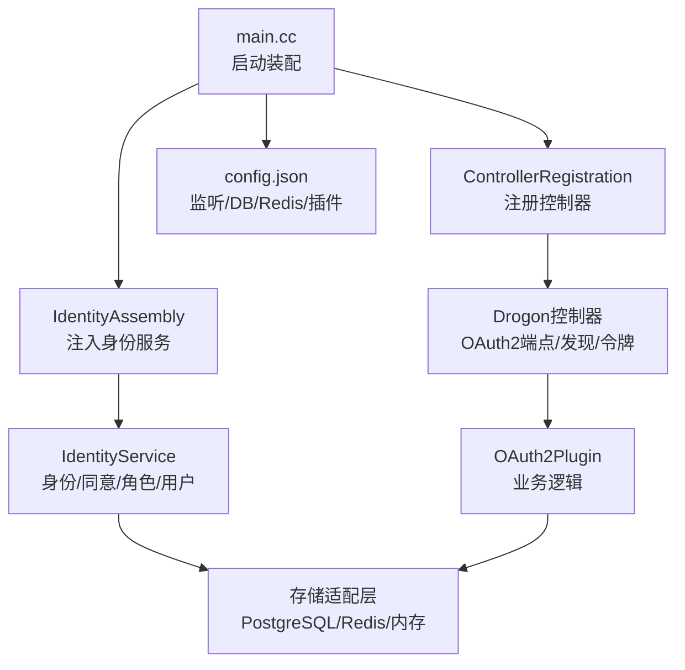
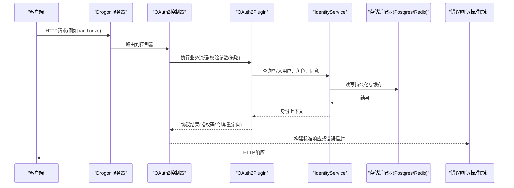
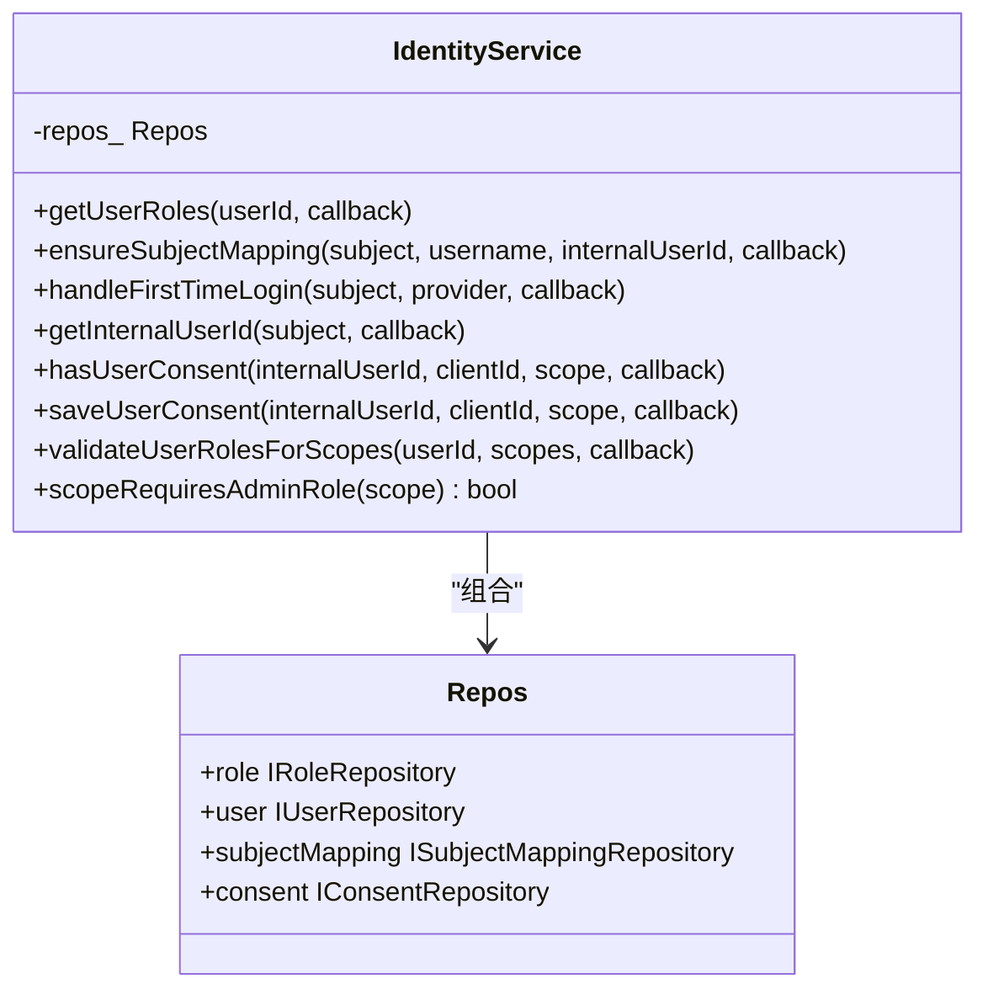
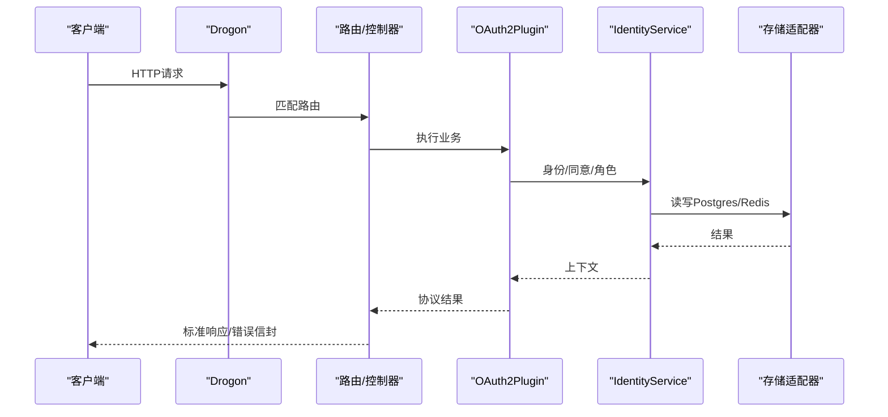
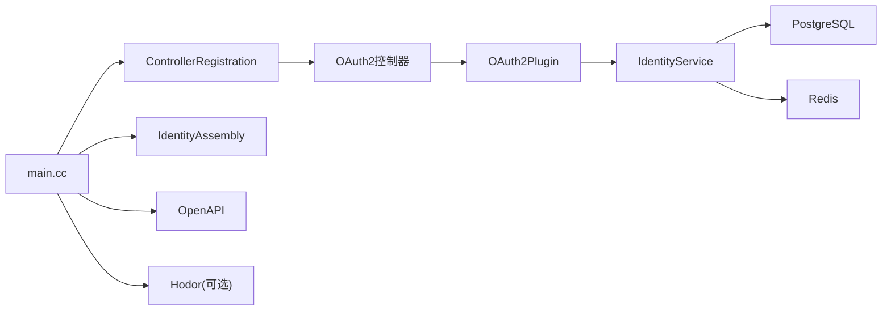
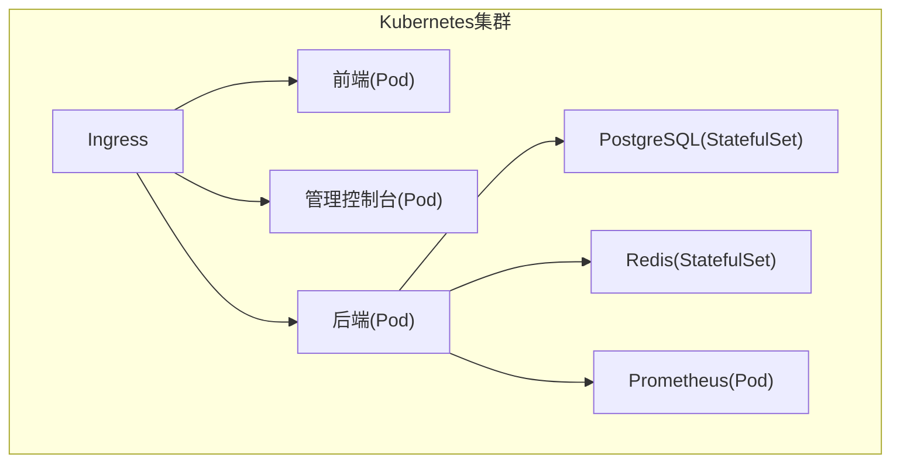

# 整体架构模式

<cite>
**本文引用的文件**
- [apps/server/src/main.cc](file://apps/server/src/main.cc)
- [apps/server/config/config.json](file://apps/server/config/config.json)
- [apps/server/src/bootstrap/ControllerRegistration.h](file://apps/server/src/bootstrap/ControllerRegistration.h)
- [apps/server/src/bootstrap/IdentityAssembly.h](file://apps/server/src/bootstrap/IdentityAssembly.h)
- [libs/drogon/include/authforge/drogon/services/IdentityService.h](file://libs/drogon/include/authforge/drogon/services/IdentityService.h)
- [deploy/docker/docker-compose.yml](file://deploy/docker/docker-compose.yml)
- [deploy/helm/authforge/values.yaml](file://deploy/helm/authforge/values.yaml)
</cite>

## 目录
1. [简介](#简介)
2. [项目结构](#项目结构)
3. [核心组件](#核心组件)
4. [架构总览](#架构总览)
5. [详细组件分析](#详细组件分析)
6. [依赖关系分析](#依赖关系分析)
7. [性能考量](#性能考量)
8. [故障排查指南](#故障排查指南)
9. [结论](#结论)
10. [附录](#附录)

## 简介
本文件面向AuthForge的整体架构模式，围绕分层架构与模块化设计展开：表现层基于Drogon Web框架承载HTTP端点；业务逻辑层实现OAuth2/OIDC协议能力；数据访问层通过存储适配器（PostgreSQL、Redis、内存）解耦持久化细节。文档重点说明请求从进入HTTP到返回响应的完整链路、技术选型权衡、可扩展性与模块化原则，并给出架构图、部署拓扑与容器化方案。

## 项目结构
- 应用入口与启动装配
  - apps/server/src/main.cc：最小化入口，仅负责加载配置、注册控制器、装配横切关注点、执行迁移、启动服务。
  - apps/server/config/config.json：监听端口、数据库/Redis客户端、插件（Prometheus、OAuth2Plugin）、自定义配置等。
- 启动装配模块
  - apps/server/src/bootstrap/ControllerRegistration.h：集中注册所有AutoCreation=false的控制器，并在beginning advice中注入OAuth2Plugin指针。
  - apps/server/src/bootstrap/IdentityAssembly.h：在DB可用后构造身份层服务（角色/用户/主体映射/同意），并注入到SessionController。
- 身份服务接口
  - libs/drogon/include/authforge/drogon/services/IdentityService.h：身份层服务聚合多个仓储接口（角色、用户、主体映射、同意），提供异步方法封装跨仓储协作。
- 部署与编排
  - deploy/docker/docker-compose.yml：本地开发/测试环境，包含后端、前端、管理控制台、PostgreSQL、Redis、Prometheus。
  - deploy/helm/authforge/values.yaml：Kubernetes Helm Chart值定义，描述镜像、资源、外部依赖、Ingress等。



图表来源
- [apps/server/src/main.cc:97-238](file://apps/server/src/main.cc#L97-L238)
- [apps/server/config/config.json:1-212](file://apps/server/config/config.json#L1-L212)
- [apps/server/src/bootstrap/ControllerRegistration.h:13-34](file://apps/server/src/bootstrap/ControllerRegistration.h#L13-L34)
- [apps/server/src/bootstrap/IdentityAssembly.h:19-38](file://apps/server/src/bootstrap/IdentityAssembly.h#L19-L38)
- [libs/drogon/include/authforge/drogon/services/IdentityService.h:39-99](file://libs/drogon/include/authforge/drogon/services/IdentityService.h#L39-L99)

章节来源
- [apps/server/src/main.cc:97-238](file://apps/server/src/main.cc#L97-L238)
- [apps/server/config/config.json:1-212](file://apps/server/config/config.json#L1-L212)
- [apps/server/src/bootstrap/ControllerRegistration.h:13-34](file://apps/server/src/bootstrap/ControllerRegistration.h#L13-L34)
- [apps/server/src/bootstrap/IdentityAssembly.h:19-38](file://apps/server/src/bootstrap/IdentityAssembly.h#L19-L38)

## 核心组件
- 表现层（Drogon）
  - 控制器注册：集中式注册所有控制器，避免在main中散落注册逻辑。
  - 横切关注点：CORS、安全头、异常处理、OpenAPI文档初始化、限流（Hodor）响应适配。
- 业务逻辑层（OAuth2）
  - OAuth2Plugin：承载授权码、设备码、刷新令牌、客户端管理等协议流程。
  - IdentityService：聚合身份相关仓储，封装用户角色、同意、首次登录等复杂流程。
- 数据访问层（存储适配器）
  - PostgreSQL：持久化OAuth2实体、用户、角色、同意、审计日志等。
  - Redis：缓存会话、速率限制、临时状态。
  - 内存：测试与轻量场景。

章节来源
- [apps/server/src/bootstrap/ControllerRegistration.h:13-34](file://apps/server/src/bootstrap/ControllerRegistration.h#L13-L34)
- [libs/drogon/include/authforge/drogon/services/IdentityService.h:39-99](file://libs/drogon/include/authforge/drogon/services/IdentityService.h#L39-L99)
- [apps/server/config/config.json:133-170](file://apps/server/config/config.json#L133-L170)

## 架构总览
下图展示从HTTP请求进入到响应返回的分层调用链，以及各层职责与关键组件交互。



图表来源
- [apps/server/src/main.cc:151-238](file://apps/server/src/main.cc#L151-L238)
- [apps/server/src/bootstrap/ControllerRegistration.h:13-34](file://apps/server/src/bootstrap/ControllerRegistration.h#L13-L34)
- [libs/drogon/include/authforge/drogon/services/IdentityService.h:39-99](file://libs/drogon/include/authforge/drogon/services/IdentityService.h#L39-L99)
- [apps/server/config/config.json:133-170](file://apps/server/config/config.json#L133-L170)

## 详细组件分析

### 启动与装配流程（main.cc）
- 启动阶段
  - 解析命令行参数，支持仅迁移模式。
  - 定位并加载配置文件，创建日志目录。
  - 注册控制器、装配横切关注点（CORS、安全头、异常处理）。
  - 在beginning advice中注入OAuth2Plugin指针到控制器/过滤器。
  - 初始化OpenAPI文档。
  - 执行数据库迁移（可配置自动迁移）。
  - 启动Drogon服务。
- 关键点
  - 将“读配置→构造实现→注入端口→run”的职责严格分离，main仅做装配。
  - 通过registerBeginningAdvice确保插件与DB客户端就绪后再进行依赖注入。

```mermaid
flowchart TD
Start(["进程启动"]) --> ParseArgs["解析参数(--migrate-only)"]
ParseArgs --> LoadCfg["加载配置(config.json)"]
LoadCfg --> CreateLogDir{"需要创建日志目录?"}
CreateLogDirDir|是|MakeDir["创建日志目录"]
CreateLogDirDir|否|SkipDir["跳过"]
MakeDir --> RegCtrl["注册控制器"]
SkipDir --> RegCtrl
RegCtrl --> WireCrossCutting["装配横切关注点(CORS/安全头/异常)"]
WireCrossCutting --> BeginAdvice["beginning advice注入插件/身份服务"]
BeginAdvice --> OpenApi["初始化OpenAPI文档"]
OpenApi --> Migrate{"是否仅迁移模式?"}
Migrate|是|RunMigrate["执行迁移并退出"]
Migrate|否|RunServer["启动Drogon服务"]
```

图表来源
- [apps/server/src/main.cc:97-238](file://apps/server/src/main.cc#L97-L238)

章节来源
- [apps/server/src/main.cc:97-238](file://apps/server/src/main.cc#L97-L238)

### 控制器与插件依赖注入（ControllerRegistration）
- 职责
  - 集中注册所有AutoCreation=false的控制器。
  - 在beginning advice回调中查找已注册的控制器/过滤器单例，注入OAuth2Plugin指针，避免每次请求重复查找。
- 顺序要求
  - 必须在drogon::app().run()之前完成注册。
  - 注入发生在beginning advice中，保证插件已构造完毕。

章节来源
- [apps/server/src/bootstrap/ControllerRegistration.h:13-34](file://apps/server/src/bootstrap/ControllerRegistration.h#L13-L34)

### 身份服务装配（IdentityAssembly）
- 职责
  - 在DB客户端可用后，构造Postgres实现的IUserRepository/IRoleRepository/ISubjectMappingRepository。
  - 组装authforge::identity::AuthService与SessionManager，并注入到SessionController。
- 顺序要求
  - 必须在beginning advice中调用，确保DB客户端已就绪。
  - 无默认DB时安全降级，不中断启动。

章节来源
- [apps/server/src/bootstrap/IdentityAssembly.h:19-38](file://apps/server/src/bootstrap/IdentityAssembly.h#L19-L38)

### 身份服务接口（IdentityService）
- 设计要点
  - 聚合四个仓储接口：角色、用户、主体映射、同意。
  - 提供异步方法封装跨仓储协作（如ensureSubjectMapping、handleFirstLogin、validateUserRolesForScopes）。
  - 继承enable_shared_from_this以支撑异步链中的生命周期管理。
- 使用边界
  - 同步纯函数调用（如scopeRequiresAdminRole）无需共享所有权。
  - 通过UserRef统一用户标识，减少内部int32与领域模型的耦合。



图表来源
- [libs/drogon/include/authforge/drogon/services/IdentityService.h:39-99](file://libs/drogon/include/authforge/drogon/services/IdentityService.h#L39-L99)

章节来源
- [libs/drogon/include/authforge/drogon/services/IdentityService.h:39-99](file://libs/drogon/include/authforge/drogon/services/IdentityService.h#L39-L99)

### 请求处理流程（端到端）
- 步骤
  - 客户端发起HTTP请求至Drogon监听端口。
  - Drogon路由到对应控制器（如AuthorizationEndpointController）。
  - 控制器调用OAuth2Plugin执行业务流程（参数校验、策略检查、存储读写）。
  - IdentityService协调身份相关仓储（用户、角色、同意）。
  - 存储适配器访问PostgreSQL/Redis。
  - 构建标准响应或错误信封返回给客户端。
- 横切关注点
  - CORS与安全头由启动装配设置。
  - 异常统一转换为标准错误信封。
  - 可选限流插件（Hodor）拦截并返回标准429响应。



图表来源
- [apps/server/src/main.cc:151-238](file://apps/server/src/main.cc#L151-L238)
- [apps/server/config/config.json:133-170](file://apps/server/config/config.json#L133-L170)
- [libs/drogon/include/authforge/drogon/services/IdentityService.h:39-99](file://libs/drogon/include/authforge/drogon/services/IdentityService.h#L39-L99)

## 依赖关系分析
- 组件耦合
  - main.cc仅依赖bootstrap模块与Drogon基础能力，低耦合高内聚。
  - 控制器通过OAuth2Plugin获取业务能力，避免直接依赖存储细节。
  - IdentityService聚合仓储接口，屏蔽具体实现差异。
- 外部依赖
  - PostgreSQL：持久化核心数据。
  - Redis：缓存与会话、限流。
  - Prometheus：指标导出。
  - Hodor：可选限流插件。
- 潜在循环依赖
  - 通过beginning advice延迟注入，避免插件与控制器之间的循环引用。



图表来源
- [apps/server/src/main.cc:151-238](file://apps/server/src/main.cc#L151-L238)
- [apps/server/config/config.json:133-170](file://apps/server/config/config.json#L133-L170)

章节来源
- [apps/server/src/main.cc:151-238](file://apps/server/src/main.cc#L151-L238)
- [apps/server/config/config.json:133-170](file://apps/server/config/config.json#L133-L170)

## 性能考量
- 连接池与并发
  - PostgreSQL与Redis均配置连接池大小与超时，避免资源耗尽。
  - Drogon支持keepalive与管道化请求，提升吞吐。
- 缓存与限流
  - Redis用于会话与缓存，降低DB压力。
  - Hodor提供限流，保护后端免受滥用。
- 压缩与静态资源
  - 启用Gzip/Brotli压缩，静态资源缓存时间优化。
- 监控与可观测性
  - Prometheus指标导出，便于容量规划与告警。

[本节为通用指导，不直接分析具体文件]

## 故障排查指南
- 启动失败
  - 检查配置文件路径与内容，确认db_clients与redis_clients配置正确。
  - 若仅迁移模式，确认数据库连通性与权限。
- 运行时异常
  - 查看错误信封与RequestId，定位请求上下文。
  - 检查Hodor限流是否启用及拒绝响应工厂是否正确注入。
- 依赖不可用
  - 验证PostgreSQL与Redis健康检查（docker-compose healthcheck）。
  - 检查环境变量与密钥挂载（Helm Secrets）。

章节来源
- [apps/server/src/main.cc:159-219](file://apps/server/src/main.cc#L159-L219)
- [deploy/docker/docker-compose.yml:67-102](file://deploy/docker/docker-compose.yml#L67-L102)

## 结论
AuthForge采用清晰的分层架构与模块化设计：表现层（Drogon）专注路由与横切关注点，业务层（OAuth2Plugin与IdentityService）聚焦协议与身份流程，数据访问层（存储适配器）解耦持久化实现。通过启动装配与依赖注入机制，系统具备高内聚、低耦合、易扩展的特性。部署层面提供Docker Compose与Helm两种方案，满足本地开发与生产编排需求。

[本节为总结性内容，不直接分析具体文件]

## 附录

### 技术栈选择与权衡
- Drogon
  - 优势：高性能异步Web框架，原生插件机制，易于集成Prometheus/Hodor。
  - 权衡：生态相对较小，需自行完善工具链与文档。
- PostgreSQL
  - 优势：ACID事务、丰富数据类型、成熟生态，适合复杂关系型数据。
  - 权衡：运维成本较高，需合理配置连接池与索引。
- Redis
  - 优势：高性能键值存储，适合缓存、会话、限流。
  - 权衡：数据持久化需谨慎配置，注意内存占用。
- Prometheus
  - 优势：指标采集与可视化能力强，便于生产监控。
  - 权衡：需额外部署与配置。

[本节为通用指导，不直接分析具体文件]

### 部署拓扑与容器化架构
- Docker Compose
  - 后端服务暴露5555端口，依赖PostgreSQL与Redis。
  - 前端与管理控制台分别暴露8080与8081端口。
  - Prometheus暴露9090端口用于指标采集。
- Kubernetes（Helm）
  - values.yaml定义镜像、资源、外部依赖、Ingress等。
  - 支持外部数据库与Redis，敏感信息通过Secrets管理。
  - 迁移Job在升级前运行，保障Schema一致性。



图表来源
- [deploy/docker/docker-compose.yml:1-127](file://deploy/docker/docker-compose.yml#L1-L127)
- [deploy/helm/authforge/values.yaml:1-145](file://deploy/helm/authforge/values.yaml#L1-L145)

章节来源
- [deploy/docker/docker-compose.yml:1-127](file://deploy/docker/docker-compose.yml#L1-L127)
- [deploy/helm/authforge/values.yaml:1-145](file://deploy/helm/authforge/values.yaml#L1-L145)