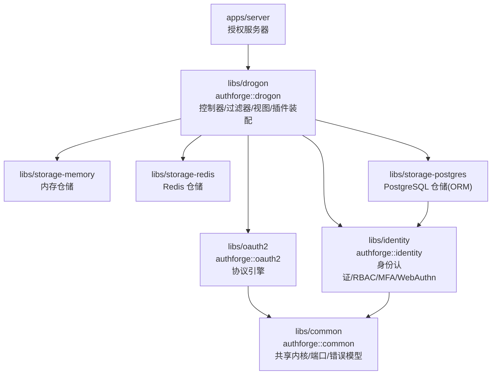
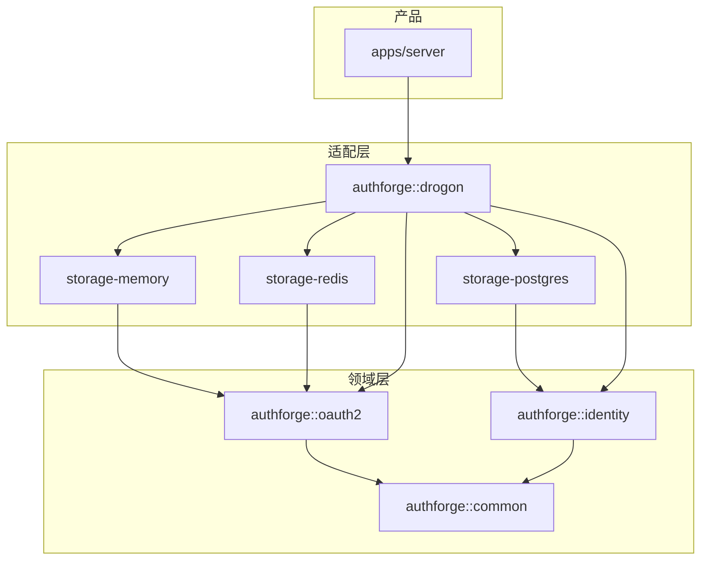
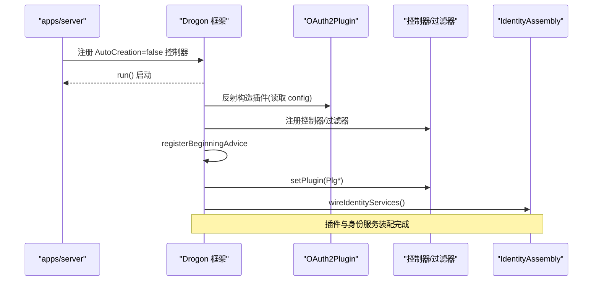
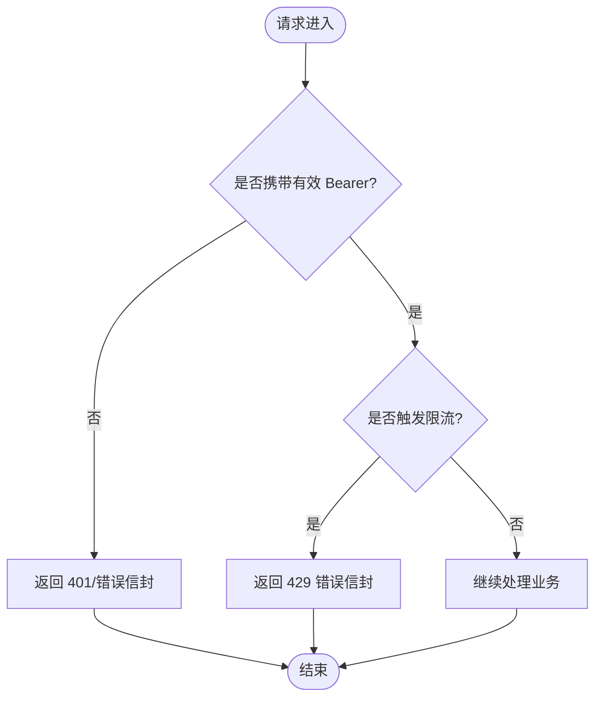
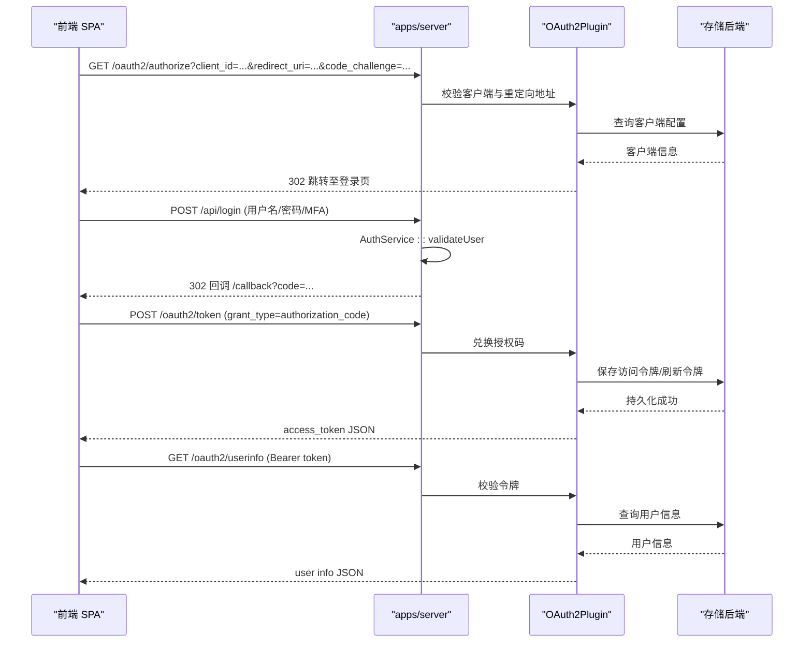
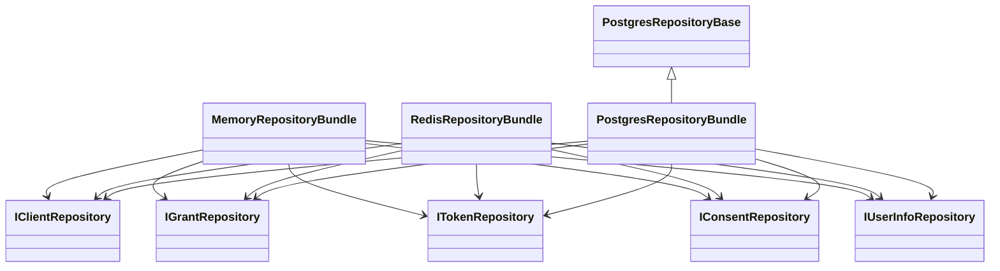
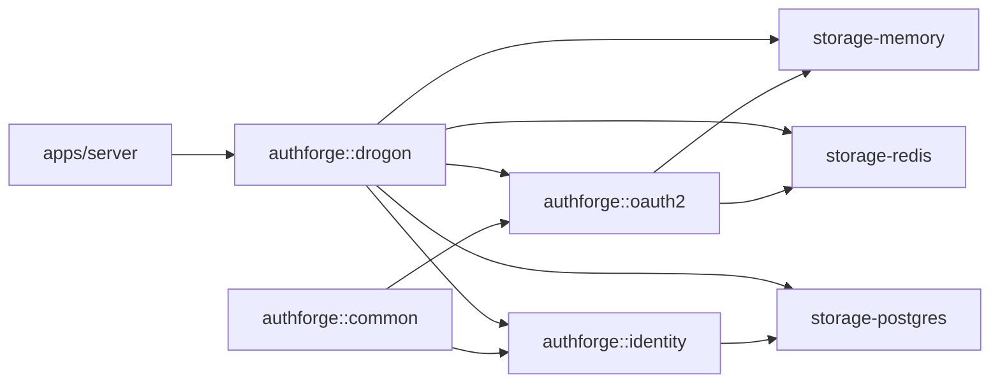

# 架构设计

<cite>
**本文引用的文件**
- [README.md](file://README.md)
- [CMakeLists.txt](file://CMakeLists.txt)
- [architecture-overview.md](file://docs/backend/architecture-overview.md)
- [main.cc](file://apps/server/src/main.cc)
- [IdentityAssembly.cc](file://apps/server/src/bootstrap/IdentityAssembly.cc)
- [OAuth2AuthFilter.cc](file://libs/drogon/src/filters/OAuth2AuthFilter.cc)
- [TokenEndpointController.cc](file://libs/drogon/src/controllers/TokenEndpointController.cc)
- [HealthController.h](file://libs/drogon/include/authforge/drogon/controllers/HealthController.h)
- [PostgresRepositoryBase.h](file://libs/storage-postgres/include/authforge/storage/postgres/PostgresRepositoryBase.h)
- [plugin-integration.md](file://docs/backend/plugin-integration.md)
</cite>

## 目录
1. [引言](#引言)
2. [项目结构](#项目结构)
3. [核心组件](#核心组件)
4. [架构总览](#架构总览)
5. [详细组件分析](#详细组件分析)
6. [依赖关系分析](#依赖关系分析)
7. [性能考量](#性能考量)
8. [故障排查指南](#故障排查指南)
9. [结论](#结论)
10. [附录](#附录)

## 引言
本架构设计文档面向 AuthForge 授权服务器与 SDK，系统性阐述分层架构、模块边界、插件化与存储抽象、依赖注入与工厂模式、安全边界与跨域关注点，并通过架构图与数据流图说明控制流程。目标是帮助读者在不深入代码细节的情况下理解系统如何组织、扩展与演进。

## 项目结构
AuthForge 采用“领域层 + 适配层 + 基础设施层”的分层组织，SDK 以 CMake 包形式发布，产品应用通过 find_package 消费。顶层 CMake 按依赖方向顺序引入各子库，确保领域层不依赖 Drogon，适配层实现领域接口。

图表来源
- [CMakeLists.txt:57-118](file://CMakeLists.txt#L57-L118)
- [README.md:31-49](file://README.md#L31-L49)

章节来源
- [CMakeLists.txt:1-171](file://CMakeLists.txt#L1-L171)
- [README.md:16-51](file://README.md#L16-L51)

## 核心组件
- authforge::common：共享内核，提供错误模型、配置、值对象、可观测性模型与端口基类；被 oauth2 与 identity 共同依赖。
- authforge::oauth2：OAuth2/OIDC 协议引擎，包含客户端注册、授权决策（同意/范围策略）、令牌生命周期等；仅依赖 common。
- authforge::identity：用户认证、MFA、WebAuthn、社交登录、会话管理与 RBAC；仅依赖 common，与 oauth2 互不编译依赖。
- libs/storage-*：存储适配层，实现 oauth2 的仓储端口（client/grant/token/consent/userinfo）以及 identity 的用户/角色/映射仓储；支持 memory/redis/postgres。
- authforge::drogon：适配层，封装 Drogon 控制器、过滤器、视图与插件装配；将配置转换为具体仓储与服务并注入到控制器/过滤器中。

章节来源
- [CMakeLists.txt:57-118](file://CMakeLists.txt#L57-L118)
- [architecture-overview.md:17-46](file://docs/backend/architecture-overview.md#L17-L46)

## 架构总览
AuthForge 遵循“领域层不可见框架”的设计原则：
- 领域层（common/oauth2/identity）不包含任何 Drogon 头，保证可移植性与可测试性。
- 适配层（storage-* 与 drogon）实现领域端口，承载具体技术栈（PostgreSQL/Redis/Drogon）。
- 产品应用（apps/server）负责装配：读取配置、构造仓储与服务、注入控制器/过滤器，启动服务。

图表来源
- [CMakeLists.txt:57-118](file://CMakeLists.txt#L57-L118)
- [README.md:31-49](file://README.md#L31-L49)

## 详细组件分析

### 分层架构与职责分离
- 领域层
  - common：错误码集中管理、配置加载与校验、审计事件与指标模型、端口基类。
  - oauth2：协议流程（授权码/PKCE、令牌颁发/刷新/撤销、发现/JWKS、设备授权、动态客户端注册）、同意与范围策略。
  - identity：用户注册/登录、密码重置、邮箱验证、MFA(TOTP)、WebAuthn/FIDO2、社交登录、会话管理、RBAC。
- 适配层
  - storage-*：仓储实现（内存/Redis/Postgres），对领域暴露统一接口；Postgres 使用 ORM 模型，Redis 用于缓存与 KV。
  - drogon：控制器/过滤器/视图与插件装配；将配置转为仓储与服务实例，注入到请求处理链。
- 产品层
  - apps/server：最小化 main，仅做装配与启动；通过 bootstrap 模块完成 CORS、安全头、异常处理、OpenAPI、迁移与控制器注册。

章节来源
- [CMakeLists.txt:57-118](file://CMakeLists.txt#L57-L118)
- [architecture-overview.md:17-46](file://docs/backend/architecture-overview.md#L17-L46)

### SDK 层依赖关系与模块边界
- 依赖方向铁律：oauth2→common，identity→common；oauth2 与 identity 互不编译依赖；适配层实现领域接口；产品层依赖所有层。
- 可选特性开关：WITH_IDENTITY/WITH_SOCIAL/WITH_WEBAUTHN 控制构建面，缩小依赖。
- 对外包名：authforge-common / authforge-oauth2 / authforge-identity / authforge-drogon 等，便于 find_package 消费。

章节来源
- [CMakeLists.txt:33-55](file://CMakeLists.txt#L33-L55)
- [README.md:31-51](file://README.md#L31-L51)

### 插件化架构与存储后端抽象
- 插件机制：Drogon 原生插件 OAuth2Plugin 由配置文件驱动反射加载，内部退化为装配器：读配置 → 构造仓储 Bundle → 注入 Domain 服务 → 注册控制器/过滤器。
- 存储后端选择：config.json 中 storage_type 决定后端（postgres/redis/memory），对应 RepositoryBundle 组装不同仓储实现。
- 适配器模式：每个仓储接口在 storage-* 中提供实现，领域层只依赖接口，屏蔽底层差异。

章节来源
- [plugin-integration.md:40-87](file://docs/backend/plugin-integration.md#L40-L87)
- [architecture-overview.md:79-89](file://docs/backend/architecture-overview.md#L79-L89)

### 依赖注入与工厂模式
- 两阶段装配：控制器/过滤器以 AutoCreation=false 注册；在 registerBeginningAdvice 回调中通过 setPlugin() 注入已构造完成的插件单例指针，避免每次请求全局查找。
- 工厂/装配：IdentityAssembly 在启动时构造 identity 服务（AuthService/SessionManager/MfaService 等）并注入到相关控制器；存储后端通过 RepositoryBundle 工厂式装配。
- 向后兼容：resolvePlugin() 在未显式注入时回退到全局 getPlugin 查找，保证渐进迁移。

图表来源
- [main.cc:151-188](file://apps/server/src/main.cc#L151-L188)
- [IdentityAssembly.cc:112-137](file://apps/server/src/bootstrap/IdentityAssembly.cc#L112-L137)
- [HealthController.h:41-52](file://libs/drogon/include/authforge/drogon/controllers/HealthController.h#L41-L52)

章节来源
- [main.cc:151-188](file://apps/server/src/main.cc#L151-L188)
- [IdentityAssembly.cc:112-137](file://apps/server/src/bootstrap/IdentityAssembly.cc#L112-L137)
- [HealthController.h:41-52](file://libs/drogon/include/authforge/drogon/controllers/HealthController.h#L41-L52)

### 安全边界与跨域关注点
- 跨域（CORS）与安全头：启动时统一设置 CORS 策略与安全响应头，减少重复逻辑。
- 鉴权过滤器：OAuth2AuthFilter 解析 Authorization 头、校验 Bearer Token，未命中或非法返回标准错误信封。
- 速率限制：Hodor 插件启用时，拒绝响应统一为 Error Envelope（VALIDATION_RATE_LIMITED/429）。
- 错误模型：ErrorCatalog 作为错误码唯一来源，ErrorResponder 渲染 JSON 错误信封，保证一致性与可观测性。

图表来源
- [OAuth2AuthFilter.cc:7-41](file://libs/drogon/src/filters/OAuth2AuthFilter.cc#L7-L41)
- [main.cc:190-219](file://apps/server/src/main.cc#L190-L219)

章节来源
- [OAuth2AuthFilter.cc:7-41](file://libs/drogon/src/filters/OAuth2AuthFilter.cc#L7-L41)
- [main.cc:190-219](file://apps/server/src/main.cc#L190-L219)

### 数据流向与控制流程（授权码+PKCE 示例）

图表来源
- [architecture-overview.md:48-77](file://docs/backend/architecture-overview.md#L48-L77)
- [TokenEndpointController.cc:577-616](file://libs/drogon/src/controllers/TokenEndpointController.cc#L577-L616)

章节来源
- [architecture-overview.md:48-77](file://docs/backend/architecture-overview.md#L48-L77)
- [TokenEndpointController.cc:577-616](file://libs/drogon/src/controllers/TokenEndpointController.cc#L577-L616)

### 存储后端的抽象与实现
- 抽象：oauth2 定义 IClientRepository/IGrantRepository/ITokenRepository/IConsentRepository/IUserInfoRepository 等端口；identity 定义用户/角色/映射仓储接口。
- 实现：storage-memory 提供进程内实现用于单元测试与快速演示；storage-redis 提供高性能 KV 缓存与临时数据；storage-postgres 提供持久化存储，使用 ORM 模型。
- 基类与复用：PostgresRepositoryBase 提供连接选择、懒初始化与异步回调安全捕获模式，降低重复实现成本。

图表来源
- [PostgresRepositoryBase.h:29-54](file://libs/storage-postgres/include/authforge/storage/postgres/PostgresRepositoryBase.h#L29-L54)
- [architecture-overview.md:79-89](file://docs/backend/architecture-overview.md#L79-L89)

章节来源
- [PostgresRepositoryBase.h:29-54](file://libs/storage-postgres/include/authforge/storage/postgres/PostgresRepositoryBase.h#L29-L54)
- [architecture-overview.md:79-89](file://docs/backend/architecture-overview.md#L79-L89)

## 依赖关系分析
- 强制依赖方向：Domain 层禁止依赖 Drogon；Adapter 层实现 Domain 接口；产品层聚合所有层。
- 可选特性裁剪：关闭 WITH_SOCIAL/WITH_WEBAUTHN 可减少控制器与服务依赖面。
- 链接策略：控制器/过滤器使用 AutoCreation=false 避免 whole-archive；插件 OBJECT 库天然整体链接。

图表来源
- [CMakeLists.txt:57-118](file://CMakeLists.txt#L57-L118)
- [README.md:31-49](file://README.md#L31-L49)

章节来源
- [CMakeLists.txt:57-118](file://CMakeLists.txt#L57-L118)
- [README.md:31-49](file://README.md#L31-L49)

## 性能考量
- 异步回调与生命周期：仓储/服务方法采用异步回调，使用 shared_ptr 与 self-capture 防止 UAF；PostgresRepositoryBase 提供统一的连接懒初始化与重试策略。
- 缓存与 KV：Redis 用于令牌缓存、授权码缓存与速率限制数据，提升热点路径性能。
- 构建与运行期优化：可选特性开关减小二进制体积；控制器/过滤器去单例化减少每请求查找开销。

章节来源
- [PostgresRepositoryBase.h:29-54](file://libs/storage-postgres/include/authforge/storage/postgres/PostgresRepositoryBase.h#L29-L54)
- [architecture-overview.md:79-89](file://docs/backend/architecture-overview.md#L79-L89)

## 故障排查指南
- 插件未加载：OAuth2AuthFilter 在 resolvePlugin() 失败时返回标准错误信封；检查 config.json 中 plugins 块与 storage_type。
- 路由 404：确认控制器已注册且未被丢弃；当前方案使用 AutoCreation=false，无需 whole-archive。
- 数据库迁移：通过 --migrate-only 或自动迁移开关执行 schema 迁移；确认 db_clients 配置正确。
- 速率限制：Hodor 启用时，拒绝响应统一为 429 错误信封；检查 Hodor 插件加载与 reject response factory 绑定。

章节来源
- [OAuth2AuthFilter.cc:7-41](file://libs/drogon/src/filters/OAuth2AuthFilter.cc#L7-L41)
- [main.cc:97-135](file://apps/server/src/main.cc#L97-L135)
- [main.cc:190-219](file://apps/server/src/main.cc#L190-L219)

## 结论
AuthForge 通过清晰的分层与插件化设计，实现了高内聚、低耦合的可插拔授权服务器与 SDK。领域层保持纯业务与技术无关，适配层屏蔽存储与 Web 框架差异，产品层专注装配与编排。依赖注入与工厂模式贯穿启动与请求路径，保障可扩展性与可测试性。安全与跨域关注点集中在适配层，统一错误模型与可观测性提升运维体验。该架构既适合独立部署的产品形态，也适合作为 SDK 嵌入宿主应用。

## 附录
- 技术决策权衡
  - 领域层去 Drogon：提升可移植性与测试友好度，代价是适配层需承担更多桥接逻辑。
  - 插件反射加载：保留 config 驱动的兼容性，同时通过装配器化降低耦合。
  - 存储抽象：统一仓储接口使后端可替换，但需维护多实现的一致性。
  - 去单例化：减少全局状态，提高并发安全性，需要两阶段装配与 setter 注入。
- 约束条件
  - 构建选项：WITH_IDENTITY/WITH_SOCIAL/WITH_WEBAUTHN 影响功能面与依赖。
  - 运行时要求：PostgreSQL/Redis 版本、C++17、CMake 3.21+。
  - 安全基线：OWASP OAuth 最佳实践、令牌哈希存储、Argon2id/bcrypt 密码哈希。