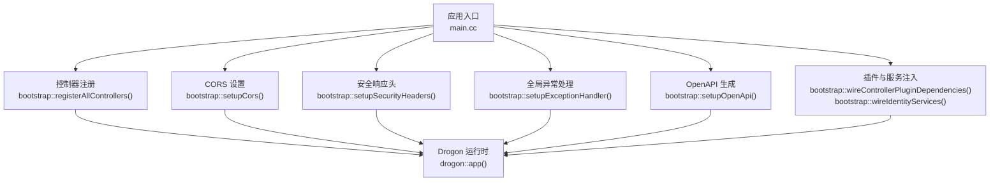
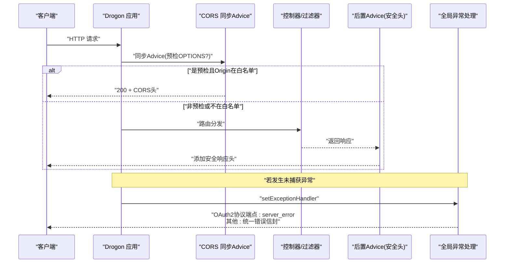
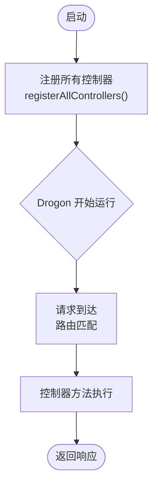
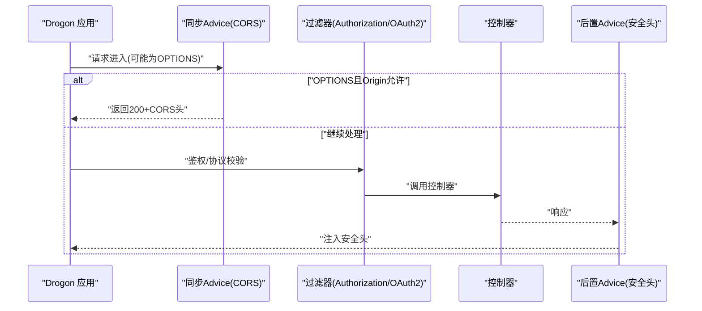
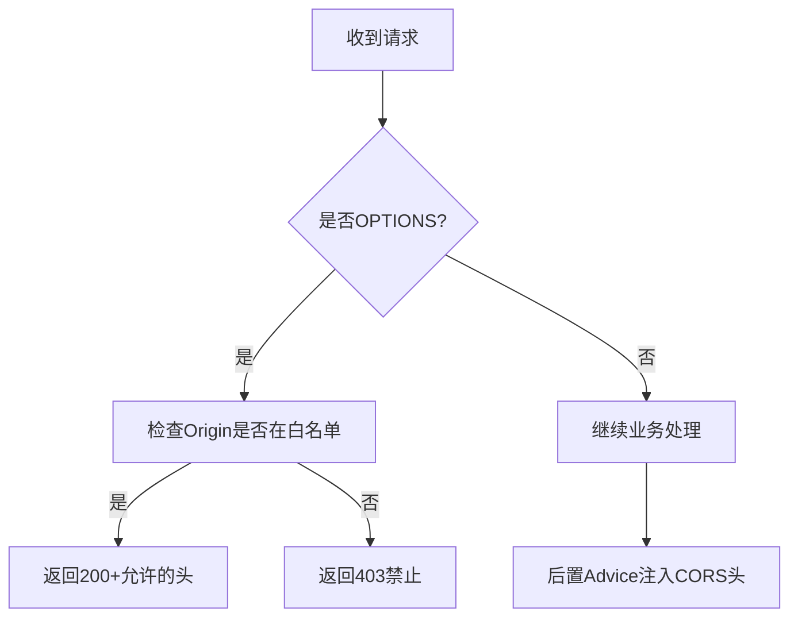
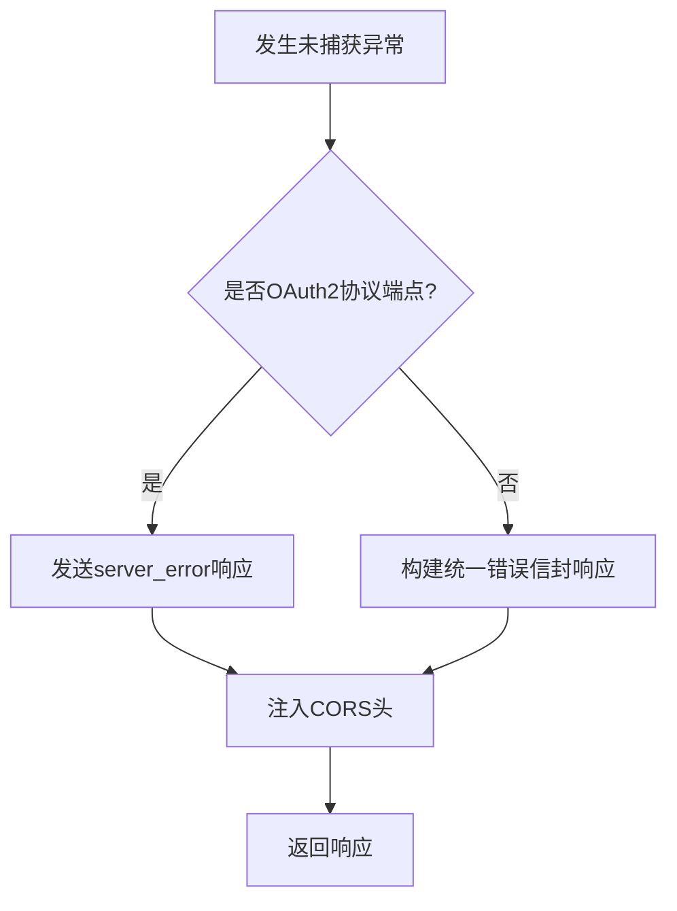
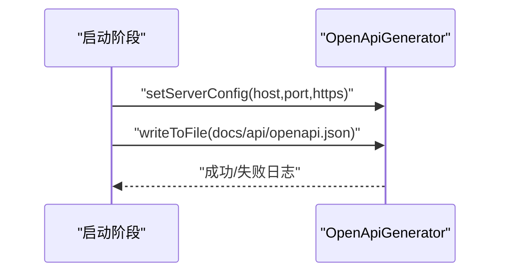
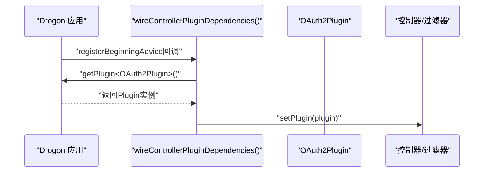
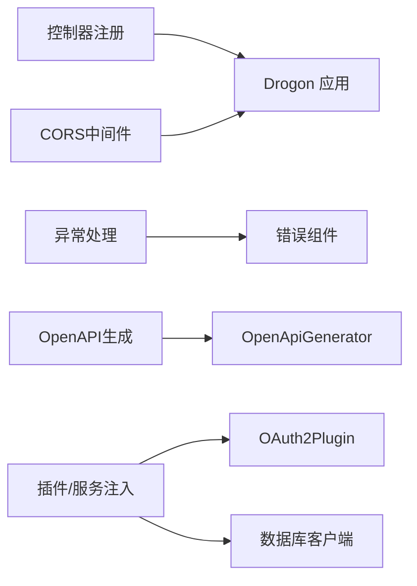

# Drogon适配器 (authforge::drogon)

<cite>
**本文引用的文件**
- [ControllerRegistration.h](file://apps/server/src/bootstrap/ControllerRegistration.h)
- [ControllerRegistration.cc](file://apps/server/src/bootstrap/ControllerRegistration.cc)
- [CorsSetup.h](file://apps/server/src/bootstrap/CorsSetup.h)
- [CorsSetup.cc](file://apps/server/src/bootstrap/CorsSetup.cc)
- [OpenApiSetup.h](file://apps/server/src/bootstrap/OpenApiSetup.h)
- [OpenApiSetup.cc](file://apps/server/src/bootstrap/OpenApiSetup.cc)
- [ExceptionHandlerSetup.h](file://apps/server/src/bootstrap/ExceptionHandlerSetup.h)
- [ExceptionHandlerSetup.cc](file://apps/server/src/bootstrap/ExceptionHandlerSetup.cc)
- [SecurityHeaders.h](file://apps/server/src/bootstrap/SecurityHeaders.h)
- [IdentityAssembly.h](file://apps/server/src/bootstrap/IdentityAssembly.h)
</cite>

## 目录
1. [简介](#简介)
2. [项目结构](#项目结构)
3. [核心组件](#核心组件)
4. [架构总览](#架构总览)
5. [详细组件分析](#详细组件分析)
6. [依赖关系分析](#依赖关系分析)
7. [性能考量](#性能考量)
8. [故障排查指南](#故障排查指南)
9. [结论](#结论)
10. [附录](#附录)

## 简介
本文件面向 authforge::drogon 适配器的使用者与维护者，系统性说明该适配器如何封装 Drogon Web 框架，提供统一的控制器注册、中间件（Advice）机制、跨域与异常处理、OpenAPI 文档生成等能力。文档同时覆盖 HTTP 请求处理流程、路由映射与参数绑定、横切关注点（预处理/后处理）、视图渲染与国际化支持现状，并给出控制器开发示例与最佳实践建议。

## 项目结构
authforge::drogon 的适配层主要位于 libs/drogon，而应用侧通过 apps/server/src/bootstrap 完成启动期装配：控制器注册、CORS、安全响应头、全局异常处理、OpenAPI 文档生成、以及插件/服务注入。这些模块在应用启动时按严格顺序执行，确保 Drogon 运行时具备正确的路由、中间件与错误处理策略。

图表来源
- [ControllerRegistration.cc:41-120](file://apps/server/src/bootstrap/ControllerRegistration.cc#L41-L120)
- [CorsSetup.cc:8-80](file://apps/server/src/bootstrap/CorsSetup.cc#L8-L80)
- [ExceptionHandlerSetup.cc:13-64](file://apps/server/src/bootstrap/ExceptionHandlerSetup.cc#L13-L64)
- [OpenApiSetup.cc:10-61](file://apps/server/src/bootstrap/OpenApiSetup.cc#L10-L61)
- [IdentityAssembly.h:19-38](file://apps/server/src/bootstrap/IdentityAssembly.h#L19-L38)

章节来源
- [ControllerRegistration.h:10-34](file://apps/server/src/bootstrap/ControllerRegistration.h#L10-L34)
- [ControllerRegistration.cc:41-175](file://apps/server/src/bootstrap/ControllerRegistration.cc#L41-L175)
- [CorsSetup.h:10-16](file://apps/server/src/bootstrap/CorsSetup.h#L10-L16)
- [CorsSetup.cc:8-80](file://apps/server/src/bootstrap/CorsSetup.cc#L8-L80)
- [OpenApiSetup.h:8-15](file://apps/server/src/bootstrap/OpenApiSetup.h#L8-L15)
- [OpenApiSetup.cc:10-61](file://apps/server/src/bootstrap/OpenApiSetup.cc#L10-L61)
- [ExceptionHandlerSetup.h:9-14](file://apps/server/src/bootstrap/ExceptionHandlerSetup.h#L9-L14)
- [ExceptionHandlerSetup.cc:13-64](file://apps/server/src/bootstrap/ExceptionHandlerSetup.cc#L13-L64)
- [SecurityHeaders.h:8-13](file://apps/server/src/bootstrap/SecurityHeaders.h#L8-L13)
- [IdentityAssembly.h:19-38](file://apps/server/src/bootstrap/IdentityAssembly.h#L19-L38)

## 核心组件
- 控制器注册器：集中注册所有 AutoCreation=false 的控制器，避免静态初始化副作用，保证可测试性与可维护性。
- CORS 中间件：基于同步 Advice 处理预检请求，基于后置 Advice 注入响应头，采用白名单精确匹配，拒绝通配符。
- 全局异常处理器：区分 OAuth2 协议端点与应用端点，分别输出 RFC 6749 错误或统一错误信封，并保留 CORS 头。
- OpenAPI 生成：从监听器配置推导服务器 URL，自动生成并写入 openapi.json。
- 插件与服务注入：在运行初期将 OAuth2Plugin 与身份服务注入到已注册的控制器/过滤器单例中，避免每次请求重复查找。

章节来源
- [ControllerRegistration.cc:41-175](file://apps/server/src/bootstrap/ControllerRegistration.cc#L41-L175)
- [CorsSetup.cc:8-80](file://apps/server/src/bootstrap/CorsSetup.cc#L8-L80)
- [ExceptionHandlerSetup.cc:13-64](file://apps/server/src/bootstrap/ExceptionHandlerSetup.cc#L13-L64)
- [OpenApiSetup.cc:10-61](file://apps/server/src/bootstrap/OpenApiSetup.cc#L10-L61)
- [IdentityAssembly.h:19-38](file://apps/server/src/bootstrap/IdentityAssembly.h#L19-L38)

## 架构总览
下图展示了请求从进入 Drogon 到被控制器处理的全链路，包括中间件（Advice）、CORS、异常处理与 OpenAPI 生成的集成点。

图表来源
- [CorsSetup.cc:32-79](file://apps/server/src/bootstrap/CorsSetup.cc#L32-L79)
- [ExceptionHandlerSetup.cc:15-62](file://apps/server/src/bootstrap/ExceptionHandlerSetup.cc#L15-L62)

## 详细组件分析

### 控制器注册与路由映射
- 控制器注册：通过 bootstrap::registerAllControllers() 显式调用 drogon::app().registerController(...) 注册所有控制器。所有控制器使用 HttpController<T, false>（AutoCreation=false），因此路由仅在显式注册时生效，便于测试与可控启动。
- 路由映射：由 Drogon 内部根据控制器类名与方法注解进行映射；本适配层通过集中注册确保所有控制器可见并可被调度。
- 参数绑定：遵循 Drogon 的参数绑定约定（路径参数、查询参数、表单/JSON 体），控制器方法签名需与路由参数一致。

图表来源
- [ControllerRegistration.cc:41-120](file://apps/server/src/bootstrap/ControllerRegistration.cc#L41-L120)

章节来源
- [ControllerRegistration.h:10-34](file://apps/server/src/bootstrap/ControllerRegistration.h#L10-L34)
- [ControllerRegistration.cc:41-120](file://apps/server/src/bootstrap/ControllerRegistration.cc#L41-L120)

### 中间件与过滤器（Advice）
- 同步 Advice（预处理）：用于处理 OPTIONS 预检请求，校验 Origin 是否在白名单，直接返回带 CORS 头的响应。
- 后置 Advice（后处理）：为所有响应注入安全响应头（如 X-Content-Type-Options、X-Frame-Options、Content-Security-Policy、Strict-Transport-Security）。
- 过滤器：AuthorizationFilter 与 OAuth2AuthFilter 通过 DrClassMap 获取单例并注入 OAuth2Plugin，实现鉴权与协议级校验。

图表来源
- [CorsSetup.cc:32-79](file://apps/server/src/bootstrap/CorsSetup.cc#L32-L79)
- [ControllerRegistration.cc:165-174](file://apps/server/src/bootstrap/ControllerRegistration.cc#L165-L174)

章节来源
- [CorsSetup.cc:8-80](file://apps/server/src/bootstrap/CorsSetup.cc#L8-L80)
- [SecurityHeaders.h:8-13](file://apps/server/src/bootstrap/SecurityHeaders.h#L8-L13)
- [ControllerRegistration.cc:165-174](file://apps/server/src/bootstrap/ControllerRegistration.cc#L165-L174)

### 跨域处理（CORS）
- 白名单策略：仅支持精确匹配的 Origin 列表，禁止通配符，防止 CSRF 风险。
- 预检处理：对 OPTIONS 请求直接返回允许的 Method、Header 与 Credentials。
- 响应头注入：对所有响应附加 Access-Control-Allow-Origin、Methods、Headers、Credentials。

图表来源
- [CorsSetup.cc:10-79](file://apps/server/src/bootstrap/CorsSetup.cc#L10-L79)

章节来源
- [CorsSetup.cc:8-80](file://apps/server/src/bootstrap/CorsSetup.cc#L8-L80)

### 全局异常处理
- 分支策略：
  - OAuth2 协议端点：输出 RFC 6749 §5.2 的 server_error 响应。
  - 其他应用端点：输出统一错误信封 INTERNAL_ERROR，并携带 RequestId。
- CORS 兼容：无论哪条分支，均保留 CORS 头，满足跨域需求。

图表来源
- [ExceptionHandlerSetup.cc:15-62](file://apps/server/src/bootstrap/ExceptionHandlerSetup.cc#L15-L62)

章节来源
- [ExceptionHandlerSetup.cc:13-64](file://apps/server/src/bootstrap/ExceptionHandlerSetup.cc#L13-L64)

### OpenAPI 文档生成
- 服务器地址推导：从 Drogon 监听器与自定义配置推断 host、port、https，生成 server URL。
- 文档写入：调用 OpenApiGenerator 生成规范并写入 docs/api/openapi.json。
- 日志记录：成功或失败均记录日志，便于定位问题。

图表来源
- [OpenApiSetup.cc:10-61](file://apps/server/src/bootstrap/OpenApiSetup.cc#L10-L61)

章节来源
- [OpenApiSetup.h:8-15](file://apps/server/src/bootstrap/OpenApiSetup.h#L8-L15)
- [OpenApiSetup.cc:10-61](file://apps/server/src/bootstrap/OpenApiSetup.cc#L10-L61)

### 插件与服务注入
- 插件注入：在 registerBeginningAdvice 回调中，获取 OAuth2Plugin 并注入到各控制器/过滤器单例，避免每次请求 getPlugin 开销。
- 身份服务注入：构造 PostgresIdentityRepository、AuthService、SessionManager，并注入到 SessionController，替换旧实现。

图表来源
- [ControllerRegistration.cc:122-174](file://apps/server/src/bootstrap/ControllerRegistration.cc#L122-L174)
- [IdentityAssembly.h:19-38](file://apps/server/src/bootstrap/IdentityAssembly.h#L19-L38)

章节来源
- [ControllerRegistration.cc:122-174](file://apps/server/src/bootstrap/ControllerRegistration.cc#L122-L174)
- [IdentityAssembly.h:19-38](file://apps/server/src/bootstrap/IdentityAssembly.h#L19-L38)

### 视图渲染系统与国际化
- 模板引擎：当前适配层未内置模板引擎集成；如需服务端渲染，可在控制器中自行集成第三方模板库并通过 Drogon 响应输出。
- 国际化：当前适配层未提供统一的 i18n 中间件；建议在控制器或服务层根据请求语言选择消息资源，并在响应中返回多语言内容。

[本节为概念性说明，不直接分析具体文件]

## 依赖关系分析
- 控制器注册依赖 Drogon 的 app() 与 DrClassMap，确保控制器单例生命周期正确。
- CORS 与安全头依赖 Drogon 的 Advice 机制（registerSyncAdvice/registerPostHandlingAdvice）。
- 异常处理依赖 ErrorCatalog、ErrorResponder、OAuth2ErrorHandler 等通用错误组件。
- OpenAPI 生成依赖 OpenApiGenerator，读取监听器与自定义配置。
- 插件与服务注入依赖 Drogon 的 plugin 机制与数据库客户端可用性。

图表来源
- [ControllerRegistration.cc:41-174](file://apps/server/src/bootstrap/ControllerRegistration.cc#L41-L174)
- [CorsSetup.cc:8-80](file://apps/server/src/bootstrap/CorsSetup.cc#L8-L80)
- [ExceptionHandlerSetup.cc:13-64](file://apps/server/src/bootstrap/ExceptionHandlerSetup.cc#L13-L64)
- [OpenApiSetup.cc:10-61](file://apps/server/src/bootstrap/OpenApiSetup.cc#L10-L61)
- [IdentityAssembly.h:19-38](file://apps/server/src/bootstrap/IdentityAssembly.h#L19-L38)

章节来源
- [ControllerRegistration.cc:41-174](file://apps/server/src/bootstrap/ControllerRegistration.cc#L41-L174)
- [CorsSetup.cc:8-80](file://apps/server/src/bootstrap/CorsSetup.cc#L8-L80)
- [ExceptionHandlerSetup.cc:13-64](file://apps/server/src/bootstrap/ExceptionHandlerSetup.cc#L13-L64)
- [OpenApiSetup.cc:10-61](file://apps/server/src/bootstrap/OpenApiSetup.cc#L10-L61)
- [IdentityAssembly.h:19-38](file://apps/server/src/bootstrap/IdentityAssembly.h#L19-L38)

## 性能考量
- 控制器与过滤器单例化：通过 DrClassMap 获取已注册单例并注入插件，避免每次请求重复查找，降低开销。
- CORS 白名单检查：采用精确匹配数组遍历，建议白名单规模控制在合理范围，必要时可缓存结果。
- 异常处理分支：快速判断是否为 OAuth2 协议端点，减少不必要的对象创建。
- OpenAPI 生成：在启动阶段一次性生成并写入文件，避免请求期计算。

[本节提供一般性指导，不直接分析具体文件]

## 故障排查指南
- 控制器未注册：确认 bootstrap::registerAllControllers() 已在 run() 前调用，且对应控制器包含必要的 include 与 registerController 调用。
- CORS 预检失败：检查 Origin 是否在 cors.allow_origins 白名单内，确认同步 Advice 已注册且返回了允许的头。
- 异常响应不符合预期：确认路径是否命中 OAuth2 协议端点分支；检查 ErrorCatalog 与 ErrorResponder 是否正确配置。
- OpenAPI 文档缺失：确认 setupOpenApi() 在 listeners 配置完成后调用，并检查目标路径权限与磁盘空间。
- 插件注入失败：确认 wireControllerPluginDependencies() 在 registerBeginningAdvice 回调中执行，且 OAuth2Plugin 已成功构造。

章节来源
- [ControllerRegistration.cc:41-174](file://apps/server/src/bootstrap/ControllerRegistration.cc#L41-L174)
- [CorsSetup.cc:8-80](file://apps/server/src/bootstrap/CorsSetup.cc#L8-L80)
- [ExceptionHandlerSetup.cc:13-64](file://apps/server/src/bootstrap/ExceptionHandlerSetup.cc#L13-L64)
- [OpenApiSetup.cc:10-61](file://apps/server/src/bootstrap/OpenApiSetup.cc#L10-L61)
- [IdentityAssembly.h:19-38](file://apps/server/src/bootstrap/IdentityAssembly.h#L19-L38)

## 结论
authforge::drogon 适配器通过集中化的控制器注册、Advice 中间件、全局异常处理与 OpenAPI 生成，提供了稳定、可扩展的 Web 层抽象。其设计强调启动期装配与运行时解耦，既保证了性能又提升了可维护性。对于新增控制器与横切功能，建议遵循现有模式：显式注册、使用 Advice 处理横切关注点、在异常处理中保持协议一致性，并在启动阶段完成插件与服务注入。

## 附录
- 控制器开发示例与最佳实践
  - 新建控制器类，继承 Drogon 的 HttpController，并设置为 AutoCreation=false。
  - 在 bootstrap::registerAllControllers() 中添加 registerController 调用，确保路由生效。
  - 如需鉴权，使用 AuthorizationFilter 与 OAuth2AuthFilter；如需协议级校验，结合 OAuth2Plugin。
  - 参数绑定遵循 Drogon 约定：路径参数、查询参数、表单/JSON 体自动解析。
  - 响应统一：优先使用 ErrorEnvelope 或 OAuth2 错误格式，保持客户端一致性。
  - 跨域：确保 Origin 在白名单，必要时调整 CORS 配置。
  - 文档：通过 OpenAPI 生成机制，确保接口变更及时反映到 openapi.json。

[本节为实践建议，不直接分析具体文件]