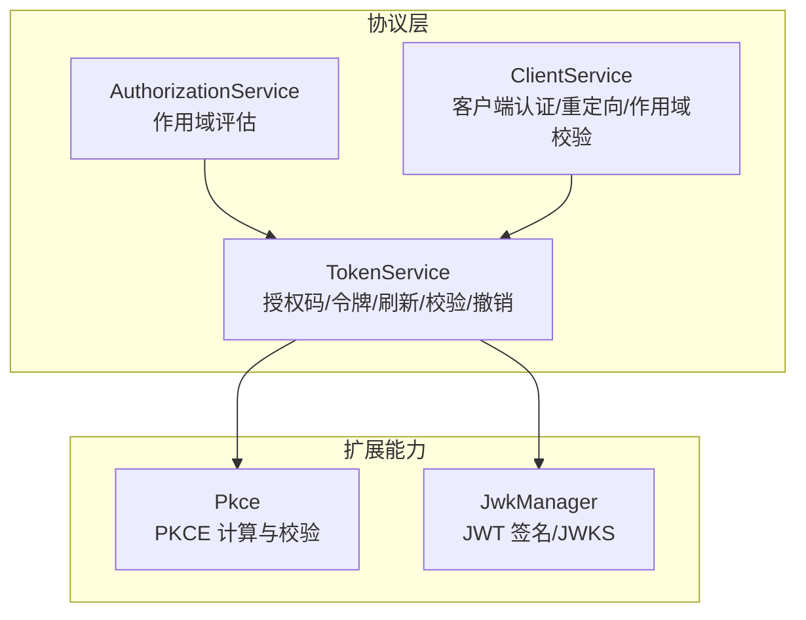
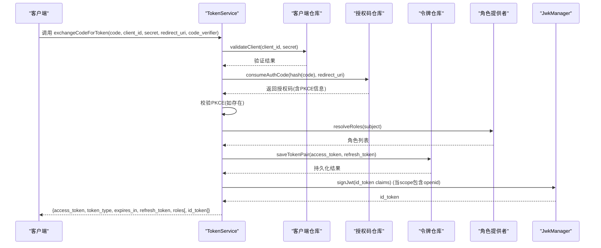
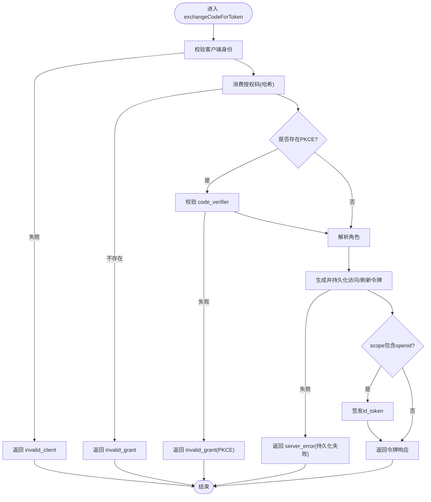
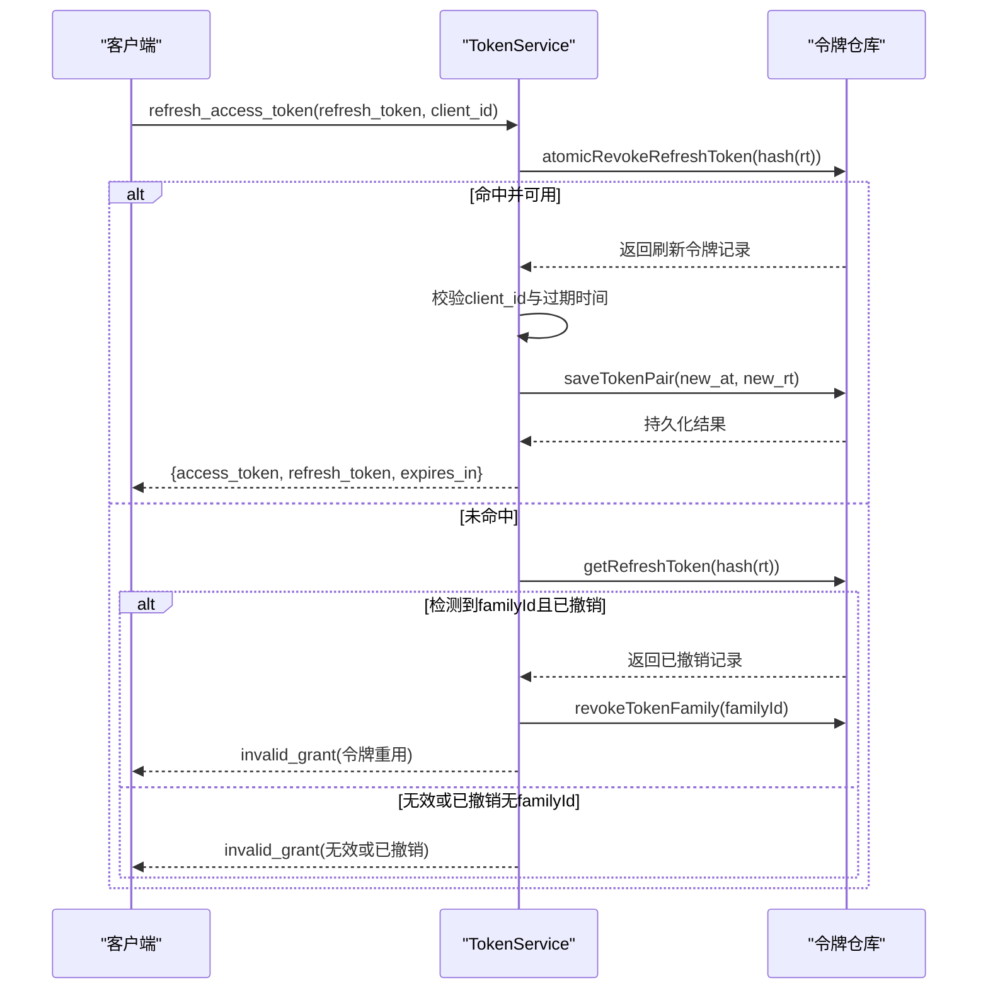
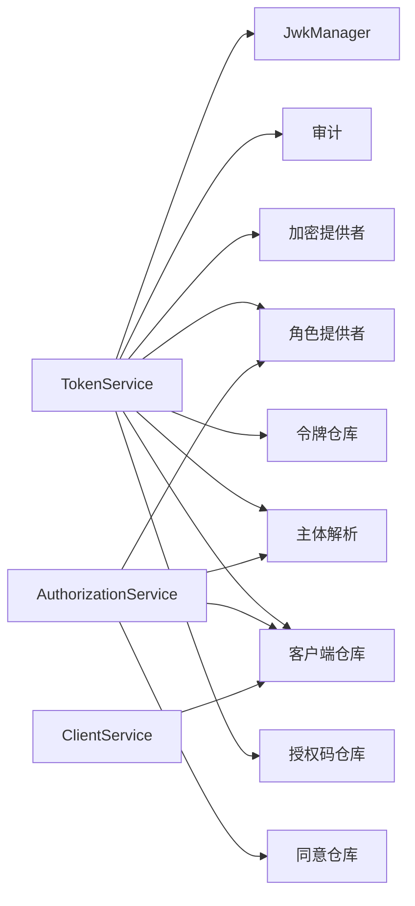

# OAuth2引擎 (authforge::oauth2)

<cite>
**本文引用的文件**
- [AuthorizationService.cc](file://libs/oauth2/src/protocol/AuthorizationService.cc)
- [TokenService.cc](file://libs/oauth2/src/protocol/TokenService.cc)
- [ClientService.cc](file://libs/oauth2/src/protocol/ClientService.cc)
- [Pkce.cc](file://libs/oauth2/src/pkce/Pkce.cc)
- [JwkManager.cc](file://libs/oauth2/src/jwk/JwkManager.cc)
</cite>

## 目录
1. [简介](#简介)
2. [项目结构](#项目结构)
3. [核心组件](#核心组件)
4. [架构总览](#架构总览)
5. [详细组件分析](#详细组件分析)
6. [依赖关系分析](#依赖关系分析)
7. [性能考量](#性能考量)
8. [故障排查指南](#故障排查指南)
9. [结论](#结论)
10. [附录：流程示例与集成要点](#附录：流程示例与集成要点)

## 简介
本文件面向 authforge::oauth2 模块，系统性说明其 OAuth2/OIDC 协议的核心实现与工程化设计。重点覆盖：
- 授权码流程（含 PKCE）、客户端凭证模式、刷新令牌等标准流程的处理逻辑
- 令牌管理机制：访问令牌与刷新令牌的生成、校验、轮换与撤销；OIDC id_token 的签发
- 客户端认证：统一接口封装对客户端身份与回调地址的校验
- 授权码的生成与管理：安全存储、一次性使用、过期控制
- 状态管理与会话处理：角色解析、同意范围评估、审计事件记录
- 完整流程示例与集成要点：便于快速对接与排障

## 项目结构
OAuth2 引擎位于 libs/oauth2，按职责分层组织：
- protocol：协议层服务，编排授权码交换、令牌发放、刷新、校验、撤销等流程
- pkce：PKCE 扩展的实现（code_verifier/challenge 计算与校验）
- jwk：JWT 签名与 JWKS 导出（RS256），支撑 OIDC id_token 签发
- access：作用域决策引擎（供授权阶段评估 scope 是否可授予）

图表来源
- [AuthorizationService.cc:1-205](file://libs/oauth2/src/protocol/AuthorizationService.cc#L1-L205)
- [TokenService.cc:1-536](file://libs/oauth2/src/protocol/TokenService.cc#L1-L536)
- [ClientService.cc:1-96](file://libs/oauth2/src/protocol/ClientService.cc#L1-L96)
- [Pkce.cc:1-71](file://libs/oauth2/src/pkce/Pkce.cc#L1-L71)
- [JwkManager.cc:1-356](file://libs/oauth2/src/jwk/JwkManager.cc#L1-L356)

章节来源
- [AuthorizationService.cc:1-205](file://libs/oauth2/src/protocol/AuthorizationService.cc#L1-L205)
- [TokenService.cc:1-536](file://libs/oauth2/src/protocol/TokenService.cc#L1-L536)
- [ClientService.cc:1-96](file://libs/oauth2/src/protocol/ClientService.cc#L1-L96)
- [Pkce.cc:1-71](file://libs/oauth2/src/pkce/Pkce.cc#L1-L71)
- [JwkManager.cc:1-356](file://libs/oauth2/src/jwk/JwkManager.cc#L1-L356)

## 核心组件
- AuthorizationService：负责在授权阶段对用户请求的作用域进行综合评估，包括客户端配置、管理员角色豁免、用户同意记录等。
- TokenService：集中处理授权码交换、访问令牌与刷新令牌发放、令牌校验、令牌撤销、以及 OIDC id_token 签发。
- ClientService：提供客户端认证、重定向 URI 校验、客户端允许的作用域校验的统一入口。
- Pkce：实现 RFC 7636 的 code_verifier/code_challenge 计算与校验，支持 S256/plain。
- JwkManager：加载 RSA 私钥（环境变量/文件/配置），签发 RS256 的 JWT，并导出 JWKS。

章节来源
- [AuthorizationService.cc:41-202](file://libs/oauth2/src/protocol/AuthorizationService.cc#L41-L202)
- [TokenService.cc:32-536](file://libs/oauth2/src/protocol/TokenService.cc#L32-L536)
- [ClientService.cc:6-93](file://libs/oauth2/src/protocol/ClientService.cc#L6-L93)
- [Pkce.cc:11-68](file://libs/oauth2/src/pkce/Pkce.cc#L11-L68)
- [JwkManager.cc:31-353](file://libs/oauth2/src/jwk/JwkManager.cc#L31-L353)

## 架构总览
OAuth2/OIDC 的关键交互由协议层服务编排完成，依赖存储库与通用端口（加密、审计、角色、主体解析）。下图展示授权码换取令牌的主路径：

图表来源
- [TokenService.cc:158-340](file://libs/oauth2/src/protocol/TokenService.cc#L158-L340)
- [Pkce.cc:28-36](file://libs/oauth2/src/pkce/Pkce.cc#L28-L36)
- [JwkManager.cc:231-293](file://libs/oauth2/src/jwk/JwkManager.cc#L231-L293)

## 详细组件分析

### 授权码与令牌发放（授权码流程 + PKCE）
- 授权码生成：生成随机值并哈希后持久化，附带客户端ID、用户主体、scope、重定向URI、PKCE挑战及方法、nonce、过期时间。
- 令牌交换：
  - 校验客户端身份
  - 消费授权码（一次性使用），校验客户端ID一致性与重定向URI
  - 若存在 PKCE，校验 code_verifier 与 stored challenge/method
  - 校验授权码未过期
  - 解析角色，生成访问令牌与刷新令牌（哈希存储），写入 issued_at、expires_at、issuer
  - 若 scope 包含 openid 且已初始化 JWK，则签发 id_token（iss/sub/aud/iat/exp/nonce）
  - 审计记录“token_issued”

图表来源
- [TokenService.cc:124-340](file://libs/oauth2/src/protocol/TokenService.cc#L124-L340)
- [Pkce.cc:28-36](file://libs/oauth2/src/pkce/Pkce.cc#L28-L36)
- [JwkManager.cc:231-293](file://libs/oauth2/src/jwk/JwkManager.cc#L231-L293)

章节来源
- [TokenService.cc:124-340](file://libs/oauth2/src/protocol/TokenService.cc#L124-L340)
- [Pkce.cc:11-68](file://libs/oauth2/src/pkce/Pkce.cc#L11-L68)
- [JwkManager.cc:231-293](file://libs/oauth2/src/jwk/JwkManager.cc#L231-L293)

### 刷新令牌（旋转与重用检测）
- 原子尝试撤销并重用旧刷新令牌：若成功获取到原记录，则校验客户端ID与过期时间，签发新访问令牌与新刷新令牌（保持 familyId），并持久化。
- 若首次原子撤销未命中，回退查询以检测“令牌重用”：若发现被标记为撤销且属于同一 familyId，则审计并撤销整个家族令牌，返回 invalid_grant。
- 审计记录“refresh_token_reuse_detected”、“token_refreshed”。

图表来源
- [TokenService.cc:342-447](file://libs/oauth2/src/protocol/TokenService.cc#L342-L447)

章节来源
- [TokenService.cc:342-447](file://libs/oauth2/src/protocol/TokenService.cc#L342-L447)

### 访问令牌校验与撤销
- 校验：将明文令牌哈希后查询数据库，检查是否被撤销与是否过期，返回有效令牌对象或空。
- 撤销：将明文令牌哈希后执行撤销操作。

章节来源
- [TokenService.cc:449-518](file://libs/oauth2/src/protocol/TokenService.cc#L449-L518)

### 客户端认证与作用域校验
- 客户端认证：委托底层客户端仓库进行 client_id/client_secret 校验。
- 重定向 URI 校验：读取客户端配置，判断请求中的 redirect_uri 是否在注册列表中。
- 客户端作用域校验：读取客户端允许的作用域集合，过滤出非法 scope 并返回错误信息。

章节来源
- [ClientService.cc:6-93](file://libs/oauth2/src/protocol/ClientService.cc#L6-L93)

### 作用域评估与同意（授权阶段）
- 根据请求的 scope 列表，结合客户端配置、管理员角色（admin）豁免、用户同意记录，综合判定每个 scope 的有效性。
- 内部先解析 subject 为内部用户ID，再并发查询各 scope 的用户同意情况，最后汇总为 ScopeValidationSummary。

章节来源
- [AuthorizationService.cc:54-202](file://libs/oauth2/src/protocol/AuthorizationService.cc#L54-L202)

### PKCE 扩展
- 支持 S256 与 plain 两种方法；S256 使用 SHA-256 并 Base64URL 编码；plain 直接透传。
- 校验时重新计算 challenge 并与存储的 challenge 比较。
- 提供 code_verifier 与 code_challenge 格式校验（字符集与长度限制）。

章节来源
- [Pkce.cc:11-68](file://libs/oauth2/src/pkce/Pkce.cc#L11-L68)
- [TokenService.cc:520-533](file://libs/oauth2/src/protocol/TokenService.cc#L520-L533)

### JWT 签发与 JWKS（OIDC id_token）
- 私钥加载优先级：环境变量 OAUTH2_SIGNING_KEY > 环境变量 OAUTH2_JWT_KEY_PATH > 配置文件 signing_key_path > 生成临时密钥（仅开发环境）。
- 签发 RS256 的 JWT，header 包含 alg=RS256、typ=JWT、kid；payload 包含 iss/sub/aud/iat/exp/nonce 等。
- 导出公钥组件 n/e 并组装 JWKS 文档。

章节来源
- [JwkManager.cc:31-121](file://libs/oauth2/src/jwk/JwkManager.cc#L31-L121)
- [JwkManager.cc:231-353](file://libs/oauth2/src/jwk/JwkManager.cc#L231-L353)
- [TokenService.cc:305-328](file://libs/oauth2/src/protocol/TokenService.cc#L305-L328)

## 依赖关系分析
- TokenService 依赖：
  - 客户端仓库：validateClient、getClient
  - 授权码仓库：saveAuthCode、consumeAuthCode
  - 令牌仓库：saveTokenPair、getAccessToken、introspectToken、revokeAccessToken、atomicRevokeRefreshToken、getRefreshToken、revokeTokenFamily
  - 加密提供者：生成随机数、哈希、SHA-256、Base64URL
  - 审计：记录颁发/刷新/重用检测等事件
  - 主体解析与角色提供者：解析 subject 并获取角色
  - JwkManager：签发 id_token
- AuthorizationService 依赖：
  - 客户端仓库：获取客户端配置
  - 同意仓库：查询用户对某 scope 的同意
  - 主体解析与角色提供者：用于 admin 角色豁免
- ClientService 依赖：
  - 客户端仓库：validateClient、getClient

图表来源
- [TokenService.cc:32-536](file://libs/oauth2/src/protocol/TokenService.cc#L32-L536)
- [AuthorizationService.cc:41-202](file://libs/oauth2/src/protocol/AuthorizationService.cc#L41-L202)
- [ClientService.cc:6-93](file://libs/oauth2/src/protocol/ClientService.cc#L6-L93)

章节来源
- [TokenService.cc:32-536](file://libs/oauth2/src/protocol/TokenService.cc#L32-L536)
- [AuthorizationService.cc:41-202](file://libs/oauth2/src/protocol/AuthorizationService.cc#L41-L202)
- [ClientService.cc:6-93](file://libs/oauth2/src/protocol/ClientService.cc#L6-L93)

## 性能考量
- 异步回调链：大量 I/O 通过回调链式推进，避免阻塞线程；注意捕获生命周期（如 shared_from_this）以避免悬垂引用。
- 并发同意查询：对多个 scope 的同意查询并行发起，减少整体延迟。
- 令牌哈希存储：所有敏感令牌均以哈希形式持久化，降低泄露风险；校验时同样哈希比对。
- 刷新令牌原子操作：使用原子撤销+回退查询，兼顾安全性与性能，同时支持家族令牌批量撤销。
- JWT 签发：仅在 scope 包含 openid 时触发，减少不必要的开销。

[本节为通用指导，不直接分析具体文件]

## 故障排查指南
- 客户端认证失败：检查 client_id/client_secret 是否正确，确认客户端仓库实现正确。
- 授权码无效或已过期：确认授权码未被重复消费，且在 TTL 内；核对重定向 URI 是否匹配。
- PKCE 校验失败：确保 code_verifier 与 stored challenge/method 匹配；S256 需严格遵循 Base64URL 编码。
- 刷新令牌重用检测：若出现“令牌重用”，系统会撤销整个 familyId 下的令牌；检查客户端是否并发刷新或共享刷新令牌。
- 令牌持久化失败：若保存访问/刷新令牌失败，将返回 server_error；检查存储后端可用性。
- id_token 签发失败：确认 JwkManager 已初始化并加载私钥；检查 kid 与算法配置。

章节来源
- [TokenService.cc:158-340](file://libs/oauth2/src/protocol/TokenService.cc#L158-L340)
- [TokenService.cc:342-447](file://libs/oauth2/src/protocol/TokenService.cc#L342-L447)
- [Pkce.cc:28-68](file://libs/oauth2/src/pkce/Pkce.cc#L28-L68)
- [JwkManager.cc:31-121](file://libs/oauth2/src/jwk/JwkManager.cc#L31-L121)

## 结论
authforge::oauth2 以清晰的协议层服务为核心，围绕授权码、令牌发放与刷新、PKCE、JWT 签发等关键能力，提供了安全、可扩展且易于集成的 OAuth2/OIDC 实现。通过统一的客户端认证接口、细粒度的作用域评估与同意机制、完善的审计与错误处理，能够满足生产环境的合规与安全要求。

[本节为总结性内容，不直接分析具体文件]

## 附录：流程示例与集成要点
- 授权码流程（含 PKCE）
  - 客户端构造授权请求，携带 client_id、redirect_uri、response_type=code、scope、state、code_challenge、code_challenge_method=S256
  - 服务端生成并存储授权码（哈希），回调时校验 PKCE，发放 access_token、refresh_token，必要时签发 id_token
  - 参考路径：[TokenService.cc:124-340](file://libs/oauth2/src/protocol/TokenService.cc#L124-L340)、[Pkce.cc:11-68](file://libs/oauth2/src/pkce/Pkce.cc#L11-L68)
- 客户端凭证模式
  - 通过 ClientService.validateClient 校验客户端身份后，可直接申请 access_token（由上层控制器组合 TokenService 能力）
  - 参考路径：[ClientService.cc:6-18](file://libs/oauth2/src/protocol/ClientService.cc#L6-L18)
- 刷新令牌
  - 使用 refresh_token 调用刷新接口，系统将原子撤销旧刷新令牌并签发新的访问/刷新令牌；若检测到重用，将撤销整个家族令牌
  - 参考路径：[TokenService.cc:342-447](file://libs/oauth2/src/protocol/TokenService.cc#L342-L447)
- 令牌校验与撤销
  - 校验：传入 access_token，系统哈希后查询并检查有效性
  - 撤销：传入 access_token，系统哈希后执行撤销
  - 参考路径：[TokenService.cc:449-518](file://libs/oauth2/src/protocol/TokenService.cc#L449-L518)
- OIDC id_token
  - 当 scope 包含 openid 且 JwkManager 已初始化时，自动签发 id_token；可通过 JWKS 端点获取公钥进行验证
  - 参考路径：[TokenService.cc:305-328](file://libs/oauth2/src/protocol/TokenService.cc#L305-L328)、[JwkManager.cc:231-353](file://libs/oauth2/src/jwk/JwkManager.cc#L231-L353)
- 作用域评估与同意
  - 授权阶段根据客户端配置、管理员角色、用户同意综合判定 scope 是否可授予
  - 参考路径：[AuthorizationService.cc:54-202](file://libs/oauth2/src/protocol/AuthorizationService.cc#L54-L202)

[本节为集成指引，不直接分析具体文件]