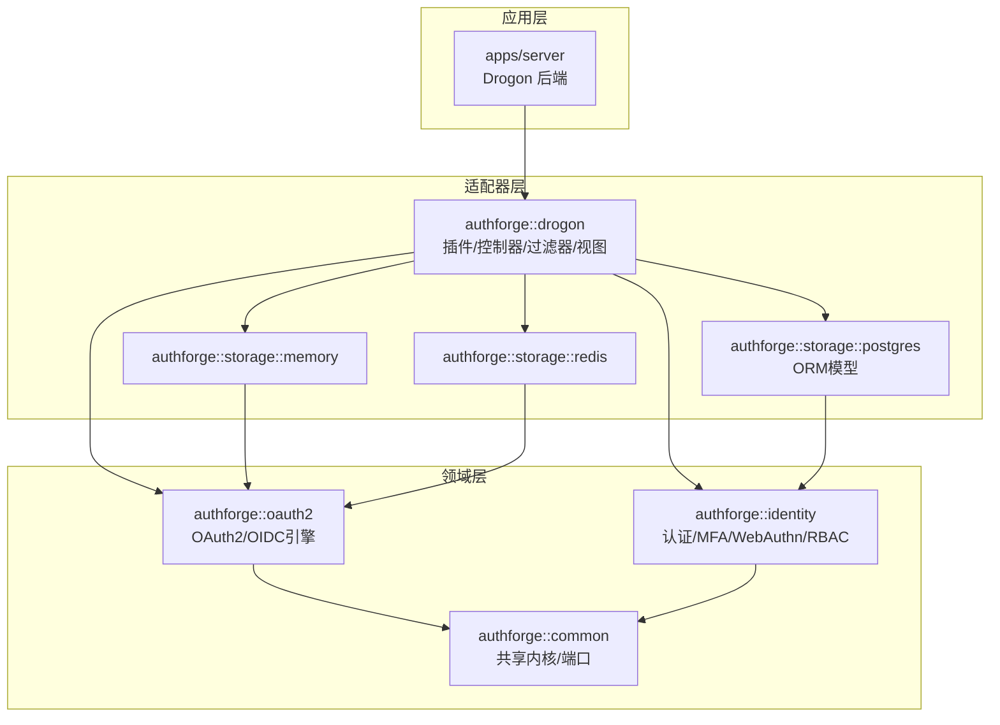
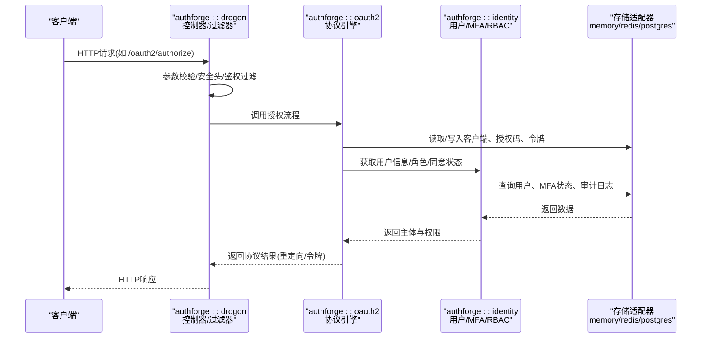
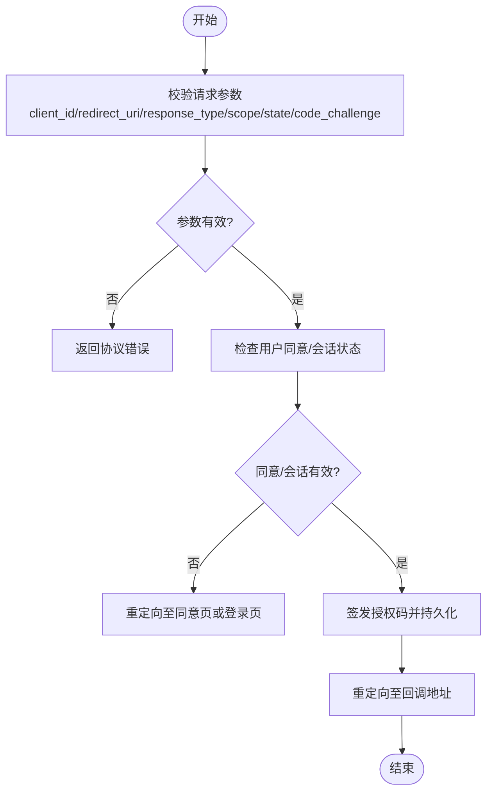
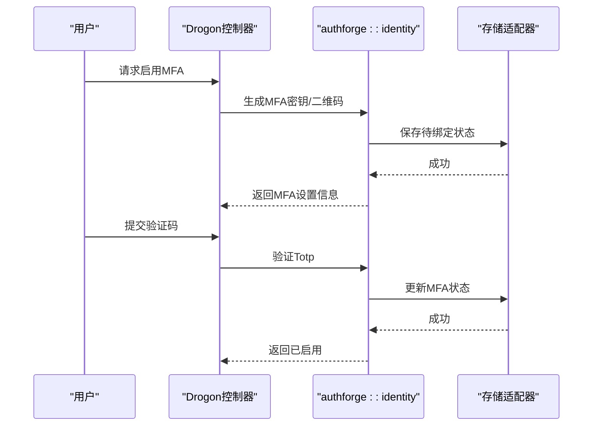
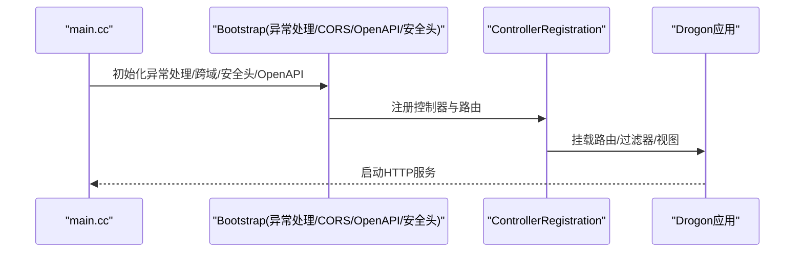
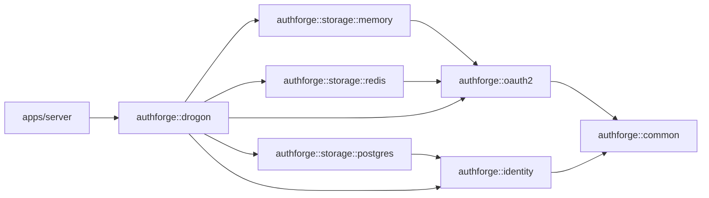

# 核心库设计

<cite>
**本文引用的文件**
- [README.md](file://README.md)
- [CMakeLists.txt](file://CMakeLists.txt)
- [apps/server/src/bootstrap/IdentityAssembly.cc](file://apps/server/src/bootstrap/IdentityAssembly.cc)
- [apps/server/src/bootstrap/ExceptionHandlerSetup.cc](file://apps/server/src/bootstrap/ExceptionHandlerSetup.cc)
- [apps/server/src/bootstrap/CorsSetup.cc](file://apps/server/src/bootstrap/CorsSetup.cc)
- [apps/server/src/bootstrap/OpenApiSetup.cc](file://apps/server/src/bootstrap/OpenApiSetup.cc)
- [apps/server/src/bootstrap/SecurityHeaders.cc](file://apps/server/src/bootstrap/SecurityHeaders.cc)
- [apps/server/src/bootstrap/ControllerRegistration.cc](file://apps/server/src/bootstrap/ControllerRegistration.cc)
- [apps/server/src/main.cc](file://apps/server/src/main.cc)
- [libs/common/CMakeLists.txt](file://libs/common/CMakeLists.txt)
- [libs/oauth2/CMakeLists.txt](file://libs/oauth2/CMakeLists.txt)
- [libs/identity/CMakeLists.txt](file://libs/identity/CMakeLists.txt)
- [libs/drogon/CMakeLists.txt](file://libs/drogon/CMakeLists.txt)
- [libs/storage-memory/CMakeLists.txt](file://libs/storage-memory/CMakeLists.txt)
- [libs/storage-postgres/CMakeLists.txt](file://libs/storage-postgres/CMakeLists.txt)
- [libs/storage-redis/CMakeLists.txt](file://libs/storage-redis/CMakeLists.txt)
</cite>

## 目录
1. [简介](#简介)
2. [项目结构](#项目结构)
3. [核心组件](#核心组件)
4. [架构总览](#架构总览)
5. [详细组件分析](#详细组件分析)
6. [依赖关系分析](#依赖关系分析)
7. [性能考量](#性能考量)
8. [故障排查指南](#故障排查指南)
9. [结论](#结论)
10. [附录](#附录)

## 简介
本文件面向AuthForge核心库的设计与实现，聚焦以下目标：
- 说明 authforge::common 通用库的工具类、错误处理、配置管理等基础能力。
- 详解 authforge::oauth2 OAuth2/OIDC 引擎的协议处理、令牌管理、客户端认证等核心功能。
- 阐述 authforge::identity 身份认证库的用户管理、权限控制、MFA 支持等能力。
- 解释 authforge::drogon 适配器的作用（Web控制器、中间件、视图渲染）。
- 分析各库之间的依赖关系与接口设计，并提供使用模式与示例路径。

该文档基于仓库顶层 README 与 CMake 构建脚本中的分层与依赖约束进行梳理，确保读者既能把握整体架构，也能定位到具体实现位置。

**章节来源**
- [README.md:16-51](file://README.md#L16-L51)
- [CMakeLists.txt:57-118](file://CMakeLists.txt#L57-L118)

## 项目结构
AuthForge采用清晰的SDK分层与可插拔存储抽象：
- 领域层（Domain）：authforge::oauth2、authforge::identity、authforge::common
- 适配器层（Adapter）：authforge::storage-*（memory/postgres/redis）、authforge::drogon
- 应用层（App）：apps/server（Drogon后端服务）
- 前端与管理台：frontends/admin、frontends/user
- 测试与工具：tests、tools、scripts

**图表来源**
- [README.md:31-49](file://README.md#L31-L49)
- [CMakeLists.txt:57-118](file://CMakeLists.txt#L57-L118)

**章节来源**
- [README.md:16-51](file://README.md#L16-L51)
- [CMakeLists.txt:57-118](file://CMakeLists.txt#L57-L118)

## 核心组件
- authforge::common：提供跨模块复用的配置加载与校验、统一错误分类与响应、通用验证规则与工具函数；作为“共享内核”，被oauth2与identity共同依赖。
- authforge::oauth2：实现OAuth2/OIDC协议栈（授权码+PKCE、客户端凭证、刷新令牌、令牌查询/撤销、发现、JWKS、UserInfo、设备码、动态注册等），并通过存储抽象对接持久化。
- authforge::identity：负责用户生命周期、密码策略、MFA（TOTP/WebAuthn）、RBAC、会话管理与审计日志等。
- authforge::drogon：将领域能力暴露为HTTP端点，包含插件装配、控制器、过滤器、视图模板与OpenAPI/Swagger集成。

**章节来源**
- [README.md:70-98](file://README.md#L70-L98)
- [CMakeLists.txt:57-118](file://CMakeLists.txt#L57-L118)

## 架构总览
下图展示了从请求进入Drogon服务器，到OAuth2引擎与身份服务的调用链，以及存储适配器的接入方式。

**图表来源**
- [README.md:31-49](file://README.md#L31-L49)
- [CMakeLists.txt:57-118](file://CMakeLists.txt#L57-L118)

## 详细组件分析

### authforge::common（通用库）
职责与能力
- 配置管理：配置文件加载、环境变量覆盖、类型安全的配置访问、配置校验与迁移提示。
- 错误处理：统一的错误分类、异常捕获、结构化错误响应、HTTP状态码映射、请求ID生成与日志记录。
- 验证器：OAuth2相关字段校验（如client_id、redirect_uri等）与规则集合。
- 工具类：加密哈希、随机数、时间戳、邮箱规范化等通用工具。

典型使用模式
- 在启动阶段加载并校验配置，再注入到各服务。
- 在控制器或服务中通过统一错误处理器包装业务逻辑，保证一致的错误响应格式。
- 对输入参数进行集中式校验，减少重复代码。

参考实现位置
- 配置与错误处理、验证器相关文件位于 libs/common 下（含include/src/test/testing）。
- 顶层CMake将common作为首个子目录引入，体现其“共享内核”地位。

**章节来源**
- [CMakeLists.txt:57-70](file://CMakeLists.txt#L57-L70)
- [libs/common/CMakeLists.txt](file://libs/common/CMakeLists.txt)

### authforge::oauth2（OAuth2/OIDC引擎）
职责与能力
- 协议处理：授权码+PKCE、客户端凭证、刷新令牌、令牌查询/撤销、发现、JWKS、UserInfo、设备授权码、动态客户端注册。
- 令牌管理：签发、刷新、吊销、过期策略、家庭刷新令牌、审计与指标。
- 客户端认证：多种grant_type与客户端标识校验、范围（scope）校验、同意（consent）流程。
- 存储抽象：通过Repository接口与memory/redis/postgres适配器解耦。

关键流程示意（以授权码+PKCE为例）

参考实现位置
- 协议与令牌逻辑位于 libs/oauth2 下（include/src/test）。
- 存储适配器位于 libs/storage-memory、libs/storage-redis、libs/storage-postgres。

**章节来源**
- [README.md:70-85](file://README.md#L70-L85)
- [CMakeLists.txt:72-110](file://CMakeLists.txt#L72-L110)

### authforge::identity（身份认证库）
职责与能力
- 用户管理：注册、资料维护、密码重置、邮箱验证、账户锁定策略。
- 权限控制：RBAC（角色/范围/客户端三重限制）、URL模式匹配、同意与范围绑定。
- MFA支持：TOTP设置/验证/禁用、WebAuthn/FIDO2注册与认证、设备码流程。
- 会话与审计：会话生命周期、审计日志、多租户组织支持。

关键流程示意（MFA TOTP）

参考实现位置
- 身份能力位于 libs/identity 下（include/src/test）。
- 与PostgreSQL ORM模型交互由 storage-postgres 提供。

**章节来源**
- [README.md:86-98](file://README.md#L86-L98)
- [CMakeLists.txt:79-94](file://CMakeLists.txt#L79-L94)

### authforge::drogon（适配器层）
职责与能力
- Web控制器：将OAuth2与Identity能力暴露为REST/HTML端点（如授权、令牌、用户信息、同意页、登录页、管理后台API）。
- 中间件/过滤器：CORS、安全头、异常处理、OpenAPI/Swagger集成。
- 视图渲染：登录/同意页面模板（CSP策略）。
- 插件装配：与服务启动流程集成，注册路由与全局配置。

启动装配示意（简化）

参考实现位置
- 启动与装配位于 apps/server/src/bootstrap 下的多个文件。
- 控制器与视图由 drogon 包提供并与上层服务集成。

**章节来源**
- [apps/server/src/bootstrap/ExceptionHandlerSetup.cc](file://apps/server/src/bootstrap/ExceptionHandlerSetup.cc)
- [apps/server/src/bootstrap/CorsSetup.cc](file://apps/server/src/bootstrap/CorsSetup.cc)
- [apps/server/src/bootstrap/OpenApiSetup.cc](file://apps/server/src/bootstrap/OpenApiSetup.cc)
- [apps/server/src/bootstrap/SecurityHeaders.cc](file://apps/server/src/bootstrap/SecurityHeaders.cc)
- [apps/server/src/bootstrap/ControllerRegistration.cc](file://apps/server/src/bootstrap/ControllerRegistration.cc)
- [apps/server/src/main.cc](file://apps/server/src/main.cc)

## 依赖关系分析
- 方向性约束：领域层（oauth2/identity/common）不依赖Drogon；适配器层（storage-*、drogon）依赖领域层；应用层（server）依赖所有层。
- 可选特性：通过WITH_IDENTITY/WITH_SOCIAL/WITH_WEBAUTHN开关裁剪依赖面。
- 存储抽象：oauth2通过Repository接口与memory/redis/postgres解耦；identity通过仓储接口与postgres解耦。

**图表来源**
- [README.md:31-49](file://README.md#L31-L49)
- [CMakeLists.txt:57-118](file://CMakeLists.txt#L57-L118)

**章节来源**
- [CMakeLists.txt:57-118](file://CMakeLists.txt#L57-L118)

## 性能考量
- 存储缓存：Redis适配器提供缓存装饰器（如CachedClientRepository），降低高频读放大。
- 令牌家族：刷新令牌家族机制提升安全性与并发友好性。
- 并发安全：CI中包含并发竞态测试（如JWK、授权过滤、存储生命周期），确保高并发场景稳定性。
- 指标与审计：Prometheus指标与结构化审计日志便于观测与容量规划。

[本节为通用指导，不直接分析具体文件]

## 故障排查指南
- 统一异常处理：通过ExceptionHandlerSetup集中捕获未处理异常，输出标准化错误信封，便于前端与监控消费。
- 配置问题：确认配置文件与环境变量覆盖生效，关注配置校验失败日志。
- 存储连接：检查PostgreSQL/Redis连接与权限，结合审计日志定位读写失败。
- 协议错误：根据OAuth2错误码快速定位（如invalid_client、invalid_grant、insufficient_scope）。

**章节来源**
- [apps/server/src/bootstrap/ExceptionHandlerSetup.cc](file://apps/server/src/bootstrap/ExceptionHandlerSetup.cc)

## 结论
AuthForge通过清晰的分层与可插拔存储抽象，实现了生产级OAuth2/OIDC授权服务与SDK。common提供稳定内核，oauth2实现协议与令牌管理，identity承载用户与权限，drogon完成Web适配与集成。借助CMake选项与存储适配器，可按需裁剪与扩展，满足产品化与嵌入式两种使用场景。

[本节为总结性内容，不直接分析具体文件]

## 附录
- SDK集成与运行时契约：参见docs/backend/sdk-integration-guide.md与sdk-runtime-contract.md。
- 部署与运维：参见docs/ops与deploy目录。
- 测试：后端API测试、E2E与单元测试见scripts与tests目录。

[本节为指引性内容，不直接分析具体文件]