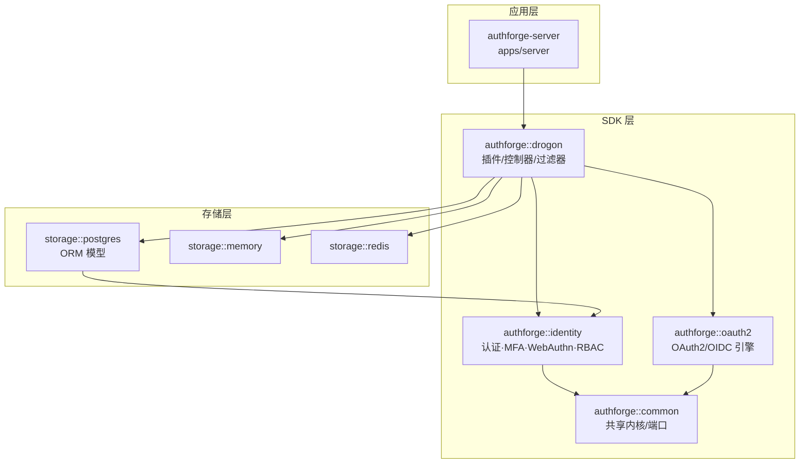
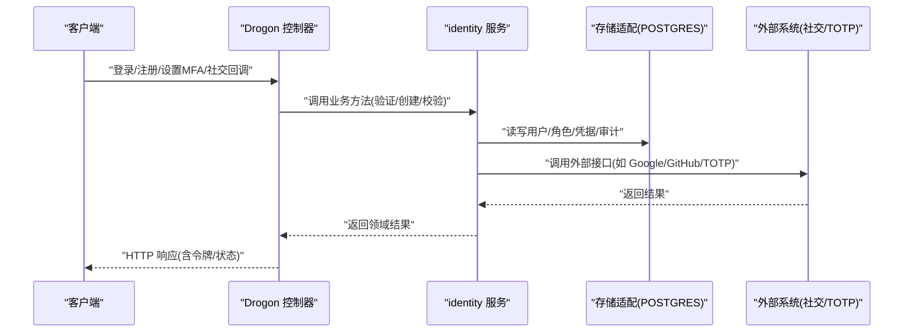
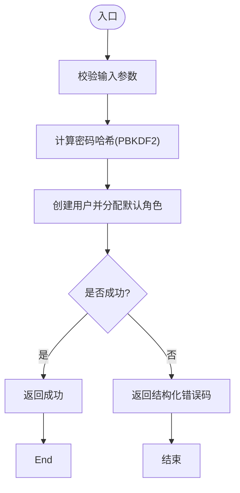
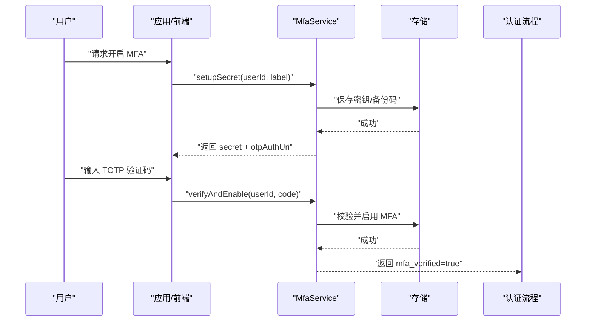
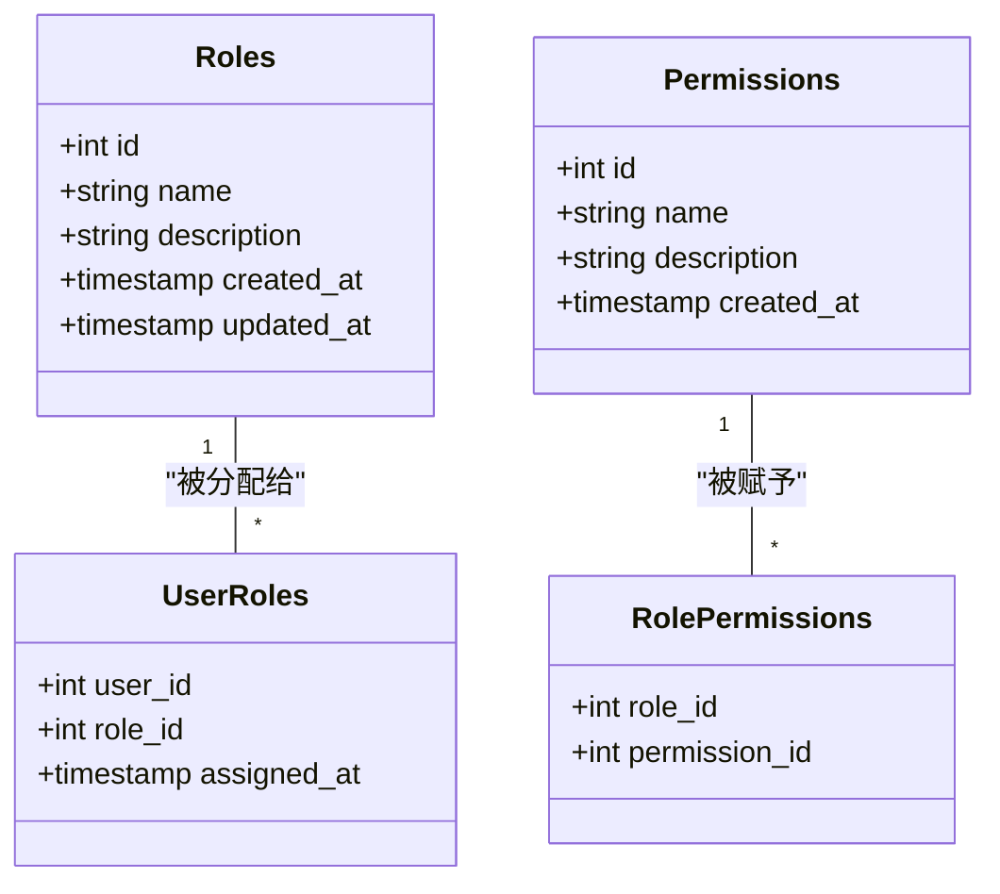
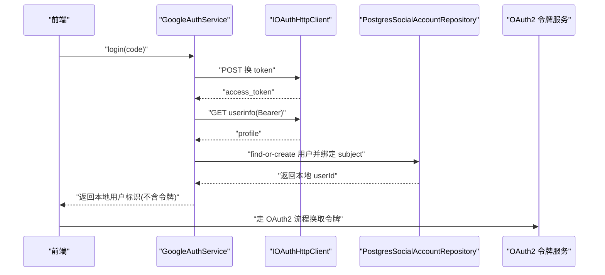
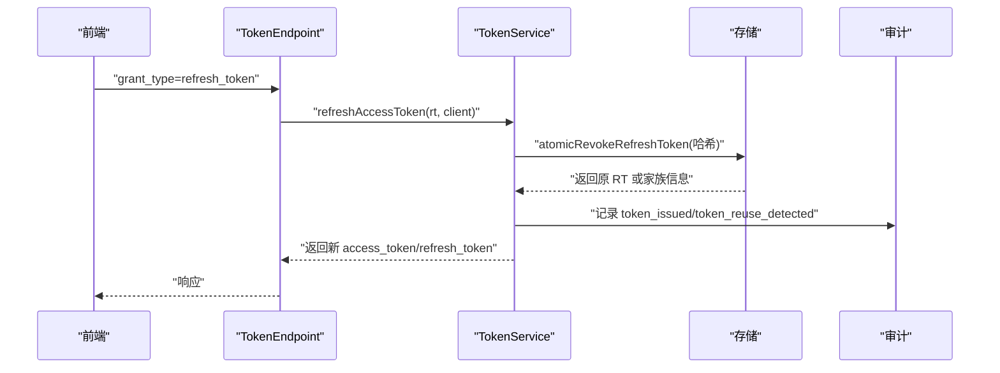
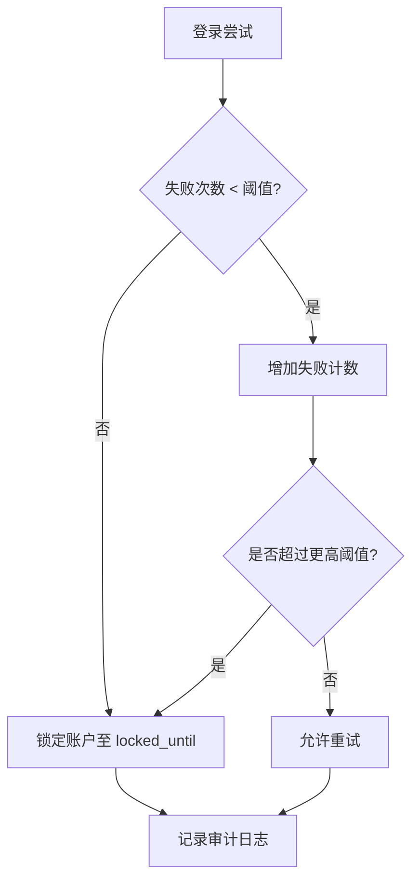
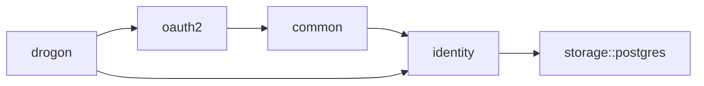

# 身份认证 (authforge::identity)

<cite>
**本文引用的文件**
- [README.md](file://README.md)
- [V004__users_table.sql](file://apps/server/migrations/V004__users_table.sql)
- [V005__rbac_schema.sql](file://apps/server/migrations/V005__rbac_schema.sql)
- [V011__mfa_support.sql](file://apps/server/migrations/V011__mfa_support.sql)
- [V012__audit_logs.sql](file://apps/server/migrations/V012__audit_logs.sql)
- [V013__account_lockout.sql](file://apps/server/migrations/V013__account_lockout.sql)
- [V018__webauthn.sql](file://apps/server/migrations/V018__webauthn.sql)
- [AuthService.cc](file://libs/identity/src/AuthService.cc)
- [MfaService.cc](file://libs/identity/src/mfa/MfaService.cc)
- [GoogleAuthService.cc](file://libs/identity/src/social/GoogleAuthService.cc)
- [GitHubAuthService.cc](file://libs/identity/src/social/GitHubAuthService.cc)
- [SocialAuthService.h](file://libs/identity/include/authforge/identity/SocialAuthService.h)
- [IOAuthHttpClient.h](file://libs/identity/include/authforge/identity/IOAuthHttpClient.h)
- [PostgresIdentityRepository.cc](file://libs/storage-postgres/src/PostgresIdentityRepository.cc)
- [PostgresSocialAccountRepository.cc](file://libs/storage-postgres/src/PostgresSocialAccountRepository.cc)
- [TokenEndpointController.cc](file://libs/drogon/src/controllers/TokenEndpointController.cc)
- [UserSelfServiceController.cc](file://libs/drogon/src/controllers/UserSelfServiceController.cc)
- [openapi.json](file://apps/server/docs/api/openapi.json)
- [rbac-guide.md](file://docs/backend/rbac-guide.md)
</cite>

## 目录
1. [简介](#简介)
2. [项目结构](#项目结构)
3. [核心组件](#核心组件)
4. [架构总览](#架构总览)
5. [详细组件分析](#详细组件分析)
6. [依赖关系分析](#依赖关系分析)
7. [性能考量](#性能考量)
8. [故障排查指南](#故障排查指南)
9. [结论](#结论)
10. [附录](#附录)

## 简介
本文件面向 authforge::identity 身份认证库，系统性阐述用户生命周期管理、密码哈希、会话与令牌、多因素认证（TOTP/WebAuthn）、基于角色的访问控制（RBAC）、社交登录集成与安全策略（防暴力破解、账户锁定、审计日志）等能力。文档同时提供架构图、时序图、流程图以及可操作的集成建议与安全最佳实践，帮助读者快速理解并安全落地。

## 项目结构
authforge 采用分层 SDK 设计，identity 层负责“认证、MFA、WebAuthn、RBAC”等身份域能力，并通过端口（如 IOAuthHttpClient、ISocialAccountRepository、ICryptoProvider、IClock 等）与存储实现解耦；上层 Drogon 插件/控制器负责 HTTP 编排与协议交互；存储层通过 storage-postgres/memory/redis 等适配器对接持久化。

图示来源
- [README.md:31-49](file://README.md#L31-L49)

章节来源
- [README.md:16-51](file://README.md#L16-L51)

## 核心组件
- 用户服务（AuthService）：注册、密码哈希、默认角色分配、错误分类。
- MFA 服务（MfaService）：TOTP 密钥生成、二维码 URI、校验启用、备份码。
- WebAuthn：凭据表结构与索引，支持 Passkey/FIDO2。
- RBAC：角色/权限表、用户-角色关联、URL 规则匹配。
- 社交登录：Google/GitHub 等第三方授权码交换与本地账户映射。
- 会话与令牌：刷新令牌家族、撤销与审计、前端恢复会话。
- 安全策略：账户锁定、审计日志、速率限制（Hodor）。

章节来源
- [AuthService.cc:247-286](file://libs/identity/src/AuthService.cc#L247-L286)
- [MfaService.cc:1-51](file://libs/identity/src/mfa/MfaService.cc#L1-L51)
- [V018__webauthn.sql:1-16](file://apps/server/migrations/V018__webauthn.sql#L1-L16)
- [V005__rbac_schema.sql:1-59](file://apps/server/migrations/V005__rbac_schema.sql#L1-L59)
- [SocialAuthService.h:25-44](file://libs/identity/include/authforge/identity/SocialAuthService.h#L25-L44)
- [TokenEndpointController.cc:1201-1223](file://libs/drogon/src/controllers/TokenEndpointController.cc#L1201-L1223)
- [V012__audit_logs.sql:1-23](file://apps/server/migrations/V012__audit_logs.sql#L1-L23)
- [V013__account_lockout.sql:1-7](file://apps/server/migrations/V013__account_lockout.sql#L1-L7)

## 架构总览
身份认证由“控制器/过滤器 -> identity 服务 -> 存储适配 -> 外部系统（社交提供商/设备）”构成。identity 层不直接依赖框架类型，通过端口注入实现可测试性与可替换性。

图示来源
- [SocialAuthService.h:25-44](file://libs/identity/include/authforge/identity/SocialAuthService.h#L25-L44)
- [IOAuthHttpClient.h:1-26](file://libs/identity/include/authforge/identity/IOAuthHttpClient.h#L1-L26)
- [PostgresIdentityRepository.cc:276-317](file://libs/storage-postgres/src/PostgresIdentityRepository.cc#L276-L317)

## 详细组件分析

### 用户生命周期与密码哈希
- 注册流程：生成 PBKDF2 密码哈希（嵌入盐），写入用户记录，并分配默认角色（user）。
- 登录验证：读取数据库中的哈希与盐，使用 PasswordHasher 进行验证；成功后重置失败计数与锁定状态。
- 密码更新：校验旧密码后生成新哈希并更新，同时使相关刷新令牌失效并记录审计事件。

图示来源
- [AuthService.cc:247-286](file://libs/identity/src/AuthService.cc#L247-L286)
- [PostgresIdentityRepository.cc:276-317](file://libs/storage-postgres/src/PostgresIdentityRepository.cc#L276-L317)
- [V004__users_table.sql:1-11](file://apps/server/migrations/V004__users_table.sql#L1-L11)

章节来源
- [AuthService.cc:247-286](file://libs/identity/src/AuthService.cc#L247-L286)
- [PostgresIdentityRepository.cc:276-317](file://libs/storage-postgres/src/PostgresIdentityRepository.cc#L276-L317)
- [UserSelfServiceController.cc:197-300](file://libs/drogon/src/controllers/UserSelfServiceController.cc#L197-L300)
- [V004__users_table.sql:1-11](file://apps/server/migrations/V004__users_table.sql#L1-L11)

### 多因素认证（TOTP 与 WebAuthn）
- TOTP：生成随机密钥与 OTP Auth URI，存储密钥与备份码；登录时校验一次性验证码，通过后标记 MFA 已验证。
- WebAuthn：以 webauthn_credentials 表存储凭据 ID、公钥、签名次数、传输方式等，支持 FIDO2/Passkey 无密码登录。

图示来源
- [MfaService.cc:1-51](file://libs/identity/src/mfa/MfaService.cc#L1-L51)
- [V011__mfa_support.sql:1-6](file://apps/server/migrations/V011__mfa_support.sql#L1-L6)
- [V018__webauthn.sql:1-16](file://apps/server/migrations/V018__webauthn.sql#L1-L16)
- [openapi.json:1761-1824](file://apps/server/docs/api/openapi.json#L1761-L1824)

章节来源
- [MfaService.cc:1-51](file://libs/identity/src/mfa/MfaService.cc#L1-L51)
- [V011__mfa_support.sql:1-6](file://apps/server/migrations/V011__mfa_support.sql#L1-L6)
- [V018__webauthn.sql:1-16](file://apps/server/migrations/V018__webauthn.sql#L1-L16)
- [openapi.json:1761-1824](file://apps/server/docs/api/openapi.json#L1761-L1824)

### 基于角色的访问控制（RBAC）
- 数据模型：roles、permissions、user_roles、role_permissions，内置 admin/user 角色及基础权限。
- 访问控制：通过 URL 正则规则匹配（如 /api/admin/.* 需要 admin），结合 Token 中 userId 查询当前角色进行鉴权。
- 管理端：提供角色/权限 CRUD 与用户角色分配能力。

图示来源
- [V005__rbac_schema.sql:1-59](file://apps/server/migrations/V005__rbac_schema.sql#L1-L59)
- [rbac-guide.md:1-83](file://docs/backend/rbac-guide.md#L1-L83)

章节来源
- [V005__rbac_schema.sql:1-59](file://apps/server/migrations/V005__rbac_schema.sql#L1-L59)
- [rbac-guide.md:1-83](file://docs/backend/rbac-guide.md#L1-L83)

### 社交登录集成（Google、WeChat、GitHub）
- 统一抽象：通过 IOAuthHttpClient 端口封装出站 HTTP（表单 POST 换 token、带 Bearer 的 GET 拉取用户信息）。
- 具体实现：GoogleAuthService/GitHubAuthService 将授权码交换为 access_token，获取用户资料，并在本地 find-or-create 用户、绑定 subject、分配默认角色。
- 边界：identity 层不签发 OAuth2 令牌，仅完成“识别/创建本地账户”，令牌颁发由上层 oauth2 域处理。

图示来源
- [SocialAuthService.h:25-44](file://libs/identity/include/authforge/identity/SocialAuthService.h#L25-L44)
- [IOAuthHttpClient.h:1-26](file://libs/identity/include/authforge/identity/IOAuthHttpClient.h#L1-L26)
- [GoogleAuthService.cc:1-47](file://libs/identity/src/social/GoogleAuthService.cc#L1-L47)
- [GitHubAuthService.cc:1-44](file://libs/identity/src/social/GitHubAuthService.cc#L1-L44)
- [PostgresSocialAccountRepository.cc:77-109](file://libs/storage-postgres/src/PostgresSocialAccountRepository.cc#L77-L109)

章节来源
- [SocialAuthService.h:25-44](file://libs/identity/include/authforge/identity/SocialAuthService.h#L25-L44)
- [IOAuthHttpClient.h:1-26](file://libs/identity/include/authforge/identity/IOAuthHttpClient.h#L1-L26)
- [GoogleAuthService.cc:1-47](file://libs/identity/src/social/GoogleAuthService.cc#L1-L47)
- [GitHubAuthService.cc:1-44](file://libs/identity/src/social/GitHubAuthService.cc#L1-L44)
- [PostgresSocialAccountRepository.cc:77-109](file://libs/storage-postgres/src/PostgresSocialAccountRepository.cc#L77-L109)

### 会话管理与令牌刷新
- 刷新令牌家族：refresh_token 采用哈希存储，支持家族级撤销与复用检测。
- 前端恢复：前端持久化 refresh_token，页面刷新时尝试恢复会话，失败则视为未认证。
- 审计：令牌发放、撤销、复用等关键动作均记录审计日志。

图示来源
- [TokenEndpointController.cc:1201-1223](file://libs/drogon/src/controllers/TokenEndpointController.cc#L1201-L1223)
- [V012__audit_logs.sql:1-23](file://apps/server/migrations/V012__audit_logs.sql#L1-L23)

章节来源
- [TokenEndpointController.cc:1201-1223](file://libs/drogon/src/controllers/TokenEndpointController.cc#L1201-L1223)
- [V012__audit_logs.sql:1-23](file://apps/server/migrations/V012__audit_logs.sql#L1-L23)

### 安全策略：防暴力破解、账户锁定、审计日志
- 账户锁定：users 表新增 failed_login_count、locked_until、last_failed_login，达到阈值后锁定一段时间。
- 审计日志：结构化记录 actor/action/target/outcome/ip/user_agent/request_id/details，便于合规与排障。
- 速率限制：通过 Hodor 插件对敏感接口实施每 IP/每用户的速率限制，触发 429。

图示来源
- [V013__account_lockout.sql:1-7](file://apps/server/migrations/V013__account_lockout.sql#L1-L7)
- [V012__audit_logs.sql:1-23](file://apps/server/migrations/V012__audit_logs.sql#L1-L23)

章节来源
- [V013__account_lockout.sql:1-7](file://apps/server/migrations/V013__account_lockout.sql#L1-L7)
- [V012__audit_logs.sql:1-23](file://apps/server/migrations/V012__audit_logs.sql#L1-L23)

## 依赖关系分析
- identity 层依赖 common 提供的通用工具与端口（ICryptoProvider、IClock、IOAuthHttpClient 等），避免耦合框架。
- storage-postgres 实现 identity 的持久化接口，提供用户、角色、MFA、WebAuthn、社交账户等表的 ORM 操作。
- drogon 层作为控制器/过滤器，编排 identity 与 oauth2 服务，并负责 HTTP 协议细节。

图示来源
- [README.md:31-49](file://README.md#L31-L49)
- [IOAuthHttpClient.h:1-26](file://libs/identity/include/authforge/identity/IOAuthHttpClient.h#L1-L26)
- [PostgresIdentityRepository.cc:276-317](file://libs/storage-postgres/src/PostgresIdentityRepository.cc#L276-L317)

章节来源
- [README.md:31-49](file://README.md#L31-L49)
- [IOAuthHttpClient.h:1-26](file://libs/identity/include/authforge/identity/IOAuthHttpClient.h#L1-L26)
- [PostgresIdentityRepository.cc:276-317](file://libs/storage-postgres/src/PostgresIdentityRepository.cc#L276-L317)

## 性能考量
- 密码哈希：PBKDF2 强度适中，首次登录可能触发 rehash，建议在预热阶段完成以避免冷启动抖动。
- 刷新令牌家族：复用检测会触发家族级撤销，需确保客户端正确轮换 refresh_token，避免批量失效。
- 审计日志：高频事件（token_issued、token_reuse_detected）应异步落盘并考虑分片/归档策略。
- 速率限制：针对 /oauth2/login、/oauth2/token、/api/register 等敏感路径配置更严格的 per-IP/per-user 限制。

[本节为通用指导，无需特定文件引用]

## 故障排查指南
- 登录失败导致锁定：检查 users.failed_login_count 与 locked_until，确认是否达到阈值；成功后应重置计数。
- 密码修改失败：核对旧密码校验逻辑与新哈希生成，关注审计日志中的 password_change_failed。
- 社交登录异常：确认 IOAuthHttpClient 可达、client_id/secret/redirect_uri 配置正确；查看社交回调与本地账户映射步骤。
- 令牌刷新失败：检查 refresh_token 是否过期或被撤销；若检测到复用，确认是否触发了家族级撤销。

章节来源
- [V013__account_lockout.sql:1-7](file://apps/server/migrations/V013__account_lockout.sql#L1-L7)
- [UserSelfServiceController.cc:197-300](file://libs/drogon/src/controllers/UserSelfServiceController.cc#L197-L300)
- [PostgresSocialAccountRepository.cc:77-109](file://libs/storage-postgres/src/PostgresSocialAccountRepository.cc#L77-L109)
- [TokenEndpointController.cc:1201-1223](file://libs/drogon/src/controllers/TokenEndpointController.cc#L1201-L1223)

## 结论
authforge::identity 提供了完整且可插拔的身份认证能力：从用户注册与密码哈希、到 TOTP/WebAuthn 的多因素认证、再到 RBAC 与社交登录集成，配合审计日志与账户锁定等安全机制，满足生产环境的高可用与高安全要求。通过清晰的端口设计与分层架构，开发者可以按需组合功能模块，并以最小依赖集成到自有系统中。

[本节为总结，无需特定文件引用]

## 附录
- 集成示例（概念性）
  - 注册新用户：调用 identity 注册接口，传入 username/password/email；系统生成 PBKDF2 哈希并分配 user 角色。
  - 开启 TOTP：调用 setupSecret 获取 OTP URI，用户扫码后提交验证码完成启用。
  - 社交登录：前端引导用户至 Google/GitHub 授权，回调后 exchange code 并建立本地账户。
  - 刷新令牌：前端在页面加载时携带 refresh_token 换取新的 access_token，失败则清空会话。
- 安全最佳实践
  - 强制 HTTPS，启用 HSTS（仅在 HTTPS 场景）。
  - 合理配置速率限制与账户锁定阈值，防止暴力破解。
  - 定期轮换密钥与证书，最小化权限原则（RBAC）。
  - 审计日志集中采集与告警，关注异常模式（大量失败、令牌复用等）。

[本节为通用指导，无需特定文件引用]