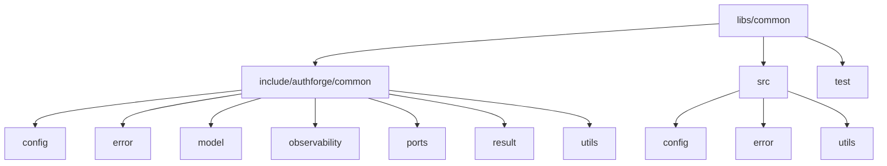
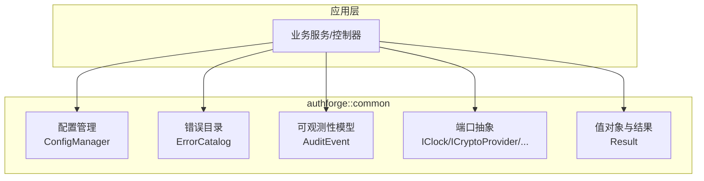
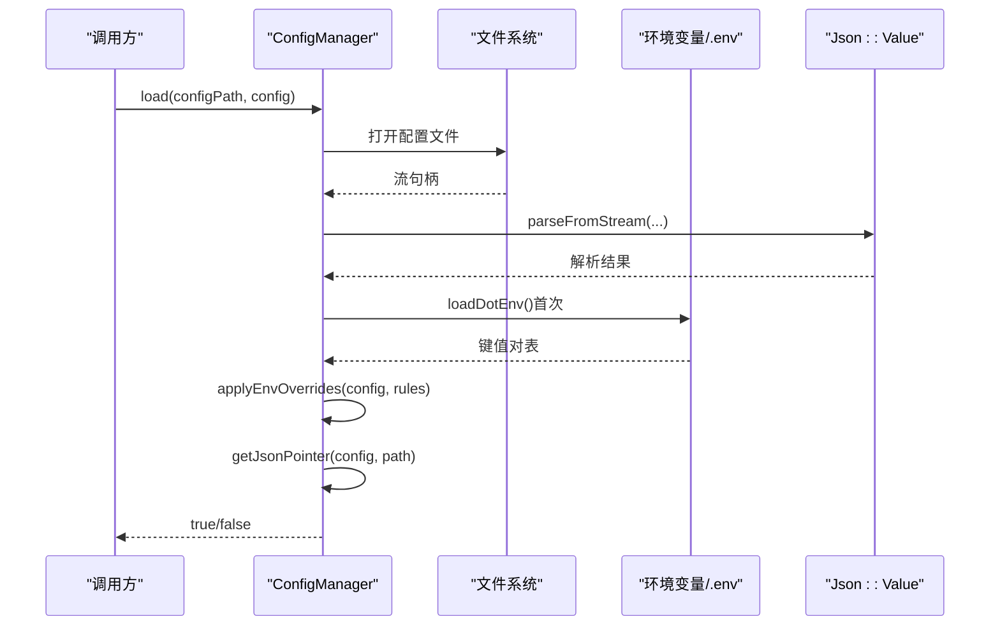
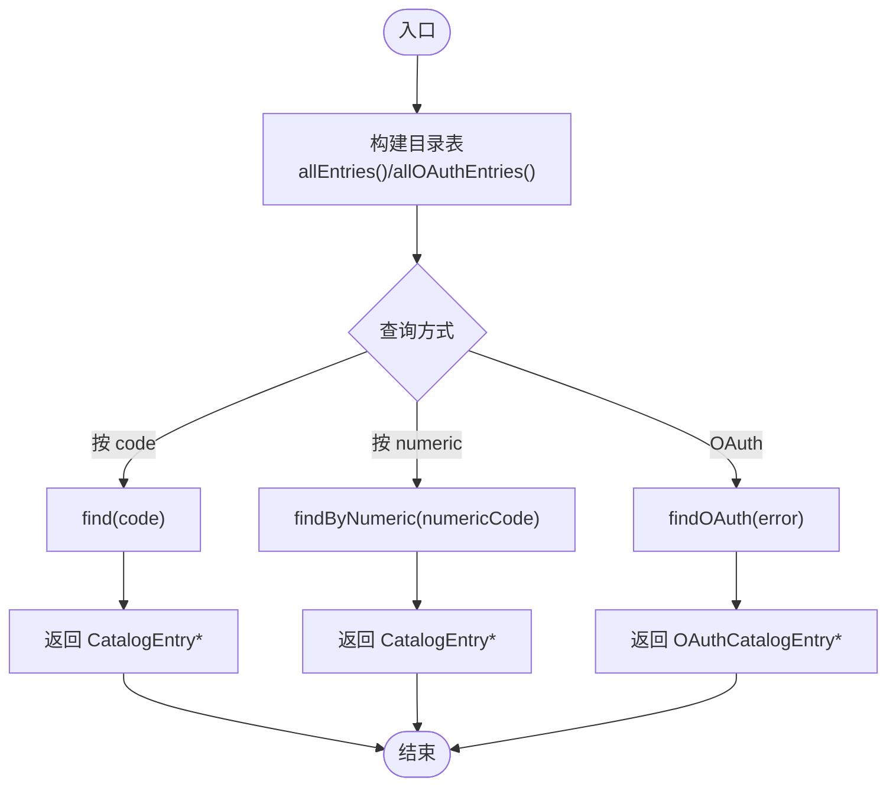
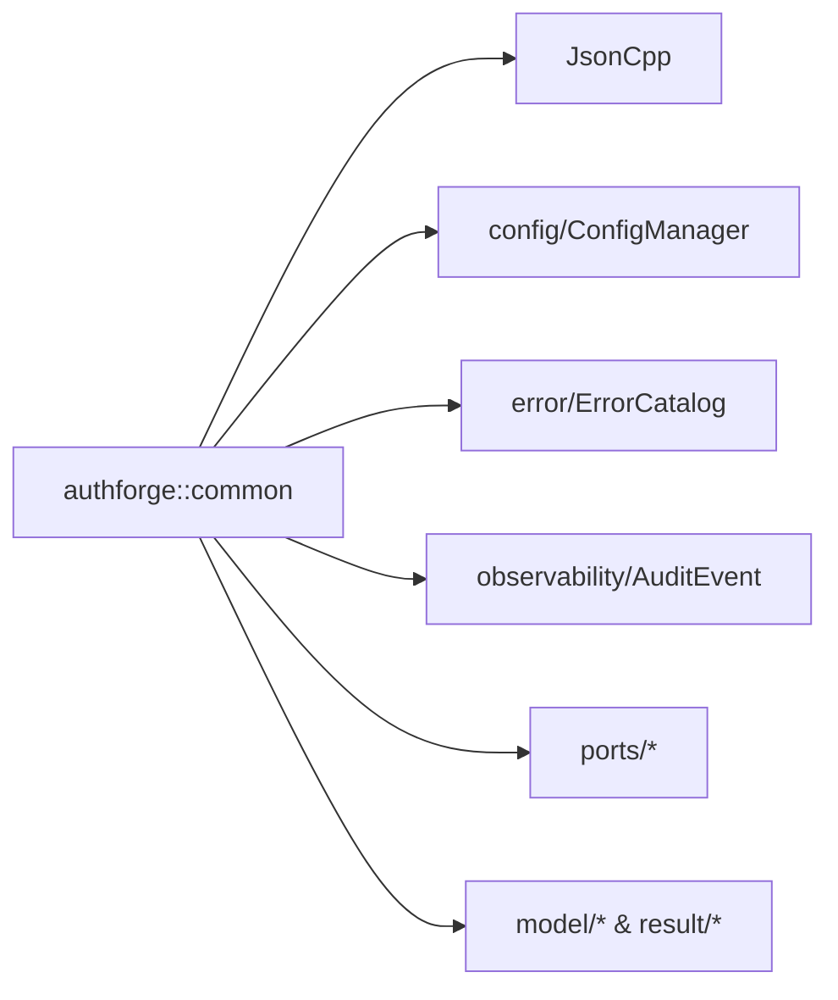

# 通用库 (authforge::common)

<cite>
**本文引用的文件**
- [CMakeLists.txt](file://libs/common/CMakeLists.txt)
- [ConfigManager.cc](file://libs/common/src/config/ConfigManager.cc)
- [ErrorCatalog.cc](file://libs/common/src/error/ErrorCatalog.cc)
</cite>

## 目录
1. [简介](#简介)
2. [项目结构](#项目结构)
3. [核心组件](#核心组件)
4. [架构总览](#架构总览)
5. [详细组件分析](#详细组件分析)
6. [依赖关系分析](#依赖关系分析)
7. [性能与内存管理](#性能与内存管理)
8. [故障排查指南](#故障排查指南)
9. [结论](#结论)
10. [附录：使用示例与最佳实践](#附录使用示例与最佳实践)

## 简介
authforge::common 是项目的领域层共享内核，提供框架无关的基础能力，包括：
- 配置管理：JSON 配置文件解析、环境变量覆盖、.env 文件加载、配置校验（含生产模式安全规则）
- 错误体系：统一的错误码目录、HTTP 状态映射、OAuth 协议错误码、不变量校验
- 可观测性模型：审计事件等基础数据模型（在公共接口中暴露）
- 端口抽象：时钟、加密、UUID、日志、指标等跨层接口定义（供上层实现）
- 值对象与结果类型：Subject、Scope、ClientId、RedirectUri、PkceChallenge、TokenValue、TenantId 以及 Result<T, Error> 等

该库不依赖 Web 框架（如 Drogon），仅依赖 JsonCpp，确保可被任意宿主复用。

## 项目结构
libs/common 采用“头文件对外暴露 + 源文件按功能域组织”的方式：
- include/authforge/common：对外头文件目录，包含 config、error、model、observability、ports、result、utils 等子模块
- src：实现目录，按 config、error、utils 等组织
- test：纯单元测试，无数据库与框架依赖
- CMakeLists.txt：构建目标、依赖声明、安装与打包配置

图表来源
- [CMakeLists.txt:30-46](file://libs/common/CMakeLists.txt#L30-L46)

章节来源
- [CMakeLists.txt:1-90](file://libs/common/CMakeLists.txt#L1-L90)

## 核心组件
- 配置管理（config）
  - ConfigManager：负责 JSON 配置加载、.env 文件加载、环境变量覆盖、路径指针访问、数值/字符串列表解析、配置校验（端口范围、生产模式 HTTPS Issuer、默认密码检查）
- 错误体系（error）
  - ErrorCatalog：集中维护应用错误码与 HTTP 状态映射、OAuth 协议错误码、分类段分配、不变量校验（唯一性、范围、必填字段）
- 可观测性与端口（observability / ports）
  - 暴露审计事件模型与跨层接口（IClock、ICryptoProvider、ILogger 等），便于上层实现具体策略
- 值对象与结果（model / result）
  - 提供强类型值对象与 Result<T, Error> 统一错误传播方式

章节来源
- [CMakeLists.txt:3-13](file://libs/common/CMakeLists.txt#L3-L13)
- [ConfigManager.cc:126-149](file://libs/common/src/config/ConfigManager.cc#L126-L149)
- [ErrorCatalog.cc:278-333](file://libs/common/src/error/ErrorCatalog.cc#L278-L333)

## 架构总览
authforge::common 作为领域层共享内核，向上为业务模块提供稳定接口，向下通过端口抽象解耦第三方实现（加密、时钟、日志等）。其关键约束：
- 禁止依赖 Drogon 等 Web 框架
- 仅依赖 JsonCpp（用于 JSON 序列化/反序列化）
- 所有错误与配置逻辑保持框架无关

图表来源
- [CMakeLists.txt:3-13](file://libs/common/CMakeLists.txt#L3-L13)
- [ConfigManager.cc:126-149](file://libs/common/src/config/ConfigManager.cc#L126-L149)
- [ErrorCatalog.cc:278-333](file://libs/common/src/error/ErrorCatalog.cc#L278-L333)

## 详细组件分析

### 配置管理（ConfigManager）
职责
- 加载 JSON 配置文件并返回 Json::Value
- 首次使用时懒加载 .env 文件（当前目录及上级目录），支持 KEY=VALUE、注释、空白行处理、引号去除
- 环境变量覆盖：优先使用 .env 中的变量，其次系统环境变量；支持数字、字符串数组（逗号分隔）覆盖
- JSON 路径指针访问：支持点号分割的路径、数组索引、以及基于成员过滤的查找（如 plugins[name=OAuth2Plugin]）
- 配置校验：
  - 必需段存在性与类型校验（db_clients、redis_clients 必须为数组）
  - 端口范围校验（1-65535）
  - 生产模式强制规则：Issuer 必须以 https:// 开头；数据库与 Redis 密码不得为默认值

图表来源
- [ConfigManager.cc:126-149](file://libs/common/src/config/ConfigManager.cc#L126-L149)
- [ConfigManager.cc:152-189](file://libs/common/src/config/ConfigManager.cc#L152-L189)
- [ConfigManager.cc:192-298](file://libs/common/src/config/ConfigManager.cc#L192-L298)
- [ConfigManager.cc:28-107](file://libs/common/src/config/ConfigManager.cc#L28-L107)

关键点
- .env 加载为一次性静态缓存，避免重复 I/O
- 环境变量优先级：.env > 系统环境变量
- JSON 路径支持数组索引与成员过滤，提高覆盖灵活性
- 生产模式校验严格，防止误配上线

章节来源
- [ConfigManager.cc:28-107](file://libs/common/src/config/ConfigManager.cc#L28-L107)
- [ConfigManager.cc:126-149](file://libs/common/src/config/ConfigManager.cc#L126-L149)
- [ConfigManager.cc:152-189](file://libs/common/src/config/ConfigManager.cc#L152-L189)
- [ConfigManager.cc:192-298](file://libs/common/src/config/ConfigManager.cc#L192-L298)
- [ConfigManager.cc:312-401](file://libs/common/src/config/ConfigManager.cc#L312-L401)

### 错误体系（ErrorCatalog）
职责
- 维护应用错误码目录（code、numericCode、category、httpStatus、defaultMessage、description）
- 根据 category 与 numericCode 推导 HTTP 状态码，允许个别条目显式覆盖
- 维护 OAuth 协议错误码集合（RFC 6749/7009/8628 相关）
- 提供分类段分配（NETWORK 1000-1099、DATABASE 2000-2099、VALIDATION 3000-3099、AUTHENTICATION 4000-4099、AUTHORIZATION 5000-5099、INTERNAL 6000-6099）
- 不变量校验：唯一性、范围、必填字段、OAuth 必要项完整性

图表来源
- [ErrorCatalog.cc:301-333](file://libs/common/src/error/ErrorCatalog.cc#L301-L333)
- [ErrorCatalog.cc:335-369](file://libs/common/src/error/ErrorCatalog.cc#L335-L369)

HTTP 状态推导规则
- VALIDATION -> 400（例外：资源不存在 404、冲突 409、限流 429）
- AUTHENTICATION -> 401
- AUTHORIZATION -> 403
- NETWORK -> 502（超时 1002 -> 504）
- DATABASE/INTERNAL/UNKNOWN -> 500

章节来源
- [ErrorCatalog.cc:23-46](file://libs/common/src/error/ErrorCatalog.cc#L23-L46)
- [ErrorCatalog.cc:68-215](file://libs/common/src/error/ErrorCatalog.cc#L68-L215)
- [ErrorCatalog.cc:278-333](file://libs/common/src/error/ErrorCatalog.cc#L278-L333)
- [ErrorCatalog.cc:335-369](file://libs/common/src/error/ErrorCatalog.cc#L335-L369)
- [ErrorCatalog.cc:384-512](file://libs/common/src/error/ErrorCatalog.cc#L384-L512)

### 可观测性与端口（observability / ports）
- 可观测性模型：以 AuditEvent 为代表的审计事件数据结构，用于记录跨边界的关键操作
- 端口抽象：
  - IClock：时间获取，便于测试与确定性行为
  - ICryptoProvider：加密/哈希/签名等能力抽象
  - IUuidGenerator：ID 生成
  - IEmailSender：邮件发送
  - ILogger/IMetrics：日志与指标
- 这些接口由上层或基础设施层实现，common 层仅定义契约，保证领域层与实现解耦

章节来源
- [CMakeLists.txt:3-13](file://libs/common/CMakeLists.txt#L3-L13)

### 值对象与结果（model / result）
- 值对象：Subject、Scope、ClientId、RedirectUri、PkceChallenge、TokenValue、TenantId 等，提供强类型语义与基本校验
- Result<T, Error>：统一成功/失败返回值，替代异常与空指针混合的错误传播方式，提升可读性与可测试性

章节来源
- [CMakeLists.txt:3-13](file://libs/common/CMakeLists.txt#L3-L13)

## 依赖关系分析
- 外部依赖
  - JsonCpp：用于 JSON 解析与序列化
- 内部依赖
  - 配置模块依赖文件系统与环境变量
  - 错误目录模块依赖标准库容器与字符串工具
- 设计约束
  - 禁止引入 Drogon 或其他 Web 框架依赖
  - 通过端口抽象隔离第三方实现

图表来源
- [CMakeLists.txt:32-46](file://libs/common/CMakeLists.txt#L32-L46)
- [CMakeLists.txt:67-71](file://libs/common/CMakeLists.txt#L67-L71)

章节来源
- [CMakeLists.txt:32-46](file://libs/common/CMakeLists.txt#L32-L46)
- [CMakeLists.txt:67-71](file://libs/common/CMakeLists.txt#L67-L71)

## 性能与内存管理
- 配置加载
  - .env 文件懒加载且单次缓存，避免重复 I/O
  - JSON 路径指针访问 O(n) 遍历，适用于配置规模较小的场景
- 错误目录
  - 目录表静态初始化，查询为线性扫描；条目数量固定（约 25+13），性能开销可忽略
- 内存与线程安全
  - .env 缓存与目录表均为函数内静态局部变量，构造于首次使用，避免全局构造顺序问题
  - 读取路径多为只读，适合多线程并发访问
- 优化建议
  - 若未来目录规模增长，可将目录表改为哈希表以提升查找性能
  - 对于高频路径访问，可考虑缓存已解析的指针

[本节为通用指导，不直接分析具体文件]

## 故障排查指南
- 配置加载失败
  - 现象：load() 返回 false
  - 可能原因：配置文件不存在、JSON 解析失败、路径无效
  - 定位：检查配置文件路径与内容、查看解析错误信息
- 环境变量未生效
  - 现象：applyEnvOverrides 未覆盖预期字段
  - 可能原因：.env 未找到、变量名不匹配、路径表达式错误、类型不匹配（数字/数组）
  - 定位：确认 .env 位置与格式、检查路径表达式与类型标志
- 生产模式校验失败
  - 现象：validate() 返回 false 并提示错误消息
  - 可能原因：Issuer 非 HTTPS、数据库/Redis 密码为默认值、端口越界
  - 定位：根据错误消息修正配置或环境变量
- 错误目录不一致
  - 现象：启动时抛出逻辑错误
  - 可能原因：目录缺失、重复 code/numericCode、不在分类段范围内、OAuth 必要项缺失
  - 定位：运行 validateInvariants() 并修复对应违规项

章节来源
- [ConfigManager.cc:126-149](file://libs/common/src/config/ConfigManager.cc#L126-L149)
- [ConfigManager.cc:312-401](file://libs/common/src/config/ConfigManager.cc#L312-L401)
- [ErrorCatalog.cc:384-512](file://libs/common/src/error/ErrorCatalog.cc#L384-L512)

## 结论
authforge::common 提供了稳定、框架无关的基础能力，涵盖配置管理、错误体系、可观测性模型与端口抽象。通过严格的配置校验与错误目录不变量，保障系统在开发与生产环境的一致性与安全性。其解耦设计与最小依赖原则，使其易于集成到不同宿主与应用中。

[本节为总结，不直接分析具体文件]

## 附录：使用示例与最佳实践
- 配置加载与覆盖
  - 步骤：调用 load(configPath, config)，随后进行 validate(config, errorMessage)
  - 最佳实践：将敏感配置放入 .env 或系统环境变量；生产环境强制 HTTPS Issuer 与非默认密码
  - 参考路径：[ConfigManager.cc:126-149](file://libs/common/src/config/ConfigManager.cc#L126-L149)、[ConfigManager.cc:312-401](file://libs/common/src/config/ConfigManager.cc#L312-L401)
- 错误码使用
  - 步骤：通过 find(code) 或 findByNumeric(numericCode) 获取 CatalogEntry，再结合 httpStatus 与 defaultMessage 构建响应
  - 最佳实践：新增错误码需满足分类段范围与唯一性；必要时使用 httpStatusOverride 保留历史行为
  - 参考路径：[ErrorCatalog.cc:335-369](file://libs/common/src/error/ErrorCatalog.cc#L335-L369)、[ErrorCatalog.cc:278-333](file://libs/common/src/error/ErrorCatalog.cc#L278-L333)
- 端口实现
  - 步骤：实现 IClock、ICryptoProvider、ILogger 等接口，并在上层注入
  - 最佳实践：在测试中使用 Mock 实现以保证确定性
  - 参考路径：[CMakeLists.txt:3-13](file://libs/common/CMakeLists.txt#L3-L13)

[本节为使用指引，不直接分析具体文件]