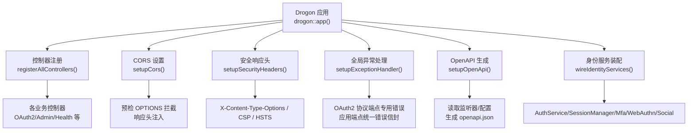
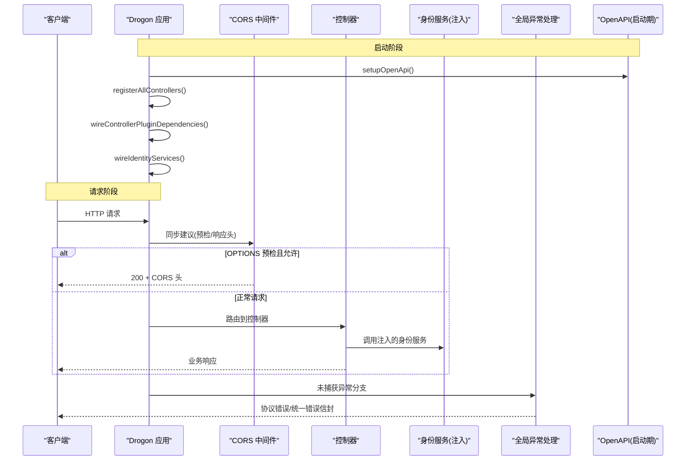
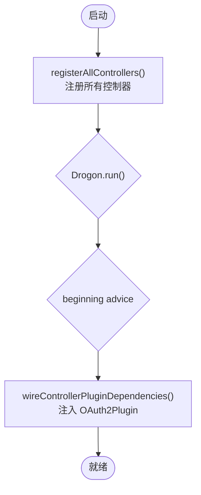
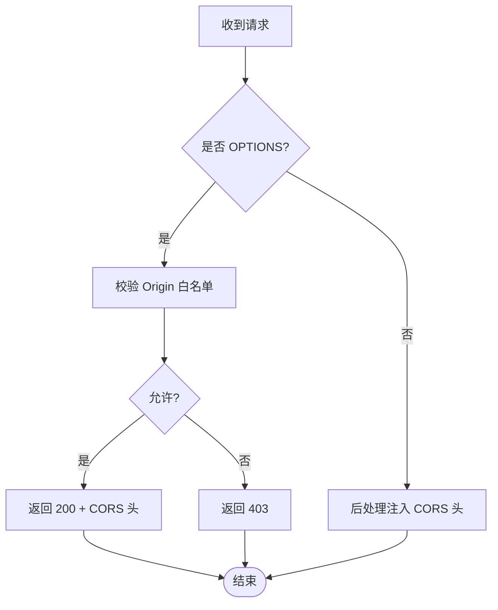
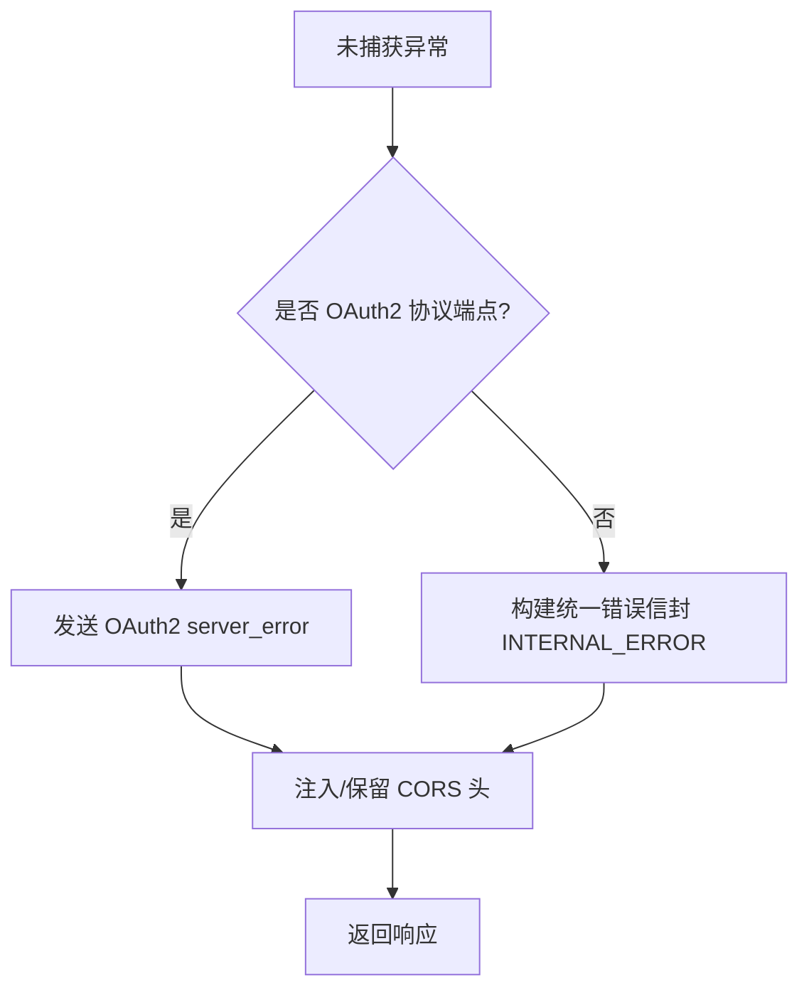
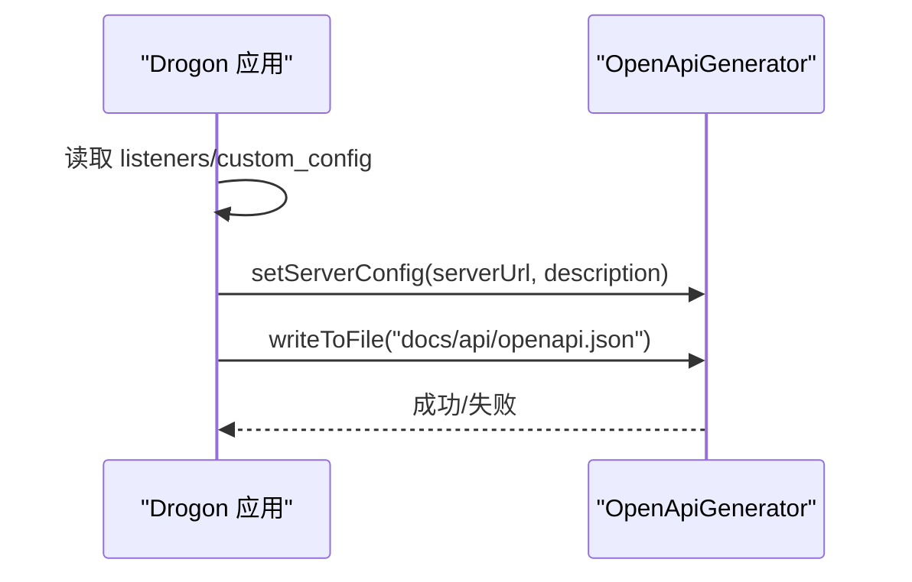
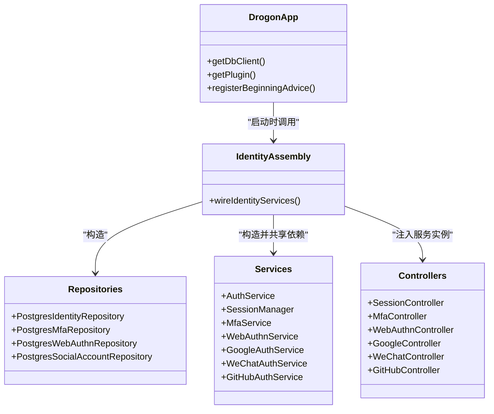
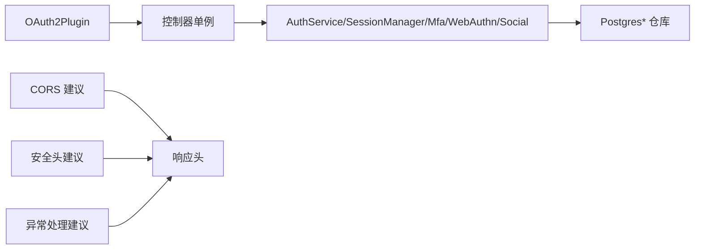

# Drogon适配器 (authforge::drogon)

<cite>
**本文引用的文件**
- [ControllerRegistration.h](file://apps/server/src/bootstrap/ControllerRegistration.h)
- [ControllerRegistration.cc](file://apps/server/src/bootstrap/ControllerRegistration.cc)
- [OpenApiSetup.h](file://apps/server/src/bootstrap/OpenApiSetup.h)
- [OpenApiSetup.cc](file://apps/server/src/bootstrap/OpenApiSetup.cc)
- [ExceptionHandlerSetup.h](file://apps/server/src/bootstrap/ExceptionHandlerSetup.h)
- [ExceptionHandlerSetup.cc](file://apps/server/src/bootstrap/ExceptionHandlerSetup.cc)
- [CorsSetup.h](file://apps/server/src/bootstrap/CorsSetup.h)
- [CorsSetup.cc](file://apps/server/src/bootstrap/CorsSetup.cc)
- [SecurityHeaders.h](file://apps/server/src/bootstrap/SecurityHeaders.h)
- [SecurityHeaders.cc](file://apps/server/src/bootstrap/SecurityHeaders.cc)
- [IdentityAssembly.h](file://apps/server/src/bootstrap/IdentityAssembly.h)
- [IdentityAssembly.cc](file://apps/server/src/bootstrap/IdentityAssembly.cc)
</cite>

## 目录
1. [简介](#简介)
2. [项目结构](#项目结构)
3. [核心组件](#核心组件)
4. [架构总览](#架构总览)
5. [详细组件分析](#详细组件分析)
6. [依赖关系分析](#依赖关系分析)
7. [性能考量](#性能考量)
8. [故障排查指南](#故障排查指南)
9. [结论](#结论)
10. [附录](#附录)

## 简介
本文件聚焦于 authforge::drogon 适配器层，说明如何将 AuthForge 核心库与 Drogon Web 框架集成。内容涵盖：
- Web 控制器注册与生命周期管理
- 中间件与过滤器机制（CORS、安全响应头、异常处理）
- OpenAPI 文档自动生成与写入
- 身份服务装配（AuthService、SessionManager、Mfa/WebAuthn/Social 等）
- 请求处理管道、响应格式化、错误处理适配
- 控制器开发指南、路由配置方法、自定义中间件示例
- 性能优化建议与调试技巧

## 项目结构
Drogon 适配器位于 apps/server/src/bootstrap 中，采用“启动时装配”的模块化设计：每个职责单一的文件负责一项基础设施能力（控制器注册、CORS、安全头、异常处理、OpenAPI、身份服务装配）。控制器本身来自 libs/drogon 中的 authforge::drogon 命名空间，并通过显式注册接入 Drogon 应用。

图表来源
- [ControllerRegistration.cc:41-120](file://apps/server/src/bootstrap/ControllerRegistration.cc#L41-L120)
- [CorsSetup.cc:8-80](file://apps/server/src/bootstrap/CorsSetup.cc#L8-L80)
- [SecurityHeaders.cc:8-61](file://apps/server/src/bootstrap/SecurityHeaders.cc#L8-L61)
- [ExceptionHandlerSetup.cc:13-64](file://apps/server/src/bootstrap/ExceptionHandlerSetup.cc#L13-L64)
- [OpenApiSetup.cc:10-61](file://apps/server/src/bootstrap/OpenApiSetup.cc#L10-L61)
- [IdentityAssembly.cc:61-213](file://apps/server/src/bootstrap/IdentityAssembly.cc#L61-L213)

章节来源
- [ControllerRegistration.h:10-34](file://apps/server/src/bootstrap/ControllerRegistration.h#L10-L34)
- [ControllerRegistration.cc:1-178](file://apps/server/src/bootstrap/ControllerRegistration.cc#L1-L178)
- [OpenApiSetup.h:1-18](file://apps/server/src/bootstrap/OpenApiSetup.h#L1-L18)
- [OpenApiSetup.cc:1-64](file://apps/server/src/bootstrap/OpenApiSetup.cc#L1-L64)
- [ExceptionHandlerSetup.h:1-17](file://apps/server/src/bootstrap/ExceptionHandlerSetup.h#L1-L17)
- [ExceptionHandlerSetup.cc:1-67](file://apps/server/src/bootstrap/ExceptionHandlerSetup.cc#L1-L67)
- [CorsSetup.h:1-19](file://apps/server/src/bootstrap/CorsSetup.h#L1-L19)
- [CorsSetup.cc:1-83](file://apps/server/src/bootstrap/CorsSetup.cc#L1-L83)
- [SecurityHeaders.h:1-16](file://apps/server/src/bootstrap/SecurityHeaders.h#L1-L16)
- [SecurityHeaders.cc:1-64](file://apps/server/src/bootstrap/SecurityHeaders.cc#L1-L64)
- [IdentityAssembly.h:1-41](file://apps/server/src/bootstrap/IdentityAssembly.h#L1-L41)
- [IdentityAssembly.cc:1-216](file://apps/server/src/bootstrap/IdentityAssembly.cc#L1-L216)

## 核心组件
- 控制器注册与插件依赖注入
  - 通过显式 registerController 将多个控制器加入 Drogon 路由表；所有控制器使用 AutoCreation=false，避免静态初始化副作用。
  - 在 Drogon run 后的 beginning advice 回调中，从 DrClassMap 获取已注册的控制器/过滤器单例并注入 OAuth2Plugin 指针，减少每请求查找开销。
- CORS 中间件
  - 同步建议（sync advice）拦截 OPTIONS 预检请求，严格白名单匹配 allow_origins，拒绝未授权预检返回 403。
  - 后处理建议（post-handling advice）为允许的来源注入 Access-Control-* 响应头。
- 安全响应头
  - 全局后处理建议注入 X-Content-Type-Options、X-Frame-Options；根据 Content-Type 和路径差异化注入 CSP；在 HTTPS 或反向代理场景下注入 HSTS。
- 全局异常处理
  - 区分 OAuth2 协议端点与应用端点：前者输出 RFC 6749 §5.2 server_error 体，后者输出统一 Error Envelope（INTERNAL_ERROR），均保留 CORS 头。
- OpenAPI 生成
  - 从监听器与 custom_config 推导 server URL，调用 OpenApiGenerator 生成并写入 docs/api/openapi.json。
- 身份服务装配
  - 在 beginning advice 中构造 PostgresIdentityRepository、AuthService、SessionManager、MfaService、WebAuthnService、Social 认证服务等，并注入到对应控制器单例。

章节来源
- [ControllerRegistration.cc:41-175](file://apps/server/src/bootstrap/ControllerRegistration.cc#L41-L175)
- [CorsSetup.cc:8-80](file://apps/server/src/bootstrap/CorsSetup.cc#L8-L80)
- [SecurityHeaders.cc:8-61](file://apps/server/src/bootstrap/SecurityHeaders.cc#L8-L61)
- [ExceptionHandlerSetup.cc:13-64](file://apps/server/src/bootstrap/ExceptionHandlerSetup.cc#L13-L64)
- [OpenApiSetup.cc:10-61](file://apps/server/src/bootstrap/OpenApiSetup.cc#L10-L61)
- [IdentityAssembly.cc:61-213](file://apps/server/src/bootstrap/IdentityAssembly.cc#L61-L213)

## 架构总览
下图展示了请求进入 Drogon 后的关键处理阶段：CORS 预检/响应头、控制器路由、业务逻辑、异常处理、OpenAPI 生成（启动期）、身份服务注入（启动期）。

图表来源
- [OpenApiSetup.cc:10-61](file://apps/server/src/bootstrap/OpenApiSetup.cc#L10-L61)
- [ControllerRegistration.cc:41-175](file://apps/server/src/bootstrap/ControllerRegistration.cc#L41-L175)
- [IdentityAssembly.cc:61-213](file://apps/server/src/bootstrap/IdentityAssembly.cc#L61-L213)
- [CorsSetup.cc:8-80](file://apps/server/src/bootstrap/CorsSetup.cc#L8-L80)
- [ExceptionHandlerSetup.cc:13-64](file://apps/server/src/bootstrap/ExceptionHandlerSetup.cc#L13-L64)

## 详细组件分析

### 控制器注册与插件依赖注入
- 控制器注册
  - 通过 registerAllControllers 显式创建并注册各控制器实例，确保链接期可见引用，便于静态库链接。
  - 支持条件编译开关（如 WITH_SOCIAL、WITH_WEBAUTHN）以启用社交登录与 WebAuthn 控制器。
- 插件依赖注入
  - 在 beginning advice 回调中，获取 OAuth2Plugin 单例并注入到控制器/过滤器，避免每请求 getPlugin 查找。
  - 若插件不可用，记录警告并回退到每请求查找，保证启动鲁棒性。

图表来源
- [ControllerRegistration.cc:41-175](file://apps/server/src/bootstrap/ControllerRegistration.cc#L41-L175)

章节来源
- [ControllerRegistration.h:10-34](file://apps/server/src/bootstrap/ControllerRegistration.h#L10-L34)
- [ControllerRegistration.cc:41-175](file://apps/server/src/bootstrap/ControllerRegistration.cc#L41-L175)

### CORS 中间件
- 预检请求处理
  - 对 OPTIONS 请求进行 Origin 白名单校验，仅精确匹配，禁止通配符。
  - 允许时返回 200 并附带必要的 CORS 头；拒绝时返回 403。
- 响应头注入
  - 对所有响应附加 Access-Control-Allow-Methods、Allow-Headers、Credentials 等头（当 Origin 在白名单内）。

图表来源
- [CorsSetup.cc:8-80](file://apps/server/src/bootstrap/CorsSetup.cc#L8-L80)

章节来源
- [CorsSetup.h:1-19](file://apps/server/src/bootstrap/CorsSetup.h#L1-L19)
- [CorsSetup.cc:8-80](file://apps/server/src/bootstrap/CorsSetup.cc#L8-L80)

### 安全响应头
- 全局后处理建议注入：
  - X-Content-Type-Options: nosniff
  - X-Frame-Options: SAMEORIGIN
  - Content-Security-Policy：按路径区分（/docs/ 下的 Swagger UI 放宽策略，主应用严格策略）
  - Strict-Transport-Security：仅在 HTTPS 或 X-Forwarded-Proto=https 时注入

章节来源
- [SecurityHeaders.h:1-16](file://apps/server/src/bootstrap/SecurityHeaders.h#L1-L16)
- [SecurityHeaders.cc:8-61](file://apps/server/src/bootstrap/SecurityHeaders.cc#L8-L61)

### 全局异常处理
- 路径分支：
  - OAuth2 协议端点（/oauth2/*、/.well-known/*、/.well-known/jwks.json）：输出 RFC 6749 §5.2 server_error 体。
  - 其他应用端点：输出统一 Error Envelope（INTERNAL_ERROR），携带 RequestId。
- CORS 兼容：
  - 无论哪条分支，均保留/注入 CORS 头，确保跨域行为一致。

图表来源
- [ExceptionHandlerSetup.cc:13-64](file://apps/server/src/bootstrap/ExceptionHandlerSetup.cc#L13-L64)

章节来源
- [ExceptionHandlerSetup.h:1-17](file://apps/server/src/bootstrap/ExceptionHandlerSetup.h#L1-L17)
- [ExceptionHandlerSetup.cc:13-64](file://apps/server/src/bootstrap/ExceptionHandlerSetup.cc#L13-L64)

### OpenAPI 文档自动生成
- 启动阶段从监听器与 custom_config 推导 server URL（含协议与端口）。
- 调用 OpenApiGenerator 生成规范并写入 docs/api/openapi.json。
- 失败时记录警告日志，不影响后续运行。

图表来源
- [OpenApiSetup.cc:10-61](file://apps/server/src/bootstrap/OpenApiSetup.cc#L10-L61)

章节来源
- [OpenApiSetup.h:1-18](file://apps/server/src/bootstrap/OpenApiSetup.h#L1-L18)
- [OpenApiSetup.cc:10-61](file://apps/server/src/bootstrap/OpenApiSetup.cc#L10-L61)

### 身份服务装配
- 前置检查：
  - 若存储类型为 memory（无默认 DbClient），跳过装配，保持控制器回退路径。
  - 若无默认 DbClient，记录警告并返回。
- 服务构造：
  - PostgresIdentityRepository、PostgresMfaRepository、PostgresWebAuthnRepository、PostgresSocialAccountRepository
  - AuthService、SessionManager、MfaService、WebAuthnService、Google/WeChat/GitHub 认证服务
  - 共享 CryptoProvider、Clock 实例
- 注入目标：
  - SessionController、MfaController、WebAuthnController、Google/WeChat/GitHub Controller
- 顺序要求：
  - 必须在 beginning advice 回调中执行，确保 DbClient 可用且控制器已注册。

图表来源
- [IdentityAssembly.cc:61-213](file://apps/server/src/bootstrap/IdentityAssembly.cc#L61-L213)

章节来源
- [IdentityAssembly.h:1-41](file://apps/server/src/bootstrap/IdentityAssembly.h#L1-L41)
- [IdentityAssembly.cc:61-213](file://apps/server/src/bootstrap/IdentityAssembly.cc#L61-L213)

## 依赖关系分析
- 控制器与插件
  - 控制器通过 DrClassMap 单例被注入 OAuth2Plugin，降低运行时查找成本。
- 中间件与全局建议
  - CORS、安全头、异常处理均以 Drogon 建议（advice）形式挂载，形成横切关注点。
- 身份服务与存储
  - 身份服务依赖数据库仓库实现（Postgres*），并在内存存储模式下优雅降级。

图表来源
- [ControllerRegistration.cc:122-175](file://apps/server/src/bootstrap/ControllerRegistration.cc#L122-L175)
- [IdentityAssembly.cc:91-213](file://apps/server/src/bootstrap/IdentityAssembly.cc#L91-L213)
- [CorsSetup.cc:8-80](file://apps/server/src/bootstrap/CorsSetup.cc#L8-L80)
- [SecurityHeaders.cc:8-61](file://apps/server/src/bootstrap/SecurityHeaders.cc#L8-L61)
- [ExceptionHandlerSetup.cc:13-64](file://apps/server/src/bootstrap/ExceptionHandlerSetup.cc#L13-L64)

章节来源
- [ControllerRegistration.cc:122-175](file://apps/server/src/bootstrap/ControllerRegistration.cc#L122-L175)
- [IdentityAssembly.cc:91-213](file://apps/server/src/bootstrap/IdentityAssembly.cc#L91-L213)
- [CorsSetup.cc:8-80](file://apps/server/src/bootstrap/CorsSetup.cc#L8-L80)
- [SecurityHeaders.cc:8-61](file://apps/server/src/bootstrap/SecurityHeaders.cc#L8-L61)
- [ExceptionHandlerSetup.cc:13-64](file://apps/server/src/bootstrap/ExceptionHandlerSetup.cc#L13-L64)

## 性能考量
- 控制器/过滤器插件注入
  - 在 beginning advice 中一次性注入 OAuth2Plugin 指针，避免每请求 getPlugin 查找，显著降低开销。
- 配置读取
  - 将 webauthn、external_auth 等配置在启动时读取一次，避免每请求重复解析。
- 存储访问
  - 在内存存储模式下跳过 DB 相关装配，避免无效连接尝试。
- 中间件效率
  - CORS 白名单为数组精确匹配，避免正则与通配带来的额外计算；必要时可考虑哈希集合提升匹配性能。
- 异常处理
  - 快速路径判断是否为 OAuth2 协议端点，减少不必要的对象构造。

[本节提供通用指导，不直接分析具体文件]

## 故障排查指南
- 启动阶段
  - 若 wireIdentityServices 检测到内存存储或无默认 DbClient，会记录警告并回退到旧路径；确认 storage_type 与 db_clients 配置。
  - 若 wireControllerPluginDependencies 找不到 OAuth2Plugin，会记录警告并回退到每请求查找；确认插件已正确配置并先于 run() 完成构造。
- 运行时
  - CORS 预检被拒：检查 allow_origins 白名单是否包含请求 Origin；确认未使用通配符。
  - 安全头缺失：确认响应 Content-Type 与路径判断逻辑；HTTPS/HSTS 需确保 X-Forwarded-Proto 正确传递。
  - 异常响应不符合预期：确认路径是否命中 OAuth2 协议端点分支；检查 Error Catalog 与 RequestId 注入。
  - OpenAPI 未生成：检查当前工作目录与 docs/api 路径权限；查看日志中的写入失败提示。

章节来源
- [IdentityAssembly.cc:61-89](file://apps/server/src/bootstrap/IdentityAssembly.cc#L61-L89)
- [ControllerRegistration.cc:122-143](file://apps/server/src/bootstrap/ControllerRegistration.cc#L122-L143)
- [CorsSetup.cc:10-64](file://apps/server/src/bootstrap/CorsSetup.cc#L10-L64)
- [SecurityHeaders.cc:10-59](file://apps/server/src/bootstrap/SecurityHeaders.cc#L10-L59)
- [ExceptionHandlerSetup.cc:13-64](file://apps/server/src/bootstrap/ExceptionHandlerSetup.cc#L13-L64)
- [OpenApiSetup.cc:49-61](file://apps/server/src/bootstrap/OpenApiSetup.cc#L49-L61)

## 结论
authforge::drogon 适配器层通过清晰的启动期装配与请求期建议机制，将 AuthForge 核心能力无缝集成到 Drogon 应用中。控制器注册、插件注入、CORS、安全头、异常处理与 OpenAPI 生成共同构成了稳定可扩展的请求处理管道。身份服务装配在保证向后兼容的同时，提供了面向生产环境的数据库驱动能力。遵循本文的指南与最佳实践，可高效开发控制器、配置路由、编写中间件，并获得良好的性能与可维护性。

## 附录

### 控制器开发指南
- 继承 Drogon 的 HttpController<T, false>，避免静态初始化副作用。
- 在 bootstrap 模块中通过 registerAllControllers 显式注册控制器实例。
- 如需依赖 OAuth2Plugin，确保在 beginning advice 回调中通过 DrClassMap 注入。
- 参考现有控制器（如 HealthController、AuthorizationEndpointController、TokenEndpointController）的结构与注解方式。

章节来源
- [ControllerRegistration.cc:41-120](file://apps/server/src/bootstrap/ControllerRegistration.cc#L41-L120)
- [ControllerRegistration.h:13-17](file://apps/server/src/bootstrap/ControllerRegistration.h#L13-L17)

### 路由配置方法
- 控制器内部通过 Drogon 的路由注解声明方法与路径映射。
- 所有控制器均在 registerAllControllers 中集中注册，便于管理与审计。
- 条件编译开关控制可选控制器（如社交登录、WebAuthn）的注册。

章节来源
- [ControllerRegistration.cc:50-120](file://apps/server/src/bootstrap/ControllerRegistration.cc#L50-L120)

### 自定义中间件编写示例
- 使用 Drogon 的 registerSyncAdvice 处理预检或特殊请求（如 OPTIONS）。
- 使用 registerPostHandlingAdvice 注入响应头或修改响应。
- 注意白名单校验与安全策略，避免引入通配符导致的 CSRF 风险。

章节来源
- [CorsSetup.cc:32-79](file://apps/server/src/bootstrap/CorsSetup.cc#L32-L79)
- [SecurityHeaders.cc:10-59](file://apps/server/src/bootstrap/SecurityHeaders.cc#L10-L59)

### 请求处理管道与响应格式化
- 请求进入后依次经过 CORS 预检/响应头、控制器路由、业务逻辑、异常处理。
- OAuth2 协议端点输出 RFC 6749 错误体；应用端点输出统一错误信封。
- 所有响应均可通过后处理建议注入安全头与 CORS 头。

章节来源
- [ExceptionHandlerSetup.cc:13-64](file://apps/server/src/bootstrap/ExceptionHandlerSetup.cc#L13-L64)
- [CorsSetup.cc:67-79](file://apps/server/src/bootstrap/CorsSetup.cc#L67-L79)
- [SecurityHeaders.cc:10-59](file://apps/server/src/bootstrap/SecurityHeaders.cc#L10-L59)

### 调试技巧
- 启动阶段：
  - 观察 wireIdentityServices 与 wireControllerPluginDependencies 的日志，确认服务注入与插件可用性。
  - 检查 OpenApiSetup 的输出路径与权限，确保 openapi.json 生成成功。
- 运行时：
  - 使用浏览器开发者工具检查 CORS 头与安全头是否正确注入。
  - 触发异常路径，验证 OAuth2 与应用端点的错误响应格式是否符合预期。
  - 针对慢请求，结合 Drogon 日志与指标采集定位瓶颈。

章节来源
- [IdentityAssembly.cc:74-89](file://apps/server/src/bootstrap/IdentityAssembly.cc#L74-L89)
- [ControllerRegistration.cc:122-143](file://apps/server/src/bootstrap/ControllerRegistration.cc#L122-L143)
- [OpenApiSetup.cc:49-61](file://apps/server/src/bootstrap/OpenApiSetup.cc#L49-L61)
- [ExceptionHandlerSetup.cc:13-64](file://apps/server/src/bootstrap/ExceptionHandlerSetup.cc#L13-L64)