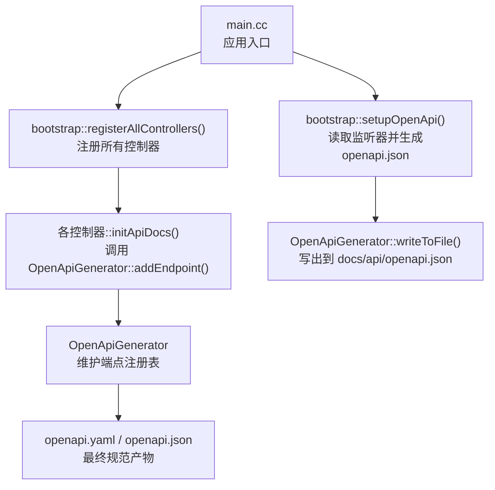
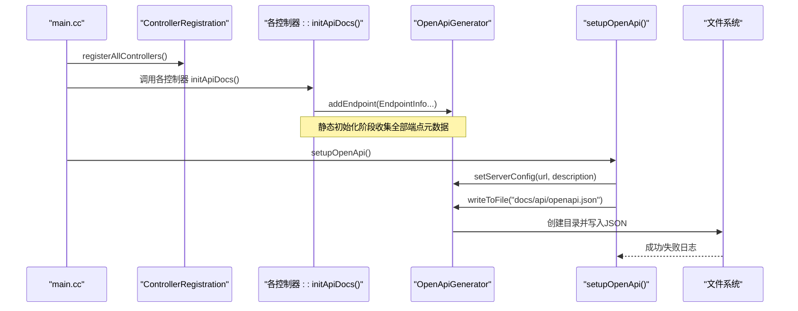
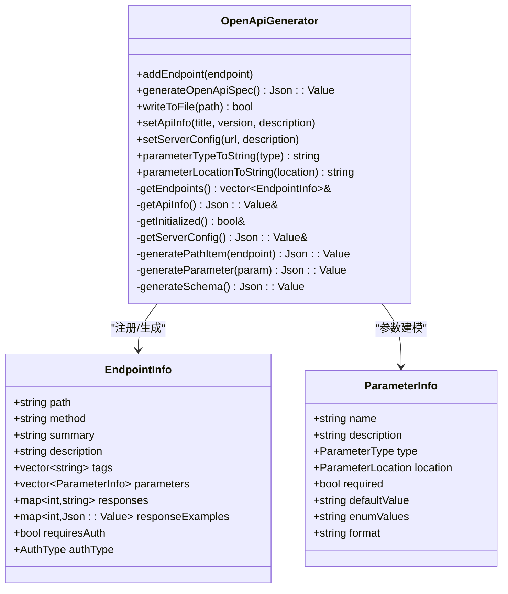
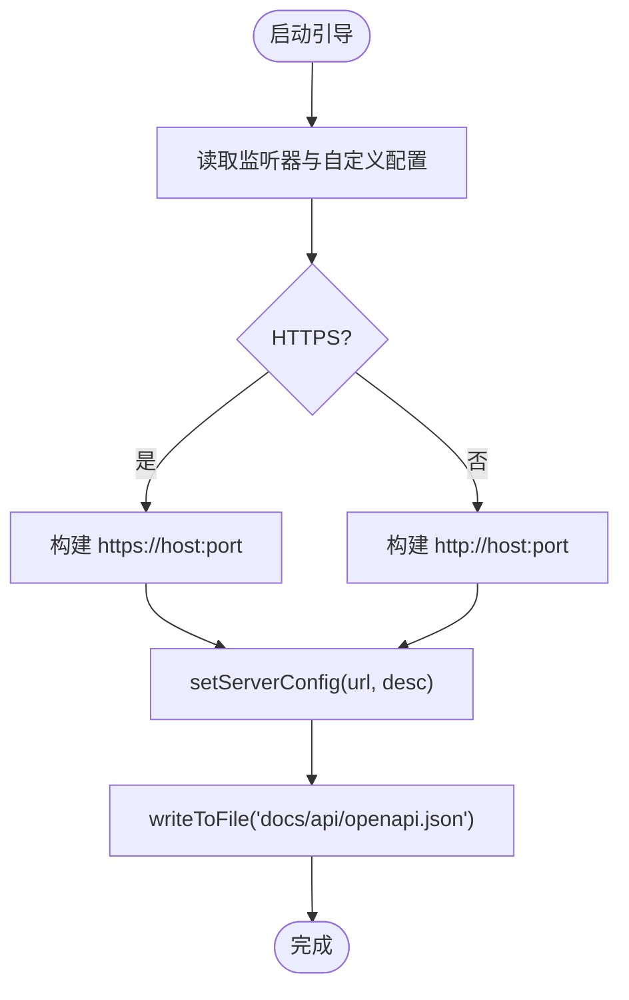
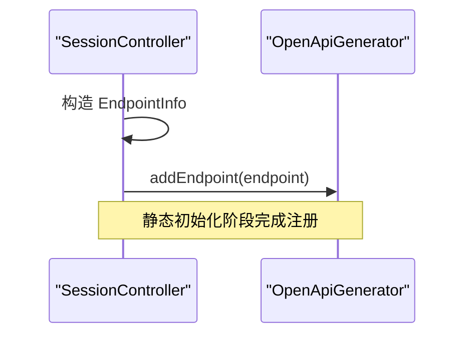
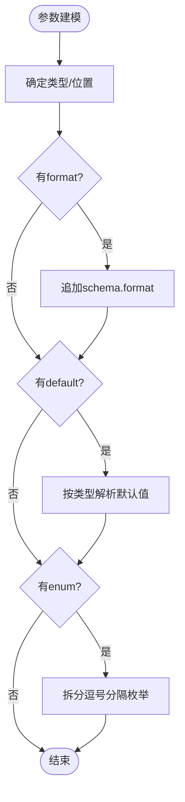
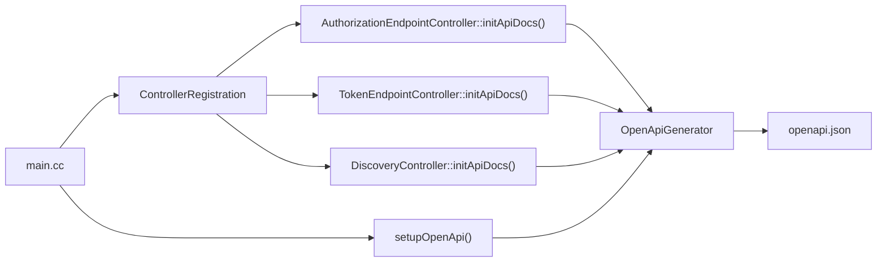

# OpenAPI文档生成

<cite>
**本文引用的文件**
- [OpenApiSetup.cc](file://apps/server/src/bootstrap/OpenApiSetup.cc)
- [OpenApiSetup.h](file://apps/server/src/bootstrap/OpenApiSetup.h)
- [main.cc](file://apps/server/src/main.cc)
- [ControllerRegistration.cc](file://apps/server/src/bootstrap/ControllerRegistration.cc)
- [OpenApiGenerator.h](file://libs/drogon/include/authforge/drogon/observability/openapi/OpenApiGenerator.h)
- [OpenApiGenerator.cc](file://libs/drogon/src/observability/openapi/OpenApiGenerator.cc)
- [openapi.yaml](file://apps/server/openapi.yaml)
- [openapi.json](file://apps/server/docs/api/openapi.json)
- [SessionController.cc](file://libs/drogon/src/controllers/SessionController.cc)
- [OpenApiGeneratorTest.cc](file://tests/common/OpenApiGeneratorTest.cc)
- [OpenApiGeneratorParameterTypesTest.cc](file://tests/common/OpenApiGeneratorParameterTypesTest.cc)
</cite>

## 目录
1. [简介](#简介)
2. [项目结构](#项目结构)
3. [核心组件](#核心组件)
4. [架构总览](#架构总览)
5. [详细组件分析](#详细组件分析)
6. [依赖关系分析](#依赖关系分析)
7. [性能与可维护性](#性能与可维护性)
8. [故障排查指南](#故障排查指南)
9. [结论](#结论)
10. [附录：最佳实践与约定](#附录最佳实践与约定)

## 简介
本文件系统性说明 AuthForge 如何通过“代码约定 + 静态注册”的方式自动生成 OpenAPI/Swagger 规范文档。重点覆盖：
- API 端点的元数据定义（路径、方法、参数、响应、标签）
- 请求/响应模型映射与示例
- 安全方案描述（Bearer 与客户端凭据认证）
- 文档版本管理策略、多环境配置支持、文档定制化选项
- API 设计最佳实践（命名规范、版本兼容性、文档准确性保证）

## 项目结构
AuthForge 的 OpenAPI 生成由“启动引导 + 生成器 + 控制器注册 + 输出产物”四部分构成：
- 启动引导：从运行监听器推导服务器地址，写入 openapi.json
- 生成器：集中维护端点注册表，拼装 OpenAPI 3.0 文档
- 控制器注册：各控制器在初始化阶段调用生成器注册端点
- 输出产物：同时提供 YAML 与 JSON 两种格式，供 Swagger UI 或工具链消费

图表来源
- [main.cc:151-229](file://apps/server/src/main.cc#L151-L229)
- [OpenApiSetup.cc:10-60](file://apps/server/src/bootstrap/OpenApiSetup.cc#L10-L60)
- [OpenApiGenerator.cc:57-143](file://libs/drogon/src/observability/openapi/OpenApiGenerator.cc#L57-L143)

章节来源
- [main.cc:151-229](file://apps/server/src/main.cc#L151-L229)
- [OpenApiSetup.cc:10-60](file://apps/server/src/bootstrap/OpenApiSetup.cc#L10-L60)

## 核心组件
- OpenApiGenerator：提供端点注册、参数/响应建模、安全方案注入、Schema 生成与文件输出能力
- bootstrap::setupOpenApi：根据 Drogon 监听器信息设置服务器 URL/描述，并触发文档生成
- 控制器 initApiDocs：在各控制器中集中声明端点元数据，统一通过 OpenApiGenerator 注册
- 产物：apps/server/docs/api/openapi.json（运行时生成），apps/server/openapi.yaml（基线/快照）

章节来源
- [OpenApiGenerator.h:33-122](file://libs/drogon/include/authforge/drogon/observability/openapi/OpenApiGenerator.h#L33-L122)
- [OpenApiGenerator.cc:57-143](file://libs/drogon/src/observability/openapi/OpenApiGenerator.cc#L57-L143)
- [OpenApiSetup.cc:10-60](file://apps/server/src/bootstrap/OpenApiSetup.cc#L10-L60)
- [SessionController.cc:220-246](file://libs/drogon/src/controllers/SessionController.cc#L220-L246)

## 架构总览
下图展示从应用启动到文档生成的完整时序：

图表来源
- [main.cc:151-229](file://apps/server/src/main.cc#L151-L229)
- [OpenApiSetup.cc:10-60](file://apps/server/src/bootstrap/OpenApiSetup.cc#L10-L60)
- [OpenApiGenerator.cc:50-143](file://libs/drogon/src/observability/openapi/OpenApiGenerator.cc#L50-L143)
- [OpenApiGenerator.cc:364-401](file://libs/drogon/src/observability/openapi/OpenApiGenerator.cc#L364-L401)

## 详细组件分析

### OpenApiGenerator：端点注册与规范生成
- 端点注册：通过 EndpointInfo 描述路径、方法、摘要、描述、标签、参数、响应、是否需鉴权、鉴权类型
- 参数建模：支持 query/header/path/cookie，类型 string/integer/number/boolean/array/object，支持 format、默认值、枚举
- 响应建模：按状态码组织描述，支持 200 默认 schema 与可选 responseExamples
- 安全方案：自动注入 bearerAuth 与 clientCredentialsAuth；当 requiresAuth=true 时按 authType 选择 scheme
- Schema：内置 Error、TokenResponse 等通用模型
- 输出：generateOpenApiSpec 组装完整文档；writeToFile 负责目录创建与 JSON 写入

图表来源
- [OpenApiGenerator.h:33-122](file://libs/drogon/include/authforge/drogon/observability/openapi/OpenApiGenerator.h#L33-L122)
- [OpenApiGenerator.cc:57-143](file://libs/drogon/src/observability/openapi/OpenApiGenerator.cc#L57-L143)
- [OpenApiGenerator.cc:227-255](file://libs/drogon/src/observability/openapi/OpenApiGenerator.cc#L227-L255)
- [OpenApiGenerator.cc:295-362](file://libs/drogon/src/observability/openapi/OpenApiGenerator.cc#L295-L362)

章节来源
- [OpenApiGenerator.h:33-122](file://libs/drogon/include/authforge/drogon/observability/openapi/OpenApiGenerator.h#L33-L122)
- [OpenApiGenerator.cc:57-143](file://libs/drogon/src/observability/openapi/OpenApiGenerator.cc#L57-L143)
- [OpenApiGenerator.cc:227-255](file://libs/drogon/src/observability/openapi/OpenApiGenerator.cc#L227-L255)
- [OpenApiGenerator.cc:295-362](file://libs/drogon/src/observability/openapi/OpenApiGenerator.cc#L295-L362)

### 启动引导：服务器信息与文档输出
- 从 Drogon 监听器解析 host/port/https，构造 serverUrl
- 调用 OpenApiGenerator::setServerConfig 设置 servers
- 将规范写入 apps/server/docs/api/openapi.json，并记录日志

图表来源
- [OpenApiSetup.cc:10-60](file://apps/server/src/bootstrap/OpenApiSetup.cc#L10-L60)
- [OpenApiGenerator.cc:50-94](file://libs/drogon/src/observability/openapi/OpenApiGenerator.cc#L50-L94)
- [OpenApiGenerator.cc:364-401](file://libs/drogon/src/observability/openapi/OpenApiGenerator.cc#L364-L401)

章节来源
- [OpenApiSetup.cc:10-60](file://apps/server/src/bootstrap/OpenApiSetup.cc#L10-L60)
- [OpenApiGenerator.cc:50-94](file://libs/drogon/src/observability/openapi/OpenApiGenerator.cc#L50-L94)
- [OpenApiGenerator.cc:364-401](file://libs/drogon/src/observability/openapi/OpenApiGenerator.cc#L364-L401)

### 控制器端点注册：以 SessionController 为例
- 在控制器初始化阶段构造 EndpointInfo，填充 path/method/tags/parameters/responses/requiresAuth
- 通过 OpenApiGenerator::addEndpoint 注册到全局注册表
- 该模式适用于所有控制器，确保文档与实现同步

图表来源
- [SessionController.cc:220-246](file://libs/drogon/src/controllers/SessionController.cc#L220-L246)

章节来源
- [SessionController.cc:220-246](file://libs/drogon/src/controllers/SessionController.cc#L220-L246)

### 参数与响应建模流程
- 参数：name/in/type/format/default/enum/required
- 响应：按状态码组织，200 默认 object schema，支持 example
- 安全：requiresAuth=true 时注入 security，authType 决定使用 bearerAuth 或 clientCredentialsAuth

图表来源
- [OpenApiGenerator.cc:295-362](file://libs/drogon/src/observability/openapi/OpenApiGenerator.cc#L295-L362)

章节来源
- [OpenApiGenerator.cc:295-362](file://libs/drogon/src/observability/openapi/OpenApiGenerator.cc#L295-L362)

### 安全方案与鉴权
- 内置安全方案：
  - bearerAuth：HTTP Bearer Token
  - clientCredentialsAuth：OAuth2 客户端认证（Basic/POST body）
- 端点级安全：requiresAuth=true 时自动注入 security；authType=ClientCredentials 时使用 clientCredentialsAuth
- 适用场景：用户令牌访问的接口用 bearerAuth；客户端凭据访问的接口（如令牌撤销、检查）用 clientCredentialsAuth

章节来源
- [OpenApiGenerator.cc:122-141](file://libs/drogon/src/observability/openapi/OpenApiGenerator.cc#L122-L141)
- [OpenApiGenerator.cc:205-220](file://libs/drogon/src/observability/openapi/OpenApiGenerator.cc#L205-L220)

### 文档版本管理与多环境支持
- 版本管理：
  - info.version 由生成器默认值提供，可通过 setApiInfo 覆盖
  - 建议将 openapi.yaml 作为基线快照纳入版本控制，openapi.json 为运行时产物
- 多环境：
  - setupOpenApi 根据监听器动态生成 server.url，适配不同端口/协议
  - 未配置时回退为相对路径 "/"，便于反向代理部署
- 定制化：
  - 可通过 setApiInfo 定制 title/version/description
  - 通过 EndpointInfo.tags 分组，operationId 自动生成

章节来源
- [OpenApiGenerator.cc:37-48](file://libs/drogon/src/observability/openapi/OpenApiGenerator.cc#L37-L48)
- [OpenApiGenerator.cc:78-94](file://libs/drogon/src/observability/openapi/OpenApiGenerator.cc#L78-L94)
- [OpenApiSetup.cc:10-60](file://apps/server/src/bootstrap/OpenApiSetup.cc#L10-L60)

### 产物与校验
- 运行时产物：apps/server/docs/api/openapi.json
- 基线/快照：apps/server/openapi.yaml（用于对比与回归）
- 测试覆盖：单元测试验证参数类型、位置、必填、响应结构等

章节来源
- [OpenApiGeneratorTest.cc:108-212](file://tests/common/OpenApiGeneratorTest.cc#L108-L212)
- [OpenApiGeneratorParameterTypesTest.cc:209-247](file://tests/common/OpenApiGeneratorParameterTypesTest.cc#L209-L247)

## 依赖关系分析
- main.cc 负责装配顺序：注册控制器 → 初始化文档 → 生成 openapi.json
- ControllerRegistration 显式注册所有控制器，避免静态初始化副作用
- 各控制器在 initApiDocs 中调用 OpenApiGenerator::addEndpoint
- OpenApiGenerator 集中维护端点注册表与安全方案，生成标准 OpenAPI 3.0 文档

图表来源
- [main.cc:151-229](file://apps/server/src/main.cc#L151-L229)
- [ControllerRegistration.cc:41-120](file://apps/server/src/bootstrap/ControllerRegistration.cc#L41-L120)
- [OpenApiSetup.cc:10-60](file://apps/server/src/bootstrap/OpenApiSetup.cc#L10-L60)
- [OpenApiGenerator.cc:57-143](file://libs/drogon/src/observability/openapi/OpenApiGenerator.cc#L57-L143)

章节来源
- [main.cc:151-229](file://apps/server/src/main.cc#L151-L229)
- [ControllerRegistration.cc:41-120](file://apps/server/src/bootstrap/ControllerRegistration.cc#L41-L120)

## 性能与可维护性
- 性能
  - 端点注册发生在启动期，对请求路径无额外开销
  - 文档生成仅在启动时执行一次，IO 成本可控
- 可维护性
  - 通过 EndpointInfo 集中描述端点，降低文档与实现漂移风险
  - 单元测试覆盖关键路径，保障参数/响应/安全方案正确性
  - 建议将 openapi.yaml 纳入 CI 比对，防止意外变更

[本节为通用指导，不直接分析具体文件]

## 故障排查指南
- 无法写入 openapi.json
  - 检查目标目录是否存在及权限
  - 查看日志中的错误信息（写文件失败会记录 LOG_ERROR）
- 文档缺少某些端点
  - 确认对应控制器的 initApiDocs 已调用 OpenApiGenerator::addEndpoint
  - 检查 ControllerRegistration 是否正确注册该控制器
- 安全方案不正确
  - 确认 requiresAuth 与 authType 设置是否符合预期
  - 用户令牌接口使用 bearerAuth；客户端凭据接口使用 clientCredentialsAuth
- 参数/响应不符合预期
  - 检查 ParameterInfo 的 type/location/format/default/enum
  - 检查 responses 映射与 responseExamples

章节来源
- [OpenApiGenerator.cc:364-401](file://libs/drogon/src/observability/openapi/OpenApiGenerator.cc#L364-L401)
- [OpenApiGenerator.cc:205-220](file://libs/drogon/src/observability/openapi/OpenApiGenerator.cc#L205-L220)
- [OpenApiGenerator.cc:295-362](file://libs/drogon/src/observability/openapi/OpenApiGenerator.cc#L295-L362)

## 结论
AuthForge 采用“控制器静态注册 + 集中生成器”的模式，实现了稳定、可测试、易维护的 OpenAPI 文档生成。通过统一的 EndpointInfo 描述与安全的默认行为，既保证了文档与实现的一致性，又提供了足够的扩展空间以满足多环境与定制化需求。配合基线文件与单元测试，可有效保障 API 契约的稳定性与准确性。

[本节为总结，不直接分析具体文件]

## 附录：最佳实践与约定
- 命名规范
  - 路径：使用语义化 RESTful 风格，避免歧义
  - operationId：由生成器自动生成，保持唯一性与可读性
  - tags：按业务域分组（如 Admin、OAuth2、System）
- 版本兼容性
  - 使用 info.version 标识 API 版本
  - 新增字段优先向后兼容；破坏性变更升级主版本
  - 将 openapi.yaml 作为基线纳入版本控制，CI 比对差异
- 文档准确性保证
  - 每个端点必须明确 parameters、responses、requiresAuth
  - 对复杂参数使用 format/enum/default 增强可读性
  - 为 200 响应提供 responseExamples，提升 SDK 生成质量
- 安全方案
  - 用户令牌访问：requiresAuth=true，authType=Bearer
  - 客户端凭据访问：requiresAuth=true，authType=ClientCredentials
- 多环境配置
  - 通过 setupOpenApi 自动推断 server.url，适配不同部署拓扑
  - 未配置时回退为相对路径，便于网关/反向代理统一暴露
- 测试与回归
  - 使用现有单元测试验证参数/响应/安全方案
  - 在 CI 中校验 openapi.json 与基线一致，防止无意变更

[本节为通用指导，不直接分析具体文件]