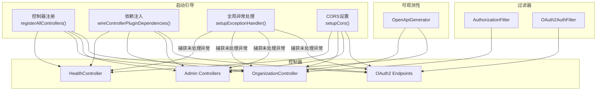
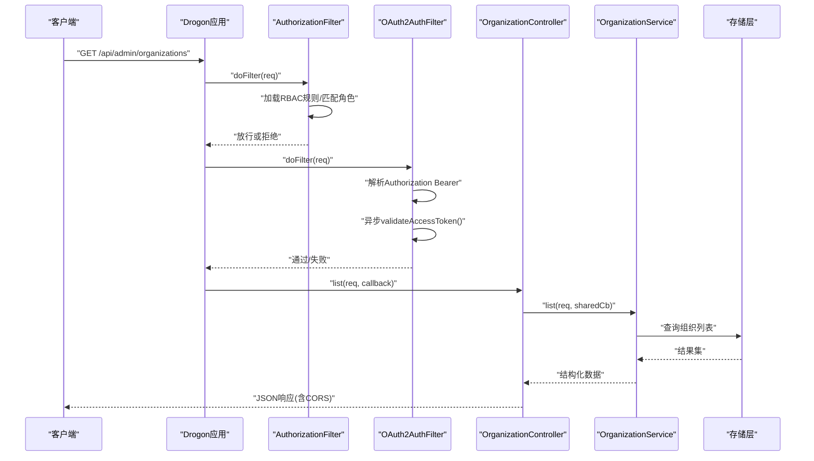
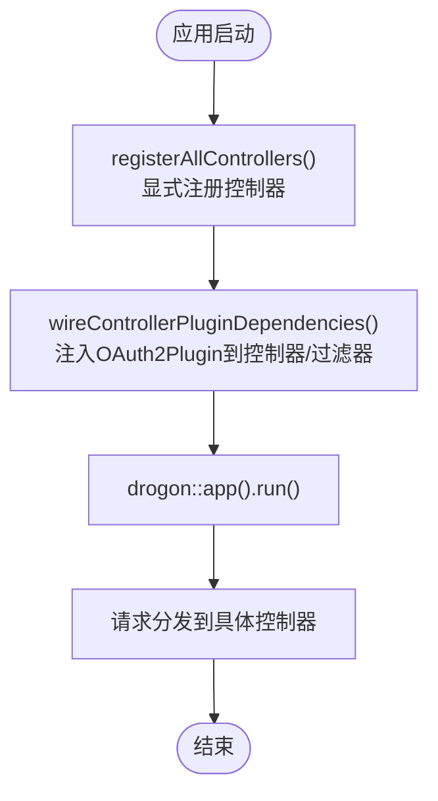
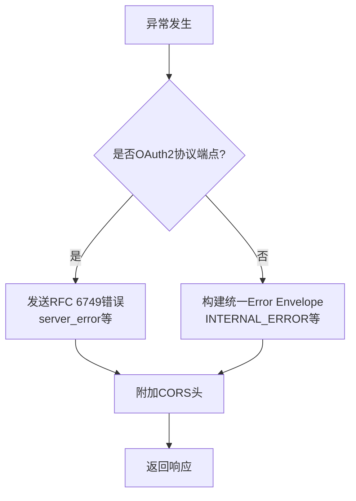
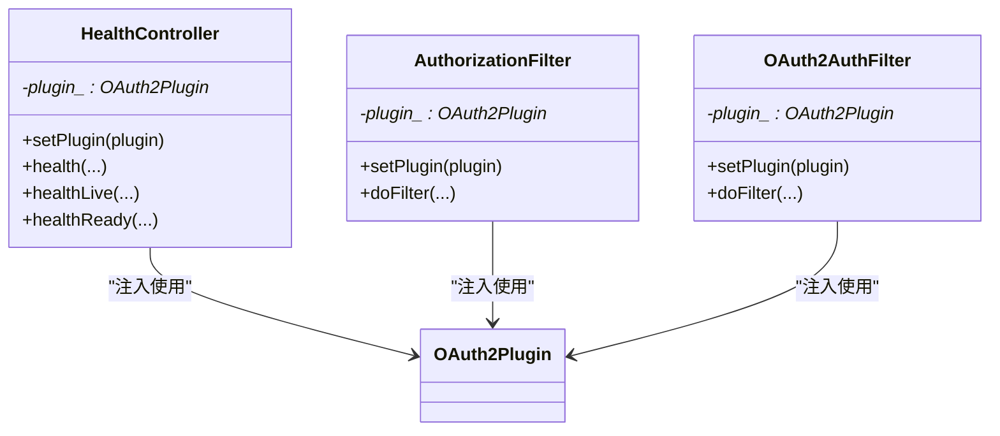
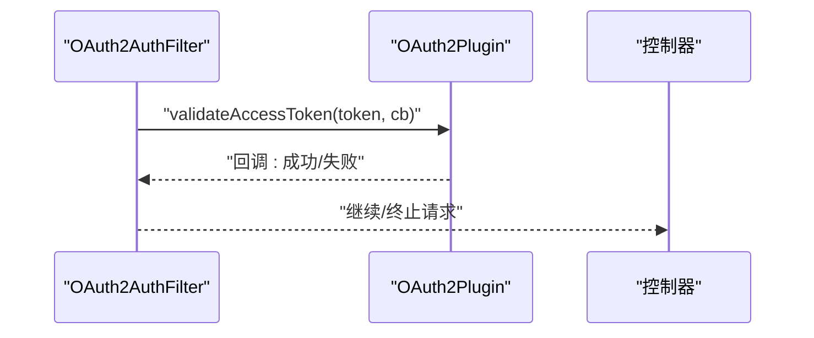
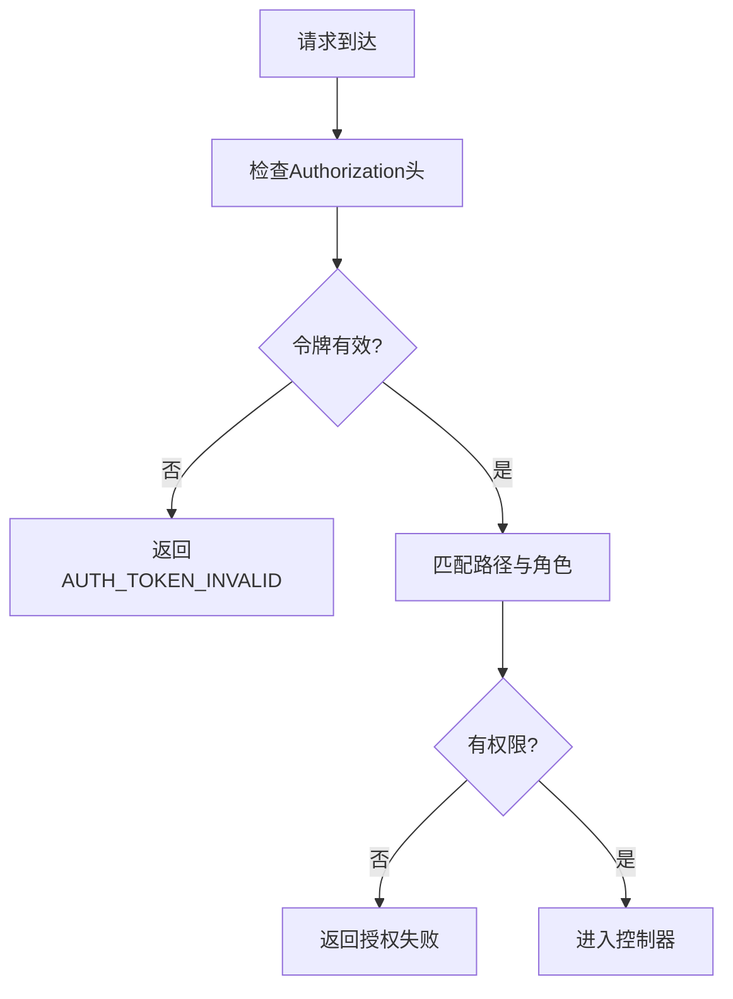
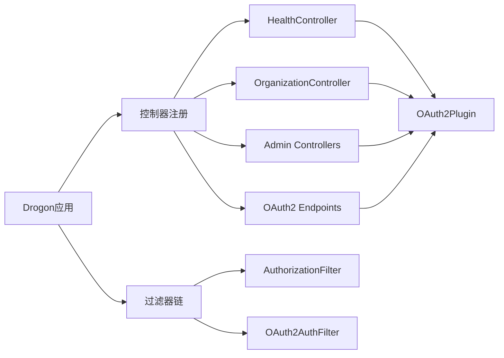

# Web控制器实现

<cite>
**本文引用的文件**
- [ControllerRegistration.h](file://apps/server/src/bootstrap/ControllerRegistration.h)
- [ControllerRegistration.cc](file://apps/server/src/bootstrap/ControllerRegistration.cc)
- [ExceptionHandlerSetup.h](file://apps/server/src/bootstrap/ExceptionHandlerSetup.h)
- [ExceptionHandlerSetup.cc](file://apps/server/src/bootstrap/ExceptionHandlerSetup.cc)
- [CorsSetup.h](file://apps/server/src/bootstrap/CorsSetup.h)
- [OrganizationController.h](file://apps/server/src/organization/OrganizationController.h)
- [OrganizationController.cc](file://apps/server/src/organization/OrganizationController.cc)
- [HealthController.h](file://libs/drogon/include/authforge/drogon/controllers/HealthController.h)
- [AuthorizationFilter.h](file://libs/drogon/include/authforge/drogon/filters/AuthorizationFilter.h)
- [OAuth2AuthFilter.h](file://libs/drogon/include/authforge/drogon/filters/OAuth2AuthFilter.h)
- [OAuth2AuthFilter.cc](file://libs/drogon/src/filters/OAuth2AuthFilter.cc)
- [OpenApiGenerator.cc](file://libs/drogon/src/observability/openapi/OpenApiGenerator.cc)
</cite>

## 目录
1. [简介](#简介)
2. [项目结构](#项目结构)
3. [核心组件](#核心组件)
4. [架构总览](#架构总览)
5. [详细组件分析](#详细组件分析)
6. [依赖关系分析](#依赖关系分析)
7. [性能考量](#性能考量)
8. [故障排查指南](#故障排查指南)
9. [结论](#结论)
10. [附录](#附录)

## 简介
本文件聚焦于AuthForge中基于Drogon框架的Web控制器实现模式，系统性说明HTTP端点定义、请求参数绑定、响应格式化、生命周期管理、依赖注入机制与异步处理支持。同时总结控制器开发最佳实践（错误处理、验证规则、权限检查），并给出高性能RESTful API控制器的编写建议以及文件上传、流式响应等高级场景的处理思路。

## 项目结构
- 控制器注册与装配：通过启动引导模块集中注册所有控制器，并在应用运行前完成插件依赖注入。
- 业务控制器：位于产品应用层（如组织管理）与SDK层（如OAuth2协议端点、健康检查、客户端管理等）。
- 过滤器：统一鉴权与OAuth2认证校验，贯穿请求链路。
- 异常与CORS：全局异常处理器与跨域配置在启动阶段完成。
- OpenAPI文档：控制器内声明接口元信息，由OpenAPI生成器聚合输出。

图表来源
- [ControllerRegistration.cc:41-120](file://apps/server/src/bootstrap/ControllerRegistration.cc#L41-L120)
- [ControllerRegistration.cc:122-175](file://apps/server/src/bootstrap/ControllerRegistration.cc#L122-L175)
- [ExceptionHandlerSetup.cc:13-64](file://apps/server/src/bootstrap/ExceptionHandlerSetup.cc#L13-L64)
- [CorsSetup.h:10-16](file://apps/server/src/bootstrap/CorsSetup.h#L10-L16)
- [AuthorizationFilter.h:17-67](file://libs/drogon/include/authforge/drogon/filters/AuthorizationFilter.h#L17-L67)
- [OAuth2AuthFilter.h:11-34](file://libs/drogon/include/authforge/drogon/filters/OAuth2AuthFilter.h#L11-L34)
- [OpenApiGenerator.cc:13-56](file://libs/drogon/src/observability/openapi/OpenApiGenerator.cc#L13-L56)

章节来源
- [ControllerRegistration.h:10-34](file://apps/server/src/bootstrap/ControllerRegistration.h#L10-L34)
- [ControllerRegistration.cc:41-175](file://apps/server/src/bootstrap/ControllerRegistration.cc#L41-L175)
- [ExceptionHandlerSetup.h:9-14](file://apps/server/src/bootstrap/ExceptionHandlerSetup.h#L9-L14)
- [ExceptionHandlerSetup.cc:13-64](file://apps/server/src/bootstrap/ExceptionHandlerSetup.cc#L13-L64)
- [CorsSetup.h:10-16](file://apps/server/src/bootstrap/CorsSetup.h#L10-L16)

## 核心组件
- 控制器注册中心：集中创建并注册所有AutoCreation=false的控制器实例，确保路由仅在显式调用时生效，避免隐式静态初始化副作用。
- 依赖注入装配：在应用启动早期获取OAuth2Plugin单例，并通过setPlugin注入到各控制器与过滤器，减少每请求查找开销。
- 全局异常处理：按路径区分OAuth2协议端点与应用端点，分别返回RFC 6749错误或统一Error Envelope，并保留CORS头。
- 过滤器链：AuthorizationFilter负责RBAC授权；OAuth2AuthFilter负责Bearer令牌校验与异步验证。
- OpenAPI文档：控制器内部声明接口元数据，由OpenApiGenerator聚合生成规范。

章节来源
- [ControllerRegistration.cc:41-120](file://apps/server/src/bootstrap/ControllerRegistration.cc#L41-L120)
- [ControllerRegistration.cc:122-175](file://apps/server/src/bootstrap/ControllerRegistration.cc#L122-L175)
- [ExceptionHandlerSetup.cc:13-64](file://apps/server/src/bootstrap/ExceptionHandlerSetup.cc#L13-L64)
- [AuthorizationFilter.h:17-67](file://libs/drogon/include/authforge/drogon/filters/AuthorizationFilter.h#L17-L67)
- [OAuth2AuthFilter.h:11-34](file://libs/drogon/include/authforge/drogon/filters/OAuth2AuthFilter.h#L11-L34)
- [OpenApiGenerator.cc:13-56](file://libs/drogon/src/observability/openapi/OpenApiGenerator.cc#L13-L56)

## 架构总览
下图展示一次受保护的组织列表请求从进入服务器到返回响应的完整流程，包括CORS、过滤器、控制器与服务层协作。

图表来源
- [AuthorizationFilter.h:36-67](file://libs/drogon/include/authforge/drogon/filters/AuthorizationFilter.h#L36-L67)
- [OAuth2AuthFilter.cc:12-68](file://libs/drogon/src/filters/OAuth2AuthFilter.cc#L12-L68)
- [OrganizationController.h:22-58](file://apps/server/src/organization/OrganizationController.h#L22-L58)
- [OrganizationController.cc:56-85](file://apps/server/src/organization/OrganizationController.cc#L56-L85)
- [CorsSetup.h:10-16](file://apps/server/src/bootstrap/CorsSetup.h#L10-L16)

## 详细组件分析

### 控制器注册与生命周期
- 显式注册：所有控制器使用HttpController<T, false>，必须在app().run()之前通过registerController显式构造并注册，避免隐式静态初始化带来的链接与启动不确定性。
- 生命周期：控制器以单例形式被Drogon调度，启动阶段通过DrClassMap获取已注册实例并注入插件依赖，保证请求期复用同一对象。
- 扩展点：新增控制器需在注册表中添加一行，必要时在依赖注入阶段补充setPlugin调用。

图表来源
- [ControllerRegistration.cc:41-120](file://apps/server/src/bootstrap/ControllerRegistration.cc#L41-L120)
- [ControllerRegistration.cc:122-175](file://apps/server/src/bootstrap/ControllerRegistration.cc#L122-L175)

章节来源
- [ControllerRegistration.cc:41-120](file://apps/server/src/bootstrap/ControllerRegistration.cc#L41-L120)
- [ControllerRegistration.cc:122-175](file://apps/server/src/bootstrap/ControllerRegistration.cc#L122-L175)

### HTTP端点定义与参数绑定
- 端点声明：通过METHOD_LIST_BEGIN/METHOD_LIST_END与ADD_METHOD_TO宏声明路径、方法与过滤器。
- 参数绑定：Drogon自动将路径参数映射为方法形参（如{slug}→std::string slug），查询参数与表单字段可通过HttpRequest访问。
- 回调模型：每个处理器接收HttpRequestPtr与一个用于返回HttpResponsePtr的回调函数，便于异步处理。

示例参考路径
- [OrganizationController.h:22-58](file://apps/server/src/organization/OrganizationController.h#L22-L58)
- [HealthController.h:32-65](file://libs/drogon/include/authforge/drogon/controllers/HealthController.h#L32-L65)

章节来源
- [OrganizationController.h:22-58](file://apps/server/src/organization/OrganizationController.h#L22-L58)
- [HealthController.h:32-65](file://libs/drogon/include/authforge/drogon/controllers/HealthController.h#L32-L65)

### 响应格式化与统一错误封套
- 应用端点错误：统一使用Error Envelope（包含code、category、message、request_id等），Content-Type为application/json。
- OAuth2协议端点错误：遵循RFC 6749 §5.2，返回error字符串及可选描述，不泄漏内部错误细节。
- 全局异常处理：根据路径判断分支，保持CORS头一致性。

图表来源
- [ExceptionHandlerSetup.cc:13-64](file://apps/server/src/bootstrap/ExceptionHandlerSetup.cc#L13-L64)

章节来源
- [ExceptionHandlerSetup.cc:13-64](file://apps/server/src/bootstrap/ExceptionHandlerSetup.cc#L13-L64)

### 依赖注入机制
- 注入目标：控制器与过滤器均提供setPlugin(OAuth2Plugin*)接口，启动时一次性注入，避免每请求getPlugin开销。
- 回退策略：若未注入，运行时仍可通过全局lookup回退，保证向后兼容。
- 安全边界：注入指针非拥有型，生命周期由Drogon插件管理器托管，控制器仅持有弱引用。

图表来源
- [HealthController.h:41-73](file://libs/drogon/include/authforge/drogon/controllers/HealthController.h#L41-L73)
- [AuthorizationFilter.h:22-44](file://libs/drogon/include/authforge/drogon/filters/AuthorizationFilter.h#L22-L44)
- [OAuth2AuthFilter.h:18-33](file://libs/drogon/include/authforge/drogon/filters/OAuth2AuthFilter.h#L18-L33)
- [ControllerRegistration.cc:122-175](file://apps/server/src/bootstrap/ControllerRegistration.cc#L122-L175)

章节来源
- [HealthController.h:41-73](file://libs/drogon/include/authforge/drogon/controllers/HealthController.h#L41-L73)
- [AuthorizationFilter.h:22-44](file://libs/drogon/include/authforge/drogon/filters/AuthorizationFilter.h#L22-L44)
- [OAuth2AuthFilter.h:18-33](file://libs/drogon/include/authforge/drogon/filters/OAuth2AuthFilter.h#L18-L33)
- [ControllerRegistration.cc:122-175](file://apps/server/src/bootstrap/ControllerRegistration.cc#L122-L175)

### 异步处理支持
- 回调驱动：控制器处理器采用回调风格，适合I/O密集型操作（数据库、网络调用）。
- 过滤器异步：OAuth2AuthFilter对令牌验证进行异步调用，避免阻塞事件循环。
- 服务层解耦：控制器仅做适配，实际异步逻辑下沉至Service层。

图表来源
- [OAuth2AuthFilter.cc:12-68](file://libs/drogon/src/filters/OAuth2AuthFilter.cc#L12-L68)
- [OrganizationController.cc:56-85](file://apps/server/src/organization/OrganizationController.cc#L56-L85)

章节来源
- [OAuth2AuthFilter.cc:12-68](file://libs/drogon/src/filters/OAuth2AuthFilter.cc#L12-L68)
- [OrganizationController.cc:56-85](file://apps/server/src/organization/OrganizationController.cc#L56-L85)

### 权限检查与过滤链
- AuthorizationFilter：维护路径正则与允许角色集合，按请求路径与用户角色进行RBAC判定。
- OAuth2AuthFilter：校验Authorization头格式与令牌有效性，支持OPTIONS预检直通。
- 组合使用：受保护端点可同时挂载两个过滤器，先鉴权后授权。

图表来源
- [AuthorizationFilter.h:46-67](file://libs/drogon/include/authforge/drogon/filters/AuthorizationFilter.h#L46-L67)
- [OAuth2AuthFilter.cc:12-68](file://libs/drogon/src/filters/OAuth2AuthFilter.cc#L12-L68)

章节来源
- [AuthorizationFilter.h:46-67](file://libs/drogon/include/authforge/drogon/filters/AuthorizationFilter.h#L46-L67)
- [OAuth2AuthFilter.cc:12-68](file://libs/drogon/src/filters/OAuth2AuthFilter.cc#L12-L68)

### OpenAPI文档集成
- 控制器内声明：通过EndpointInfo注册path、method、summary、tags、requiresAuth等信息。
- 生成器聚合：OpenApiGenerator维护全局端点列表与API信息，支持生成规范与写入文件。
- 好处：文档与代码同仓同步，降低漂移风险。

章节来源
- [OrganizationController.cc:17-52](file://apps/server/src/organization/OrganizationController.cc#L17-L52)
- [OpenApiGenerator.cc:13-56](file://libs/drogon/src/observability/openapi/OpenApiGenerator.cc#L13-L56)

## 依赖关系分析
- 控制器与过滤器耦合度低：通过过滤器链实现横切关注点（认证、授权），控制器专注业务。
- 启动阶段集中装配：注册与依赖注入集中在bootstrap模块，便于维护与测试。
- 外部依赖：Drogon框架、OAuth2Plugin、存储层（通过Service抽象）。

图表来源
- [ControllerRegistration.cc:41-120](file://apps/server/src/bootstrap/ControllerRegistration.cc#L41-L120)
- [AuthorizationFilter.h:17-67](file://libs/drogon/include/authforge/drogon/filters/AuthorizationFilter.h#L17-L67)
- [OAuth2AuthFilter.h:11-34](file://libs/drogon/include/authforge/drogon/filters/OAuth2AuthFilter.h#L11-L34)

章节来源
- [ControllerRegistration.cc:41-120](file://apps/server/src/bootstrap/ControllerRegistration.cc#L41-L120)
- [AuthorizationFilter.h:17-67](file://libs/drogon/include/authforge/drogon/filters/AuthorizationFilter.h#L17-L67)
- [OAuth2AuthFilter.h:11-34](file://libs/drogon/include/authforge/drogon/filters/OAuth2AuthFilter.h#L11-L34)

## 性能考量
- 避免每请求插件查找：通过启动期setPlugin注入，减少app().getPlugin()调用开销。
- 异步优先：I/O操作使用回调/异步API，避免阻塞事件循环。
- 最小化序列化：尽量在服务层组装数据结构，控制器只做轻量转换。
- 连接复用与缓存：结合Redis/内存缓存热点数据，减少数据库压力。
- 合理分页与限流：对列表接口实施分页，对敏感接口启用速率限制。

[本节为通用指导，无需特定文件来源]

## 故障排查指南
- 未捕获异常：检查全局异常处理器是否正确分支到OAuth2协议错误与应用错误信封，确认CORS头注入。
- 令牌无效：查看OAuth2AuthFilter日志，确认Authorization头格式与令牌状态。
- 权限不足：核对AuthorizationFilter中的RBAC规则与用户角色映射。
- 文档不一致：确认控制器内EndpointInfo与实际路由一致，避免OpenAPI漂移。

章节来源
- [ExceptionHandlerSetup.cc:13-64](file://apps/server/src/bootstrap/ExceptionHandlerSetup.cc#L13-L64)
- [OAuth2AuthFilter.cc:12-68](file://libs/drogon/src/filters/OAuth2AuthFilter.cc#L12-L68)
- [AuthorizationFilter.h:46-67](file://libs/drogon/include/authforge/drogon/filters/AuthorizationFilter.h#L46-L67)

## 结论
AuthForge的Drogon控制器实现以“显式注册+启动期依赖注入”为核心，配合过滤器链与统一错误处理，形成高内聚、低耦合的Web层架构。通过异步回调与OpenAPI集成，既保证了可扩展性与可观测性，也提升了开发与运维效率。遵循本文的最佳实践，可快速构建高性能、易维护的RESTful API控制器。

## 附录
- 控制器开发清单
  - 使用HttpController<T, false>并显式注册
  - 在启动阶段注入OAuth2Plugin
  - 使用过滤器链实现认证与授权
  - 统一错误响应格式（应用端点用Error Envelope，OAuth2端点用RFC 6749）
  - 在控制器内声明OpenAPI元信息
- 高级场景建议
  - 文件上传：使用multipart/form-data，分块读取与校验，落盘后再入库元数据
  - 流式响应：对大文件或长任务使用流式输出，及时释放资源
  - 并发安全：避免在控制器中持有可变共享状态，必要时使用线程安全容器或无锁设计

[本节为通用指导，无需特定文件来源]