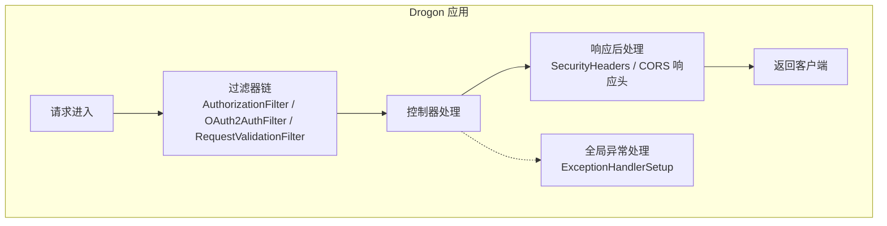
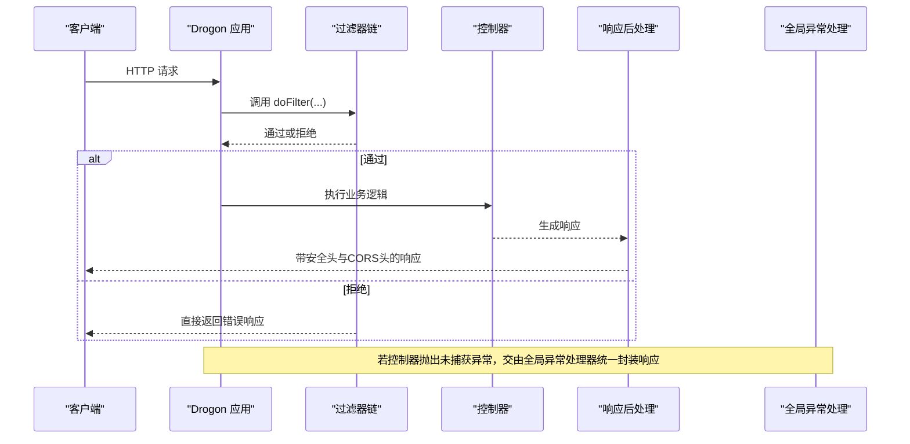
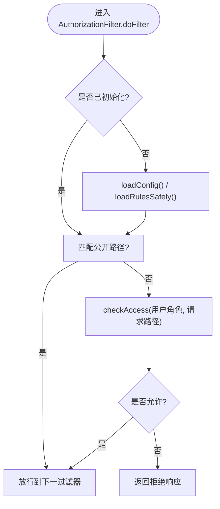
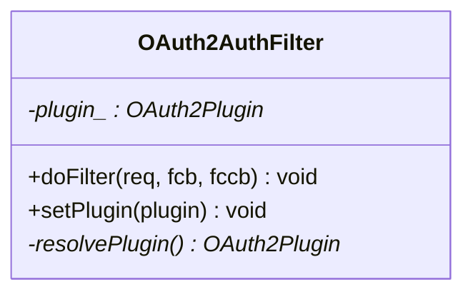
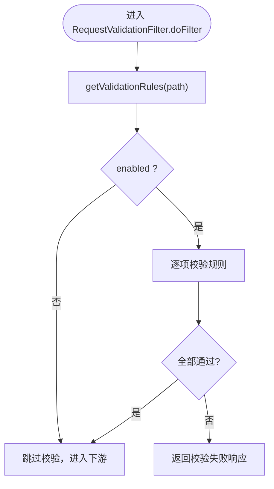
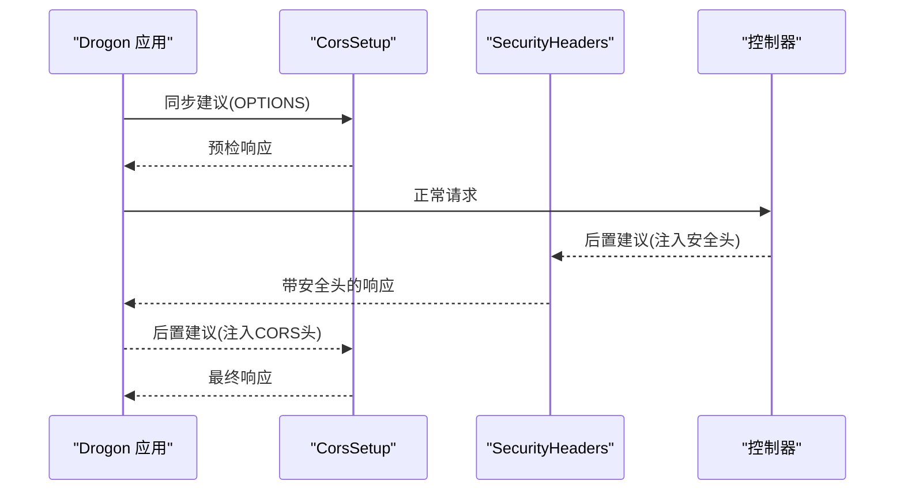
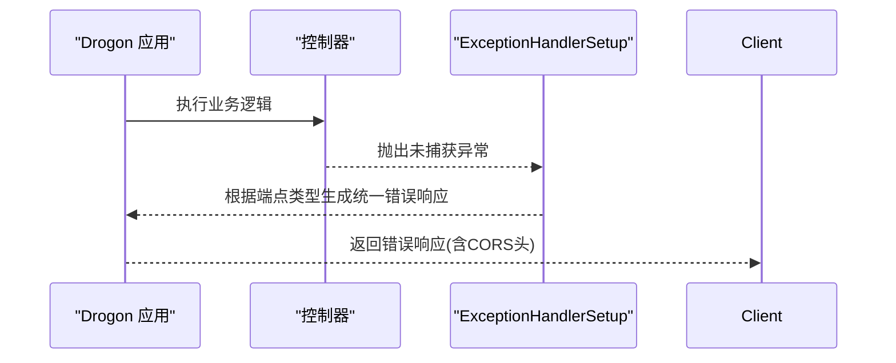
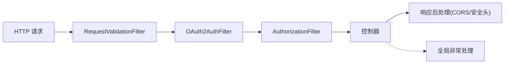

# 中间件与过滤器

<cite>
**本文引用的文件**
- [AuthorizationFilter.h](file://libs/drogon/include/authforge/drogon/filters/AuthorizationFilter.h)
- [OAuth2AuthFilter.h](file://libs/drogon/include/authforge/drogon/filters/OAuth2AuthFilter.h)
- [RequestValidationFilter.h](file://libs/drogon/include/authforge/drogon/filters/RequestValidationFilter.h)
- [CorsSetup.h](file://apps/server/src/bootstrap/CorsSetup.h)
- [ExceptionHandlerSetup.h](file://apps/server/src/bootstrap/ExceptionHandlerSetup.h)
- [SecurityHeaders.h](file://apps/server/src/bootstrap/SecurityHeaders.h)
</cite>

## 目录
1. [简介](#简介)
2. [项目结构](#项目结构)
3. [核心组件](#核心组件)
4. [架构总览](#架构总览)
5. [详细组件分析](#详细组件分析)
6. [依赖关系分析](#依赖关系分析)
7. [性能考虑](#性能考虑)
8. [故障排查指南](#故障排查指南)
9. [结论](#结论)
10. [附录](#附录)

## 简介
本文件聚焦于 AuthForge 在 Drogon 框架上的中间件（过滤器）与全局处理链设计，系统说明请求预处理、响应后处理、异常拦截等关键流程；详解内置认证、授权、请求校验等过滤器的实现原理与使用方式；并提供自定义中间件的注册、配置与优化建议，以及过滤器与控制器的集成方法，帮助开发者以横切关注点的方式统一处理安全、日志、校验等通用能力。

## 项目结构
- 过滤器位于 libs/drogon/include/authforge/drogon/filters 下，提供三类核心过滤器：
  - 授权访问控制：AuthorizationFilter
  - OAuth2 认证：OAuth2AuthFilter
  - 请求参数校验：RequestValidationFilter
- 应用启动阶段的全局处理通过 apps/server/src/bootstrap 下的设置模块完成：
  - CORS 预检与响应头注入：CorsSetup
  - 全局异常处理器：ExceptionHandlerSetup
  - 安全响应头注入：SecurityHeaders

图表来源
- [AuthorizationFilter.h:17-67](file://libs/drogon/include/authforge/drogon/filters/AuthorizationFilter.h#L17-L67)
- [OAuth2AuthFilter.h:11-34](file://libs/drogon/include/authforge/drogon/filters/OAuth2AuthFilter.h#L11-L34)
- [RequestValidationFilter.h:21-51](file://libs/drogon/include/authforge/drogon/filters/RequestValidationFilter.h#L21-L51)
- [CorsSetup.h:10-16](file://apps/server/src/bootstrap/CorsSetup.h#L10-L16)
- [SecurityHeaders.h:8-13](file://apps/server/src/bootstrap/SecurityHeaders.h#L8-L13)
- [ExceptionHandlerSetup.h:9-14](file://apps/server/src/bootstrap/ExceptionHandlerSetup.h#L9-L14)

章节来源
- [AuthorizationFilter.h:17-67](file://libs/drogon/include/authforge/drogon/filters/AuthorizationFilter.h#L17-L67)
- [OAuth2AuthFilter.h:11-34](file://libs/drogon/include/authforge/drogon/filters/OAuth2AuthFilter.h#L11-L34)
- [RequestValidationFilter.h:21-51](file://libs/drogon/include/authforge/drogon/filters/RequestValidationFilter.h#L21-L51)
- [CorsSetup.h:10-16](file://apps/server/src/bootstrap/CorsSetup.h#L10-L16)
- [SecurityHeaders.h:8-13](file://apps/server/src/bootstrap/SecurityHeaders.h#L8-L13)
- [ExceptionHandlerSetup.h:9-14](file://apps/server/src/bootstrap/ExceptionHandlerSetup.h#L9-L14)

## 核心组件
- AuthorizationFilter：基于路径正则与角色白名单的访问控制过滤器，负责加载规则并校验当前用户角色是否允许访问目标路径。
- OAuth2AuthFilter：OAuth2 协议相关的认证过滤器，负责从请求中提取并验证凭据，将认证结果注入后续链路。
- RequestValidationFilter：自动化的请求参数校验过滤器，按路由维度加载校验规则集，对必填字段、格式等进行前置校验。
- CorsSetup：注册 Drogon 同步/后置处理建议，处理 OPTIONS 预检请求并在响应中注入 CORS 头。
- SecurityHeaders：全局响应后处理建议，注入 X-Content-Type-Options、X-Frame-Options、Content-Security-Policy、Strict-Transport-Security 等安全头。
- ExceptionHandlerSetup：全局未捕获异常处理器，区分 OAuth2 协议端点与其他应用端点的错误响应体，同时保留 CORS 头。

章节来源
- [AuthorizationFilter.h:17-67](file://libs/drogon/include/authforge/drogon/filters/AuthorizationFilter.h#L17-L67)
- [OAuth2AuthFilter.h:11-34](file://libs/drogon/include/authforge/drogon/filters/OAuth2AuthFilter.h#L11-L34)
- [RequestValidationFilter.h:21-51](file://libs/drogon/include/authforge/drogon/filters/RequestValidationFilter.h#L21-L51)
- [CorsSetup.h:10-16](file://apps/server/src/bootstrap/CorsSetup.h#L10-L16)
- [SecurityHeaders.h:8-13](file://apps/server/src/bootstrap/SecurityHeaders.h#L8-L13)
- [ExceptionHandlerSetup.h:9-14](file://apps/server/src/bootstrap/ExceptionHandlerSetup.h#L9-L14)

## 架构总览
下图展示了请求在 Drogon 中的典型生命周期：请求进入后先经过过滤器链（认证、授权、校验），再到达控制器；响应生成后依次执行安全头与 CORS 响应头注入；任何未捕获异常由全局异常处理器统一收敛。

图表来源
- [AuthorizationFilter.h:17-67](file://libs/drogon/include/authforge/drogon/filters/AuthorizationFilter.h#L17-L67)
- [OAuth2AuthFilter.h:11-34](file://libs/drogon/include/authforge/drogon/filters/OAuth2AuthFilter.h#L11-L34)
- [RequestValidationFilter.h:21-51](file://libs/drogon/include/authforge/drogon/filters/RequestValidationFilter.h#L21-L51)
- [CorsSetup.h:10-16](file://apps/server/src/bootstrap/CorsSetup.h#L10-L16)
- [SecurityHeaders.h:8-13](file://apps/server/src/bootstrap/SecurityHeaders.h#L8-L13)
- [ExceptionHandlerSetup.h:9-14](file://apps/server/src/bootstrap/ExceptionHandlerSetup.h#L9-L14)

## 详细组件分析

### 授权访问控制过滤器 AuthorizationFilter
- 职责
  - 维护“路径正则 -> 允许角色集合”的规则表与公开路径列表。
  - 在 doFilter 中解析当前请求路径，匹配规则并校验用户角色。
  - 支持插件依赖注入（setPlugin），避免每次请求时全局查找，提升性能。
- 关键数据结构
  - RbacRule：包含 pathPattern（std::regex）与 allowedRoles（std::vector<std::string>）。
  - rules_：存储所有 RBAC 规则。
  - publicPaths_：存储无需鉴权的公开路径正则。
  - initFlag_：实例级 once_flag，确保每个实例仅初始化一次规则，避免跨实例共享导致的空规则问题。
- 执行流程
  - 首次调用时加载配置与规则（loadConfig/loadRulesSafely）。
  - 匹配公开路径则放行。
  - 否则根据用户角色集合与规则进行访问检查（checkAccess）。
  - 不满足条件时直接返回拒绝响应；满足则继续过滤器链。

图表来源
- [AuthorizationFilter.h:17-67](file://libs/drogon/include/authforge/drogon/filters/AuthorizationFilter.h#L17-L67)

章节来源
- [AuthorizationFilter.h:17-67](file://libs/drogon/include/authforge/drogon/filters/AuthorizationFilter.h#L17-L67)

### OAuth2 认证过滤器 OAuth2AuthFilter
- 职责
  - 在请求进入业务控制器前完成 OAuth2 相关认证（如令牌提取、校验、上下文注入）。
  - 支持插件依赖注入（setPlugin），减少运行时开销。
- 执行要点
  - 在 doFilter 中解析请求，调用底层认证能力，决定放行或返回认证失败响应。
  - 与 AuthorizationFilter 配合，形成“先认证、后授权”的完整鉴权链。

图表来源
- [OAuth2AuthFilter.h:11-34](file://libs/drogon/include/authforge/drogon/filters/OAuth2AuthFilter.h#L11-L34)

章节来源
- [OAuth2AuthFilter.h:11-34](file://libs/drogon/include/authforge/drogon/filters/OAuth2AuthFilter.h#L11-L34)

### 请求参数校验过滤器 RequestValidationFilter
- 职责
  - 在控制器执行前自动校验请求参数，覆盖基础格式、必填字段及 OAuth2 专用规则。
  - 按路由维度加载规则集，支持启用/禁用开关。
- 关键数据结构
  - RouteValidationRules：包含 rules（Rule 集合）与 enabled（是否启用）。
  - 静态规则映射：通过 buildRules() 构建 map<path, RouteValidationRules>，并以 Meyers Singleton 形式懒加载，避免构造顺序问题。
- 执行流程
  - 根据请求路径获取对应规则集。
  - 若规则启用则逐项校验，失败即返回标准化错误响应；通过则继续下游。

图表来源
- [RequestValidationFilter.h:21-51](file://libs/drogon/include/authforge/drogon/filters/RequestValidationFilter.h#L21-L51)

章节来源
- [RequestValidationFilter.h:21-51](file://libs/drogon/include/authforge/drogon/filters/RequestValidationFilter.h#L21-L51)

### 全局响应后处理与安全头
- CORS 处理（CorsSetup）
  - 注册同步建议处理 OPTIONS 预检请求。
  - 注册后置建议为响应注入 CORS 头，策略来源于 cors.allow_origins 严格白名单。
- 安全头注入（SecurityHeaders）
  - 注册全局后置建议，统一注入 X-Content-Type-Options、X-Frame-Options、Content-Security-Policy、Strict-Transport-Security。

图表来源
- [CorsSetup.h:10-16](file://apps/server/src/bootstrap/CorsSetup.h#L10-L16)
- [SecurityHeaders.h:8-13](file://apps/server/src/bootstrap/SecurityHeaders.h#L8-L13)

章节来源
- [CorsSetup.h:10-16](file://apps/server/src/bootstrap/CorsSetup.h#L10-L16)
- [SecurityHeaders.h:8-13](file://apps/server/src/bootstrap/SecurityHeaders.h#L8-L13)

### 全局异常处理
- 功能
  - 捕获未抛出的异常，按端点类型差异化响应：
    - OAuth2 协议端点：遵循 RFC 6749 §5.2 server_error 响应体。
    - 其他应用端点：统一 Error Envelope（INTERNAL_ERROR）。
  - 保证 CORS 头在异常分支中依然保留。
- 集成点
  - 在应用启动阶段通过 setupExceptionHandler 注册至 Drogon 应用。

图表来源
- [ExceptionHandlerSetup.h:9-14](file://apps/server/src/bootstrap/ExceptionHandlerSetup.h#L9-L14)

章节来源
- [ExceptionHandlerSetup.h:9-14](file://apps/server/src/bootstrap/ExceptionHandlerSetup.h#L9-L14)

## 依赖关系分析
- 过滤器之间的协作
  - OAuth2AuthFilter 负责认证，AuthorizationFilter 负责授权，RequestValidationFilter 负责参数校验。三者可组合形成“校验 -> 认证 -> 授权”的流水线。
- 与插件的耦合
  - AuthorizationFilter 与 OAuth2AuthFilter 均支持 setPlugin 注入 OAuth2Plugin 指针，避免每次请求全局查找，降低锁竞争与查找成本。
- 与启动阶段的耦合
  - CorsSetup、SecurityHeaders、ExceptionHandlerSetup 在应用启动时注册到 Drogon 应用，属于横切关注点的基础设施。

图表来源
- [AuthorizationFilter.h:17-67](file://libs/drogon/include/authforge/drogon/filters/AuthorizationFilter.h#L17-L67)
- [OAuth2AuthFilter.h:11-34](file://libs/drogon/include/authforge/drogon/filters/OAuth2AuthFilter.h#L11-L34)
- [RequestValidationFilter.h:21-51](file://libs/drogon/include/authforge/drogon/filters/RequestValidationFilter.h#L21-L51)
- [CorsSetup.h:10-16](file://apps/server/src/bootstrap/CorsSetup.h#L10-L16)
- [SecurityHeaders.h:8-13](file://apps/server/src/bootstrap/SecurityHeaders.h#L8-L13)
- [ExceptionHandlerSetup.h:9-14](file://apps/server/src/bootstrap/ExceptionHandlerSetup.h#L9-L14)

章节来源
- [AuthorizationFilter.h:17-67](file://libs/drogon/include/authforge/drogon/filters/AuthorizationFilter.h#L17-L67)
- [OAuth2AuthFilter.h:11-34](file://libs/drogon/include/authforge/drogon/filters/OAuth2AuthFilter.h#L11-L34)
- [RequestValidationFilter.h:21-51](file://libs/drogon/include/authforge/drogon/filters/RequestValidationFilter.h#L21-L51)
- [CorsSetup.h:10-16](file://apps/server/src/bootstrap/CorsSetup.h#L10-L16)
- [SecurityHeaders.h:8-13](file://apps/server/src/bootstrap/SecurityHeaders.h#L8-L13)
- [ExceptionHandlerSetup.h:9-14](file://apps/server/src/bootstrap/ExceptionHandlerSetup.h#L9-L14)

## 性能考虑
- 规则初始化
  - AuthorizationFilter 使用 per-instance once_flag 确保每个实例仅加载一次规则，避免重复正则编译与配置读取。
  - RequestValidationFilter 使用函数局部静态（Meyers Singleton）构建规则映射，避免全局对象构造顺序问题，且仅首次访问时填充。
- 插件依赖注入
  - 两个过滤器均支持 setPlugin，避免每次请求通过全局容器查找插件，减少锁与查找开销。
- 正则匹配
  - 路径匹配采用 std::regex，建议在规则数量较大时评估缓存命中与匹配代价，必要时对高频路径做短路判断。
- 响应后处理
  - 安全头与 CORS 头注入为轻量操作，但应避免在热点路径中进行昂贵计算。

[本节为通用性能指导，不直接分析具体文件]

## 故障排查指南
- 过滤器未生效
  - 确认过滤器已在控制器路由上正确注册（ADD_METHOD_TO 中使用正确的过滤器名称）。
  - 检查 AuthorizationFilter 的规则是否已加载（rules_ 是否为空），以及 initFlag_ 是否正常触发一次初始化。
- 权限误判
  - 核对路径正则与公开路径列表是否正确配置。
  - 检查用户角色集合是否与规则中的 allowedRoles 匹配。
- 参数校验失败
  - 查看 RequestValidationFilter 的路由规则映射是否包含该路径，enabled 是否为 true。
  - 检查 Rule 定义是否符合预期（必填、长度、字符集等）。
- CORS 预检失败
  - 确认 CorsSetup 已注册同步建议处理 OPTIONS，且 allow_origins 白名单包含请求来源。
- 异常响应不符合预期
  - 确认 ExceptionHandlerSetup 已注册，且端点类型判断逻辑符合预期（OAuth2 协议端点 vs 其他应用端点）。
  - 检查异常分支中是否保留了 CORS 头。

章节来源
- [AuthorizationFilter.h:17-67](file://libs/drogon/include/authforge/drogon/filters/AuthorizationFilter.h#L17-L67)
- [RequestValidationFilter.h:21-51](file://libs/drogon/include/authforge/drogon/filters/RequestValidationFilter.h#L21-L51)
- [CorsSetup.h:10-16](file://apps/server/src/bootstrap/CorsSetup.h#L10-L16)
- [ExceptionHandlerSetup.h:9-14](file://apps/server/src/bootstrap/ExceptionHandlerSetup.h#L9-L14)

## 结论
AuthForge 在 Drogon 上通过过滤器链实现了清晰的横切关注点分离：请求参数校验、认证、授权在前置阶段完成，响应后处理与安全头注入在后置阶段统一保障，全局异常处理器提供一致的错误体验。借助插件依赖注入与一次性初始化机制，系统在可扩展性与性能之间取得良好平衡。开发者可按需扩展过滤器与规则，快速叠加新的横切能力。

## 附录
- 自定义中间件开发建议
  - 继承 drogon::HttpFilter<T> 并实现 doFilter，在适当时机调用 FilterCallback 与 FilterChainCallback。
  - 使用 setPlugin 注入依赖，避免每次请求全局查找。
  - 将规则与配置集中管理，利用一次性初始化（per-instance once_flag 或 Meyers Singleton）提升性能。
  - 在响应后处理中统一注入安全头与 CORS 头，保持响应一致性。
- 过滤器与控制器的集成
  - 在控制器路由声明中通过 ADD_METHOD_TO 指定过滤器名称，形成“校验 -> 认证 -> 授权”的执行序列。
  - 对于需要跨端点复用的横切逻辑，优先放入过滤器而非控制器内部，保持控制器专注业务。

[本节为通用实践建议，不直接分析具体文件]