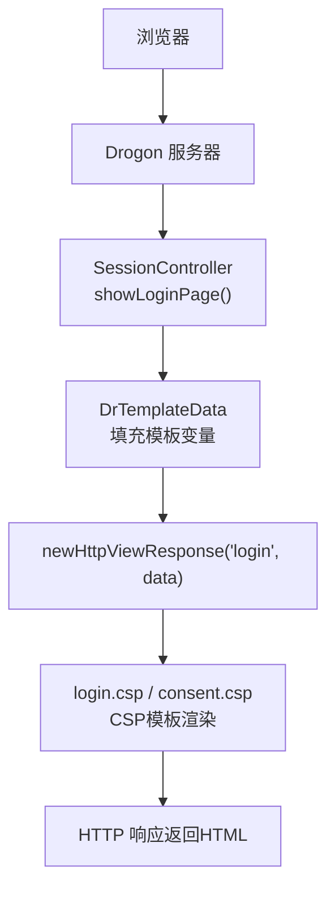
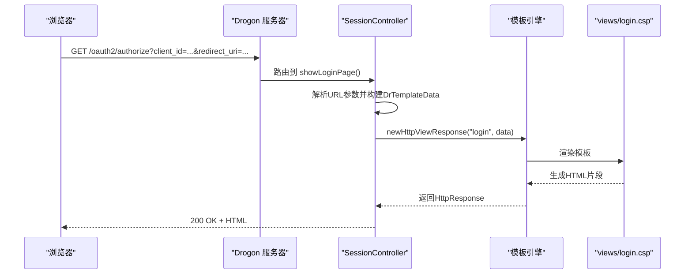
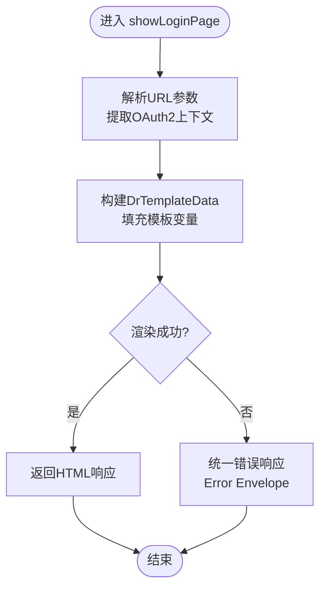
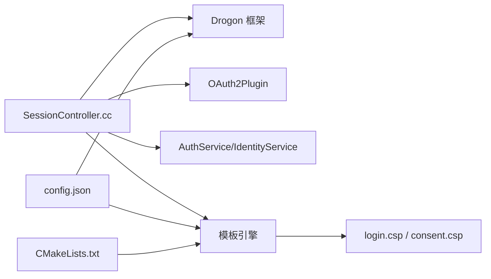

# 视图渲染引擎

<cite>
**本文引用的文件**
- [apps/server/src/main.cc](file://apps/server/src/main.cc)
- [apps/server/CMakeLists.txt](file://apps/server/CMakeLists.txt)
- [apps/server/config/config.json](file://apps/server/config/config.json)
- [apps/server/views/login.csp](file://apps/server/views/login.csp)
- [apps/server/views/consent.csp](file://apps/server/views/consent.csp)
- [libs/drogon/src/controllers/SessionController.cc](file://libs/drogon/src/controllers/SessionController.cc)
- [examples/full-stack-host/CMakeLists.txt](file://examples/full-stack-host/CMakeLists.txt)
</cite>

## 目录
1. [简介](#简介)
2. [项目结构](#项目结构)
3. [核心组件](#核心组件)
4. [架构总览](#架构总览)
5. [详细组件分析](#详细组件分析)
6. [依赖关系分析](#依赖关系分析)
7. [性能考虑](#性能考虑)
8. [故障排查指南](#故障排查指南)
9. [结论](#结论)
10. [附录](#附录)

## 简介
本文件面向AuthForge中基于Drogon的视图渲染系统，系统性说明模板语法、数据绑定、局部视图复用、静态资源管理、国际化支持、前后端分离集成（如Vue.js）以及服务端渲染最佳实践。文档同时给出模板性能优化技巧与安全注意事项，帮助读者在生产环境中稳定、高效地使用视图能力。

## 项目结构
- 视图模板位于 apps/server/views，包含登录与授权同意页：
  - login.csp：使用 Drogon 的 .csp 模板语法，通过 DrTemplateData 注入 OAuth2 流程参数。
  - consent.csp：提供用户授权同意页面，采用 <? ... ?> 占位符进行数据绑定。
- 构建期通过 drogon_create_views 将模板编译为 C++ 代码并链接进可执行文件；运行时也可通过配置启用动态视图加载。
- 控制器 SessionController 负责组装模板数据并调用 newHttpViewResponse 渲染视图。
- 配置文件 config.json 控制静态资源根目录、缓存策略、动态视图路径等。

图表来源
- [libs/drogon/src/controllers/SessionController.cc:320-383](file://libs/drogon/src/controllers/SessionController.cc#L320-L383)
- [apps/server/views/login.csp:1-230](file://apps/server/views/login.csp#L1-L230)
- [apps/server/views/consent.csp:1-130](file://apps/server/views/consent.csp#L1-L130)

章节来源
- [apps/server/CMakeLists.txt:35-37](file://apps/server/CMakeLists.txt#L35-L37)
- [apps/server/config/config.json:41-95](file://apps/server/config/config.json#L41-L95)
- [examples/full-stack-host/CMakeLists.txt:51-53](file://examples/full-stack-host/CMakeLists.txt#L51-L53)

## 核心组件
- 视图模板
  - login.csp：使用 [[key]] 形式的占位符，承载 OAuth2 授权码流程所需参数（client_id、redirect_uri、scope、state、response_type、code_challenge、code_challenge_method、nonce），并通过隐藏表单字段回传至后端。
  - consent.csp：使用 <? key ?> 形式的数据绑定，展示客户端ID、用户ID、请求范围等信息，并提供“授权/拒绝”两个提交入口。
- 控制器渲染
  - SessionController::showLoginPage 从请求参数中提取 OAuth2 上下文，构造 DrTemplateData，调用 newHttpViewResponse("login", data) 渲染 login.csp。
  - consent.csp 当前作为独立页面存在，但实际授权同意流程在控制器中重定向到前端路由处理，服务端模板更多作为备用或演示用途。
- 构建与运行
  - 构建时通过 drogon_create_views 将 views 目录下的模板编译为 C++ 源码并链接入目标二进制。
  - 运行时可通过配置启用动态视图加载（load_dynamic_views 与 dynamic_views_path）。

章节来源
- [libs/drogon/src/controllers/SessionController.cc:320-383](file://libs/drogon/src/controllers/SessionController.cc#L320-L383)
- [apps/server/views/login.csp:1-230](file://apps/server/views/login.csp#L1-L230)
- [apps/server/views/consent.csp:1-130](file://apps/server/views/consent.csp#L1-L130)
- [apps/server/CMakeLists.txt:35-37](file://apps/server/CMakeLists.txt#L35-L37)
- [examples/full-stack-host/CMakeLists.txt:51-53](file://examples/full-stack-host/CMakeLists.txt#L51-L53)

## 架构总览
下图展示了从浏览器发起登录到视图渲染的完整链路，包括控制器装配、模板数据准备与渲染输出。

图表来源
- [libs/drogon/src/controllers/SessionController.cc:320-383](file://libs/drogon/src/controllers/SessionController.cc#L320-L383)
- [apps/server/views/login.csp:1-230](file://apps/server/views/login.csp#L1-L230)

章节来源
- [apps/server/src/main.cc:151-158](file://apps/server/src/main.cc#L151-L158)
- [apps/server/config/config.json:41-95](file://apps/server/config/config.json#L41-L95)

## 详细组件分析

### 模板语法与数据绑定
- login.csp
  - 使用 [[key]] 占位符进行数据绑定，例如 client_id、redirect_uri、scope、state、response_type、code_challenge、code_challenge_method、nonce、frontend_register_url。
  - 通过隐藏表单字段将 OAuth2 参数回传给 /oauth2/login，确保授权码流程参数跨轮次一致。
- consent.csp
  - 使用 <? key ?> 占位符进行数据绑定，展示 client_id、user_id、requested_scope、redirect_uri、state 等。
  - 提供两个表单分别提交 approve 与 deny 动作，用于用户授权决策。

图表来源
- [libs/drogon/src/controllers/SessionController.cc:320-383](file://libs/drogon/src/controllers/SessionController.cc#L320-L383)

章节来源
- [apps/server/views/login.csp:1-230](file://apps/server/views/login.csp#L1-L230)
- [apps/server/views/consent.csp:1-130](file://apps/server/views/consent.csp#L1-L130)
- [libs/drogon/src/controllers/SessionController.cc:320-383](file://libs/drogon/src/controllers/SessionController.cc#L320-L383)

### 局部视图复用
- 当前仓库未实现自定义局部视图机制。若需复用公共片段（如头部、底部、错误提示），建议：
  - 将通用片段抽取为独立的 .csp 文件，并在主模板中以 include 方式引入（需在模板中实现 include 逻辑或使用 Drogon 提供的扩展点）。
  - 或者在服务端拼接多个片段后一次性渲染，减少多次网络往返。
- 注意：避免在模板中进行复杂业务逻辑，保持模板轻量，利于缓存与测试。

[本节为概念性说明，不直接分析具体文件]

### 静态资源管理与配置
- document_root：设置静态资源根目录，便于集中管理前端构建产物。
- static_file_headers：为静态资源添加缓存头（如 Cache-Control），提升首屏与重复访问性能。
- locations：可按路径定制内容类型、是否大小写敏感、是否递归、过滤器等。
- use_gzip/use_brotli/gzip_static/br_static：开启压缩与预压缩静态文件服务，降低带宽占用。
- static_files_cache_time：全局静态文件缓存时间，生产环境建议设置为较长值。

章节来源
- [apps/server/config/config.json:41-131](file://apps/server/config/config.json#L41-L131)

### 国际化支持
- 当前服务端模板未内置 i18n 机制。推荐方案：
  - 在后端根据 Accept-Language 或 Cookie/Locale 选择文案，注入到模板数据中（如 title、subtitle、按钮文案）。
  - 或将国际化文案下沉到前端（Vue.js），由前端根据语言包切换文本；服务端仅传递必要数据。
- 对于错误消息，前端已具备统一的错误消息适配与本地化能力（zh-CN 默认），可在服务端返回 Error_Code，前端据此显示本地化信息。

章节来源
- [frontends/admin/src/services/messages/index.ts:28-62](file://frontends/admin/src/services/messages/index.ts#L28-L62)

### 前后端分离集成（Vue.js）与服务端渲染最佳实践
- 前后端分离模式
  - 将 Vue 应用构建为静态资源，部署到 document_root 或通过反向代理指向前端服务。
  - 登录/授权流程中，服务端渲染关键页面（如登录页）以携带必要的 OAuth2 参数；其余交互由前端 SPA 接管。
- 服务端渲染最佳实践
  - 仅在必要时渲染页面（如首次登录、授权同意），其他场景使用 API 返回 JSON，前端进行状态管理。
  - 模板中只进行数据绑定与简单条件渲染，避免复杂逻辑。
  - 对敏感参数（如 state、nonce）使用隐藏字段并确保校验一致性。
  - 结合 CSP（内容安全策略）与安全头，防止 XSS 与点击劫持。

章节来源
- [apps/server/config/config.json:41-131](file://apps/server/config/config.json#L41-L131)
- [libs/drogon/src/controllers/SessionController.cc:320-383](file://libs/drogon/src/controllers/SessionController.cc#L320-L383)

### 模板性能优化技巧
- 构建期编译模板：使用 drogon_create_views 将模板编译为 C++，减少运行时解析开销。
- 启用压缩：use_gzip 与 use_brotli 开启响应压缩；gzip_static/br_static 提供预压缩静态文件。
- 合理缓存：设置 static_files_cache_time 与 static_file_headers，提高缓存命中率。
- 精简模板：避免在模板中进行数据库查询或复杂计算，尽量在服务端完成数据处理后再注入。
- 按需渲染：仅在必要页面使用服务端渲染，其余走 API + 前端渲染。

章节来源
- [apps/server/CMakeLists.txt:35-37](file://apps/server/CMakeLists.txt#L35-L37)
- [apps/server/config/config.json:112-131](file://apps/server/config/config.json#L112-L131)

### 安全考虑事项
- 输入校验：控制器层对登录参数进行校验，失败时返回统一错误信封。
- 重定向安全：OAuth2 错误通过 redirect_uri 回跳时需验证 URI 合法性，防止开放重定向。
- PKCE 强制：对 PUBLIC 客户端强制要求 code_challenge，缺失则返回协议级错误。
- 会话与会话属性：session_same_site、session_max_age、session_cookie_key 等配置影响会话安全性。
- 模板注入防护：模板中仅做数据绑定，不对用户输入进行二次拼接；如需富文本，应进行白名单过滤。

章节来源
- [libs/drogon/src/controllers/SessionController.cc:385-763](file://libs/drogon/src/controllers/SessionController.cc#L385-L763)
- [apps/server/config/config.json:41-131](file://apps/server/config/config.json#L41-L131)

## 依赖关系分析
- 控制器依赖：SessionController 依赖 Drogon 框架、OAuth2Plugin、AuthService/IdentityService 等。
- 模板依赖：login.csp 与 consent.csp 依赖控制器注入的 DrTemplateData。
- 构建依赖：CMake 通过 drogon_create_views 将模板编译为 C++ 源码并链接到目标二进制。
- 配置依赖：config.json 控制静态资源、压缩、缓存、动态视图加载等。

图表来源
- [libs/drogon/src/controllers/SessionController.cc:1-25](file://libs/drogon/src/controllers/SessionController.cc#L1-L25)
- [apps/server/config/config.json:41-131](file://apps/server/config/config.json#L41-L131)
- [apps/server/CMakeLists.txt:35-37](file://apps/server/CMakeLists.txt#L35-L37)

章节来源
- [libs/drogon/src/controllers/SessionController.cc:1-25](file://libs/drogon/src/controllers/SessionController.cc#L1-L25)
- [apps/server/config/config.json:41-131](file://apps/server/config/config.json#L41-L131)
- [apps/server/CMakeLists.txt:35-37](file://apps/server/CMakeLists.txt#L35-L37)

## 性能考虑
- 模板编译：优先使用构建期编译模板，避免运行时解析。
- 压缩与缓存：启用 gzip/brotli，设置合理的静态资源缓存策略。
- 最小化模板体积：拆分大模板为小片段，减少首屏渲染压力。
- 异步与并发：利用 Drogon 的异步回调模型，避免阻塞线程。
- 监控与度量：结合指标上报（如登录失败计数）定位瓶颈。

[本节提供一般性指导，不直接分析具体文件]

## 故障排查指南
- 模板渲染失败
  - 检查控制器是否正确构建 DrTemplateData 并传入 newHttpViewResponse。
  - 确认模板文件路径与名称匹配，构建阶段是否成功编译模板。
- 静态资源无法访问
  - 检查 document_root 与 locations 配置是否正确。
  - 确认静态文件是否存在于指定目录，权限是否允许读取。
- 重定向异常
  - 检查 redirect_uri 是否经过校验，避免开放重定向。
  - 确认 OAuth2 错误参数编码正确（如 error_description）。
- 性能问题
  - 查看是否启用了压缩与缓存。
  - 分析模板复杂度与数据量，考虑拆分与懒加载。

章节来源
- [libs/drogon/src/controllers/SessionController.cc:320-383](file://libs/drogon/src/controllers/SessionController.cc#L320-L383)
- [apps/server/config/config.json:41-131](file://apps/server/config/config.json#L41-L131)

## 结论
AuthForge 的视图渲染系统基于 Drogon 的 .csp 模板与 DrTemplateData，实现了简洁、安全的模板数据绑定与渲染。通过构建期编译、静态资源优化、安全头与输入校验，系统在性能与安全方面具备良好基础。结合前后端分离模式，可将关键页面（登录、授权同意）交由服务端渲染，其余交互由前端 SPA 处理，达到最佳用户体验与可维护性。

[本节为总结性内容，不直接分析具体文件]

## 附录
- 模板语法参考
  - login.csp：[[key]] 占位符
  - consent.csp：<? key ?> 占位符
- 构建命令
  - drogon_create_views：将 views 目录下的模板编译为 C++ 源码
- 配置项
  - document_root、static_file_headers、locations、use_gzip、use_brotli、static_files_cache_time

章节来源
- [apps/server/views/login.csp:1-230](file://apps/server/views/login.csp#L1-L230)
- [apps/server/views/consent.csp:1-130](file://apps/server/views/consent.csp#L1-L130)
- [apps/server/CMakeLists.txt:35-37](file://apps/server/CMakeLists.txt#L35-L37)
- [apps/server/config/config.json:41-131](file://apps/server/config/config.json#L41-L131)