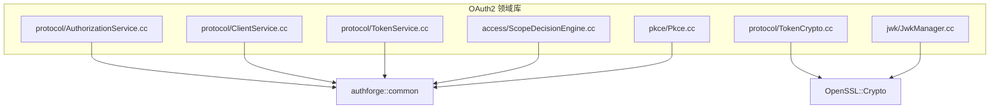
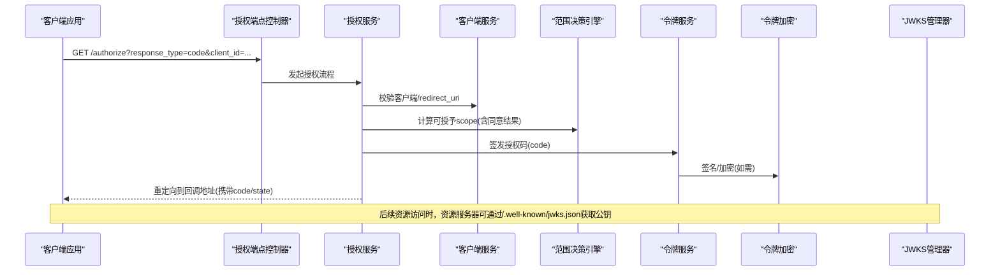
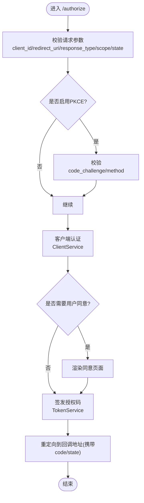
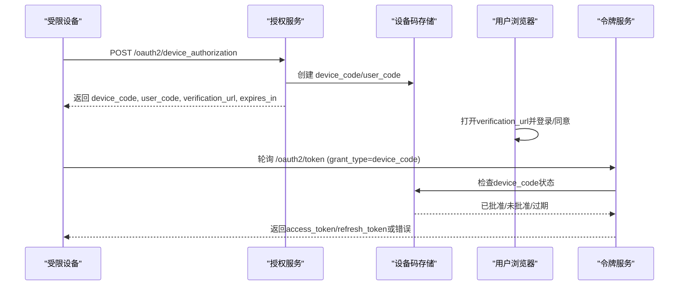
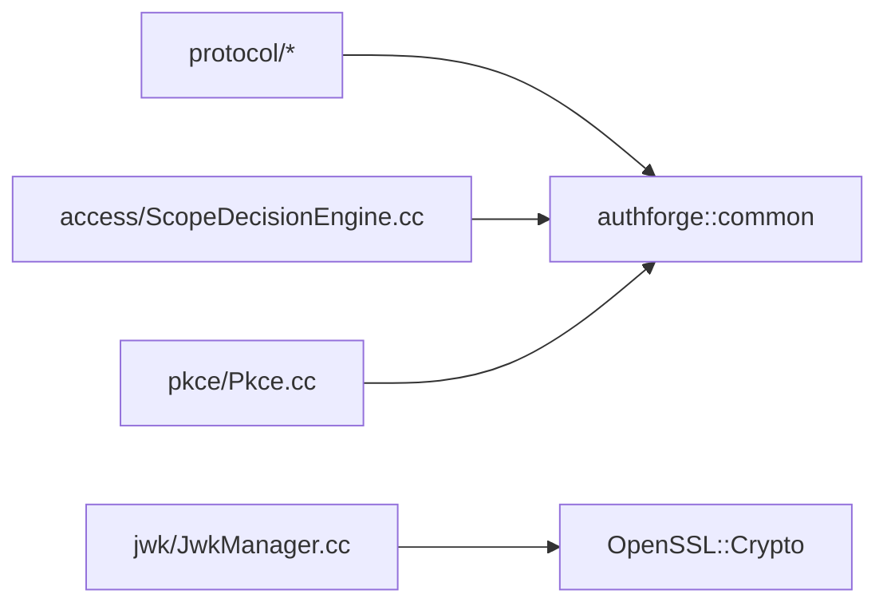

# OAuth2引擎 (authforge::oauth2)

<cite>
**本文引用的文件**
- [CMakeLists.txt](file://libs/oauth2/CMakeLists.txt)
- [AuthorizationService.cc](file://libs/oauth2/src/protocol/AuthorizationService.cc)
- [ClientService.cc](file://libs/oauth2/src/protocol/ClientService.cc)
- [TokenCrypto.cc](file://libs/oauth2/src/protocol/TokenCrypto.cc)
- [TokenService.cc](file://libs/oauth2/src/protocol/TokenService.cc)
- [ScopeDecisionEngine.cc](file://libs/oauth2/src/access/ScopeDecisionEngine.cc)
- [JwkManager.cc](file://libs/oauth2/src/jwk/JwkManager.cc)
- [Pkce.cc](file://libs/oauth2/src/pkce/Pkce.cc)
- [AuthorizationEndpointController.cc](file://libs/drogon/src/controllers/AuthorizationEndpointController.cc)
- [openapi.yaml](file://apps/server/openapi.yaml)
- [api-reference.md](file://docs/backend/api-reference.md)
- [V014__device_codes.sql](file://apps/server/migrations/V014__device_codes.sql)
- [Oauth2DeviceCodes.cc](file://libs/storage-postgres/src/models/Oauth2DeviceCodes.cc)
</cite>

## 目录
1. [简介](#简介)
2. [项目结构](#项目结构)
3. [核心组件](#核心组件)
4. [架构总览](#架构总览)
5. [详细组件分析](#详细组件分析)
6. [依赖关系分析](#依赖关系分析)
7. [性能考量](#性能考量)
8. [故障排查指南](#故障排查指南)
9. [结论](#结论)
10. [附录：API参考与集成示例](#附录api参考与集成示例)

## 简介
本文件为 authforge::oauth2 引擎的权威技术文档，聚焦于 OAuth2/OIDC 协议在库层的纯实现（无 Drogon 依赖），涵盖授权码流程、客户端凭证模式、刷新令牌、设备授权等完整流程；深入说明令牌管理、客户端认证、范围验证、同意页面处理；并介绍 JWKS 支持、JWT 生成与校验、PKCE 扩展等高级特性。文末提供完整的 API 参考、集成示例与故障排查建议，帮助开发者快速集成与排障。

## 项目结构
libs/oauth2 是领域层包，仅包含 OAuth2/OIDC 协议逻辑与值对象/端口，不依赖 Web 框架或身份模块。其构建目标通过 CMake 暴露为 authforge::oauth2，链接 OpenSSL::Crypto 以支持 RS256 JWT 签名与密钥加载。

图表来源
- [CMakeLists.txt:1-92](file://libs/oauth2/CMakeLists.txt#L1-L92)

章节来源
- [CMakeLists.txt:1-92](file://libs/oauth2/CMakeLists.txt#L1-L92)

## 核心组件
- 授权服务 AuthorizationService：编排授权端点流程（授权码、同意页、重定向）。
- 客户端服务 ClientService：客户端注册信息读取、认证策略选择与校验。
- 令牌服务 TokenService：签发 Access/Refresh Token、刷新令牌流转、撤销与轮转。
- 令牌加密 TokenCrypto：JWT 签名/验签、密钥管理与算法协商。
- 范围决策 ScopeDecisionEngine：基于客户端配置与用户同意进行 scope 决策。
- JWKS 管理 JwkManager：公钥集合加载、缓存与分发，供 OIDC 发现与验签使用。
- PKCE Pkce：code_challenge/code_verifier 计算与校验。

章节来源
- [AuthorizationService.cc](file://libs/oauth2/src/protocol/AuthorizationService.cc)
- [ClientService.cc](file://libs/oauth2/src/protocol/ClientService.cc)
- [TokenService.cc](file://libs/oauth2/src/protocol/TokenService.cc)
- [TokenCrypto.cc](file://libs/oauth2/src/protocol/TokenCrypto.cc)
- [ScopeDecisionEngine.cc](file://libs/oauth2/src/access/ScopeDecisionEngine.cc)
- [JwkManager.cc](file://libs/oauth2/src/jwk/JwkManager.cc)
- [Pkce.cc](file://libs/oauth2/src/pkce/Pkce.cc)

## 架构总览
OAuth2 引擎采用“协议层 + 存储/外部能力”的分层设计。协议层（libs/oauth2）只关注流程与规则，通过接口/值对象与上层（Drogon 控制器、存储插件）解耦。Web 路由与 OpenAPI 定义位于 apps/server，持久化模型位于 libs/storage-*。

图表来源
- [AuthorizationEndpointController.cc:36-64](file://libs/drogon/src/controllers/AuthorizationEndpointController.cc#L36-L64)
- [AuthorizationService.cc](file://libs/oauth2/src/protocol/AuthorizationService.cc)
- [ClientService.cc](file://libs/oauth2/src/protocol/ClientService.cc)
- [ScopeDecisionEngine.cc](file://libs/oauth2/src/access/ScopeDecisionEngine.cc)
- [TokenService.cc](file://libs/oauth2/src/protocol/TokenService.cc)
- [TokenCrypto.cc](file://libs/oauth2/src/protocol/TokenCrypto.cc)
- [JwkManager.cc](file://libs/oauth2/src/jwk/JwkManager.cc)

## 详细组件分析

### 授权码流程（Authorization Code + PKCE）
- 入口：/authorize（GET），参数包括 client_id、redirect_uri、response_type=code、scope、state 以及可选的 code_challenge/code_challenge_method。
- 客户端认证：由 ClientService 根据客户端类型（public/confidential）执行相应认证策略。
- 范围决策：ScopeDecisionEngine 结合客户端允许范围与用户同意结果，输出最终授予范围。
- 令牌签发：TokenService 生成授权码并返回重定向；若启用 PKCE，需校验 code_verifier。
- 同意页面：当需要用户同意时，流程会跳转到同意视图，记录同意状态后再继续。

图表来源
- [AuthorizationEndpointController.cc:36-64](file://libs/drogon/src/controllers/AuthorizationEndpointController.cc#L36-L64)
- [AuthorizationService.cc](file://libs/oauth2/src/protocol/AuthorizationService.cc)
- [ClientService.cc](file://libs/oauth2/src/protocol/ClientService.cc)
- [ScopeDecisionEngine.cc](file://libs/oauth2/src/access/ScopeDecisionEngine.cc)
- [TokenService.cc](file://libs/oauth2/src/protocol/TokenService.cc)
- [Pkce.cc](file://libs/oauth2/src/pkce/Pkce.cc)

章节来源
- [AuthorizationEndpointController.cc:36-64](file://libs/drogon/src/controllers/AuthorizationEndpointController.cc#L36-L64)
- [AuthorizationService.cc](file://libs/oauth2/src/protocol/AuthorizationService.cc)
- [ClientService.cc](file://libs/oauth2/src/protocol/ClientService.cc)
- [ScopeDecisionEngine.cc](file://libs/oauth2/src/access/ScopeDecisionEngine.cc)
- [TokenService.cc](file://libs/oauth2/src/protocol/TokenService.cc)
- [Pkce.cc](file://libs/oauth2/src/pkce/Pkce.cc)

### 客户端凭证模式（Client Credentials）
- 适用场景：服务端对服务端调用，无需用户上下文。
- 流程要点：
  - 客户端认证：ClientService 校验 client_id/client_secret 或私钥（如 mTLS/JWT）。
  - 范围校验：ScopeDecisionEngine 基于客户端配置决定可授予 scope。
  - 令牌签发：TokenService 签发 Access Token（可选附带 Refresh Token，视策略而定）。
- 安全建议：限制 scope、设置短 TTL、启用审计日志。

章节来源
- [ClientService.cc](file://libs/oauth2/src/protocol/ClientService.cc)
- [ScopeDecisionEngine.cc](file://libs/oauth2/src/access/ScopeDecisionEngine.cc)
- [TokenService.cc](file://libs/oauth2/src/protocol/TokenService.cc)

### 刷新令牌（Refresh Token）
- 功能：使用 refresh_token 换取新的 access_token，支持轮转与家庭（family）管理。
- 关键点：
  - 校验原 refresh_token 有效性、过期时间、绑定客户端。
  - 支持刷新令牌轮转（旧 token 失效）与家族关联（便于批量撤销）。
  - 范围裁剪：新 access_token 的 scope 不得超出原授权范围。
- 存储：Postgres 后端支持持久化；其他后端可能为 pass-through。

章节来源
- [TokenService.cc](file://libs/oauth2/src/protocol/TokenService.cc)
- [api-reference.md:60-112](file://docs/backend/api-reference.md#L60-L112)

### 设备授权流程（Device Authorization Grant）
- 适用场景：输入受限设备（TV、IoT）通过手机/电脑完成授权。
- 流程要点：
  - 客户端向 /oauth2/device_authorization 请求 device_code/user_code。
  - 用户通过 user_code 在浏览器完成登录与同意。
  - 客户端轮询 /oauth2/token 使用 grant_type=device_code 换取令牌。
  - 支持 interval/polling 与过期控制。
- 数据模型：oauth2_device_codes 表存储 device_code_hash、user_code、client_id、scope、status、expires_at 等。

图表来源
- [openapi.yaml:1345-1392](file://apps/server/openapi.yaml#L1345-L1392)
- [V014__device_codes.sql](file://apps/server/migrations/V014__device_codes.sql)
- [Oauth2DeviceCodes.cc:1-32](file://libs/storage-postgres/src/models/Oauth2DeviceCodes.cc#L1-L32)
- [AuthorizationService.cc](file://libs/oauth2/src/protocol/AuthorizationService.cc)
- [TokenService.cc](file://libs/oauth2/src/protocol/TokenService.cc)

章节来源
- [openapi.yaml:1345-1392](file://apps/server/openapi.yaml#L1345-L1392)
- [V014__device_codes.sql](file://apps/server/migrations/V014__device_codes.sql)
- [Oauth2DeviceCodes.cc:1-32](file://libs/storage-postgres/src/models/Oauth2DeviceCodes.cc#L1-L32)
- [AuthorizationService.cc](file://libs/oauth2/src/protocol/AuthorizationService.cc)
- [TokenService.cc](file://libs/oauth2/src/protocol/TokenService.cc)

### 令牌管理与JWT（含JWKS）
- JWT 签发：TokenCrypto 负责签名与加密，支持 RS256 等算法；JwkManager 管理公钥集合，供 /.well-known/jwks.json 暴露。
- 令牌类型：Access Token（JWT）、Refresh Token（可持久化）、ID Token（OIDC）。
- 校验流程：资源服务器通过 JWKS 获取公钥，校验 JWT 签名与声明（iss、aud、exp、scope 等）。
- 安全建议：最小 scope、短 TTL、启用旋转与吊销机制。

章节来源
- [TokenCrypto.cc](file://libs/oauth2/src/protocol/TokenCrypto.cc)
- [JwkManager.cc](file://libs/oauth2/src/jwk/JwkManager.cc)
- [TokenService.cc](file://libs/oauth2/src/protocol/TokenService.cc)

### 范围验证与同意页面
- 范围决策：ScopeDecisionEngine 依据客户端配置、用户历史同意与当前请求 scope，计算最终授予范围。
- 同意页面：当 scope 变更或首次授权时，展示同意视图，记录用户同意结果，确保最小权限原则。
- 审计：建议记录 scope 决策与同意事件，便于合规与回溯。

章节来源
- [ScopeDecisionEngine.cc](file://libs/oauth2/src/access/ScopeDecisionEngine.cc)
- [AuthorizationService.cc](file://libs/oauth2/src/protocol/AuthorizationService.cc)

### PKCE 扩展
- 计算：Pkce 模块提供 code_challenge 与 code_verifier 的计算方法（S256/plain）。
- 校验：在令牌交换阶段校验 code_verifier 与原始 challenge 的一致性，防止授权码泄露攻击。
- 最佳实践：所有公共客户端必须启用 PKCE。

章节来源
- [Pkce.cc](file://libs/oauth2/src/pkce/Pkce.cc)
- [AuthorizationService.cc](file://libs/oauth2/src/protocol/AuthorizationService.cc)

## 依赖关系分析
- 内部依赖：
  - protocol/* 依赖 authforge::common（值对象/端口）。
  - jwk/JwkManager 依赖 OpenSSL::Crypto（RS256 签名/密钥加载）。
  - access/ScopeDecisionEngine 依赖 common 中的范围与同意模型。
- 外部依赖：
  - OpenSSL::Crypto：用于 JWT 签名与 RSA 操作。
  - 存储层（Postgres/Redis/Memory）：通过上层存储插件接入，不在 oauth2 库内直接耦合。

图表来源
- [CMakeLists.txt:1-92](file://libs/oauth2/CMakeLists.txt#L1-L92)

章节来源
- [CMakeLists.txt:1-92](file://libs/oauth2/CMakeLists.txt#L1-L92)

## 性能考量
- 令牌签发与校验：
  - JWT 签名/验签应缓存公钥与密钥句柄，避免频繁 IO。
  - 合理设置 access_token TTL，减少刷新频率。
- 范围决策：
  - 将客户端允许 scope 与用户同意结果缓存，降低重复计算。
- 设备授权轮询：
  - 使用指数退避策略，避免高频轮询造成压力。
- 并发与一致性：
  - 刷新令牌轮转与撤销需保证原子性，避免竞态条件。
- 存储层：
  - 热点表（如设备码、刷新令牌族）建立合适索引，提升查询性能。

[本节为通用指导，不直接分析具体文件]

## 故障排查指南
- 授权码无效/过期：
  - 检查 code 有效期与一次性使用策略；确认回调地址一致。
- 客户端认证失败：
  - 核对 client_id、client_secret 或证书；确认 redirect_uri 白名单。
- 范围不一致：
  - 检查 ScopeDecisionEngine 的客户端配置与用户同意记录；确认请求 scope 未被拒绝。
- 刷新令牌失败：
  - 检查 refresh_token 是否被轮换/撤销；确认绑定客户端与 scope 未越权。
- 设备授权超时：
  - 检查 device_code/user_code 是否过期；调整 polling interval；确认用户已完成同意。
- JWKS 不可用：
  - 检查 JwkManager 初始化与密钥加载；确认 /.well-known/jwks.json 可访问。

章节来源
- [AuthorizationService.cc](file://libs/oauth2/src/protocol/AuthorizationService.cc)
- [ClientService.cc](file://libs/oauth2/src/protocol/ClientService.cc)
- [ScopeDecisionEngine.cc](file://libs/oauth2/src/access/ScopeDecisionEngine.cc)
- [TokenService.cc](file://libs/oauth2/src/protocol/TokenService.cc)
- [JwkManager.cc](file://libs/oauth2/src/jwk/JwkManager.cc)

## 结论
authforge::oauth2 提供了符合 OAuth2/OIDC 规范的纯协议实现，覆盖授权码、客户端凭证、刷新令牌与设备授权等关键流程，并通过 PKCE、JWKS、JWT 等特性增强安全性与互操作性。其分层设计与最小依赖使得在不同部署环境中易于集成与扩展。建议在生产环境启用 PKCE、严格范围控制、合理配置 TTL 与刷新策略，并完善审计与监控。

[本节为总结，不直接分析具体文件]

## 附录：API参考与集成示例

### 授权端点（/authorize）
- 方法：GET
- 必需参数：
  - response_type：固定为 code
  - client_id：客户端标识
  - redirect_uri：回调地址（需与注册一致）
- 可选参数：
  - scope：请求范围
  - state：防 CSRF 状态值
  - code_challenge/code_challenge_method：PKCE 扩展
- 响应：
  - 成功：重定向至 redirect_uri，携带 code 与 state
  - 失败：重定向携带 error/error_description

章节来源
- [AuthorizationEndpointController.cc:36-64](file://libs/drogon/src/controllers/AuthorizationEndpointController.cc#L36-L64)

### 令牌端点（/oauth2/token）
- 方法：POST
- Content-Type：application/x-www-form-urlencoded
- 常见 grant_type：
  - authorization_code：使用授权码换取令牌
  - client_credentials：客户端凭证模式
  - refresh_token：刷新令牌
  - device_code：设备授权轮询
- 成功响应字段：
  - access_token、token_type、expires_in、scope
  - refresh_token（视策略）
- 失败响应：
  - error、error_description（如 invalid_grant、invalid_client）

章节来源
- [api-reference.md:60-112](file://docs/backend/api-reference.md#L60-L112)

### 设备授权端点（/oauth2/device_authorization）
- 方法：POST
- 响应：
  - device_code、user_code、verification_url、expires_in、interval
- 后续轮询：
  - 使用 grant_type=device_code 在 /oauth2/token 换取令牌

章节来源
- [openapi.yaml:1345-1392](file://apps/server/openapi.yaml#L1345-L1392)

### 集成示例（步骤摘要）
- 授权码+PKCE：
  - 客户端生成 code_verifier 与 code_challenge
  - 跳转 /authorize 获取 code
  - 在回调中携带 code_verifier 调用 /oauth2/token 换取令牌
- 客户端凭证：
  - 直接使用 client_id/client_secret 调用 /oauth2/token（grant_type=client_credentials）
- 刷新令牌：
  - 使用 refresh_token 调用 /oauth2/token（grant_type=refresh_token）
- 设备授权：
  - 调用 /oauth2/device_authorization 获取 device_code/user_code
  - 用户在浏览器完成同意
  - 客户端轮询 /oauth2/token 换取令牌

[本节为集成指引，不直接分析具体文件]