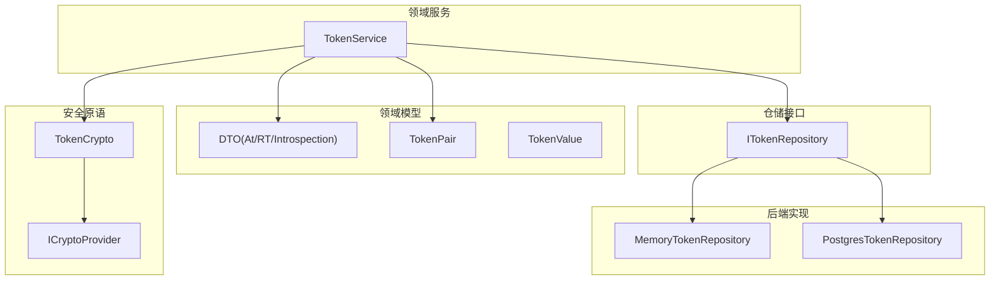
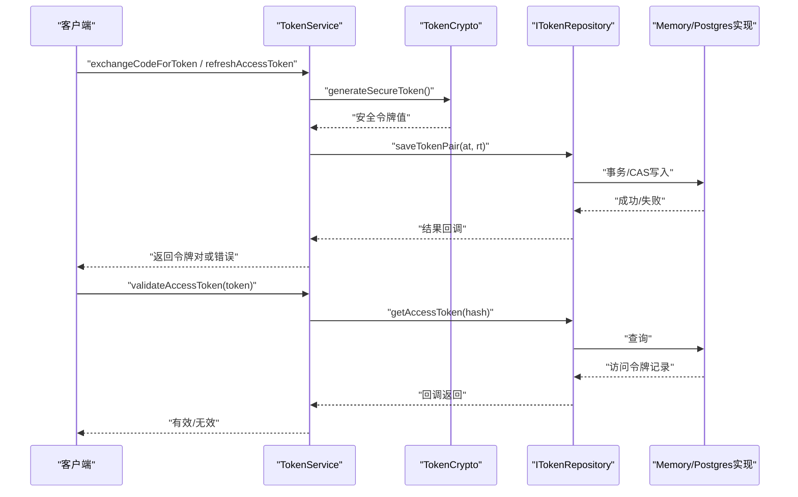
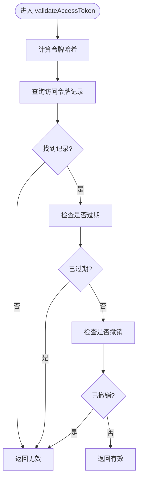
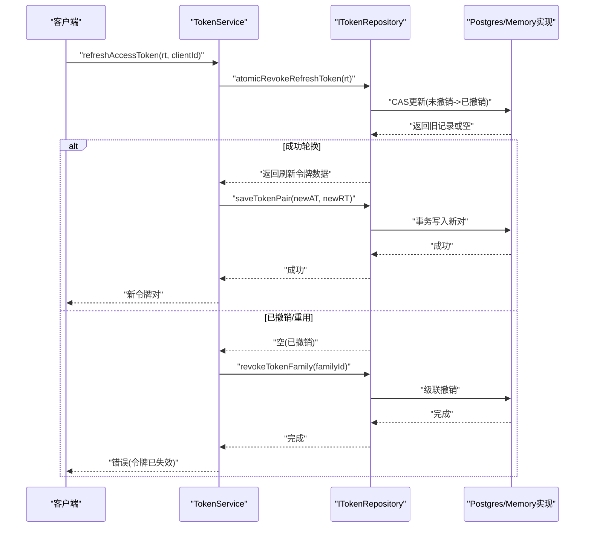
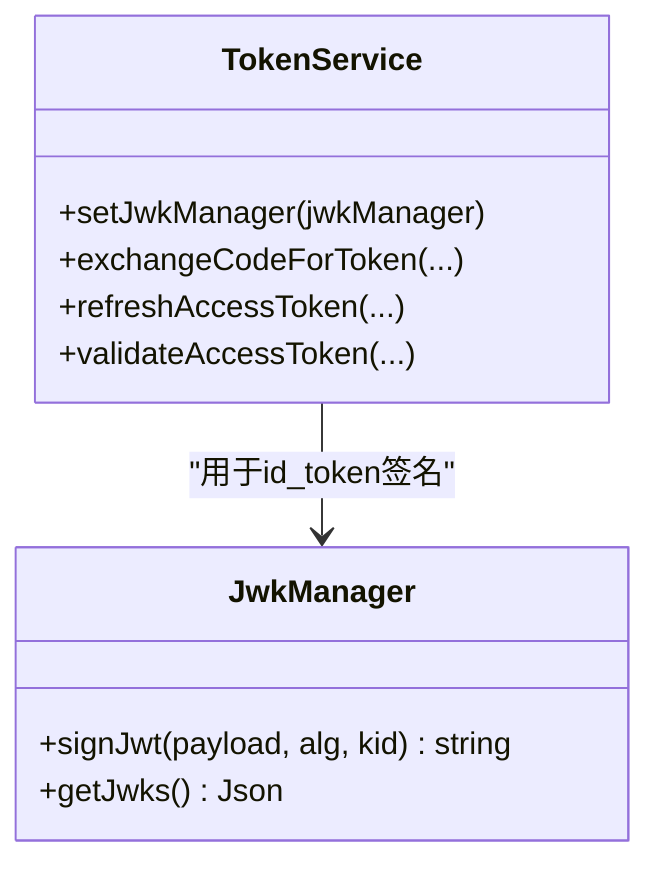
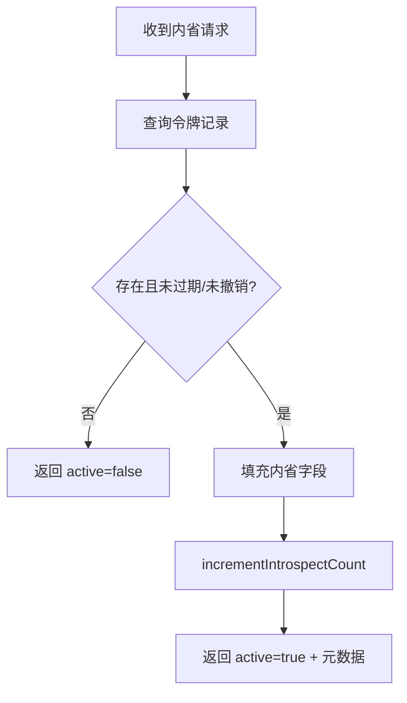
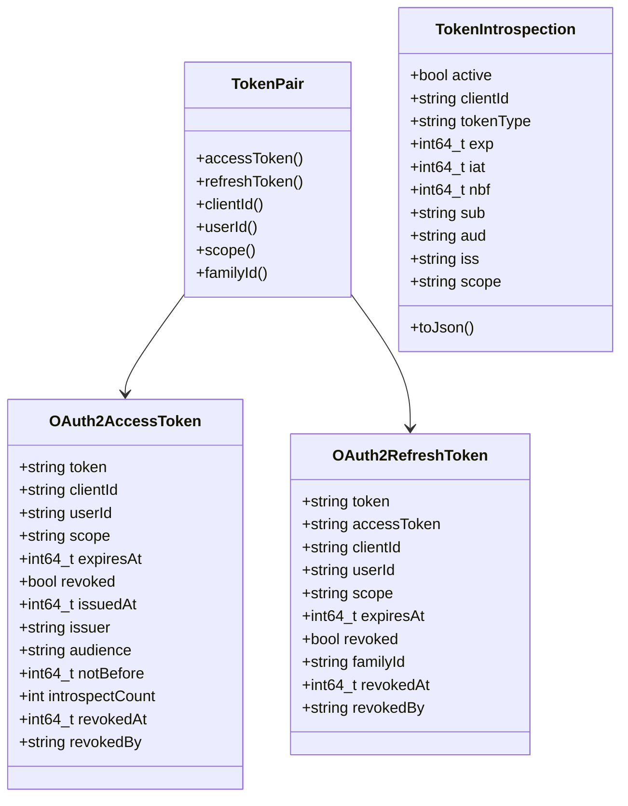
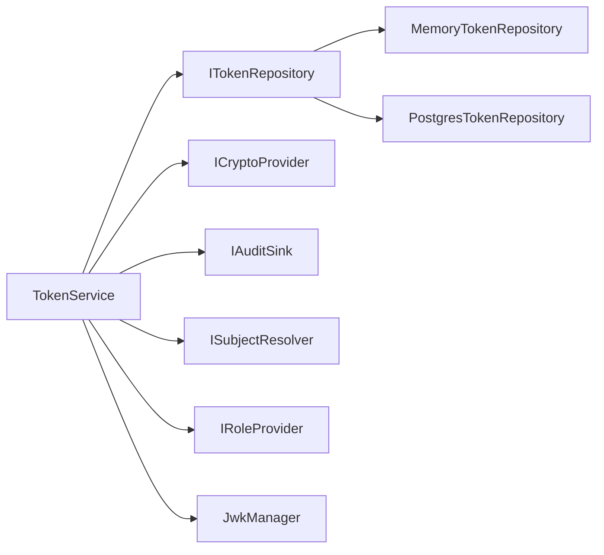

# 令牌管理

<cite>
**本文引用的文件**
- [TokenService.h](file://libs/oauth2/include/authforge/oauth2/protocol/TokenService.h)
- [TokenCrypto.h](file://libs/oauth2/include/authforge/oauth2/protocol/TokenCrypto.h)
- [Dto.h](file://libs/oauth2/include/authforge/oauth2/model/Dto.h)
- [TokenPair.h](file://libs/oauth2/include/authforge/oauth2/model/TokenPair.h)
- [ITokenRepository.h](file://libs/oauth2/include/authforge/oauth2/repository/ITokenRepository.h)
- [PostgresTokenRepository.h](file://libs/storage-postgres/include/authforge/storage/postgres/PostgresTokenRepository.h)
- [MemoryTokenRepository.h](file://libs/storage-memory/include/authforge/storage/memory/MemoryTokenRepository.h)
- [ICryptoProvider.h](file://libs/common/include/authforge/common/ports/ICryptoProvider.h)
- [TokenValue.h](file://libs/common/include/authforge/common/model/TokenValue.h)
</cite>

## 目录
1. [简介](#简介)
2. [项目结构](#项目结构)
3. [核心组件](#核心组件)
4. [架构总览](#架构总览)
5. [详细组件分析](#详细组件分析)
6. [依赖关系分析](#依赖关系分析)
7. [性能考虑](#性能考虑)
8. [故障排查指南](#故障排查指南)
9. [结论](#结论)
10. [附录](#附录)

## 简介
本文件面向OAuth2令牌管理系统，聚焦访问令牌（AccessToken）与刷新令牌（RefreshToken）的生成、存储、验证与撤销机制；说明JWT构建与校验流程（签名算法、载荷与安全考量）；解释令牌内省（RFC 7662）与撤销（RFC 7009）的实现；并提供配置选项、性能优化建议与故障排查指南。文档以代码仓库中的领域层与服务接口为依据，确保内容可追溯至具体实现。

## 项目结构
令牌管理相关能力由“领域服务 + 领域模型 + 仓储接口 + 后端实现”构成：
- 领域服务：TokenService 负责授权码交换、令牌签发、刷新、验证、内省与撤销等业务流程编排。
- 领域模型：DTO（OAuth2AccessToken/OAuth2RefreshToken/TokenIntrospection）、TokenPair聚合、TokenValue值对象。
- 仓储接口：ITokenRepository定义令牌持久化与生命周期操作契约。
- 后端实现：MemoryTokenRepository（内存）、PostgresTokenRepository（PostgreSQL）。
- 安全原语：TokenCrypto提供安全随机令牌生成与在库哈希；ICryptoProvider为底层加密抽象。

图表来源
- [TokenService.h:66-199](file://libs/oauth2/include/authforge/oauth2/protocol/TokenService.h#L66-L199)
- [Dto.h:79-168](file://libs/oauth2/include/authforge/oauth2/model/Dto.h#L79-L168)
- [TokenPair.h:25-91](file://libs/oauth2/include/authforge/oauth2/model/TokenPair.h#L25-L91)
- [ITokenRepository.h:21-174](file://libs/oauth2/include/authforge/oauth2/repository/ITokenRepository.h#L21-L174)
- [PostgresTokenRepository.h:24-92](file://libs/storage-postgres/include/authforge/storage/postgres/PostgresTokenRepository.h#L24-L92)
- [MemoryTokenRepository.h:35-122](file://libs/storage-memory/include/authforge/storage/memory/MemoryTokenRepository.h#L35-L122)
- [TokenCrypto.h:29-46](file://libs/oauth2/include/authforge/oauth2/protocol/TokenCrypto.h#L29-L46)
- [ICryptoProvider.h:77-101](file://libs/common/include/authforge/common/ports/ICryptoProvider.h#L77-L101)

章节来源
- [TokenService.h:66-199](file://libs/oauth2/include/authforge/oauth2/protocol/TokenService.h#L66-L199)
- [ITokenRepository.h:21-174](file://libs/oauth2/include/authforge/oauth2/repository/ITokenRepository.h#L21-L174)

## 核心组件
- TokenService：封装授权码交换、访问令牌签发、刷新令牌轮换、访问令牌验证、令牌内省与撤销等核心流程。支持TTL配置、审计、角色解析与JWK管理器注入。
- TokenPair：将访问令牌与刷新令牌作为一对聚合保存，强制一致性约束（clientId/userId/scope一致，refreshToken.accessToken指向accessToken.token），并暴露familyId用于家庭令牌级联撤销。
- ITokenRepository：定义令牌CRUD、原子撤销、家庭令牌撤销、内省计数、过期清理及能力标志（事务/CAS）。
- Memory/Postgres 实现：分别提供进程内原子性与数据库事务/CAS保证。
- TokenCrypto：基于ICryptoProvider的安全随机令牌生成与上十六进制SHA-256哈希，保障在库精确匹配查找。
- ICryptoProvider：提供HMAC、PBKDF2、RSA签名等密码学原语。
- TokenValue：不可变令牌值对象，避免裸字符串误用。

章节来源
- [TokenService.h:81-199](file://libs/oauth2/include/authforge/oauth2/protocol/TokenService.h#L81-L199)
- [TokenPair.h:30-91](file://libs/oauth2/include/authforge/oauth2/model/TokenPair.h#L30-L91)
- [ITokenRepository.h:36-174](file://libs/oauth2/include/authforge/oauth2/repository/ITokenRepository.h#L36-L174)
- [PostgresTokenRepository.h:46-92](file://libs/storage-postgres/include/authforge/storage/postgres/PostgresTokenRepository.h#L46-L92)
- [MemoryTokenRepository.h:78-122](file://libs/storage-memory/include/authforge/storage/memory/MemoryTokenRepository.h#L78-L122)
- [TokenCrypto.h:29-46](file://libs/oauth2/include/authforge/oauth2/protocol/TokenCrypto.h#L29-L46)
- [ICryptoProvider.h:77-101](file://libs/common/include/authforge/common/ports/ICryptoProvider.h#L77-L101)
- [TokenValue.h:21-54](file://libs/common/include/authforge/common/model/TokenValue.h#L21-L54)

## 架构总览
下图展示令牌签发与验证的关键调用链：控制器或服务调用TokenService，后者通过TokenCrypto生成安全令牌并调用ITokenRepository进行持久化；验证时按相同路径反向查询与校验。

图表来源
- [TokenService.h:117-141](file://libs/oauth2/include/authforge/oauth2/protocol/TokenService.h#L117-L141)
- [TokenCrypto.h:33-46](file://libs/oauth2/include/authforge/oauth2/protocol/TokenCrypto.h#L33-L46)
- [ITokenRepository.h:58-96](file://libs/oauth2/include/authforge/oauth2/repository/ITokenRepository.h#L58-L96)
- [PostgresTokenRepository.h:53-72](file://libs/storage-postgres/include/authforge/storage/postgres/PostgresTokenRepository.h#L53-L72)
- [MemoryTokenRepository.h:81-104](file://libs/storage-memory/include/authforge/storage/memory/MemoryTokenRepository.h#L81-L104)

## 详细组件分析

### 访问令牌的生成、存储与验证
- 生成：使用TokenCrypto::generateSecureToken生成高熵令牌，并通过hashToken对上十六进制SHA-256哈希后落库，便于精确匹配查找。
- 存储：通过ITokenRepository.saveTokenPair原子保存访问令牌与刷新令牌对；Postgres实现使用数据库事务保证原子性；Memory实现通过递归互斥量保证并发可见性原子。
- 验证：validateAccessToken根据传入令牌计算哈希，调用getAccessToken获取记录，检查是否过期、是否被撤销。

图表来源
- [TokenService.h:136-141](file://libs/oauth2/include/authforge/oauth2/protocol/TokenService.h#L136-L141)
- [ITokenRepository.h:58-65](file://libs/oauth2/include/authforge/oauth2/repository/ITokenRepository.h#L58-L65)
- [TokenCrypto.h:33-46](file://libs/oauth2/include/authforge/oauth2/protocol/TokenCrypto.h#L33-L46)

章节来源
- [TokenService.h:117-141](file://libs/oauth2/include/authforge/oauth2/protocol/TokenService.h#L117-L141)
- [ITokenRepository.h:58-65](file://libs/oauth2/include/authforge/oauth2/repository/ITokenRepository.h#L58-L65)
- [TokenCrypto.h:33-46](file://libs/oauth2/include/authforge/oauth2/protocol/TokenCrypto.h#L33-L46)

### 刷新令牌的生命周期管理与轮换
- 刷新流程：refreshAccessToken接收刷新令牌，执行原子撤销（atomicRevokeRefreshToken）以检测重用；若成功，则签发新的访问/刷新令牌对，并建立新的familyId（或沿用家族策略）；若已撤销，则触发级联撤销（revokeTokenFamily）以回收同族所有令牌。
- 家庭令牌：TokenPair暴露familyId，ITokenRepository提供revokeTokenFamily用于级联撤销，确保同一会话/设备上下文下的全部令牌可一次性失效。
- TTL与过期：构造时可配置authCodeTtl、accessTokenTtl、refreshTokenTtl，影响令牌有效期。

图表来源
- [TokenService.h:128-134](file://libs/oauth2/include/authforge/oauth2/protocol/TokenService.h#L128-L134)
- [ITokenRepository.h:112-126](file://libs/oauth2/include/authforge/oauth2/repository/ITokenRepository.h#L112-L126)
- [PostgresTokenRepository.h:71-72](file://libs/storage-postgres/include/authforge/storage/postgres/PostgresTokenRepository.h#L71-L72)
- [MemoryTokenRepository.h:92-94](file://libs/storage-memory/include/authforge/storage/memory/MemoryTokenRepository.h#L92-L94)

章节来源
- [TokenService.h:81-93](file://libs/oauth2/include/authforge/oauth2/protocol/TokenService.h#L81-L93)
- [TokenService.h:128-134](file://libs/oauth2/include/authforge/oauth2/protocol/TokenService.h#L128-L134)
- [ITokenRepository.h:112-126](file://libs/oauth2/include/authforge/oauth2/repository/ITokenRepository.h#L112-L126)
- [TokenPair.h:68-86](file://libs/oauth2/include/authforge/oauth2/model/TokenPair.h#L68-L86)

### JWT令牌的构建与验证
- 构建：TokenService可通过setJwkManager注入JwkManager，用于id_token签名（OpenID Connect场景）。签名算法与密钥由JwkManager管理，TokenService仅负责组装载荷与调用签名。
- 验证：服务端侧通常通过JWKS端点分发公钥，资源服务器拉取并验证JWT签名；TokenService本身不直接处理JWT验证，但通过JwkManager间接参与id_token签发。
- 安全考虑：
  - 使用强签名算法（如RS256）与受信任的JWK集合。
  - 严格校验issuer、audience、exp、nbf、iat等标准字段。
  - 防止重放攻击（nonce）与跨域问题（CORS/安全头）。

图表来源
- [TokenService.h:95-102](file://libs/oauth2/include/authforge/oauth2/protocol/TokenService.h#L95-L102)
- [TokenService.h:117-141](file://libs/oauth2/include/authforge/oauth2/protocol/TokenService.h#L117-L141)

章节来源
- [TokenService.h:95-102](file://libs/oauth2/include/authforge/oauth2/protocol/TokenService.h#L95-L102)

### 令牌内省（RFC 7662）与撤销（RFC 7009）
- 内省：introspectToken根据令牌值查询元数据，返回active、client_id、token_type、exp、iat、nbf、sub、aud、iss、scope等字段；incrementIntrospectCount用于监控统计。
- 撤销：revokeAccessToken标记访问令牌为撤销并记录revokedBy；refresh token撤销通过atomicRevokeRefreshToken与revokeTokenFamily实现。
- 合规性：遵循RFC 7662响应结构与RFC 7009撤销语义。

图表来源
- [ITokenRepository.h:128-136](file://libs/oauth2/include/authforge/oauth2/repository/ITokenRepository.h#L128-L136)
- [Dto.h:120-168](file://libs/oauth2/include/authforge/oauth2/model/Dto.h#L120-L168)
- [TokenService.h:143-148](file://libs/oauth2/include/authforge/oauth2/protocol/TokenService.h#L143-L148)

章节来源
- [TokenService.h:143-148](file://libs/oauth2/include/authforge/oauth2/protocol/TokenService.h#L143-L148)
- [ITokenRepository.h:128-145](file://libs/oauth2/include/authforge/oauth2/repository/ITokenRepository.h#L128-L145)
- [Dto.h:120-168](file://libs/oauth2/include/authforge/oauth2/model/Dto.h#L120-L168)

### 数据模型与聚合
- OAuth2AccessToken/OAuth2RefreshToken：包含标识、主体、范围、过期时间、撤销状态与审计字段。
- TokenIntrospection：内省响应结构，toJson序列化。
- TokenPair：聚合访问/刷新令牌，强制一致性约束，暴露familyId。
- TokenValue：不可变令牌值对象，避免类型混淆。

图表来源
- [Dto.h:79-168](file://libs/oauth2/include/authforge/oauth2/model/Dto.h#L79-L168)
- [TokenPair.h:30-91](file://libs/oauth2/include/authforge/oauth2/model/TokenPair.h#L30-L91)

章节来源
- [Dto.h:79-168](file://libs/oauth2/include/authforge/oauth2/model/Dto.h#L79-L168)
- [TokenPair.h:30-91](file://libs/oauth2/include/authforge/oauth2/model/TokenPair.h#L30-L91)

## 依赖关系分析
- TokenService依赖：
  - 仓储接口：IClientRepository/IGrantRepository/ITokenRepository（用于授权码、授权上下文与令牌生命周期）。
  - 安全原语：ICryptoProvider（通过TokenCrypto使用）。
  - 可选能力：IAuditSink（审计）、ISubjectResolver/IRoleProvider（角色解析）。
  - JWK管理：JwkManager（id_token签名）。
- 仓储实现：
  - PostgresTokenRepository：supportsTransactions()/supportsCas()均为true，使用数据库事务与原子更新。
  - MemoryTokenRepository：通过递归互斥量与同步回调实现进程内原子性与CAS。

图表来源
- [TokenService.h:81-93](file://libs/oauth2/include/authforge/oauth2/protocol/TokenService.h#L81-L93)
- [ITokenRepository.h:36-174](file://libs/oauth2/include/authforge/oauth2/repository/ITokenRepository.h#L36-L174)
- [PostgresTokenRepository.h:84-92](file://libs/storage-postgres/include/authforge/storage/postgres/PostgresTokenRepository.h#L84-L92)
- [MemoryTokenRepository.h:106-114](file://libs/storage-memory/include/authforge/storage/memory/MemoryTokenRepository.h#L106-L114)

章节来源
- [TokenService.h:81-93](file://libs/oauth2/include/authforge/oauth2/protocol/TokenService.h#L81-L93)
- [ITokenRepository.h:36-174](file://libs/oauth2/include/authforge/oauth2/repository/ITokenRepository.h#L36-L174)

## 性能考虑
- 原子写入与CAS：
  - Postgres：使用数据库事务与原子UPDATE...WHERE...RETURNING，避免竞态条件。
  - Memory：递归互斥量+同步回调，保证saveTokenPair期间无中间态可见。
- 令牌哈希查找：统一采用上十六进制SHA-256哈希，减少大小写不一致导致的缓存/索引失效。
- 过期清理：purgeExpired定期清理过期令牌，降低查询开销。
- 内省计数：incrementIntrospectCount用于观测高频令牌的内省压力，辅助容量规划。
- 并发安全：仓储层通过锁/事务/CAS保证并发正确性；TokenService异步链捕获shared_from_this避免悬挂指针。

章节来源
- [PostgresTokenRepository.h:27-45](file://libs/storage-postgres/include/authforge/storage/postgres/PostgresTokenRepository.h#L27-L45)
- [MemoryTokenRepository.h:46-77](file://libs/storage-memory/include/authforge/storage/memory/MemoryTokenRepository.h#L46-L77)
- [ITokenRepository.h:149-154](file://libs/oauth2/include/authforge/oauth2/repository/ITokenRepository.h#L149-L154)
- [TokenCrypto.h:38-46](file://libs/oauth2/include/authforge/oauth2/protocol/TokenCrypto.h#L38-L46)

## 故障排查指南
- 令牌无效：
  - 检查是否过期（expiresAt）与是否被撤销（revoked/revokedAt）。
  - 确认哈希计算一致（TokenCrypto::hashToken必须上十六进制）。
- 刷新令牌重用：
  - 若atomicRevokeRefreshToken返回空，说明已被使用或撤销；应触发revokeTokenFamily级联撤销。
- 内省异常：
  - 确认令牌存在且未过期；核对内省字段（exp/iat/nbf/sub/aud/iss/scope）是否符合预期。
- 并发问题：
  - 确认仓储能力标志：supportsTransactions()/supportsCas()与实际实现一致。
  - 在高并发下优先选择Postgres实现以获得强一致性。
- 审计与追踪：
  - 启用IAuditSink记录关键动作（签发、刷新、撤销、内省），便于定位问题。

章节来源
- [TokenService.h:128-156](file://libs/oauth2/include/authforge/oauth2/protocol/TokenService.h#L128-L156)
- [ITokenRepository.h:112-145](file://libs/oauth2/include/authforge/oauth2/repository/ITokenRepository.h#L112-L145)
- [TokenCrypto.h:38-46](file://libs/oauth2/include/authforge/oauth2/protocol/TokenCrypto.h#L38-L46)

## 结论
该令牌管理系统以清晰的领域分层与仓储抽象实现了OAuth2令牌的全生命周期管理：安全的令牌生成与哈希存储、原子化的令牌对保存与刷新轮换、符合RFC 7662/7002的内省与撤销、以及可扩展的JWT签名支持。通过能力标志与后端实现差异，系统在不同部署环境下均能提供一致的并发与一致性保证。建议在生产环境中结合审计、监控与定期清理策略，确保令牌系统的稳定性与安全性。

## 附录
- 配置选项（来自TokenService构造参数）：
  - authCodeTtl：授权码有效期（秒）
  - accessTokenTtl：访问令牌有效期（秒）
  - refreshTokenTtl：刷新令牌有效期（秒）
  - issuer：发行者标识（用于内省与JWT载荷）
- 集成模式：
  - 控制器/网关调用TokenService完成授权码交换与令牌刷新。
  - 资源服务器通过JWKS获取公钥验证JWT签名。
  - 管理端通过仓储接口或管理API进行令牌内省与撤销。

章节来源
- [TokenService.h:81-93](file://libs/oauth2/include/authforge/oauth2/protocol/TokenService.h#L81-L93)
- [Dto.h:120-168](file://libs/oauth2/include/authforge/oauth2/model/Dto.h#L120-L168)