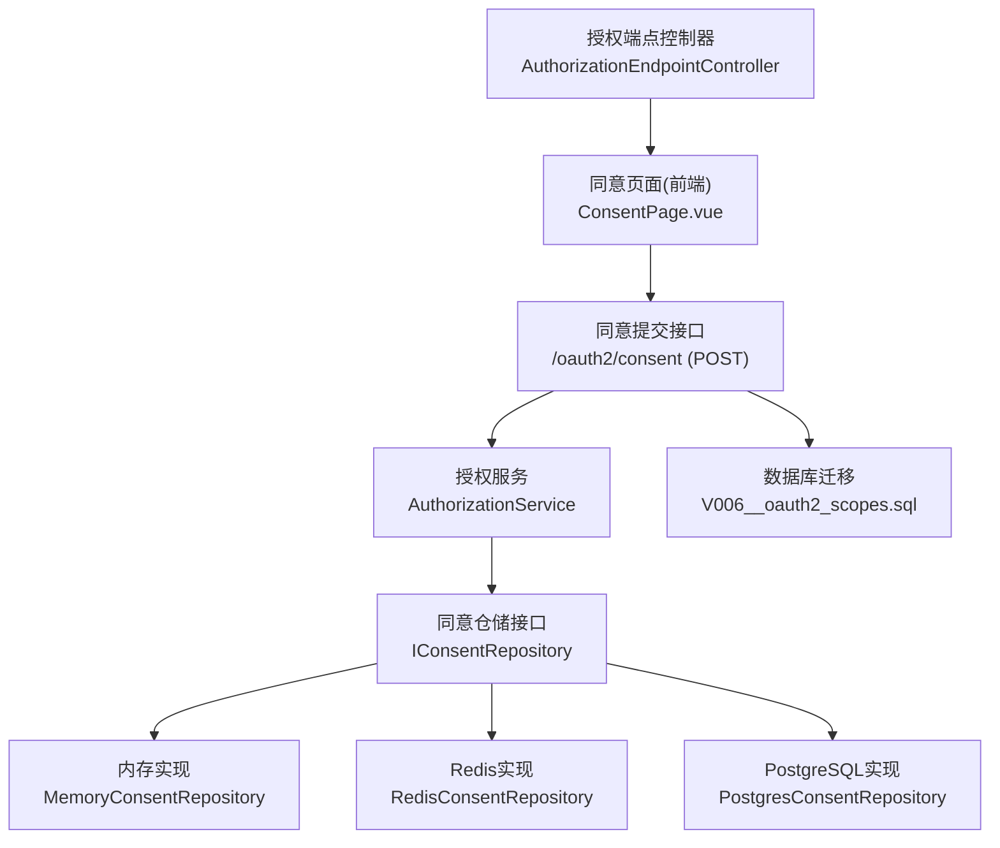
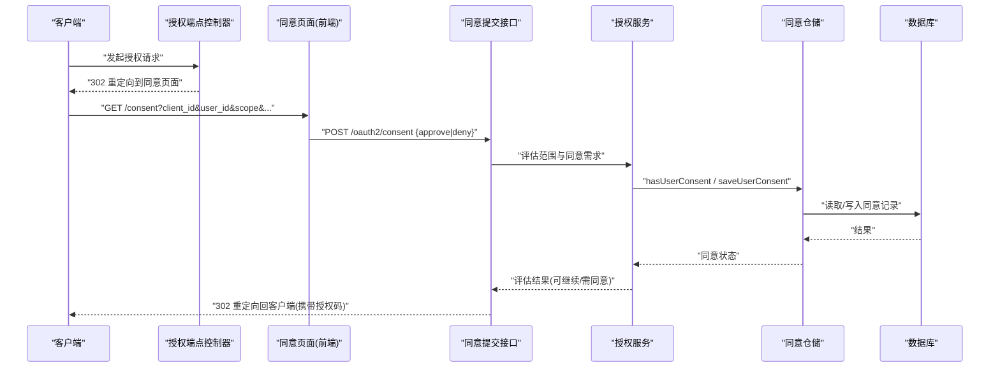
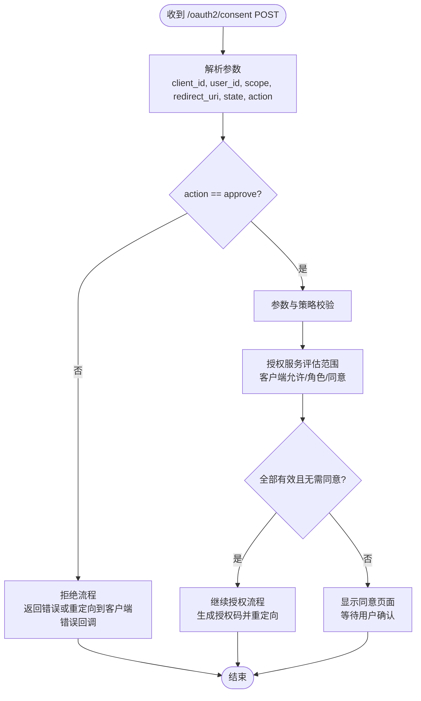
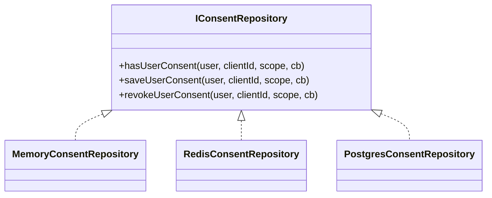
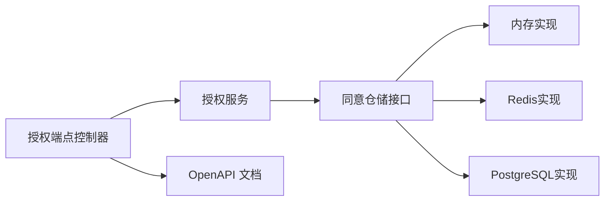

# 同意页面处理

<cite>
**本文引用的文件**
- [AuthorizationEndpointController.cc](file://libs/drogon/src/controllers/AuthorizationEndpointController.cc)
- [SessionController.cc](file://libs/drogon/src/controllers/SessionController.cc)
- [consent.csp](file://apps/server/views/consent.csp)
- [ConsentPage.vue](file://frontends/user/src/pages/oauth/ConsentPage.vue)
- [AuthorizationService.h](file://libs/oauth2/include/authforge/oauth2/protocol/AuthorizationService.h)
- [AuthorizationService.cc](file://libs/oauth2/src/protocol/AuthorizationService.cc)
- [ScopeDecision.h](file://libs/oauth2/include/authforge/oauth2/access/ScopeDecision.h)
- [IConsentRepository.h](file://libs/oauth2/include/authforge/oauth2/repository/IConsentRepository.h)
- [MemoryConsentRepository.h](file://libs/storage-memory/include/authforge/storage/memory/MemoryConsentRepository.h)
- [RedisConsentRepository.h](file://libs/storage-redis/include/authforge/storage/redis/RedisConsentRepository.h)
- [PostgresConsentRepository.h](file://libs/storage-postgres/include/authforge/storage/postgres/PostgresConsentRepository.h)
- [V006__oauth2_scopes.sql](file://apps/server/migrations/V006__oauth2_scopes.sql)
- [config.json](file://apps/server/config/config.json)
- [openapi.yaml](file://apps/server/openapi.yaml)
- [data-persistence.md](file://docs/backend/data-persistence.md)
- [design.md](file://.kiro/specs/authforge-sdk-refactor/design.md)
</cite>

## 目录
1. [简介](#简介)
2. [项目结构](#项目结构)
3. [核心组件](#核心组件)
4. [架构总览](#架构总览)
5. [详细组件分析](#详细组件分析)
6. [依赖关系分析](#依赖关系分析)
7. [性能考虑](#性能考虑)
8. [故障排查指南](#故障排查指南)
9. [结论](#结论)
10. [附录](#附录)

## 简介
本文件系统性说明 OAuth2 同意页面的处理机制，覆盖从授权请求到用户同意、权限范围展示、同意持久化、撤销与生命周期管理、模板系统与自定义能力、配置项与安全建议，以及集成示例与排障要点。该实现将“同意”作为独立聚合（User Consent）进行存储与校验，并通过前端页面与后端控制器协作完成用户交互与后续授权码发放。

## 项目结构
同意流程涉及前后端多模块：
- 授权入口控制器负责在需要同意时重定向到同意页面；
- 前端同意页面负责展示客户端信息、权限范围，并回传用户决策；
- 后端同意提交接口负责保存同意记录、生成授权码并重定向回客户端；
- 仓储层提供内存、Redis、PostgreSQL 三种同意存储实现；
- 数据库迁移定义同意表结构与默认范围；
- OpenAPI 文档描述同意提交接口的参数与响应。

图表来源
- [AuthorizationEndpointController.cc:417-438](file://libs/drogon/src/controllers/AuthorizationEndpointController.cc#L417-L438)
- [ConsentPage.vue:1-106](file://frontends/user/src/pages/oauth/ConsentPage.vue#L1-L106)
- [SessionController.cc:250-274](file://libs/drogon/src/controllers/SessionController.cc#L250-L274)
- [AuthorizationService.h:55-86](file://libs/oauth2/include/authforge/oauth2/protocol/AuthorizationService.h#L55-L86)
- [IConsentRepository.h:1-42](file://libs/oauth2/include/authforge/oauth2/repository/IConsentRepository.h#L1-L42)
- [MemoryConsentRepository.h:30-74](file://libs/storage-memory/include/authforge/storage/memory/MemoryConsentRepository.h#L30-L74)
- [RedisConsentRepository.h:27-65](file://libs/storage-redis/include/authforge/storage/redis/RedisConsentRepository.h#L27-L65)
- [PostgresConsentRepository.h:1-62](file://libs/storage-postgres/include/authforge/storage/postgres/PostgresConsentRepository.h#L1-L62)
- [V006__oauth2_scopes.sql:1-55](file://apps/server/migrations/V006__oauth2_scopes.sql#L1-L55)

章节来源
- [AuthorizationEndpointController.cc:417-438](file://libs/drogon/src/controllers/AuthorizationEndpointController.cc#L417-L438)
- [ConsentPage.vue:1-106](file://frontends/user/src/pages/oauth/ConsentPage.vue#L1-L106)
- [SessionController.cc:250-274](file://libs/drogon/src/controllers/SessionController.cc#L250-L274)
- [V006__oauth2_scopes.sql:1-55](file://apps/server/migrations/V006__oauth2_scopes.sql#L1-L55)

## 核心组件
- 授权端点控制器：当授权请求需要用户同意时，构造包含 client_id、user_id、scope、redirect_uri、state 等参数的同意页面 URL，并支持通过配置覆盖同意页地址。
- 前端同意页面：解析查询参数，展示客户端与权限范围，支持 PKCE/nonce 透传，提交 approve/deny 决策至 /oauth2/consent。
- 同意提交接口：接收用户决策，校验必要参数，调用授权服务评估范围与同意状态，保存同意记录，生成授权码并重定向回客户端。
- 授权服务：按“客户端允许列表 → 角色要求 → 用户同意”的层级顺序评估每个 scope，返回汇总结果以决定是否需要同意或继续授权。
- 同意仓储：提供 has/save/revoke 操作，支持内存、Redis、PostgreSQL 多种后端。
- 数据模型与迁移：定义 scopes、client_scopes、user_consents、subject_mappings 等表及索引，并提供默认 scope 数据。

章节来源
- [AuthorizationService.h:55-86](file://libs/oauth2/include/authforge/oauth2/protocol/AuthorizationService.h#L55-L86)
- [AuthorizationService.cc:82-165](file://libs/oauth2/src/protocol/AuthorizationService.cc#L82-L165)
- [ScopeDecision.h:24-63](file://libs/oauth2/include/authforge/oauth2/access/ScopeDecision.h#L24-L63)
- [IConsentRepository.h:1-42](file://libs/oauth2/include/authforge/oauth2/repository/IConsentRepository.h#L1-L42)
- [V006__oauth2_scopes.sql:1-55](file://apps/server/migrations/V006__oauth2_scopes.sql#L1-L55)

## 架构总览
下图展示了从授权请求到同意提交再到授权码发放的整体时序。

图表来源
- [AuthorizationEndpointController.cc:417-438](file://libs/drogon/src/controllers/AuthorizationEndpointController.cc#L417-L438)
- [ConsentPage.vue:33-63](file://frontends/user/src/pages/oauth/ConsentPage.vue#L33-L63)
- [SessionController.cc:250-274](file://libs/drogon/src/controllers/SessionController.cc#L250-L274)
- [AuthorizationService.cc:82-165](file://libs/oauth2/src/protocol/AuthorizationService.cc#L82-L165)
- [IConsentRepository.h:1-42](file://libs/oauth2/include/authforge/oauth2/repository/IConsentRepository.h#L1-L42)

## 详细组件分析

### 同意请求解析与展示
- 授权端点控制器在需要同意时，将 client_id、user_id、scope、redirect_uri、state 等参数编码后重定向到同意页面；支持通过配置项 oauth2.consent_url 覆盖默认路径。
- 前端同意页面解析查询参数，渲染客户端信息与权限范围列表，并将 code_challenge、code_challenge_method、nonce 等安全参数透传给后端提交接口，确保 PKCE/OIDC 流程正确闭环。

章节来源
- [AuthorizationEndpointController.cc:417-438](file://libs/drogon/src/controllers/AuthorizationEndpointController.cc#L417-L438)
- [ConsentPage.vue:11-31](file://frontends/user/src/pages/oauth/ConsentPage.vue#L11-L31)

### 用户确认处理流程
- 用户点击“授权”或“拒绝”，前端向 /oauth2/consent 提交 POST 请求，携带 client_id、user_id、scope、redirect_uri、state 以及 action=approve|deny。
- 后端接口根据 action 分支：
  - approve：校验必要参数，调用授权服务评估范围，若通过则保存同意记录并生成授权码，最终 302 重定向回客户端回调地址；
  - deny：直接返回错误响应或重定向到客户端的错误回调（具体由上层控制器实现）。
- 授权服务按“客户端允许列表 → 角色要求 → 用户同意”的顺序评估每个 scope，返回汇总结果，指示是否继续授权或需要用户同意。

图表来源
- [SessionController.cc:250-274](file://libs/drogon/src/controllers/SessionController.cc#L250-L274)
- [AuthorizationService.cc:82-165](file://libs/oauth2/src/protocol/AuthorizationService.cc#L82-L165)
- [ScopeDecision.h:24-63](file://libs/oauth2/include/authforge/oauth2/access/ScopeDecision.h#L24-L63)

章节来源
- [SessionController.cc:250-274](file://libs/drogon/src/controllers/SessionController.cc#L250-L274)
- [AuthorizationService.cc:82-165](file://libs/oauth2/src/protocol/AuthorizationService.cc#L82-L165)
- [ScopeDecision.h:24-63](file://libs/oauth2/include/authforge/oauth2/access/ScopeDecision.h#L24-L63)

### 同意持久化机制
- 同意记录以“用户 + 客户端 + 范围”为键进行存储，支持以下操作：
  - hasUserConsent：检查是否已授予某范围；
  - saveUserConsent：保存用户同意；
  - revokeUserConsent：撤销同意。
- 存储后端：
  - 内存实现：进程内哈希表，适合测试与开发；
  - Redis 实现：分布式缓存，适合高并发场景；
  - PostgreSQL 实现：持久化存储，生产环境推荐。
- 数据库表结构：
  - oauth2_user_consents：记录用户同意，含 granted_at 时间戳；
  - oauth2_scopes：定义范围名称、描述、是否默认、是否需要管理员角色等；
  - oauth2_client_scopes：客户端允许的范围白名单；
  - oauth2_subject_mappings：外部身份主体映射到内部用户 ID。

图表来源
- [IConsentRepository.h:1-42](file://libs/oauth2/include/authforge/oauth2/repository/IConsentRepository.h#L1-L42)
- [MemoryConsentRepository.h:30-74](file://libs/storage-memory/include/authforge/storage/memory/MemoryConsentRepository.h#L30-L74)
- [RedisConsentRepository.h:27-65](file://libs/storage-redis/include/authforge/storage/redis/RedisConsentRepository.h#L27-L65)
- [PostgresConsentRepository.h:1-62](file://libs/storage-postgres/include/authforge/storage/postgres/PostgresConsentRepository.h#L1-L62)

章节来源
- [IConsentRepository.h:1-42](file://libs/oauth2/include/authforge/oauth2/repository/IConsentRepository.h#L1-L42)
- [MemoryConsentRepository.h:30-74](file://libs/storage-memory/include/authforge/storage/memory/MemoryConsentRepository.h#L30-L74)
- [RedisConsentRepository.h:27-65](file://libs/storage-redis/include/authforge/storage/redis/RedisConsentRepository.h#L27-L65)
- [PostgresConsentRepository.h:1-62](file://libs/storage-postgres/include/authforge/storage/postgres/PostgresConsentRepository.h#L1-L62)
- [V006__oauth2_scopes.sql:1-55](file://apps/server/migrations/V006__oauth2_scopes.sql#L1-L55)

### 同意页面的模板系统与自定义能力
- 服务端视图模板 consent.csp 提供基础同意页面样式与表单，但当前实际同意流程重定向到前端 /consent，因此该模板为历史遗留文件，不影响主流程。
- 前端同意页面 ConsentPage.vue 使用 Vue 组件与 Tailwind 风格类名，具备响应式布局与清晰的交互提示。
- 多语言支持：可通过扩展前端文案字典或后端元数据（如 metadata.ui_locales_supported）实现多语言界面。
- 自定义能力：
  - 通过配置项 oauth2.consent_url 指定同意页面地址，便于替换为自有页面；
  - 前端可自定义范围描述、UI 文案与交互逻辑；
  - 服务端可结合 OpenAPI 与中间件扩展同意流程行为。

章节来源
- [consent.csp:1-130](file://apps/server/views/consent.csp#L1-L130)
- [ConsentPage.vue:1-106](file://frontends/user/src/pages/oauth/ConsentPage.vue#L1-L106)
- [AuthorizationEndpointController.cc:417-438](file://libs/drogon/src/controllers/AuthorizationEndpointController.cc#L417-L438)

### 同意数据的生命周期管理
- 同意过期：当前同意表未内置过期字段，建议在业务层结合 token TTL 与刷新策略进行管理；如需强制过期，可在撤销同意后重新走同意流程。
- 批量清理：系统存在清理服务用于授权码与令牌过期清理，可按需扩展同意记录的清理策略（例如基于 granted_at 与策略阈值）。
- 数据迁移：通过 V006__oauth2_scopes.sql 初始化 scopes、client_scopes、user_consents、subject_mappings 表与默认数据，支持幂等插入与索引优化。

章节来源
- [data-persistence.md:174-189](file://docs/backend/data-persistence.md#L174-L189)
- [V006__oauth2_scopes.sql:1-55](file://apps/server/migrations/V006__oauth2_scopes.sql#L1-L55)

### 配置选项与安全考虑
- 配置项：
  - oauth2.consent_url：覆盖同意页面地址；
  - clients.vue-client.redirect_uri：客户端回调地址白名单；
  - cleanup_interval_seconds：清理任务间隔；
  - custom_config.cors.allow_origins：跨域白名单；
  - custom_config.frontend.url：前端地址。
- 安全建议：
  - 严格校验 redirect_uri 与 state，防止开放重定向与 CSRF；
  - 对公共客户端强制 PKCE，并在同意页面透传 code_challenge/code_challenge_method；
  - 限制 CORS 与允许的回调域名；
  - 在生产环境关闭详细验证错误消息，避免泄露敏感信息；
  - 使用 HTTPS 传输，启用安全头与压缩。

章节来源
- [config.json:133-170](file://apps/server/config/config.json#L133-L170)
- [config.json:172-214](file://apps/server/config/config.json#L172-L214)
- [AuthorizationEndpointController.cc:417-438](file://libs/drogon/src/controllers/AuthorizationEndpointController.cc#L417-L438)
- [ConsentPage.vue:15-20](file://frontends/user/src/pages/oauth/ConsentPage.vue#L15-L20)

### 集成示例
- 授权流程集成步骤：
  1) 客户端发起授权请求，携带 client_id、redirect_uri、scope、state、PKCE 参数；
  2) 服务端判断是否需要同意，重定向到同意页面；
  3) 用户在前端同意页面确认授权；
  4) 后端保存同意记录并生成授权码，302 重定向回客户端回调地址；
  5) 客户端用授权码换取访问令牌。
- 前端集成要点：
  - 解析路由参数并展示范围；
  - 透传 PKCE/nonce 到后端；
  - 处理 302 重定向与错误响应。

章节来源
- [AuthorizationEndpointController.cc:417-438](file://libs/drogon/src/controllers/AuthorizationEndpointController.cc#L417-L438)
- [ConsentPage.vue:33-63](file://frontends/user/src/pages/oauth/ConsentPage.vue#L33-L63)
- [openapi.yaml:1275-1303](file://apps/server/openapi.yaml#L1275-L1303)

## 依赖关系分析
- 控制器依赖授权服务进行范围评估与同意决策；
- 授权服务依赖同意仓储接口，屏蔽底层存储差异；
- 存储实现分别对接内存、Redis、PostgreSQL；
- 数据库迁移提供统一的数据模型与索引；
- OpenAPI 文档描述同意提交接口的参数与响应，便于前后端联调。

图表来源
- [AuthorizationEndpointController.cc:417-438](file://libs/drogon/src/controllers/AuthorizationEndpointController.cc#L417-L438)
- [AuthorizationService.cc:82-165](file://libs/oauth2/src/protocol/AuthorizationService.cc#L82-L165)
- [IConsentRepository.h:1-42](file://libs/oauth2/include/authforge/oauth2/repository/IConsentRepository.h#L1-L42)
- [openapi.yaml:1275-1303](file://apps/server/openapi.yaml#L1275-L1303)

章节来源
- [AuthorizationService.cc:82-165](file://libs/oauth2/src/protocol/AuthorizationService.cc#L82-L165)
- [IConsentRepository.h:1-42](file://libs/oauth2/include/authforge/oauth2/repository/IConsentRepository.h#L1-L42)
- [openapi.yaml:1275-1303](file://apps/server/openapi.yaml#L1275-L1303)

## 性能考虑
- 同意查询采用异步回调与并行 fan-out 方式，减少串行阻塞；
- 存储层选择：
  - 内存实现适合开发与测试；
  - Redis 实现适合高并发读多写少场景；
  - PostgreSQL 实现适合生产持久化与审计需求；
- 清理任务按配置间隔执行，避免频繁 IO；
- 建议对同意查询建立复合索引（internal_user_id, client_id），提升查找效率。

[本节为通用指导，不直接分析具体文件]

## 故障排查指南
- 常见问题：
  - 同意页面未显示或参数丢失：检查授权端点重定向参数是否正确编码；
  - PKCE 验证失败：确认同意页面透传了 code_challenge/code_challenge_method；
  - 同意记录未保存：检查仓储实现与数据库连接是否正常；
  - 重定向错误：核对 redirect_uri 是否在客户端白名单中；
  - 多语言显示异常：检查前端文案字典与后端元数据配置。
- 定位方法：
  - 查看 OpenAPI 文档中 /oauth2/consent 的参数与响应；
  - 检查日志中的错误码与堆栈；
  - 使用浏览器开发者工具观察网络请求与重定向链；
  - 在数据库中查询 oauth2_user_consents 表确认同意记录。

章节来源
- [openapi.yaml:1275-1303](file://apps/server/openapi.yaml#L1275-L1303)
- [ConsentPage.vue:15-20](file://frontends/user/src/pages/oauth/ConsentPage.vue#L15-L20)
- [V006__oauth2_scopes.sql:1-55](file://apps/server/migrations/V006__oauth2_scopes.sql#L1-L55)

## 结论
本实现将“同意”作为独立聚合进行存储与校验，通过前后端协作完成用户同意流程。授权服务按严格的层级顺序评估范围，确保安全性与合规性。存储层提供多种实现以适应不同部署场景。通过配置项与前端自定义能力，系统具备良好的可扩展性与用户体验优化空间。建议在生产环境中启用 HTTPS、严格校验回调地址、合理配置清理任务与监控指标，保障系统的稳定与安全。

[本节为总结，不直接分析具体文件]

## 附录
- 相关设计备注：
  - consent.csp 为历史遗留文件，当前同意流程重定向到前端 /consent；
  - 清理服务负责授权码与令牌过期清理，可按需扩展同意记录清理策略。

章节来源
- [design.md:239-244](file://.kiro/specs/authforge-sdk-refactor/design.md#L239-L244)
- [data-persistence.md:174-189](file://docs/backend/data-persistence.md#L174-L189)