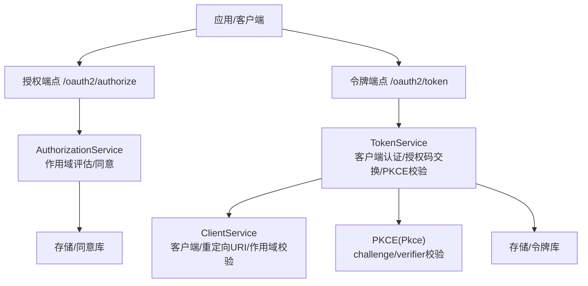
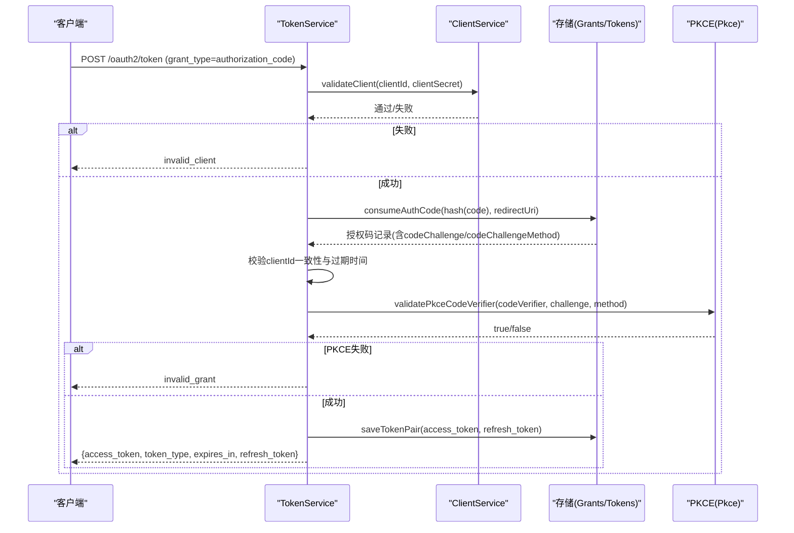
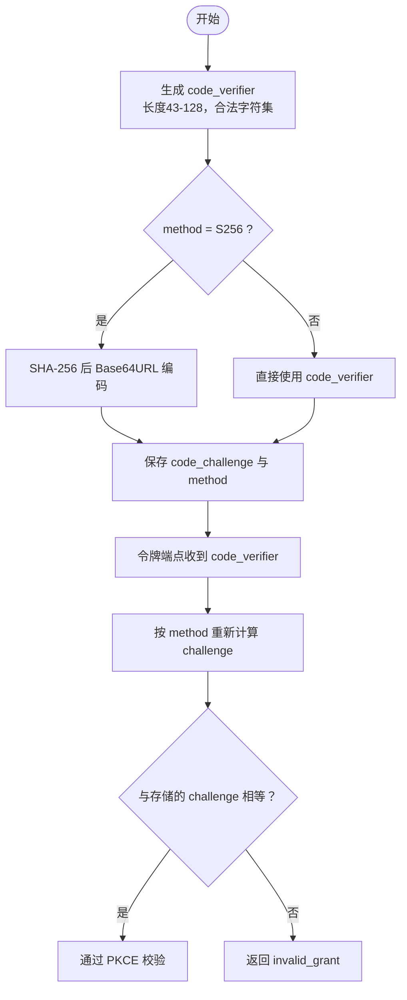
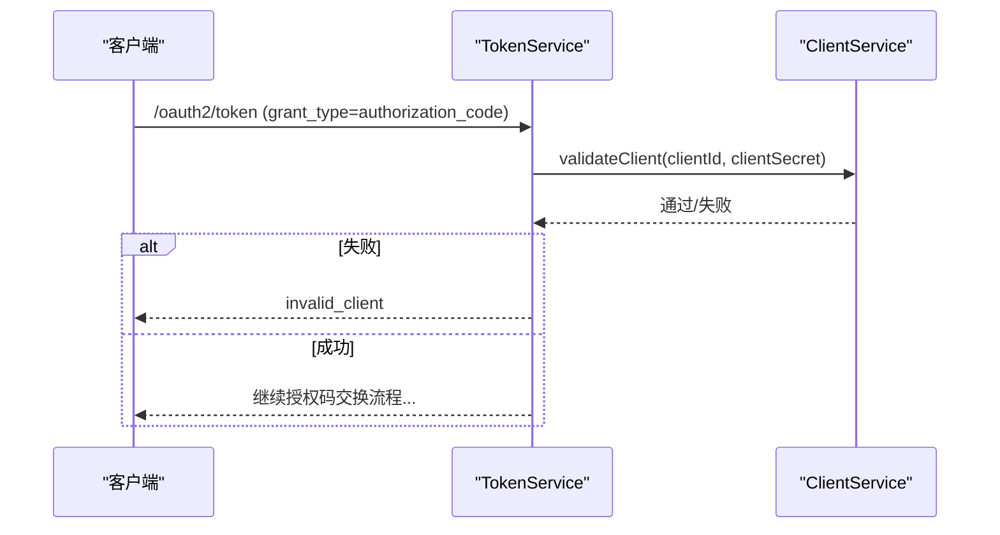
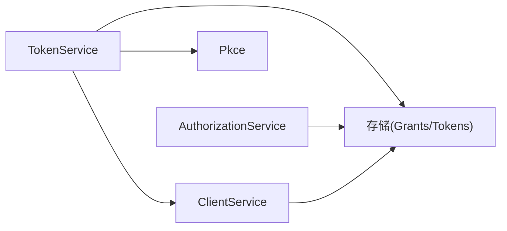

# 客户端认证

<cite>
**本文引用的文件**
- [Pkce.cc](file://libs/oauth2/src/pkce/Pkce.cc)
- [ClientService.cc](file://libs/oauth2/src/protocol/ClientService.cc)
- [AuthorizationService.cc](file://libs/oauth2/src/protocol/AuthorizationService.cc)
- [TokenService.cc](file://libs/oauth2/src/protocol/TokenService.cc)
- [openapi.json](file://apps/server/docs/api/openapi.json)
</cite>

## 目录
1. [简介](#简介)
2. [项目结构](#项目结构)
3. [核心组件](#核心组件)
4. [架构总览](#架构总览)
5. [详细组件分析](#详细组件分析)
6. [依赖关系分析](#依赖关系分析)
7. [性能考虑](#性能考虑)
8. [故障排查指南](#故障排查指南)
9. [结论](#结论)
10. [附录：配置与最佳实践](#附录配置与最佳实践)

## 简介
本文件聚焦 OAuth2 客户端认证机制，覆盖以下主题：
- 多种客户端认证方法：客户端密钥（client_secret）、客户端证书（mTLS）、私钥 JWT（private_key_jwt）
- PKCE（Proof Key for Code Exchange）扩展：code_verifier 生成、challenge 计算与验证流程
- 动态客户端注册（Dynamic Client Registration）：客户端信息校验、权限范围设置
- 安全考量：密钥管理、传输安全、防重放攻击等
- 各认证方法的配置示例、使用场景与最佳实践

说明：本文基于仓库中 OAuth2 协议层与 PKCE 实现进行梳理，并结合 OpenAPI 文档对认证入口进行说明。对于未在源码中直接实现的特性（如 mTLS、private_key_jwt），将给出集成建议与合规要点。

## 项目结构
OAuth2 客户端认证相关能力主要分布在 libs/oauth2 的 protocol 与 pkce 子模块，以及 apps/server 的 API 描述文件中。关键路径如下：
- libs/oauth2/src/pkce/Pkce.cc：PKCE challenge 计算与 code_verifier 校验
- libs/oauth2/src/protocol/ClientService.cc：客户端校验、重定向 URI 校验、作用域校验
- libs/oauth2/src/protocol/AuthorizationService.cc：授权阶段的作用域评估与同意策略
- libs/oauth2/src/protocol/TokenService.cc：授权码换取令牌、刷新令牌、PKCE 校验调用
- apps/server/docs/api/openapi.json：OpenAPI 规范，定义 clientCredentialsAuth 等认证方案

图表来源
- [TokenService.cc:158-339](file://libs/oauth2/src/protocol/TokenService.cc#L158-L339)
- [ClientService.cc:6-93](file://libs/oauth2/src/protocol/ClientService.cc#L6-L93)
- [AuthorizationService.cc:54-202](file://libs/oauth2/src/protocol/AuthorizationService.cc#L54-L202)
- [Pkce.cc:11-68](file://libs/oauth2/src/pkce/Pkce.cc#L11-L68)

章节来源
- [openapi.json:60-70](file://apps/server/docs/api/openapi.json#L60-L70)

## 核心组件
- PKCE 模块（Pkce）
  - 提供 computeCodeChallenge 与 verifyCodeVerifier，支持 S256 与 plain 方法
  - 提供 code_verifier/challenge 格式校验
- 客户端服务（ClientService）
  - validateClient：委托底层客户端存储进行 client_id/client_secret 校验
  - validateRedirectUri：校验请求重定向 URI 是否已注册
  - validateClientScopes：校验请求 scope 是否在客户端允许范围内
- 授权服务（AuthorizationService）
  - evaluateScopes：结合客户端配置、用户同意、管理员角色等进行作用域决策
- 令牌服务（TokenService）
  - exchangeCodeForToken：完成客户端认证、授权码消费、PKCE 校验、过期检查、签发访问令牌与刷新令牌
  - refreshAccessToken：刷新令牌轮换与家族化撤销检测
  - validatePkceCodeVerifier：封装 PKCE 校验逻辑

章节来源
- [Pkce.cc:11-68](file://libs/oauth2/src/pkce/Pkce.cc#L11-L68)
- [ClientService.cc:6-93](file://libs/oauth2/src/protocol/ClientService.cc#L6-L93)
- [AuthorizationService.cc:54-202](file://libs/oauth2/src/protocol/AuthorizationService.cc#L54-L202)
- [TokenService.cc:124-339](file://libs/oauth2/src/protocol/TokenService.cc#L124-L339)
- [TokenService.cc:342-447](file://libs/oauth2/src/protocol/TokenService.cc#L342-L447)
- [TokenService.cc:520-533](file://libs/oauth2/src/protocol/TokenService.cc#L520-L533)

## 架构总览
下图展示授权码流程中的客户端认证与 PKCE 校验在 TokenService 中的调用链。

图表来源
- [TokenService.cc:158-339](file://libs/oauth2/src/protocol/TokenService.cc#L158-L339)
- [ClientService.cc:6-18](file://libs/oauth2/src/protocol/ClientService.cc#L6-L18)
- [Pkce.cc:28-36](file://libs/oauth2/src/pkce/Pkce.cc#L28-L36)

## 详细组件分析

### PKCE（Proof Key for Code Exchange）
- 功能要点
  - computeCodeChallenge：当 method=S256 时对 code_verifier 做 SHA-256 并 Base64URL 编码；否则返回原值（plain）
  - verifyCodeVerifier：根据 stored challenge 的方法重新计算并与传入 code_verifier 比对
  - 格式校验：code_verifier 长度 43-128，字符集为 alnum + [-._~]
- 典型流程
  - 客户端生成随机 code_verifier，计算 code_challenge（S256 或 plain）
  - 授权端点保存 code_challenge 与 method
  - 令牌端点用 code_verifier 重新计算并比对，防止授权码被中间人窃取

图表来源
- [Pkce.cc:11-26](file://libs/oauth2/src/pkce/Pkce.cc#L11-L26)
- [Pkce.cc:28-36](file://libs/oauth2/src/pkce/Pkce.cc#L28-L36)
- [Pkce.cc:40-68](file://libs/oauth2/src/pkce/Pkce.cc#L40-L68)
- [TokenService.cc:206-219](file://libs/oauth2/src/protocol/TokenService.cc#L206-L219)

章节来源
- [Pkce.cc:11-68](file://libs/oauth2/src/pkce/Pkce.cc#L11-L68)
- [TokenService.cc:206-219](file://libs/oauth2/src/protocol/TokenService.cc#L206-L219)

### 客户端认证（client_secret）
- 流程要点
  - TokenService.exchangeCodeForToken 首先调用 ClientService.validateClient 进行客户端身份核验
  - 若失败，返回 invalid_client
  - 成功后继续消费授权码、校验 PKCE、检查过期、签发令牌
- 适用场景
  - 受信任后端服务（Confidential Clients）
  - 可通过 HTTP Basic 或表单参数传递 client_id/client_secret（见 OpenAPI 定义）

图表来源
- [TokenService.cc:177-186](file://libs/oauth2/src/protocol/TokenService.cc#L177-L186)
- [ClientService.cc:6-18](file://libs/oauth2/src/protocol/ClientService.cc#L6-L18)
- [openapi.json:60-70](file://apps/server/docs/api/openapi.json#L60-L70)

章节来源
- [TokenService.cc:177-186](file://libs/oauth2/src/protocol/TokenService.cc#L177-L186)
- [ClientService.cc:6-18](file://libs/oauth2/src/protocol/ClientService.cc#L6-L18)
- [openapi.json:60-70](file://apps/server/docs/api/openapi.json#L60-L70)

### 客户端证书（mTLS）
- 现状说明
  - 当前代码未直接实现 mTLS 客户端认证逻辑
- 集成建议
  - 在反向代理或网关层启用双向 TLS，提取客户端证书 DN/指纹作为 client_id
  - 将证书指纹映射到内部 client_id，再交由现有 ClientService.validateClient 流程处理
  - 确保仅允许受信任 CA 签发的证书，并进行证书吊销检查
- 安全要点
  - 强制 TLS 通道
  - 严格证书白名单与 CN/SAN 校验
  - 日志脱敏与审计

[本节为概念性说明，不直接分析具体文件]

### 私钥 JWT（Private Key JWT）
- 现状说明
  - 当前代码未直接实现 private_key_jwt 客户端认证
- 集成建议
  - 客户端使用配置的私钥对 JWT 签名，包含 aud、iss、sub、exp、jti 等声明
  - 服务端通过 JWKS 获取公钥验证签名，校验声明与过期时间
  - 可复用现有 JWK 管理与签名基础设施（参考 TokenService 中对 id_token 的签发流程）
- 安全要点
  - 使用强算法与足够长度的密钥
  - 限制 jti 重复使用（防重放）
  - 严格的 aud/iss 校验

[本节为概念性说明，不直接分析具体文件]

### 动态客户端注册（Dynamic Client Registration）
- 功能要点
  - 客户端创建时需提供 client_id、redirect_uris、allowed_scopes 等
  - 服务端需校验重定向 URI 与作用域合法性（ClientService.validateRedirectUri、validateClientScopes）
- 流程建议
  - 注册接口接收 JSON 请求体，校验字段类型与约束
  - 持久化客户端元数据至存储
  - 后续授权/令牌流程复用现有校验逻辑
- 安全要点
  - 限制 redirect_uri 精确匹配或前缀规则
  - 最小权限原则：仅授予必要 scope
  - 审计与变更追踪

[本节为概念性说明，不直接分析具体文件]

### 作用域评估与同意（AuthorizationService.evaluateScopes）
- 功能要点
  - 根据客户端配置、用户同意、管理员角色综合判定 scope 有效性
  - 对需要管理员角色的 scope 进行额外校验
- 适用场景
  - 精细化授权控制，避免过度授权
  - 支持用户同意与系统管理员豁免的组合策略

章节来源
- [AuthorizationService.cc:54-202](file://libs/oauth2/src/protocol/AuthorizationService.cc#L54-L202)

## 依赖关系分析
- TokenService 依赖
  - ClientService：客户端认证
  - Pkce：PKCE 校验
  - 存储接口：授权码、令牌、刷新令牌
- ClientService 依赖
  - 客户端存储：读取客户端配置、校验重定向 URI 与作用域
- AuthorizationService 依赖
  - 同意存储、角色提供者：用于作用域决策

图表来源
- [TokenService.cc:158-339](file://libs/oauth2/src/protocol/TokenService.cc#L158-L339)
- [ClientService.cc:6-93](file://libs/oauth2/src/protocol/ClientService.cc#L6-L93)
- [AuthorizationService.cc:54-202](file://libs/oauth2/src/protocol/AuthorizationService.cc#L54-L202)

章节来源
- [TokenService.cc:158-339](file://libs/oauth2/src/protocol/TokenService.cc#L158-L339)
- [ClientService.cc:6-93](file://libs/oauth2/src/protocol/ClientService.cc#L6-L93)
- [AuthorizationService.cc:54-202](file://libs/oauth2/src/protocol/AuthorizationService.cc#L54-L202)

## 性能考虑
- PKCE 计算开销低（SHA-256 + Base64URL），建议在客户端侧缓存 code_verifier 以减少重复计算
- 客户端认证与授权码消费为关键路径，建议使用连接池与缓存减少数据库压力
- 刷新令牌家族化撤销可能触发批量操作，注意异步执行与限流
- 作用域评估涉及多次存储查询，建议预取同意信息与角色信息以降低往返次数

[本节提供通用指导，不直接分析具体文件]

## 故障排查指南
- invalid_client
  - 检查 client_id/client_secret 是否正确
  - 确认客户端存储初始化与可用
- invalid_grant
  - 检查授权码是否有效、未过期且属于同一客户端
  - 检查 PKCE：code_verifier 与 code_challenge 是否匹配，method 是否为 S256 或 plain
- server_error
  - 检查存储写入是否成功（令牌对持久化失败会返回错误）
- 刷新令牌重用检测
  - 若检测到重用，会触发家族化撤销并返回 invalid_grant

章节来源
- [TokenService.cc:177-230](file://libs/oauth2/src/protocol/TokenService.cc#L177-L230)
- [TokenService.cc:357-385](file://libs/oauth2/src/protocol/TokenService.cc#L357-L385)
- [TokenService.cc:279-293](file://libs/oauth2/src/protocol/TokenService.cc#L279-L293)

## 结论
- 本项目实现了基于 client_secret 的客户端认证与完整的 PKCE 流程，满足 OAuth2/OIDC 的核心安全要求
- 对于 mTLS 与 private_key_jwt，可在网关/代理层或扩展模块中集成，复用现有 JWK 与存储能力
- 动态客户端注册需结合重定向 URI 与作用域校验，遵循最小权限原则
- 建议在生产环境启用 TLS、严格密钥管理、审计与监控，防范重放与越权风险

[本节为总结性内容，不直接分析具体文件]

## 附录：配置与最佳实践

### 客户端认证方法对比与使用场景
- 客户端密钥（client_secret）
  - 适用：受信任后端服务
  - 配置要点：通过 HTTP Basic 或表单参数传递；确保仅在 HTTPS 下传输
  - 最佳实践：定期轮换、最小权限、审计日志
- 客户端证书（mTLS）
  - 适用：高安全要求的设备或服务间通信
  - 配置要点：启用双向 TLS、限定 CA、校验证书链与吊销状态
  - 最佳实践：证书生命周期管理、自动化轮换
- 私钥 JWT（private_key_jwt）
  - 适用：无状态客户端或第三方集成
  - 配置要点：配置 JWKS、限制算法与声明、防重放（jti）
  - 最佳实践：强密钥、短过期时间、严格 aud/iss 校验

### PKCE 配置与流程要点
- 生成 code_verifier：长度 43-128，字符集 alnum + [-._~]
- 计算 code_challenge：优先使用 S256；plain 仅用于兼容
- 授权端点保存 code_challenge 与 method
- 令牌端点校验 code_verifier 与 stored challenge 的一致性

章节来源
- [Pkce.cc:40-68](file://libs/oauth2/src/pkce/Pkce.cc#L40-L68)
- [Pkce.cc:11-26](file://libs/oauth2/src/pkce/Pkce.cc#L11-L26)
- [TokenService.cc:206-219](file://libs/oauth2/src/protocol/TokenService.cc#L206-L219)

### 动态客户端注册校验清单
- 必填字段：client_id、redirect_uris、allowed_scopes
- 校验规则：
  - redirect_uri 精确匹配或前缀规则
  - scope 必须在客户端允许范围内
- 审计与版本控制：记录创建者与变更历史

章节来源
- [ClientService.cc:20-93](file://libs/oauth2/src/protocol/ClientService.cc#L20-L93)

### 安全注意事项
- 密钥管理
  - 使用安全的密钥存储（如 KMS/Secrets Manager）
  - 定期轮换与最小权限访问
- 传输安全
  - 强制 HTTPS/TLS
  - 敏感参数不在 URL 中传递
- 防重放攻击
  - 使用 nonce/jti 与短期令牌
  - 刷新令牌家族化撤销检测

[本节提供通用指导，不直接分析具体文件]