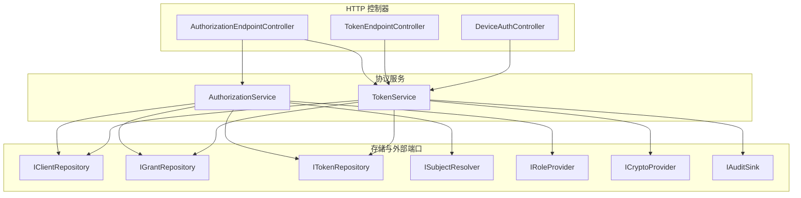
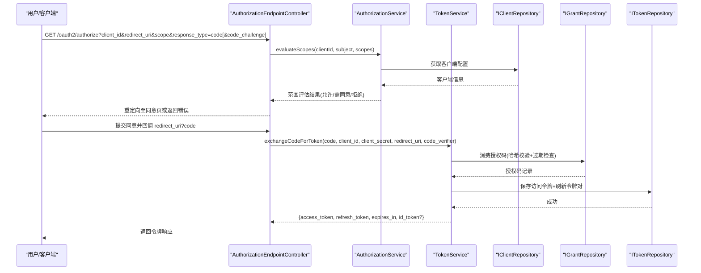
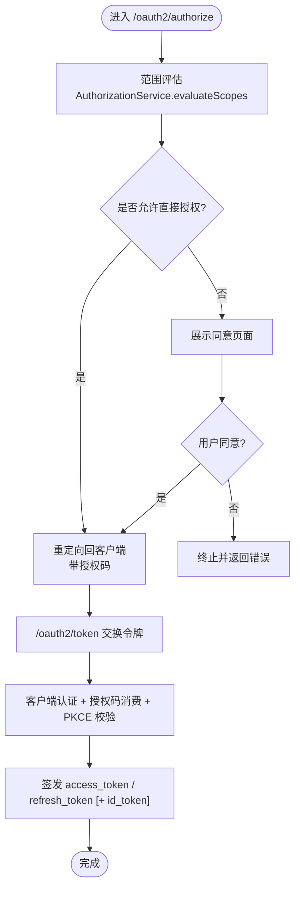
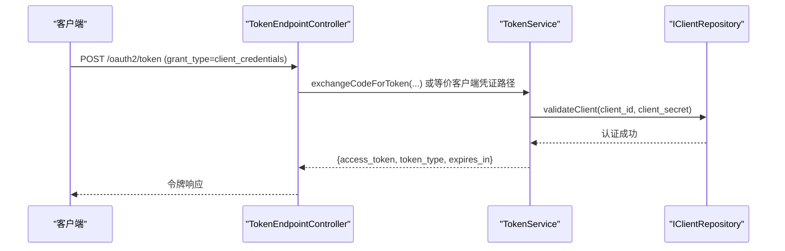
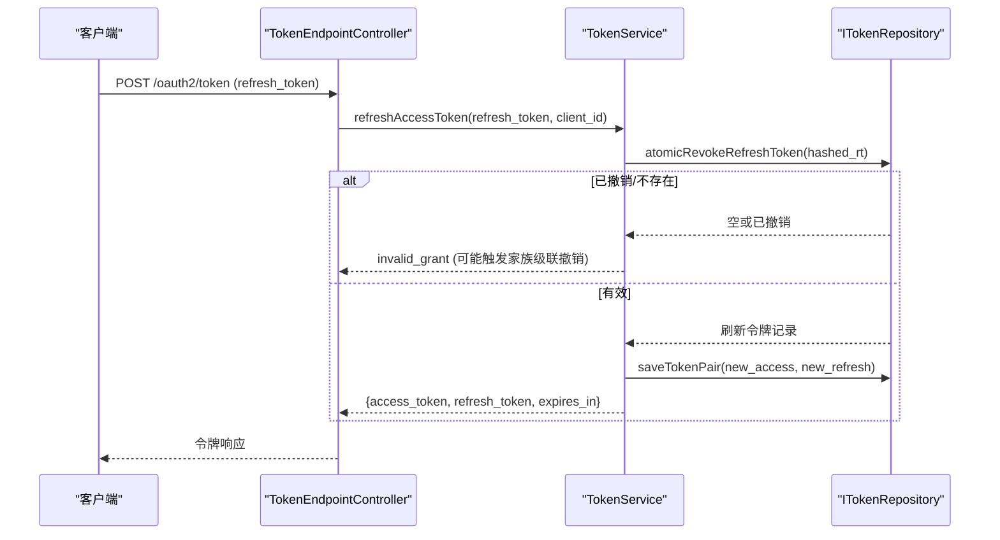
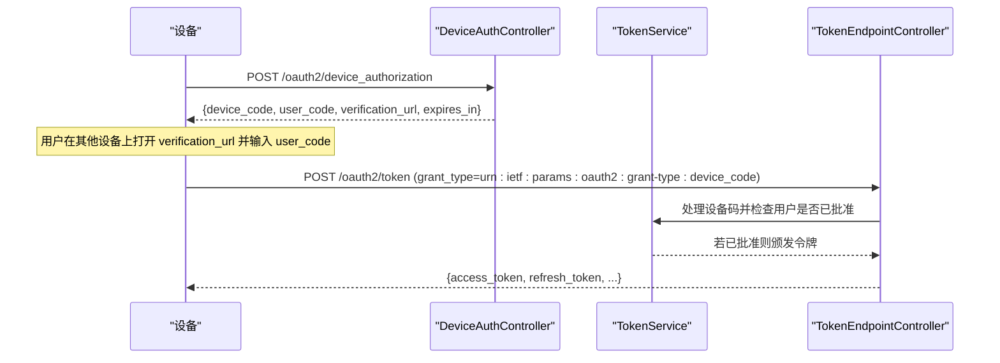
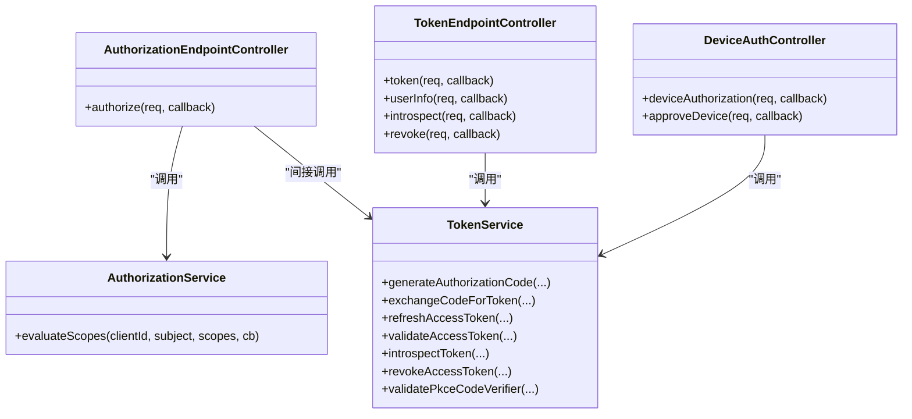

# 授权流程实现

<cite>
**本文引用的文件**
- [AuthorizationService.h](file://libs/oauth2/include/authforge/oauth2/protocol/AuthorizationService.h)
- [AuthorizationService.cc](file://libs/oauth2/src/protocol/AuthorizationService.cc)
- [TokenService.h](file://libs/oauth2/include/authforge/oauth2/protocol/TokenService.h)
- [TokenService.cc](file://libs/oauth2/src/protocol/TokenService.cc)
- [AuthorizationEndpointController.h](file://libs/drogon/include/authforge/drogon/controllers/AuthorizationEndpointController.h)
- [TokenEndpointController.h](file://libs/drogon/include/authforge/drogon/controllers/TokenEndpointController.h)
- [DeviceAuthController.h](file://libs/drogon/include/authforge/drogon/controllers/DeviceAuthController.h)
- [AuthorizationEndpointController.cc](file://libs/drogon/src/controllers/AuthorizationEndpointController.cc)
- [TokenEndpointController.cc](file://libs/drogon/src/controllers/TokenEndpointController.cc)
- [DeviceAuthController.cc](file://libs/drogon/src/controllers/DeviceAuthController.cc)
</cite>

## 目录
1. [简介](#简介)
2. [项目结构](#项目结构)
3. [核心组件](#核心组件)
4. [架构总览](#架构总览)
5. [详细组件分析](#详细组件分析)
6. [依赖关系分析](#依赖关系分析)
7. [性能考虑](#性能考虑)
8. [故障排查指南](#故障排查指南)
9. [结论](#结论)
10. [附录](#附录)

## 简介
本文件聚焦于 OAuth2 授权流程在代码库中的完整实现，覆盖以下关键流程与能力：
- 授权码流程（Authorization Code Flow）：授权请求处理、用户同意与范围决策、回调交换令牌、PKCE 校验。
- 客户端凭证模式（Client Credentials Flow）：客户端认证与令牌颁发（通过 Token 端点统一处理）。
- 刷新令牌流程（Refresh Token Flow）：令牌刷新、会话家族化与重用检测、级联撤销。
- 设备授权流程（Device Authorization Grant, RFC 8628）：设备码生成、用户审批、轮询检查（由控制器暴露的端点承载）。

文档将结合控制器与服务层接口，给出端到端调用序列、错误处理机制与最佳实践建议。

## 项目结构
本项目采用分层设计：
- 控制器层（Drogon HTTP 控制器）：负责路由、参数解析、鉴权过滤器挂载、调用插件或服务。
- 协议服务层（OAuth2 Protocol Services）：封装授权码、令牌颁发、刷新、验证、撤销等核心业务逻辑。
- 存储与领域模型：通过仓库接口（IClientRepository、IGrantRepository、ITokenRepository 等）解耦持久化。
- 安全与工具：JWK 管理、PKCE 校验、审计日志、角色与主体解析端口。

图表来源
- [AuthorizationEndpointController.h:14-40](file://libs/drogon/include/authforge/drogon/controllers/AuthorizationEndpointController.h#L14-L40)
- [TokenEndpointController.h:23-92](file://libs/drogon/include/authforge/drogon/controllers/TokenEndpointController.h#L23-L92)
- [DeviceAuthController.h:28-72](file://libs/drogon/include/authforge/drogon/controllers/DeviceAuthController.h#L28-L72)
- [AuthorizationService.h:44-84](file://libs/oauth2/include/authforge/oauth2/protocol/AuthorizationService.h#L44-L84)
- [TokenService.h:78-196](file://libs/oauth2/include/authforge/oauth2/protocol/TokenService.h#L78-L196)

章节来源
- [AuthorizationEndpointController.h:14-40](file://libs/drogon/include/authforge/drogon/controllers/AuthorizationEndpointController.h#L14-L40)
- [TokenEndpointController.h:23-92](file://libs/drogon/include/authforge/drogon/controllers/TokenEndpointController.h#L23-L92)
- [DeviceAuthController.h:28-72](file://libs/drogon/include/authforge/drogon/controllers/DeviceAuthController.h#L28-L72)
- [AuthorizationService.h:44-84](file://libs/oauth2/include/authforge/oauth2/protocol/AuthorizationService.h#L44-L84)
- [TokenService.h:78-196](file://libs/oauth2/include/authforge/oauth2/protocol/TokenService.h#L78-L196)

## 核心组件
- AuthorizationService：聚合范围权限评估（客户端白名单 -> 管理员角色 -> 用户同意），为授权流程提供统一的范围决策结果。
- TokenService：实现授权码生成与兑换、访问令牌验证、令牌刷新、令牌撤销、令牌探测（RFC 7662）、PKCE 校验等。
- 控制器：AuthorizationEndpointController（/oauth2/authorize）、TokenEndpointController（/oauth2/token、/oauth2/userinfo、/oauth2/introspect、/oauth2/revoke）、DeviceAuthController（/oauth2/device_authorization、/oauth2/device/approve）。

章节来源
- [AuthorizationService.h:44-84](file://libs/oauth2/include/authforge/oauth2/protocol/AuthorizationService.h#L44-L84)
- [AuthorizationService.cc:54-202](file://libs/oauth2/src/protocol/AuthorizationService.cc#L54-L202)
- [TokenService.h:78-196](file://libs/oauth2/include/authforge/oauth2/protocol/TokenService.h#L78-L196)
- [TokenService.cc:124-533](file://libs/oauth2/src/protocol/TokenService.cc#L124-L533)
- [AuthorizationEndpointController.h:14-40](file://libs/drogon/include/authforge/drogon/controllers/AuthorizationEndpointController.h#L14-L40)
- [TokenEndpointController.h:23-92](file://libs/drogon/include/authforge/drogon/controllers/TokenEndpointController.h#L23-L92)
- [DeviceAuthController.h:28-72](file://libs/drogon/include/authforge/drogon/controllers/DeviceAuthController.h#L28-L72)

## 架构总览
下图展示了授权码流程从浏览器到控制器的入口，再到服务层的调用链路与数据流向。

图表来源
- [AuthorizationEndpointController.h:25-32](file://libs/drogon/include/authforge/drogon/controllers/AuthorizationEndpointController.h#L25-L32)
- [AuthorizationService.h:54-77](file://libs/oauth2/include/authforge/oauth2/protocol/AuthorizationService.h#L54-L77)
- [TokenService.h:104-126](file://libs/oauth2/include/authforge/oauth2/protocol/TokenService.h#L104-L126)
- [TokenService.cc:158-339](file://libs/oauth2/src/protocol/TokenService.cc#L158-L339)

## 详细组件分析

### 授权码流程（Authorization Code Flow）
- 授权请求处理
  - 控制器：/oauth2/authorize（GET）
  - 职责：接收授权请求参数，调用范围评估服务，决定是否展示同意页面或重定向。
- 用户同意与范围决策
  - 服务：AuthorizationService.evaluateScopes
  - 决策顺序：客户端白名单 -> 管理员角色 -> 用户同意；未配置同意或无法解析主体时保守返回“需要同意”。
- 回调与令牌交换
  - 控制器：/oauth2/token（POST）
  - 服务：TokenService.exchangeCodeForToken
  - 关键点：客户端认证、授权码消费、PKCE 校验、访问令牌与刷新令牌签发、可选 id_token 签发（OpenID）。

图表来源
- [AuthorizationEndpointController.h:25-32](file://libs/drogon/include/authforge/drogon/controllers/AuthorizationEndpointController.h#L25-L32)
- [AuthorizationService.cc:54-202](file://libs/oauth2/src/protocol/AuthorizationService.cc#L54-L202)
- [TokenService.cc:158-339](file://libs/oauth2/src/protocol/TokenService.cc#L158-L339)

章节来源
- [AuthorizationEndpointController.h:25-32](file://libs/drogon/include/authforge/drogon/controllers/AuthorizationEndpointController.h#L25-L32)
- [AuthorizationService.cc:54-202](file://libs/oauth2/src/protocol/AuthorizationService.cc#L54-L202)
- [TokenService.cc:124-339](file://libs/oauth2/src/protocol/TokenService.cc#L124-L339)

### 客户端凭证模式（Client Credentials Flow）
- 端点：/oauth2/token（POST）
- 行为：使用 client_id 与 client_secret 进行客户端认证，成功后直接颁发 access_token（以及可选 refresh_token，取决于实现策略）。
- 注意：该流程不涉及用户主体与会话，适用于后端服务间调用。

图表来源
- [TokenEndpointController.h:33-63](file://libs/drogon/include/authforge/drogon/controllers/TokenEndpointController.h#L33-L63)
- [TokenService.cc:158-339](file://libs/oauth2/src/protocol/TokenService.cc#L158-L339)

章节来源
- [TokenEndpointController.h:33-63](file://libs/drogon/include/authforge/drogon/controllers/TokenEndpointController.h#L33-L63)
- [TokenService.cc:158-339](file://libs/oauth2/src/protocol/TokenService.cc#L158-L339)

### 刷新令牌流程（Refresh Token Flow）
- 端点：/oauth2/token（POST，grant_type=refresh_token）
- 行为：校验刷新令牌、执行重用检测与家族化级联撤销、签发新的访问令牌与刷新令牌。
- 安全特性：原子性撤销、重复使用检测、家族化批量撤销、审计记录。

图表来源
- [TokenService.cc:342-447](file://libs/oauth2/src/protocol/TokenService.cc#L342-L447)

章节来源
- [TokenService.cc:342-447](file://libs/oauth2/src/protocol/TokenService.cc#L342-L447)

### 设备授权流程（Device Authorization Grant, RFC 8628）
- 端点：
  - POST /oauth2/device_authorization：设备发起授权，返回 device_code、user_code、verification_url、expires_in 等。
  - POST /oauth2/device/approve：管理员或用户通过 Web 界面批准设备授权。
- 行为：生成设备码与用户友好码，等待用户在浏览器中完成授权，随后设备轮询 /oauth2/token 以换取令牌。
- 说明：控制器暴露了设备授权与审批端点，具体轮询与令牌交换仍复用 /oauth2/token 的标准流程。

图表来源
- [DeviceAuthController.h:37-62](file://libs/drogon/include/authforge/drogon/controllers/DeviceAuthController.h#L37-L62)
- [TokenEndpointController.h:33-63](file://libs/drogon/include/authforge/drogon/controllers/TokenEndpointController.h#L33-L63)
- [TokenService.cc:158-339](file://libs/oauth2/src/protocol/TokenService.cc#L158-L339)

章节来源
- [DeviceAuthController.h:37-62](file://libs/drogon/include/authforge/drogon/controllers/DeviceAuthController.h#L37-L62)
- [TokenEndpointController.h:33-63](file://libs/drogon/include/authforge/drogon/controllers/TokenEndpointController.h#L33-L63)
- [TokenService.cc:158-339](file://libs/oauth2/src/protocol/TokenService.cc#L158-L339)

### API 接口说明与错误处理
- /oauth2/authorize（GET）
  - 用途：发起授权请求，支持 response_type=code、PKCE。
  - 主要错误：无效客户端、无效重定向地址、范围不合法、需要用户同意。
- /oauth2/token（POST）
  - 用途：支持多种 grant_type（authorization_code、client_credentials、refresh_token、device_code）。
  - 主要错误：invalid_client、invalid_grant（授权码无效/过期/PKCE失败/刷新令牌失效）、server_error。
- /oauth2/userinfo（GET）
  - 用途：基于访问令牌获取用户信息（受保护资源）。
  - 主要错误：未携带或无效的访问令牌。
- /oauth2/introspect（POST）
  - 用途：按 RFC 7662 探测令牌状态（需客户端认证）。
  - 主要错误：无效令牌、服务端错误。
- /oauth2/revoke（POST）
  - 用途：按 RFC 7009 撤销访问令牌（需客户端认证）。
  - 主要错误：无效令牌、服务端错误。
- /oauth2/device_authorization（POST）
  - 用途：设备授权请求，返回设备码与用户码。
  - 主要错误：无效客户端、服务端错误。
- /oauth2/device/approve（POST）
  - 用途：管理员或用户批准设备授权。
  - 主要错误：未授权、无效设备码、服务端错误。

章节来源
- [AuthorizationEndpointController.h:25-32](file://libs/drogon/include/authforge/drogon/controllers/AuthorizationEndpointController.h#L25-L32)
- [TokenEndpointController.h:33-63](file://libs/drogon/include/authforge/drogon/controllers/TokenEndpointController.h#L33-L63)
- [DeviceAuthController.h:37-62](file://libs/drogon/include/authforge/drogon/controllers/DeviceAuthController.h#L37-L62)
- [TokenService.cc:158-533](file://libs/oauth2/src/protocol/TokenService.cc#L158-L533)

### 最佳实践示例
- 授权码流程
  - 始终使用 PKCE（code_challenge/code_verifier），尤其在公共客户端。
  - 严格校验 redirect_uri 与 scope，避免越权。
  - 在同意页面明确展示范围与风险，确保用户知情同意。
- 客户端凭证模式
  - 仅用于后端服务间通信，不暴露用户上下文。
  - 最小化 scope 授予，遵循最小权限原则。
- 刷新令牌
  - 每次刷新后轮换刷新令牌，防止重用攻击。
  - 启用家族化撤销，当检测到异常时批量回收相关令牌。
- 设备授权
  - 设置合理的过期时间，及时清理过期设备码。
  - 限制轮询频率，避免滥用。

## 依赖关系分析
- 控制器依赖 OAuth2Plugin 或协议服务，通过 setPlugin 注入。
- AuthorizationService 依赖客户端仓库、同意仓库、主体解析与角色提供者，组合范围决策。
- TokenService 依赖客户端、授权、令牌仓库，以及加密、审计、主体与角色端口。

图表来源
- [AuthorizationEndpointController.h:14-40](file://libs/drogon/include/authforge/drogon/controllers/AuthorizationEndpointController.h#L14-L40)
- [TokenEndpointController.h:23-92](file://libs/drogon/include/authforge/drogon/controllers/TokenEndpointController.h#L23-L92)
- [DeviceAuthController.h:28-72](file://libs/drogon/include/authforge/drogon/controllers/DeviceAuthController.h#L28-L72)
- [AuthorizationService.h:44-84](file://libs/oauth2/include/authforge/oauth2/protocol/AuthorizationService.h#L44-L84)
- [TokenService.h:78-196](file://libs/oauth2/include/authforge/oauth2/protocol/TokenService.h#L78-L196)

章节来源
- [AuthorizationEndpointController.h:14-40](file://libs/drogon/include/authforge/drogon/controllers/AuthorizationEndpointController.h#L14-L40)
- [TokenEndpointController.h:23-92](file://libs/drogon/include/authforge/drogon/controllers/TokenEndpointController.h#L23-L92)
- [DeviceAuthController.h:28-72](file://libs/drogon/include/authforge/drogon/controllers/DeviceAuthController.h#L28-L72)
- [AuthorizationService.h:44-84](file://libs/oauth2/include/authforge/oauth2/protocol/AuthorizationService.h#L44-L84)
- [TokenService.h:78-196](file://libs/oauth2/include/authforge/oauth2/protocol/TokenService.h#L78-L196)

## 性能考虑
- 异步链式调用：服务层广泛使用回调与 shared_from_this 捕获，避免悬挂指针与内存泄漏，提升并发安全性。
- 范围评估并行化：AuthorizationService 对多个 scope 的同意查询可并行 fan-out，减少整体延迟。
- 令牌哈希存储：所有令牌以哈希形式落盘，降低泄露风险，同时保持 O(1) 查找复杂度。
- 刷新令牌家族化：通过 familyId 关联令牌族，支持批量撤销，提高安全事件响应效率。

## 故障排查指南
- 常见错误码
  - invalid_client：客户端认证失败或客户端 ID 不匹配。
  - invalid_grant：授权码无效/过期、PKCE 校验失败、刷新令牌无效/过期。
  - server_error：内部存储或签名失败。
- 定位步骤
  - 检查 /oauth2/token 的请求体与头部（grant_type、client_id、client_secret、redirect_uri、code_verifier）。
  - 确认授权码是否已被消费且未过期。
  - 检查刷新令牌的 familyId 与是否已被撤销。
  - 查看审计日志（IAuditSink）以追踪令牌颁发与刷新事件。
- 典型问题
  - PKCE 校验失败：确认 code_challenge 与 code_verifier 方法一致且计算正确。
  - 刷新令牌重用检测：如检测到重用，会触发家族级联撤销并返回 invalid_grant。

章节来源
- [TokenService.cc:158-533](file://libs/oauth2/src/protocol/TokenService.cc#L158-L533)

## 结论
本实现通过清晰的控制器与服务分层，提供了完整的 OAuth2 授权流程能力：
- 授权码流程支持 PKCE 与 OpenID 扩展。
- 客户端凭证模式满足后端服务间认证需求。
- 刷新令牌流程具备重用检测与家族化撤销的安全机制。
- 设备授权流程为受限输入设备提供标准化授权路径。
建议在集成时严格遵循最小权限原则、启用 PKCE、合理配置 TTL 与审计，并结合前端同意页面与范围选择器提升用户体验与安全。

## 附录
- 参考端点
  - /oauth2/authorize（GET）
  - /oauth2/token（POST）
  - /oauth2/userinfo（GET）
  - /oauth2/introspect（POST）
  - /oauth2/revoke（POST）
  - /oauth2/device_authorization（POST）
  - /oauth2/device/approve（POST）