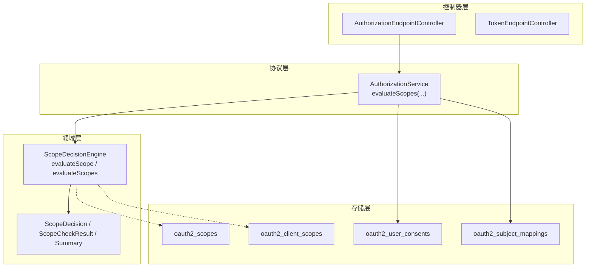
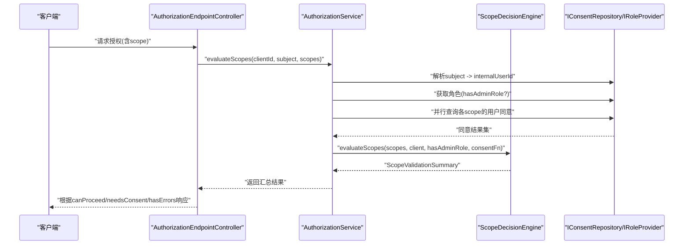
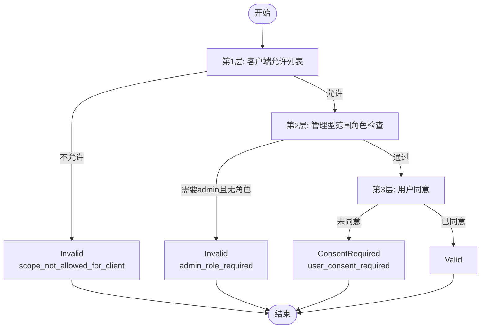
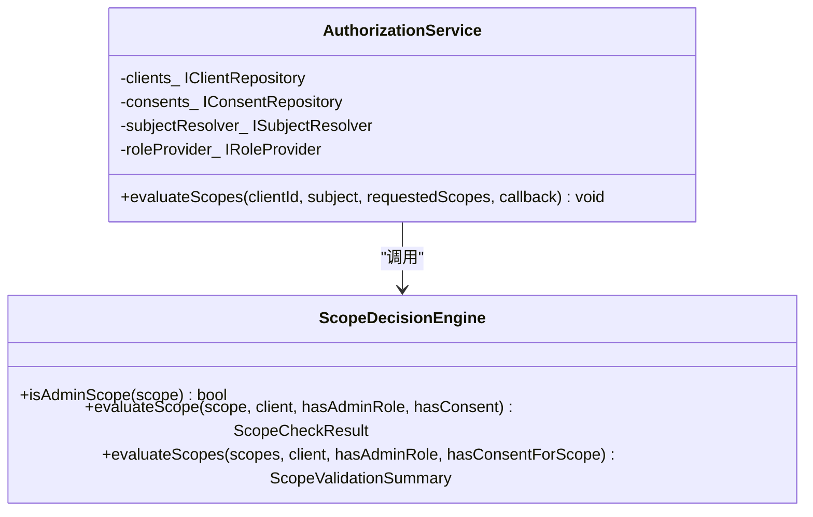
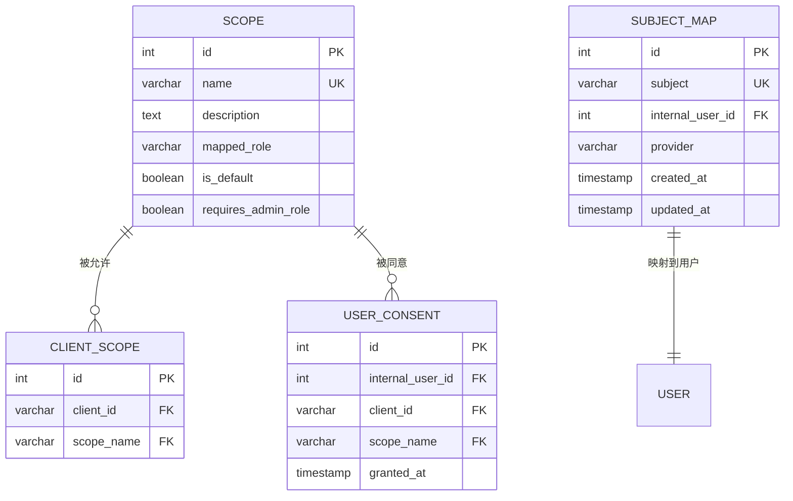
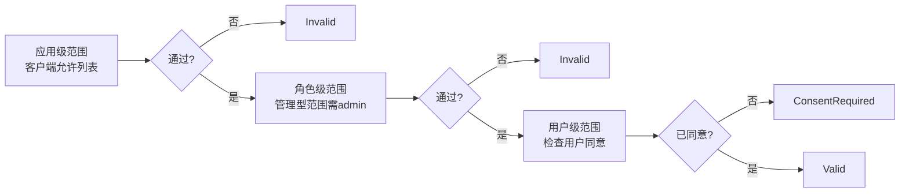
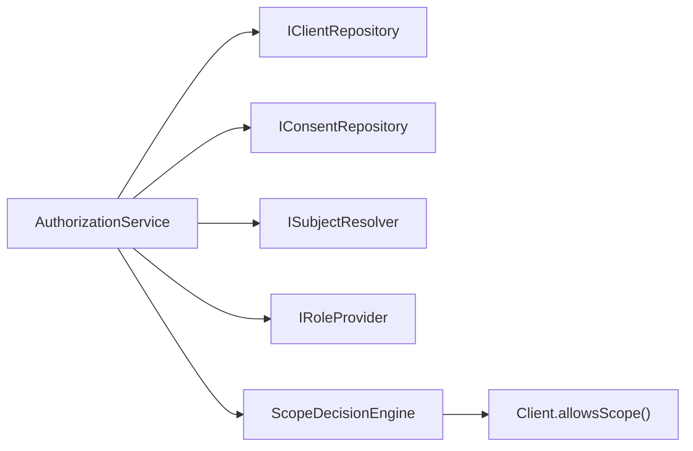

# 范围验证

<cite>
**本文引用的文件**
- [AuthorizationService.h](file://libs/oauth2/include/authforge/oauth2/protocol/AuthorizationService.h)
- [AuthorizationService.cc](file://libs/oauth2/src/protocol/AuthorizationService.cc)
- [ScopeDecision.h](file://libs/oauth2/include/authforge/oauth2/access/ScopeDecision.h)
- [ScopeDecisionEngine.h](file://libs/oauth2/include/authforge/oauth2/access/ScopeDecisionEngine.h)
- [ScopeDecisionEngine.cc](file://libs/oauth2/src/access/ScopeDecisionEngine.cc)
- [V006__oauth2_scopes.sql](file://apps/server/migrations/V006__oauth2_scopes.sql)
- [Oauth2Scopes.h](file://libs/storage-postgres/include/authforge/storage/postgres/models/Oauth2Scopes.h)
- [Oauth2Scopes.cc](file://libs/storage-postgres/src/models/Oauth2Scopes.cc)
- [Oauth2ClientScopes.cc](file://libs/storage-postgres/src/models/Oauth2ClientScopes.cc)
- [Oauth2UserConsents.cc](file://libs/storage-postgres/src/models/Oauth2UserConsents.cc)
- [SubjectGenerator.h](file://libs/drogon/include/authforge/drogon/utils/SubjectGenerator.h)
- [AuthorizationEndpointController.cc](file://libs/drogon/src/controllers/AuthorizationEndpointController.cc)
- [TokenEndpointController.cc](file://libs/drogon/src/controllers/TokenEndpointController.cc)
- [IdentityService.cc](file://libs/drogon/src/services/IdentityService.cc)
- [AuthorizationServiceTest.cc](file://libs/oauth2/test/AuthorizationServiceTest.cc)
- [AdminRoleScopeApiHttpTest.cc](file://tests/integration/admin/AdminRoleScopeApiHttpTest.cc)
- [oidc-guide.md](file://docs/backend/oidc-guide.md)
- [oauth-oidc-compliance-audit.md](file://docs/productization-evolution/oauth-oidc-compliance-audit.md)
</cite>

## 目录
1. [简介](#简介)
2. [项目结构](#项目结构)
3. [核心组件](#核心组件)
4. [架构总览](#架构总览)
5. [详细组件分析](#详细组件分析)
6. [依赖关系分析](#依赖关系分析)
7. [性能考量](#性能考量)
8. [故障排查指南](#故障排查指南)
9. [结论](#结论)
10. [附录](#附录)

## 简介
本文件系统性说明 OAuth2 范围（Scope）验证系统，覆盖范围的定义、层次结构与继承关系；范围验证引擎的静态/动态/条件验证机制；三重作用域控制（应用级、角色级、用户级）的组合验证；与 OIDC 标准声明（openid、profile、email 等）的映射关系；并提供配置示例、自定义范围开发指南、性能优化建议以及错误处理与调试技巧。

## 项目结构
围绕范围验证的关键代码分布在以下模块：
- 领域层（Domain）：范围决策引擎与结果类型，纯函数式评估逻辑
- 协议层（Protocol）：编排客户端、角色、同意（consent）等外部依赖，驱动范围评估
- 存储层（Storage）：PostgreSQL ORM 模型与迁移脚本，持久化范围、客户端允许列表、用户同意
- 控制器层（Controllers）：授权端点调用领域服务，将范围评估结果映射为响应
- 工具与集成：OIDC 声明构建、主题解析、测试用例

图表来源
- [AuthorizationService.cc:54-205](file://libs/oauth2/src/protocol/AuthorizationService.cc#L54-L205)
- [ScopeDecisionEngine.cc:1-108](file://libs/oauth2/src/access/ScopeDecisionEngine.cc#L1-L108)
- [V006__oauth2_scopes.sql:1-55](file://apps/server/migrations/V006__oauth2_scopes.sql#L1-L55)
- [AuthorizationEndpointController.cc:313-341](file://libs/drogon/src/controllers/AuthorizationEndpointController.cc#L313-L341)
- [TokenEndpointController.cc:865-891](file://libs/drogon/src/controllers/TokenEndpointController.cc#L865-L891)

章节来源
- [AuthorizationService.h:55-86](file://libs/oauth2/include/authforge/oauth2/protocol/AuthorizationService.h#L55-L86)
- [AuthorizationService.cc:54-205](file://libs/oauth2/src/protocol/AuthorizationService.cc#L54-L205)
- [ScopeDecisionEngine.h:1-93](file://libs/oauth2/include/authforge/oauth2/access/ScopeDecisionEngine.h#L1-L93)
- [ScopeDecisionEngine.cc:1-108](file://libs/oauth2/src/access/ScopeDecisionEngine.cc#L1-L108)
- [V006__oauth2_scopes.sql:1-55](file://apps/server/migrations/V006__oauth2_scopes.sql#L1-L55)

## 核心组件
- 范围决策类型与汇总
  - 单一范围判定结果：包含 scope、决策状态（Valid/Invalid/ConsentRequired）、原因码
  - 批量范围评估汇总：valid、invalid、consentRequired、invalidReasons，并支持 canProceed/needsConsent/hasErrors 快捷判断
- 范围决策引擎
  - 静态范围检查：基于客户端允许列表（client.allowsScope）
  - 动态角色检查：针对“管理型”范围（admin/admin:read/user:manage/settings:manage），要求具备 admin 角色
  - 条件范围（同意）：在通过前两层后，若未记录用户同意则返回 ConsentRequired
- 协议编排服务
  - 负责加载客户端、解析 subject 到内部用户 ID、查询角色、并行扇出 consent 查询，最终调用引擎聚合结果

章节来源
- [ScopeDecision.h:24-92](file://libs/oauth2/include/authforge/oauth2/access/ScopeDecision.h#L24-L92)
- [ScopeDecisionEngine.h:41-90](file://libs/oauth2/include/authforge/oauth2/access/ScopeDecisionEngine.h#L41-L90)
- [ScopeDecisionEngine.cc:6-108](file://libs/oauth2/src/access/ScopeDecisionEngine.cc#L6-L108)
- [AuthorizationService.cc:54-205](file://libs/oauth2/src/protocol/AuthorizationService.cc#L54-L205)

## 架构总览
范围验证采用“三层过滤 + 同意门控”的流水线：
- 第一层：应用级范围（客户端允许列表）。不在允许列表直接 Invalid
- 第二层：角色级范围。若范围属于管理型且用户无 admin 角色，直接 Invalid
- 第三层：用户级同意。已通过前两层的范围，若无用户同意则标记为 ConsentRequired
- 聚合：将每个范围的评估结果汇总为 ScopeValidationSummary，供上层决定继续发放授权或引导同意流程

图表来源
- [AuthorizationEndpointController.cc:313-341](file://libs/drogon/src/controllers/AuthorizationEndpointController.cc#L313-L341)
- [AuthorizationService.cc:54-205](file://libs/oauth2/src/protocol/AuthorizationService.cc#L54-L205)
- [ScopeDecisionEngine.cc:61-108](file://libs/oauth2/src/access/ScopeDecisionEngine.cc#L61-L108)

## 详细组件分析

### 范围决策引擎（静态/动态/条件验证）
- 静态范围验证：校验 scope 是否在客户端允许列表中
- 动态范围验证：识别“管理型”范围并要求 admin 角色
- 条件范围：在未记录用户同意时，返回 ConsentRequired，交由上层引导同意流程

图表来源
- [ScopeDecisionEngine.cc:6-59](file://libs/oauth2/src/access/ScopeDecisionEngine.cc#L6-L59)

章节来源
- [ScopeDecisionEngine.h:41-90](file://libs/oauth2/include/authforge/oauth2/access/ScopeDecisionEngine.h#L41-L90)
- [ScopeDecisionEngine.cc:6-108](file://libs/oauth2/src/access/ScopeDecisionEngine.cc#L6-L108)
- [ScopeDecision.h:24-92](file://libs/oauth2/include/authforge/oauth2/access/ScopeDecision.h#L24-L92)

### 协议编排服务（AuthorizationService）
- 职责：加载客户端、解析 subject、获取角色、并发收集同意、调用引擎聚合
- 关键路径：
  - 空客户端仓库或未知客户端：全部 Invalid（server_error/client_not_found）
  - 需要管理员角色时，先解析 subject 到 internalUserId，再查角色
  - 对每个 scope 并行查询同意，完成后统一交给引擎评估
  - 空 scope 列表快速路径：可直接 proceed

图表来源
- [AuthorizationService.h:55-86](file://libs/oauth2/include/authforge/oauth2/protocol/AuthorizationService.h#L55-L86)
- [AuthorizationService.cc:54-205](file://libs/oauth2/src/protocol/AuthorizationService.cc#L54-L205)
- [ScopeDecisionEngine.h:41-90](file://libs/oauth2/include/authforge/oauth2/access/ScopeDecisionEngine.h#L41-L90)

章节来源
- [AuthorizationService.cc:54-205](file://libs/oauth2/src/protocol/AuthorizationService.cc#L54-L205)
- [AuthorizationServiceTest.cc:198-393](file://libs/oauth2/test/AuthorizationServiceTest.cc#L198-L393)

### 数据模型与持久化（范围、允许列表、同意）
- oauth2_scopes：范围元数据（名称、描述、是否默认、是否要求管理员角色、映射角色）
- oauth2_client_scopes：客户端允许的范围集合
- oauth2_user_consents：用户对某客户端+范围的同意记录
- oauth2_subject_mappings：subject 到内部用户 ID 的映射

图表来源
- [V006__oauth2_scopes.sql:1-55](file://apps/server/migrations/V006__oauth2_scopes.sql#L1-L55)

章节来源
- [V006__oauth2_scopes.sql:1-55](file://apps/server/migrations/V006__oauth2_scopes.sql#L1-L55)
- [Oauth2Scopes.h:1-60](file://libs/storage-postgres/include/authforge/storage/postgres/models/Oauth2Scopes.h#L1-L60)
- [Oauth2Scopes.cc:18-37](file://libs/storage-postgres/src/models/Oauth2Scopes.cc#L18-L37)
- [Oauth2ClientScopes.cc:695-736](file://libs/storage-postgres/src/models/Oauth2ClientScopes.cc#L695-L736)
- [Oauth2UserConsents.cc:461-505](file://libs/storage-postgres/src/models/Oauth2UserConsents.cc#L461-L505)

### 三重作用域控制机制
- 应用级范围：由客户端允许列表决定（client.allowsScope）
- 角色级范围：对管理型范围（如 admin、admin:read、user:manage、settings:manage）要求用户具备 admin 角色
- 用户级范围：对通过前两层的范围，需存在用户对客户端的同意记录

图表来源
- [ScopeDecisionEngine.cc:6-59](file://libs/oauth2/src/access/ScopeDecisionEngine.cc#L6-L59)
- [IdentityService.cc:170-226](file://libs/drogon/src/services/IdentityService.cc#L170-L226)

章节来源
- [ScopeDecisionEngine.cc:6-59](file://libs/oauth2/src/access/ScopeDecisionEngine.cc#L6-L59)
- [IdentityService.cc:170-226](file://libs/drogon/src/services/IdentityService.cc#L170-L226)

### 与 OIDC 标准声明的映射
- openid：用于身份验证，id_token 仅在包含 openid 范围时签发
- profile：返回基本用户信息（name、username 等）
- email：返回邮箱及验证状态（email_verified 在 claims_supported 中声明）
- 注意：当前实现中 userinfo 端点不强制校验 openid 范围，任何有效 access token 均可访问，审计文档指出该行为与 OIDC 推荐实践存在偏差

章节来源
- [oidc-guide.md:1-70](file://docs/backend/oidc-guide.md#L1-L70)
- [oauth-oidc-compliance-audit.md:336-348](file://docs/productization-evolution/oauth-oidc-compliance-audit.md#L336-L348)
- [TokenEndpointController.cc:1436-1467](file://libs/drogon/src/controllers/TokenEndpointController.cc#L1436-L1467)

### 范围配置示例与管理界面
- 默认范围：openid、profile、email、admin、read、write（is_default/requires_admin_role 可配置）
- 管理界面展示范围名称、描述、映射角色、是否默认、是否仅管理员可见
- 集成测试覆盖列出范围、创建/删除范围等场景

章节来源
- [V006__oauth2_scopes.sql:46-55](file://apps/server/migrations/V006__oauth2_scopes.sql#L46-L55)
- [AdminRoleScopeApiHttpTest.cc:161-195](file://tests/integration/admin/AdminRoleScopeApiHttpTest.cc#L161-L195)

## 依赖关系分析
- AuthorizationService 依赖：
  - IClientRepository：获取客户端及其允许范围
  - IConsentRepository：查询用户对客户端+范围的同意
  - ISubjectResolver：将 subject 解析为 internalUserId
  - IRoleProvider：获取用户角色以判断是否具备 admin
- 引擎与模型：
  - 引擎使用 Client 聚合进行静态检查
  - 存储层提供范围、允许列表、同意记录的持久化能力

图表来源
- [AuthorizationService.h:55-86](file://libs/oauth2/include/authforge/oauth2/protocol/AuthorizationService.h#L55-L86)
- [AuthorizationService.cc:54-205](file://libs/oauth2/src/protocol/AuthorizationService.cc#L54-L205)
- [ScopeDecisionEngine.h:41-90](file://libs/oauth2/include/authforge/oauth2/access/ScopeDecisionEngine.h#L41-L90)

章节来源
- [AuthorizationService.cc:54-205](file://libs/oauth2/src/protocol/AuthorizationService.cc#L54-L205)
- [ScopeDecisionEngine.cc:61-108](file://libs/oauth2/src/access/ScopeDecisionEngine.cc#L61-L108)

## 性能考量
- 并行同意查询：AuthorizationService 对每个 scope 并行发起 consent 查询，减少整体延迟
- 短路策略：对于已在第1/2层失败的 scope，跳过 consent 查询，避免不必要 IO
- 快速路径：空 scope 列表直接返回可继续
- 建议优化：
  - 批量写入同意记录（当用户一次性同意多个 scope 时）
  - 缓存高频读取的客户端允许范围与角色信息（注意一致性）
  - 对 consent 查询增加索引与分页保护（防止超大 scope 列表）

[本节为通用性能建议，无需特定文件引用]

## 故障排查指南
- 常见错误码与含义
  - scope_not_allowed_for_client：范围不在客户端允许列表
  - admin_role_required：管理型范围但用户缺少 admin 角色
  - user_consent_required：已通过前两层但未记录用户同意
  - client_not_found：客户端不存在
  - server_error/internal_error：服务端异常或存储不可用
- 定位步骤
  - 检查客户端允许范围配置（oauth2_client_scopes）
  - 确认范围是否标记为 requires_admin_role，并检查用户角色
  - 查看用户同意记录（oauth2_user_consents）是否存在
  - 检查 subject 映射（oauth2_subject_mappings）是否正确
- 调试技巧
  - 在 AuthorizationService 的 consent 回调中添加 try-catch 捕获异常并记录日志
  - 使用单元测试覆盖边界情况（空客户端仓库、resolver 缺失、角色缺失、多 scope 并行）
  - 结合前端管理界面观察范围描述、默认标识、管理员标识

章节来源
- [AuthorizationService.cc:111-179](file://libs/oauth2/src/protocol/AuthorizationService.cc#L111-L179)
- [AuthorizationServiceTest.cc:225-393](file://libs/oauth2/test/AuthorizationServiceTest.cc#L225-L393)
- [V006__oauth2_scopes.sql:1-55](file://apps/server/migrations/V006__oauth2_scopes.sql#L1-L55)

## 结论
本系统实现了清晰的三层范围验证与同意门控，并通过纯函数式引擎与协议编排解耦了业务规则与异步 I/O。配合数据库模型与管理界面，可灵活配置范围、绑定角色与默认值。OIDC 标准声明映射基本完备，但 userinfo 端点的范围校验尚待加强。建议在后续版本引入批量同意写入、缓存与更严格的 userinfo 范围校验，以提升安全性与性能。

[本节为总结性内容，无需特定文件引用]

## 附录

### 自定义范围开发指南
- 新增范围字段
  - name：唯一标识
  - description：人类可读描述
  - mapped_role：可选的角色映射（便于 UI 展示）
  - is_default：是否默认启用
  - requires_admin_role：是否需要管理员角色
- 关联客户端允许列表
  - 在 oauth2_client_scopes 中为该客户端添加允许的范围
- 更新管理界面
  - 确保前端能显示新范围及其属性（描述、默认、管理员标识）

章节来源
- [V006__oauth2_scopes.sql:3-10](file://apps/server/migrations/V006__oauth2_scopes.sql#L3-L10)
- [Oauth2Scopes.h:47-55](file://libs/storage-postgres/include/authforge/storage/postgres/models/Oauth2Scopes.h#L47-L55)
- [AdminRoleScopeApiHttpTest.cc:181-195](file://tests/integration/admin/AdminRoleScopeApiHttpTest.cc#L181-L195)

### 范围与 OIDC 声明映射速查
- openid：id_token 签发前提
- profile：返回 name、username 等基本信息
- email：返回 email、email_verified（claims_supported 中声明）
- 注意：userinfo 端点当前不强制校验 openid 范围

章节来源
- [oidc-guide.md:54-70](file://docs/backend/oidc-guide.md#L54-L70)
- [oauth-oidc-compliance-audit.md:336-348](file://docs/productization-evolution/oauth-oidc-compliance-audit.md#L336-L348)
- [TokenEndpointController.cc:1436-1467](file://libs/drogon/src/controllers/TokenEndpointController.cc#L1436-L1467)