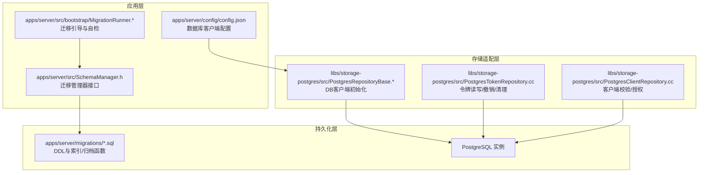
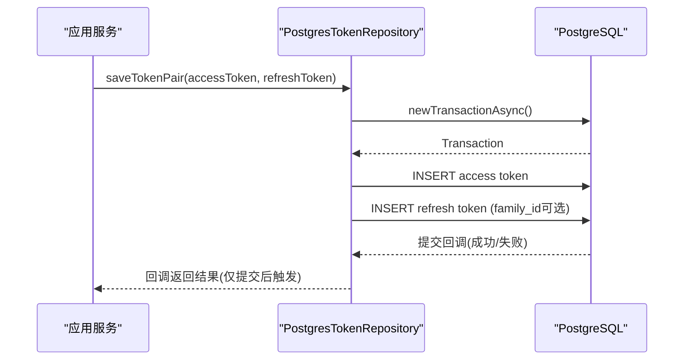
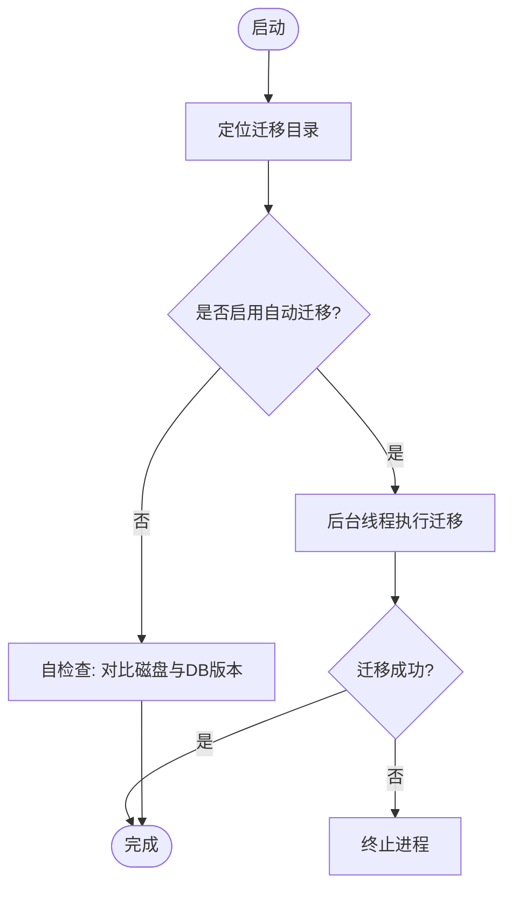
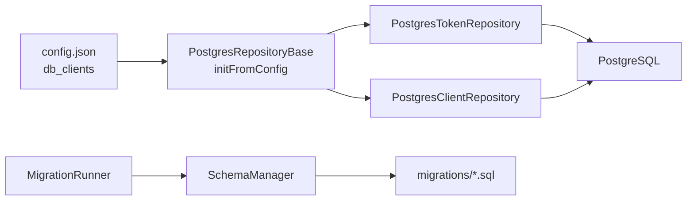

# PostgreSQL存储适配器

<cite>
**本文引用的文件**
- [PostgresRepositoryBase.h](file://libs/storage-postgres/include/authforge/storage/postgres/PostgresRepositoryBase.h)
- [PostgresRepositoryBase.cc](file://libs/storage-postgres/src/PostgresRepositoryBase.cc)
- [PostgresTokenRepository.cc](file://libs/storage-postgres/src/PostgresTokenRepository.cc)
- [PostgresClientRepository.cc](file://libs/storage-postgres/src/PostgresClientRepository.cc)
- [config.json](file://apps/server/config/config.json)
- [V001__schema_migrations.sql](file://apps/server/migrations/V001__schema_migrations.sql)
- [V002__oauth2_core.sql](file://apps/server/migrations/V002__oauth2_core.sql)
- [V003__oauth2_core_indexes.sql](file://apps/server/migrations/V003__oauth2_core_indexes.sql)
- [V004__users_table.sql](file://apps/server/migrations/V004__users_table.sql)
- [V016__token_partitioning_prep.sql](file://apps/server/migrations/V016__token_partitioning_prep.sql)
- [V017__multi_tenant.sql](file://apps/server/migrations/V017__multi_tenant.sql)
- [SchemaManager.h](file://apps/server/src/SchemaManager.h)
- [MigrationRunner.h](file://apps/server/src/bootstrap/MigrationRunner.h)
- [MigrationRunner.cc](file://apps/server/src/bootstrap/MigrationRunner.cc)
</cite>

## 目录
1. [简介](#简介)
2. [项目结构](#项目结构)
3. [核心组件](#核心组件)
4. [架构总览](#架构总览)
5. [详细组件分析](#详细组件分析)
6. [依赖关系分析](#依赖关系分析)
7. [性能考虑](#性能考虑)
8. [故障排查指南](#故障排查指南)
9. [结论](#结论)
10. [附录](#附录)

## 简介
本文件面向PostgreSQL存储适配器的实现与使用，系统性说明数据模型映射、ORM配置、连接池设置、表结构与索引优化、事务管理、迁移系统与版本控制、连接配置示例、性能调优参数、备份恢复策略、查询优化技巧、死锁预防机制、数据一致性保证方案，以及与OAuth2/OIDC核心模块的数据交互模式。

## 项目结构
PostgreSQL存储适配位于 libs/storage-postgres，提供基于Drogon ORM的仓储实现；数据库迁移脚本位于 apps/server/migrations；应用启动时通过引导层进行迁移执行或自检。

图表来源
- [config.json:9-27](file://apps/server/config/config.json#L9-L27)
- [MigrationRunner.cc:53-93](file://apps/server/src/bootstrap/MigrationRunner.cc#L53-L93)
- [SchemaManager.h:10-28](file://apps/server/src/SchemaManager.h#L10-L28)
- [PostgresRepositoryBase.cc:7-29](file://libs/storage-postgres/src/PostgresRepositoryBase.cc#L7-L29)
- [PostgresTokenRepository.cc:77-227](file://libs/storage-postgres/src/PostgresTokenRepository.cc#L77-L227)
- [PostgresClientRepository.cc:29-134](file://libs/storage-postgres/src/PostgresClientRepository.cc#L29-L134)
- [V001__schema_migrations.sql:4-9](file://apps/server/migrations/V001__schema_migrations.sql#L4-L9)
- [V002__oauth2_core.sql:5-56](file://apps/server/migrations/V002__oauth2_core.sql#L5-L56)
- [V003__oauth2_core_indexes.sql:3-8](file://apps/server/migrations/V003__oauth2_core_indexes.sql#L3-L8)
- [V016__token_partitioning_prep.sql:22-48](file://apps/server/migrations/V016__token_partitioning_prep.sql#L22-L48)

章节来源
- [config.json:9-27](file://apps/server/config/config.json#L9-L27)
- [MigrationRunner.cc:53-93](file://apps/server/src/bootstrap/MigrationRunner.cc#L53-L93)
- [SchemaManager.h:10-28](file://apps/server/src/SchemaManager.h#L10-L28)

## 核心组件
- 仓储基类：负责从配置中解析并获取主库与读库DbClient指针，供各仓储复用。
- 令牌仓储：实现访问令牌、刷新令牌的创建、查询、撤销、家族级撤销、过期清理、令牌检查（introspection）等。
- 客户端仓储：实现客户端信息查询与密钥校验（支持PUBLIC/CONFIDENTIAL类型）。
- 迁移系统：启动时扫描SQL迁移文件，按版本号顺序执行未应用的迁移，并记录到schema_migrations表；生产环境支持“仅迁移”模式和“自检查”模式。

章节来源
- [PostgresRepositoryBase.h:48-72](file://libs/storage-postgres/include/authforge/storage/postgres/PostgresRepositoryBase.h#L48-L72)
- [PostgresRepositoryBase.cc:7-29](file://libs/storage-postgres/src/PostgresRepositoryBase.cc#L7-L29)
- [PostgresTokenRepository.cc:27-795](file://libs/storage-postgres/src/PostgresTokenRepository.cc#L27-L795)
- [PostgresClientRepository.cc:29-261](file://libs/storage-postgres/src/PostgresClientRepository.cc#L29-L261)
- [SchemaManager.h:10-28](file://apps/server/src/SchemaManager.h#L10-L28)
- [MigrationRunner.h:23-43](file://apps/server/src/bootstrap/MigrationRunner.h#L23-L43)

## 架构总览
PostgreSQL存储适配器以仓储模式封装对数据库的访问，所有写操作走主库，读操作可走读库；令牌相关关键路径采用异步事务确保原子性，避免并发竞争和死锁。

图表来源
- [PostgresTokenRepository.cc:77-227](file://libs/storage-postgres/src/PostgresTokenRepository.cc#L77-L227)

章节来源
- [PostgresTokenRepository.cc:77-227](file://libs/storage-postgres/src/PostgresTokenRepository.cc#L77-L227)

## 详细组件分析

### 数据模型与ORM映射
- OAuth2核心表：客户端、授权码、访问令牌、刷新令牌，均通过Drogon ORM Mapper映射为模型对象进行CRUD。
- 用户表：用于本地账号认证与管理。
- 多租户：组织表及关联字段，支持按组织隔离资源。
- 令牌归档：提供归档函数将过期/已吊销且超时的令牌迁移至归档表，降低热表体积。

章节来源
- [V002__oauth2_core.sql:5-56](file://apps/server/migrations/V002__oauth2_core.sql#L5-L56)
- [V004__users_table.sql:3-10](file://apps/server/migrations/V004__users_table.sql#L3-L10)
- [V016__token_partitioning_prep.sql:22-48](file://apps/server/migrations/V016__token_partitioning_prep.sql#L22-L48)
- [V017__multi_tenant.sql:2-22](file://apps/server/migrations/V017__multi_tenant.sql#L2-L22)

### 索引优化策略
- 基础索引：针对令牌表的token、client_id、expires_at、revoked等常用过滤列建立索引。
- 复合索引：针对活跃令牌查询、按用户/客户端查询、家族式刷新令牌查询建立复合索引，提升高QPS场景下的检索效率。
- 部分索引：对活跃访问令牌建立部分索引，减少无效行扫描。

章节来源
- [V003__oauth2_core_indexes.sql:3-8](file://apps/server/migrations/V003__oauth2_core_indexes.sql#L3-L8)
- [V016__token_partitioning_prep.sql:5-19](file://apps/server/migrations/V016__token_partitioning_prep.sql#L5-L19)

### 事务管理机制
- 令牌成对写入：使用异步事务包裹两条INSERT，仅在提交成功后才回调上层，避免并发读取看到未提交数据。
- 原子撤销：刷新令牌撤销采用UPDATE ... WHERE revoked=false RETURNING *的CAS语义，防止重复刷新。
- 家族级撤销：先撤销刷新令牌，再级联撤销关联的访问令牌，确保一致性。

章节来源
- [PostgresTokenRepository.cc:77-227](file://libs/storage-postgres/src/PostgresTokenRepository.cc#L77-L227)
- [PostgresTokenRepository.cc:408-450](file://libs/storage-postgres/src/PostgresTokenRepository.cc#L408-L450)
- [PostgresTokenRepository.cc:452-496](file://libs/storage-postgres/src/PostgresTokenRepository.cc#L452-L496)

### 连接池与ORM配置
- 连接池：通过配置文件定义db_clients，指定主机、端口、数据库名、用户名、密码、连接数、超时、自动批处理、语句超时等。
- 读写分离：仓储基类支持分别配置主库与读库名称，默认均为"default"，可按需拆分。
- ORM：使用Drogon ORM Mapper与生成的模型类进行对象-表映射。

章节来源
- [config.json:9-27](file://apps/server/config/config.json#L9-L27)
- [PostgresRepositoryBase.h:60-72](file://libs/storage-postgres/include/authforge/storage/postgres/PostgresRepositoryBase.h#L60-L72)
- [PostgresRepositoryBase.cc:7-29](file://libs/storage-postgres/src/PostgresRepositoryBase.cc#L7-L29)

### 迁移系统与版本控制
- 版本表：schema_migrations记录已执行的迁移版本、文件名、校验和与时间戳。
- 迁移执行：启动时扫描migrations目录，按文件名排序执行未应用的SQL脚本，并记录版本。
- 运行模式：
  - 自动迁移：环境变量开启时在后台线程执行迁移，失败则终止进程。
  - 仅迁移模式：独立构建DbClient执行迁移，适用于K8s Hook Job。
  - 自检查：不执行迁移，仅比对磁盘脚本与数据库版本并告警。

图表来源
- [MigrationRunner.cc:53-93](file://apps/server/src/bootstrap/MigrationRunner.cc#L53-L93)
- [MigrationRunner.cc:95-128](file://apps/server/src/bootstrap/MigrationRunner.cc#L95-L128)
- [MigrationRunner.cc:130-165](file://apps/server/src/bootstrap/MigrationRunner.cc#L130-L165)
- [SchemaManager.h:10-28](file://apps/server/src/SchemaManager.h#L10-L28)
- [V001__schema_migrations.sql:4-9](file://apps/server/migrations/V001__schema_migrations.sql#L4-L9)

章节来源
- [V001__schema_migrations.sql:4-9](file://apps/server/migrations/V001__schema_migrations.sql#L4-L9)
- [MigrationRunner.cc:53-165](file://apps/server/src/bootstrap/MigrationRunner.cc#L53-L165)
- [SchemaManager.h:10-28](file://apps/server/src/SchemaManager.h#L10-L28)

### 与OAuth2/OIDC核心模块的数据交互
- 客户端校验：根据客户端类型跳过或执行密钥校验，使用常量时间比较防时序攻击。
- 令牌生命周期：创建、查询、撤销、检查（RFC 7662）、回收（RFC 7009）均由仓储实现，OIDC端点通过仓储访问持久化状态。
- 审计与计数：访问令牌支持检查次数统计，便于监控与限流。

章节来源
- [PostgresClientRepository.cc:136-261](file://libs/storage-postgres/src/PostgresClientRepository.cc#L136-L261)
- [PostgresTokenRepository.cc:498-589](file://libs/storage-postgres/src/PostgresTokenRepository.cc#L498-L589)
- [PostgresTokenRepository.cc:591-623](file://libs/storage-postgres/src/PostgresTokenRepository.cc#L591-L623)
- [PostgresTokenRepository.cc:627-724](file://libs/storage-postgres/src/PostgresTokenRepository.cc#L627-L724)

## 依赖关系分析
- 仓储依赖Drogon ORM与全局应用提供的DbClient。
- 迁移系统依赖SchemaManager与文件系统扫描。
- 配置驱动连接池与插件装配。

图表来源
- [config.json:9-27](file://apps/server/config/config.json#L9-L27)
- [PostgresRepositoryBase.cc:7-29](file://libs/storage-postgres/src/PostgresRepositoryBase.cc#L7-L29)
- [PostgresTokenRepository.cc:27-795](file://libs/storage-postgres/src/PostgresTokenRepository.cc#L27-L795)
- [PostgresClientRepository.cc:29-261](file://libs/storage-postgres/src/PostgresClientRepository.cc#L29-L261)
- [MigrationRunner.cc:53-165](file://apps/server/src/bootstrap/MigrationRunner.cc#L53-L165)
- [SchemaManager.h:10-28](file://apps/server/src/SchemaManager.h#L10-L28)

章节来源
- [PostgresRepositoryBase.cc:7-29](file://libs/storage-postgres/src/PostgresRepositoryBase.cc#L7-L29)
- [PostgresTokenRepository.cc:27-795](file://libs/storage-postgres/src/PostgresTokenRepository.cc#L27-L795)
- [PostgresClientRepository.cc:29-261](file://libs/storage-postgres/src/PostgresClientRepository.cc#L29-L261)
- [MigrationRunner.cc:53-165](file://apps/server/src/bootstrap/MigrationRunner.cc#L53-L165)
- [SchemaManager.h:10-28](file://apps/server/src/SchemaManager.h#L10-L28)

## 性能考虑
- 索引设计
  - 为高频查询建立单列与复合索引，如token、client_id、user_id、revoked、expires_at的组合。
  - 使用部分索引缩小索引范围，提高命中率。
- 事务与并发
  - 使用异步事务避免阻塞事件循环，防止死锁。
  - 使用CAS更新避免竞态条件（刷新令牌撤销）。
- 清理与归档
  - 定期调用归档函数将过期/已吊销且超时的令牌迁移至归档表，保持热表轻量。
- 连接池
  - 合理设置number_of_connections与timeout，结合auto_batch与statement_timeout提升吞吐与稳定性。
- 读扩展
  - 读写分离：读请求走读库，写请求走主库，降低主库压力。

章节来源
- [V003__oauth2_core_indexes.sql:3-8](file://apps/server/migrations/V003__oauth2_core_indexes.sql#L3-L8)
- [V016__token_partitioning_prep.sql:5-19](file://apps/server/migrations/V016__token_partitioning_prep.sql#L5-L19)
- [PostgresTokenRepository.cc:728-792](file://libs/storage-postgres/src/PostgresTokenRepository.cc#L728-L792)
- [config.json:9-27](file://apps/server/config/config.json#L9-L27)

## 故障排查指南
- 迁移失败
  - 现象：启动日志提示迁移失败或进程退出。
  - 排查：确认迁移目录存在、数据库连通、schema_migrations表可用；必要时使用“仅迁移模式”单独执行。
- 令牌写入无结果
  - 现象：保存令牌对后回调未触发或上层读到未提交数据。
  - 排查：确认使用了异步事务并在提交回调中通知上层；检查事务提交回调逻辑。
- 刷新令牌重复使用
  - 现象：并发刷新导致多次生效。
  - 排查：确认使用原子撤销接口（UPDATE ... WHERE revoked=false RETURNING *）。
- 客户端密钥校验失败
  - 现象：CONFIDENTIAL客户端验证失败。
  - 排查：确认salt与哈希计算一致，使用常量时间比较；PUBLIC客户端无需密钥。
- 连接异常
  - 现象：无法获取DbClient或连接超时。
  - 排查：核对配置中的host/port/dbname/user/passwd/number_of_connections/timeout；检查网络与PG服务状态。

章节来源
- [MigrationRunner.cc:53-165](file://apps/server/src/bootstrap/MigrationRunner.cc#L53-L165)
- [PostgresTokenRepository.cc:77-227](file://libs/storage-postgres/src/PostgresTokenRepository.cc#L77-L227)
- [PostgresTokenRepository.cc:408-450](file://libs/storage-postgres/src/PostgresTokenRepository.cc#L408-L450)
- [PostgresClientRepository.cc:136-261](file://libs/storage-postgres/src/PostgresClientRepository.cc#L136-L261)
- [PostgresRepositoryBase.cc:7-29](file://libs/storage-postgres/src/PostgresRepositoryBase.cc#L7-L29)

## 结论
PostgreSQL存储适配器通过仓储抽象、ORM映射、异步事务与完善的索引策略，提供了高可靠、高性能的OAuth2/OIDC持久化能力。迁移系统支持自动化与生产安全模式，配合归档与清理机制保障长期运行的稳定性。建议在生产环境中启用外部迁移Job、合理配置连接池与索引，并结合监控指标持续优化。

## 附录

### 数据库表结构设计要点
- 核心表
  - oauth2_clients：客户端信息、类型、重定向地址、授权类型。
  - oauth2_codes：授权码、挑战值、过期时间、使用标记。
  - oauth2_access_tokens：访问令牌、作用域、过期时间、签发者、受众、审计字段。
  - oauth2_refresh_tokens：刷新令牌、关联访问令牌、家族ID、过期时间、撤销信息。
- 辅助表
  - users：本地用户账户。
  - organizations：多租户组织。
  - schema_migrations：迁移版本追踪。
  - oauth2_access_tokens_archive：令牌归档表。

章节来源
- [V002__oauth2_core.sql:5-56](file://apps/server/migrations/V002__oauth2_core.sql#L5-L56)
- [V004__users_table.sql:3-10](file://apps/server/migrations/V004__users_table.sql#L3-L10)
- [V016__token_partitioning_prep.sql:22-48](file://apps/server/migrations/V016__token_partitioning_prep.sql#L22-L48)
- [V017__multi_tenant.sql:2-22](file://apps/server/migrations/V017__multi_tenant.sql#L2-L22)
- [V001__schema_migrations.sql:4-9](file://apps/server/migrations/V001__schema_migrations.sql#L4-L9)

### 连接配置示例（来自配置文件）
- 数据库客户端：名称、RDBMS类型、主机、端口、数据库名、用户、密码、连接数、超时、自动批处理、语句超时等。
- 插件配置：存储类型选择postgres，并指定使用的db_client_name。

章节来源
- [config.json:9-27](file://apps/server/config/config.json#L9-L27)
- [config.json:142-170](file://apps/server/config/config.json#L142-L170)

### 常见查询优化技巧
- 优先使用带索引的精确匹配（如token、client_id）。
- 使用复合索引覆盖多条件查询（如user_id + revoked + expires_at）。
- 利用部分索引减少扫描范围（如仅活跃令牌）。
- 批量清理与归档，避免大表扫描。

章节来源
- [V003__oauth2_core_indexes.sql:3-8](file://apps/server/migrations/V003__oauth2_core_indexes.sql#L3-L8)
- [V016__token_partitioning_prep.sql:5-19](file://apps/server/migrations/V016__token_partitioning_prep.sql#L5-L19)
- [PostgresTokenRepository.cc:728-792](file://libs/storage-postgres/src/PostgresTokenRepository.cc#L728-L792)

### 死锁预防机制
- 使用异步事务避免阻塞事件循环导致的BEGIN无法发送问题。
- 统一加锁顺序与最小化事务粒度，避免长事务持有锁。
- 使用CAS更新减少并发冲突。

章节来源
- [PostgresTokenRepository.cc:77-227](file://libs/storage-postgres/src/PostgresTokenRepository.cc#L77-L227)
- [PostgresTokenRepository.cc:408-450](file://libs/storage-postgres/src/PostgresTokenRepository.cc#L408-L450)

### 数据一致性保证方案
- 令牌成对写入在事务内完成，提交后才回调上层。
- 刷新令牌撤销采用原子更新，防止重复使用。
- 家族级撤销级联更新，确保全部失效。

章节来源
- [PostgresTokenRepository.cc:77-227](file://libs/storage-postgres/src/PostgresTokenRepository.cc#L77-L227)
- [PostgresTokenRepository.cc:408-450](file://libs/storage-postgres/src/PostgresTokenRepository.cc#L408-L450)
- [PostgresTokenRepository.cc:452-496](file://libs/storage-postgres/src/PostgresTokenRepository.cc#L452-L496)

### 备份恢复策略建议
- 定期全量备份与增量WAL归档，保留足够历史以便时间点恢复。
- 归档表与热表分离，便于分库分表或冷热分层。
- 迁移前务必备份，回滚时优先恢复schema_migrations与业务表快照。

[本节为通用运维建议，不直接引用具体代码文件]