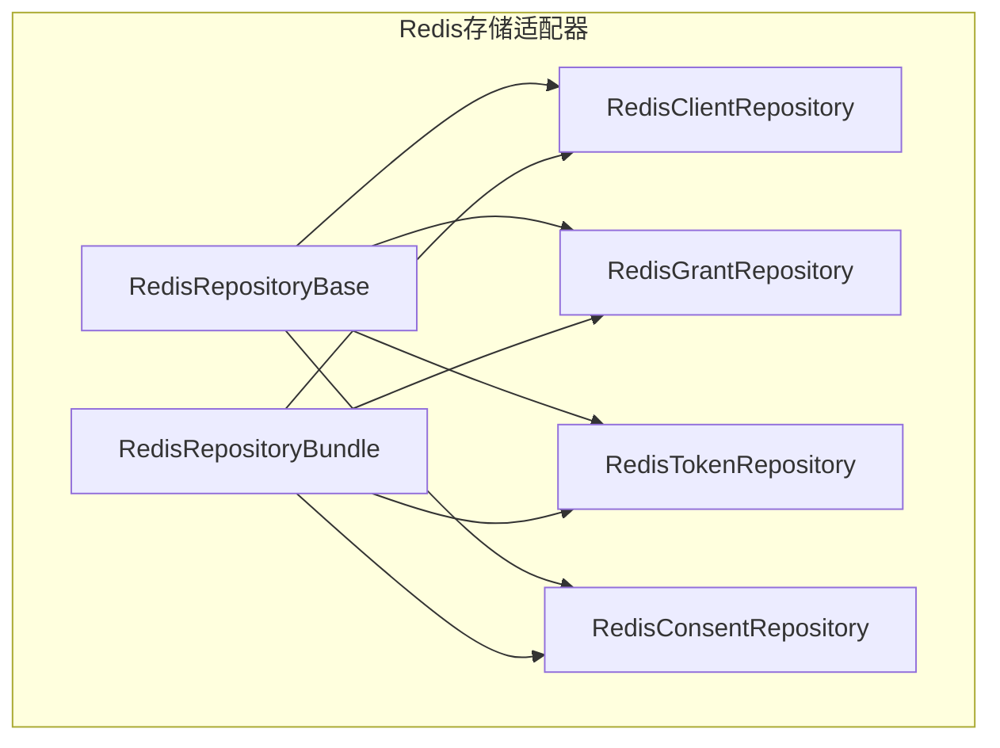
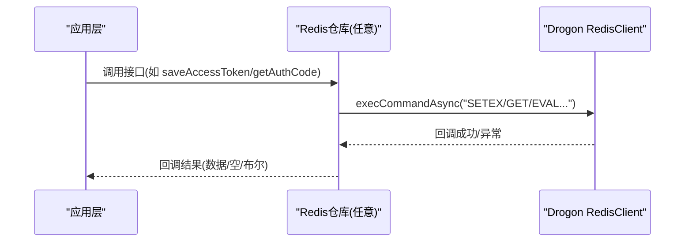
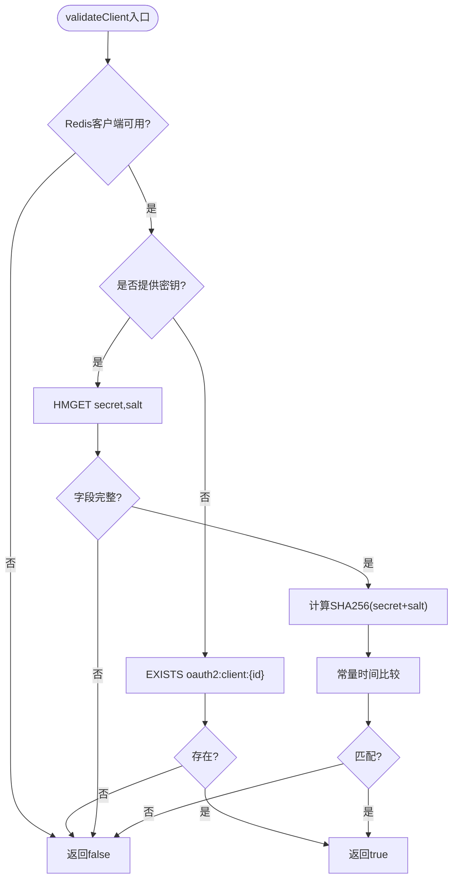
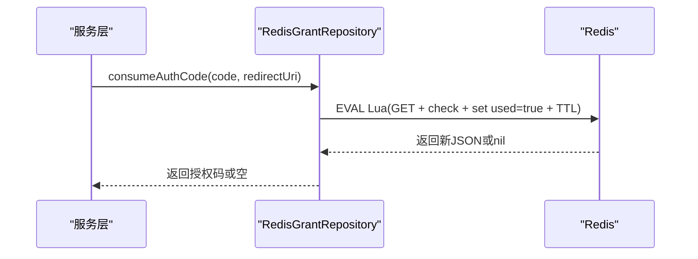
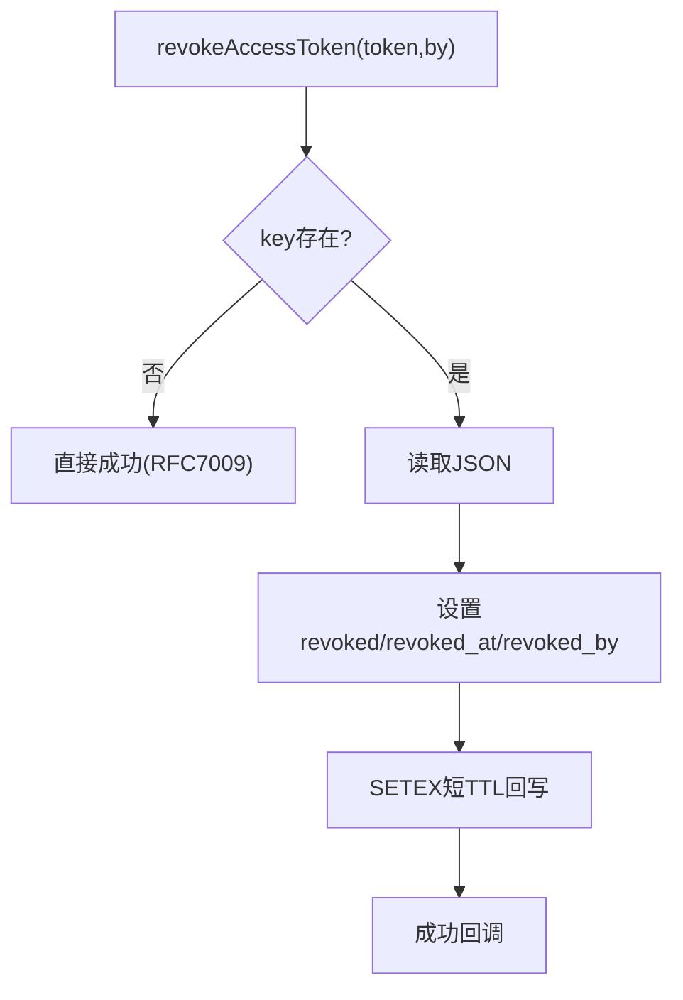
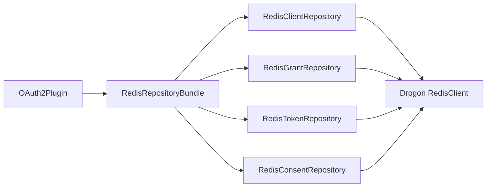

# Redis存储适配器

<cite>
**本文引用的文件**
- [RedisRepositoryBase.h](file://libs/storage-redis/include/authforge/storage/redis/RedisRepositoryBase.h)
- [RedisRepositoryBase.cc](file://libs/storage-redis/src/RedisRepositoryBase.cc)
- [RedisRepositoryBundle.h](file://libs/storage-redis/include/authforge/storage/redis/RedisRepositoryBundle.h)
- [RedisRepositoryBundle.cc](file://libs/storage-redis/src/RedisRepositoryBundle.cc)
- [RedisClientRepository.h](file://libs/storage-redis/include/authforge/storage/redis/RedisClientRepository.h)
- [RedisClientRepository.cc](file://libs/storage-redis/src/RedisClientRepository.cc)
- [RedisTokenRepository.h](file://libs/storage-redis/include/authforge/storage/redis/RedisTokenRepository.h)
- [RedisTokenRepository.cc](file://libs/storage-redis/src/RedisTokenRepository.cc)
- [RedisGrantRepository.h](file://libs/storage-redis/include/authforge/storage/redis/RedisGrantRepository.h)
- [RedisGrantRepository.cc](file://libs/storage-redis/src/RedisGrantRepository.cc)
- [RedisConsentRepository.h](file://libs/storage-redis/include/authforge/storage/redis/RedisConsentRepository.h)
- [RedisConsentRepository.cc](file://libs/storage-redis/src/RedisConsentRepository.cc)
- [OAuth2Plugin.cc](file://libs/drogon/src/plugin/OAuth2Plugin.cc)
- [redis.yaml](file://deploy/helm/authforge/templates/redis.yaml)
</cite>

## 目录
1. [简介](#简介)
2. [项目结构](#项目结构)
3. [核心组件](#核心组件)
4. [架构总览](#架构总览)
5. [详细组件分析](#详细组件分析)
6. [依赖关系分析](#依赖关系分析)
7. [性能与内存优化](#性能与内存优化)
8. [故障排查指南](#故障排查指南)
9. [结论](#结论)
10. [附录：配置与使用示例](#附录配置与使用示例)

## 简介
本文件面向 AuthForge 的 Redis 存储适配器，系统性说明其作为缓存与会话相关数据的存储实现原理。内容涵盖键空间设计、数据结构选择、过期策略、连接与超时管理、事务与CAS能力边界、失效与清理机制、与主存储的一致性策略，以及分布式会话、令牌缓存、速率限制等典型场景的实践建议。同时提供监控指标与内存优化建议，帮助在生产环境中稳定高效地使用 Redis 作为 OAuth2/OIDC 流程中的高速缓存层。

## 项目结构
Redis 存储适配器的代码位于 libs/storage-redis，采用“按聚合拆分”的仓库模式：每个业务聚合（客户端、授权码/交易、令牌、同意）对应一个 Repository 实现，并通过 RedisRepositoryBase 共享 Redis 客户端获取与超时设置逻辑；通过 RedisRepositoryBundle 统一装配。

图表来源
- [RedisRepositoryBase.h:9-53](file://libs/storage-redis/include/authforge/storage/redis/RedisRepositoryBase.h#L9-L53)
- [RedisRepositoryBundle.h:29-84](file://libs/storage-redis/include/authforge/storage/redis/RedisRepositoryBundle.h#L29-L84)

章节来源
- [RedisRepositoryBase.h:9-53](file://libs/storage-redis/include/authforge/storage/redis/RedisRepositoryBase.h#L9-L53)
- [RedisRepositoryBase.cc:7-19](file://libs/storage-redis/src/RedisRepositoryBase.cc#L7-L19)
- [RedisRepositoryBundle.h:29-84](file://libs/storage-redis/include/authforge/storage/redis/RedisRepositoryBundle.h#L29-L84)
- [RedisRepositoryBundle.cc:6-12](file://libs/storage-redis/src/RedisRepositoryBundle.cc#L6-L12)

## 核心组件
- 基础混入 RedisRepositoryBase：负责从 Drogon 应用上下文获取 named Redis 客户端并设置超时，所有仓库复用该逻辑，避免重复初始化与漂移。
- 聚合装配 RedisRepositoryBundle：一次性构造四个 OAuth2 仓库实例，便于上层组装注入。
- 领域仓库：
  - RedisClientRepository：客户端信息读取与校验（哈希字段对比、常量时间比较）。
  - RedisGrantRepository：授权码与授权交易的存取、标记已用与消费（Lua 原子脚本保证一致性）。
  - RedisTokenRepository：访问令牌存取、撤销、探测（RFC 7662）、刷新令牌家族撤销（有限支持）。
  - RedisConsentRepository：用户同意记录的存在性检查、保存与撤销。

章节来源
- [RedisRepositoryBase.h:9-53](file://libs/storage-redis/include/authforge/storage/redis/RedisRepositoryBase.h#L9-L53)
- [RedisRepositoryBase.cc:7-19](file://libs/storage-redis/src/RedisRepositoryBase.cc#L7-L19)
- [RedisRepositoryBundle.h:29-84](file://libs/storage-redis/include/authforge/storage/redis/RedisRepositoryBundle.h#L29-L84)
- [RedisClientRepository.h:23-51](file://libs/storage-redis/include/authforge/storage/redis/RedisClientRepository.h#L23-L51)
- [RedisGrantRepository.h:23-81](file://libs/storage-redis/include/authforge/storage/redis/RedisGrantRepository.h#L23-L81)
- [RedisTokenRepository.h:24-118](file://libs/storage-redis/include/authforge/storage/redis/RedisTokenRepository.h#L24-L118)
- [RedisConsentRepository.h:22-63](file://libs/storage-redis/include/authforge/storage/redis/RedisConsentRepository.h#L22-L63)

## 架构总览
Redis 适配器通过 Drogon 的 nosql::RedisClient 进行异步命令执行，所有写操作普遍采用 SETEX 以 TTL 控制过期；读操作在缺失或解析失败时返回空结果；关键状态变更（如授权码消费、交易标记）使用 Lua 脚本保证原子性。

图表来源
- [RedisTokenRepository.cc:49-96](file://libs/storage-redis/src/RedisTokenRepository.cc#L49-L96)
- [RedisGrantRepository.cc:48-90](file://libs/storage-redis/src/RedisGrantRepository.cc#L48-L90)
- [RedisGrantRepository.cc:184-267](file://libs/storage-redis/src/RedisGrantRepository.cc#L184-L267)

## 详细组件分析

### 客户端仓库（RedisClientRepository）
- 键空间与数据结构
  - 客户端哈希键：oauth2:client:{clientId}
  - 字段：secret（哈希值）、salt、redirect_uris（JSON数组）
- 读取与校验
  - getClient：HGETALL 读取并映射为领域模型
  - validateClient：无密钥时仅判断存在；有密钥时取 secret+salt 计算 SHA256，并使用常量时间比较防止时序侧信道
- 错误处理
  - 未初始化客户端直接返回空/假
  - HMGET 返回 nil 元素时安全降级为 false

图表来源
- [RedisClientRepository.cc:110-197](file://libs/storage-redis/src/RedisClientRepository.cc#L110-L197)

章节来源
- [RedisClientRepository.h:23-51](file://libs/storage-redis/include/authforge/storage/redis/RedisClientRepository.h#L23-L51)
- [RedisClientRepository.cc:55-108](file://libs/storage-redis/src/RedisClientRepository.cc#L55-L108)
- [RedisClientRepository.cc:110-197](file://libs/storage-redis/src/RedisClientRepository.cc#L110-L197)

### 授权码与交易仓库（RedisGrantRepository）
- 键空间与数据结构
  - 授权码：oauth2:code:{code}，JSON 包含 client_id/user_id/scope/redirect_uri/expires_at/used，使用 SETEX 设置 TTL
  - 授权交易：oauth2:transaction:{transactionId}，JSON 包含交易元信息与 scopes 列表，TTL 较短
- 原子性与一致性
  - markAuthCodeUsed：EVAL Lua 脚本原子设置 used=true 并保留 TTL
  - consumeAuthCode：EVAL Lua 脚本校验 redirect_uri、标记 used，并返回更新后的 JSON
  - markTransactionConsumed：EVAL Lua 脚本原子标记 consumed
- 过期清理
  - purgeExpired：no-op，依赖 Redis TTL 自动清理

图表来源
- [RedisGrantRepository.cc:184-267](file://libs/storage-redis/src/RedisGrantRepository.cc#L184-L267)
- [RedisGrantRepository.cc:142-182](file://libs/storage-redis/src/RedisGrantRepository.cc#L142-L182)
- [RedisGrantRepository.cc:431-467](file://libs/storage-redis/src/RedisGrantRepository.cc#L431-L467)

章节来源
- [RedisGrantRepository.h:23-81](file://libs/storage-redis/include/authforge/storage/redis/RedisGrantRepository.h#L23-L81)
- [RedisGrantRepository.cc:48-90](file://libs/storage-redis/src/RedisGrantRepository.cc#L48-L90)
- [RedisGrantRepository.cc:93-139](file://libs/storage-redis/src/RedisGrantRepository.cc#L93-L139)
- [RedisGrantRepository.cc:142-182](file://libs/storage-redis/src/RedisGrantRepository.cc#L142-L182)
- [RedisGrantRepository.cc:184-267](file://libs/storage-redis/src/RedisGrantRepository.cc#L184-L267)
- [RedisGrantRepository.cc:272-331](file://libs/storage-redis/src/RedisGrantRepository.cc#L272-L331)
- [RedisGrantRepository.cc:333-402](file://libs/storage-redis/src/RedisGrantRepository.cc#L333-L402)
- [RedisGrantRepository.cc:404-429](file://libs/storage-redis/src/RedisGrantRepository.cc#L404-L429)
- [RedisGrantRepository.cc:431-467](file://libs/storage-redis/src/RedisGrantRepository.cc#L431-L467)
- [RedisGrantRepository.cc:472-479](file://libs/storage-redis/src/RedisGrantRepository.cc#L472-L479)

### 令牌仓库（RedisTokenRepository）
- 键空间与数据结构
  - 访问令牌：oauth2:token:{token}，JSON 包含 clientId/userId/scope/expiresAt/revoked 及 RFC 7662 字段（issued_at/issuer/audience/not_before/introspect_count/revoked_at/revoked_by），使用 SETEX 设置 TTL
- 能力声明
  - supportsTransactions() = false：不覆盖 saveTokenPair，默认顺序写入，且刷新令牌部分为 no-op
  - supportsCas() = false：refresh token 撤销路径非原子两步（GET+SET），并发下可能重放
- 功能要点
  - saveAccessToken/getAccessToken：序列化/反序列化 JSON，TTL 基于 expiresAt
  - revokeAccessToken：读取 JSON，置 revoked/revoked_at/revoked_by 后重新 SETEX（固定短期 TTL）
  - introspectToken：读取并判断 active，填充 RFC 7662 响应字段
  - incrementIntrospectCount：当前为 no-op（避免 JSON 字段原子递增的竞态）
  - revokeTokenFamily：仅日志告警（Redis 缺乏二级索引）
  - purgeExpired：no-op，依赖 TTL

图表来源
- [RedisTokenRepository.cc:347-416](file://libs/storage-redis/src/RedisTokenRepository.cc#L347-L416)

章节来源
- [RedisTokenRepository.h:24-118](file://libs/storage-redis/include/authforge/storage/redis/RedisTokenRepository.h#L24-L118)
- [RedisTokenRepository.cc:49-96](file://libs/storage-redis/src/RedisTokenRepository.cc#L49-L96)
- [RedisTokenRepository.cc:99-151](file://libs/storage-redis/src/RedisTokenRepository.cc#L99-L151)
- [RedisTokenRepository.cc:153-224](file://libs/storage-redis/src/RedisTokenRepository.cc#L153-L224)
- [RedisTokenRepository.cc:226-343](file://libs/storage-redis/src/RedisTokenRepository.cc#L226-L343)
- [RedisTokenRepository.cc:347-416](file://libs/storage-redis/src/RedisTokenRepository.cc#L347-L416)
- [RedisTokenRepository.cc:420-426](file://libs/storage-redis/src/RedisTokenRepository.cc#L420-L426)

### 同意仓库（RedisConsentRepository）
- 键空间与数据结构
  - 同意键：oauth2:consent:{internalUserId}:{clientId}:{scope}，值为时间戳，TTL 30天
- 行为
  - hasUserConsent：EXISTS 判断存在性
  - saveUserConsent：SETEX 写入
  - revokeUserConsent：DEL 删除

章节来源
- [RedisConsentRepository.h:22-63](file://libs/storage-redis/include/authforge/storage/redis/RedisConsentRepository.h#L22-L63)
- [RedisConsentRepository.cc:16-51](file://libs/storage-redis/src/RedisConsentRepository.cc#L16-L51)
- [RedisConsentRepository.cc:53-86](file://libs/storage-redis/src/RedisConsentRepository.cc#L53-L86)
- [RedisConsentRepository.cc:88-118](file://libs/storage-redis/src/RedisConsentRepository.cc#L88-L118)

## 依赖关系分析
- 运行时依赖
  - Drogon nosql::RedisClient：用于异步命令执行与回调
  - jsoncpp：JSON 序列化/反序列化
  - authforge::oauth2::model/*：领域 DTO
- 装配点
  - OAuth2Plugin 中通过 RedisRepositoryBundle 注入各仓库，形成生产链路

图表来源
- [OAuth2Plugin.cc:270-270](file://libs/drogon/src/plugin/OAuth2Plugin.cc#L270-L270)
- [RedisRepositoryBundle.h:29-84](file://libs/storage-redis/include/authforge/storage/redis/RedisRepositoryBundle.h#L29-L84)

章节来源
- [OAuth2Plugin.cc:270-270](file://libs/drogon/src/plugin/OAuth2Plugin.cc#L270-L270)
- [RedisRepositoryBundle.h:29-84](file://libs/storage-redis/include/authforge/storage/redis/RedisRepositoryBundle.h#L29-L84)

## 性能与内存优化
- 连接与超时
  - 所有仓库共享 RedisRepositoryBase 获取的 RedisClient，并设置 3 秒超时，降低长阻塞风险
- 键空间与序列化
  - 使用紧凑 JSON 输出减少网络与内存占用
  - 合理设置 TTL：授权码/令牌短 TTL，同意 30 天
- 原子性与并发
  - 授权码消费/交易标记使用 Lua 脚本保证原子性
  - refresh token 撤销非原子两步，需结合业务容忍度评估并发影响
- 清理策略
  - 依赖 Redis TTL 自动清理，purgeExpired 为 no-op，避免额外扫描开销
- 监控指标建议
  - 命令延迟与错误率（GET/SETEX/EVAL）
  - 命中率（getAccessToken/getAuthCode）
  - 键数量与内存使用（按前缀统计）
  - Lua 脚本执行耗时与失败次数
- 内存优化建议
  - 控制 JSON 体积（仅必要字段）
  - 合理 TTL 避免热键长期驻留
  - 对高频 key 使用更短 TTL 或分片命名空间
  - 关注大对象与字符串膨胀，必要时压缩或拆分

[本节为通用指导，不直接分析具体文件]

## 故障排查指南
- 客户端未初始化
  - 现象：getClient/validateClient 直接返回空/假
  - 定位：检查 RedisRepositoryBase 初始化与 Drogon 应用是否已配置 named Redis 客户端
- JSON 解析失败
  - 现象：getAccessToken/getAuthCode 返回空
  - 定位：确认写入端是否正确序列化，是否存在字段缺失或格式损坏
- 授权码消费失败
  - 现象：consumeAuthCode 返回空
  - 定位：检查 redirect_uri 是否匹配、是否已使用或已过期；查看 Lua 脚本执行日志
- 令牌撤销无效
  - 现象：revokeAccessToken 后仍可被使用
  - 定位：确认是否命中旧缓存、TTL 是否过短导致快速过期；检查服务端是否及时读取最新状态
- 刷新令牌家族撤销
  - 现象：仅日志告警
  - 定位：Redis 模式下不支持高效 family 查询，如需强一致请考虑主存储或引入二级索引

章节来源
- [RedisRepositoryBase.cc:7-19](file://libs/storage-redis/src/RedisRepositoryBase.cc#L7-L19)
- [RedisClientRepository.cc:55-108](file://libs/storage-redis/src/RedisClientRepository.cc#L55-L108)
- [RedisGrantRepository.cc:184-267](file://libs/storage-redis/src/RedisGrantRepository.cc#L184-L267)
- [RedisTokenRepository.cc:347-416](file://libs/storage-redis/src/RedisTokenRepository.cc#L347-L416)

## 结论
Redis 存储适配器以轻量、高吞吐的方式承载 OAuth2/OIDC 流程中的热点数据：客户端信息、授权码、授权交易、访问令牌与用户同意。通过 TTL 驱动过期、Lua 脚本保障关键路径原子性、统一的客户端管理与超时控制，实现了高性能与可维护性的平衡。对于需要强一致或复杂查询的场景（如刷新令牌家族撤销），应结合主存储或其他持久化方案协同工作。

[本节为总结性内容，不直接分析具体文件]

## 附录：配置与使用示例
- 连接池与集群
  - 通过 Drogon 应用配置 named Redis 客户端（名称与参数由部署环境决定），仓库构造函数接收 clientName 以复用同一客户端
  - 集群模式：由 Drogon 的 Redis 客户端配置决定；仓库层透明使用
- 持久化选项
  - 仓库层依赖 Redis TTL 管理过期；如需持久化到磁盘，请在 Redis 层开启 AOF/RDB 策略
- 配置示例（Kubernetes Helm）
  - 参考 deploy/helm/authforge/templates/redis.yaml 部署 Redis 资源
- 使用方式
  - 通过 RedisRepositoryBundle 获取各仓库实例并注入到业务服务
  - 示例装配点：OAuth2Plugin 中创建 bundle 并注入

章节来源
- [RedisRepositoryBase.h:42-53](file://libs/storage-redis/include/authforge/storage/redis/RedisRepositoryBase.h#L42-L53)
- [RedisRepositoryBase.cc:7-19](file://libs/storage-redis/src/RedisRepositoryBase.cc#L7-L19)
- [RedisRepositoryBundle.h:29-84](file://libs/storage-redis/include/authforge/storage/redis/RedisRepositoryBundle.h#L29-L84)
- [RedisRepositoryBundle.cc:6-12](file://libs/storage-redis/src/RedisRepositoryBundle.cc#L6-L12)
- [OAuth2Plugin.cc:270-270](file://libs/drogon/src/plugin/OAuth2Plugin.cc#L270-L270)
- [redis.yaml](file://deploy/helm/authforge/templates/redis.yaml)