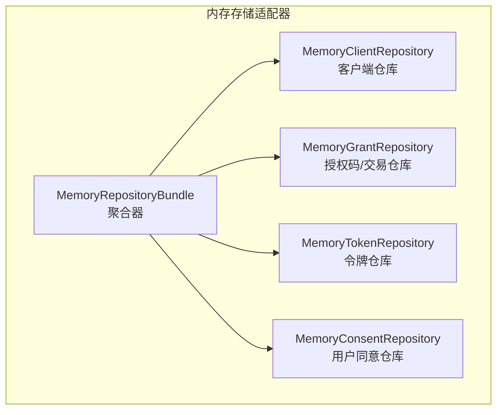
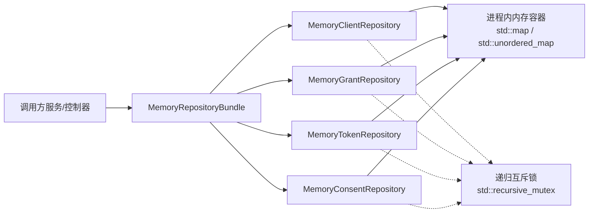
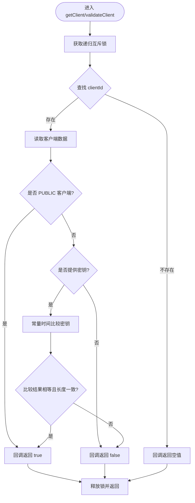
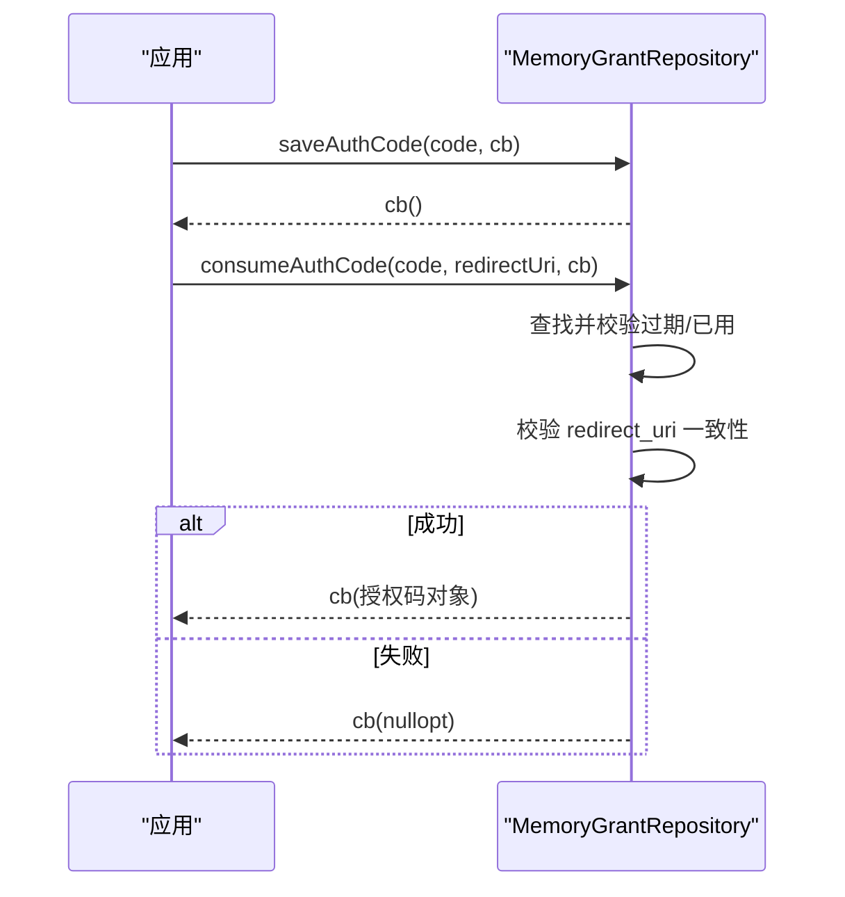
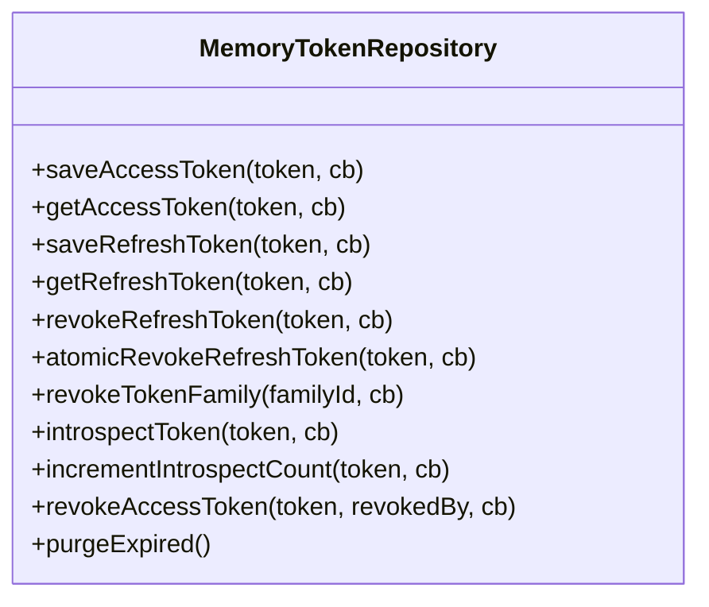
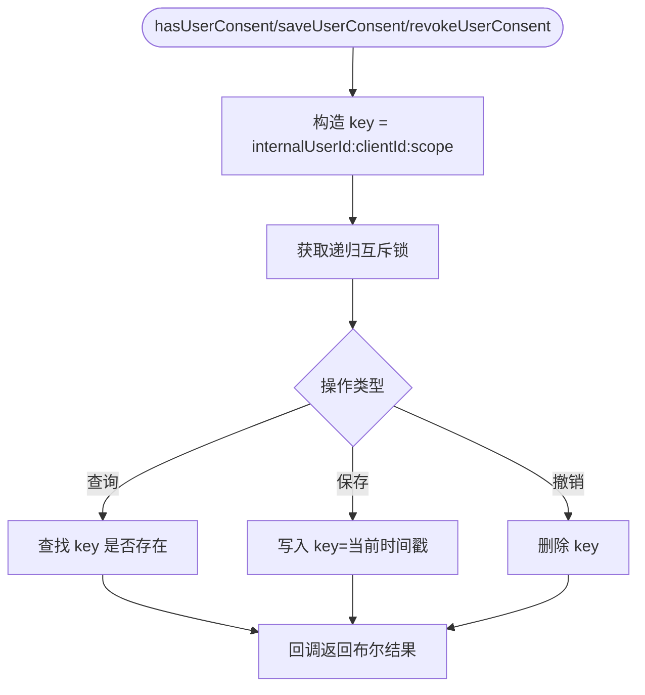
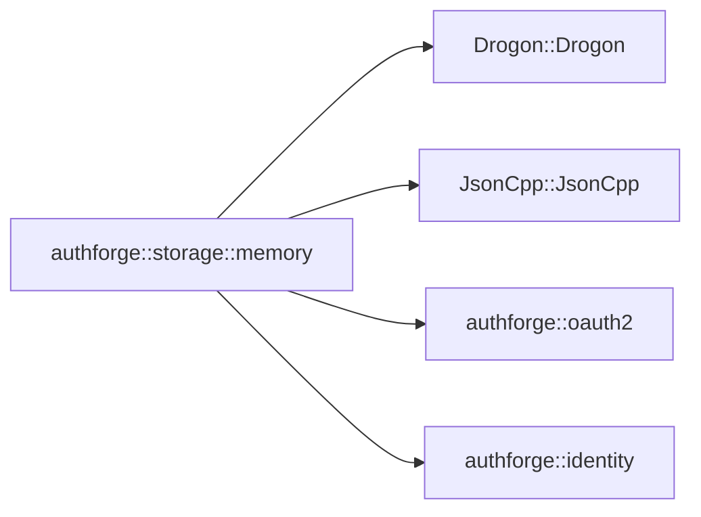

# 内存存储适配器

<cite>
**本文引用的文件**
- [CMakeLists.txt](file://libs/storage-memory/CMakeLists.txt)
- [MemoryRepositoryBundle.cc](file://libs/storage-memory/src/MemoryRepositoryBundle.cc)
- [MemoryClientRepository.cc](file://libs/storage-memory/src/MemoryClientRepository.cc)
- [MemoryGrantRepository.cc](file://libs/storage-memory/src/MemoryGrantRepository.cc)
- [MemoryTokenRepository.cc](file://libs/storage-memory/src/MemoryTokenRepository.cc)
- [MemoryConsentRepository.cc](file://libs/storage-memory/src/MemoryConsentRepository.cc)
</cite>

## 目录
1. [简介](#简介)
2. [项目结构](#项目结构)
3. [核心组件](#核心组件)
4. [架构总览](#架构总览)
5. [详细组件分析](#详细组件分析)
6. [依赖关系分析](#依赖关系分析)
7. [性能与并发特性](#性能与并发特性)
8. [配置与生命周期管理](#配置与生命周期管理)
9. [测试场景与最佳实践](#测试场景与最佳实践)
10. [与其他存储适配器的对比与迁移指南](#与其他存储适配器的对比与迁移指南)
11. [故障排查](#故障排查)
12. [结论](#结论)

## 简介
本文件面向 AuthForge 的“内存存储适配器”（authforge::storage::memory），聚焦其在开发与测试环境中的实现方式。内容涵盖：内存数据结构设计、线程安全机制、生命周期管理、内存分配策略、数据序列化方案、并发访问控制；以及在单元测试与集成测试中的使用场景与最佳实践。同时提供配置选项说明、性能特点与局限性分析，并给出与其他存储适配器（PostgreSQL/Redis）的对比、迁移指南与注意事项。最后解释内存数据的临时性特征及数据丢失风险的处理方案。

## 项目结构
内存存储适配器位于 libs/storage-memory，包含四个 OAuth2 仓库的内存实现以及一个聚合器（Bundle）。构建系统通过 CMake 将源码编译为静态库，并通过 Drogon 日志进行诊断输出。

**图示来源**
- [MemoryRepositoryBundle.cc:6-17](file://libs/storage-memory/src/MemoryRepositoryBundle.cc#L6-L17)

**章节来源**
- [CMakeLists.txt:3-14](file://libs/storage-memory/CMakeLists.txt#L3-L14)
- [CMakeLists.txt:29-53](file://libs/storage-memory/CMakeLists.txt#L29-L53)
- [MemoryRepositoryBundle.cc:6-17](file://libs/storage-memory/src/MemoryRepositoryBundle.cc#L6-L17)

## 核心组件
- MemoryRepositoryBundle：聚合四个仓库实例并提供统一的初始化入口（如加载客户端配置）。
- MemoryClientRepository：在内存中维护客户端信息，支持从 JSON 配置初始化、按 clientId 查询与密钥校验。
- MemoryGrantRepository：在内存中维护授权码与授权交易，支持保存、消费、过期清理与事务状态标记。
- MemoryTokenRepository：在内存中维护访问令牌与刷新令牌，支持存取、撤销、家族撤销、令牌检查（introspection）与过期清理。
- MemoryConsentRepository：在内存中维护用户对特定客户端/范围的同意记录，支持查询、保存与撤销。

**章节来源**
- [MemoryRepositoryBundle.cc:6-17](file://libs/storage-memory/src/MemoryRepositoryBundle.cc#L6-L17)
- [MemoryClientRepository.cc:19-152](file://libs/storage-memory/src/MemoryClientRepository.cc#L19-L152)
- [MemoryGrantRepository.cc:20-194](file://libs/storage-memory/src/MemoryGrantRepository.cc#L20-L194)
- [MemoryTokenRepository.cc:20-302](file://libs/storage-memory/src/MemoryTokenRepository.cc#L20-L302)
- [MemoryConsentRepository.cc:16-70](file://libs/storage-memory/src/MemoryConsentRepository.cc#L16-L70)

## 架构总览
内存存储适配器作为领域接口（OAuth2/Identity 仓库接口）的适配器层实现，所有读写均基于进程内容器（如 std::map/std::unordered_map）与互斥锁保护。各仓库独立维护自身数据集合，并通过回调返回结果，便于上层异步编排。

**图示来源**
- [MemoryRepositoryBundle.cc:6-17](file://libs/storage-memory/src/MemoryRepositoryBundle.cc#L6-L17)
- [MemoryClientRepository.cc:26-152](file://libs/storage-memory/src/MemoryClientRepository.cc#L26-L152)
- [MemoryGrantRepository.cc:26-194](file://libs/storage-memory/src/MemoryGrantRepository.cc#L26-L194)
- [MemoryTokenRepository.cc:26-302](file://libs/storage-memory/src/MemoryTokenRepository.cc#L26-L302)
- [MemoryConsentRepository.cc:34-70](file://libs/storage-memory/src/MemoryConsentRepository.cc#L34-L70)

## 详细组件分析

### 客户端仓库（MemoryClientRepository）
- 数据结构：以 clientId 为键的映射表存储 OAuth2Client 模型。
- 初始化：从 JSON 配置解析客户端类型、重定向 URI、允许范围等，默认类型为 CONFIDENTIAL。
- 并发：每个方法进入时获取递归互斥锁，保证对 clients_ 的原子访问。
- 密钥校验：PUBLIC 客户端跳过密钥校验；CONFIDENTIAL 客户端使用常量时间比较防止时序攻击。
- 回调：查询与校验均以回调形式返回结果，空值表示未找到或失败。

**图示来源**
- [MemoryClientRepository.cc:19-152](file://libs/storage-memory/src/MemoryClientRepository.cc#L19-L152)

**章节来源**
- [MemoryClientRepository.cc:19-152](file://libs/storage-memory/src/MemoryClientRepository.cc#L19-L152)

### 授权仓库（MemoryGrantRepository）
- 数据结构：
  - authCodes_：以授权码为键的映射，记录过期时间与使用状态。
  - transactions_：以 transactionId 为键的映射，记录授权交易的状态与过期时间。
- 过期处理：
  - 读取时惰性检查过期并删除过期项。
  - purgeExpired() 主动扫描并清理过期的授权码。
- 安全校验：
  - consumeAuthCode 严格校验 redirect_uri 与授权时记录的一致，不一致则拒绝。
- 并发：所有操作加递归互斥锁。

**图示来源**
- [MemoryGrantRepository.cc:26-97](file://libs/storage-memory/src/MemoryGrantRepository.cc#L26-L97)

**章节来源**
- [MemoryGrantRepository.cc:20-194](file://libs/storage-memory/src/MemoryGrantRepository.cc#L20-L194)

### 令牌仓库（MemoryTokenRepository）
- 数据结构：
  - accessTokens_：以 token 为键的访问令牌映射。
  - refreshTokens_：以 token 为键的刷新令牌映射。
- 功能：
  - 存取访问/刷新令牌，设置 issuedAt/notBefore 默认值。
  - 撤销单个刷新令牌、家族撤销（关联撤销同家族的访问令牌）。
  - 令牌检查（RFC 7662 introspection），返回活跃性与元数据。
  - 过期清理（purgeExpired）。
- 并发：所有操作加递归互斥锁。

**图示来源**
- [MemoryTokenRepository.cc:26-302](file://libs/storage-memory/src/MemoryTokenRepository.cc#L26-L302)

**章节来源**
- [MemoryTokenRepository.cc:20-302](file://libs/storage-memory/src/MemoryTokenRepository.cc#L20-L302)

### 同意仓库（MemoryConsentRepository）
- 数据结构：以“用户内部ID:clientId:scope”为键的映射，值为同意时间戳。
- 功能：查询是否存在同意、保存同意、撤销同意。
- 并发：所有操作加递归互斥锁。

**图示来源**
- [MemoryConsentRepository.cc:22-70](file://libs/storage-memory/src/MemoryConsentRepository.cc#L22-L70)

**章节来源**
- [MemoryConsentRepository.cc:16-70](file://libs/storage-memory/src/MemoryConsentRepository.cc#L16-L70)

## 依赖关系分析
- 构建与链接：
  - 依赖 Drogon（日志）、JsonCpp（配置解析）、authforge::oauth2（领域模型与接口）、authforge::identity（身份相关接口）。
  - 目标名称与别名：authforge-storage-memory / authforge::storage::memory。
- 模块耦合：
  - 聚合器仅负责装配与统一初始化，不持有业务逻辑。
  - 各仓库之间无直接依赖，数据隔离清晰。

**图示来源**
- [CMakeLists.txt:29-53](file://libs/storage-memory/CMakeLists.txt#L29-L53)

**章节来源**
- [CMakeLists.txt:29-53](file://libs/storage-memory/CMakeLists.txt#L29-L53)

## 性能与并发特性
- 内存分配策略：
  - 使用标准容器（map/unordered_map）存储实体，按键索引，插入/查找平均 O(1)~O(logN)。
  - 字符串键与值均为动态分配，频繁创建/销毁可能带来碎片化；在高并发短生命周期场景下建议结合对象池或复用缓冲。
- 并发模型：
  - 每个仓库使用递归互斥锁保护其数据集合，避免竞态条件。
  - 粒度较粗（整个仓库一把锁），简单可靠但高吞吐下可能成为瓶颈；可考虑分片锁或读写锁优化读多写少的场景。
- 序列化方案：
  - 配置阶段使用 JsonCpp 解析 JSON 到内存模型；运行时数据以原生 C++ 模型驻留内存，无需额外序列化。
- 过期与清理：
  - 惰性过期检查（读取时剔除过期项）+ 周期性 purgeExpired() 主动清理，降低常驻内存占用。
- 安全性：
  - 客户端密钥比较采用常量时间比较，抵御时序侧信道。
  - 授权码交换严格校验 redirect_uri，符合 OAuth2 协议要求。

[本节为通用性能讨论，不直接分析具体代码行]

## 配置与生命周期管理
- 初始化：
  - 通过 MemoryRepositoryBundle::initFromConfig 传入客户端配置（JSON），内部委托给 MemoryClientRepository 解析并填充内存数据。
- 生命周期：
  - 内存数据随进程生命周期存在；进程退出后全部数据丢失。
  - 建议在测试套件启动前注入初始数据，并在用例结束后重置或重建仓库实例，确保用例间隔离。
- 配置项要点：
  - client.type：客户端类型（默认 CONFIDENTIAL）。
  - client.secret：用于验证的密钥（内存模式下以明文或哈希形式存储，取决于上游生成策略）。
  - client.redirect_uri：单值或数组。
  - client.allowed_scopes：单值或数组；某些内置客户端（如 vue-client）会添加默认范围以保证向后兼容。

**章节来源**
- [MemoryRepositoryBundle.cc:14-17](file://libs/storage-memory/src/MemoryRepositoryBundle.cc#L14-L17)
- [MemoryClientRepository.cc:19-91](file://libs/storage-memory/src/MemoryClientRepository.cc#L19-L91)

## 测试场景与最佳实践
- 单元测试：
  - 使用内存仓库快速验证领域逻辑，无需外部依赖（数据库/缓存）。
  - 通过 initFromConfig 注入少量客户端数据，覆盖 PUBLIC/CONFIDENTIAL 分支、错误路径（缺失密钥、非法类型）。
- 集成测试：
  - 模拟完整 OAuth2/OIDC 流程（授权码、令牌颁发、刷新、撤销、检查），利用内存仓库的过期与清理能力验证时序与边界条件。
  - 并发测试：多线程并发调用同一仓库接口，验证互斥锁正确性与数据一致性。
- 最佳实践：
  - 每次测试用例开始前清空或重建仓库，避免跨用例污染。
  - 针对过期敏感的用例，可通过控制时间源（getCurrentTimestamp）或缩短 TTL 加速测试。
  - 对涉及密钥校验的用例，确保配置中的 secret 与调用端一致。

[本节为通用测试指导，不直接分析具体代码行]

## 与其他存储适配器的对比与迁移指南
- 对比维度：
  - 持久性：内存存储不具备持久性；PostgreSQL/Redis 具备持久化与共享能力。
  - 并发与扩展：内存存储受限于单进程；PostgreSQL/Redis 支持多进程/分布式扩展。
  - 性能：内存存储延迟极低，适合本地开发/测试；生产环境需考虑持久化与容灾。
  - 协议合规：内存存储在关键路径（如授权码交换、密钥比较）遵循协议与安全要求，与持久化实现保持一致。
- 迁移建议：
  - 保持接口不变（通过领域仓库接口抽象），替换实现即可平滑迁移。
  - 注意配置差异：内存模式使用 JSON 配置；持久化模式通常使用数据库连接串与缓存配置。
  - 数据迁移：从内存到持久化时，需在启动阶段执行数据同步或导入脚本。
  - 行为对齐：确认过期策略、清理频率、撤销语义与持久化实现一致。

[本节为通用迁移指导，不直接分析具体代码行]

## 故障排查
- 常见问题：
  - 客户端未找到：检查 initFromConfig 是否正确加载配置，clientId 是否匹配。
  - 密钥校验失败：确认客户端类型与密钥格式；PUBLIC 客户端不应提供密钥；CONFIDENTIAL 客户端必须提供匹配的密钥。
  - 授权码交换失败：检查 redirect_uri 是否与授权时记录完全一致。
  - 令牌无效：检查是否过期或被撤销；确认 introspection 返回 active=false 的原因。
- 定位手段：
  - 启用 Drogon 日志（LOG_DEBUG/INFO/WARN），观察仓库内部决策路径。
  - 在关键路径增加断点或打印上下文（clientId、token、redirectUri、时间戳）。
  - 使用 purgeExpired 与惰性过期检查组合，确认过期清理行为是否符合预期。

**章节来源**
- [MemoryClientRepository.cc:107-152](file://libs/storage-memory/src/MemoryClientRepository.cc#L107-L152)
- [MemoryGrantRepository.cc:66-97](file://libs/storage-memory/src/MemoryGrantRepository.cc#L66-L97)
- [MemoryTokenRepository.cc:45-81](file://libs/storage-memory/src/MemoryTokenRepository.cc#L45-L81)
- [MemoryTokenRepository.cc:141-216](file://libs/storage-memory/src/MemoryTokenRepository.cc#L141-L216)

## 结论
内存存储适配器以简洁、高性能的方式实现了 OAuth2/OIDC 的核心存储需求，适用于开发与测试环境。其通过递归互斥锁保障线程安全，采用惰性过期与主动清理相结合的策略控制内存占用，并在关键路径遵循协议与安全规范。对于生产环境，应评估持久化与可扩展性需求，选择 PostgreSQL/Redis 等持久化适配器，并保持接口一致以实现平滑迁移。