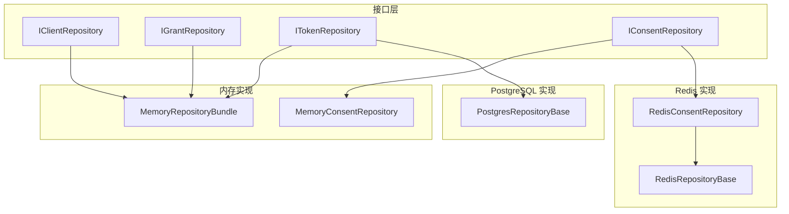
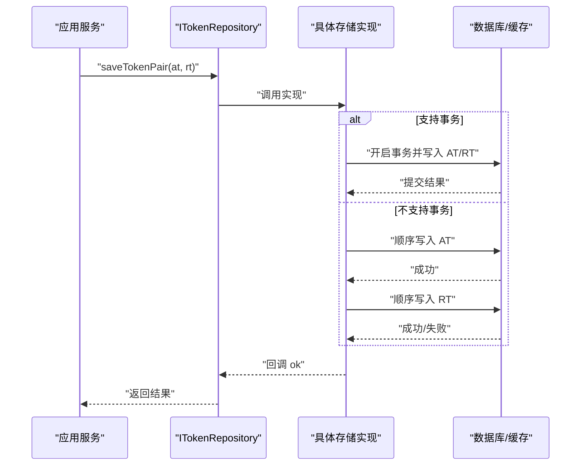
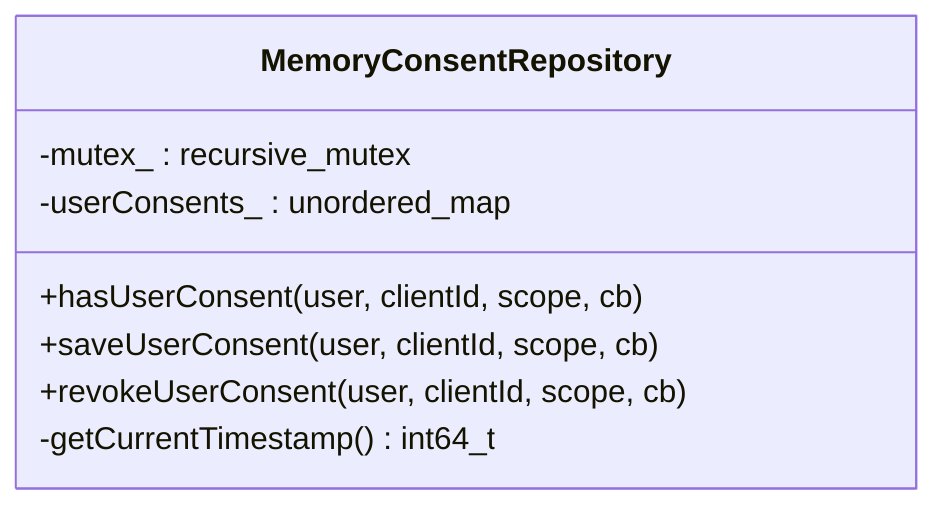
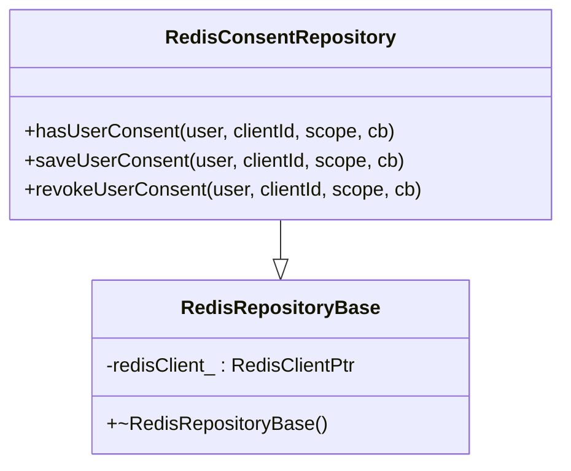
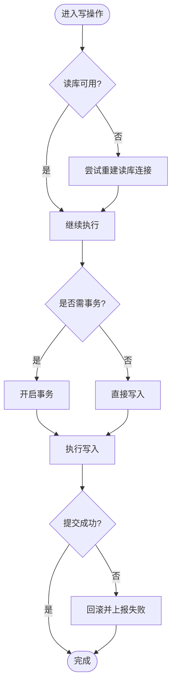
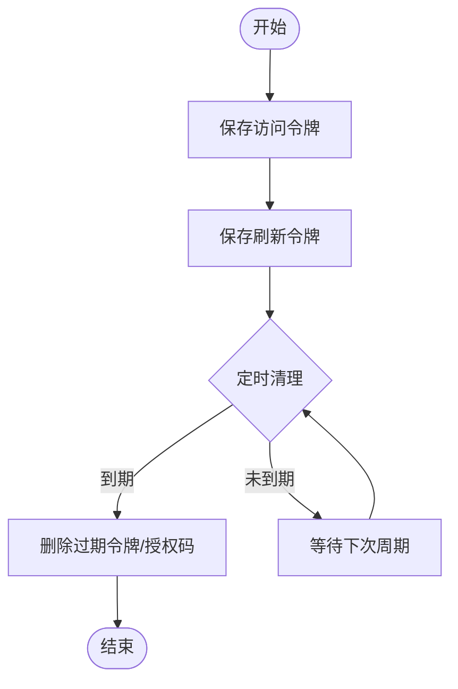
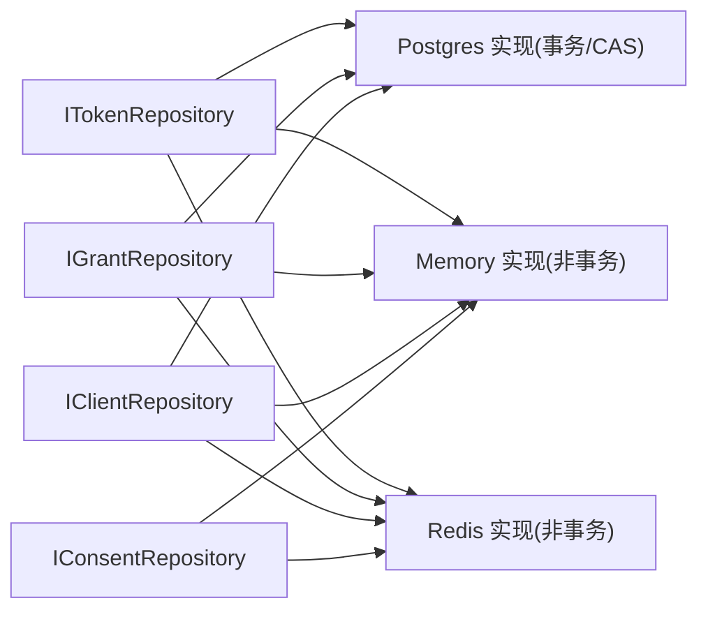

# 存储适配器

<cite>
**本文引用的文件**
- [IConsentRepository.h](file://libs/oauth2/include/authforge/oauth2/repository/IConsentRepository.h)
- [ITokenRepository.h](file://libs/oauth2/include/authforge/oauth2/repository/ITokenRepository.h)
- [IClientRepository.h](file://libs/oauth2/include/authforge/oauth2/repository/IClientRepository.h)
- [IGrantRepository.h](file://libs/oauth2/include/authforge/oauth2/repository/IGrantRepository.h)
- [MemoryConsentRepository.h](file://libs/storage-memory/include/authforge/storage/memory/MemoryConsentRepository.h)
- [MemoryRepositoryBundle.h](file://libs/storage-memory/include/authforge/storage/memory/MemoryRepositoryBundle.h)
- [RedisConsentRepository.h](file://libs/storage-redis/include/authforge/storage/redis/RedisConsentRepository.h)
- [RedisRepositoryBase.h](file://libs/storage-redis/include/authforge/storage/redis/RedisRepositoryBase.h)
- [PostgresRepositoryBase.h](file://libs/storage-postgres/include/authforge/storage/postgres/PostgresRepositoryBase.h)
</cite>

## 目录
1. [简介](#简介)
2. [项目结构](#项目结构)
3. [核心组件](#核心组件)
4. [架构总览](#架构总览)
5. [详细组件分析](#详细组件分析)
6. [依赖关系分析](#依赖关系分析)
7. [性能考量](#性能考量)
8. [故障恢复与一致性](#故障恢复与一致性)
9. [配置示例与迁移指南](#配置示例与迁移指南)
10. [结论](#结论)

## 简介
本文件面向存储适配器层，系统性说明存储抽象接口的设计原则、扩展机制，以及不同后端（PostgreSQL 持久化、Redis 缓存、内存存储）的实现差异、数据模型映射、查询优化、连接池配置、性能对比与迁移路径。文档同时覆盖事务与 CAS 能力声明、错误处理与故障恢复策略，帮助读者在不同部署场景下选择合适的存储实现并进行平滑迁移。

## 项目结构
存储适配层采用“接口 + 多实现”的分层组织：
- 接口层位于 libs/oauth2/include/.../repository，定义领域聚合的仓储接口（客户端、授权码/交易、令牌、用户同意等）。
- 实现层按后端拆分：
  - 内存实现：libs/storage-memory
  - Redis 实现：libs/storage-redis
  - PostgreSQL 实现：libs/storage-postgres

图表来源
- [IClientRepository.h:29-62](file://libs/oauth2/include/authforge/oauth2/repository/IClientRepository.h#L29-L62)
- [IGrantRepository.h:27-112](file://libs/oauth2/include/authforge/oauth2/repository/IGrantRepository.h#L27-L112)
- [ITokenRepository.h:21-173](file://libs/oauth2/include/authforge/oauth2/repository/ITokenRepository.h#L21-L173)
- [IConsentRepository.h:18-75](file://libs/oauth2/include/authforge/oauth2/repository/IConsentRepository.h#L18-L75)
- [MemoryConsentRepository.h:31-72](file://libs/storage-memory/include/authforge/storage/memory/MemoryConsentRepository.h#L31-L72)
- [MemoryRepositoryBundle.h:66-77](file://libs/storage-memory/include/authforge/storage/memory/MemoryRepositoryBundle.h#L66-L77)
- [RedisConsentRepository.h:33-63](file://libs/storage-redis/include/authforge/storage/redis/RedisConsentRepository.h#L33-L63)
- [RedisRepositoryBase.h:39-53](file://libs/storage-redis/include/authforge/storage/redis/RedisRepositoryBase.h#L39-L53)
- [PostgresRepositoryBase.h:29-54](file://libs/storage-postgres/include/authforge/storage/postgres/PostgresRepositoryBase.h#L29-L54)

章节来源
- [IClientRepository.h:29-62](file://libs/oauth2/include/authforge/oauth2/repository/IClientRepository.h#L29-L62)
- [IGrantRepository.h:27-112](file://libs/oauth2/include/authforge/oauth2/repository/IGrantRepository.h#L27-L112)
- [ITokenRepository.h:21-173](file://libs/oauth2/include/authforge/oauth2/repository/ITokenRepository.h#L21-L173)
- [IConsentRepository.h:18-75](file://libs/oauth2/include/authforge/oauth2/repository/IConsentRepository.h#L18-L75)
- [MemoryConsentRepository.h:31-72](file://libs/storage-memory/include/authforge/storage/memory/MemoryConsentRepository.h#L31-L72)
- [MemoryRepositoryBundle.h:66-77](file://libs/storage-memory/include/authforge/storage/memory/MemoryRepositoryBundle.h#L66-L77)
- [RedisConsentRepository.h:33-63](file://libs/storage-redis/include/authforge/storage/redis/RedisConsentRepository.h#L33-L63)
- [RedisRepositoryBase.h:39-53](file://libs/storage-redis/include/authforge/storage/redis/RedisRepositoryBase.h#L39-L53)
- [PostgresRepositoryBase.h:29-54](file://libs/storage-postgres/include/authforge/storage/postgres/PostgresRepositoryBase.h#L29-L54)

## 核心组件
- 仓储接口族
  - IClientRepository：客户端注册数据的读取与校验。
  - IGrantRepository：授权码与授权交易的保存、消费、清理。
  - ITokenRepository：访问令牌、刷新令牌及其生命周期管理，包含原子性 saveTokenPair、CAS 撤销、过期清理等。
  - IConsentRepository：用户针对特定客户端与范围的同意记录。
- 后端基类与装配
  - PostgresRepositoryBase：提供 PostgreSQL 侧的连接选择与懒加载策略（读/写分离、重连检查）等通用能力。
  - RedisRepositoryBase：封装 Redis 客户端获取与超时设置等通用逻辑。
  - Memory 实现：以进程内数据结构承载数据，适合测试与轻量场景。

章节来源
- [IClientRepository.h:29-62](file://libs/oauth2/include/authforge/oauth2/repository/IClientRepository.h#L29-L62)
- [IGrantRepository.h:27-112](file://libs/oauth2/include/authforge/oauth2/repository/IGrantRepository.h#L27-L112)
- [ITokenRepository.h:21-173](file://libs/oauth2/include/authforge/oauth2/repository/ITokenRepository.h#L21-L173)
- [IConsentRepository.h:18-75](file://libs/oauth2/include/authforge/oauth2/repository/IConsentRepository.h#L18-L75)
- [PostgresRepositoryBase.h:29-54](file://libs/storage-postgres/include/authforge/storage/postgres/PostgresRepositoryBase.h#L29-L54)
- [RedisRepositoryBase.h:39-53](file://libs/storage-redis/include/authforge/storage/redis/RedisRepositoryBase.h#L39-L53)

## 架构总览
存储层通过统一的接口屏蔽后端差异，业务仅依赖接口；具体后端在运行时注入。各后端的特性由接口能力标志（如 supportsTransactions、supportsCas）表达，便于上层进行能力探测与降级。

图表来源
- [ITokenRepository.h:66-96](file://libs/oauth2/include/authforge/oauth2/repository/ITokenRepository.h#L66-L96)
- [ITokenRepository.h:156-173](file://libs/oauth2/include/authforge/oauth2/repository/ITokenRepository.h#L156-L173)
- [PostgresRepositoryBase.h:29-54](file://libs/storage-postgres/include/authforge/storage/postgres/PostgresRepositoryBase.h#L29-L54)

## 详细组件分析

### 接口设计原则与扩展机制
- 单一职责：每个接口聚焦一个聚合（client/grant/token/consent），降低耦合。
- 能力声明：通过 supportsTransactions()、supportsCas() 暴露能力，使上层可据此选择或降级策略。
- 异步回调：统一使用回调风格 API，避免阻塞，便于与事件驱动框架集成。
- 向后兼容：接口方法签名尽量保持与原存储实现的等价语义，便于逐步替换。

章节来源
- [ITokenRepository.h:21-35](file://libs/oauth2/include/authforge/oauth2/repository/ITokenRepository.h#L21-L35)
- [ITokenRepository.h:156-173](file://libs/oauth2/include/authforge/oauth2/repository/ITokenRepository.h#L156-L173)
- [IGrantRepository.h:27-112](file://libs/oauth2/include/authforge/oauth2/repository/IGrantRepository.h#L27-L112)
- [IClientRepository.h:29-62](file://libs/oauth2/include/authforge/oauth2/repository/IClientRepository.h#L29-L62)
- [IConsentRepository.h:18-75](file://libs/oauth2/include/authforge/oauth2/repository/IConsentRepository.h#L18-L75)

### 内存存储（Memory）
- 特点
  - 进程内哈希表存储，无网络开销，延迟极低。
  - 无持久化，重启丢失，适合单元测试、端到端测试与临时演示。
- 数据模型映射
  - 同意记录：键为 user_id:client_id:scope，值为时间戳。
- 并发与一致性
  - 使用互斥量保护共享状态，保证基本线程安全。
- 适用场景
  - 开发调试、CI 环境、无需跨进程共享的轻量用例。

图表来源
- [MemoryConsentRepository.h:31-72](file://libs/storage-memory/include/authforge/storage/memory/MemoryConsentRepository.h#L31-L72)

章节来源
- [MemoryConsentRepository.h:31-72](file://libs/storage-memory/include/authforge/storage/memory/MemoryConsentRepository.h#L31-L72)
- [MemoryRepositoryBundle.h:66-77](file://libs/storage-memory/include/authforge/storage/memory/MemoryRepositoryBundle.h#L66-L77)

### Redis 存储
- 特点
  - 基于 Redis 客户端，具备低延迟读写与高吞吐能力。
  - 天然支持 TTL 与原子命令，适合做热点缓存与会话/令牌短期存储。
- 数据模型映射
  - 同意记录：以 user_id:client_id:scope 作为键，值可为时间戳或标记。
- 连接与超时
  - 通过 RedisRepositoryBase 获取命名客户端并设置超时，确保异常快速失败。
- 适用场景
  - 需要高性能、分布式共享的会话/令牌缓存；可与持久化后端组合使用（读多写少时优先命中缓存）。

图表来源
- [RedisRepositoryBase.h:39-53](file://libs/storage-redis/include/authforge/storage/redis/RedisRepositoryBase.h#L39-L53)
- [RedisConsentRepository.h:33-63](file://libs/storage-redis/include/authforge/storage/redis/RedisConsentRepository.h#L33-L63)

章节来源
- [RedisRepositoryBase.h:39-53](file://libs/storage-redis/include/authforge/storage/redis/RedisRepositoryBase.h#L39-L53)
- [RedisConsentRepository.h:33-63](file://libs/storage-redis/include/authforge/storage/redis/RedisConsentRepository.h#L33-L63)

### PostgreSQL 存储
- 特点
  - 强一致、ACID 事务保障，适合关键业务数据的持久化。
  - 支持读/写分离与连接懒加载，提升可用性。
- 数据模型映射
  - 将领域 DTO 映射到关系表（令牌、授权码、客户端、同意等），通过迁移脚本维护 schema。
- 事务与 CAS
  - 对多写操作（如 saveTokenPair）应使用数据库事务保证原子性；对并发撤销可使用 CAS 语义。
- 适用场景
  - 生产环境主存储；与 Redis 配合可实现“热路径缓存 + 冷路径持久化”。

图表来源
- [PostgresRepositoryBase.h:29-54](file://libs/storage-postgres/include/authforge/storage/postgres/PostgresRepositoryBase.h#L29-L54)
- [ITokenRepository.h:66-96](file://libs/oauth2/include/authforge/oauth2/repository/ITokenRepository.h#L66-L96)

章节来源
- [PostgresRepositoryBase.h:29-54](file://libs/storage-postgres/include/authforge/storage/postgres/PostgresRepositoryBase.h#L29-L54)
- [ITokenRepository.h:66-96](file://libs/oauth2/include/authforge/oauth2/repository/ITokenRepository.h#L66-L96)

### 令牌生命周期与清理流程

图表来源
- [IGrantRepository.h:104-112](file://libs/oauth2/include/authforge/oauth2/repository/IGrantRepository.h#L104-L112)
- [ITokenRepository.h:147-154](file://libs/oauth2/include/authforge/oauth2/repository/ITokenRepository.h#L147-L154)

章节来源
- [IGrantRepository.h:104-112](file://libs/oauth2/include/authforge/oauth2/repository/IGrantRepository.h#L104-L112)
- [ITokenRepository.h:147-154](file://libs/oauth2/include/authforge/oauth2/repository/ITokenRepository.h#L147-L154)

## 依赖关系分析
- 接口解耦：业务代码仅依赖 libs/oauth2 下的 repository 接口，不感知具体后端。
- 后端基类复用：Postgres/Redis 基类封装连接管理与通用行为，减少重复代码。
- 能力契约：通过 supportsTransactions()/supportsCas() 明确能力边界，便于测试分层与运行期决策。

图表来源
- [ITokenRepository.h:21-173](file://libs/oauth2/include/authforge/oauth2/repository/ITokenRepository.h#L21-L173)
- [IGrantRepository.h:27-112](file://libs/oauth2/include/authforge/oauth2/repository/IGrantRepository.h#L27-L112)
- [IClientRepository.h:29-62](file://libs/oauth2/include/authforge/oauth2/repository/IClientRepository.h#L29-L62)
- [IConsentRepository.h:18-75](file://libs/oauth2/include/authforge/oauth2/repository/IConsentRepository.h#L18-L75)

章节来源
- [ITokenRepository.h:21-173](file://libs/oauth2/include/authforge/oauth2/repository/ITokenRepository.h#L21-L173)
- [IGrantRepository.h:27-112](file://libs/oauth2/include/authforge/oauth2/repository/IGrantRepository.h#L27-L112)
- [IClientRepository.h:29-62](file://libs/oauth2/include/authforge/oauth2/repository/IClientRepository.h#L29-L62)
- [IConsentRepository.h:18-75](file://libs/oauth2/include/authforge/oauth2/repository/IConsentRepository.h#L18-L75)

## 性能考量
- 内存存储
  - 优势：极低延迟、零网络开销；劣势：无持久化、容量受限、进程重启丢失。
  - 建议：用于单进程测试、本地开发、短生命周期数据。
- Redis 存储
  - 优势：高吞吐、低延迟、支持原子命令与 TTL；劣势：数据可能丢失（取决于持久化策略）。
  - 建议：用作热点数据缓存、会话/令牌短期存储；注意合理设置过期时间与内存上限。
- PostgreSQL 存储
  - 优势：强一致、事务保障、可扩展索引；劣势：网络与磁盘 IO 带来更高延迟。
  - 建议：关键数据落盘；结合连接池、读写分离、索引优化与批量操作提升吞吐。
- 组合模式
  - 读多写少：先查 Redis，未命中再查 PG 并回填缓存。
  - 写路径：PG 为主存，必要时更新 Redis 以加速后续读取。

[本节为通用指导，不直接分析具体文件]

## 故障恢复与一致性
- 事务与原子性
  - 对于多写操作（如保存访问令牌与刷新令牌），PostgreSQL 实现应使用事务保证原子提交；不支持事务的后端默认顺序执行，需在回调中正确报告失败。
- CAS 能力
  - 刷新令牌的原子撤销（atomicRevokeRefreshToken）在支持 CAS 的后端可避免竞态条件；不支持的后端需在上层加锁或重试。
- 连接与超时
  - Redis 客户端设置超时，快速失败并触发重试/降级；PostgreSQL 读库懒加载与重连检查提升可用性。
- 清理与回收
  - 定期清理过期授权码与令牌，防止数据膨胀与误用。

章节来源
- [ITokenRepository.h:66-96](file://libs/oauth2/include/authforge/oauth2/repository/ITokenRepository.h#L66-L96)
- [ITokenRepository.h:112-126](file://libs/oauth2/include/authforge/oauth2/repository/ITokenRepository.h#L112-L126)
- [ITokenRepository.h:147-173](file://libs/oauth2/include/authforge/oauth2/repository/ITokenRepository.h#L147-L173)
- [RedisRepositoryBase.h:39-53](file://libs/storage-redis/include/authforge/storage/redis/RedisRepositoryBase.h#L39-L53)
- [PostgresRepositoryBase.h:29-54](file://libs/storage-postgres/include/authforge/storage/postgres/PostgresRepositoryBase.h#L29-L54)

## 配置示例与迁移指南
- 配置要点（概念性说明）
  - PostgreSQL：主机、端口、数据库名、用户名、密码、连接池大小、读写分离地址、SSL 参数、超时与重试策略。
  - Redis：节点列表、密码、数据库编号、超时、连接池大小、是否启用 AOF/RDB。
  - 内存：通常无需配置，可通过启动参数切换。
- 迁移步骤（概念性说明）
  - 评估当前后端能力（事务、CAS、TTL）。
  - 在目标后端创建必要索引与约束，验证查询计划。
  - 灰度切换：先只读新后端，确认数据一致后再切写。
  - 双写与回滚预案：保留旧后端一段时间，准备回滚脚本。
  - 压测与监控：关注延迟、错误率、连接池利用率与慢查询。

[本节为通用指导，不直接分析具体文件]

## 结论
存储适配器层通过清晰的接口与能力声明，实现了后端无关的存储抽象。PostgreSQL 提供强一致与事务保障，Redis 提供高吞吐与低延迟缓存能力，内存存储满足测试与轻量场景。借助 supportsTransactions()/supportsCas() 等能力标志，上层可灵活选择或降级策略。建议在关键路径使用 PostgreSQL 持久化，并以 Redis 作为热点缓存，形成“热路径快、冷路径稳”的组合架构。配合合理的连接池、超时、清理与监控策略，可在不同规模与负载下获得稳定且高效的存储体验。