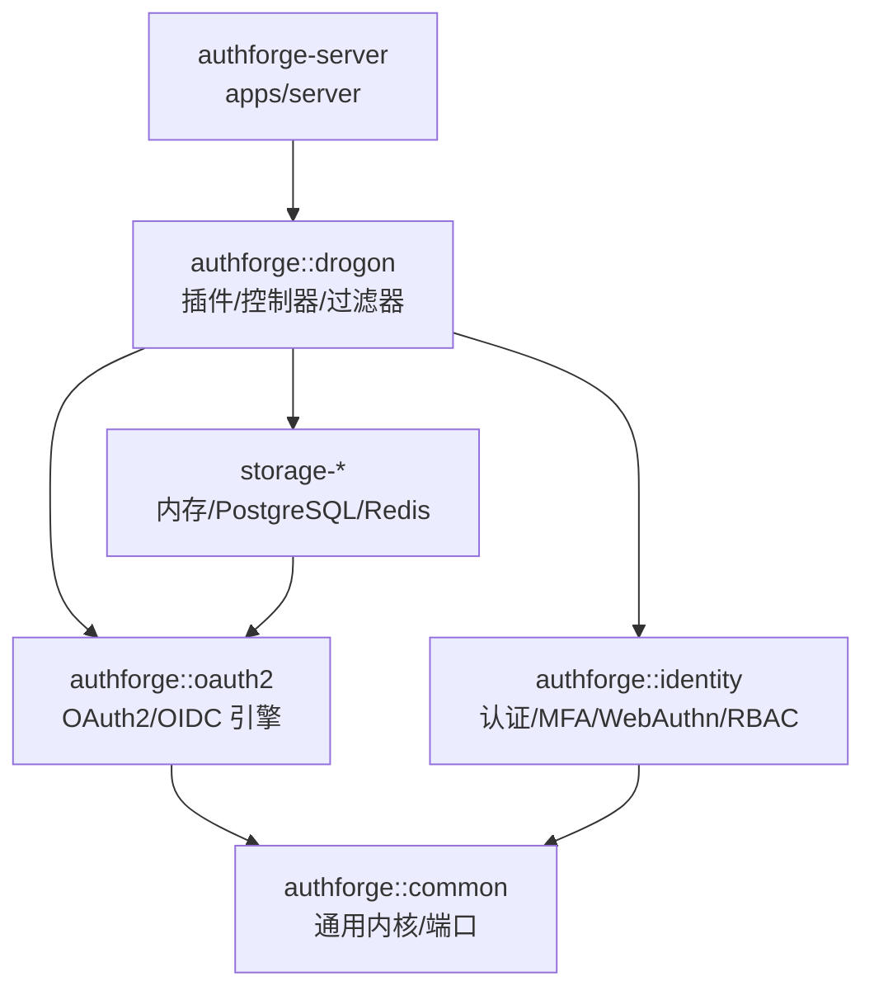
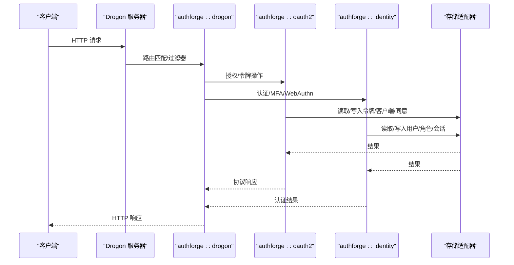
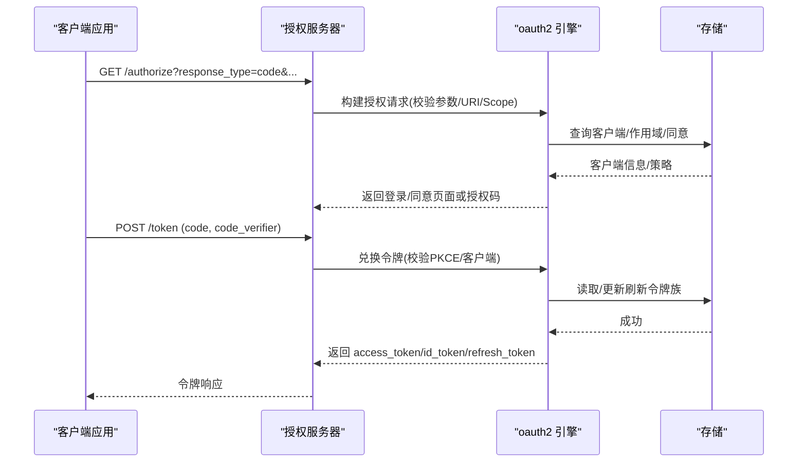
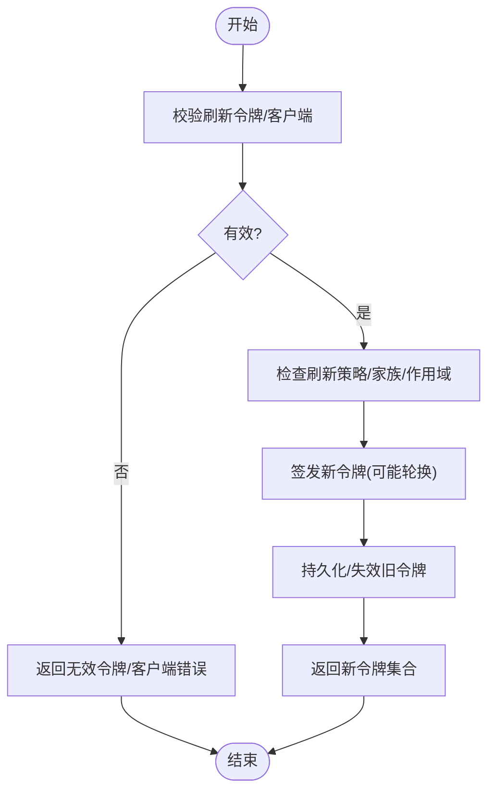
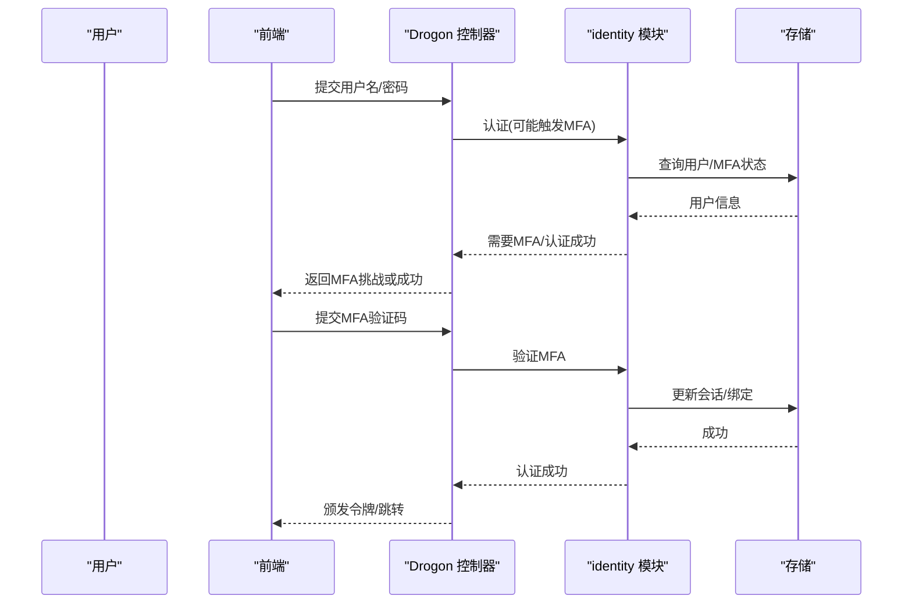
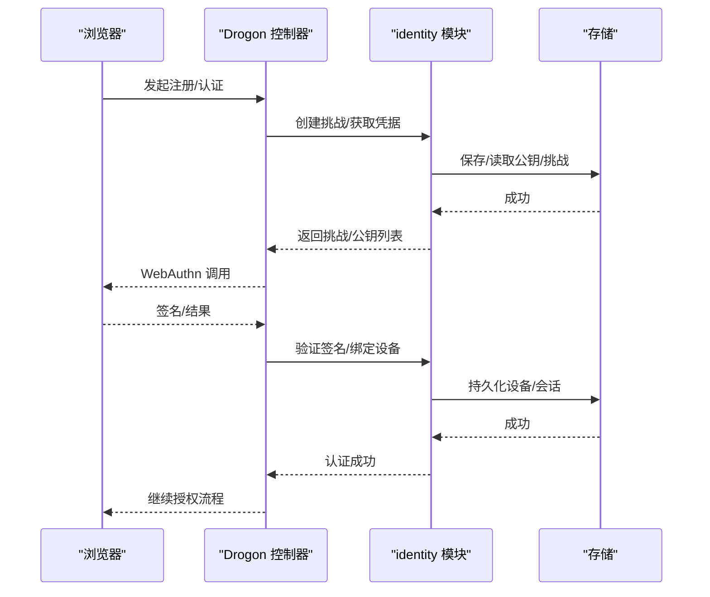
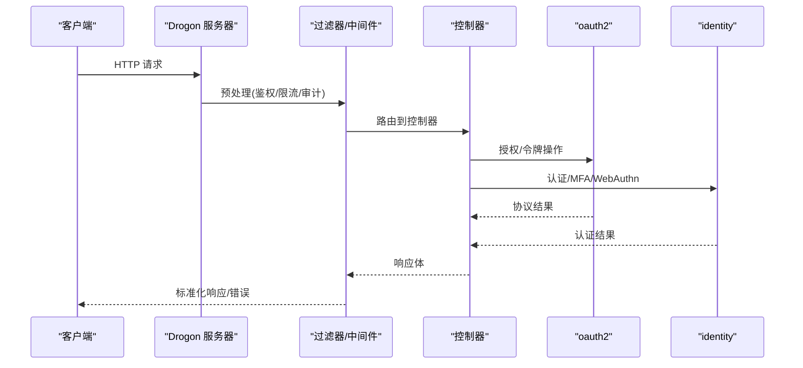
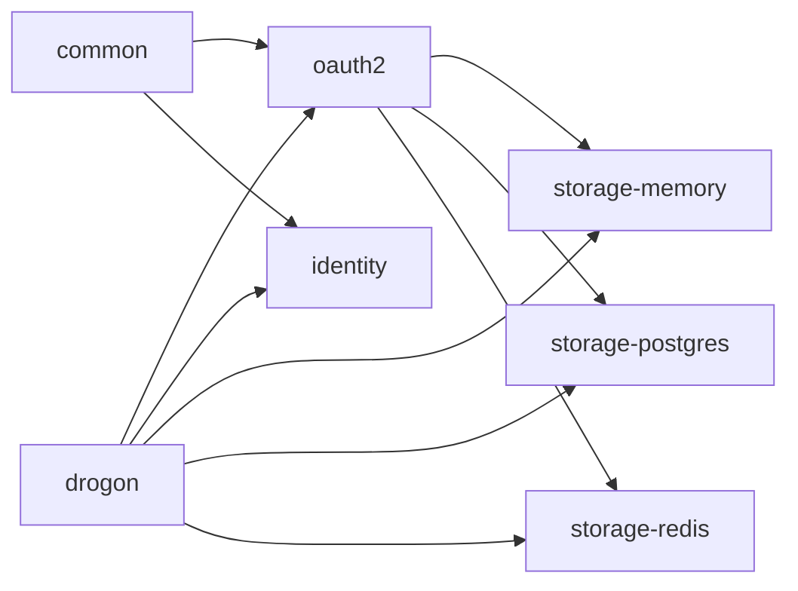

# 核心库模块

<cite>
**本文引用的文件**
- [README.md](file://README.md)
- [CMakeLists.txt](file://CMakeLists.txt)
- [conanfile.py](file://conanfile.py)
- [apps/server/src/main.cc](file://apps/server/src/main.cc)
- [apps/server/src/bootstrap/ControllerRegistration.cc](file://apps/server/src/bootstrap/ControllerRegistration.cc)
- [apps/server/src/bootstrap/OpenApiSetup.cc](file://apps/server/src/bootstrap/OpenApiSetup.cc)
- [apps/server/src/bootstrap/IdentityAssembly.cc](file://apps/server/src/bootstrap/IdentityAssembly.cc)
- [apps/server/openapi.yaml](file://apps/server/openapi.yaml)
- [libs/common/CMakeLists.txt](file://libs/common/CMakeLists.txt)
- [libs/oauth2/CMakeLists.txt](file://libs/oauth2/CMakeLists.txt)
- [libs/identity/CMakeLists.txt](file://libs/identity/CMakeLists.txt)
- [libs/drogon/CMakeLists.txt](file://libs/drogon/CMakeLists.txt)
- [libs/storage-memory/CMakeLists.txt](file://libs/storage-memory/CMakeLists.txt)
- [libs/storage-postgres/CMakeLists.txt](file://libs/storage-postgres/CMakeLists.txt)
- [libs/storage-redis/CMakeLists.txt](file://libs/storage-redis/CMakeLists.txt)
- [tests/unit/config/ConfigManagerTest.cc](file://tests/unit/config/ConfigManagerTest.cc)
- [tests/unit/error/ErrorEnvelopePropertyTest.cc](file://tests/unit/error/ErrorEnvelopePropertyTest.cc)
- [tests/integration/controllers/AuthorizeEndpointHttpTest.cc](file://tests/integration/controllers/AuthorizeEndpointHttpTest.cc)
- [tests/integration/controllers/MfaEndpointHttpTest.cc](file://tests/integration/controllers/MfaEndpointHttpTest.cc)
- [tests/integration/controllers/WebAuthnHttpTest.cc](file://tests/integration/controllers/WebAuthnHttpTest.cc)
- [tests/integration/token/RefreshTokenReuseTest.cc](file://tests/integration/token/RefreshTokenReuseTest.cc)
</cite>

## 目录
1. [简介](#简介)
2. [项目结构](#项目结构)
3. [核心组件](#核心组件)
4. [架构总览](#架构总览)
5. [详细组件分析](#详细组件分析)
6. [依赖关系分析](#依赖关系分析)
7. [性能考虑](#性能考虑)
8. [故障排查指南](#故障排查指南)
9. [结论](#结论)
10. [附录](#附录)

## 简介
本文件面向 AuthForge 核心 SDK 库模块，系统性说明各子库的职责、接口边界与使用方式，重点覆盖：
- authforge::common：通用工具、错误处理、配置管理、日志等基础能力。
- authforge::oauth2：OAuth2/OIDC 协议引擎，涵盖令牌生命周期、客户端认证、授权流程等。
- authforge::identity：用户认证、MFA（TOTP）、WebAuthn 集成、RBAC 权限控制。
- authforge::drogon：Web 控制器、中间件/过滤器、OpenAPI 文档生成与注册。
- 存储适配器：内存、PostgreSQL、Redis 的差异与选型建议。
并提供基于测试与示例的集成要点与最佳实践指引。

## 项目结构
AuthForge 采用分层与可插拔设计，SDK 以 CMake/Conan 形式发布，支持 find_package 嵌入宿主应用。顶层 README 给出了整体架构与依赖方向约束（领域层不依赖 Drogon），并通过 CI 中的 arch-guard 校验。

图表来源
- [README.md:31-49](file://README.md#L31-L49)

章节来源
- [README.md:16-51](file://README.md#L16-L51)
- [CMakeLists.txt:1-50](file://CMakeLists.txt#L1-L50)

## 核心组件
- authforge::common：提供跨模块复用的工具类与实用函数，包括错误封装、配置加载、日志抽象、加密/哈希、速率限制、邮箱规范化等。通过单元测试验证行为契约（如错误信封格式、配置迁移）。
- authforge::oauth2：实现 OAuth2/OIDC 协议栈，包含授权码+PKCE、客户端凭证、刷新令牌、令牌检查/撤销、OIDC Discovery/JWKS、设备授权、动态客户端注册等；负责令牌签发、校验、家庭刷新令牌、作用域与同意策略。
- authforge::identity：用户注册/登录、密码重置、邮箱验证、MFA（TOTP）、WebAuthn（FIDO2）以及 RBAC 角色/作用域/同意三重校验。
- authforge::drogon：Drogon 适配层，暴露 Web 控制器、过滤器/中间件、OpenAPI 文档生成与路由注册，将上层能力以 HTTP API 暴露。
- 存储适配器：memory/postgres/redis 分别实现统一存储接口，用于持久化或缓存 OAuth2/身份数据。

章节来源
- [libs/common/CMakeLists.txt:1-50](file://libs/common/CMakeLists.txt#L1-L50)
- [libs/oauth2/CMakeLists.txt:1-50](file://libs/oauth2/CMakeLists.txt#L1-L50)
- [libs/identity/CMakeLists.txt:1-50](file://libs/identity/CMakeLists.txt#L1-L50)
- [libs/drogon/CMakeLists.txt:1-50](file://libs/drogon/CMakeLists.txt#L1-L50)
- [libs/storage-memory/CMakeLists.txt:1-50](file://libs/storage-memory/CMakeLists.txt#L1-L50)
- [libs/storage-postgres/CMakeLists.txt:1-50](file://libs/storage-postgres/CMakeLists.txt#L1-L50)
- [libs/storage-redis/CMakeLists.txt:1-50](file://libs/storage-redis/CMakeLists.txt#L1-L50)

## 架构总览
AuthForge 的运行时由“服务端 + SDK 库”组成：
- apps/server 作为 Drogon 应用入口，启动时完成控制器注册、CORS、异常处理器、OpenAPI、身份装配、数据库迁移等。
- libs/* 为可独立发布的 SDK 包，按依赖方向组织：drogon → oauth2/identity/storage-* → common。
- 存储后端可选：内存（开发/测试）、PostgreSQL（生产持久化）、Redis（会话/缓存/限流）。

图表来源
- [apps/server/src/main.cc:1-200](file://apps/server/src/main.cc#L1-L200)
- [apps/server/src/bootstrap/ControllerRegistration.cc:1-200](file://apps/server/src/bootstrap/ControllerRegistration.cc#L1-L200)
- [apps/server/src/bootstrap/OpenApiSetup.cc:1-200](file://apps/server/src/bootstrap/OpenApiSetup.cc#L1-L200)
- [apps/server/src/bootstrap/IdentityAssembly.cc:1-200](file://apps/server/src/bootstrap/IdentityAssembly.cc#L1-L200)

章节来源
- [README.md:31-49](file://README.md#L31-L49)
- [apps/server/src/main.cc:1-200](file://apps/server/src/main.cc#L1-L200)

## 详细组件分析

### authforge::common：通用内核与工具
- 职责
  - 错误处理：统一的错误信封、错误码分类、HTTP 状态映射、WWW-Authenticate 头生成（OAuth2 场景）。
  - 配置管理：多源配置加载（JSON/环境变量/迁移）、键值访问、默认值与类型安全。
  - 日志系统：结构化日志、分级输出、可插接后端。
  - 实用工具：加密/哈希、随机数、时间戳、邮箱规范化、速率限制、URL/重定向 URI 校验等。
- 关键模式
  - 错误对象不可变构造，携带上下文信息，便于审计与追踪。
  - 配置项强类型访问，缺失时回退到默认值并记录告警。
  - 工具函数无副作用，便于单测与属性测试。
- 典型用例
  - 在 drogon 过滤器中捕获异常并转换为标准错误信封。
  - 在 oauth2 引擎中校验重定向 URI 与作用域白名单。
  - 在 identity 模块中校验密码强度与 MFA TOTP 校验。

章节来源
- [tests/unit/error/ErrorEnvelopePropertyTest.cc:1-200](file://tests/unit/error/ErrorEnvelopePropertyTest.cc#L1-L200)
- [tests/unit/config/ConfigManagerTest.cc:1-200](file://tests/unit/config/ConfigManagerTest.cc#L1-L200)

### authforge::oauth2：OAuth2/OIDC 引擎
- 职责
  - 授权流程：Authorization Code + PKCE、Device Authorization、Client Credentials、Refresh Token。
  - 令牌管理：Access/ID/Refresh Token 签发、校验、过期、撤销、家庭刷新令牌。
  - 客户端认证：client_secret、JWT bearer、公钥校验等。
  - OIDC：Discovery、JWKS、UserInfo、Consent。
  - 作用域与同意：scope 解析、最小权限原则、用户同意持久化。
- 关键流程（授权码+PKCE）

图表来源
- [tests/integration/controllers/AuthorizeEndpointHttpTest.cc:1-200](file://tests/integration/controllers/AuthorizeEndpointHttpTest.cc#L1-L200)
- [tests/integration/token/RefreshTokenReuseTest.cc:1-200](file://tests/integration/token/RefreshTokenReuseTest.cc#L1-L200)

- 关键流程（刷新令牌）

图表来源
- [tests/integration/token/RefreshTokenReuseTest.cc:1-200](file://tests/integration/token/RefreshTokenReuseTest.cc#L1-L200)

章节来源
- [libs/oauth2/CMakeLists.txt:1-50](file://libs/oauth2/CMakeLists.txt#L1-L50)
- [tests/integration/controllers/AuthorizeEndpointHttpTest.cc:1-200](file://tests/integration/controllers/AuthorizeEndpointHttpTest.cc#L1-L200)
- [tests/integration/token/RefreshTokenReuseTest.cc:1-200](file://tests/integration/token/RefreshTokenReuseTest.cc#L1-L200)

### authforge::identity：身份认证与安全
- 职责
  - 用户认证：注册、登录、密码重置、邮箱验证。
  - MFA：TOTP 设置/验证/禁用，支持绑定客户端与风险策略。
  - WebAuthn：FIDO2 注册/认证流程，兼容浏览器与平台生物识别。
  - RBAC：角色/作用域/同意三重校验，URL 模式匹配与细粒度授权。
- 典型交互（MFA）

图表来源
- [tests/integration/controllers/MfaEndpointHttpTest.cc:1-200](file://tests/integration/controllers/MfaEndpointHttpTest.cc#L1-L200)

- WebAuthn 交互

图表来源
- [tests/integration/controllers/WebAuthnHttpTest.cc:1-200](file://tests/integration/controllers/WebAuthnHttpTest.cc#L1-L200)

章节来源
- [libs/identity/CMakeLists.txt:1-50](file://libs/identity/CMakeLists.txt#L1-L50)
- [tests/integration/controllers/MfaEndpointHttpTest.cc:1-200](file://tests/integration/controllers/MfaEndpointHttpTest.cc#L1-L200)
- [tests/integration/controllers/WebAuthnHttpTest.cc:1-200](file://tests/integration/controllers/WebAuthnHttpTest.cc#L1-L200)

### authforge::drogon：Web 适配层
- 职责
  - 控制器：将 oauth2/identity/storage 能力暴露为 RESTful 端点。
  - 中间件/过滤器：鉴权、CORS、安全头、限流、审计日志、异常转换。
  - OpenAPI：从注解/声明生成 OpenAPI 文档，提供 Swagger UI 访问。
- 启动装配
  - 控制器注册、CORS 设置、异常处理器、OpenAPI 文档、身份装配、迁移执行。
- 典型请求链路

图表来源
- [apps/server/src/bootstrap/ControllerRegistration.cc:1-200](file://apps/server/src/bootstrap/ControllerRegistration.cc#L1-L200)
- [apps/server/src/bootstrap/OpenApiSetup.cc:1-200](file://apps/server/src/bootstrap/OpenApiSetup.cc#L1-L200)
- [apps/server/src/bootstrap/IdentityAssembly.cc:1-200](file://apps/server/src/bootstrap/IdentityAssembly.cc#L1-L200)

章节来源
- [apps/server/src/main.cc:1-200](file://apps/server/src/main.cc#L1-L200)
- [apps/server/src/bootstrap/ControllerRegistration.cc:1-200](file://apps/server/src/bootstrap/ControllerRegistration.cc#L1-L200)
- [apps/server/src/bootstrap/OpenApiSetup.cc:1-200](file://apps/server/src/bootstrap/OpenApiSetup.cc#L1-L200)
- [apps/server/src/bootstrap/IdentityAssembly.cc:1-200](file://apps/server/src/bootstrap/IdentityAssembly.cc#L1-L200)
- [apps/server/openapi.yaml:1-200](file://apps/server/openapi.yaml#L1-L200)

### 存储适配器：差异与使用场景
- 内存存储（storage-memory）
  - 特点：进程内内存表，零外部依赖，适合开发与本地测试。
  - 适用：快速原型、CI 环境、无需持久化的场景。
- PostgreSQL 存储（storage-postgres）
  - 特点：关系型持久化，事务与一致性保障，支持复杂查询与审计。
  - 适用：生产环境、多租户、合规审计、长期令牌与同意策略。
- Redis 存储（storage-redis）
  - 特点：高性能键值存储，适合会话、缓存、限流、短期令牌缓冲。
  - 适用：高并发读、分布式共享状态、临时数据。

选型建议
- 开发/测试：优先 memory；如需模拟真实语义，可用 postgres 容器。
- 生产：postgres 为主存储，redis 做缓存与会话；必要时引入消息队列进行异步审计。

章节来源
- [libs/storage-memory/CMakeLists.txt:1-50](file://libs/storage-memory/CMakeLists.txt#L1-L50)
- [libs/storage-postgres/CMakeLists.txt:1-50](file://libs/storage-postgres/CMakeLists.txt#L1-L50)
- [libs/storage-redis/CMakeLists.txt:1-50](file://libs/storage-redis/CMakeLists.txt#L1-L50)

## 依赖关系分析
- 依赖方向约束：领域层（oauth2/identity）不依赖 Drogon；Drogon 仅作为适配层。
- 包级依赖
  - server → drogon → oauth2/identity/storage-* → common
  - storage-* → oauth2（部分接口）
- 外部依赖
  - Conan 锁定第三方库版本，确保可重复构建。
  - 运行时依赖 PostgreSQL、Redis（生产）。

图表来源
- [README.md:31-49](file://README.md#L31-L49)
- [conanfile.py:1-200](file://conanfile.py#L1-L200)

章节来源
- [README.md:31-49](file://README.md#L31-L49)
- [conanfile.py:1-200](file://conanfile.py#L1-L200)

## 性能考虑
- 令牌与刷新令牌族：避免频繁写盘，结合 Redis 缓存热点数据；合理设置 TTL 与批量清理策略。
- 存储选择：读写密集型场景优先 Redis；一致性要求高的主数据使用 PostgreSQL。
- 过滤器与中间件：尽量轻量，避免阻塞 I/O；将耗时任务异步化。
- 连接池：数据库与 Redis 连接池大小根据并发与资源调优。
- 监控与观测：启用 Prometheus 指标与结构化审计日志，定位瓶颈。

[本节为通用指导，不直接分析具体文件]

## 故障排查指南
- 错误处理
  - 使用统一错误信封，便于前端一致化处理；检查 WWW-Authenticate 头是否符合 OAuth2 规范。
  - 参考错误属性测试，确认错误码与消息稳定性。
- 配置问题
  - 检查配置加载顺序与默认值；环境变量未生效时核对键名与类型。
- 授权流程失败
  - 核对重定向 URI、作用域、客户端配置；查看同意策略是否已拒绝。
  - 刷新令牌被拒时检查家族策略与令牌轮换。
- MFA/WebAuthn
  - 确认挑战生成与签名验证逻辑；检查浏览器兼容性与平台能力。
- 存储层
  - PostgreSQL 连接失败：检查网络、认证、迁移是否执行。
  - Redis 超时：检查连接池、内存上限与网络延迟。

章节来源
- [tests/unit/error/ErrorEnvelopePropertyTest.cc:1-200](file://tests/unit/error/ErrorEnvelopePropertyTest.cc#L1-L200)
- [tests/unit/config/ConfigManagerTest.cc:1-200](file://tests/unit/config/ConfigManagerTest.cc#L1-L200)
- [tests/integration/controllers/AuthorizeEndpointHttpTest.cc:1-200](file://tests/integration/controllers/AuthorizeEndpointHttpTest.cc#L1-L200)
- [tests/integration/controllers/MfaEndpointHttpTest.cc:1-200](file://tests/integration/controllers/MfaEndpointHttpTest.cc#L1-L200)
- [tests/integration/controllers/WebAuthnHttpTest.cc:1-200](file://tests/integration/controllers/WebAuthnHttpTest.cc#L1-L200)
- [tests/integration/token/RefreshTokenReuseTest.cc:1-200](file://tests/integration/token/RefreshTokenReuseTest.cc#L1-L200)

## 结论
AuthForge 的核心库模块以清晰的依赖方向与可插拔存储实现了生产级的 OAuth2/OIDC 授权服务。common 提供稳定内核，oauth2 与 identity 专注领域能力，drogon 作为适配层暴露 API，存储适配器满足不同部署需求。通过完善的测试与文档，开发者可以快速集成并扩展功能。

[本节为总结性内容，不直接分析具体文件]

## 附录
- 快速上手
  - Docker Compose 一键启动后端、前端与管理台。
  - 源码构建：Conan + CMake Presets，运行 CTest 套件。
  - SDK 消费：find_package(authforge-drogon) 或仅 oauth2 + storage-memory。
- 文档索引
  - 架构概览、安全架构、RBAC 指南、SDK 集成指南、运行时契约、API 参考、生产部署、配置指南、可观测性、账户锁定等。

章节来源
- [README.md:137-198](file://README.md#L137-L198)
- [README.md:286-304](file://README.md#L286-L304)