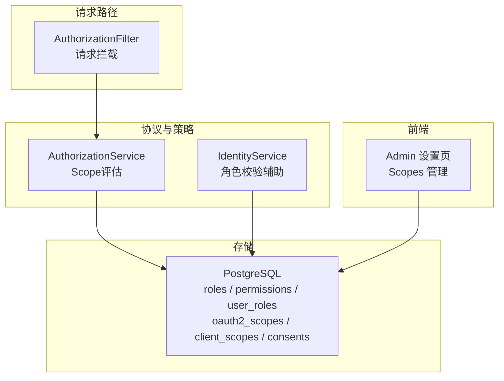
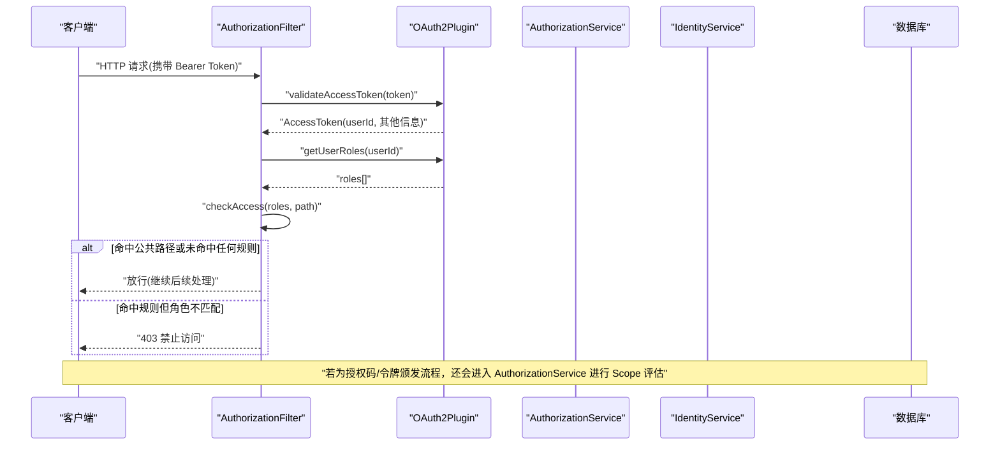
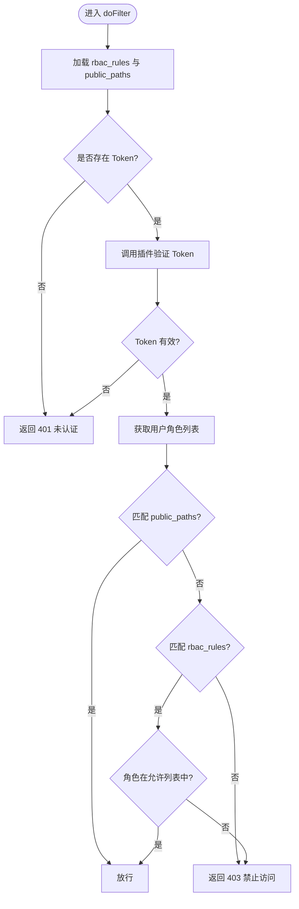
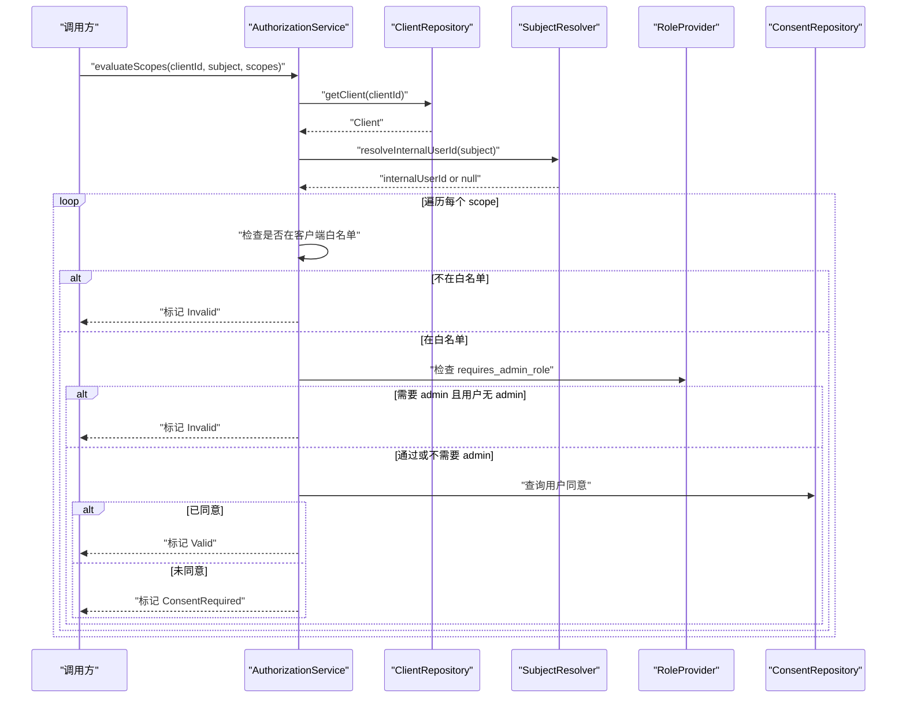
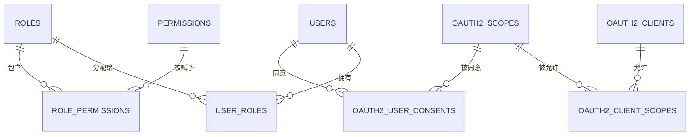
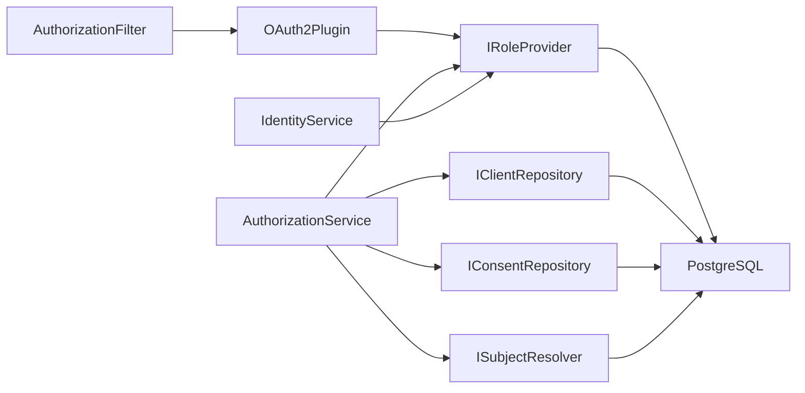

# RBAC权限控制系统

<cite>
**本文引用的文件**
- [AuthorizationFilter.cc](file://libs/drogon/src/filters/AuthorizationFilter.cc)
- [rbac-guide.md](file://docs/backend/rbac-guide.md)
- [V005__rbac_schema.sql](file://apps/server/migrations/V005__rbac_schema.sql)
- [V006__oauth2_scopes.sql](file://apps/server/migrations/V006__oauth2_scopes.sql)
- [AuthorizationService.cc](file://libs/oauth2/src/protocol/AuthorizationService.cc)
- [ScopeDecision.h](file://libs/oauth2/include/authforge/oauth2/access/ScopeDecision.h)
- [IdentityService.cc](file://libs/drogon/src/services/IdentityService.cc)
- [Oauth2Scopes.cc](file://libs/storage-postgres/src/models/Oauth2Scopes.cc)
- [SettingsPage.vue](file://frontends/admin/src/pages/settings/SettingsPage.vue)
- [Property4_RbacDecisionBaselineTest.cc](file://tests/integration/concurrency/Property4_RbacDecisionBaselineTest.cc)
</cite>

## 目录
1. [简介](#简介)
2. [项目结构](#项目结构)
3. [核心组件](#核心组件)
4. [架构总览](#架构总览)
5. [详细组件分析](#详细组件分析)
6. [依赖关系分析](#依赖关系分析)
7. [性能考虑](#性能考虑)
8. [故障排查指南](#故障排查指南)
9. [结论](#结论)
10. [附录](#附录)

## 简介
本文件系统性地说明 AuthForge 的 RBAC（基于角色的访问控制）与 OAuth2 Scope（权限范围）能力，覆盖角色管理、权限范围定义与管理、请求拦截与授权决策流程、以及“三重作用域控制模型”的设计与实践。文档面向不同技术背景的读者，提供从概念到实现、从配置到排错的完整指引。

## 项目结构
RBAC 与 Scope 相关能力分布在以下位置：
- 数据库迁移：角色、权限、用户-角色关联、OAuth2 Scopes、客户端-Scopes、用户同意记录等表结构
- 过滤器层：请求级 RBAC 拦截与鉴权
- 协议层：OAuth2 Scope 评估与同意流程
- 存储层：PostgreSQL ORM 模型与查询
- 前端管理：Scopes 列表与编辑界面
- 集成测试：RBAC 决策基线验证

图表来源
- [AuthorizationFilter.cc:22-80](file://libs/drogon/src/filters/AuthorizationFilter.cc#L22-L80)
- [AuthorizationService.cc:54-83](file://libs/oauth2/src/protocol/AuthorizationService.cc#L54-L83)
- [V005__rbac_schema.sql:1-59](file://apps/server/migrations/V005__rbac_schema.sql#L1-L59)
- [V006__oauth2_scopes.sql:1-55](file://apps/server/migrations/V006__oauth2_scopes.sql#L1-L55)

章节来源
- [rbac-guide.md:1-83](file://docs/backend/rbac-guide.md#L1-L83)
- [V005__rbac_schema.sql:1-59](file://apps/server/migrations/V005__rbac_schema.sql#L1-L59)
- [V006__oauth2_scopes.sql:1-55](file://apps/server/migrations/V006__oauth2_scopes.sql#L1-L55)

## 核心组件
- 请求级 RBAC 过滤器：负责解析 Token、获取用户角色、匹配 URL 规则并放行或拒绝
- OAuth2 Scope 评估服务：按“客户端白名单 -> 管理员角色要求 -> 用户同意”的三层顺序评估每个 Scope
- 身份服务：提供角色校验辅助方法（如检查是否需 admin 角色）
- 存储模型：封装对 roles、permissions、user_roles、oauth2_scopes、client_scopes、consents 等表的读写
- 前端管理：提供 Scopes 的查看、创建、编辑、删除能力

章节来源
- [AuthorizationFilter.cc:82-193](file://libs/drogon/src/filters/AuthorizationFilter.cc#L82-L193)
- [AuthorizationService.cc:54-83](file://libs/oauth2/src/protocol/AuthorizationService.cc#L54-L83)
- [IdentityService.cc:176-225](file://libs/drogon/src/services/IdentityService.cc#L176-L225)
- [Oauth2Scopes.cc:18-35](file://libs/storage-postgres/src/models/Oauth2Scopes.cc#L18-L35)
- [SettingsPage.vue:92-115](file://frontends/admin/src/pages/settings/SettingsPage.vue#L92-L115)

## 架构总览
下图展示一次受保护 API 请求的 RBAC 与 Scope 联合鉴权流程：

图表来源
- [AuthorizationFilter.cc:97-193](file://libs/drogon/src/filters/AuthorizationFilter.cc#L97-L193)
- [AuthorizationService.cc:54-83](file://libs/oauth2/src/protocol/AuthorizationService.cc#L54-L83)

## 详细组件分析

### 请求级 RBAC 过滤器（AuthorizationFilter）
- 功能要点
  - 加载配置：从应用配置中读取 rbac_rules（URL 正则到允许角色集合）与 public_paths（无需鉴权的公开路径）
  - 提取 Token：优先从 Authorization 头解析，其次从 query 参数 access_token
  - 验证 Token：调用 OAuth2Plugin 校验，失败返回 401，并附带 WWW-Authenticate 挑战头
  - 获取角色：通过 userId 查询用户角色集合
  - 访问判定：先匹配 public_paths，再匹配 rbac_rules；命中且角色满足则放行，否则 403
- 关键行为
  - 线程安全地加载规则，避免并发下的部分填充问题
  - 默认拒绝：未命中任何规则即拒绝
- 错误处理
  - 无 Token：返回 401
  - Token 无效/过期：返回 401，并包含 RFC 6750 要求的 WWW-Authenticate 头
  - 权限不足：返回 403

图表来源
- [AuthorizationFilter.cc:22-80](file://libs/drogon/src/filters/AuthorizationFilter.cc#L22-L80)
- [AuthorizationFilter.cc:97-228](file://libs/drogon/src/filters/AuthorizationFilter.cc#L97-L228)

章节来源
- [AuthorizationFilter.cc:22-228](file://libs/drogon/src/filters/AuthorizationFilter.cc#L22-L228)
- [Property4_RbacDecisionBaselineTest.cc:184-199](file://tests/integration/concurrency/Property4_RbacDecisionBaselineTest.cc#L184-L199)

### OAuth2 Scope 评估服务（AuthorizationService）
- 三层评估顺序
  1) 客户端白名单：仅当 Scope 被客户端显式允许时才可授予
  2) 管理员角色要求：若 Scope 标记为 requires_admin_role，则必须拥有 admin 角色
  3) 用户同意：若前两层通过但用户尚未同意该 Scope，则返回 ConsentRequired
- 聚合结果
  - 将每个 Scope 的决策汇总为 valid、invalid、consentRequired 三类清单
- 与角色提供者协作
  - 通过 roleProvider_ 判断是否需要管理员角色，并在需要时校验当前用户的角色

图表来源
- [AuthorizationService.cc:54-83](file://libs/oauth2/src/protocol/AuthorizationService.cc#L54-L83)
- [ScopeDecision.h:32-63](file://libs/oauth2/include/authforge/oauth2/access/ScopeDecision.h#L32-L63)

章节来源
- [AuthorizationService.cc:54-83](file://libs/oauth2/src/protocol/AuthorizationService.cc#L54-L83)
- [ScopeDecision.h:32-63](file://libs/oauth2/include/authforge/oauth2/access/ScopeDecision.h#L32-L63)

### 身份服务中的角色校验辅助（IdentityService）
- 用途：在涉及 Scope 的场景中，快速判断是否存在需要管理员角色的 Scope，并据此校验用户是否具备 admin 角色
- 行为：若无需要管理员角色的 Scope，直接通过；否则查询用户角色并校验

章节来源
- [IdentityService.cc:176-225](file://libs/drogon/src/services/IdentityService.cc#L176-L225)

### 数据存储模型（PostgreSQL）
- RBAC 基础表
  - roles：角色（含默认 admin、user）
  - permissions：权限（含默认 user:read/user:write/user:delete/admin:access）
  - user_roles：用户-角色多对多
  - role_permissions：角色-权限多对多
- OAuth2 Scopes 扩展
  - oauth2_scopes：名称、描述、映射角色、是否默认、是否需管理员角色
  - oauth2_client_scopes：客户端允许的 Scope 集合
  - oauth2_user_consents：用户对某客户端的 Scope 同意记录
  - oauth2_subject_mappings：外部 subject 到内部用户 ID 的映射

图表来源
- [V005__rbac_schema.sql:1-59](file://apps/server/migrations/V005__rbac_schema.sql#L1-L59)
- [V006__oauth2_scopes.sql:1-55](file://apps/server/migrations/V006__oauth2_scopes.sql#L1-L55)

章节来源
- [V005__rbac_schema.sql:1-59](file://apps/server/migrations/V005__rbac_schema.sql#L1-L59)
- [V006__oauth2_scopes.sql:1-55](file://apps/server/migrations/V006__oauth2_scopes.sql#L1-L55)
- [Oauth2Scopes.cc:18-35](file://libs/storage-postgres/src/models/Oauth2Scopes.cc#L18-L35)

### 前端管理（Scopes 页面）
- 提供 Scopes 列表视图，展示名称、描述、映射角色、是否默认、是否管理员专用等字段
- 支持创建、编辑、删除自定义 Scope（内置 Scope 通常不可删除）

章节来源
- [SettingsPage.vue:92-115](file://frontends/admin/src/pages/settings/SettingsPage.vue#L92-L115)

## 依赖关系分析
- AuthorizationFilter 依赖 OAuth2Plugin 完成 Token 校验与角色获取
- AuthorizationService 依赖 ClientRepository、ConsentRepository、SubjectResolver、RoleProvider 完成 Scope 评估
- IdentityService 提供角色校验辅助，依赖 RoleProvider
- 存储层通过 Postgres ORM 模型访问数据库表

图表来源
- [AuthorizationFilter.cc:17-20](file://libs/drogon/src/filters/AuthorizationFilter.cc#L17-L20)
- [AuthorizationService.cc:41-51](file://libs/oauth2/src/protocol/AuthorizationService.cc#L41-L51)
- [IdentityService.cc:176-225](file://libs/drogon/src/services/IdentityService.cc#L176-L225)

章节来源
- [AuthorizationFilter.cc:17-20](file://libs/drogon/src/filters/AuthorizationFilter.cc#L17-L20)
- [AuthorizationService.cc:41-51](file://libs/oauth2/src/protocol/AuthorizationService.cc#L41-L51)
- [IdentityService.cc:176-225](file://libs/drogon/src/services/IdentityService.cc#L176-L225)

## 性能考虑
- 规则加载优化：AuthorizationFilter 使用一次性初始化与原子交换，避免重复编译正则与并发写入
- 默认拒绝策略：减少不必要的数据库查询，仅在必要时触发
- Scope 评估缓存建议：可结合 Redis 缓存用户角色与同意状态，降低热点路径延迟
- 索引优化：数据库迁移已为常用查询建立索引（如 user_roles、role_permissions、consents 等）

[本节为通用指导，不直接分析具体文件]

## 故障排查指南
- 401 未认证
  - 检查请求是否携带有效的 Bearer Token 或 access_token 参数
  - 确认 OAuth2Plugin 可用且 Token 校验通过
  - 参考：[AuthorizationFilter.cc:97-167](file://libs/drogon/src/filters/AuthorizationFilter.cc#L97-L167)
- 403 禁止访问
  - 检查 rbac_rules 是否正确配置，URL 是否命中规则
  - 检查用户是否具备所需角色
  - 参考：[AuthorizationFilter.cc:169-228](file://libs/drogon/src/filters/AuthorizationFilter.cc#L169-L228)
- Scope 评估失败
  - 检查客户端是否允许该 Scope
  - 若 Scope 需要管理员角色，确认用户具有 admin 角色
  - 若用户未同意，引导走同意流程
  - 参考：[AuthorizationService.cc:54-83](file://libs/oauth2/src/protocol/AuthorizationService.cc#L54-L83)、[ScopeDecision.h:32-63](file://libs/oauth2/include/authforge/oauth2/access/ScopeDecision.h#L32-L63)
- 数据一致性
  - 确认迁移脚本已执行，默认角色与权限已插入
  - 参考：[V005__rbac_schema.sql:35-59](file://apps/server/migrations/V005__rbac_schema.sql#L35-L59)、[V006__oauth2_scopes.sql:46-55](file://apps/server/migrations/V006__oauth2_scopes.sql#L46-L55)

章节来源
- [AuthorizationFilter.cc:97-228](file://libs/drogon/src/filters/AuthorizationFilter.cc#L97-L228)
- [AuthorizationService.cc:54-83](file://libs/oauth2/src/protocol/AuthorizationService.cc#L54-L83)
- [ScopeDecision.h:32-63](file://libs/oauth2/include/authforge/oauth2/access/ScopeDecision.h#L32-L63)
- [V005__rbac_schema.sql:35-59](file://apps/server/migrations/V005__rbac_schema.sql#L35-L59)
- [V006__oauth2_scopes.sql:46-55](file://apps/server/migrations/V006__oauth2_scopes.sql#L46-L55)

## 结论
AuthForge 的 RBAC 与 OAuth2 Scope 体系通过“请求级角色拦截 + 协议级 Scope 评估 + 存储层细粒度控制”形成闭环。RBAC 过滤器保障资源路径的安全边界，AuthorizationService 以三层顺序确保 Scope 授予的严谨性，配合数据库迁移与前端管理能力，可满足企业级权限治理需求。建议在大规模部署中引入缓存与审计日志，进一步提升性能与可观测性。

[本节为总结性内容，不直接分析具体文件]

## 附录

### 三重作用域控制模型
- 第一重：客户端白名单——只有被客户端明确允许的 Scope 才可能被授予
- 第二重：管理员角色要求——若 Scope 标记为 requires_admin_role，则必须拥有 admin 角色
- 第三重：用户同意——即使前两重通过，仍需用户明确同意才会授予
- 该模型确保最小权限原则与用户知情同意，适用于敏感数据与高特权操作

章节来源
- [AuthorizationService.cc:54-83](file://libs/oauth2/src/protocol/AuthorizationService.cc#L54-L83)
- [ScopeDecision.h:32-63](file://libs/oauth2/include/authforge/oauth2/access/ScopeDecision.h#L32-L63)

### 权限配置示例与管理 API 参考
- 配置项
  - rbac_rules：URL 正则到允许角色集合的映射（OR 逻辑）
  - public_paths：无需鉴权的公开路径列表
- 管理入口
  - 前端 Scopes 管理页面用于查看与编辑 Scope 元数据（名称、描述、映射角色、是否默认、是否管理员专用）
- 最佳实践
  - 将敏感 Scope 标记为 requires_admin_role，并通过角色管理限制授予
  - 使用最小权限原则，仅开放必要的 Scope 给客户端
  - 定期审查用户同意记录与客户端允许列表

章节来源
- [rbac-guide.md:41-69](file://docs/backend/rbac-guide.md#L41-L69)
- [SettingsPage.vue:92-115](file://frontends/admin/src/pages/settings/SettingsPage.vue#L92-L115)

### 常见问题解决方案
- 无法访问管理接口
  - 确认用户已分配 admin 角色，且请求路径命中 rbac_rules
  - 参考：[rbac-guide.md:71-82](file://docs/backend/rbac-guide.md#L71-L82)
- Scope 始终需要同意
  - 检查用户是否已对该客户端授予对应 Scope 的同意
  - 参考：[V006__oauth2_scopes.sql:19-26](file://apps/server/migrations/V006__oauth2_scopes.sql#L19-L26)
- 管理员 Scope 被拒绝
  - 确认用户具备 admin 角色
  - 参考：[IdentityService.cc:176-225](file://libs/drogon/src/services/IdentityService.cc#L176-L225)

章节来源
- [rbac-guide.md:71-82](file://docs/backend/rbac-guide.md#L71-L82)
- [V006__oauth2_scopes.sql:19-26](file://apps/server/migrations/V006__oauth2_scopes.sql#L19-L26)
- [IdentityService.cc:176-225](file://libs/drogon/src/services/IdentityService.cc#L176-L225)