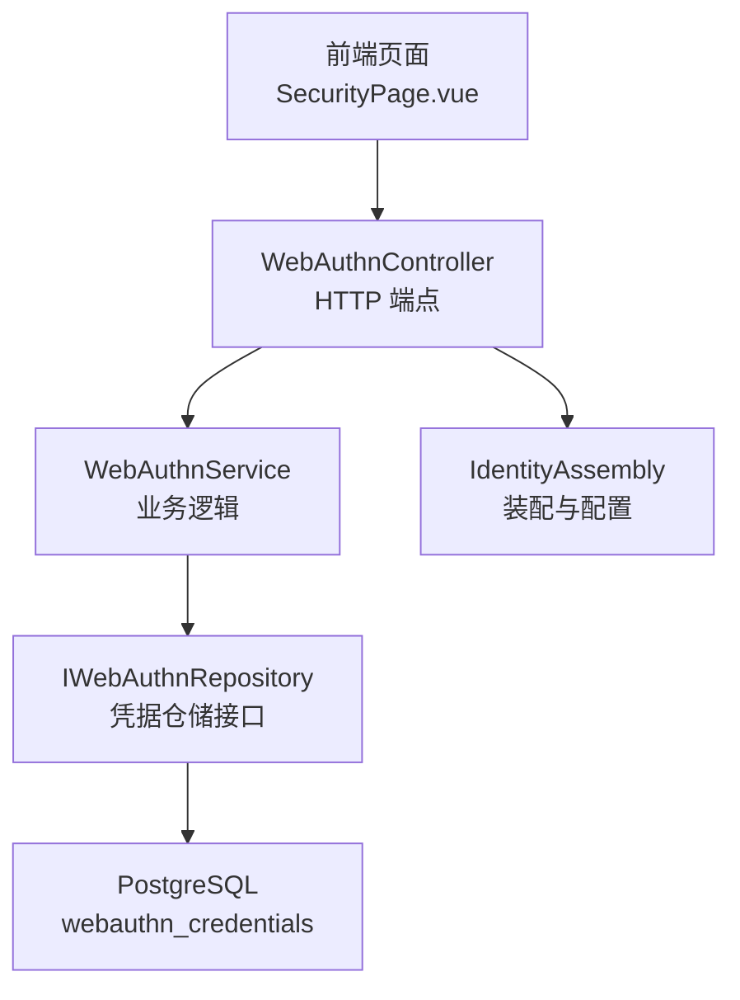
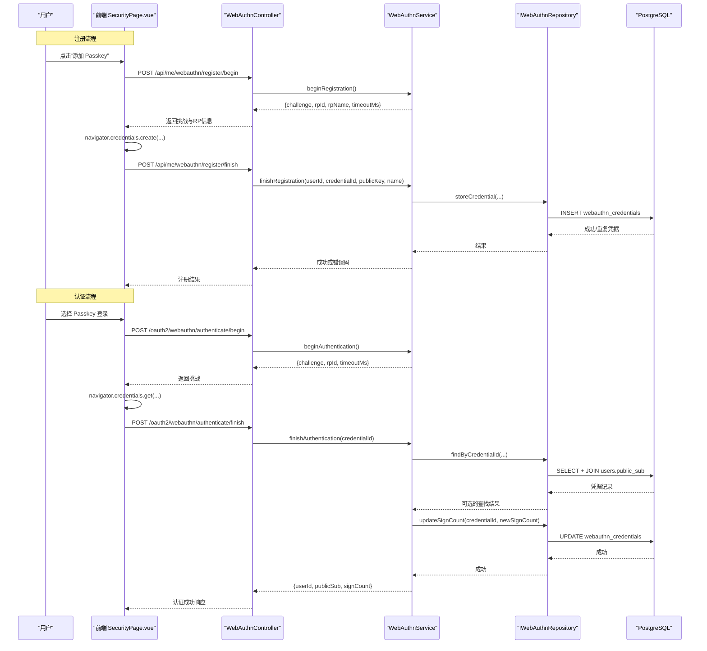
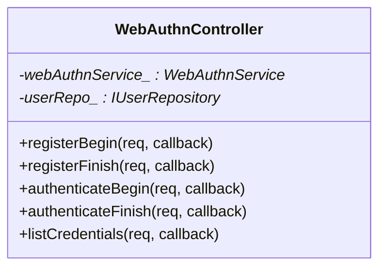
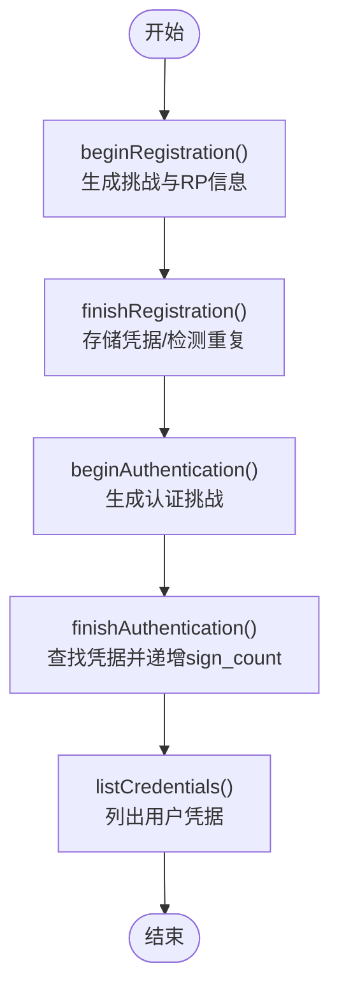
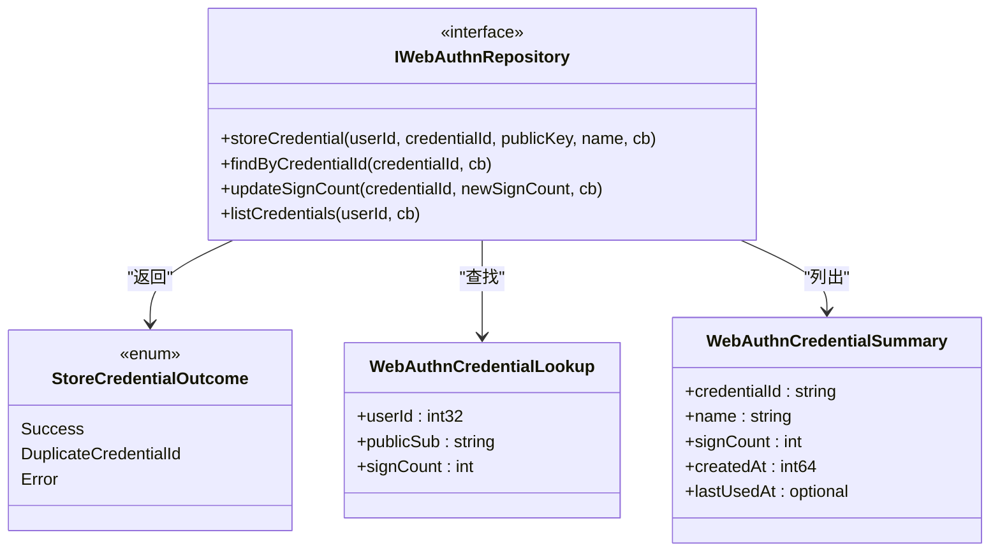
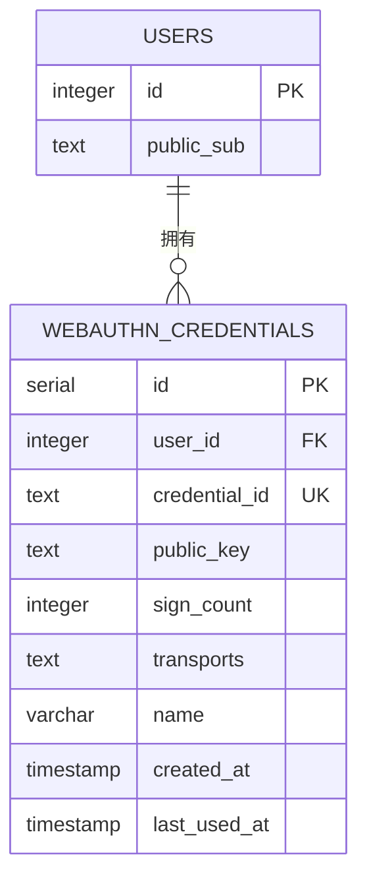
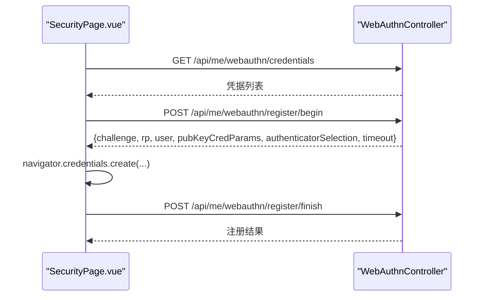
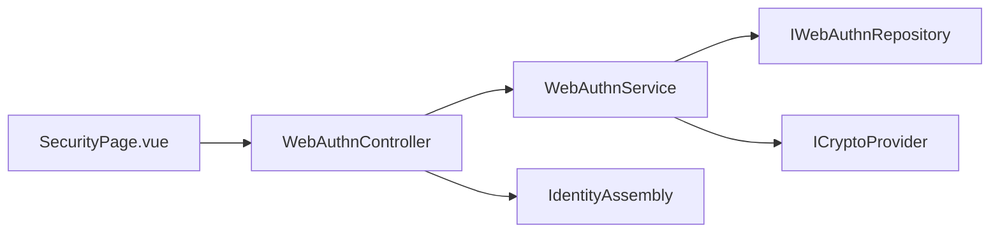

# WebAuthn生物识别集成

<cite>
**本文引用的文件**
- [WebAuthnController.h](file://libs/drogon/include/authforge/drogon/controllers/WebAuthnController.h)
- [WebAuthnController.cc](file://libs/drogon/src/controllers/WebAuthnController.cc)
- [WebAuthnService.h](file://libs/identity/include/authforge/identity/WebAuthnService.h)
- [IWebAuthnRepository.h](file://libs/identity/include/authforge/identity/IWebAuthnRepository.h)
- [IdentityAssembly.cc](file://apps/server/src/bootstrap/IdentityAssembly.cc)
- [V018__webauthn.sql](file://apps/server/migrations/V018__webauthn.sql)
- [SecurityPage.vue](file://frontends/user/src/pages/account/SecurityPage.vue)
- [account.spec.ts](file://frontends/user/tests/e2e/account.spec.ts)
- [MfaController.cc](file://libs/drogon/src/controllers/MfaController.cc)
- [V011__mfa_support.sql](file://apps/server/migrations/V011__mfa_support.sql)
</cite>

## 目录
1. [简介](#简介)
2. [项目结构](#项目结构)
3. [核心组件](#核心组件)
4. [架构总览](#架构总览)
5. [详细组件分析](#详细组件分析)
6. [依赖关系分析](#依赖关系分析)
7. [性能与兼容性](#性能与兼容性)
8. [故障排查指南](#故障排查指南)
9. [结论](#结论)
10. [附录](#附录)

## 简介
本文件面向在项目中集成 WebAuthn（Passkey）与生物识别认证的技术文档，覆盖 FIDO2 协议支持、Passkey 注册与认证流程、设备管理、凭据存储与更新、与 MFA 的组合使用方案，以及前端示例与浏览器兼容性说明。当前实现聚焦于身份层（identity）的凭据生命周期管理与认证计数维护，控制器负责路由与请求处理，数据库持久化凭据元数据与签名计数。

## 项目结构
本项目采用分层与模块化组织：
- 控制器层（Drogon HTTP）：提供 WebAuthn 注册、认证、凭据列表等端点。
- 服务层（Identity）：封装 WebAuthn 业务逻辑（挑战生成、凭据存储、认证计数）。
- 存储层（Postgres）：通过迁移脚本创建 webauthn_credentials 表并索引。
- 前端（Vue SPA）：调用浏览器 WebAuthn API 完成 Passkey 注册与登录交互。
- 装配层：启动时注入 WebAuthnService、仓库与配置（rp_id/rp_name）。

图表来源
- [WebAuthnController.h:50-81](file://libs/drogon/include/authforge/drogon/controllers/WebAuthnController.h#L50-L81)
- [WebAuthnService.h:127-223](file://libs/identity/include/authforge/identity/WebAuthnService.h#L127-L223)
- [IWebAuthnRepository.h:92-133](file://libs/identity/include/authforge/identity/IWebAuthnRepository.h#L92-L133)
- [V018__webauthn.sql:1-16](file://apps/server/migrations/V018__webauthn.sql#L1-L16)
- [IdentityAssembly.cc:103-140](file://apps/server/src/bootstrap/IdentityAssembly.cc#L103-L140)

章节来源
- [WebAuthnController.h:50-81](file://libs/drogon/include/authforge/drogon/controllers/WebAuthnController.h#L50-L81)
- [IdentityAssembly.cc:103-140](file://apps/server/src/bootstrap/IdentityAssembly.cc#L103-L140)
- [V018__webauthn.sql:1-16](file://apps/server/migrations/V018__webauthn.sql#L1-L16)

## 核心组件
- WebAuthnController：定义注册、认证、凭据管理的 HTTP 端点，并可选择性地委派给 WebAuthnService。
- WebAuthnService：生成挑战、完成注册、完成认证（查找凭据并递增 sign_count）、列出用户凭据。
- IWebAuthnRepository：抽象凭据存储操作（存储、查找、更新计数、列出）。
- IdentityAssembly：装配 WebAuthnService、仓库与 rp_id/rp_name 配置，并将服务注入控制器。
- 数据库迁移 V018：创建 webauthn_credentials 表及必要索引。
- 前端 SecurityPage.vue：调用浏览器 WebAuthn API，发起注册与认证流程，展示已注册凭据。

章节来源
- [WebAuthnController.h:21-81](file://libs/drogon/include/authforge/drogon/controllers/WebAuthnController.h#L21-L81)
- [WebAuthnService.h:79-223](file://libs/identity/include/authforge/identity/WebAuthnService.h#L79-L223)
- [IWebAuthnRepository.h:40-133](file://libs/identity/include/authforge/identity/IWebAuthnRepository.h#L40-L133)
- [IdentityAssembly.cc:103-140](file://apps/server/src/bootstrap/IdentityAssembly.cc#L103-L140)
- [V018__webauthn.sql:1-16](file://apps/server/migrations/V018__webauthn.sql#L1-L16)
- [SecurityPage.vue:89-148](file://frontends/user/src/pages/account/SecurityPage.vue#L89-L148)

## 架构总览
下图展示了从前端到后端再到数据库的完整调用链，包括注册与认证两个主要流程。

图表来源
- [WebAuthnController.h:50-81](file://libs/drogon/include/authforge/drogon/controllers/WebAuthnController.h#L50-L81)
- [WebAuthnService.h:147-216](file://libs/identity/include/authforge/identity/WebAuthnService.h#L147-L216)
- [IWebAuthnRepository.h:102-133](file://libs/identity/include/authforge/identity/IWebAuthnRepository.h#L102-L133)
- [V018__webauthn.sql:1-16](file://apps/server/migrations/V018__webauthn.sql#L1-L16)

## 详细组件分析

### WebAuthnController（HTTP 端点）
- 注册流程端点：
  - /api/me/webauthn/register/begin：需要已登录，返回挑战与 RP 信息。
  - /api/me/webauthn/register/finish：提交客户端生成的凭据与公钥材料。
- 认证流程端点：
  - /oauth2/webauthn/authenticate/begin：无需登录，返回挑战。
  - /oauth2/webauthn/authenticate/finish：提交凭据标识以完成认证。
- 凭据管理端点：
  - /api/me/webauthn/credentials：列出当前用户的凭据摘要。

图表来源
- [WebAuthnController.h:28-108](file://libs/drogon/include/authforge/drogon/controllers/WebAuthnController.h#L28-L108)

章节来源
- [WebAuthnController.h:50-81](file://libs/drogon/include/authforge/drogon/controllers/WebAuthnController.h#L50-L81)

### WebAuthnService（业务逻辑）
- beginRegistration：生成随机挑战与 RP 信息，供前端构造 PublicKeyCredentialCreationOptions。
- finishRegistration：校验并存储新凭据；若凭证 ID 重复则返回特定错误码。
- beginAuthentication：生成认证挑战。
- finishAuthentication：根据凭据 ID 查找并递增 sign_count，返回用户信息与新的签名计数。
- listCredentials：按创建时间倒序列出用户凭据摘要。

图表来源
- [WebAuthnService.h:147-216](file://libs/identity/include/authforge/identity/WebAuthnService.h#L147-L216)

章节来源
- [WebAuthnService.h:79-223](file://libs/identity/include/authforge/identity/WebAuthnService.h#L79-L223)

### IWebAuthnRepository（凭据仓储接口）
- storeCredential：插入新凭据，返回成功、重复凭据 ID 或其他错误。
- findByCredentialId：根据凭据 ID 查找并关联用户 public_sub。
- updateSignCount：认证成功后更新 sign_count 与 last_used_at。
- listCredentials：查询用户所有凭据并按 created_at 降序返回。

图表来源
- [IWebAuthnRepository.h:40-133](file://libs/identity/include/authforge/identity/IWebAuthnRepository.h#L40-L133)

章节来源
- [IWebAuthnRepository.h:40-133](file://libs/identity/include/authforge/identity/IWebAuthnRepository.h#L40-L133)

### 数据库模型（webauthn_credentials）
- 字段：id、user_id（外键）、credential_id（唯一）、public_key、sign_count、transports、name、created_at、last_used_at。
- 索引：按 user_id 与 credential_id 建立索引以提升查询性能。

图表来源
- [V018__webauthn.sql:1-16](file://apps/server/migrations/V018__webauthn.sql#L1-L16)

章节来源
- [V018__webauthn.sql:1-16](file://apps/server/migrations/V018__webauthn.sql#L1-L16)

### 前端集成（SecurityPage.vue）
- 检测浏览器支持：检查 window.PublicKeyCredential。
- 注册 Passkey：
  - 调用 /api/me/webauthn/register/begin 获取挑战与 RP 信息。
  - 使用 navigator.credentials.create 触发生物识别（指纹/面部/PIN）。
  - 将凭据与公钥材料发送至 /api/me/webauthn/register/finish。
- 列出凭据：调用 /api/me/webauthn/credentials 展示已注册凭据。
- 兼容性与错误处理：捕获 NotAllowedError 等异常，提示用户取消或超时。

图表来源
- [SecurityPage.vue:89-148](file://frontends/user/src/pages/account/SecurityPage.vue#L89-L148)
- [WebAuthnController.h:50-81](file://libs/drogon/include/authforge/drogon/controllers/WebAuthnController.h#L50-L81)

章节来源
- [SecurityPage.vue:89-148](file://frontends/user/src/pages/account/SecurityPage.vue#L89-L148)
- [account.spec.ts:249-264](file://frontends/user/tests/e2e/account.spec.ts#L249-L264)

### 与 MFA 的集成方案
- MFA 能力由独立模块提供（TOTP），并通过控制器与插件进行验证与令牌发放。
- WebAuthn 作为第一因素或第二因素均可组合使用：
  - 第一因素为 Passkey，后续再要求 MFA（TOTP）二次验证。
  - 或在启用 MFA 后，结合 Passkey 提升安全性。
- 相关端点与流程可参考 MFA 控制器与迁移脚本。

章节来源
- [MfaController.cc:1-47](file://libs/drogon/src/controllers/MfaController.cc#L1-L47)
- [V011__mfa_support.sql:1-6](file://apps/server/migrations/V011__mfa_support.sql#L1-L6)

## 依赖关系分析
- 控制器依赖服务：WebAuthnController 可选择性注入 WebAuthnService，未注入时回退至原有路径。
- 服务依赖仓储与加密：WebAuthnService 依赖 IWebAuthnRepository 与 ICryptoProvider。
- 装配层注入：IdentityAssembly 构建 WebAuthnService、Postgres 仓库，并设置 rp_id/rp_name。
- 前端依赖浏览器 API：SecurityPage.vue 使用 navigator.credentials 与 window.PublicKeyCredential。

图表来源
- [WebAuthnController.h:31-48](file://libs/drogon/include/authforge/drogon/controllers/WebAuthnController.h#L31-L48)
- [WebAuthnService.h:140-145](file://libs/identity/include/authforge/identity/WebAuthnService.h#L140-L145)
- [IdentityAssembly.cc:103-140](file://apps/server/src/bootstrap/IdentityAssembly.cc#L103-L140)

章节来源
- [WebAuthnController.h:31-48](file://libs/drogon/include/authforge/drogon/controllers/WebAuthnController.h#L31-L48)
- [IdentityAssembly.cc:103-140](file://apps/server/src/bootstrap/IdentityAssembly.cc#L103-L140)

## 性能与兼容性
- 性能要点：
  - 数据库索引：对 user_id 与 credential_id 建立索引，优化查找与列表查询。
  - 异步回调：服务层使用异步回调模式，避免阻塞请求线程。
  - 最小化计算：挑战生成与编码由加密提供者处理，减少控制器负担。
- 兼容性要点：
  - 浏览器支持：检测 window.PublicKeyCredential，不支持时隐藏 Passkey 区域。
  - 移动端适配：navigator.credentials.create 在移动端触发指纹/面部/PIN 等生物识别。
  - 安全策略：确保 HTTPS 环境，rp_id 与域名一致，避免跨域问题。

[本节为通用指导，不直接分析具体文件]

## 故障排查指南
- 常见错误与定位：
  - 凭据重复注册：当 credential_id 冲突时，仓储返回 DuplicateCredentialId，控制器应映射为 VALIDATION_CREDENTIAL_ALREADY_REGISTERED（HTTP 409）。
  - 认证失败：finishAuthentication 找不到凭据或未匹配，返回空结果，控制器应视为无效凭据。
  - 前端取消或超时：捕获 NotAllowedError，提示用户重新尝试。
- 调试建议：
  - 检查 rp_id/rp_name 配置是否正确。
  - 确认数据库迁移已执行且索引存在。
  - 查看日志中的错误码与堆栈，定位仓储或控制器分支。

章节来源
- [IWebAuthnRepository.h:40-56](file://libs/identity/include/authforge/identity/IWebAuthnRepository.h#L40-L56)
- [WebAuthnService.h:156-203](file://libs/identity/include/authforge/identity/WebAuthnService.h#L156-L203)
- [SecurityPage.vue:139-145](file://frontends/user/src/pages/account/SecurityPage.vue#L139-L145)

## 结论
本项目实现了 WebAuthn/Passkey 的核心能力：挑战生成、凭据注册与存储、认证计数维护、凭据列表管理，并与前端浏览器 API 良好集成。通过清晰的层次划分（控制器、服务、仓储、数据库），便于扩展与替换实现。未来可在服务层引入完整的 FIDO2 验签与 CBOR 解析，进一步提升安全性与合规性。

[本节为总结，不直接分析具体文件]

## 附录
- 端点清单（注册/认证/凭据管理）：
  - POST /api/me/webauthn/register/begin
  - POST /api/me/webauthn/register/finish
  - POST /oauth2/webauthn/authenticate/begin
  - POST /oauth2/webauthn/authenticate/finish
  - GET /api/me/webauthn/credentials
- 前端示例路径：
  - SecurityPage.vue：Passkey 注册与列表展示。
- 测试用例：
  - account.spec.ts：验证不支持浏览器时隐藏 Passkey 区域。

章节来源
- [WebAuthnController.h:50-81](file://libs/drogon/include/authforge/drogon/controllers/WebAuthnController.h#L50-L81)
- [SecurityPage.vue:89-148](file://frontends/user/src/pages/account/SecurityPage.vue#L89-L148)
- [account.spec.ts:249-264](file://frontends/user/tests/e2e/account.spec.ts#L249-L264)